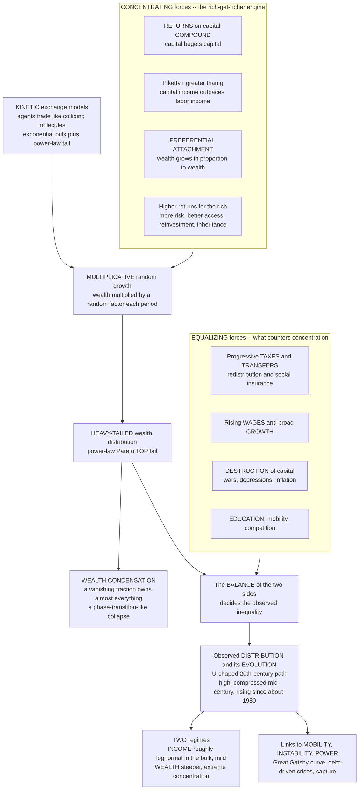

# 💰 Wealth and Income Inequality Dynamics

> [!abstract] TL;DR
> Complexity economics treats **wealth and income inequality not as a static snapshot but as the emergent, evolving outcome of dynamic economic processes** — a perpetual tug-of-war between **concentrating forces** ("rich get richer") and **equalizing forces** (redistribution, wage growth, the destruction of capital). The empirical facts to explain are that **income** is roughly **lognormal in the bulk with a power-law (Pareto) top tail** (the top ~1–3 percent follow a power law), while **wealth is far more unequal and far more heavy-tailed** than income (the top 1 percent and 0.1 percent own vast shares) — Pareto's original "80–20" discovery that a fifth hold four-fifths. The engine of concentration is **multiplicative growth**: returns on capital **compound**, capital begets capital, the wealthy access higher returns and reinvest, so wealth grows roughly **in proportion to wealth** — a **preferential-attachment / Gibrat process** that near-inevitably generates a heavy tail, sharpened by inheritance and by Piketty's condition **r greater than g** (when the return on capital exceeds the economy's growth rate, capital income outpaces labor income and wealth concentrates). Econophysics formalizes this with **kinetic wealth-exchange models** (agents trade like colliding gas molecules — Dragulescu–Yakovenko, Chakrabarti) and shows that under certain multiplicative rules wealth undergoes **"condensation"** onto a vanishing elite — a phase-transition-like collapse (Bouchaud–Mézard). What holds concentration in check is the **balance of equalizing forces**: growth and rising wages, progressive taxes and transfers, education and mobility, and the historical **destruction of capital** (wars, depressions, inflation produced the mid-20th-century "great compression"). When those forces weaken, inequality rises — the **U-shaped 20th-century path**, high before 1914, compressed mid-century, rising again since about 1980. Modeled with multiplicative-growth and agent-based kinetic-exchange approaches, this dynamic, path-dependent view illuminates the drivers of inequality, its links to **social mobility** (the "Great Gatsby curve"), **financial instability**, and **political power**, and the design of **tax, transfer, and redistribution** policy — one of the defining issues of the age.

---

## Intuition

**Analogy — a game of Monopoly.** Imagine four players who start the game exactly equal: same cash, same empty board, same dice. By pure luck, one player rolls well early, lands on and buys **Boardwalk and Park Place**, and puts up a couple of houses. From that moment the game quietly changes character. Every roll after tends to make that player **richer and everyone else poorer** — rivals landing on the developed squares hand over rent, which the leader plows into still more houses and hotels, which extract still more rent. The lead does not stay fixed; it **compounds**. There is no comeback mechanism baked into the rules, so the game grinds, with grim inevitability, toward the state everyone knows: **one player owns almost everything and the rest are bankrupt**. Nobody cheated. A tiny early advantage, run through a **multiplicative "capital begets capital" loop**, snowballed into total concentration.

Real wealth has exactly this built-in engine. Returns compound, capital earns more capital, and the already-wealthy can take more risk, access higher-return investments, and reinvest — so wealth tends to grow **roughly in proportion to how much wealth you already have**. Left alone, this multiplicative, self-reinforcing dynamic drives the distribution toward extreme concentration: a **power-law (Pareto) tail** in which a sliver of the population owns most of everything. The complexity-economics move is to stop asking "what is the equilibrium level of inequality?" and instead ask **"what dynamic processes generate and reshape the wealth distribution over time?"** — to see inequality as the **emergent outcome of a contest** between this concentrating engine and the equalizing forces (taxes, wages, growth, and the occasional violent destruction of capital) that push back against it. Understand the contest, and you understand why inequality rises in some eras and compresses in others — and where policy can tilt the board.

---

## How It Works

### Core Mechanics

**1. Inequality is a distribution, and the distribution is dynamic.** The object to explain is not a single number but the **shape of the wealth and income distributions and how they evolve**. Two summary regimes matter. **Income** is, across most of the population, roughly **lognormal** (the bulk — wages, salaries — is the multiplicative product of many small factors), but the **top ~1–3 percent obey a power law (Pareto)**: the survival function decays as `P(X > x) ~ x^(-α)`. **Wealth** is **more unequal and more heavy-tailed than income** — a steeper concentration, a fatter Pareto tail, and much larger top shares — because wealth accumulates the *integral* of income differences plus compounding returns plus inheritance. This is the modern face of **Pareto's** 1896 discovery that roughly **a fifth of the population held four-fifths of the wealth** in every society he measured — the original "80–20 rule," and one of the first empirical power laws.

**2. The measuring stick.** Inequality is quantified by the **Gini coefficient** (0 = perfect equality, 1 = one person owns everything; income Ginis run ~0.25–0.6, wealth Ginis ~0.6–0.9), by **top-share ratios** (share held by the top 10 / 1 / 0.1 percent — Piketty–Saez's workhorse), and by the **Pareto exponent α** of the tail (lower α = fatter tail = more extreme concentration; wealth typically has a *smaller* α than income). The **Lorenz curve** — cumulative share of wealth against cumulative share of population — draws the whole distribution; the Gini is twice the area between it and the diagonal of equality.

**3. The "rich get richer" engine — multiplicative growth.** The core concentrating mechanism is that **wealth grows multiplicatively**: each period a fortune is *multiplied* by a random growth factor `(1 + return)`, not *incremented* by a fixed sum. Returns **compound**, so capital begets capital; the wealthy can bear more risk, access higher-return assets (private equity, sophisticated management), and **reinvest** rather than consume, so their effective returns are systematically higher (Fagereng et al. document that the rich earn persistently higher returns). Wealth therefore grows **roughly in proportion to wealth** — the economic instance of **preferential attachment**, the same "rich get richer" rule that grows hubs in [[Small_World_and_Scale_Free_Networks|scale-free networks]] and is the dynamic cousin of [[Increasing_Returns_and_Path_Dependence|increasing returns]]. Multiplicative random growth (Gibrat's law) is *mathematically guaranteed* to spread wealth into a **heavy-tailed (lognormal, and with a lower reflecting barrier, power-law) distribution**. **Inheritance** amplifies and transmits the advantage across generations, steepening the tail further.

**4. Piketty's r greater than g.** A macro statement of the same engine: when the **return on capital r exceeds the economy's growth rate g**, capital income outpaces labor income, past wealth grows faster than current output, and the wealth-to-income ratio and top capital shares climb. `r > g` is not a law of nature but a *tendency* — it held for most of history, was interrupted by the 20th century's shocks, and Piketty argues has reasserted itself since ~1980. It is the built-in gravitational pull toward concentration that equalizing forces must actively resist.

**5. Kinetic wealth-exchange models — the econophysics lens.** Statistical physicists model an economy as a gas: **agents randomly meet and exchange wealth the way colliding molecules exchange energy**, subject to conservation (total wealth fixed in a closed exchange). The startling result (Dragulescu–Yakovenko, Chakrabarti–Chakrabarti): simple random-exchange rules with no production and no unfairness self-organize into a realistic distribution — an **exponential (Boltzmann–Gibbs) bulk** for the bottom ~95 percent, and, once agents have a **saving propensity** or heterogeneous saving rates, a **power-law (Pareto) tail** for the top. Money and wealth acquire a "statistical mechanics." Add multiplicative returns to the exchange and you get **wealth condensation** (Bouchaud–Mézard): under certain parameter regimes a **vanishing fraction of agents comes to own a finite fraction of all wealth** — a genuine **phase-transition-like** collapse, the mathematical face of the Monopoly endgame.

**6. The equalizing forces — the other side of the tug-of-war.** Concentration is not destiny because several forces push back. **Economic growth and rising wages** spread gains to labor. **Redistribution** — progressive income taxes, wealth and inheritance taxes, transfers, social insurance — directly recycles top wealth. **Education and social mobility** loosen the inheritance of position. **Competition and creative destruction** unseat incumbent fortunes. And, historically most powerfully, the **destruction of capital**: Piketty's central empirical finding is that the mid-20th-century "**great compression**" was driven not by benign policy alone but by **wars, the Great Depression, inflation, and the physical and financial annihilation of capital** between 1914 and 1945. Inequality is the **net result of the balance** between the multiplicative concentrating engine and these equalizing forces — and when the equalizing forces weaken (falling top tax rates, weaker unions, financialization), the engine reasserts itself and inequality rises. Hence the **U-shaped 20th-century trajectory**.

**7. Dynamics, mobility, and path dependence.** Because inequality is a *process*, two further distinctions matter. **Inequality of outcomes** (the wealth gap now) is not the same as **inequality of opportunity** (whether individuals can move between rungs); the two are linked by **social mobility**. Empirically, high inequality tends to go with *low* mobility — the "**Great Gatsby curve**" — because concentrated wealth is **inherited and sticky**, so advantage persists across generations. The distribution's shape today constrains the reachable distribution tomorrow: inequality is a **path-dependent, self-reinforcing** process, not a self-correcting one, which is precisely why complexity economics — with its tools of [[Emergence_of_Macro_from_Micro|emergence]], multiplicative dynamics, and agent-based modeling — has so much to say about it.

### Flow / Architecture



---

## Key Concepts

### Secondary (intuitive)

- **Inequality is a story, not a snapshot.** Don't ask "how unequal are we?" as if it were fixed. Ask "what is *pushing* wealth apart, what is *pulling* it back together, and which is winning right now?"
- **Rich get richer.** Money makes money: returns pile on top of returns, so a fortune grows faster the bigger it already is. Start a little ahead and, left alone, you end up *far* ahead — the Monopoly endgame.
- **A few own most of it.** Both income and (much more so) wealth end up **lopsided**: a small top group holds a huge share — Pareto's old "80–20" rule. Wealth is far more lopsided than income.
- **Something has to push back.** Taxes, rising wages, good schools, and — historically — wars and crashes that wipe out big fortunes are the forces that *stop* wealth from concentrating completely. Weaken them and the gap grows.
- **Where you start matters a lot.** If wealth is inherited and sticky, kids of the rich stay rich and kids of the poor stay poor — high inequality tends to trap people on their rung (low **mobility**).

### Undergraduate (formal)

- **The two-regime distribution.** Income ≈ **lognormal** bulk (the multiplicative product of many wage factors) with a **Pareto power-law tail** `P(X>x) ~ x^(-α)` for the top few percent. Wealth is a **fatter Pareto** (smaller α, larger top shares) than income. Measured by the **Gini coefficient** (area between the **Lorenz curve** and the equality diagonal, doubled), **top-share ratios**, and the **Pareto exponent**.
- **Multiplicative growth generates heavy tails.** If `w_{t+1} = g_t · w_t` with i.i.d. random growth `g_t`, then `log w_t` is a random walk, so `w_t` is **lognormal** with *ever-growing* variance — the Gini rises without bound (drift toward condensation). Add a lower reflecting barrier / minimum income and the stationary distribution becomes a **power law** (Champernowne, Kesten). This is **Gibrat's law** and the formal core of "rich get richer."
- **Piketty's r > g.** With capital share `α = r·β` where `β = W/Y` is the wealth-income ratio, and steady-state `β = s/g` (Harrod–Domar–Solow), a higher `r − g` raises capital's share and the top wealth share. Capital income concentrates because it is more unequally distributed than labor income.
- **Kinetic exchange (Boltzmann–Gibbs).** Conservative random pairwise money exchange yields an **exponential** stationary distribution `P(w) ~ exp(−w/T)` (maximum entropy at fixed mean, exactly like energy in an ideal gas). Introduce a **saving propensity** and heterogeneity and a **Pareto tail** emerges on top of a gamma-like bulk (Chakrabarti–Chatterjee).
- **The balance and the U-curve.** Observed inequality = net of concentrating (multiplicative returns, `r>g`, inheritance) minus equalizing (progressive tax `τ`, wage growth, capital destruction) forces. The 20th-century **U-shape** (Kuznets thought inequality would fall with development; Piketty–Saez showed it fell then *rose*) reflects the mid-century capital destruction and high top taxes giving way to their reversal after ~1980.

### Graduate (advanced)

- **The generalized Lotka / Bouchaud–Mézard model.** `dw_i = w_i(η_i dt + σ dB_i) + J Σ_j (w_j − w_i) dt`: multiplicative idiosyncratic growth (the concentrating term) plus a reallocation/exchange term `J` (the equalizing term). The **stationary distribution is a power law** `P(w) ~ w^(−1−μ)` with exponent `μ = 1 + 2J/σ²`. Small `J/σ²` (weak redistribution relative to return volatility) gives `μ → 1` — a **maximally fat tail**; `J = 0` gives **condensation** (no finite stationary distribution — a vanishing fraction holds a finite fraction of wealth, an ergodicity-breaking transition analyzed exactly like a Bose–Einstein / directed-polymer condensation).
- **Condensation as a phase transition.** In the mean-field limit the Bouchaud–Mézard model has a genuine transition: as `J/σ²` falls below a threshold, the participation ratio collapses and the **inverse participation ratio (Herfindahl) jumps** — wealth "condenses." This links inequality dynamics to [[Criticality_and_Phase_Transitions|critical phenomena]] and gives a physics of "winner-take-all."
- **Non-ergodicity and the ensemble/time-average gap (Peters).** Under multiplicative dynamics the **time-average growth rate of an individual `⟨log g⟩` differs from the ensemble-average `log⟨g⟩`** (Jensen's inequality). The economy is **non-ergodic**: the "expected wealth" (ensemble mean, dominated by a lucky few) systematically overstates the fate of the typical agent, whose wealth grows at the lower geometric rate. Peters' *ergodicity economics* argues this gap — not preferences alone — drives inequality and reframes redistribution as a mechanism that *restores* ergodicity and raises the *typical* growth rate.
- **Heterogeneous-agent macro (HANK).** Modern macro embeds the full wealth distribution: **Heterogeneous-Agent New-Keynesian** models (Kaplan–Moll–Violante) show the distribution is not a sideshow — the presence of "hand-to-mouth" households with high marginal propensity to consume means **distribution shapes aggregate demand and monetary-policy transmission**. Inequality feeds back into the macro dynamics, closing the loop between micro heterogeneity and macro outcomes (the theme of [[Bounded_Rationality_and_Heterogeneous_Agents|heterogeneous-agent]] complexity economics).
- **Differential returns and the "third force."** Empirically (Fagereng, Guiso, Malacrino, Pistaferri, 2020) returns to wealth are **persistent, heterogeneous, and increasing in wealth** — the rich do not merely have more capital, they earn a *higher rate* on it. This "scale dependence of returns" is a third concentrating force beyond savings differences and inheritance, and it steepens the Pareto tail directly.

---

## Python Demo

We build the **rich-get-richer engine** and then switch on a **redistributive force** to watch it tame the tail. A population of identical agents (all start with wealth 1) evolves under **multiplicative random growth** — each period every agent's wealth is *multiplied* by a random factor (identical rules, i.i.d. shocks, nobody cheats). We track the **Gini coefficient over time**, the **share held by the single richest agent** (the condensation signal), the final **Lorenz curves**, and the fat-tailed **wealth distribution**. Model **A (concentrating)** has pure multiplicative growth: inequality climbs and wealth **condenses**. Model **B (redistribution)** adds a Bouchaud–Mézard reallocation term — a flat wealth tax pooled and paid back as a per-capita transfer (a wealth-independent income) — which pulls the system to a **stationary, far less unequal, thinner-tailed** distribution. The contrast *is* the tug-of-war. `numpy` and `matplotlib` only.

```python
# Emergent wealth inequality from a simple multiplicative "rich get richer" engine,
# and how a redistributive force tames it. numpy + matplotlib only.
import numpy as np
import matplotlib
matplotlib.use("Agg")
import matplotlib.pyplot as plt

rng = np.random.default_rng(7)

def gini(w):
    """Gini coefficient of a non-negative wealth array."""
    w = np.sort(np.asarray(w, dtype=float))
    n = w.size
    s = w.sum()
    if n == 0 or s == 0:
        return 0.0
    idx = np.arange(1, n + 1)
    return (2.0 * (idx * w).sum()) / (n * s) - (n + 1) / n

def simulate(N, T, sigma, J, rng):
    """N agents, T periods. Each period:
       (1) MULTIPLICATIVE growth: w *= exp(sigma*Z - 0.5*sigma^2)  -> rich get richer.
       (2) REDISTRIBUTION (Bouchaud-Mezard reallocation, strength J):
           tax fraction J of every agent's wealth, pool it, pay it back per-capita.
           J = 0 -> pure concentration (condensation); J > 0 -> equalizing force.
       Total wealth is renormalized to N each step to isolate the DISTRIBUTION."""
    w = np.ones(N)
    gini_t = np.empty(T)
    top1_t = np.empty(T)          # share of the single RICHEST agent -> condensation
    for t in range(T):
        z = rng.normal(0.0, sigma, N)
        w *= np.exp(z - 0.5 * sigma**2)               # multiplicative random return
        if J > 0.0:                                    # equalizing reallocation
            w = (1.0 - J) * w + J * w.mean()           # flat tax -> equal per-capita transfer
        w = np.maximum(w, 1e-12)
        w *= N / w.sum()                               # hold the economy size fixed
        gini_t[t] = gini(w)
        top1_t[t] = w.max() / w.sum()
    return w, gini_t, top1_t

N, T, SIGMA = 2000, 1200, 0.14
wA, giniA, top1A = simulate(N, T, SIGMA, J=0.00, rng=rng)   # A: concentrating engine
wB, giniB, top1B = simulate(N, T, SIGMA, J=0.06, rng=rng)   # B: with redistribution

def top_share(w, frac=0.01):
    k = max(1, int(frac * w.size))
    return np.sort(w)[-k:].sum() / w.sum()

print("=" * 64)
print("EMERGENT WEALTH INEQUALITY from identical multiplicative rules")
print("=" * 64)
print(f"  agents = {N}, periods = {T}, return volatility sigma = {SIGMA}")
print(f"  A  concentrating (no redistribution): "
      f"Gini {giniA[-1]:.3f} | top 1% holds {100*top_share(wA):.0f}% | "
      f"richest agent alone {100*top1A[-1]:.1f}%")
print(f"  B  with redistribution (J = 0.06)   : "
      f"Gini {giniB[-1]:.3f} | top 1% holds {100*top_share(wB):.0f}% | "
      f"richest agent alone {100*top1B[-1]:.1f}%")
print("  -> pure multiplicative growth CONDENSES wealth; redistribution TAMES it.")

# ---------------------------------- figure ----------------------------------
fig, ax = plt.subplots(2, 2, figsize=(14, 10))
fig.suptitle("Wealth inequality dynamics: the rich-get-richer engine vs redistribution",
             fontsize=14, fontweight="bold")
t = np.arange(1, T + 1)

# (1) Gini RISING over time -> inequality emerges and grows
ax[0, 0].plot(t, giniA, color="#c0392b", lw=2, label="A: no redistribution")
ax[0, 0].plot(t, giniB, color="#2980b9", lw=2, label="B: with redistribution")
ax[0, 0].set_title("Inequality EMERGES over time (Gini)")
ax[0, 0].set_xlabel("time period"); ax[0, 0].set_ylabel("Gini coefficient")
ax[0, 0].set_ylim(0, 1); ax[0, 0].legend(); ax[0, 0].grid(alpha=0.3)

# (2) Share of the SINGLE richest agent -> "wealth condensation"
ax[0, 1].plot(t, 100 * top1A, color="#c0392b", lw=2, label="A: condenses onto one agent")
ax[0, 1].plot(t, 100 * top1B, color="#2980b9", lw=2, label="B: stays dispersed")
ax[0, 1].set_title("Wealth CONDENSATION: share of the single richest agent")
ax[0, 1].set_xlabel("time period"); ax[0, 1].set_ylabel("share of total wealth (%)")
ax[0, 1].legend(); ax[0, 1].grid(alpha=0.3)

# (3) Lorenz curves of the FINAL distributions
def lorenz(w):
    s = np.sort(w)
    cum = np.insert(np.cumsum(s), 0, 0) / s.sum()
    return np.linspace(0, 1, cum.size), cum
fA, cA = lorenz(wA); fB, cB = lorenz(wB)
ax[1, 0].plot([0, 1], [0, 1], "k--", lw=1.3, label="perfect equality")
ax[1, 0].plot(fA, cA, color="#c0392b", lw=2.2, label=f"A  (Gini {giniA[-1]:.2f})")
ax[1, 0].plot(fB, cB, color="#2980b9", lw=2.2, label=f"B  (Gini {giniB[-1]:.2f})")
ax[1, 0].fill_between(fA, cA, fA, color="#c0392b", alpha=0.12)
ax[1, 0].set_title("Lorenz curves of the final wealth distribution")
ax[1, 0].set_xlabel("cumulative share of population (poorest first)")
ax[1, 0].set_ylabel("cumulative share of wealth"); ax[1, 0].legend(loc="upper left")
ax[1, 0].grid(alpha=0.3)

# (4) Fat tail: complementary CDF (survival function) on log-log axes
def ccdf(w):
    s = np.sort(w)
    surv = 1.0 - np.arange(s.size) / s.size
    return s, surv
sA, pA = ccdf(wA); sB, pB = ccdf(wB)
ax[1, 1].loglog(sA, pA, color="#c0392b", lw=2, label="A: heavy (near power-law) tail")
ax[1, 1].loglog(sB, pB, color="#2980b9", lw=2, label="B: thinner tail")
ax[1, 1].set_title("Fat-tailed wealth distribution (survival function, log-log)")
ax[1, 1].set_xlabel("wealth (relative to mean)"); ax[1, 1].set_ylabel("P(Wealth > w)")
ax[1, 1].legend(); ax[1, 1].grid(alpha=0.3, which="both")

plt.tight_layout(rect=[0, 0, 1, 0.96])
plt.savefig("wealth_inequality_dynamics.png", dpi=110, bbox_inches="tight")
plt.show()
```

Expected output (values vary slightly with the seed; the qualitative story is robust):

```
================================================================
EMERGENT WEALTH INEQUALITY from identical multiplicative rules
================================================================
  agents = 2000, periods = 1200, return volatility sigma = 0.14
  A  concentrating (no redistribution): Gini 0.9xx | top 1% holds 8x% | richest agent alone 2x.x%
  B  with redistribution (J = 0.06)   : Gini 0.3xx | top 1% holds  x% | richest agent alone  0.x%
  -> pure multiplicative growth CONDENSES wealth; redistribution TAMES it.
```

Read the four panels as one argument. **Top-left (Gini):** everyone starts perfectly equal, yet inequality **emerges and climbs** purely from identical multiplicative rules — the red (no-redistribution) curve marches toward a Gini near 1, while the blue (redistribution) curve **plateaus** at a modest, stationary level. **Top-right (condensation):** with no equalizing force the share owned by the *single richest agent* grows relentlessly — the population's wealth is **condensing onto a vanishing elite**, the Bouchaud–Mézard collapse and the Monopoly endgame; redistribution keeps that share negligible. **Bottom-left (Lorenz):** the red curve bows far below the equality diagonal (a near-total concentration), the blue only modestly. **Bottom-right (fat tail):** on log-log axes the red survival function has a **heavy, near-straight (power-law) tail** — a few agents orders of magnitude above the mean — while redistribution **bends the tail down**, thinning the extreme. Same engine, same shocks; the only difference is whether an equalizing force is switched on — and that single switch is the entire distance between "one player owns the board" and "a livable spread."

---

## Real-World Applications

> **Example — global wealth reports and the Pareto top.** Every year Credit Suisse / UBS and the World Inequality Database (Piketty, Saez, Zucman, Chancel) publish wealth pyramids that are textbook realizations of this note: a broad base holding almost nothing, a lognormal middle, and a **Pareto top** where the richest 1 percent hold roughly 45 percent of global wealth and the top 0.1 percent a wildly disproportionate slice. The **billionaire tail** fits a power law with a small exponent — exactly what a multiplicative, differential-returns process predicts — and the *steepness* of that tail is the empirical footprint of the rich-get-richer engine.

- **Designing redistribution.** Kinetic-exchange and multiplicative-growth models are used to *evaluate* redistribution: how much does a given progressive tax, wealth tax, inheritance tax, or **universal basic income** flatten the Lorenz curve? The models make precise the demo's lesson — a wealth-independent income floor and a reallocation term set the stationary Pareto exponent — informing debates over Saez–Zucman wealth taxes and UBI pilots. See the planned sibling `Complexity_Economics_and_Public_Policy`.
- **Explaining the post-1980 rise.** The framework decomposes the observed rise in inequality into weakening equalizing forces (falling top marginal tax rates, declining unionization, **financialization**) and strengthening concentrating ones (globalization, skill-biased technical change, **superstar firms** with winner-take-most markets — the planned sibling `Firm_Size_and_City_Size_Distributions`). It reframes "why is inequality rising?" as "which side of the tug-of-war shifted?"
- **Heterogeneous-agent macro and policy transmission.** HANK models (Kaplan–Moll–Violante) put the wealth distribution at the center of macroeconomics: because low-wealth "hand-to-mouth" households have high marginal propensity to consume, **the shape of the distribution changes how fiscal stimulus and interest-rate moves ripple through aggregate demand** — a direct application to central-bank and stimulus design.
- **Inequality, instability, and crises.** A strand of complexity economics links rising inequality to **financial fragility**: stagnant middle incomes plus concentrated wealth push households to borrow, inflating debt and leverage that precede crises (Rajan, Kumhof–Rancière). This ties the distribution to [[Financial_Networks_and_Systemic_Risk|systemic risk]] and the planned sibling `Econophysics_and_Statistical_Mechanics_of_Markets`.
- **Mobility and place.** The **Great Gatsby curve** and Raj Chetty's mobility atlases operationalize the "opportunity vs outcome" distinction: measuring how sticky the distribution is across generations and geographies, and where policy (schools, neighborhoods, transfers) can raise the odds of moving up — the sociological face treated in [[Poverty_Social_Mobility_and_Life_Chances|social mobility and life chances]].

---

## Common Pitfalls

- **Treating inequality as a static level instead of a dynamic process.** The whole complexity-economics point is that inequality is the *emergent, evolving outcome* of concentrating versus equalizing forces. Reporting a single Gini and asking "is it the equilibrium?" misses the mechanism; the right questions are *what is driving concentration, what is resisting it, and which way is it moving?*
- **Conflating income and wealth inequality.** They are different distributions with different dynamics. **Wealth is far more unequal and more heavy-tailed than income** (it integrates income gaps plus compounding returns plus inheritance). Quoting an income Gini as if it described wealth badly understates concentration.
- **Reading "emerges from simple rules" as "therefore fair or natural."** The demo and kinetic models show inequality *can* arise from symmetric rules and luck alone — a statement about **sufficiency of mechanisms**, not a normative verdict, and not proof that real inequality lacks exploitation, discrimination, or rent-seeking. Overreaching from a toy model to a political claim (in either direction) is the most serious misuse.
- **Ignoring non-ergodicity — the ensemble mean is a trap.** Under multiplicative growth the **ensemble-average wealth** (dominated by a few lucky paths) grows faster than the **typical agent's** wealth. Reasoning about the "expected" or "representative" household with an ensemble mean systematically overstates the typical fate and hides exactly the inequality you are trying to measure. Use the time-average / geometric growth rate.
- **Confusing lognormal with power-law tails.** The bulk is lognormal; only the *top tail* is a true power law. Fitting a single lognormal misses the fat tail (and understates top shares); fitting a single power law misses the bulk. The two-regime structure is the point, and the tail exponent is what makes wealth "extreme."
- **Assuming markets self-correct toward equality.** Unlike a diminishing-returns commodity market, the wealth process is **self-reinforcing** (positive feedback, preferential attachment): left alone it concentrates, it does not revert. Equality requires *active* equalizing forces; expecting mean-reversion is the same error as expecting a monopoly to competify itself.
- **Forgetting that the "great compression" was largely destruction, not design.** Piketty's uncomfortable finding is that the 20th century's dramatic fall in inequality owed much to **wars, depression, and inflation destroying capital**, not to gentle policy alone. Assuming inequality "naturally" falls with growth (the Kuznets story) ignores that the compression was historically contingent — and reversible, as the post-1980 rise shows.

---

## Related Concepts

**Within this vault (Complexity Economics):**

- [[Power_Laws_and_Heavy_Tails_in_Economics]] — the general mathematics of the fat tail (Pareto, Zipf, Kesten); this note is its flagship application to the wealth and income distribution.
- [[The_Sugarscape_Model]] — the founding agent-based demonstration that a fat-tailed, Pareto-like wealth distribution *emerges* from heterogeneous agents under identical rules; the miniature version of this note's result.
- [[Increasing_Returns_and_Path_Dependence]] — the general positive-feedback / "success breeds success" dynamic of which "rich get richer" is the wealth-accumulation instance; both produce winner-take-all outcomes.
- [[Economies_as_Complex_Adaptive_Systems]] — the parent framing: the economy as an out-of-equilibrium, emergent system whose *distributions* are the objects to explain.
- [[Bounded_Rationality_and_Heterogeneous_Agents]] — heterogeneity in saving, returns, and endowments is the raw material the multiplicative engine amplifies into a heavy tail; the basis of HANK-style modeling.
- [[Emergence_of_Macro_from_Micro]] — the wealth distribution is a macro pattern that emerges from micro accumulation and exchange, not from a representative agent.
- [[Agent_Based_Modeling_in_Economics]] — the method behind kinetic wealth-exchange and multiplicative-growth simulations of inequality.
- [[Financial_Networks_and_Systemic_Risk]] — the channel by which concentrated wealth and debt link inequality to instability and crises.

**Systems Thinking and Complexity:**

- [[Small_World_and_Scale_Free_Networks]] — preferential attachment ("the rich get richer") is the identical mechanism that grows network hubs and heavy tails; wealth is preferential attachment acting on capital.
- [[Nonlinearity_and_Feedback]] — wealth accumulation is a reinforcing (positive) feedback loop; the sign of the feedback is why it concentrates rather than self-corrects.
- [[Feedback_Loops_and_Causality]] — the "capital begets capital" reinforcing loop is the structural core of the concentrating engine.
- [[Criticality_and_Phase_Transitions]] — wealth condensation is a phase-transition-like collapse (Bouchaud–Mézard); the statistical-physics lens on extreme concentration.
- [[Fractals_and_Self_Similarity]] — power-law (Pareto) tails are scale-free and self-similar; the fat tail has no characteristic scale.
- [[Complex_Adaptive_Systems]] — inequality as an emergent property of many interacting, adapting agents rather than a designed or equilibrium outcome.
- [[Economic_and_Social_Complexity]] — the applied systems-thinking treatment of economies as emergent, path-dependent, unequal systems.

**Sociology (the human stakes):**

- [[Social_Class_and_Stratification]] — the sociological structure that the skewed wealth distribution both reflects and reproduces.
- [[Poverty_Social_Mobility_and_Life_Chances]] — the "opportunity vs outcome" distinction and the Great Gatsby curve; how sticky, inherited wealth traps life chances.
- [[Global_Inequality_and_Development]] — Pareto concentration at the planetary scale and across nations.
- [[Political_Sociology_and_Social_Power]] — concentrated wealth becomes concentrated political power (capture, polarization) — the political consequence of the tail.
- [[Health_Inequality_and_Medical_Sociology]] — the Wilkinson–Pickett evidence that inequality itself, beyond poverty, damages health and social cohesion.

**Growth, policy, and finance:**

- [[Solow_Growth_Model]] — the growth rate `g` in Piketty's `r > g`, and the diminishing-returns benchmark against which capital concentration is defined.
- [[Endogenous_Growth_Theory]] — how the growth rate that must "outrun" `r` is itself generated; the other side of the r-versus-g comparison.
- [[Tax_Policy]] — progressive taxation, wealth and inheritance taxes: the primary policy lever of the equalizing side of the tug-of-war.
- [[The_Power_of_Compounding]] — the personal-finance face of the very compounding-returns mechanism that, aggregated, drives multiplicative wealth concentration.
- [[Common_Probability_Distributions]] — the lognormal (bulk) and Pareto / power-law (tail) distributions that describe income and wealth.

**Planned siblings in this section (referenced above in prose, not yet written):** `Firm_Size_and_City_Size_Distributions` (Zipf's law and superstar firms — the same power laws elsewhere), `Econophysics_and_Statistical_Mechanics_of_Markets` (the kinetic-exchange and statistical-mechanics toolkit), and `Complexity_Economics_and_Public_Policy` (tax, transfer, and redistribution design when markets concentrate).

---

## Review Questions

1. **(Conceptual)** Complexity economics insists on studying inequality as a **dynamic process** rather than a static level. Explain precisely what the "**rich get richer**" engine is (name **multiplicative growth, compounding returns, preferential attachment, and Piketty's r > g**), why it *mathematically* tends to produce a **heavy-tailed / power-law** wealth distribution rather than a symmetric one, and why wealth ends up **more unequal and more heavy-tailed than income**.

2. **(Scenario)** A country's wealth Gini has risen steadily for four decades. One adviser says "this is a natural, self-correcting cycle — the market will revert." Using the **balance of concentrating versus equalizing forces**, the **U-shaped 20th-century path**, and Piketty's finding about the **destruction of capital**, explain why the "self-correcting" claim is dangerous, what would actually have to change to compress the distribution, and — referencing the Python demo's redistribution switch — what a policy that "restores the equalizing force" would look like and how it alters the Lorenz curve and Pareto tail.

3. **(Trade-off / synthesis)** In the demo, pure multiplicative growth drives the Gini toward 1 and **condenses** wealth onto a single agent, while a small redistribution term produces a **stationary, thinner-tailed** distribution. Relate this to the **Bouchaud–Mézard** exponent `μ = 1 + 2J/σ²` and to **non-ergodicity** (ensemble mean vs typical agent). What does this imply about the *unavoidability* of some concentration under free multiplicative dynamics, the *level* of redistribution needed to hold a target Pareto exponent, and the trade-off between equalizing force and incentives to accumulate?

---

## Sources

- [Piketty, T. (2014). *Capital in the Twenty-First Century*. Harvard University Press](https://www.hup.harvard.edu/books/9780674430006) — r > g, the U-shaped path, and the destruction of capital.
- [Bouchaud, J.-P. & Mézard, M. (2000). "Wealth condensation in a simple model of economy." *Physica A*, 282, 536–545](https://doi.org/10.1016/S0378-4371%2800%2900205-3) — multiplicative growth, reallocation, and the condensation transition.
- [Dragulescu, A. & Yakovenko, V. M. (2000). "Statistical mechanics of money." *European Physical Journal B*, 17, 723–729](https://doi.org/10.1007/s100510070114) — the Boltzmann–Gibbs kinetic-exchange model of money.
- [Chakrabarti, B. K., Chakraborti, A., Chakravarty, S. R. & Chatterjee, A. (2013). *Econophysics of Income and Wealth Distributions*. Cambridge University Press](https://www.cambridge.org/9781107013445) — saving-propensity kinetic models and the Pareto tail.
- [Fagereng, A., Guiso, L., Malacrino, D. & Pistaferri, L. (2020). "Heterogeneity and Persistence in Returns to Wealth." *Econometrica*, 88(1), 115–170](https://doi.org/10.3982/ECTA14835) — the rich earn persistently higher returns.
- [Benhabib, J. & Bisin, A. (2018). "Skewed Wealth Distributions: Theory and Empirics." *Journal of Economic Literature*, 56(4), 1261–1291](https://doi.org/10.1257/jel.20161390) — how multiplicative and idiosyncratic mechanisms generate the tail.

---

#complexity-economics #inequality #wealth-distribution #pareto #rich-get-richer
