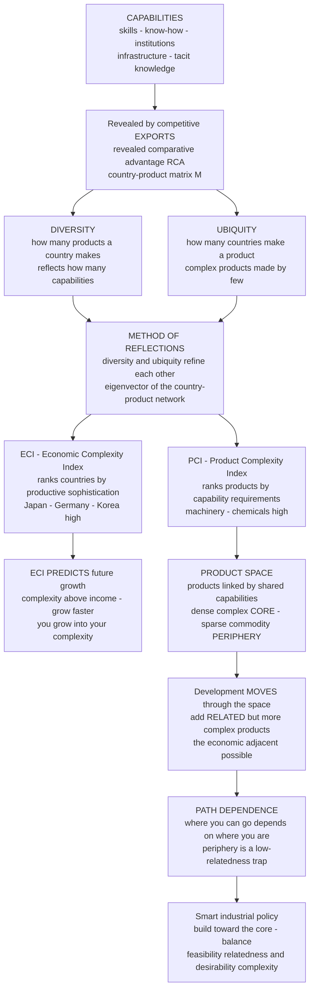

# 🧬 Economic Complexity and the Product Space

> [!abstract] TL;DR
> **Economic complexity** (César **Hidalgo** and Ricardo **Hausmann**) measures the sophistication of an economy not by *what resources it has* but by *what it can make*. A country's productive knowledge — its **capabilities** (skills, know-how, technologies, institutions, infrastructure, tacit routines) — is largely invisible, but it is *revealed* by what the country **exports competitively**. Combine two observable numbers — the **diversity** of a country's exports (how *many* products, reflecting how many capabilities it holds) and the **ubiquity** of those products (how many *other* countries also make them; complex products need rare capabilities, so few countries make them) — and iterate them against each other via the **method of reflections** (mathematically an eigenvector of the country-product network). The result is the **Economic Complexity Index (ECI)**, which ranks countries by productive sophistication (Japan, Germany, Switzerland, South Korea high; commodity exporters low) and a **Product Complexity Index (PCI)** ranking products. The striking empirical payoff: **ECI strongly predicts future growth** — countries whose complexity *exceeds* their current income tend to grow faster, "growing into" their latent capabilities. Development is theorized as **moving through the product space** — a network of products linked by shared capabilities, with a densely-connected complex *core* (machinery, chemicals, electronics) and a sparse *periphery* (raw commodities) — by acquiring capabilities to make **related but more complex** products (the economic **adjacent possible**). This is **path-dependent** (where you can go depends on where you are) and can trap commodity exporters in the sparse periphery. Embodying complexity economics' themes of emergence, networks, recombination, and path dependence, it has become a hugely influential, data-driven framework for growth diagnostics and smart industrial policy — the *Atlas of Economic Complexity* and the *Observatory of Economic Complexity*.

---

## Intuition

**Analogy — why is South Korea rich and Ghana poor?** In 1960 the two countries had almost identical income per capita; both were poor, agricultural, recently decolonized. Six decades later South Korea builds Samsung phones, Hyundai cars, and cutting-edge semiconductors and is among the world's richest nations, while Ghana still exports mostly cocoa, gold, and oil and remains poor. The difference is *not* that Korea discovered more of some single resource — Korea has almost no natural resources, and Ghana has plenty. The difference is **what each country learned to make**. Think of a country as a card player holding a hand of **capabilities** — bits of productive know-how, trained workers, functioning institutions, logistics, tacit shop-floor routines. You cannot see the hand directly. But you *can* see the products the player lays on the table — its exports — and each product is like a **recipe** that only comes together if the player holds *all* the required ingredients. A country that makes only cocoa and crude oil is holding a few common cards; a country that makes jet engines, MRI scanners, and microchips is holding a *large hand including rare cards that almost nobody else has*.

Rich countries make **many** things, including **complex** things that few others can make; poor countries make **few, simple** things that everyone can make. And crucially, a country does not leap from cocoa to microchips overnight. It grows by acquiring **new capabilities to make nearby products** — climbing through a **product space**, one adjacent step at a time, from what it already knows how to make toward things that require just a few *more* capabilities. This picture — capabilities as the hidden hand, exports as the revealed cards, and development as a walk through a network of the makeable — is what economic complexity makes measurable, and it turns "why do nations grow?" from a story about resources into a story about **productive knowledge**.

---

## How It Works

### Core mechanics

**1. Capabilities are the hidden determinant of what a country can produce.** The foundational idea: what a country makes depends on the **capabilities** it possesses — the skills, know-how, technologies, machines, institutions, infrastructure, and *tacit* knowledge embedded in its people and firms. Most of this knowledge is not written down; it lives in the coordinated routines of teams and cannot be shipped in a container or downloaded — it is **tacit, hard to transfer, and accumulated slowly**, person by person, firm by firm, over years. A product requires a *specific bundle* of capabilities, exactly like a recipe needing many ingredients: miss one and the dish fails. So **products are the observable "phenotype" that reveals the invisible "genotype" of capabilities**, and *development is the accumulation of capabilities* — not just of capital or years of schooling, but of the collective, distributed ability to *do complicated things*.

**2. Capabilities are revealed through exports.** You cannot measure a nation's capabilities directly, but you can **infer** them from what it exports **competitively**. The standard filter is **revealed comparative advantage (RCA)**: a country is counted as a competitive maker of a product if it exports *more than its "fair share"* of that product (its share of world exports in the product exceeds its share of world exports overall — RCA greater than 1). This yields a binary **country-product matrix** $M_{cp}$ ($1$ if country $c$ makes product $p$ competitively, else $0$). Two summary statistics of this matrix carry the signal:
- **Diversity** $= \sum_p M_{cp}$ — how *many* different products a country makes. A country that makes many things must hold many capabilities.
- **Ubiquity** $= \sum_c M_{cp}$ — how *many countries* make a given product. Products that need **rare capabilities** are made by **few** countries (low ubiquity); products anyone can make (raw commodities) are highly ubiquitous.

**3. The clever combination — complexity is diversity refined by ubiquity.** Diversity alone is misleading, and so is ubiquity alone. An oil state can export a *diverse* basket if it also grows some crops and mines some ore, yet still hold few sophisticated capabilities. A rare product might be rare merely because it is *geographically* scarce (a specific gem), not because it is *hard*. The trick is to let the two numbers **correct each other**: a country is complex if it makes a *diverse* set of products **and** those products are made by *few other* countries; a product is complex if it is made by *few* countries **and** those countries are themselves *diverse*. This mutual refinement is the heart of the measurement.

**4. The method of reflections and the ECI.** Hidalgo and Hausmann formalize the mutual refinement as a **recursive algorithm — the method of reflections**. Start from level 0 with diversity (for countries) and ubiquity (for products), then iterate:
$$k_{c,n} = \frac{1}{k_{c,0}}\sum_p M_{cp}\, k_{p,\,n-1}, \qquad k_{p,n} = \frac{1}{k_{p,0}}\sum_c M_{cp}\, k_{c,\,n-1}.$$
A country's refined complexity is the **average ubiquity of its products** (weighting by how complex those products are), and a product's refined complexity is the **average diversity of its makers**. Iterating to convergence and standardizing yields the **Economic Complexity Index (ECI)** for countries and the **Product Complexity Index (PCI)** for products. Mathematically this is an **eigenvector** of the country-product network: the ECI is the (standardized) eigenvector associated with the *second-largest* eigenvalue of the row-stochastic country-similarity matrix $\tilde M_{cc'} = \sum_p M_{cp}M_{c'p}/(k_{c,0}k_{p,0})$ (the leading eigenvector is trivial/constant). It is a **network measure of productive sophistication**. The ECI ranks countries — Japan, Germany, Switzerland, South Korea, Singapore high; single-commodity exporters low — and the PCI ranks products — machinery, chemicals, electronics, precision instruments high; raw materials and simple agriculture low.

**5. ECI predicts growth — "you grow into your complexity."** The empirical result that made the framework famous: a country's **ECI strongly predicts its future economic growth**. Countries whose **complexity exceeds their income level** — they have capabilities not yet fully monetized — tend to **grow faster and catch up**; countries whose income runs ahead of their complexity (often resource-rich states) tend to stagnate or fall back. ECI **out-predicts** many standard growth determinants (measures of institutions, competitiveness, human capital) in horse-race regressions. Complexity acts as **latent growth potential**: development is the process of an economy *growing into* the productive structure its capabilities already imply. This makes ECI a genuine **data-driven growth diagnostic**, not just a descriptive index.

**6. The product space — a network of what is makeable.** Capabilities are shared across products: the know-how for making shirts overlaps with that for making blouses, and the know-how for cars overlaps with trucks and machinery. Hidalgo, Klinger, Barabási, and Hausmann map this as the **product space**, a network whose **nodes are products** and whose **edges are relatedness** — two products are linked if they tend to be **co-exported** by the same countries, a revealed proxy for **requiring similar capabilities** (the standard *proximity* metric is the minimum of the two conditional co-export probabilities). The empirical product space has a **core-periphery structure**: a densely-connected **core** of complex products — machinery, chemicals, electronics, vehicles — and a sparse, loosely-connected **periphery** of less sophisticated products — raw commodities, simple agriculture. A country "occupies" the products it makes and can most easily move to **nearby, related** products.

**7. Development as movement through the product space.** The dynamic theory: countries develop by **acquiring the capabilities to make new products**, and they most easily add products **related to what they already make** — short jumps in the product space, because a related product reuses most of the capabilities they already hold and requires only a few new ones. This is the **principle of relatedness**, the economic realization of the **adjacent possible** — the set of new products reachable in one step from a country's current capability base (developed further in the sibling note `Innovation_Recombination_and_the_Adjacent_Possible`). Because next steps depend on current position, development is **path-dependent**: *where you can go depends on where you are* (the general mechanism of `Increasing_Returns_and_Path_Dependence`). Herein lies the **danger of the periphery**: commodity exporters sit in a sparse region with **few nearby steps** toward complexity, a low-relatedness **poverty trap**, while economies already near the well-connected core can diffuse across many complex products at once. The strategy is to build, step by step, *toward the core*.

### Diagram — from capabilities to growth via the product space



---

## Key Concepts

### Secondary (intuitive)

- **A country is what it can make.** Wealth comes less from resources you *have* than from complicated things you *know how to build*. Korea got rich on know-how, not minerals.
- **Exports reveal the hidden hand.** You cannot see a country's skills directly, but the products it sells reveal them — each product is a recipe that needs many ingredients.
- **Diversity and rarity.** Rich countries make **many** things, including **complex** things only a **few** others can make. Poor countries make **few, common** things.
- **Climbing, not leaping.** Countries develop by adding products *close* to what they already make — one adjacent step at a time — not by jumping straight to microchips.
- **Stuck at the edge.** Commodity exporters sit in a lonely corner of the "map of the makeable," with few easy steps toward richer products — a trap.

### Undergraduate (formal)

- **The country-product matrix $M_{cp}$.** Binary matrix, $1$ if country $c$ exports product $p$ with **revealed comparative advantage** (RCA $>1$). All measures are functions of this matrix.
- **Diversity and ubiquity.** Diversity $k_{c,0}=\sum_p M_{cp}$ (row sums); ubiquity $k_{p,0}=\sum_c M_{cp}$ (column sums). Complexity is these two refined against each other.
- **Method of reflections / ECI & PCI.** The recursive refinement $k_{c,n}=\frac1{k_{c,0}}\sum_p M_{cp}k_{p,n-1}$ (and symmetrically for products); the standardized limiting signal is the ECI (countries) and PCI (products). Equivalently the **second eigenvector** of the reflection matrix.
- **The product space and proximity.** Products are nodes; the edge weight (**proximity**) between $p$ and $q$ is $\phi_{pq}=\min\big(P(M_p\mid M_q),\,P(M_q\mid M_p)\big)$ — the minimum conditional probability that a country making one also makes the other. Core-periphery topology.
- **Relatedness density and the adjacent possible.** A country's **density** around a product it does *not* yet make, $\omega_{cp}=\frac{\sum_q \phi_{pq}M_{cq}}{\sum_q \phi_{pq}}$, is the share of that product's "capability neighborhood" the country already occupies; high density $\Rightarrow$ the product is in the country's **adjacent possible** and likely to be added next.

### Graduate (advanced)

- **Eigenvector formulation and its subtleties.** The ECI is the eigenvector of the second-largest eigenvalue of $\tilde M = D_c^{-1}M D_p^{-1} M^{\top}$ (row-stochastic; leading eigenvalue $1$ with constant eigenvector). Mealy, Farmer & Teytelboym (2019) show the method of reflections and ECI are equivalent to a **spectral clustering / diffusion-map** embedding of the bipartite network — ECI is a dimensionality reduction that separates countries by the *similarity of their export baskets*, which clarifies both what it measures and its limitations.
- **The Fitness–Complexity alternative.** Tacchella, Cristelli, Pietronero et al. argue the *linear* averaging of the method of reflections is ill-suited to a **nested** matrix: it lets a country making one rare product look "complex." Their **non-linear Fitness–Complexity algorithm** makes a product's complexity dominated by its *least* fit maker (a min-like coupling), better handling nestedness, and defines country **Fitness** and product **Complexity** as fixed points of a non-linear map. Knowing this debate distinguishes a rigorous treatment from a slogan.
- **Nestedness of $M_{cp}$.** Empirically the country-product matrix is strongly **nested** (triangular): diverse countries make almost everything, ubiquitous products are made by almost everyone, and the makers of a rare product are a *subset* of the makers of common products. Nestedness is the structural signature that makes diversity+ubiquity informative and underlies both the ECI and the product space.
- **ECI in growth regressions.** In panel growth regressions, ECI (or the *complexity gap* ECI-minus-income) enters with a large, robust positive coefficient and raises out-of-sample predictive power well beyond standard controls — the operational meaning of "countries grow into their complexity." The mechanism is **capability accumulation with relatedness constraints**, not a black-box correlation.
- **Relatedness as a general principle.** The **principle of relatedness** (Hidalgo et al. 2018) generalizes beyond exports: regions/cities are more likely to enter *any* activity — industries, technologies (patents), research fields, occupations — that is *related* to what they already do. The product space is one instance of a family of **relatedness networks**; the same density-predicts-entry law holds across them.

---

## Python Demo

We reconstruct the economic-complexity pipeline from scratch on a synthetic economy. **Part (a)** builds a binary **country-product matrix** $M_{cp}$ with a realistic **nested / triangular** structure (diverse countries make everything; ubiquitous products are made by everyone) by giving each country a *capability endowment* and each product a *complexity requirement*, and setting $M_{cp}=1$ when the country's endowment clears the product's requirement. We compute **diversity** and **ubiquity**, then run the **method of reflections** (as the second eigenvector of the reflection matrix) to obtain the **ECI** and **PCI**, showing the ECI **ranks countries by the sophistication of their productive structure**. **Part (b)** builds the **product space**: a **proximity** matrix from co-export, embeds it in 2D, and shows complex products **cluster** while commodities sit at the sparse periphery; it then computes **relatedness density** and shows a country is far more likely to add products **adjacent** to what it already makes — the **adjacent possible**. **Part (c)** shows **ECI predicting growth**: countries whose complexity exceeds their income grow faster. Uses only `numpy` and `matplotlib`.

```python
# Economic complexity from a country-product export matrix.
# (a) nested M_cp -> diversity, ubiquity -> method of reflections -> ECI, PCI
# (b) product space: proximity, 2D embedding, relatedness density (adjacent possible)
# (c) ECI predicts growth: complexity above income -> faster growth
import numpy as np
import matplotlib.pyplot as plt

rng = np.random.default_rng(7)

# ----------------------------------------------------------------------
# (a) BUILD a nested country-product matrix M_cp
#     endowment a_c per country, requirement b_p per product;
#     country makes product iff its endowment clears the requirement.
#     -> diverse countries make everything, ubiquitous products made by all.
# ----------------------------------------------------------------------
C, P = 30, 45
a = np.sort(rng.uniform(0, 1, C))[::-1]        # country 0 = most capable (diverse)
b = np.sort(rng.uniform(0, 1, P))              # product 0 = simplest (ubiquitous)
noise = rng.normal(0, 0.05, (C, P))
M = ((a[:, None] + noise) >= b[None, :]).astype(float)   # nested/triangular
for c in range(C):                              # guarantee no empty row
    if M[c].sum() == 0:
        M[c, np.argmin(b)] = 1.0
for p in range(P):                              # guarantee no empty column
    if M[:, p].sum() == 0:
        M[np.argmax(a), p] = 1.0

diversity = M.sum(axis=1)                        # products per country
ubiquity  = M.sum(axis=0)                        # countries per product

# ----- method of reflections as the 2nd eigenvector (ECI, PCI) -----
def second_eigvec(S):
    vals, vecs = np.linalg.eig(S)
    order = np.argsort(vals.real)[::-1]          # leading (=1) is trivial/constant
    v = vecs[:, order[1]].real
    return (v - v.mean()) / v.std()              # standardize

kc, kp = diversity, ubiquity
Scc = (1.0 / kc)[:, None] * ((M / kp[None, :]) @ M.T)   # row-stochastic country matrix
Spp = (1.0 / kp)[:, None] * ((M / kc[:, None]).T @ M)   # product matrix
eci = second_eigvec(Scc)
pci = second_eigvec(Spp)
if np.corrcoef(eci, diversity)[0, 1] < 0: eci = -eci    # sign: ECI up with diversity
if np.corrcoef(pci, ubiquity)[0, 1]  > 0: pci = -pci    # sign: PCI down with ubiquity

rank = np.argsort(eci)[::-1]
print("ECI ranking (top 5 most complex economies):")
for r in rank[:5]:
    print(f"  country {r:2d}:  ECI={eci[r]:+.2f}  diversity={int(diversity[r])}")
print("ECI ranking (bottom 3 - commodity-like):")
for r in rank[-3:]:
    print(f"  country {r:2d}:  ECI={eci[r]:+.2f}  diversity={int(diversity[r])}")

# ----------------------------------------------------------------------
# (b) PRODUCT SPACE: proximity = min conditional co-export probability.
#     phi_pq = (# countries making both) / max(ubiquity_p, ubiquity_q)
# ----------------------------------------------------------------------
co   = M.T @ M                                    # co-export counts (P x P)
prox = co / np.maximum.outer(ubiquity, ubiquity)  # proximity in [0, 1]
np.fill_diagonal(prox, 0.0)

# classical MDS on distance = 1 - proximity -> 2D layout of the product space
D = 1.0 - prox
np.fill_diagonal(D, 0.0)
J = np.eye(P) - np.ones((P, P)) / P
Bm = -0.5 * J @ (D ** 2) @ J
w, V = np.linalg.eigh(Bm)
idx = np.argsort(w)[::-1][:2]
xy = V[:, idx] * np.sqrt(np.maximum(w[idx], 1e-9))

# relatedness density for ONE developing country: omega_cp = sum_q phi_pq M_cq / sum_q phi_pq
dev = rank[C // 2]                                # a mid-complexity country
denom = prox.sum(axis=1)
omega = (prox @ M[dev]) / np.where(denom > 0, denom, 1.0)
has = M[dev] > 0                                  # products it already makes
print(f"\nCountry {dev} (mid-ECI): mean relatedness density of products it ALREADY makes "
      f"= {omega[has].mean():.2f}  vs NOT-yet-made = {omega[~has].mean():.2f}")

# ----------------------------------------------------------------------
# (c) ECI PREDICTS GROWTH: income reflects complexity imperfectly;
#     the complexity-minus-income gap drives subsequent growth.
# ----------------------------------------------------------------------
income = (eci + rng.normal(0, 1.0, C))            # noisy proxy for current income
income = (income - income.mean()) / income.std()
gap    = eci - income                             # latent, unmonetized complexity
growth = 2.5 * gap + rng.normal(0, 0.6, C)        # "grow into your complexity"

# ----------------------------------------------------------------------
# VISUALIZE
# ----------------------------------------------------------------------
fig, ax = plt.subplots(2, 3, figsize=(16.5, 10))

# panel 1: nested country-product matrix
ax[0, 0].imshow(M, cmap="Greys", aspect="auto", interpolation="nearest")
ax[0, 0].set_title("Nested country-product matrix M\ndiverse countries make everything")
ax[0, 0].set_xlabel("products (simple -> complex)")
ax[0, 0].set_ylabel("countries (diverse -> specialized)")

# panel 2: diversity vs ubiquity intuition (colored by ECI / PCI)
sc2 = ax[0, 1].scatter(diversity, [eci[c] for c in range(C)], c=eci, cmap="viridis",
                       s=60, edgecolor="k", lw=0.4)
ax[0, 1].set_xlabel("diversity (products per country)")
ax[0, 1].set_ylabel("ECI")
ax[0, 1].set_title("Diversity underlies complexity\n(refined by product ubiquity)")
ax[0, 1].grid(alpha=0.3)
fig.colorbar(sc2, ax=ax[0, 1], fraction=0.046, label="ECI")

# panel 3: ECI ranking of countries
colors = plt.cm.RdYlGn((eci[rank] - eci.min()) / (eci.max() - eci.min()))
ax[0, 2].barh(range(C), eci[rank][::-1], color=colors[::-1])
ax[0, 2].set_title("ECI ranking of countries\ntop = most complex productive structure")
ax[0, 2].set_xlabel("Economic Complexity Index")
ax[0, 2].set_ylabel("rank (bottom = complex)")

# panel 4: product space network (color = PCI, edges = high proximity)
thr = np.quantile(prox[prox > 0], 0.90)          # draw only strongest links
pi, pj = np.where(np.triu(prox, 1) > thr)
for i, j in zip(pi, pj):
    ax[1, 0].plot([xy[i, 0], xy[j, 0]], [xy[i, 1], xy[j, 1]],
                  color="gray", lw=0.4, alpha=0.35, zorder=1)
sc4 = ax[1, 0].scatter(xy[:, 0], xy[:, 1], c=pci, cmap="coolwarm",
                       s=40 + 120 * (pci - pci.min()), edgecolor="k", lw=0.4, zorder=2)
ax[1, 0].set_title("The PRODUCT SPACE\ncomplex core clusters, commodities on the rim")
ax[1, 0].axis("off")
fig.colorbar(sc4, ax=ax[1, 0], fraction=0.046, label="PCI (product complexity)")

# panel 5: adjacent possible -- density vs PCI for the developing country
ax[1, 1].scatter(omega[~has], pci[~has], c="#c0392b", s=45, label="not yet made")
ax[1, 1].scatter(omega[has],  pci[has],  c="#2980b9", s=45, alpha=0.6, label="already makes")
ax[1, 1].axvline(omega[~has].mean(), color="k", ls=":", lw=1)
ax[1, 1].set_xlabel("relatedness density omega (feasibility)")
ax[1, 1].set_ylabel("PCI (desirability)")
ax[1, 1].set_title(f"Adjacent possible for country {dev}\nhigh density -> likely next step")
ax[1, 1].legend(fontsize=8); ax[1, 1].grid(alpha=0.3)

# panel 6: ECI predicts growth
ax[1, 2].scatter(gap, growth, c=eci, cmap="viridis", s=60, edgecolor="k", lw=0.4)
m, k = np.polyfit(gap, growth, 1)
xs = np.linspace(gap.min(), gap.max(), 50)
ax[1, 2].plot(xs, m * xs + k, "r--", lw=2, label=f"slope={m:.2f}")
ax[1, 2].axvline(0, color="k", ls=":", lw=1)
ax[1, 2].set_xlabel("complexity minus income gap")
ax[1, 2].set_ylabel("subsequent growth")
ax[1, 2].set_title("ECI predicts growth\ncomplexity above income -> grow faster")
ax[1, 2].legend(); ax[1, 2].grid(alpha=0.3)

plt.tight_layout()
plt.savefig("economic_complexity_product_space.png", dpi=120)
print("\nSaved figure -> economic_complexity_product_space.png")
```

Expected output (values vary slightly with the seed; the qualitative story is robust):

```
ECI ranking (top 5 most complex economies):
  country  0:  ECI=+1.7x  diversity=45
  country  1:  ECI=+1.6x  diversity=44
  ...
ECI ranking (bottom 3 - commodity-like):
  country 29:  ECI=-1.6x  diversity=3
  ...
Country 15 (mid-ECI): mean relatedness density of products it ALREADY makes = 0.6x
                      vs NOT-yet-made = 0.3x

Saved figure -> economic_complexity_product_space.png
```

Read the six panels as one argument. **Top-left (nested matrix):** $M_{cp}$ is a clean **triangle** — the most diverse countries (top rows) make almost every product, the simplest products (left columns) are made by almost everyone; this **nestedness** is what makes diversity and ubiquity jointly informative. **Top-middle & top-right:** the **ECI** cleanly **ranks countries by the sophistication of their export basket** — diverse makers of rare products score high, single-commodity exporters score low — reproducing the real-world ordering that puts Germany and Korea above oil states. **Bottom-left (product space):** complex products (warm colors, high PCI) form a **densely-connected core** while commodities (cool colors) scatter to a **sparse periphery** — the map of what is makeable and what is adjacent. **Bottom-middle (adjacent possible):** for a mid-development country, products with **high relatedness density** (already-occupied capability neighborhood) are the realistic next steps — development is a walk to *nearby*, feasible, ideally high-PCI products, not a leap. **Bottom-right (growth):** countries whose **complexity exceeds their income** (positive gap) subsequently **grow faster** — the empirical signature "you grow into your complexity." Same data, one pipeline: capabilities inferred from exports, refined into a complexity ranking, arranged into a navigable network, and turned into a growth forecast.

---

## Real-World Applications

> **Example — the *Atlas of Economic Complexity* and South Korea's climb.** Harvard's Growth Lab publishes the *Atlas of Economic Complexity*, and MIT's *Observatory of Economic Complexity* renders the same data as the iconic product-space visualizations, both computed from UN COMTRADE export data exactly as in the demo above. They show South Korea's export basket migrating **through the product space over decades** — from textiles and plywood in the 1960s, to steel and ships, to consumer electronics, to semiconductors and displays — each move a **short, capability-adjacent jump** toward the connected core, and each raising its ECI. Korea's persistently **high ECI relative to its income** in the 1970s-80s correctly flagged the latent capability that its subsequent explosive growth realized, while several resource-rich economies with income *above* their complexity stagnated — the growth-diagnostic result in action.

- **Development and industrial policy.** Governments and the **World Bank** use the product space to identify a country's **adjacent feasible products** — related to current capabilities but more complex — and to diagnose capability gaps, replacing generic "liberalize everything" prescriptions with **capability-based, capability-adjacent** upgrading paths.
- **Smart specialization (EU regional policy).** The European Union's **Smart Specialization Strategy (S3)** for regional funds is built on the **principle of relatedness**: regions are steered to diversify into activities *related* to their existing strengths rather than chasing fashionable but distant sectors — explicitly balancing **feasibility (relatedness)** against **desirability (complexity/growth potential)**.
- **Growth forecasting.** ECI is used as a medium-run **growth predictor** by analysts and multilateral institutions; the *Atlas* publishes country growth projections derived from complexity.
- **Inequality between and within nations.** Higher-complexity economies tend to have **lower income inequality**; within countries, the complexity of **regions and cities** — the urban product/industry space — helps explain divergence between prosperous and lagging places.
- **Green growth and diversification strategy.** The framework maps the **adjacent possible of green technologies** (which clean-energy or low-carbon products a country's existing capabilities put within reach), guiding diversification toward strategically valuable, feasible new sectors.

The network machinery here is shared with the sibling notes on `Economic_Networks_and_Interaction_Structure` (interaction topology), `Trade_and_Supply_Chain_Networks` (a country's position in global value chains as economic destiny), and `Input_Output_Networks_and_Production` (the who-supplies-whom production layer); the growth-engine side connects to the planned siblings `Technological_Change_and_Growth_Dynamics` and `Evolutionary_Economics_and_Selection`, and the recombination side to `Innovation_Recombination_and_the_Adjacent_Possible`.

---

## Common Pitfalls

- **Confusing complexity with GDP or resource wealth.** ECI measures the *sophistication of the productive structure*, not income. The whole point is that a resource-rich country can be **rich but not complex** (income above capabilities) — and precisely those countries tend to *stagnate*. Reading ECI as "just another income measure" throws away its predictive content.
- **Diversity alone ≠ complexity.** A country that exports a *wide but shallow* basket of common products is diverse but not complex. Complexity requires diversity **and** low ubiquity of the products — the method of reflections exists precisely to refine one by the other. Ranking on diversity alone misclassifies commodity exporters.
- **Treating capabilities as easily transferable.** Capabilities are **tacit and slow to accumulate**; you cannot buy a modern industry by importing machines or writing a check. Policies that ignore the tacit, person-embedded, relatedness-constrained nature of capability accumulation routinely fail — this is the deep reason "just build a factory" development schemes disappoint.
- **Ignoring relatedness — the "moonshot" trap.** Targeting a high-PCI sector *far* from current capabilities (an oil state decreeing a semiconductor industry from scratch) usually fails: the jump in the product space is too long, too many missing capabilities at once. Feasible upgrading balances **desirability (complexity)** against **feasibility (relatedness/density)**.
- **Forgetting the periphery trap is structural, not moral.** Commodity exporters are stuck not because of bad choices alone but because they occupy a **sparse region** of the product space with few nearby steps to complexity — low relatedness. Recognizing this reframes the policy problem from "try harder" to "bridge deliberately toward the core."
- **Over-trusting the linear method of reflections on strongly nested data.** The classic linear ECI can misrank in some nested configurations (a country making one rare product looking complex); the **non-linear Fitness-Complexity** algorithm was designed to fix this. Report which method you used and why — the choice is substantive, not cosmetic.
- **Export data blind spots.** ECI is computed from *goods* exports; it can understate economies specialized in **services, tourism, or finance**, and RCA thresholds and product classifications affect the ranking. Treat ECI as a powerful but *partial* lens, not the last word.

---

## Related Concepts

- [[Complexity_Economics_Overview]] — economic complexity is a flagship empirical success of the complexity-economics program applied to the biggest question in economics: why nations grow.
- [[Economic_Networks_and_Interaction_Structure]] — the product space is a bipartite/relatedness network; how interaction topology shapes outcomes is the general frame this note instantiates.
- [[Trade_and_Supply_Chain_Networks]] — a country's *position* in global value chains is its economic destiny; complexity and network position are two views of the same productive structure.
- [[Input_Output_Networks_and_Production]] — the who-supplies-whom production layer beneath the export patterns from which complexity is inferred.
- [[Diffusion_of_Innovations_and_Adoption_Dynamics]] — capabilities and products spread and are adopted across firms and regions, feeding the accumulation that drives complexity.
- [[Firm_Size_and_City_Size_Distributions]] — the complexity of *cities and regions* extends the product-space logic to sub-national units and their heavy-tailed size/productivity distributions.
- [[Increasing_Returns_and_Path_Dependence]] — development through the product space is path-dependent: where you can go depends on where you are; capability accumulation is self-reinforcing.
- [[Economies_as_Complex_Adaptive_Systems]] — national capability emerging from the distributed knowledge of many individuals and firms is a paradigm case of emergence in an adaptive economy.
- [[Emergence_and_Self_Organization]] — the systems-thinking principle that a nation's collective productive capability is more than the sum of individual skills.
- [[Economic_and_Social_Complexity]] — the applied systems-thinking treatment of economies as emergent, networked, path-dependent systems that this note operationalizes with data.
- [[Small_World_and_Scale_Free_Networks]] — the product space and trade web share the hub-dominated, core-periphery topology of scale-free networks.
- [[Network_Science_Fundamentals]] — nodes, edges, proximity, centrality, and community structure are the vocabulary for analyzing the product space.
- [[Eigenvalues_and_Eigenvectors]] — the ECI *is* the second eigenvector of the reflection matrix; the method of reflections is an eigenvector computation.
- [[Matrices_and_Determinants]] — the country-product matrix and its bilinear products are the algebraic object underlying every complexity measure.
- [[Graph_Theory]] — the product space is a weighted graph; relatedness, density, and paths are graph-theoretic quantities.
- [[Development_Economics]] — economic complexity is a modern, data-driven reframing of development: growth as capability accumulation, not just capital deepening.
- [[Endogenous_Growth_Theory]] — knowledge and non-rival ideas as the engine of growth; capabilities are the microfoundation of the productive knowledge that endogenous growth theory treats more abstractly.
- [[Solow_Growth_Model]] — the diminishing-returns benchmark whose "unexplained residual" (technology/know-how) is exactly the capabilities economic complexity tries to measure.
- [[Technological_Progress]] — capability accumulation and product-space movement are the microstructure of the technological progress that drives long-run growth.
- [[Human_Capital_and_Education]] — individual skills are one input to capabilities, but complexity stresses *collective, tacit, firm-level* know-how beyond years of schooling.
- [[Scarcity_and_Opportunity_Cost]] — classical **comparative advantage** and specialization are the microeconomic backdrop that revealed comparative advantage (RCA) operationalizes for the complexity measure.
- [[Development_Economics_and_Political_Development]] — the political-economy side of industrial policy and state capacity that smart, capability-based development strategy must engage.
- [[Globalization_and_Its_Discontents]] — complexity and value-chain position shape who wins and loses from globalization, feeding the political backlash.

**Planned siblings in this vault (referenced above in prose, not yet written):** `Innovation_Recombination_and_the_Adjacent_Possible` (development as recombining capabilities into new products; the adjacent possible), `Evolutionary_Economics_and_Selection` (variation-selection-retention over firms and technologies), and `Technological_Change_and_Growth_Dynamics` (the increasing-returns engine of endogenous growth that capability accumulation feeds).

---

## Review Questions

1. **(Conceptual)** Two countries have *identical* export diversity — each makes 20 products. Explain how they can nonetheless have very different **Economic Complexity Index** values, and why the **method of reflections** (or the second-eigenvector formulation) is needed to distinguish them. In your answer, define **ubiquity**, explain why diversity *and* low ubiquity together signal rare capabilities, and describe what "products are the phenotype of capabilities" means.

2. **(Scenario)** You advise a resource-rich country that exports mainly crude oil and a few minerals and sits in the **sparse periphery** of the product space. Its president wants to "leapfrog" directly into manufacturing semiconductors — a high-PCI, high-growth product. Using **relatedness density**, the **adjacent possible**, the **periphery trap**, and the balance of **feasibility versus desirability**, explain why the direct leap is likely to fail, what a capability-adjacent upgrading path would look like instead, and how you would use the product space to choose the *next* products to target.

3. **(Trade-off / synthesis)** The empirical result is that **ECI predicts growth** — countries whose complexity exceeds their income grow faster. (i) Explain the causal story ("you grow into your complexity") that makes this more than a spurious correlation, tying it to **capabilities**, **path dependence**, and **increasing returns**. (ii) Then critique it: what are the limits of ECI as a growth diagnostic (services, tacit vs measurable capabilities, the linear-vs-Fitness debate, causality vs prediction), and when might the "grow into your complexity" prescription mislead a policymaker?

---

## Sources

- Hidalgo, C. A., & Hausmann, R. (2009). "The building blocks of economic complexity." *Proceedings of the National Academy of Sciences (PNAS)*, 106(26), 10570-10575. [PNAS](https://www.pnas.org/doi/10.1073/pnas.0900943106)
- Hidalgo, C. A., Klinger, B., Barabási, A.-L., & Hausmann, R. (2007). "The product space conditions the development of nations." *Science*, 317(5837), 482-487. [Science](https://www.science.org/doi/10.1126/science.1144581)
- Hausmann, R., Hidalgo, C. A., et al. (2014). *The Atlas of Economic Complexity: Mapping Paths to Prosperity*. MIT Press. [Growth Lab](https://atlas.hks.harvard.edu/)
- Tacchella, A., Cristelli, M., Caldarelli, G., Gabrielli, A., & Pietronero, L. (2012). "A new metrics for countries' fitness and products' complexity." *Scientific Reports*, 2, 723. [Nature](https://www.nature.com/articles/srep00723)
- Hidalgo, C. A., et al. (2018). "The Principle of Relatedness." In *Unifying Themes in Complex Systems IX* (Springer), 451-457. [arXiv](https://arxiv.org/abs/1811.02765)
- Mealy, P., Farmer, J. D., & Teytelboym, A. (2019). "Interpreting economic complexity." *Science Advances*, 5(1), eaau1705. [Science Advances](https://www.science.org/doi/10.1126/sciadv.aau1705)

---

#complexity-economics #economic-complexity #product-space #development #capabilities
