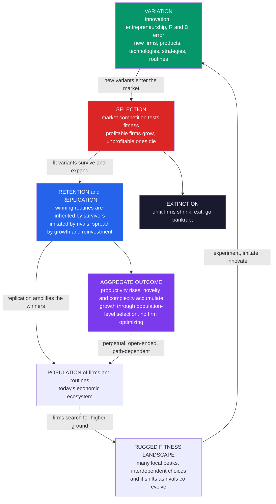

# 🌱 Evolutionary Economics and Selection

> [!abstract] TL;DR
> **Evolutionary economics** treats the economy not as a system converging to **equilibrium** but as an **evolving ecosystem** driven by the very same **Darwinian algorithm** as biological life — **variation**, **selection**, and **retention** (replication). **Variation**: innovation, entrepreneurship, experiment, and error continually throw up **novelty** — new firms, products, technologies, business models, and strategies (the "mutations"). **Selection**: the **market** competes them against one another, letting the **fit** (profitable, productive, adapted) expand and killing the **unfit** (bankruptcy, exit — extinction) — differential survival and growth. **Retention**: successful designs — above all the organizational **routines** that are a firm's "genes" (Nelson & Winter) — are **inherited** by survivors, **imitated** by rivals, and **spread** by growth and reinvestment (the "heredity"). Crucially, aggregate productivity and complexity *rise through population-level selection*, with **no firm optimizing** — selection does the "optimizing" (Alchian's "as-if" defence reread as evolution). Firms search **rugged fitness landscapes** (Kauffman's NK view) that shift as rivals co-evolve, so there is no fixed optimum to reach. The result is a **perpetual, open-ended, path-dependent** process that explains **growth, innovation, and the rise and fall of firms and industries** far better than equilibrium — the Nelson-Winter and **Schumpeterian** tradition, and a foundational pillar of complexity economics ([[Complexity_Economics_Overview]]). It differs from biology (faster, more **Lamarckian**, more **directed**), but as a *rigorous framework* rather than a loose metaphor it is the complexity account of economic **change**. This note opens the section on **Evolution, Innovation and Growth**.

---

## Intuition

**Analogy — the economy is a rainforest, not a machine.** Standard economics pictures the economy as a great machine grinding toward **equilibrium**: turn the crank, let supply meet demand, and the system settles into a tidy resting state. But look at an actual economy and you see nothing of the sort. You see a **teeming, evolving rainforest**. Firms are **species**. Products and business models are **organisms**, jostling for the one scarce resource that keeps them alive: **consumer spending**. The market is a relentless engine of **natural selection** — it breeds the fit, starves the unfit, and never stops. A business model that *works* spreads and gets **imitated** (a successful species radiates into new niches); one that *fails* goes **extinct** (bankruptcy, delisting, the corporate graveyard). And all the while, **novelty** is being thrown up without pause — new products, new technologies, new strategies — each a fresh mutation tossed into the arena to be tested by the market.

Nothing about a rainforest is *in equilibrium*, yet it is not chaos either. It has a stable *form* — a canopy, a food web, a pattern of niches — sustained precisely *because* the churn of birth, competition, death, and novelty never stops. Complexity economics takes this evolutionary picture **literally, not loosely**. It asks: what if the deep logic of the economy is not the physics of a settling machine but the biology of an evolving ecosystem — the **Darwinian algorithm** of variation, selection, and inheritance? Framed that way, the phenomena equilibrium theory struggles most to explain — where **growth** comes from, why **innovation** is ceaseless, why dominant firms are eventually **unseated** — stop being anomalies and become exactly what the theory *predicts*. Evolution, it turns out, explains the economy's restlessness far better than equilibrium ever could.

---

## How It Works

### The Darwinian algorithm, applied to the economy

Charles Darwin's insight was not really about finches; it was about an **algorithm** — a substrate-neutral recipe that produces *adaptation without a designer* whenever three ingredients are present. **Generalized ("universal") Darwinism** (Hodgson & Knudsen) observes that the economy has all three, so the same engine runs there too:

1. **Variation — the supply of novelty.** Evolution needs a continual stream of *differences* to act on. In the economy this is **innovation** (new products, processes, technologies), **entrepreneurship** (new firms, new combinations — Schumpeter's *neue Kombinationen*), **experimentation and R&D**, and plain **error and serendipity**. Firms and strategies are never identical; that heterogeneity is the raw material. Where the novelty itself comes from — recombination of existing pieces, stepping into the "adjacent possible" — is the theme of the sibling note *Innovation_Recombination_and_the_Adjacent_Possible*. Without variation, evolution has nothing to work on.

2. **Selection — the market as nature.** The **market** plays the role nature plays in biology. **Competition** is a **selection mechanism**: profitable, productive, well-adapted firms and products **win customers, earn profits, and expand** (gaining market share, reinvesting, hiring); unprofitable ones **contract, exit, and go bankrupt** (extinction). This is **differential survival and growth**. Note the payoff: because losers are eliminated and winners amplified, the *population* moves toward higher fitness **even though no individual firm is optimizing**. Armen Alchian's classic "Uncertainty, Evolution, and Economic Theory" (1950) made exactly this move — the neoclassical "as-if firms maximize profit" assumption is best *defended* not as literal calculation but as the residue of **selection**: the market keeps the firms that happen to act *as if* they maximized. Hayek's "competition as a discovery procedure" is the same idea — the market *discovers* fit arrangements it could never have computed in advance.

3. **Retention / replication — heredity.** For selection to accumulate improvement, winners must be **copied and inherited**, not reinvented from scratch each generation. In the economy, successful **designs, technologies, and routines** are **retained** (the surviving firm keeps doing what worked), **replicated** (the firm grows and reproduces its practices across new plants and divisions), and **imitated** (rivals copy the winning formula). Growth and reinvestment *amplify* the fit; imitation *spreads* them. This is the economic analogue of **heredity** — the channel through which yesterday's successful adaptation becomes tomorrow's baseline.

Run those three ingredients in a loop and you get **cumulative adaptation**: the population climbs toward fitness, one tested variant at a time, with no one steering. That is evolution — and, evolutionary economists argue, that is the economy.

### Routines as the "genes" of the firm (Nelson & Winter)

The pivotal move that turned this metaphor into a *theory* was Richard **Nelson** and Sidney **Winter**'s *An Evolutionary Theory of Economic Change* (1982). Their key claim is behaviorally radical: **firms do not optimize** — they **follow routines**. A routine is an organizational **habit**, procedure, capability, or "way of doing things": how this firm prices, hires, manufactures, restocks, handles a complaint, runs its R&D. Routines are the firm's **skills and memory**, encoded in people, tools, and culture rather than in a textbook. And they behave exactly like **genes**:

- **They are relatively stable and inherited** — a firm largely *repeats* its routines day to day, and passes them on as it grows or is copied. This is the *heredity* channel.
- **They mutate** — through deliberate search, innovation, imitation-with-drift, and error, routines change and new ones appear. This is the *variation* channel.
- **They are selected** — the **market** rewards firms whose routines yield profit and productivity, and eliminates firms whose routines do not. Firms with fitter routines grow and *replicate* those routines; firms with unfit routines shrink and die. This is the *selection* channel.

This gives complexity economics a **behaviorally realistic microfoundation**, in deliberate contrast to the neoclassical firm — a frictionless black box that instantly computes the profit-maximizing choice. Real firms are boundedly rational ([[Bounded_Rationality_and_Heterogeneous_Agents]]): they *satisfice*, lean on routine, and search their neighborhood only when profits disappoint. The "optimizing" that neoclassical theory attributes to the *individual firm* is relocated by Nelson-Winter to the *population*, and done by **selection over routines**.

### Selection is the market's engine — optimization without optimizers

The central mechanism deserves restating because it is easy to miss how much work it does. **Market competition acts as natural selection.** Profitable, productive firms **expand** — they win share, earn retained earnings, reinvest, and thereby **replicate their routines** across a larger footprint. Unprofitable firms **contract and die** — they lose share, run out of cash, and exit. This **differential growth and survival** mechanically **shifts the composition of the population** toward fitter firms, fitter routines, and fitter technologies over time. Aggregate productivity **rises** — not because anyone maximized it, but because selection culled the low-productivity tail and amplified the high-productivity one. Selection is a *distributed, parallel search* that no central planner and no single optimizing firm could match. It is the mechanism behind Schumpeter's **creative destruction** (developed in *Schumpeterian_Creative_Destruction*): the "gale" that continually reallocates resources from the dying old to the thriving new.

### Variation is the fuel — without it, selection stalls

Selection alone is a **subtractive** force: it can only *remove* diversity, winnowing an existing population down to its fittest members and then stopping. Left to itself it **exhausts its own fuel** and grinds to a halt at whatever was best in the starting lineup. What keeps evolution *going* is a perpetual resupply of **variation** — the ceaseless creation of the *new*. This is why innovation and entrepreneurship are not optional extras but the **engine of economic change**: they are the mutation rate of the economy. The Python demo below makes this concrete — with innovation switched **off**, average productivity climbs briefly and then flatlines; with innovation **on**, the bar keeps rising indefinitely. *Variation and selection are both necessary; neither alone suffices.*

### Fitness landscapes — the geography of adaptation

A useful geometry for all this is the **fitness landscape** (Sewall Wright, imported to organizations and technologies via Stuart **Kauffman**'s **NK model**). Picture every possible firm strategy, technology, or configuration as a point on a landscape whose *height* is its **fitness** (profit, productivity). Firms **search** this landscape — adapting, imitating, experimenting — trying to climb toward higher ground. Two features make the search hard and interesting:

- **Ruggedness.** When a firm's choices are **interdependent** (high *K* in NK terms — pricing depends on branding depends on distribution depends on...), the landscape has **many local peaks**. Firms get **stuck on local optima**: no single small change improves things, yet a far higher peak exists across a valley they cannot cross incrementally. This is why good firms with sensible routines can still be *trapped* in mediocre configurations.
- **Co-evolution — a moving target.** The landscape is **not fixed**. Every time a rival adapts, it **deforms the landscape** for everyone else — a strategy that was a peak becomes a slope. Firms are climbing a surface that is *buckling beneath them* (the economic **Red Queen**: run to stay in place). There is therefore **no final optimum** to converge to, which is precisely why the economy never settles into equilibrium.

The strategic upshot is the **exploration–exploitation** trade-off (March): a firm must *exploit* its current peak to earn today's profits while *exploring* for higher peaks to survive tomorrow — too much of either is fatal. This adaptive-search view, closely related to spin-glass and rugged-landscape ideas in physics, is the backbone of the modern "**dynamic capabilities**" literature in strategy and of *Technological_Change_and_Growth_Dynamics*.

### The economy as a perpetually evolving system

Step back and the big picture inverts the equilibrium worldview. Equilibrium is a **resting state**; evolution is **open-ended, perpetual, and directional** (though *not* toward a fixed optimum). The economy continually generates **novelty, complexity, and growth** and **never settles** — the same non-equilibrium stance developed in *Non_Equilibrium_and_Out_of_Equilibrium_Dynamics*. **Economic growth itself becomes an evolutionary process**: the accumulation, over time, of *fitter* technologies, deeper knowledge, and better organizational forms — what Eric Beinhocker calls the "**evolution of wealth**," and what the empirics of *Economic_Complexity_and_the_Product_Space* measure as a society's growing repertoire of productive capabilities. This is a fundamentally **dynamic, historical, path-dependent** view of the economy ([[Increasing_Returns_and_Path_Dependence]]): where you can go next depends on where you have been.

### How economic evolution differs from biology

Taking evolution as a *rigorous framework* means being honest about the **disanalogies** — the ways economic evolution is *not* biological (Edith Penrose's classic 1952 critique warned exactly against a naive transplant):

- **Faster.** Firm and technology "generations" turn over in years, not millennia.
- **More Lamarckian.** Acquired traits *are* inherited. Firms **deliberately learn**, and successful practices are **imitated on purpose** — unlike blind biological mutation, which cannot pass on a lifetime's learning.
- **More directed / intentional.** Innovation is often **designed toward a goal**, guided by foresight, strategy, and R&D — not random mutation. Entrepreneurs *aim*.
- **Foresight and intention** pervade the process, so "selection" is entangled with anticipation in a way biology lacks.

None of this breaks the framework; it *specifies* it. The economy is a **Darwinian** system with **Lamarckian, directed** flavoring — and the ongoing debate over *how* Darwinian it really is is itself a productive research program, not an embarrassment.

### The Darwinian loop, in one picture



---

## Key Concepts

### Secondary Level

**The economy is like a rainforest.** Companies are like *species*, products are like *organisms*, and they all compete for one thing: your money. The market is like *nature* — it keeps the winners alive and lets the losers die out. Businesses that work get **copied** and spread; businesses that fail go **extinct**. And new ideas keep popping up to be tested. That constant churn — not a calm "everything balances out" — is what the economy really looks like.

**The three-step recipe of evolution (in a company world):**

| Step | In nature | In the economy |
|---|---|---|
| **Variation** | Random mutations make animals a little different | New products, new companies, new ideas keep appearing |
| **Selection** | Predators and hunger kill the unfit | The market kills companies that lose money |
| **Retention** | Winners pass their genes to offspring | Winning ideas get copied and spread |

**Why this matters.** You do not need a genius planner to make the economy smarter over time. Just like nature produced eagles and dolphins with *no* designer, the market makes better and better products with *no one* in charge — winners spread, losers vanish, and new tries never stop. But there is a catch: if new ideas ever *stopped* appearing, the whole thing would freeze. **Innovation is the fuel** that keeps the engine running.

### Undergraduate Level

#### Generalized Darwinism and the three requirements

Evolution is a **substrate-neutral algorithm**: any system with (1) a population showing **variation**, (2) **selection** on that variation (differential success), and (3) **inheritance/retention** of the successful will *adapt without a designer*. **Generalized Darwinism** (Hodgson & Knudsen) argues the economy satisfies all three, so economic change *is* an evolutionary process — not merely *like* one. The claim is stronger than metaphor: it says the same abstract mechanism runs on genes and on firms.

#### The Nelson-Winter firm: routines, not optimization

Neoclassical theory models the firm as a black box that instantly solves for the profit-maximizing input mix. Nelson & Winter (1982) replace this with a **behavioral, evolutionary** firm: firms carry **routines** (organizational capabilities and habits), which act as their **genes** — relatively stable and inherited, but subject to **mutation** (search, innovation, error). The market **selects** among firms by the profitability of their routines: fitter routines grow and replicate, unfit ones shrink and die. Optimization is *not assumed at the firm level*; it *emerges at the population level* as the outcome of selection.

#### Alchian's selection defence and Hayek's discovery process

Armen **Alchian** (1950) reinterpreted the neoclassical maximization postulate as a **selection** result: firms need not *calculate* the optimum; the market simply *retains* those that happen to behave *as if* they had, and eliminates the rest. Friedrich **Hayek** framed **competition as a discovery procedure** — a process that *reveals* which arrangements are viable, information no central mind possesses in advance. Both dissolve the paradox of "rational" outcomes without rational (or even conscious) optimizers: **selection is the optimizer**.

#### Variation and the source of novelty

Selection is purely *subtractive* — it removes diversity and then stops. Sustained improvement requires an ongoing **supply of novelty**: **innovation** (products, processes, technologies), **entrepreneurship** (new firms and Schumpeterian *new combinations*), **experimentation/R&D**, and **error/serendipity**. Where novelty *comes from* — recombination of existing components, movement into the **adjacent possible** — is developed in *Innovation_Recombination_and_the_Adjacent_Possible*. The key theorem for this note: **variation + selection are jointly necessary**; selection without variation stalls.

#### Fitness landscapes, ruggedness, and co-evolution

Kauffman's **NK model** provides the geometry: firms/technologies occupy points on a **fitness landscape** and climb toward higher fitness. When choices are **interdependent** (high *K*), the landscape is **rugged** — many local peaks — so firms get **stuck on local optima** and cannot reach a distant higher peak by small steps. Worse, the landscape **co-evolves**: rivals' adaptations deform it (the **Red Queen**), so there is **no fixed optimum**. This grounds the **exploration vs exploitation** dilemma in strategy: exploit the current peak for today's profit, explore for a higher one to survive tomorrow.

### Graduate Level

#### The replicator dynamic as the formal skeleton of selection

The mathematical core of "the fit expand, the unfit shrink" is the **replicator equation**. Let $x_i$ be firm $i$'s market share and $f_i$ its fitness (unit profitability / productivity). Continuous time:
$$\dot{x}_i = x_i\,\big(f_i - \bar{f}\big), \qquad \bar{f} = \sum_j x_j f_j,$$
so shares of above-average firms grow and below-average firms decline; discrete time gives the map $x_i' = x_i f_i / \bar f$ used in the demo. This is the shared skeleton of evolutionary economics and [[Replicator_Dynamics]] in evolutionary game theory. **Fisher's fundamental theorem** has an economic reading here: the rate of increase of **mean fitness** equals the **variance in fitness** across the population — *selection converts diversity into progress*, and when variance is exhausted (no variation), $\dot{\bar f} = 0$ and improvement **stops**. This is the exact formal statement of "selection alone stalls." Metcalfe's evolutionary economics builds industry dynamics directly on this replicator core.

#### Nelson-Winter as a stochastic search-and-selection model

The full Nelson-Winter model is a **Markov process** over industry states: firms produce with current routines, earn profits, invest (growth $\approx$ replication), and **search** — local search (imitation of observed better routines) and innovative search (draws from a distribution of new techniques) triggered when profitability falls short of aspiration ([[Bounded_Rationality_and_Heterogeneous_Agents]]). Selection operates through **differential investment and survival**. The model reproduces, *endogenously*, empirical regularities that equilibrium theory must assume: **skewed firm-size distributions**, **persistent productivity dispersion** across firms in the same industry, **entry/exit dynamics**, and **Schumpeterian** patterns of innovation-led concentration and disruption.

#### NK landscapes, epistasis, and the tuning of ruggedness

Kauffman's **NK** formalism parameterizes ruggedness by **epistatic interaction** $K$: with $N$ decision components each contributing a fitness that depends on $K$ others, $K=0$ gives a smooth single-peaked (Mount Fuji) landscape and $K=N-1$ a maximally rugged, uncorrelated one with $\sim 2^N/(N+1)$ local optima. Applied to organizations (Levinthal 1997; Rivkin 2000), high $K$ (tight complementarities among practices) makes strategies **hard to imitate** (rivals copying a *subset* of an interlocking system land in a fitness valley) and makes firms prone to **local-optimum lock-in** — a rigorous account of both **sustained competitive advantage** and **organizational inertia**. **Co-evolutionary** (NKC) extensions make each firm's landscape a function of others' positions, formalizing the moving-target Red Queen.

#### The status of the paradigm: rigorous framework vs loose metaphor

The mature program insists on **generalized Darwinism as ontology, not analogy** (Hodgson & Knudsen, *Darwin's Conjecture*), while conceding the **Lamarckian, directed, foresightful** character of economic inheritance (Penrose's 1952 critique; Witt's "continuity hypothesis" debates). The open frontiers: what exactly is the economic **replicator** (routines? habits? firms? technologies?) and the economic **interactor** (following Hull's replicator/interactor distinction); how to model **intentional variation** without smuggling back the omniscient optimizer; and how selection at **multiple levels** (routine, firm, industry, institution — links to *Institutions_Cooperation_and_Norms*) composes. Evolutionary economics is thus not a finished theory but a **research paradigm** — the account of *change, novelty, and growth* that the equilibrium tradition structurally cannot provide, and a core pillar of complexity economics ([[Complexity_Economics_Overview]]).

---

## Python Demo

```python
import numpy as np
import matplotlib
matplotlib.use("Agg")
import matplotlib.pyplot as plt

# ----------------------------------------------------------------------
# ECONOMIC SELECTION  =  REPLICATOR DYNAMICS  +  INNOVATION.
#
# A population of FIRMS, each with a 'fitness' f_i (unit productivity / margin).
# Market share evolves by the DISCRETE REPLICATOR MAP:
#        x_i  <-  x_i * f_i / <f>          <f> = sum_j x_j f_j
# -> fitter-than-average firms GAIN share, below-average firms SHRINK.
#    This is SELECTION: with NO firm optimizing, the market concentrates
#    share on the fittest -- 'optimization' done at the POPULATION level.
#
# INNOVATION / MUTATION: occasionally a new firm ENTERS. Its fitness is an
# incumbent's fitness plus a random (slightly upward-biased) step, seeded with
# a small share. This is VARIATION -- the raw material selection feeds on.
#
# Together, variation + selection make AGGREGATE fitness (productivity) CLIMB.
# Switch innovation OFF and selection alone STALLS at the best initial firm:
#   variation and selection are BOTH necessary; neither alone suffices.
# ----------------------------------------------------------------------

def evolve(T=500, n0=6, innov_rate=0.06, max_firms=800, seed=0):
    rng   = np.random.default_rng(seed)
    fit   = list(rng.uniform(0.80, 1.20, n0))   # initial firm fitnesses
    share = list(np.ones(n0) / n0)              # equal starting market shares
    hist  = np.zeros((max_firms, T))            # share history: firm x time
    avg   = np.zeros(T)                         # population-average fitness
    for t in range(T):
        f = np.asarray(fit); x = np.asarray(share)
        # --- SELECTION: discrete replicator dynamics ---
        x = x * f / np.sum(x * f)
        # --- VARIATION: a challenger may innovate its way in ---
        if rng.random() < innov_rate and len(fit) < max_firms:
            parent = int(rng.integers(len(fit)))
            new_f  = max(fit[parent] + rng.normal(0.10, 0.12), 0.05)  # often fitter
            fit.append(new_f)
            x = np.append(x * 0.97, 0.03)       # seed the entrant with a 3% share
        x = x / x.sum()                         # renormalize shares to 1
        share = list(x)
        for i in range(len(share)):
            hist[i, t] = share[i]
        avg[t] = float(np.sum(np.asarray(share) * np.asarray(fit)))
    return hist[:len(fit)], np.asarray(fit), avg

# (A) full run WITH innovation -> rise & fall of firms + climbing productivity
histA, fitA, avgA = evolve(innov_rate=0.06, seed=7)

# (B) selection ONLY (rate 0) vs several innovation rates -> does fitness climb?
rates = [0.00, 0.02, 0.06, 0.12]
avgs  = {r: evolve(innov_rate=r, seed=7)[2] for r in rates}

print("=" * 64)
print("SELECTION + INNOVATION: does average productivity climb?")
print("=" * 64)
for r in rates:
    a   = avgs[r]
    tag = "selection ONLY -> STALLS" if r == 0 else "selection + innovation"
    print(f"  innovation rate {r:4.2f}:  avg fitness {a[0]:.3f} -> {a[-1]:.3f}"
          f"   ({tag})")
print("  -> rate 0.00 plateaus at the best INITIAL firm and stops improving;")
print("     higher innovation keeps introducing fitter challengers, so the")
print("     population's average productivity keeps climbing. Both needed.")

# ------------------------------- FIGURE --------------------------------
fig, (ax1, ax2, ax3) = plt.subplots(1, 3, figsize=(17, 5.2))
fig.suptitle("Evolutionary economics: selection concentrates share on the fit, "
             "innovation keeps raising the bar", fontsize=13, fontweight="bold")

# Panel 1: rise and fall of firms (market-share trajectories)
for i in range(histA.shape[0]):
    ax1.plot(histA[i], lw=0.8)
ax1.set_title("Rise & fall of firms\nmarket share under selection + innovation",
              fontsize=10)
ax1.set_xlabel("time"); ax1.set_ylabel("market share")
ax1.grid(alpha=0.25)

# Panel 2: average productivity climbing (or stalling when innovation is off)
colors = {0.00: "#1a1a2e", 0.02: "#2563eb", 0.06: "#7c3aed", 0.12: "#dc2626"}
for r in rates:
    lbl = "innovation OFF -> selection STALLS" if r == 0 else f"innovation rate {r:.2f}"
    ax2.plot(avgs[r], color=colors[r], lw=1.7, label=lbl)
ax2.set_title("Average productivity / fitness of the economy\n"
              "selection alone stalls; variation keeps it climbing", fontsize=10)
ax2.set_xlabel("time"); ax2.set_ylabel("population-average fitness")
ax2.legend(fontsize=8, loc="lower right"); ax2.grid(alpha=0.25)

# Panel 3: long-run fitness vs the innovation rate
finals = [avgs[r][-1] for r in rates]
bars = ax3.bar([f"{r:.2f}" for r in rates], finals,
               color=[colors[r] for r in rates])
ax3.set_title("Effect of the innovation rate\nmore variation -> higher long-run fitness",
              fontsize=10)
ax3.set_xlabel("innovation / mutation rate"); ax3.set_ylabel("final avg fitness")
ax3.grid(alpha=0.25, axis="y")
for b, v in zip(bars, finals):
    ax3.text(b.get_x() + b.get_width()/2, v + 0.02, f"{v:.2f}",
             ha="center", fontsize=8)

plt.tight_layout(rect=[0, 0, 1, 0.92])
plt.savefig("evolutionary_economics_selection.png", dpi=110, bbox_inches="tight")
plt.show()
```

**What the demo shows:**

- **Panel 1 (rise & fall of firms).** Each line is one firm's **market share**. Under replicator selection, shares that start equal quickly **diverge** — fitter firms swell while the rest fade toward zero (selection concentrating share). But innovation keeps **injecting new challengers** (lines rising from zero mid-run), some of which are fitter than the reigning leader and *overtake* it. The result is the characteristic **churn** of a real economy: dominance is temporary, and today's leader is tomorrow's has-been. This is **creative destruction** rendered as a picture.
- **Panel 2 (average productivity over time).** The **population-average fitness** — a proxy for aggregate productivity — is the payoff of selection. With **innovation off** (black line, rate 0.00) it climbs briefly as selection sorts the *initial* firms, then **flatlines** at the best starting firm: selection has exhausted its fuel. With innovation **on** (higher rates), the curve **keeps rising** as fresh, fitter variants are continually fed in and amplified. The gap between the black flat line and the coloured climbing lines *is* the entire argument: **selection needs variation**.
- **Panel 3 (effect of the innovation rate).** Long-run average fitness **increases with the innovation/mutation rate** — more variation gives selection more (and better) material to work with, so the economy climbs higher. (In richer models this eventually trades off against the cost and disruption of too much churn, foreshadowing the exploration–exploitation dilemma.)

The one-line takeaway: **selection is the sculptor, variation is the marble.** Selection alone chisels an existing block down to its best shape and then stops; only a steady supply of fresh, fitter novelty lets the economy keep improving — which is exactly why innovation is the engine of growth, not a sideshow.

---

## Real-World Applications

> **The rise and fall of firms and industries.** Why do dominant, well-run incumbents get **unseated**? Kodak (film), Nokia and BlackBerry (phones), Blockbuster (video), and countless others were *fit* on the old landscape and *stranded* when it shifted. Evolutionary economics explains this as **selection on a co-evolving fitness landscape**: a fitter variant (digital imaging, the smartphone, streaming) enters via *variation*, the market *selects* it, and the incumbent's once-winning routines become a liability it cannot incrementally escape. This is Schumpeter's **creative destruction** in action — developed in *Schumpeterian_Creative_Destruction*.

> **Technological change and innovation dynamics.** Technologies themselves **evolve** — through recombination of existing components, selection by adoption, and retention in standards and infrastructure. Brian Arthur's *The Nature of Technology* and the broad **evolutionary theory of technical change** (Dosi's "technological paradigms and trajectories") treat innovation as a Darwinian search, explaining S-curves, dominant designs, and lock-in. This is the subject of *Technological_Change_and_Growth_Dynamics*, and it connects to how innovations *spread* in [[Diffusion_of_Innovations_and_Adoption_Dynamics]].

> **Industry dynamics and firm demographics.** The evolutionary model *predicts* the stylized facts of industrial organization: **entry and exit** waves, **persistent productivity dispersion** among competitors in the same market, **skewed (power-law-ish) firm-size distributions**, and the shakeout patterns of young industries. These emerge from differential growth and selection, not from any equilibrium firm-size condition.

> **Economic growth and development.** Beinhocker's *The Origin of Wealth* frames long-run growth as the **evolutionary accumulation** of fitter technologies, knowledge, and business designs — "wealth is evolved knowledge." Empirically, Hidalgo & Hausmann's **economic complexity** and the **product space** operationalize development as a society climbing an evolving landscape of **productive capabilities** — the theme of *Economic_Complexity_and_the_Product_Space*.

> **Strategy and dynamic capabilities.** The NK/fitness-landscape view is now mainstream in strategy: **sustained competitive advantage** as a hard-to-imitate *interlocking* system of routines (high-$K$ complementarity), **organizational inertia** as local-optimum lock-in, and **dynamic capabilities** (Teece) as a firm's ability to keep *exploring* the landscape rather than only *exploiting* its current peak. This reframes the classic **exploration vs exploitation** balance (March) as an evolutionary imperative.

---

## Common Pitfalls

- **Taking "evolution" as a loose metaphor rather than a mechanism.** The claim is not "the economy is *kind of like* nature." It is that the **same three-part algorithm** (variation, selection, retention) is literally running. If you cannot point to the concrete *variation* channel (innovation/entry), the *selection* channel (profit-driven growth and exit), and the *retention* channel (routine inheritance and imitation), you are gesturing, not explaining.
- **Forgetting that selection alone stalls.** The single most common error is to think markets "optimize." They **select** — a subtractive force that *exhausts diversity and halts* without a fresh supply of variation. Selection makes the *existing* population fitter and then stops; **innovation** is what keeps the economy improving. Policy that protects competition (selection) but starves innovation (variation) freezes progress.
- **Assuming selection reaches the global optimum.** On a **rugged, co-evolving** landscape, selection climbs to whatever **local peak** is reachable by small steps — often *not* the best possible, and possibly an *inefficient* lock-in (echoing [[Increasing_Returns_and_Path_Dependence]]). "The market selected it" does **not** imply "it is optimal." History and path dependence pick the peak.
- **Over-literal biological transplant (ignoring the disanalogies).** Economic evolution is **faster, Lamarckian, and directed** — firms *learn*, *imitate on purpose*, and *innovate toward goals*. Modeling it as blind, slow, random mutation (or, conversely, ignoring selection because "firms just plan") both miss. Penrose's 1952 warning stands: use evolution as a *disciplined framework*, respecting where the analogy breaks.
- **Re-importing the omniscient optimizer through the back door.** The whole point of Nelson-Winter is that firms **satisfice and follow routines**, and *selection* does the optimizing at the population level. If your "evolutionary" model quietly assumes firms already pick the fittest routine, you have re-assumed the neoclassical optimizer and thrown away the mechanism.
- **Confusing the unit of selection.** Is the replicator the **routine**, the **firm**, the **technology**, or the **habit**? Sloppiness here (conflating the *replicator* with the *interactor*, in Hull's terms) produces muddled models. Being explicit about *what* varies, *what* is selected, and *what* is inherited is the discipline that separates rigorous evolutionary economics from hand-waving.

---

## Related Concepts

**Within this vault (Complexity Economics):**

- [[Complexity_Economics_Overview]] — the parent programme; evolution-and-selection is one of its load-bearing pillars, alongside emergence, networks, and out-of-equilibrium dynamics.
- [[Economies_as_Complex_Adaptive_Systems]] — the CAS framing whose *adaptation* mechanism this note supplies: variation-selection-retention is *how* a complex adaptive economy adapts.
- [[Increasing_Returns_and_Path_Dependence]] — positive feedback and lock-in explain why selection can settle on an *inefficient* local peak; history picks the winner.
- [[Bounded_Rationality_and_Heterogeneous_Agents]] — the satisficing, routine-following firms that *cannot* optimize, so selection must do the "optimizing" for them.
- [[Non_Equilibrium_and_Out_of_Equilibrium_Dynamics]] — why an evolving economy never settles; evolution is the *substantive content* of the non-equilibrium claim.
- [[Diffusion_of_Innovations_and_Adoption_Dynamics]] — how a selected-for innovation actually *spreads* through the population (the retention/replication channel in motion).

**Evolutionary Game Theory vault (the formal engine and the economics-of-strategies treatment):**

- [[Replicator_Dynamics]] — the exact mathematical skeleton of "the fit expand, the unfit shrink" used in this note's demo.
- [[Evolutionary_Economics_and_Bounded_Rationality]] — EGT's treatment of economic evolution via strategy dynamics and learning; complements this note's *firm/routine* selection focus.
- [[Evolutionary_Dynamics_in_Markets_and_Institutions]] — how market and institutional arrangements evolve; the institutional companion to firm-level selection.
- [[Fitness_Payoffs_and_Population_Games]] — the payoff-as-fitness mapping that lets game-theoretic and economic selection share one formalism.
- [[Adaptive_Dynamics_and_Evolutionary_Branching]] — how continual small innovations can *split* a population into distinct niches, mirroring industry diversification.

**Systems Thinking & Complexity vault (the general science of adaptation):**

- [[Evolutionary_Dynamics_and_Fitness_Landscapes]] — the general fitness-landscape / NK machinery this note applies to firms and technologies.
- [[Complex_Adaptive_Systems]] — the umbrella concept; evolution is the canonical mechanism by which a CAS adapts.
- [[Emergence_and_Self_Organization]] — aggregate productivity gains *emerge* from population-level selection with no designer, exactly the emergence pattern.
- [[Adaptation_and_Learning_in_Systems]] — the broader family of adaptive mechanisms of which Darwinian selection is one important member.
- [[Economic_and_Social_Complexity]] — the Systems Thinking vault's economics application note; this note is its evolutionary deep-dive.

**Biology (the source of the algorithm) and the neoclassical benchmark:**

- [[Natural_Selection_and_Adaptation]] — the biological original: variation, differential survival, and heredity, from which generalized Darwinism abstracts the algorithm.
- [[Endogenous_Growth_Theory]] — the neoclassical attempt to internalize innovation into growth; evolutionary economics pushes past it into genuine, undirected novelty.
- [[Solow_Growth_Model]] — the equilibrium growth benchmark in which technology is an exogenous residual; evolutionary economics makes technical change the endogenous *process*.
- [[Perfect_Competition]] — the equilibrium market ideal; here competition is reinterpreted as a *selection and discovery* process rather than a resting state.

**Forthcoming siblings in this section (planned, not yet written):** *Innovation, Recombination and the Adjacent Possible* (where novelty comes from), *Schumpeterian Creative Destruction* (the gale of disruption), *Technological Change and Growth Dynamics* (technologies as evolving systems), *Economic Complexity and the Product Space* (development as capability accumulation), and *Institutions, Cooperation and Norms* (evolution above the firm). This note is the section's map; those are the territory.

---

## Review Questions

### Secondary

1. Explain the "economy as a rainforest" picture in your own words. What plays the role of *species*, what plays the role of *nature/predators*, and what is the one scarce resource everything competes for?
2. Name the three steps of evolution (variation, selection, retention) and give one everyday business example of each — a new idea appearing, a company dying, and a good idea being copied.
3. A friend says, "Markets automatically make the best products, so we don't need to do anything." Using the idea that "selection alone stalls," explain what crucial ingredient this misses and why the economy would *freeze* without it.

### Undergraduate

1. State the three requirements of the Darwinian algorithm and map each precisely onto an economic mechanism. Then explain why **generalized Darwinism** claims the economy *is* evolutionary rather than merely *like* evolution.
2. Explain Nelson & Winter's idea that **routines are the genes of the firm**. In what sense are routines *inherited*, in what sense do they *mutate*, and how does the market *select* among them? Contrast this with the neoclassical optimizing firm.
3. Using a **rugged fitness landscape**, explain (a) why a well-run firm can be trapped on a *local* optimum, (b) why the landscape is a *moving target*, and (c) how these two facts produce the **exploration vs exploitation** dilemma in strategy.

### Graduate

1. Write down the discrete replicator map $x_i' = x_i f_i / \bar f$ and use **Fisher's fundamental theorem** (mean-fitness growth equals fitness variance) to prove *formally* that "selection alone stalls." Then explain exactly what role innovation plays in the demo to keep $\dot{\bar f} > 0$, and why variation and selection are *jointly* necessary.
2. Alchian (1950) defends the profit-maximization postulate as a *selection* result, not a behavioral one. Reconstruct this argument, state its limits (e.g., when is the selection environment strong enough to justify the "as-if" claim?), and relate it to Hayek's "competition as a discovery procedure."
3. Economic evolution is widely described as **Lamarckian and directed**, unlike blind biological evolution. Does this break the generalized-Darwinian claim that the *same algorithm* runs in both domains, or merely parameterize it differently? In your answer, address the replicator/interactor distinction and what counts as the economic "replicator," and take a position on whether evolutionary economics is a *theory* or a *research paradigm*.

---

## Sources

- [Nelson, R. R. & Winter, S. G. (1982). *An Evolutionary Theory of Economic Change*. Harvard University Press / Belknap](https://www.hup.harvard.edu/catalog.php?isbn=9780674272286)
- [Alchian, A. A. (1950). "Uncertainty, Evolution, and Economic Theory." *Journal of Political Economy* 58(3), 211–221](https://doi.org/10.1086/256940)
- [Beinhocker, E. D. (2006). *The Origin of Wealth: Evolution, Complexity, and the Radical Remaking of Economics*. Harvard Business School Press](https://www.hbs.edu/faculty/Pages/item.aspx?num=22090)
- [Hodgson, G. M. & Knudsen, T. (2010). *Darwin's Conjecture: The Search for General Principles of Social and Economic Evolution*. University of Chicago Press](https://press.uchicago.edu/ucp/books/book/chicago/D/bo9153927.html)
- [Metcalfe, J. S. (1998). *Evolutionary Economics and Creative Destruction*. Routledge](https://doi.org/10.4324/9780203275146)
- [Kauffman, S. A. (1993). *The Origins of Order: Self-Organization and Selection in Evolution*. Oxford University Press](https://global.oup.com/academic/product/the-origins-of-order-9780195079517)

---

#complexity-economics #evolutionary-economics #selection #variation #economic-evolution
