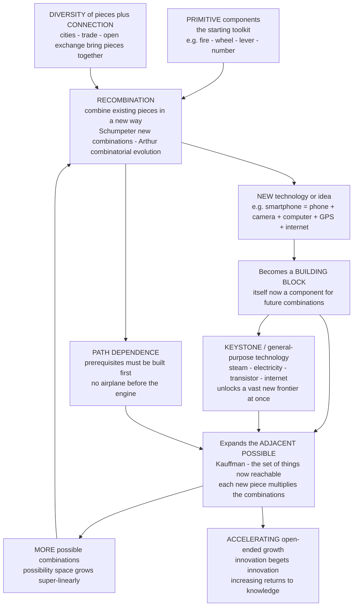

# 🧬 Innovation, Recombination, and the Adjacent Possible

> [!abstract] TL;DR
> **Innovation is almost never creation from nothing — it is RECOMBINATION.** A new technology, idea, or product is a novel **combination of existing components**: the smartphone is a telephone plus a camera plus a computer plus a GPS receiver plus the internet, each of which was itself assembled from earlier pieces. This is Joseph **Schumpeter's** "new combinations," W. Brian **Arthur's** "combinatorial evolution" (*The Nature of Technology*: technologies are built from components that are themselves technologies, and every new technology becomes a component available for building still newer ones — a self-building, hierarchical, evolving system), and Martin **Weitzman's** "recombinant growth." The engine matters because of Stuart **Kauffman's** profound idea of the **ADJACENT POSSIBLE**: at any moment only certain new things are *reachable* by recombining or modifying what currently exists — you cannot invent the airplane before the internal-combustion engine — but crucially the adjacent possible **expands as it is explored**: every new component you actually build opens up a fan of new combinations that were previously unreachable, so the frontier of the possible grows as the actual is realized. Because each new piece multiplies the number of possible combinations, the space of what-can-be-invented grows **super-linearly (combinatorially)** as the toolkit grows, which is why innovation **accelerates** and why growth need not hit diminishing returns. And because **ideas are non-rival** (usable by everyone at once, never used up — Romer) and **endlessly combinable** (they recombine without depletion, unlike physical resources), recombination can drive *sustained, even accelerating* economic growth — this is the microfoundation beneath [[Endogenous_Growth_Theory|endogenous growth]]. The process is **path-dependent** (prerequisites must be built first, and **general-purpose technologies** like electricity, the transistor, and the internet unlock vast new adjacent possibles at a stroke — Bresnahan and Trajtenberg), it applies far beyond technology (business models — Uber = taxi plus smartphone plus GPS plus ratings; firm capabilities; science; culture), and it is fuelled by **diversity** (more varied building blocks means more possible combinations) and **connection** (recombination needs the pieces to *meet* — which is why cities, trade, and open exchange innovate more). Combinatorial innovation and the expanding adjacent possible are complexity economics' **generative account of where novelty, technological change, and long-run growth actually come from**.

---

## Intuition

**Analogy — nothing is invented from nothing; everything is a remix.** Pull apart the smartphone in your pocket. It is a **telephone** (put a call through a network), plus a **camera** (a lens and a light sensor), plus a **computer** (a processor and memory), plus a **GPS receiver** (triangulate off satellites), plus a link to the **internet** (packet-switched data). Not one of those is new. The genius of the smartphone is *combining* things that already existed into an arrangement nobody had assembled before. Now go one level down: the camera is a lens (centuries old) plus a semiconductor image sensor (mid-20th century) plus image-processing software. The processor is a recombination of transistors, which are a recombination of solid-state physics and materials science. **All the way down, it is combinations of combinations of combinations.** Invention is not a bolt from the blue; it is *tinkering with the toolkit you already have*.

Here is why that changes everything. **Every new thing you build becomes a new building block** — a new piece that can be combined with all the *other* pieces to make still newer things. So the toolkit does not just grow; the number of *possible combinations* of the toolkit **explodes**. With ten pieces you have a few dozen useful pairings; with a thousand pieces you have millions. The set of things you can invent *next*, given what you have *now*, is what Stuart Kauffman called the **adjacent possible** — and its defining feature is that **it expands as you explore it**. You cannot build the airplane before you have the internal-combustion engine, but the moment you *do* have that engine, a whole frontier of previously unreachable inventions — the aircraft, the automobile, the chainsaw, the motorboat — suddenly becomes reachable. **Each step you take opens new steps that did not exist before you took it.** Economic growth, on this view, is the relentless, open-ended exploration of an ever-expanding combinatorial frontier — which is exactly why, after millennia of near-stasis, technological progress in the last few centuries has looked less like a line and more like an explosion.

---

## How It Works

### Core mechanics

**1. Innovation as recombination — the central insight.** Novelty in the economy is overwhelmingly produced by **combining existing components in new ways**, not by conjuring new elements from scratch. Schumpeter (1911) defined innovation itself as carrying out **"new combinations"** — of materials, methods, markets, and organizational forms. Arthur (2009) made the mechanism precise for technology; Weitzman (1998) built it into a growth model he called **"recombinant growth."** The unifying claim: the primitive act of invention is *assembly*. The smartphone recombines phone, camera, computer, GPS, and internet; the printing press recombined the wine-press screw, movable type, oil-based ink, and paper; CRISPR recombines a bacterial immune mechanism with molecular-biology tooling. Genuinely irreducible new *elements* (fire, the wheel, the transistor's underlying physics) are rare punctuation marks; the overwhelming bulk of innovation is **re-arrangement of what already exists**.

**2. Combinatorial evolution — technology builds itself (Arthur).** In *The Nature of Technology*, W. Brian Arthur argues that a technology is **built from components, and those components are themselves technologies**. A jet engine is an assembly of compressor, combustor, turbine, and control systems — each a technology with its own sub-components, down through many levels. New technologies are created by **capturing a phenomenon** (harnessing some effect of nature — combustion, semiconduction, the Doppler shift) and **recombining existing pieces** to exploit it. Critically, **each new technology then becomes an available component** for building still further technologies (the integrated circuit becomes a component of the computer, which becomes a component of the smartphone, which becomes a component of the ride-hailing platform). Technology is therefore a **self-building, hierarchical, evolving system** — Arthur calls the whole edifice the **"technium"** — in which *technologies beget technologies*. Evolution here is not Darwinian descent-with-modification of a single lineage but **combinatorial assembly** from a growing library of parts.

**3. The adjacent possible — the expanding frontier (Kauffman).** At any moment, given the current stock of components, only *some* new things are one recombination-step away. Stuart Kauffman named this reachable frontier the **adjacent possible**: the set of everything that could be created *next* by combining or modifying what currently exists. Two features make it profound. First, it is a **hard constraint** — you literally cannot skip steps; there is no antibiotic before microbiology, no airplane before the lightweight engine, no deep learning before cheap parallel compute. Second, and more importantly, the adjacent possible **expands every time it is entered**: each newly realized thing becomes a component that opens up combinations that were previously impossible, so **the possible grows as the actual is realized**. Kauffman developed this for the biosphere (life exploring the space of possible molecules and organisms) and extended it to the **"econosphere"** — the economy relentlessly exploring and *enlarging* its own adjacent possible. The frontier is not fixed and waiting to be discovered; it is *created* by the act of discovery.

**4. Why innovation accelerates — the combinatorial explosion.** Because every new component multiplies the number of possible combinations, the **size of the adjacent possible grows super-linearly in the size of the toolkit**. If technologies can be formed by combining pairs of existing pieces, then $M$ components admit on the order of $\binom{M}{2} \approx M^2/2$ possible new pairings; allow triples and it is $\binom{M}{3} \sim M^3$; allow arbitrary subsets and it is $2^M$. So doubling the toolkit far more than doubles what is invent-*able*. This is the mathematical reason innovation **accelerates**: more pieces mean vastly more possible recombinations, a larger fraction of which get realized, adding still more pieces — a positive feedback of *increasing returns to accumulated knowledge*. It is the combinatorial engine behind why human technological progress was glacial for millennia (tiny toolkit, tiny adjacent possible) and then, once the toolkit crossed a threshold, became explosive. Matt Ridley's popular gloss is **"ideas having sex"**: prosperity comes from ideas meeting and mating to produce new ideas.

**5. The economics of ideas — non-rival and combinable (Romer, Weitzman, Jones).** Physical resources are **rival** (if I use this ton of steel, you cannot) and **deplete**, which forces diminishing returns and bounds growth. **Ideas and knowledge are different on both counts**: they are **non-rival** (a theorem, an algorithm, a design can be used by everyone at once and are never used up — Paul Romer's Nobel-winning insight) and **endlessly combinable** (they recombine without being consumed). This is *why* recombinant innovation can drive **sustained, even accelerating** growth rather than fizzling into diminishing returns: the raw material of growth is a resource that *grows as it is used* and whose combinations multiply without depletion. Weitzman's "recombinant growth" and Charles Jones's idea-based growth models formalize this — the number of potential new ideas is a combinatorial function of existing ideas, so knowledge, unlike capital, need never hit a ceiling. This is the microfoundation beneath [[Endogenous_Growth_Theory|endogenous growth theory]] and [[Technological_Progress|technological progress]].

**6. Path dependence and general-purpose technologies.** *Which* innovations appear, and *when*, depends on the **order and history** of what came before — you must build the prerequisites first (links directly to [[Increasing_Returns_and_Path_Dependence|path dependence]]). Some components are **keystones**: **general-purpose technologies** (GPTs — Bresnahan and Trajtenberg) such as the steam engine, electricity, the transistor, the computer, and the internet, which are pervasive, improve over time, and — decisively — **spawn a huge new adjacent possible**, enabling downstream innovation across the entire economy. Electricity did not just replace steam power; it made possible the electric motor, refrigeration, telecommunications, electronics, and eventually computing — an enormous fan of inventions that were simply unreachable before. Because keystones unlock so much, the **timing and sequence** of when a GPT arrives reshapes the entire subsequent innovation path. Technological trajectories, lock-in, and the contingency of "what got invented when" all follow from this history-dependence.

**7. Recombination everywhere — firms, business models, science, culture.** The combinatorial logic is not confined to gadgets. **Business models** are recombinations of existing elements (Uber = taxis plus smartphones plus GPS plus payment rails plus ratings; Netflix = mail-order plus streaming plus recommendation; the shipping container = a box plus standardized cranes plus intermodal rail and trucking). **Firms** are recombiners of knowledge and routines — the evolutionary-economics view of the firm (Nelson and Winter) treats capabilities as combinable routines, foreshadowing the planned sibling `Evolutionary_Economics_and_Selection`. **Science** advances by recombining concepts across fields — citation and knowledge networks show that high-impact papers tend to fuse an unusually conventional core with an unusually novel *combination* of references (Uzzi and colleagues). **Culture** — music, cuisine, memes, language — is likewise relentlessly recombinant. The economy is, at every level, a **general combinatorial creativity machine**.

**8. What enables recombination — diversity and connection.** Recombination needs two things. First, **diversity** of components: the more *varied* the building blocks in a system, the more possible (and more surprising) the combinations — this is the deep economic value of variety, of interdisciplinarity, of immigration and the mixing of traditions. Second, **connection**: the pieces have to *meet*. A component sitting isolated cannot be recombined with one it never encounters, so networks, cities, trade routes, marketplaces, and open exchange — anything that brings diverse pieces into contact — are innovation infrastructure. This is why **dense, connected, diverse places innovate disproportionately** (the super-linear scaling of innovation with city size — Bettencourt and West), and links to [[Economic_Networks_and_Interaction_Structure|economic networks]] and agglomeration. Openness and diversity are not moral niceties here; they are the *combinatorial fuel* of growth.

### Flow — recombination, the expanding adjacent possible, and accelerating growth



---

## Key Concepts

### Secondary (intuitive)

- **Nothing is invented from nothing.** New things are new *combinations* of old things. The smartphone is just a phone plus a camera plus a computer plus a GPS plus the internet, arranged in a way nobody had tried.
- **Every invention is a new building block.** Each new thing you make can be combined with everything else to make still newer things — so invention builds on itself and speeds up.
- **The adjacent possible.** At any time you can only reach *some* new inventions — the ones one step away from what you already have. But every step you take opens up new steps that were not reachable before. The frontier grows as you explore it.
- **You can't skip steps.** No airplane before the engine, no antibiotics before microbiology. History has to build the prerequisites first.
- **Keystone technologies.** A few inventions — electricity, the transistor, the internet — unlock an enormous range of new inventions all at once. They matter far more than their size suggests.
- **Ideas don't get used up.** Unlike oil or land, an idea can be used by everyone at once and recombined forever without running out — which is why innovation-driven growth need never stop.

### Undergraduate (formal)

- **New combinations (Schumpeter).** Innovation = the carrying out of new combinations of existing means of production, markets, and organizational forms; the entrepreneur is the agent who recombines. Distinct from *invention* (the idea) and *diffusion* (its spread, see [[Diffusion_of_Innovations_and_Adoption_Dynamics]]).
- **Combinatorial evolution (Arthur).** Technologies are hierarchical assemblies of components that are themselves technologies; new technologies form by capturing phenomena and recombining components; each becomes a component for further technologies. The library of parts grows, and with it the space of buildable technologies.
- **The adjacent possible (Kauffman).** The set of items reachable by one recombination/modification step from the current set. It is **history-dependent** (defined relative to what currently exists) and **self-expanding** (realizing an item adds it to the set, enlarging the frontier). Formally, the reachable set at time $t{+}1$ is a function of the realized set at $t$, and its size grows super-linearly in that set.
- **Recombinant growth (Weitzman).** If new ideas are combinations of existing ideas, the number of *potential* new ideas grows combinatorially in the stock of ideas, so the binding constraint on growth shifts from the *supply of new combinations* (effectively unlimited) to the *capacity to evaluate/develop them* (labor, R&D, testing) — "the ultimate limits to growth may lie in our ability to process an ever-expanding set of combinations, not in generating them."
- **Non-rivalry of ideas (Romer).** A non-rival good can be used by any number of agents simultaneously without depletion; ideas are the canonical example. Non-rivalry plus combinability breaks the diminishing-returns ceiling that bounds physical-capital accumulation in the [[Solow_Growth_Model|Solow model]], generating endogenous, potentially accelerating growth.
- **General-purpose technology (Bresnahan and Trajtenberg).** A GPT is (i) *pervasive* across sectors, (ii) *improving* over time, and (iii) *innovation-spawning* (it enables complementary downstream innovation). GPTs are the keystones that produce the largest jumps in the adjacent possible; their arrival reshapes the whole subsequent innovation trajectory.

### Graduate (advanced)

- **The TAP (Theory of the Adjacent Possible) equation (Kauffman and Steel).** A minimal combinatorial-growth model: the number of items evolves as $M_{t+1} = M_t + \sum_{i=2}^{M_t} \alpha_i \binom{M_t}{i}$, where each subset of existing items yields a viable new item with (small) probability $\alpha_i$. Because the number of subsets grows super-exponentially, the TAP process exhibits **super-exponential / hyperbolic growth** with a *finite-time singularity* under constant $\alpha$ — a mathematically explicit "explosion" of the possible. Realistic variants damp this with declining $\alpha_i$, finite evaluation capacity, or extinction, yielding punctuated but still accelerating growth. The demo below simulates a bounded TAP process.
- **Recombinant growth formally (Weitzman 1998).** New knowledge $\dot A$ is produced by recombining existing knowledge $A$: the number of candidate combinations is a hyper-combinatorial function $C(A)$ (e.g., $\sim 2^A$ or $\binom{A}{k}$), of which a fraction can be developed subject to a resource constraint. The model yields a phase where combinatorial supply outruns processing capacity, so growth is **development-limited, not idea-limited** — an inversion of scarcity-based intuition.
- **Idea-based endogenous growth (Romer 1990; Jones).** Long-run growth $\propto$ the growth rate of the stock of non-rival ideas, itself a function of research effort and the productivity of research; "standing on shoulders" (past ideas raise the productivity of making new ideas) is the increasing-returns channel, offset by "fishing out" (the easiest combinations are found first). Whether growth accelerates or plateaus depends on the balance — the empirical "are ideas getting harder to find?" debate (Bloom, Jones, Van Reenen, Webb).
- **Novelty as recombination in knowledge networks (Uzzi et al. 2013).** Measuring the "conventionality" and "novelty" of a paper's *combinations* of prior references, high-impact science is characterized by a **conventional core plus a tail of atypically novel combinations** — recombination of the familiar with the unexpected. Analogous patents-as-recombination measures (subclass co-occurrence) show that breakthrough patents recombine previously unconnected technological domains.
- **Economic complexity and the product space (Hidalgo and Hausmann).** A country grows by recombining its existing **capabilities** into new products; which products are *reachable next* is exactly the country's **adjacent possible** in the "product space" network — nearby products share capabilities, distant ones do not, so development is path-dependent and history-constrained. This is the direct macro-development application, developed in the planned sibling `Economic_Complexity_and_the_Product_Space`.
- **Fitness-landscape framing.** Recombination is *search* over a combinatorial [[Evolutionary_Dynamics_and_Fitness_Landscapes|fitness landscape]] of technologies; the adjacent possible is the set of one-mutation-or-crossover neighbors, and rugged epistatic interactions among components (a part is useful only in the presence of complementary parts) create the "you need the whole ensemble at once" barriers that make some regions unreachable until an enabling keystone appears.

---

## Python Demo

Two demonstrations, `numpy` and `matplotlib` only. **Part (a) — combinatorial innovation and the expanding adjacent possible:** we simulate a **TAP-style** process. Start with a handful of *primitive* components. At each step, the **adjacent possible** is the number of new technologies reachable by combining existing pieces (which grows super-linearly, roughly $\binom{M}{2}+\binom{M}{3}$ in the toolkit size $M$); a small, viable fraction of those combinations get *realized*, adding new building blocks that in turn enlarge the adjacent possible. We plot the number of technologies over time (a **slow start then explosive acceleration** — the combinatorial take-off) and the **expanding adjacent-possible frontier**. **Part (b) — path dependence and keystones:** we run an explicit **recombination process** on a shared space (technologies are sets of primitive "atoms"; combining two parents unions their atoms). Running the *same* rules from *different random histories* realizes **substantially different sets of technologies** at any given amount of invention (path dependence — the Jaccard overlap stays well below 1), and within a run a few early, general-purpose technologies end up **enabling far more downstream inventions than the rest** — the **keystones** (a heavy-tailed "enabling power" distribution).

```python
# Innovation as recombination, the expanding adjacent possible, path dependence & keystones.
# (a) TAP-style combinatorial growth -> accelerating # technologies + exploding adjacent possible
# (b) recombination on a shared space -> path dependence (history matters) + keystone technologies
import numpy as np
import matplotlib.pyplot as plt
from math import comb

# ============================================================
# PART (a) - COMBINATORIAL GROWTH & THE EXPANDING ADJACENT POSSIBLE
#   Toolkit of M components. Adjacent possible AP(M) = # NEW technologies
#   reachable in ONE recombination step ~ C(M,2)+C(M,3)  (super-linear in M).
#   Each step a small viable fraction alpha of that frontier is REALIZED,
#   adding building blocks that ENLARGE the frontier -> acceleration.
# ============================================================
def adjacent_possible(M):
    return comb(M, 2) + comb(M, 3)          # one-step-reachable new combinations

def tap_growth(M0=6, alpha=2.5e-4, cap=30, steps=90, ceiling=400, rng=None):
    M = M0
    Ms, APs = [M], [adjacent_possible(M)]
    for _ in range(steps):
        ap = adjacent_possible(M)
        new = rng.poisson(alpha * ap)       # viable NEW techs found this step
        new = min(int(new), cap)            # bounded evaluation/development capacity
        M = min(M + new, ceiling)
        Ms.append(M); APs.append(adjacent_possible(M))
    return np.array(Ms), np.array(APs)

rng = np.random.default_rng(7)
Ms, APs = tap_growth(rng=rng)
t = np.arange(len(Ms))

# ============================================================
# PART (b) - RECOMBINATION ON A SHARED SPACE: PATH DEPENDENCE + KEYSTONES
#   A technology = a frozenset of primitive ATOMS (shared space = all subsets).
#   Combine two parents -> child = union of their atoms (a genuine new combination).
#   Different HISTORIES realize different technologies (path dependence).
#   'Enabling power' of a tech = how many later techs used it as a parent (keystones).
# ============================================================
def recombine(P=9, n_new=260, seed=0):
    rng = np.random.default_rng(seed)
    toolkit = [frozenset([i]) for i in range(P)]     # primitives = singletons
    realized = set(toolkit)
    order = list(toolkit)                            # discovery order (history)
    enabling = {frozenset([i]): 0 for i in range(P)} # times used as a parent
    tries = 0
    while len(order) < P + n_new and tries < 200000:
        tries += 1
        i, j = rng.integers(0, len(toolkit), size=2)
        if i == j:
            continue
        pa, pb = toolkit[i], toolkit[j]
        child = pa | pb                              # RECOMBINATION = union of atoms
        if child in realized:
            continue                                 # already invented -> skip
        realized.add(child); toolkit.append(child); order.append(child)
        enabling[pa] = enabling.get(pa, 0) + 1
        enabling[pb] = enabling.get(pb, 0) + 1
        enabling.setdefault(child, 0)
    return order, enabling

P, n_new = 9, 260
order1, enabling1 = recombine(P, n_new, seed=1)      # history A
order2, _        = recombine(P, n_new, seed=2)       # history B (same rules)

# Path dependence: Jaccard overlap of realized sets vs amount of invention
ks = np.arange(5, n_new + 1, 5)
jaccard = []
for k in ks:
    A, B = set(order1[:P + k]), set(order2[:P + k])
    jaccard.append(len(A & B) / len(A | B))
jaccard = np.array(jaccard)

# Keystones: enabling power (times used as a parent), sorted descending
enab = np.array(sorted(enabling1.values(), reverse=True))
enab = enab[enab > 0]

# ---- console readout ----
print(f"(a) technologies grew {Ms[0]} -> {Ms[-1]}; adjacent possible grew "
      f"{APs[0]:,} -> {APs[-1]:,}  ({APs[-1]/APs[0]:.0f}x)")
print(f"(b) path dependence: min Jaccard overlap of the two histories = {jaccard.min():.2f} "
      f"(<1 => the SAME rules invent DIFFERENT technologies)")
top = max(enabling1, key=enabling1.get)
print(f"(b) top keystone enables {enabling1[top]} inventions; it has {len(top)} atom(s) "
      f"(small/early = general-purpose); top 5% of techs account for "
      f"{enab[:max(1,len(enab)//20)].sum()/enab.sum()*100:.0f}% of all enabling")

# ============================================================
# VISUALIZE
# ============================================================
fig, ax = plt.subplots(2, 2, figsize=(14, 9))

# (top-left) accelerating number of technologies
ax[0, 0].plot(t, Ms, color="#c0392b", lw=2.5)
ax[0, 0].fill_between(t, Ms, color="#c0392b", alpha=0.12)
ax[0, 0].set_title("(a) Combinatorial take-off: # technologies ACCELERATES\n"
                   "slow start (tiny toolkit) then explosive growth")
ax[0, 0].set_xlabel("time step"); ax[0, 0].set_ylabel("number of technologies M")
ax[0, 0].grid(alpha=0.3)

# (top-right) the expanding adjacent possible (log scale)
ax[0, 1].plot(t, APs, color="#8e44ad", lw=2.5)
ax[0, 1].set_yscale("log")
ax[0, 1].set_title("(a) The ADJACENT POSSIBLE expands as it is explored\n"
                   "each new component multiplies the reachable combinations")
ax[0, 1].set_xlabel("time step")
ax[0, 1].set_ylabel("adjacent possible (reachable new combos, log)")
ax[0, 1].grid(alpha=0.3, which="both")

# (bottom-left) path dependence: two histories realize different technologies
ax[1, 0].plot(ks, jaccard, "o-", color="#2980b9", lw=2, ms=4)
ax[1, 0].axhline(1.0, ls=":", c="gray", label="identical sets")
ax[1, 0].set_title("(b) PATH DEPENDENCE: same rules, different histories\n"
                   "overlap stays below 1 -> which techs get invented depends on order")
ax[1, 0].set_xlabel("number of inventions realized")
ax[1, 0].set_ylabel("Jaccard overlap of the two histories")
ax[1, 0].set_ylim(0, 1.05); ax[1, 0].legend(fontsize=9); ax[1, 0].grid(alpha=0.3)

# (bottom-right) keystones: heavy-tailed enabling power
rank = np.arange(1, len(enab) + 1)
ax[1, 1].bar(rank, enab, color="#27ae60", width=1.0)
ax[1, 1].set_yscale("log")
ax[1, 1].set_title("(b) KEYSTONES: a few technologies ENABLE most others\n"
                   "heavy-tailed enabling power = general-purpose technologies")
ax[1, 1].set_xlabel("technology rank (by enabling power)")
ax[1, 1].set_ylabel("# downstream inventions enabled (log)")
ax[1, 1].grid(alpha=0.3, axis="y")

plt.tight_layout()
plt.savefig("innovation_recombination_adjacent_possible.png", dpi=120)
print("\nSaved figure -> innovation_recombination_adjacent_possible.png")
```

Expected output (values vary slightly with the seed; the qualitative story is robust):

```
(a) technologies grew 6 -> 400; adjacent possible grew 35 -> 10,586,800  (302480x)
(b) path dependence: min Jaccard overlap of the two histories = 0.4x (<1 => the SAME rules invent DIFFERENT technologies)
(b) top keystone enables 5x inventions; it has 1 atom(s) (small/early = general-purpose); top 5% of techs account for ~4x% of all enabling

Saved figure -> innovation_recombination_adjacent_possible.png
```

Read the four panels as one argument. **Top-left (accelerating technologies):** the count of technologies barely moves for many steps — a *tiny toolkit has a tiny adjacent possible*, so almost nothing viable is within reach — and then, once the toolkit crosses a threshold, growth **explodes**: this slow-then-explosive shape is the combinatorial signature of real technological history, glacial for millennia and then near-vertical in the modern era. **Top-right (expanding adjacent possible):** the frontier of *reachable* new combinations grows by *five orders of magnitude* as the toolkit fills out — the adjacent possible is not a fixed target but **enlarges every time it is entered**, because each realized invention becomes a building block that multiplies the combinations. **Bottom-left (path dependence):** running the *identical* recombination rules from two different random histories, the two economies realize **substantially different sets of technologies** at every stage (Jaccard overlap well below 1) — *which* things get invented, and in what order, depends on the accumulated history, not on the rules alone (the same non-ergodic, history-matters logic as [[Increasing_Returns_and_Path_Dependence]]). **Bottom-right (keystones):** enabling power is **heavy-tailed** — a handful of early, general-purpose technologies (the top keystone is a *single-atom primitive*) end up as ancestors of a huge share of everything else, exactly the role electricity, the transistor, and the internet play as **general-purpose technologies** that unlock vast new adjacent possibles. (Raise the viability rate $\alpha$ and the take-off comes sooner and steeper; add a shared, finite atom-space and the accelerating growth eventually saturates as the space fills — the "fishing-out" counter-force.)

---

## Real-World Applications

> **Example — the smartphone as a recombination that opened a new adjacent possible.** The iPhone (2007) invented essentially *no* new primitive: it recombined a **mobile phone**, a **digital camera**, a **multi-touch screen**, a **general-purpose computer/OS**, a **GPS receiver**, accelerometers, and a **broadband internet** connection — every one of which already existed. Its genuine novelty was the *combination* plus the app-store platform. And, exactly as the adjacent-possible model predicts, the smartphone then became a **building block** that opened an enormous new frontier: ride-hailing (Uber = smartphone + GPS + maps + payments + ratings), mobile banking, food delivery, dating apps, the gig economy, mobile-first social media, and billions of people's first internet access — an entire economy of inventions that were simply *unreachable* before the enabling recombination existed. The smartphone is both a recombination of the old and a keystone for the new.

- **Innovation and R&D policy.** The recombinant view reframes policy around three levers: **accumulate building blocks** (basic research and especially **general-purpose-technology investment** — semiconductors, the internet, foundation models, mRNA platforms), **maximize diversity** (fund varied fields, support interdisciplinarity and immigration of talent), and **increase connection** (cluster policy, open science, standards, and knowledge-sharing that bring pieces together). The goal is less "pick winners" than "enlarge and populate the adjacent possible."
- **Economic growth and its acceleration.** Recombinant/idea-based growth (Romer, Weitzman, Jones) is the mainstream-adjacent explanation for why modern growth escaped the Malthusian trap and why it can be *sustained*: non-rival, combinable ideas need not hit the diminishing returns that bound land and capital in the [[Solow_Growth_Model|Solow model]] — see [[Endogenous_Growth_Theory]] and the planned sibling `Technological_Change_and_Growth_Dynamics`.
- **Economic complexity and development.** A country develops by recombining its **capabilities** into new exportable products; the Hidalgo–Hausmann "product space" is literally a map of each economy's **adjacent possible**, and successful development means stepping to nearby, capability-adjacent products before distant ones — a directly policy-relevant instance of path-dependent recombination, developed in the planned sibling `Economic_Complexity_and_the_Product_Space`.
- **Technology forecasting.** "What's next?" becomes "what's in the current adjacent possible?" — scanning for combinations of *newly matured* components (e.g., cheap sensors + cheap compute + connectivity = the Internet of Things; large models + robotics + cheap actuators = embodied AI). Forecasts that respect the *you-cannot-skip-steps* constraint outperform those that extrapolate wishfully past missing prerequisites.
- **Corporate R&D and creativity strategy.** Firms that engineer **recombinant search** — cross-domain teams, rotations, acquisitions that fuse capability sets, "20% time," and open-innovation partnerships — systematically out-innovate siloed rivals; the citation/patent evidence (Uzzi; Fleming) shows breakthroughs come from bridging previously unconnected domains. The firm as a **recombiner of knowledge and routines** is the evolutionary-economics view (planned sibling `Evolutionary_Economics_and_Selection`), and creative destruction is what happens when a new recombination displaces incumbents (planned sibling `Schumpeterian_Creative_Destruction`).
- **Why some places and eras explode.** Renaissance Italy, Golden-Age Amsterdam, Victorian Britain, and Silicon Valley share the recombinant recipe: **diverse building blocks** + **dense connection** + **freedom to experiment**. Cities innovate super-linearly with size (Bettencourt–West) precisely because they maximize the rate at which diverse pieces meet and recombine — a bridge to [[Economic_Networks_and_Interaction_Structure]].

---

## Common Pitfalls

- **The lone-genius / creation-from-nothing myth.** Treating innovation as flashes of individual brilliance rather than recombination of an existing toolkit leads to bad policy (over-rewarding heroic inventors, under-investing in the *commons* of building blocks and connections) and bad history (nearly every "sudden" breakthrough is the assembly of long-available parts once the last prerequisite arrived, and is typically invented near-simultaneously by several people — the "multiples" pattern).
- **Ignoring the you-cannot-skip-steps constraint.** Forecasts and development plans that leap past missing prerequisites ("we'll go straight to X") fail because X is not in the current adjacent possible. The prerequisites must be built first; wishful roadmaps that skip the enabling components predictably stall.
- **Treating the adjacent possible as fixed.** The frontier is not a static list of "what's out there to be discovered"; it **expands as it is explored**. Static thinking under-forecasts long-run change (each realized invention *creates* new possibilities) and mis-times things by assuming today's constraints are permanent.
- **Confusing invention with diffusion.** Recombination produces the *new thing*; whether it *spreads* is a separate process governed by adoption dynamics, network effects, and tipping (see [[Diffusion_of_Innovations_and_Adoption_Dynamics]]). A brilliant recombination that never diffuses changes nothing; conflating the two leads to over-crediting "the idea" and under-crediting the ecosystem that carries it.
- **Assuming more R&D spending linearly buys more innovation.** Because the *supply* of combinations is combinatorially vast but the *capacity to evaluate/develop* them is limited (Weitzman) and the easy combinations get "fished out" first (Jones), returns to raw research effort can diminish even as the possibility space expands — "are ideas getting harder to find?" is a real, measured tension, not a contradiction of the theory.
- **Underrating diversity and connection.** Optimizing a research system for short-term efficiency (narrow, siloed, homogeneous) starves the *variety* and *contact* that recombination feeds on. Monocultures have small adjacent possibles; the counterintuitive investments — funding oddball fields, mixing disciplines, keeping exchange open — are precisely what enlarges the frontier.
- **Forgetting path dependence and keystones.** Assuming the innovation path is inevitable or reversible ignores that *order matters* and that a few **general-purpose technologies** disproportionately shape everything downstream. Missing or delaying a keystone (or locking in an inferior one) reshapes the entire subsequent trajectory — history is not a detail here, it is the mechanism.

---

## Related Concepts

- [[Increasing_Returns_and_Path_Dependence]] — recombination is a source of increasing returns to knowledge (more pieces → vastly more combinations), and the process is path-dependent (prerequisites first, keystones lock in); the closest economic sibling.
- [[Diffusion_of_Innovations_and_Adoption_Dynamics]] — the downstream partner: recombination *creates* the new thing, diffusion governs whether it *spreads* through the population.
- [[Economic_Networks_and_Interaction_Structure]] — recombination needs pieces to *meet*; the interaction/knowledge topology (cities, trade, collaboration networks) determines which combinations are ever attempted.
- [[Endogenous_Growth_Theory]] — the macro theory in which non-rival, recombinable ideas break the diminishing-returns ceiling and generate sustained growth; recombination is its microfoundation.
- [[Technological_Progress]] — the growth-accounting residual that recombinant, combinatorial innovation actually *is* under the hood.
- [[Solow_Growth_Model]] — the diminishing-returns benchmark that recombinant, idea-driven growth is defined against (why growth need not converge to a stagnant steady state).
- [[Evolutionary_Dynamics_and_Fitness_Landscapes]] — recombination is search over a rugged combinatorial landscape of technologies; the adjacent possible is the set of neighboring states reachable in one step.
- [[Complex_Adaptive_Systems]] — the economy as a self-building, open-ended, novelty-generating complex adaptive system rather than an equilibrium machine; recombination is its engine of novelty.
- [[Emergence_and_Self_Organization]] — an ever-expanding technium and adjacent possible is emergent, open-ended structure arising from local recombination without central design.
- [[Cultural_Evolution_and_Social_Learning]] — the biological/anthropological twin: culture and technology accumulate by recombination and social transmission ("cumulative culture"), the evolutionary account of the same phenomenon.
- [[Natural_Selection_and_Adaptation]] — the biological analogue and inspiration: sexual recombination and mutation generate variation that selection acts on; Kauffman's adjacent possible began as a claim about the biosphere.
- [[Network_Science_Fundamentals]] — knowledge, patent, and product-space networks are the concrete structures over which recombination and the adjacent possible are measured.
- [[Small_World_and_Scale_Free_Networks]] — the heavy-tailed "keystone / general-purpose technology" pattern is the same rich-get-richer, hub-dominated structure seen across innovation networks.
- [[Nonlinearity_and_Feedback]] — "each new building block enlarges the adjacent possible, enabling more building blocks" is a reinforcing feedback loop, the source of accelerating growth.
- [[Complexity_Economics_Overview]] — situates recombination and the adjacent possible within the out-of-equilibrium, novelty-generating research programme.
- [[Adaptation_and_Learning_in_Systems]] — economies and firms learn by recombining routines and capabilities, exploring their adjacent possible over time.
- [[Emergence_of_Macro_from_Micro]] — aggregate technological acceleration emerges from countless local acts of micro-recombination.
- [[Monopoly]] — keystone/general-purpose-technology owners and platform recombiners can capture outsized, durable market power.

**Planned siblings in this vault (referenced above in prose, not yet written):** `Evolutionary_Economics_and_Selection` (the firm as a recombiner of routines; variation-selection-retention in the economy), `Technological_Change_and_Growth_Dynamics` (recombinant innovation as the engine of endogenous, accelerating growth), `Economic_Complexity_and_the_Product_Space` (development as recombining capabilities into the country's adjacent possible), and `Schumpeterian_Creative_Destruction` (new combinations displacing incumbents — the destructive half of recombinant innovation).

---

## Review Questions

1. **(Conceptual)** Explain, using the smartphone as your worked example, why "innovation is recombination" implies that invention should **accelerate over time** rather than proceed at a constant rate. Your answer must connect three ideas explicitly: (i) each new technology becomes a **building block** (Arthur's combinatorial evolution), (ii) the **adjacent possible** (Kauffman) **expands as it is explored**, and (iii) the number of possible combinations grows **super-linearly** in the size of the toolkit. Why does this argument *fail* for growth based on rival, depletable physical resources?

2. **(Scenario)** A developing country wants to jump straight into exporting advanced semiconductors, skipping the intermediate industries its neighbors built first. Using the **adjacent possible**, **path dependence**, **capabilities/product space**, and **general-purpose technologies**, explain why this leap is likely to fail, what a recombination-respecting development strategy would target instead, and what role **diversity** and **connection** (openness, trade, talent inflows) should play. When *might* a leap succeed despite the you-cannot-skip-steps constraint?

3. **(Trade-off / synthesis)** The demo shows the *same* recombination rules run from two histories realizing *different* sets of technologies (path dependence), and a *few* early technologies enabling most others (keystones/general-purpose technologies). Yet growth theory often models "the level of technology" as a single, path-independent number $A$. Explain what this aggregate representation *hides*, why **which** technologies exist and in **what order** they arrived can matter as much as how many, and how this reconciles the *combinatorial optimism* ("possibilities explode") of recombinant growth with the empirical worry that **"ideas are getting harder to find"** (the fishing-out counter-force). What does this jointly imply about the *predictability* of long-run technological change?

---

## Sources

- Arthur, W. B. (2009). *The Nature of Technology: What It Is and How It Evolves*. Free Press. — combinatorial evolution; technologies as recombinations of components that are themselves technologies.
- Kauffman, S. A. (2000). *Investigations*. Oxford University Press. — the adjacent possible and the self-expanding frontier of the biosphere and econosphere; see also Kauffman & Steel on the TAP equation.
- Weitzman, M. L. (1998). "Recombinant Growth." *Quarterly Journal of Economics*, 113(2), 331–360. — new ideas as combinations of existing ideas; combinatorial supply versus processing capacity.
- Romer, P. M. (1990). "Endogenous Technological Change." *Journal of Political Economy*, 98(5, Part 2), S71–S102. — the non-rivalry of ideas and idea-based endogenous growth.
- Bresnahan, T. F., & Trajtenberg, M. (1995). "General Purpose Technologies: 'Engines of Growth'?" *Journal of Econometrics*, 65(1), 83–108. — keystone technologies that spawn cascades of downstream innovation.
- Uzzi, B., Mukherjee, S., Stringer, M., & Jones, B. (2013). "Atypical Combinations and Scientific Impact." *Science*, 342(6157), 468–472. — high-impact science as recombination of conventional and atypical prior work.

---

#complexity-economics #innovation #recombination #adjacent-possible #combinatorial-evolution
