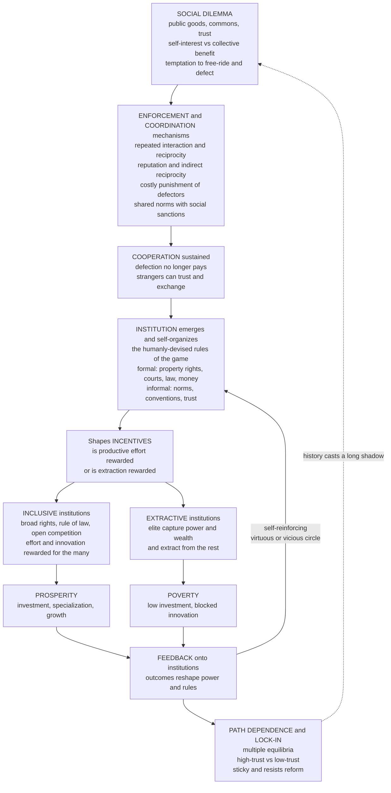

# 🏛️ Institutions, Cooperation, and Norms

> [!abstract] TL;DR
> **Institutions** are the humanly-devised **"rules of the game"** — both **formal** (laws, constitutions, property rights, contracts, courts, money) and **informal** (norms, conventions, customs, trust) — that **structure economic and social interaction** by shaping incentives and either enabling or constraining exchange (Douglass **North**). They are the **invisible scaffolding** without which markets cannot run: drop the *same* free-market recipe into South Korea and North Korea, into Botswana and Zimbabwe, and you get wildly different economies, because prosperity depends less on the recipe than on the **property rights, rule of law, honest money, and norms of fair dealing** that let strangers cooperate and trust contracts at all. Complexity economics rejects the idea that institutions are *designed by a planner* and instead sees them as **emergent, evolving structures** — money, language, and most norms arose as **spontaneous order** (Hayek) from repeated interaction, then **co-evolve** with technology and behaviour. The core problem institutions solve is the **social dilemma**: public goods, commons, and trust are settings where individual self-interest conflicts with collective benefit (free-riding, the **tragedy of the commons**), and institutions sustain **cooperation** despite the temptation to defect through **repeated interaction and reciprocity**, **reputation**, **costly punishment**, and **norms with social sanctions** (the mechanisms studied in [[Evolutionary_Game_Theory_Overview|evolutionary game theory]]). Elinor **Ostrom** showed communities *self-organize* commons governance without top-down state control or privatization, refuting the inevitability of the tragedy. And the difference between **inclusive** institutions (broad rights and opportunity → prosperity) and **extractive** ones (elite capture → poverty) is, per **Acemoglu and Robinson**, the *deep* cause of why nations succeed or fail — deeper than geography or culture. Because institutions are **path-dependent, self-reinforcing, and admit multiple equilibria** (a society can lock into a *high-trust/inclusive* **or** a *low-trust/extractive* state), they persist, resist reform, and cast long historical shadows — making the emergence and evolution of institutions, cooperation, and norms central to development, the governance of the commons, and the wealth of nations.

---

## Intuition

**Analogy — the same seed, two soils.** Take the *same* seed — call it "free markets, private trade, the profit motive" — and plant it in **South Korea and North Korea**, or in **Botswana and Zimbabwe**, or in **West and East Germany** a few decades apart. Same people, same culture, same geography, often the same starting wealth. Then wait. One side blooms into a rich, innovative economy; the other stays poor or collapses. The seed was identical, so the difference cannot be the seed. It is the **soil** — the invisible scaffolding of **rules** the seed grows in. Do you actually own what you build, or can it be seized? If someone breaks a contract, is there a court, or only a bribe? Is the money you save worth anything next year? Can you trust a stranger enough to trade with them, or only your cousin? That scaffolding — **property rights, courts, the rule of law, honest money, and norms of trust and fair dealing** — is what economists call **institutions**, and it is the difference between a market that generates wealth and a bazaar that never grows past the local and the personal.

Here is the twist complexity economics adds: **nobody built that scaffolding on a drawing board.** Money was never legislated into existence; it *emerged* as a convention. The norm that you keep your word, the custom of standing in line, the trust that lets you hand a stranger your credit card number — these were not *designed*, they **evolved**, growing out of countless repeated interactions the way a footpath is worn across a field by everyone taking the shortest route. Institutions are **emergent and evolving** structures that *arise from* the interactions of agents and then *shape* those interactions in turn. And because they are self-reinforcing — those who benefit defend them, and trust begets trust while distrust begets distrust — a society can get **stuck** in a good equilibrium *or* a bad one, and stay there for generations. Why some societies grow rich and others stay poor is, above all, a question about **the evolution of their institutions**.

---

## How It Works

### Core Mechanics

**1. Institutions are the "rules of the game" (North's definition).** Douglass North's canonical formulation: **institutions are the humanly-devised rules that structure economic and social interaction.** They split into two families. **Formal institutions** are written and enforced by third parties: constitutions, statutes, property rights, contract law, courts, regulatory agencies, sound money. **Informal institutions** are unwritten and self-enforced: norms, conventions, customs, codes of conduct, and generalized **trust**. Crucially, institutions are *not* the same as **organizations**: institutions are the *rules* (the "rules of chess"); organizations (firms, unions, parties, universities) are the *players* who act within — and try to reshape — those rules. Institutions matter because they **shape incentives**: they determine whether effort, investment, and innovation pay off, or whether cheating, expropriation, and extraction pay off instead. They are the deep parameters behind the supply-and-demand curves, invisible precisely because they are the background against which everything else happens.

**2. Why institutions matter — markets require scaffolding.** Complex, impersonal exchange is not the natural state of humanity; it is a fragile achievement that **requires institutions**. **Property rights** must be secure, or no one invests effort in something that can be seized. **Contracts** must be enforceable by **courts**, or strangers cannot trust deals that span time and distance. The **rule of law** must apply to the powerful too, or the game is rigged. **Money** must hold value, or long-range calculation collapses. And **trust and norms** must reach beyond kin and repeat-partners, or exchange shrinks back to the local and personal — you can only deal with your cousin, your village, people you will meet again. Where these are absent, the sophisticated **cooperation and specialization** that generate wealth simply cannot get off the ground: this is why "institutions are the key to development" became the great **institutional turn** in economics. The market is not a state of nature that appears when the state gets out of the way; it is a set of *institutions* that must be built and sustained.

**3. The emergence and evolution of institutions (the complexity view).** Where orthodox theory often treats institutions as *given constraints* or *designed by a planner*, complexity economics treats them as **emergent, self-organizing, and evolving**. Money, language, weights and measures, and most social norms are **spontaneous order** in Hayek's sense — the "result of human action but not of human design," arising from decentralized repeated interaction without any central architect. Institutions **evolve**: variants of rules and norms arise, are **selected** (the ones that coordinate behaviour and generate surplus spread), and are **transmitted** (culturally, by imitation and teaching) — the evolutionary reading developed in the sibling `Evolutionary_Economics_and_Selection` and in [[Cultural_Evolution_and_Social_Learning|cultural evolution]]. They also **co-evolve** with technology and behaviour: the printing press, the joint-stock company, and the internet each reshaped the institutions around them, which reshaped what technologies paid off. Some institutions *are* deliberately designed — constitutions, central banks, the WTO — but every designed institution is **embedded in, and constrained by, evolved informal norms**: a law that clashes with the surrounding culture of trust and fairness is a dead letter. The real world is an **interplay of designed and emergent** rules.

**4. Cooperation and social dilemmas — the problem institutions solve.** Strip away the scaffolding and you find the same recurring hard problem underneath: the **social dilemma**. In a **public good** (national defence, clean air, open-source software), a **common-pool resource** (a fishery, a pasture, groundwater), or any act of **trust**, individual self-interest pulls *against* collective benefit. Each person is tempted to **free-ride** — enjoy the good without paying, take more than a sustainable share — and if everyone yields, the good is under-provided or the commons is destroyed: Hardin's **tragedy of the commons**, the archetype of the [[The_Prisoners_Dilemma_and_Cooperation|prisoner's dilemma]] at scale. Institutions and norms are precisely the **mechanisms that enable cooperation despite the temptation to defect.** Cooperation is sustained by a well-understood toolkit (Nowak's "five rules"; see the [[Evolutionary_Game_Theory_Overview|EGT vault]]): **repeated interaction and direct reciprocity** — the *shadow of the future*, where defecting today costs you tomorrow ([[Direct_Reciprocity_and_Repeated_Games]]); **reputation and indirect reciprocity** — where third parties observe and reward the trustworthy ([[Indirect_Reciprocity_and_Reputation]]); **costly punishment of defectors** — *strong reciprocity*, where people pay to sanction cheaters even at personal cost ([[Social_Preferences_Fairness_and_Reciprocity]]); and **group and multilevel selection**, where cooperative groups out-compete selfish ones ([[Group_and_Multilevel_Selection]]). **The evolution of cooperation is the foundation on which institutions are built.**

**5. Norms — the informal, self-enforcing institutions.** A **social norm** is a shared expectation about how one *ought* to behave, enforced not by courts but by **approval and disapproval** — praise, shame, gossip, ostracism ([[Social_Norms_and_Conformity]]). Norms **emerge from repeated interaction** and coordinate behaviour cheaply and locally: which side of the road to drive on, whether to tip, keeping your word, honesty in trade, notions of fairness. Many begin as pure **conventions** — arbitrary but self-enforcing once established, the equilibrium-selection story of [[The_Evolution_of_Conventions_and_Norms|the evolution of conventions]] — and once everyone expects everyone else to follow them, no one wants to deviate. Norms are **decentralized institutions**: they need no legislature and no police, because the community *is* the enforcement mechanism. And they are the **moral basis of the market**: the formal machinery of contracts and courts rests on a bedrock of **non-market norms** of honesty, trust, and fair dealing. A society whose informal norms have decayed into low trust cannot be rescued by writing better laws, because laws presuppose the very norms that make them enforceable.

**6. Ostrom and governing the commons.** For decades the "tragedy of the commons" implied a stark choice: either the **state** must control shared resources top-down, or they must be **privatized**. Elinor **Ostrom's** Nobel-winning fieldwork demolished this false binary. Studying real Swiss alpine pastures, Japanese forests, Spanish irrigation systems, and Maine lobster fisheries, she found that communities **can and routinely do solve commons problems themselves**, through **emergent, self-organized institutions** — neither pure market nor pure state. She distilled recurring **design principles** of the arrangements that work: **clearly defined boundaries** (who may use the resource), **rules matched to local conditions**, **collective-choice arrangements** (users help set the rules), **monitoring** (often by the users themselves), **graduated sanctions** (small penalties first, escalating for repeat offenders), **cheap conflict-resolution mechanisms**, **recognized rights to organize**, and, for large systems, **nested/polycentric governance** (many overlapping decision centres rather than one). Ostrom's work is **deeply complexity-economics in spirit**: it is a landmark demonstration of **bottom-up, emergent institutional solutions** to cooperation problems — order that is grown, monitored, and adapted by the participants themselves, not imposed from above.

**7. Institutions and development — inclusive vs extractive.** This is the great development question, and Daron **Acemoglu** and James **Robinson** (*Why Nations Fail*) give it a sharp institutional answer. **Inclusive institutions** — secure, *broadly-held* property rights; the rule of law; open competition; low barriers to entry; broad political participation — **reward productive effort and innovation for the many**, so people invest, specialize, and create. **Extractive institutions** — power and wealth concentrated in a narrow **elite** who use the state to **extract** from everyone else — deliberately *block* creative destruction (because new firms and new wealth threaten the incumbents) and thereby entrench poverty. On this account, **institutions are the deep cause of the wealth and poverty of nations**, dominating geography and culture. The engine is a **feedback loop**: institutions shape **incentives** → incentives shape economic **outcomes** → outcomes shape the distribution of **power** → power reshapes **institutions**. When the loop is virtuous (broad prosperity underwrites broad political power, which defends inclusive rules) you get a self-reinforcing **virtuous circle**; when it is vicious (extraction concentrates power, which defends extraction) you get a **vicious circle**. This is why institutional differences, once established, **persist and matter enormously**.

**8. Path dependence and institutional lock-in.** Institutions are **sticky**. They are **path-dependent** and **self-reinforcing** for concrete reasons: those who benefit from existing rules have the power and the motive to **resist change**; institutions are **complementary**, so they lock in as bundles (a legal system, a financial system, and a set of norms that all presuppose one another); and norms are **slow to shift** because everyone's behaviour is anchored on everyone else's. The result is **multiple institutional equilibria** — a society can be trapped in a **low-trust/extractive** state *or* rest in a **high-trust/inclusive** one, and the difference is often not present conditions but **history** (the *demo* below makes this precise). This is why you **cannot simply import good institutions**: transplanting a Western legal code onto a society with different underlying norms typically fails, because institutions must **fit and evolve** with the informal rules and power structures around them. **Critical junctures** — colonial settlement patterns, revolutions, wars — nudge societies onto divergent tracks, and the tracks then **self-reinforce** for centuries (the colonial-origins literature of Acemoglu, Johnson, and Robinson). The mechanics here are exactly those of [[Increasing_Returns_and_Path_Dependence|increasing returns and path dependence]]: small early events, amplified by positive feedback, select among multiple stable outcomes and cast a long, non-fading shadow. **Institutional reform is hard precisely because bad institutions are equilibria, not accidents.**

### Flow / Architecture



---

## Key Concepts

### Secondary (intuitive)

- **Institutions are the rules, not the players.** They are the "rules of the game" that everyone plays by — laws *and* unwritten customs — while firms, unions, and governments are the *players*. Change the rules and you change what wins.
- **Markets need scaffolding.** A market is not what appears when you remove the state; it needs property rights, courts, honest money, and trust to work at all. Without them, you can only trade with people you already know.
- **Nobody designed most of it.** Money, language, standing in line, keeping your word — these *emerged* from people interacting over and over, like a footpath worn across a field. They evolved; they were not planned.
- **The commons problem.** When a resource is shared, everyone is tempted to grab more than their share, and it gets destroyed — unless there are rules. Ostrom showed communities often make those rules *themselves*.
- **Good soil or bad soil.** Some societies are stuck in a "everyone cheats, so cheat" trap; others enjoy a "everyone trusts, so trust" world. Which one you are in depends heavily on your history, and it is very hard to switch.

### Undergraduate (formal)

- **North's institutional economics.** Institutions = formal (laws, property rights, contracts, courts, money) + informal (norms, conventions, trust) rules that structure interaction and shape incentives; distinct from **organizations** (the players). Transaction costs and enforceability are the analytic core: good institutions **lower the cost of impersonal exchange**.
- **The social dilemma toolkit.** Public goods and common-pool resources create [[Public_Goods|free-rider problems]]; the [[Externalities_and_Pigouvian_Tax|externality]] and [[Market_Failures|market-failure]] framing shows *why* the unregulated outcome is inefficient, while the [[Coase_Theorem|Coase theorem]] shows well-defined property rights and low bargaining costs can internalize it — a property-rights route to cooperation.
- **The five rules of cooperation (Nowak).** Kin selection, **direct reciprocity** (repeated games, the folk theorem), **indirect reciprocity** (reputation), network/spatial reciprocity, and group selection — the mechanisms by which cooperation is evolutionarily sustained, and thus the microfoundations of informal institutions.
- **Ostrom's design principles.** Boundaries, congruence of rules with local conditions, collective-choice participation, monitoring, **graduated sanctions**, conflict-resolution, recognized right to organize, and nested/**polycentric** governance — an empirically-derived recipe for self-governed commons.
- **Inclusive vs extractive institutions (Acemoglu–Robinson).** Inclusive = broad rights + rule of law + open entry → prosperity; extractive = elite capture → poverty; the **institutions-as-deep-cause** thesis over geography and culture, with the incentives → outcomes → power → institutions feedback loop.

### Graduate (advanced)

- **Institutions as equilibria (Greif, Aoki, Schotter).** The game-theoretic view: an institution is not an exogenous constraint but a **self-enforcing equilibrium** of a repeated game — a stable, self-sustaining pattern of beliefs and behaviour that no one wants to unilaterally deviate from. This dissolves the false dichotomy between "rules imposed from outside" and "spontaneous behaviour": the *rule* and the *behaviour that sustains it* are the same equilibrium object (Avner Greif's analysis of the Maghribi traders' reputation system vs Genoese legal enforcement).
- **Multiple equilibria and the selection problem.** Social dilemmas with enforcement generically have **multiple stable equilibria** (a cooperative and a non-cooperative one) separated by an unstable **threshold/separatrix** — the formal content of "high-trust vs low-trust states." Which one obtains is not fixed by fundamentals; it is selected by **history and initial conditions** (non-ergodicity), the theme shared with [[Increasing_Returns_and_Path_Dependence|path dependence]]. Reform is a **basin-crossing** problem: you must move the system *over the barrier*, which incremental policy often cannot do.
- **Strong reciprocity and the second-order free-rider problem (Bowles–Gintis, Fehr–Gächter).** Punishment sustains cooperation, but punishing is *itself* a costly public good — why punish when others could? This **second-order free-rider problem** is resolved empirically by **strong reciprocity** (a taste for punishing cheaters even at net cost, documented in public-goods experiments) and theoretically by **gene-culture coevolution** and group selection. Cooperation among unrelated strangers is a genuine evolutionary puzzle, and the answer is partly *biological predisposition* plus *cultural institutions*, not pure self-interest.
- **Institutional path dependence and lock-in (North, Acemoglu–Johnson–Robinson).** Increasing returns to a given institutional arrangement (network effects among complementary institutions, learning effects, adaptive expectations, distributional coalitions à la Mancur Olson) make institutions self-reinforcing and hard to reform. **Critical junctures** interacting with pre-existing institutional differences produce **divergence**; the colonial-origins instrument (settler mortality → settler institutions → modern income) is the canonical empirical strategy, and its critiques (Glaeser et al. on human capital; Sachs on geography) define the live debate.
- **Polycentricity and beyond market-vs-state (Ostrom).** Efficient governance of complex resource systems is often **polycentric** — many overlapping, semi-autonomous decision centres — rather than either a single central authority or atomized private property. This is a **complex-adaptive-systems** claim about governance, connecting to how interaction topology shapes outcomes in [[Economic_Networks_and_Interaction_Structure|economic networks]].

---

## Python Demo

We model **cooperation as an emergent institution** using evolutionary (replicator) dynamics of a **public-goods game with punishment**. A fraction $x$ of the population are **cooperators** who both contribute to the public good *and* pay to **punish free-riders** (strong reciprocators); the rest are **defectors**. In a well-mixed population the shared public benefit cancels out of the payoff *difference*, leaving

$$\Delta(x) \;=\; \underbrace{-c}_{\text{cost of contributing}} \;\underbrace{-\,\gamma(1-x)}_{\text{cost of punishing each defector}} \;\underbrace{+\,\beta x}_{\text{fine a defector pays per punisher}} \;=\; -(c+\gamma) + (\gamma+\beta)\,x,$$

and the population evolves by the replicator equation $\dot x = x(1-x)\,\Delta(x)$.

- **Part (a) — emergence vs collapse.** *Without* enforcement ($\beta=\gamma=0$) the gap is $\Delta=-c<0$ always: defection strictly dominates and cooperation **collapses** — the **tragedy of the commons**. *With* enforcement (punishment of free-riders), $\Delta(x)$ becomes positive once cooperators are common enough, so from the same starting point cooperation **emerges and stabilizes** — an *institution of cooperation self-organizes*.
- **Part (b) — path dependence / multiple institutional equilibria.** With enforcement the system is **bistable**: $x=0$ (a **low-cooperation / low-trust** state) and $x=1$ (a **high-cooperation / high-trust** state) are *both* stable, separated by an **unstable threshold** $x^\* = (c+\gamma)/(\gamma+\beta)$. Which equilibrium a society reaches depends on its **initial condition / history**, not on its fundamentals — and crossing from the bad state to the good one means climbing *over the barrier*. Uses `numpy` and `matplotlib` only.

```python
# Cooperation as an EMERGENT INSTITUTION: a public-goods game with punishment,
# evolved by replicator dynamics. Shows (a) cooperation EMERGING with enforcement
# and COLLAPSING without it, and (b) PATH DEPENDENCE -- two stable institutional
# equilibria (high-trust vs low-trust) selected by history. numpy + matplotlib only.
import numpy as np
import matplotlib.pyplot as plt

# --- parameters of the public-goods-with-punishment game -------------------
c     = 1.0     # cost a cooperator pays to contribute to the public good
gamma = 0.2     # cost a cooperator pays to punish each defector encountered
beta  = 6.0     # fine a defector pays for each punisher (cooperator) encountered

# payoff gap (cooperator minus defector) as a function of cooperator fraction x
def d_enforce(x):   # WITH costly punishment of free-riders
    return -(c + gamma) + (gamma + beta) * x
def d_none(x):      # WITHOUT enforcement -> defection always pays
    return -c + 0.0 * x

x_star = (c + gamma) / (gamma + beta)     # unstable tipping threshold (separatrix)

def replicate(x0, gap, dt=0.02, steps=2000):
    """Integrate dx/dt = x(1-x)*gap(x) from x0 by explicit Euler."""
    x = np.empty(steps); x[0] = x0
    for t in range(steps - 1):
        xt = x[t]
        x[t + 1] = np.clip(xt + dt * xt * (1.0 - xt) * gap(xt), 0.0, 1.0)
    return x

dt, steps = 0.02, 2000
time = np.arange(steps) * dt

# --- Part (a): same start (0.35), enforcement on vs off --------------------
start = 0.35
coop_with    = replicate(start, d_enforce)
coop_without = replicate(start, d_none)

# --- Part (b): many initial conditions under enforcement -> bistable -------
inits = [0.05, 0.12, 0.18, 0.22, 0.35, 0.60, 0.90]
paths = {x0: replicate(x0, d_enforce) for x0 in inits}

# --- Part (b): institutional "potential" landscape V(x) (double well) ------
xs = np.linspace(0.0, 1.0, 400)
growth = xs * (1.0 - xs) * d_enforce(xs)          # dx/dt as a function of x
V = -np.concatenate([[0.0], np.cumsum(0.5 * (growth[:-1] + growth[1:]) * np.diff(xs))])

# ------------------------------ report -------------------------------------
print(f"Tipping threshold  x* = {x_star:.3f}  (below it cooperation collapses)")
print(f"(a) start={start}:  WITH enforcement -> {coop_with[-1]:.3f},  "
      f"WITHOUT -> {coop_without[-1]:.3f}")
print("(b) final state by initial condition (history decides the equilibrium):")
for x0 in inits:
    end = paths[x0][-1]
    label = "HIGH-trust (cooperation)" if end > 0.5 else "LOW-trust (collapse)"
    print(f"    x0 = {x0:>4}  ->  {end:0.2f}   {label}")

# ------------------------------ plotting -----------------------------------
fig, ax = plt.subplots(2, 2, figsize=(14, 9))

# (0,0) Part (a): emergence vs collapse
ax[0, 0].plot(time, coop_with, color="#2e7d32", lw=2.4,
              label="WITH punishment of free-riders")
ax[0, 0].plot(time, coop_without, color="#c0392b", lw=2.4,
              label="WITHOUT enforcement")
ax[0, 0].axhline(0.5, color="k", ls=":", lw=1)
ax[0, 0].set_title("(a) An institution of cooperation self-organizes -- or collapses\n"
                   "same starting point, enforcement makes the difference")
ax[0, 0].set_xlabel("time"); ax[0, 0].set_ylabel("fraction cooperating")
ax[0, 0].set_ylim(-0.02, 1.02); ax[0, 0].legend(fontsize=9); ax[0, 0].grid(alpha=0.3)

# (0,1) Part (b): trajectories from many initial conditions -> bistable
for x0, p in paths.items():
    color = "#2e7d32" if p[-1] > 0.5 else "#c0392b"
    ax[0, 1].plot(time, p, color=color, lw=1.8, alpha=0.9)
ax[0, 1].axhline(x_star, color="gray", ls="--", lw=1.6,
                 label=f"unstable threshold  x* = {x_star:.2f}")
ax[0, 1].set_title("(b) Path dependence: two stable institutional equilibria\n"
                   "history (initial condition) selects high-trust vs low-trust")
ax[0, 1].set_xlabel("time"); ax[0, 1].set_ylabel("fraction cooperating")
ax[0, 1].set_ylim(-0.02, 1.02); ax[0, 1].legend(fontsize=9); ax[0, 1].grid(alpha=0.3)

# (1,0) Part (b): the double-well institutional potential
ax[1, 0].plot(xs, V, color="#4a235a", lw=2.4)
ax[1, 0].axvline(x_star, color="gray", ls="--", lw=1.6)
ax[1, 0].annotate("LOW-trust\nequilibrium", xy=(0.0, V[0]), xytext=(0.06, V[0] + 0.02),
                  fontsize=9, color="#c0392b")
ax[1, 0].annotate("HIGH-trust\nequilibrium", xy=(1.0, V[-1]), xytext=(0.62, V[-1] + 0.02),
                  fontsize=9, color="#2e7d32")
ax[1, 0].annotate("barrier\n(reform must cross)", xy=(x_star, V[np.argmin(np.abs(xs - x_star))]),
                  xytext=(x_star + 0.03, V[np.argmin(np.abs(xs - x_star))] + 0.03),
                  fontsize=9, color="gray")
ax[1, 0].set_title("Institutional potential landscape -- a double well\n"
                   "two valleys = two lock-in states; the hill = the reform barrier")
ax[1, 0].set_xlabel("fraction cooperating  x"); ax[1, 0].set_ylabel("potential  V(x)")
ax[1, 0].grid(alpha=0.3)

# (1,1) Part (b): the payoff-gap / growth curve with fixed points
ax[1, 1].plot(xs, growth, color="#1565c0", lw=2.4)
ax[1, 1].axhline(0.0, color="k", lw=1)
ax[1, 1].plot([0, 1], [0, 0], "o", color="#2e7d32", ms=10, label="stable equilibria")
ax[1, 1].plot([x_star], [0], "o", color="gray", ms=10, label="unstable threshold")
ax[1, 1].fill_between(xs, 0, growth, where=growth > 0, color="#2e7d32", alpha=0.15)
ax[1, 1].fill_between(xs, 0, growth, where=growth < 0, color="#c0392b", alpha=0.15)
ax[1, 1].set_title("Why bistable: growth of cooperation  dx/dt\n"
                   "positive above x* (cooperation grows), negative below (collapses)")
ax[1, 1].set_xlabel("fraction cooperating  x"); ax[1, 1].set_ylabel("dx/dt")
ax[1, 1].legend(fontsize=9); ax[1, 1].grid(alpha=0.3)

plt.tight_layout()
plt.savefig("institutions_cooperation_and_norms.png", dpi=120)
print("\nSaved figure -> institutions_cooperation_and_norms.png")
```

Expected output (qualitative story is robust to the seed-free parameters):

```
Tipping threshold  x* = 0.194  (below it cooperation collapses)
(a) start=0.35:  WITH enforcement -> 1.000,  WITHOUT -> 0.000
(b) final state by initial condition (history decides the equilibrium):
    x0 = 0.05  ->  0.00   LOW-trust (collapse)
    x0 = 0.12  ->  0.00   LOW-trust (collapse)
    x0 = 0.18  ->  0.00   LOW-trust (collapse)
    x0 = 0.22  ->  1.00   HIGH-trust (cooperation)
    x0 =  0.35  ->  1.00   HIGH-trust (cooperation)
    x0 =  0.6  ->  1.00   HIGH-trust (cooperation)
    x0 =  0.9  ->  1.00   HIGH-trust (cooperation)

Saved figure -> institutions_cooperation_and_norms.png
```

Read the four panels as one argument. **Top-left (a):** from the *same* starting fraction (0.35), the world *with* costly punishment of free-riders sees cooperation **climb and stabilize near 1** — an institution self-organizing — while the world *without* enforcement sees it **collapse to 0**, the tragedy of the commons. The only difference is whether defectors face a sanction. **Top-right (b):** now hold enforcement fixed and vary only the **starting history**: societies that begin *above* the threshold $x^\*\approx0.19$ (green) lock into the **high-trust** equilibrium; those that begin *below* it (red) collapse into the **low-trust** one. Same rules, same fundamentals — **history decides destiny**. **Bottom-left:** the same fact drawn as an **institutional potential**: two valleys (low-trust at $x=0$, high-trust at $x=1$) separated by a **hill** at $x^\*$ — the barrier that any reform must push the society *over*, which is why incremental tinkering so often fails to move a country out of a bad equilibrium. **Bottom-right:** the mechanism — the growth rate $\dot x$ is **negative below** the threshold (cooperation shrinks) and **positive above** it (cooperation grows), so $x=0$ and $x=1$ are both self-reinforcing attractors and $x^\*$ is the unstable separatrix. Institutions are equilibria, multiple equilibria are possible, and which one you are in is a question of history — the entire logic of institutional path dependence in one figure.

---

## Real-World Applications

> **Example — the Maghribi traders vs the Genoese (Greif's two institutions for the same problem).** Eleventh-century long-distance trade posed a classic agency dilemma: a merchant sends goods overseas with an agent who could simply steal them. Two societies solved it with **two different institutions**. The Maghribi traders relied on an **informal, reputation-based** institution — a tight coalition that shared information and collectively boycotted any agent who cheated (indirect reciprocity at scale). The Genoese built a **formal, legal** institution — courts and contracts enforced by a third party. Both *worked*, both were self-enforcing equilibria, and — crucially — they set the two societies on **different long-run paths**: the formal, impersonal Genoese system scaled to anonymous exchange with strangers and underpinned European commercial expansion, while the closed reputation network did not. A textbook case of institutions as emergent, path-dependent solutions to the same cooperation problem.

- **Development economics and the institutional turn.** "Get the institutions right" reoriented development policy away from pure capital injection toward property rights, rule of law, and governance (the World Bank's governance indicators, the [[Development_Economics|development-economics]] literature). But the same theory warns why it is hard: you cannot **transplant** institutions, and aid that ignores local norms and power structures fails — the subject of the sibling `Complexity_Economics_and_Public_Policy`.
- **Governing the commons — climate, fisheries, water.** Ostrom's principles are applied to real common-pool resources: community-managed fisheries and forests, groundwater compacts, and the **polycentric** reading of climate governance (many overlapping city, regional, and national efforts rather than one global treaty). Global climate is the hardest social dilemma of all — a public good with billions of free-riders and weak enforcement.
- **Market and platform design — manufacturing trust at scale.** eBay's feedback ratings, Uber and Airbnb's two-sided reviews, and escrow/payment systems are *engineered* **reputation and enforcement institutions** that let strangers transact — [[Indirect_Reciprocity_and_Reputation|indirect reciprocity]] rebuilt in code. Contract design, escrow, and dispute resolution are institution-building for digital commerce.
- **Trust and social capital as economic assets.** Generalized [[Trust_Altruism_and_Cooperation|trust]] and [[Social_Capital_and_Trust|social capital]] measurably predict growth, financial development, and effective government (Putnam; Knack and Keefer). High-trust societies pay lower "transaction taxes" on every deal; low-trust societies burn resources on monitoring and enforcement.
- **Transition and state-building.** Post-communist transitions showed the danger of building markets *before* the supporting institutions and norms existed — rapid privatization onto weak rule of law produced oligarchic **extraction**, not competitive markets, a live demonstration of institutions-before-markets and of [[Political_Economy_and_Market_State_Relations|market–state]] co-dependence.

---

## Common Pitfalls

- **Believing markets run on thin air.** The deepest error is treating the market as a state of nature that emerges the instant the state steps back. Markets are **institutions** and rest on *other* institutions — property, courts, money, and above all **norms of trust**. Remove the scaffolding (as in a failed state or a lawless transition) and exchange collapses to the local and personal.
- **Confusing institutions with organizations.** Institutions are the **rules of the game**; organizations (firms, parties, agencies) are the **players**. Reforming an organization while leaving the incentive-shaping *rules* intact changes little — the new players face the old game.
- **Assuming good institutions can be transplanted.** Copying another country's constitution or legal code rarely works, because formal rules are **embedded in evolved informal norms** and existing power structures. Institutions must **fit and co-evolve**; imported ones that clash with the surrounding culture become dead letters.
- **Treating the tragedy of the commons as inevitable.** Hardin's conclusion — that commons *must* be either nationalized or privatized — is empirically false. **Ostrom** documented countless communities self-governing shared resources through emergent rules, monitoring, and graduated sanctions. Neither pure market nor pure state is the only option.
- **Ignoring the second-order free-rider problem.** "Just punish the cheaters" glosses over the fact that **punishing is itself costly** — a public good someone must provide. Cooperation sustained by punishment needs an account of *why people punish* (strong reciprocity, norms about norms), or the enforcement mechanism unravels one level up.
- **Mistaking a bad equilibrium for a mistake.** A country stuck in corruption and low trust is usually not making an error it could simply "fix" — it is in a **self-reinforcing extractive equilibrium** that the powerful defend and that everyone's expectations sustain. Reform is a **basin-crossing** problem requiring you to push the system *over the barrier*, which is why incremental, technocratic fixes so often fail.
- **Reifying "culture" as destiny.** Saying poor countries are poor because of their "culture" is both lazy and often wrong: the Acemoglu–Robinson evidence (North vs South Korea; the Nogales split across the US–Mexico border) shows near-identical cultures diverging under different **institutions**. Culture matters as *evolving norms*, not as fixed essence.

---

## Related Concepts

- [[The_Prisoners_Dilemma_and_Cooperation]] — the canonical social dilemma; institutions and norms are the machinery that resolves it at scale.
- [[Direct_Reciprocity_and_Repeated_Games]] — the "shadow of the future": repeated interaction sustains cooperation, the first of the five rules and the basis of informal enforcement.
- [[Indirect_Reciprocity_and_Reputation]] — reputation lets third parties reward the trustworthy, extending cooperation beyond repeat partners; the logic of platform review systems.
- [[Group_and_Multilevel_Selection]] — cooperative groups out-competing selfish ones, a route by which cooperative institutions spread.
- [[The_Evolution_of_Conventions_and_Norms]] — how conventions and norms self-select among multiple equilibria and lock in; the game-theoretic twin of this note.
- [[Cultural_Evolution_and_Social_Learning]] — the mechanism by which institutions vary, are selected, and are transmitted across generations.
- [[Evolutionary_Dynamics_in_Markets_and_Institutions]] — the evolutionary reading of how markets and institutions co-evolve over time.
- [[Social_Norms_and_Conformity]] — norms as shared expectations enforced by approval and disapproval; the behavioural core of informal institutions.
- [[Trust_Altruism_and_Cooperation]] — trust as the informal institution underpinning impersonal exchange and a measurable economic asset.
- [[Social_Preferences_Fairness_and_Reciprocity]] — strong reciprocity and fairness preferences that make costly punishment of free-riders possible.
- [[Public_Goods]] — the free-rider problem at the heart of the social dilemma institutions must solve.
- [[Externalities_and_Pigouvian_Tax]] — the market-failure framing of why uncoordinated behaviour is inefficient in commons and public-goods settings.
- [[Coase_Theorem]] — the property-rights route to internalizing externalities; institutions as the definition and enforcement of rights.
- [[Market_Failures]] — the welfare category that social dilemmas and missing institutions fall into.
- [[Increasing_Returns_and_Path_Dependence]] — the positive-feedback mechanics that make institutions sticky, self-reinforcing, and admit multiple equilibria (the demo's bistability).
- [[Economies_as_Complex_Adaptive_Systems]] — the parent worldview: institutions as emergent, self-organizing order rather than designed constraints.
- [[Economic_Networks_and_Interaction_Structure]] — how the topology of interaction shapes which cooperative equilibrium is selected and sustained.
- [[Complexity_Economics_Overview]] — the vault's entry point framing institutions as emergent, evolving structures.
- [[Bounded_Rationality_and_Heterogeneous_Agents]] — the boundedly-rational, adaptive agents whose repeated interactions generate norms and institutions.
- [[Development_Economics]] — institutions as the deep cause of the wealth and poverty of nations; the institutional turn in development.
- [[Endogenous_Growth_Theory]] — inclusive institutions reward innovation, the microfoundation linking institutions to sustained growth.
- [[Political_Institutions_and_Constitutions]] — the formal political rules that determine whether economic institutions are inclusive or extractive.
- [[State_Formation_and_Political_Development]] — how states and their institutions emerge, a political-science complement to the economic account.
- [[Political_Economy_and_Market_State_Relations]] — the power–institutions feedback loop that produces virtuous or vicious circles.
- [[Social_Capital_and_Trust]] — the sociology of trust networks as the informal substrate of cooperation.
- [[Culture_Norms_Values_and_Ideology]] — the sociological account of norms and values that constitute informal institutions.

**Planned siblings in this vault (referenced above in prose, not yet written):** `Evolutionary_Economics_and_Selection` (the variation–selection–transmission engine behind institutional change) and `Complexity_Economics_and_Public_Policy` (why institutions cannot be transplanted and how reform must work with emergent order).

---

## Review Questions

1. **(Conceptual)** North defines institutions as the "rules of the game." Explain precisely why **impersonal market exchange requires institutions** — naming the specific formal and informal rules involved — and why complexity economics insists these institutions are **emergent and evolving** rather than designed by a planner. Use money and the norm of keeping one's word as your two worked examples.

2. **(Scenario)** A development agency proposes to "fix" a poor, corrupt country by importing a modern legal code and a well-designed constitution wholesale. Using **inclusive vs extractive institutions**, the **incentives → outcomes → power → institutions** feedback loop, and the idea of **multiple equilibria / path dependence**, explain why this is likely to fail, what the model implies about *how* institutional reform can actually succeed, and how you would draw on **Ostrom's** findings to build cooperative institutions from the bottom up instead.

3. **(Trade-off / synthesis)** In the demo, adding costly **punishment of free-riders** turns a doomed commons into a stable cooperative institution, but it also creates a **second-order free-rider problem** and a **bistable** system where a society can be trapped in a low-trust equilibrium. Explain (i) why punishment is needed yet is *itself* a public good, (ii) what "the low-trust equilibrium is not a mistake but an equilibrium" means and why it makes reform a *basin-crossing* problem, and (iii) how this reframes the difference between the wealth and poverty of nations as a question about **history** rather than **fundamentals**.

---

## Sources

- North, D. C. (1990). *Institutions, Institutional Change and Economic Performance.* Cambridge University Press. — the foundational statement of institutions as the rules of the game and their role in economic performance.
- Ostrom, E. (1990). *Governing the Commons: The Evolution of Institutions for Collective Action.* Cambridge University Press. — the Nobel-winning demonstration of self-organized commons governance and the design principles.
- Acemoglu, D. & Robinson, J. A. (2012). *Why Nations Fail: The Origins of Power, Prosperity, and Poverty.* Crown. — the inclusive-vs-extractive-institutions thesis of development.
- Nowak, M. A. (2006). "Five Rules for the Evolution of Cooperation." *Science, 314*(5805), 1560–1563. — the canonical taxonomy of mechanisms that sustain cooperation.
- Fehr, E. & Gächter, S. (2002). "Altruistic Punishment in Humans." *Nature, 415*, 137–140. — experimental evidence that costly punishment of free-riders sustains cooperation (strong reciprocity).
- Greif, A. (2006). *Institutions and the Path to the Modern Economy: Lessons from Medieval Trade.* Cambridge University Press. — institutions as self-enforcing equilibria and the Maghribi-vs-Genoese comparison.

---

#complexity-economics #institutions #cooperation #social-norms #economic-development
