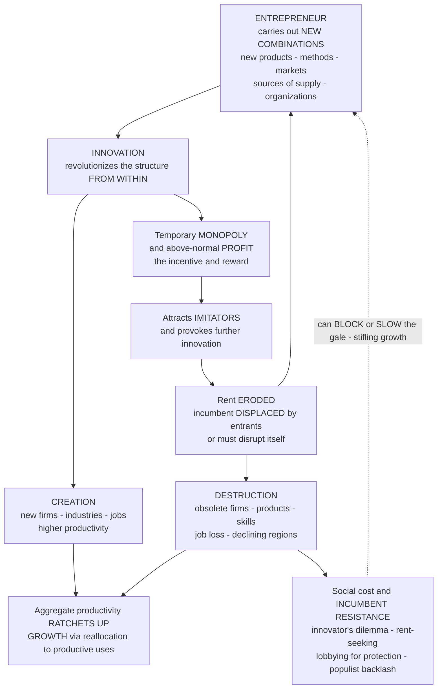

# 🌪️ Schumpeterian Creative Destruction

> [!abstract] TL;DR
> **Creative destruction** is Joseph **Schumpeter's** name for the "perennial gale" by which **innovation continuously revolutionizes the economic structure from within** — incessantly *destroying* the old (obsolete products, firms, technologies, skills, business models) to *create* the new. It is, he insisted, not an occasional disturbance but "**the essential fact about capitalism**": the core dynamic and the engine of its astonishing growth. The mechanism is an **entrepreneur** who carries out "**new combinations**" (new products, methods, markets, sources of supply, or organizations) lured by the prospect of a **temporary monopoly** and above-normal **profits**; that reward attracts imitators and further innovation, which **erode the profit and displace the innovation** with newer ones, so incumbents are **dethroned by entrants** and the cycle repeats forever. Crucially, **growth and disruption are two sides of one process**: aggregate productivity *ratchets upward* precisely because higher-productivity entrants **replace** lower-productivity incumbents — the reallocation of resources to more productive uses *is* the growth (formalized in **Aghion–Howitt** Schumpeterian endogenous-growth theory). You cannot have the creation without the destruction, so creative destruction carries genuine **human and social costs** (job loss, obsolete skills, declining regions, insecurity, inequality) that fuel resistance, and powerful **incumbents routinely try to block the gale** — through the "innovator's dilemma," rent-seeking, and extractive institutions — which stifles the very dynamism that drives prosperity. This makes creative destruction a foundational idea of evolutionary/complexity economics and the central lens for debates over innovation policy, **competition and antitrust** (dynamic vs static efficiency; are the tech giants innovation engines or creative-destruction blockers?), business dynamism, technological and AI disruption, and how to reap growth while cushioning its casualties.

---

## Intuition

**Analogy — the graveyard of giants.** In 1975 a Kodak engineer named Steven Sasson built the world's first **digital camera**. Kodak — then a near-monopoly so dominant that "a Kodak moment" was a phrase in the language — shelved it, terrified it would cannibalize the film business that was 80 percent of its profit. Thirty-seven years later Kodak filed for bankruptcy, destroyed by the very technology it had invented and buried. It is not a lonely tombstone. **Blockbuster** turned down the chance to buy **Netflix** for 50 million dollars and was gone within a decade. **Nokia** and **BlackBerry** owned the mobile phone and were erased by the smartphone. The **horse-and-buggy** trade, the ice-harvesting industry, the typesetter, the travel agent, the video-rental clerk — capitalism is a **graveyard of once-dominant firms**, each toppled not by a rival selling the *same thing* a little cheaper, but by an **innovation that made its entire business obsolete**.

Joseph Schumpeter called this the "**perennial gale of creative destruction**" — the ceaseless wind of innovation that **destroys the old economic structure to create a new one**. Here is the twist that makes it profound: this is **not a bug of capitalism but its very essence and the source of its growth**. The same gale that killed Kodak gave us the smartphone camera in every pocket; the same wind that closed the buggy-whip factory built the automobile industry and everything downstream of it. **Progress arrives dressed as disruption.** Where standard economics pictures the market as a calm machine settling into a tidy, efficient **equilibrium**, Schumpeter saw a **storm** — a restless, evolutionary, disequilibrium process that grows *by continuously tearing itself down and rebuilding taller*. To understand capitalism, he said, stop asking how it *administers existing structures* and start asking how it *creates and destroys them*.

---

## How It Works

### Core mechanics

**1. Schumpeter's break with equilibrium.** Writing in the early-to-mid twentieth century (*The Theory of Economic Development*, 1911; *Capitalism, Socialism and Democracy*, 1942), Joseph Schumpeter rejected the equilibrium economics of his contemporaries as answering the wrong question. Neoclassical theory asks how a *static structure* allocates given resources efficiently; but "the problem that is usually being visualized is how capitalism **administers** existing structures, whereas the relevant problem is how it **creates and destroys** them." Growth, in his vision, does **not** come from accumulating more capital *within* a fixed structure (the diminishing-returns story of the [[Solow_Growth_Model|Solow model]]) — it comes from the **qualitative transformation of the structure itself**. Capitalism "is by nature a form or method of economic **change** and never can be stationary." He is the intellectual father of innovation economics and a founder of the **evolutionary tradition** in economics (see the planned sibling `Evolutionary_Economics_and_Selection`).

**2. Innovation as "new combinations."** The raw material of creative destruction is **innovation**, which Schumpeter defined not as invention but as the **carrying-out of new combinations** — recombining existing resources in a new way. He enumerated five kinds: (i) a **new product** or new quality of good; (ii) a **new method of production**; (iii) the opening of a **new market**; (iv) a **new source of supply** of raw materials; (v) a **new organization** of an industry (creating or breaking a monopoly). Innovation as *recombination* is the deep link to the combinatorial view of technology (see the planned sibling `Innovation_Recombination_and_the_Adjacent_Possible`): the space of possible new combinations expands with every innovation, so the gale never runs out of fuel.

**3. The entrepreneur as the disruptive agent.** The agent who *carries out* new combinations is the **entrepreneur** — pointedly **not** the inventor (who has the idea) nor the manager (who runs the existing routine), but the one who **disrupts** by *implementing* an innovation against the inertia of the established order. The entrepreneur is capitalism's **mutation-and-selection agent**: introducing the variation that the market then selects on. What motivates this disruptive act? The prospect of a **temporary monopoly** and the **above-normal profit** it yields — the entrepreneurial reward for being first.

**4. The cycle of creative destruction.** These pieces form a self-renewing loop:

1. An entrepreneur introduces an **innovation** (a new combination).
2. The innovation grants a **temporary monopoly** and **above-normal profits** — the *incentive and reward*, the carrot that makes the risky disruption worthwhile.
3. Those profits **attract imitators** and provoke further innovation, which **erode the monopoly rent** and eventually **displace the innovation** with a newer one.
4. **Incumbents are dethroned by entrants** — or must cannibalize themselves to survive.
5. The cycle **repeats perpetually**. "The process of Creative Destruction is the essential fact about capitalism."

This reframes **monopoly** entirely. In the neoclassical picture (see [[Monopoly]]) monopoly is a static evil — deadweight loss. In Schumpeter's picture the *temporary* monopoly is the **innovation rent**: the necessary prize that induces the innovation in the first place, which competition then competes away. Monopoly is not the enemy of dynamism but partly its **engine** — provided it stays temporary.

**5. Growth *through* destruction — the paradox.** The deepest point: **economic growth and disruption are two sides of the *same* process.** Aggregate productivity rises **because** higher-productivity firms and technologies *replace* lower-productivity ones — the **reallocation** of labour and capital out of dying activities into more productive new ones *is* the growth. You cannot have the creation without the destruction: no omelette without breaking eggs. **Aghion and Howitt** (1992) turned this into rigorous macroeconomics — the **Schumpeterian endogenous-growth model**, in which each innovation both *raises* the productivity frontier and *destroys the rents of the previous innovator* (the "business-stealing" effect), so growth is literally the arrival rate of creative destruction. This is the innovation-driven complement to [[Endogenous_Growth_Theory|endogenous growth theory]] and a bridge to the planned sibling `Technological_Change_and_Growth_Dynamics`.

**6. The destruction is real — the human and social cost.** Creative destruction is *creative* but also genuinely **destructive**. Firms fail; workers lose jobs and see hard-won **skills made obsolete**; whole **communities and regions** built on an old industry decline (the Rust Belt after steel; coal towns; mill towns). The churn manufactures **insecurity and inequality** — there are clear **winners and losers**, and the losers are often concentrated and visible. This is not a footnote; it is the **flip side of the coin** and the source of the politics. It drives resistance to change — historical **Luddism**, **protectionism**, and modern **populist backlash** against "disruption" — and it motivates policy to *manage the transition*: safety nets, retraining, and the Nordic maxim "**protect workers, not jobs**." (The distributional face connects to [[Wealth_and_Income_Inequality_Dynamics|inequality dynamics]].)

**7. Incumbent resistance — why the gale gets blocked.** Because destruction is real, the powerful fight it. Two channels:

- **The innovator's dilemma (Christensen).** Incumbents *fail to adopt* disruptive innovations even when they see them coming, because the new technology **cannibalizes existing profits**, serves *low-margin* customers the incumbent doesn't value, and doesn't fit current capabilities. Kodak and digital is the textbook case: the rational defence of today's profits is the mechanism of tomorrow's death.
- **Rent-seeking and extractive institutions.** Incumbents **lobby for protection** — regulation, IP, licensing, subsidies, tariffs — to raise **entry barriers** and block the entrants who would displace them. **Acemoglu and Robinson** put this at the centre of *Why Nations Fail*: **extractive elites deliberately block creative destruction** to protect their position, and *that political choice*, not geography or culture, is why nations stay poor. The tension between **dynamism** (which needs entry and incumbent displacement) and **incumbent power** (which resists it) is fought out in the political arena — see [[Development_Economics_and_Political_Development|extractive vs inclusive institutions]], [[Regulatory_Politics_and_Administrative_Law|regulatory capture and rent-seeking]], and the planned sibling `Institutions_Cooperation_and_Norms`.

**8. Dynamic vs static competition.** Schumpeterian competition is **dynamic**: firms compete **for the market** by *replacing* it with something new, not merely **in the market** on price within a stable product. This is a fundamentally different lens for **antitrust**. A neoclassical view fixates on *static* efficiency (price at marginal cost, market share right now); a Schumpeterian view prizes *dynamic* efficiency (the rate of innovation over time) and tolerates temporary monopolies as innovation rewards — while worrying about *entrenched* monopolies that block disruption. Hence the modern debate over the tech giants: are Google, Amazon, Apple, and Meta **innovation engines** riding the gale, or **creative-destruction blockers** using scale, data, and acquisitions to smother the entrants who would dethrone them?

### The cycle of creative destruction



---

## Key Concepts

### Secondary (intuitive)

- **Creative destruction = progress that arrives as disruption.** New things don't just add to the old — they *kill* the old. The smartphone didn't sit beside the camera, the map, the MP3 player, and the phone book; it *replaced* them all.
- **The graveyard is the point.** Kodak, Blockbuster, Nokia, BlackBerry didn't die because a competitor undercut their price. They died because an **innovation made their whole business obsolete**. That churn *is* capitalism working, not failing.
- **The carrot is temporary monopoly.** Entrepreneurs disrupt because whoever is first gets a period of fat profits with no competition. Then imitators pile in, profits fall, and someone has to innovate again to escape.
- **You can't have the growth without the pain.** Higher productivity means new, better firms *replacing* old, worse ones — which means bankruptcies, lost jobs, and obsolete skills. The creation and the destruction are the *same event* seen from two sides.
- **The powerful fight the wind.** Big incumbents don't accept being disrupted — they lobby for rules that keep newcomers out, or they smother the new thing because it would eat their old profits.

### Undergraduate (formal)

- **Innovation vs invention vs entrepreneurship.** Invention creates the idea; **innovation** is *carrying out the new combination* (implementing it in the market); the **entrepreneur** is the agent who does so, distinct from the inventor and the manager. Only innovation moves the economy.
- **The five "new combinations."** New product, new method, new market, new supply source, new organization — Schumpeter's taxonomy of what an entrepreneur can recombine.
- **Innovation rents and their erosion.** An innovation confers a **temporary monopoly** yielding **super-normal profit** (Schumpeterian *rent*); imitation and further innovation **compete the rent away**, restoring pressure to innovate again. Monopoly is reframed as a *transient prize*, not a permanent deadweight loss.
- **Dynamic vs static efficiency.** *Static* efficiency = prices near marginal cost at a point in time (the neoclassical antitrust concern). *Dynamic* efficiency = the *rate of innovation and productivity growth over time*. Schumpeter argued the second matters far more, and that some static inefficiency (temporary monopoly) buys large dynamic gains.
- **Competition *for* vs *in* the market.** Schumpeterian competition is a race to *replace* the market via innovation ("for the market"), not price rivalry *within* a stable market ("in the market") — see [[Perfect_Competition]], [[Monopoly]], [[Oligopoly]].
- **Reallocation as the source of growth.** Aggregate productivity grows chiefly through **between-firm reallocation**: resources moving from low- to high-productivity firms as entrants displace incumbents. Empirically (Foster–Haltiwanger–Krizan), a large share of industry productivity growth is exactly this entry/exit churn.

### Graduate (advanced)

- **The Aghion–Howitt model (1992) — creative destruction as endogenous growth.** A sequence of vertical innovations each raises productivity by a factor $\gamma>1$. Innovations arrive via a Poisson process with intensity $\lambda(n)$ increasing in research labour $n$. The current monopolist earns rents *until* the next innovation destroys them — the **business-stealing / creative-destruction externality**. The equilibrium growth rate is $g=\lambda\,\ln\gamma$ (arrival rate times step size). Growth is *literally* the rate of creative destruction. Two opposing externalities coexist: a positive **intertemporal spillover** (each innovation builds the platform for the next → under-investment in research) and a negative **business-stealing effect** (the innovator ignores the rents it destroys → over-investment), so the market rate can be above *or* below optimal — a subtle, non-obvious welfare result.
- **The "escape-competition" vs "Schumpeterian" effects (Aghion et al.).** More competition can *raise* innovation (laggard firms innovate to **escape** neck-and-neck competition) or *lower* it (competition erodes the monopoly rent that rewards innovation). The net is an **inverted-U** between competition and innovation — reconciling Schumpeter (monopoly aids innovation) with Arrow (competition aids innovation) as two regimes of one curve. This is the state-of-the-art competition-policy result.
- **Quality ladders and Schumpeterian selection.** Grossman–Helpman "quality-ladder" models: each product line is climbed by successive innovators, each leapfrogging the incumbent leader and capturing the market (Bertrand) until itself displaced. This is **selection on a fitness variable (productivity/quality)** — formally kin to [[Replicator_Dynamics|replicator dynamics]] and evolutionary [[Evolutionary_Dynamics_and_Fitness_Landscapes|search on a fitness landscape]], which is why creative destruction sits inside evolutionary/complexity economics rather than equilibrium economics.
- **Declining dynamism as a growth problem.** A live empirical worry: US **business dynamism has fallen** for decades — declining startup rates, falling job reallocation, rising industry **concentration**, widening productivity gaps between "superstar" frontier firms and the rest, and a shrinking average tenure of S&P 500 firms that has *stopped* shrinking. If incumbents are **entrenching** and the gale is **weakening**, Schumpeterian theory predicts exactly the **productivity slowdown** the advanced economies have experienced — making "is creative destruction slowing?" one of the central macro questions of the decade.
- **Political economy of the gale (Acemoglu–Robinson).** Creative destruction is endogenous to **institutions**: inclusive institutions permit entry and displacement; extractive elites block it to preserve rents, trading long-run growth for the security of their position. The result is a **poverty trap of blocked innovation** — a formal reason the gale is politically fragile even though it drives prosperity.

---

## Python Demo

We simulate an industry as a **Schumpeterian quality ladder**. A single **incumbent** starts with the whole market. Periodically an **entrant** arrives with an **innovation** whose productivity *leapfrogs the current frontier*; seeded with a tiny market share, it then **rises** by taking share from the incumbent (modeled as **replicator selection**: higher productivity wins share), until the **next** innovation displaces *it* in turn. Panel (1) shows the **turnover** — successive dominant firms rising and falling, market leadership constantly changing hands (**churn**). Panel (2) shows that while individual firms live and die, **aggregate productivity ratchets upward** with every innovation — *growth through destruction* (the frontier jumps; the economy-wide average climbs toward it, then jumps again). Panels (3)–(4) illustrate the **trade-off**: sweeping the intensity of creative destruction shows that **faster growth and more disruption are two sides of the same process** — and that **strong incumbent protection** (low creative-destruction intensity, left edge) buys stability at the cost of **slow growth**. `numpy` and `matplotlib` only.

```python
# Schumpeterian creative destruction: a quality-ladder industry with replicator
# market dynamics. Entrants leapfrog the frontier, capture the market, then are
# themselves displaced (churn), while aggregate productivity ratchets upward.
import numpy as np
import matplotlib.pyplot as plt

def run_industry(T, innov_rate, step, beta, seed_share, rng, max_firms=600):
    """One industry over T periods.
    - Each firm holds a productivity/quality q; market share s evolves by replicator
      selection (fitness = q**beta): higher productivity STEALS share from lower.
    - With prob innov_rate each period an ENTRANT arrives with q a 'step' ABOVE the
      current frontier (a leapfrogging innovation), seeded with a tiny share -> it
      RISES, displacing the incumbent, until the NEXT entrant displaces it (churn).
    Returns per-firm share history, aggregate (share-weighted) productivity, the
    frontier (best) productivity, and the number of leadership changes."""
    q = np.array([1.0])                 # firm 0: the initial incumbent
    s = np.array([1.0])                 # holds the whole market
    n = 1
    share_hist = np.zeros((T, max_firms))
    agg = np.zeros(T)                   # share-weighted aggregate productivity
    frontier = np.zeros(T)             # best available productivity (the frontier)
    leader = 0
    leader_changes = 0
    for t in range(T):
        # --- entry of an innovating entrant that leapfrogs the frontier ---
        if rng.random() < innov_rate and n < max_firms:
            q = np.append(q, q.max() * (1.0 + step))
            s = np.append(s * (1.0 - seed_share), seed_share)   # make room, seed entrant
            n += 1
        # --- replicator selection: productivity wins market share ---
        s = s * (q ** beta)
        s = s / s.sum()
        # --- record ---
        share_hist[t, :n] = s
        agg[t] = float((s * q).sum())
        frontier[t] = float(q.max())
        new_leader = int(np.argmax(s))
        if new_leader != leader:
            leader_changes += 1
            leader = new_leader
    return share_hist, agg, frontier, leader_changes, n

# ---------------- (1)-(2): one representative industry ----------------
rng = np.random.default_rng(7)
T, innov_rate, step, beta, seed = 700, 0.035, 0.35, 1.0, 1e-3
share_hist, agg, frontier, changes, n_firms = run_industry(T, innov_rate, step, beta, seed, rng)
t = np.arange(T)
print(f"Representative run: {n_firms} firms ever entered, "
      f"{changes} changes of market leadership over {T} periods "
      f"({changes/T:.3f} per period).")
print(f"Aggregate productivity grew {agg[-1]/agg[0]:.1f}x; "
      f"frontier productivity grew {frontier[-1]/frontier[0]:.1f}x.")

# ---------------- (3)-(4): sweep the intensity of creative destruction ----------------
rates = np.linspace(0.004, 0.075, 14)     # low rate ~ strong incumbent protection
n_reps = 25
growth_mean, churn_mean = [], []
for r in rates:
    g_runs, c_runs = [], []
    for _ in range(n_reps):
        _, a, _, lc, _ = run_industry(T, r, step, beta, seed, rng)
        g_runs.append((np.log(a[-1]) - np.log(a[0])) / T)   # avg log-productivity growth
        c_runs.append(lc / T)                                # leadership changes per period
    growth_mean.append(np.mean(g_runs))
    churn_mean.append(np.mean(c_runs))
growth_mean, churn_mean = np.array(growth_mean), np.array(churn_mean)

# ---------------- plot ----------------
fig, ax = plt.subplots(2, 2, figsize=(14, 9))

# (1) turnover: successive leaders rise and fall
for j in range(n_firms):
    ax[0, 0].plot(t, share_hist[:, j], lw=1.4, alpha=0.9)
ax[0, 0].set_title("(1) TURNOVER: successive leaders RISE and FALL\n"
                   "market leadership constantly changes hands = churn")
ax[0, 0].set_xlabel("period"); ax[0, 0].set_ylabel("market share of each firm")
ax[0, 0].set_ylim(-0.02, 1.02); ax[0, 0].grid(alpha=0.3)

# (2) aggregate productivity ratchets upward
ax[0, 1].plot(t, frontier, color="#c0392b", lw=2.0, label="frontier (best) productivity")
ax[0, 1].plot(t, agg, color="#2980b9", lw=2.0, label="aggregate (share-weighted)")
ax[0, 1].set_yscale("log")
ax[0, 1].set_title("(2) GROWTH THROUGH DESTRUCTION\n"
                   "each innovation ratchets productivity UP (log scale)")
ax[0, 1].set_xlabel("period"); ax[0, 1].set_ylabel("productivity (log)")
ax[0, 1].legend(fontsize=9); ax[0, 1].grid(alpha=0.3, which="both")

# (3) growth vs creative-destruction intensity
ax[1, 0].plot(rates, growth_mean, "o-", color="#27ae60", lw=2)
ax[1, 0].axvspan(rates[0], rates[2], color="grey", alpha=0.18)
ax[1, 0].annotate("strong incumbent\nprotection ->\nSLOW growth",
                  xy=(rates[1], growth_mean[1]), xytext=(rates[3], growth_mean[-1]*0.55),
                  fontsize=9, arrowprops=dict(arrowstyle="->"))
ax[1, 0].set_title("(3) more creative destruction -> FASTER GROWTH")
ax[1, 0].set_xlabel("creative-destruction intensity (innovation rate)")
ax[1, 0].set_ylabel("aggregate productivity growth / period")
ax[1, 0].grid(alpha=0.3)

# (4) the trade-off: growth and disruption are two sides of one process
ax[1, 1].plot(churn_mean, growth_mean, "s-", color="#8e44ad", lw=2)
ax[1, 1].set_title("(4) TRADE-OFF: growth and disruption are INSEPARABLE\n"
                   "you cannot buy the growth without the churn")
ax[1, 1].set_xlabel("disruption: leadership changes / period (churn)")
ax[1, 1].set_ylabel("aggregate productivity growth / period")
ax[1, 1].grid(alpha=0.3)

plt.tight_layout()
plt.savefig("schumpeterian_creative_destruction.png", dpi=120)
print("\nSaved figure -> schumpeterian_creative_destruction.png")
```

Expected output (values vary slightly with the seed; the qualitative story is robust):

```
Representative run: 27 firms ever entered, 25 changes of market leadership over 700 periods (0.036 per period).
Aggregate productivity grew 12.x; frontier productivity grew 13.x.

Saved figure -> schumpeterian_creative_destruction.png
```

Read the four panels as one argument. **Panel (1) — turnover:** every firm's share is a *hump* — it rises as its innovation displaces the incumbent, dominates for a while, then **falls** as the next entrant leapfrogs it. Market leadership changes hands ~25 times; *no firm holds the crown for long*. This is Schumpeter's central image: dominance is always temporary, the graveyard always filling. **Panel (2) — growth through destruction:** despite (indeed *because of*) all that firm-level death, **aggregate productivity ratchets upward** — the frontier (red) jumps at each innovation, and the economy-wide average (blue) climbs toward it, then jumps again. The ~13x productivity gain is *built entirely out of destruction*: every step up required an incumbent to be displaced. **Panel (3) — growth rises with the intensity of creative destruction:** turn the gale up (more innovation, more entry, more displacement) and growth accelerates; turn it *down* — the grey **strong-incumbent-protection** zone — and growth **stalls**. **Panel (4) — the inescapable trade-off:** plotting growth *against* churn traces a rising line — **more growth simply *is* more disruption**. You cannot slide along one axis without moving along the other. This is the policy heart of the topic: the human cost of churn (panel-1's firm deaths, and in reality the job losses behind them) is not a detachable side-effect of growth — it is the *same phenomenon*. The choice is not "growth without disruption" but "how to reap the growth while cushioning its casualties."

---

## Real-World Applications

> **Example — the shrinking lifespan of the incumbent.** The average tenure of a company in the **S&P 500** has collapsed from ~60 years in the 1950s to under ~20 today, and disruption timelines keep compressing: **Netflix** destroyed **Blockbuster** (which had 9,000 stores), **Amazon** hollowed out big-box and mall retail, the **iPhone** erased **Nokia** and **BlackBerry** from a market they owned, **Uber** and **Lyft** gutted the medallion-taxi industry, and streaming demolished the record and video-rental businesses. Each is a textbook gale: not a cheaper *same* product but an **innovation that made the incumbent's whole model obsolete** — and each created vast new industries (app economies, gig platforms, cloud infrastructure) on the ruins. The acceleration is why "**disrupt or be disrupted**" is Silicon Valley's governing anxiety (Christensen's *disruptive innovation*).

- **Innovation and growth policy.** The Schumpeterian view says productivity growth comes from **reallocation** — fostering **entry**, **business dynamism**, and the churn that moves resources to their most productive use. Policy levers: R&D support, easy firm entry and exit (fast bankruptcy, low startup barriers), competition enforcement, and *not* propping up "zombie" incumbents. Bridges to [[Endogenous_Growth_Theory|endogenous growth]] and the planned sibling `Technological_Change_and_Growth_Dynamics`.
- **Competition and antitrust.** The **dynamic-vs-static** debate is now front-page: are the tech giants innovation engines whose temporary dominance is the just reward of the gale, or **creative-destruction blockers** using acquisitions ("killer acquisitions"), data moats, and platform control to smother the entrants who would dethrone them? The Schumpeterian answer turns on whether the monopoly is *temporary* (a rent competition will erode) or *entrenched* (a barrier competition cannot cross) — see [[Monopoly]], [[Oligopoly]], and [[Regulatory_Politics_and_Administrative_Law|regulatory capture]].
- **Labour and social policy.** Because destruction is inseparable from growth, managing its **human cost** is the core social-policy problem: unemployment insurance, wage insurance, **active labour-market programs** and retraining, and the "**flexicurity**" model (protect *workers*, not *jobs*). Getting this wrong turns the losers of the gale into a political coalition *against* the gale itself — see [[Wealth_and_Income_Inequality_Dynamics|inequality dynamics]].
- **The political economy of reform.** Overcoming **incumbent resistance** is the reason liberalizing reforms are so hard: entrenched interests block the entry and displacement that would raise growth. Understanding *whose rents* a reform destroys predicts *who* will fight it — the [[Development_Economics_and_Political_Development|extractive-institutions]] and [[Political_Economy_and_Market_State_Relations|market–state]] frontier, and the planned sibling `Institutions_Cooperation_and_Norms`.
- **The "is dynamism dying?" macro debate.** Falling startup rates, rising concentration, and a productivity slowdown across the advanced economies raise the alarming possibility that the gale is **weakening** — incumbents entrenching, entrants thinning. If Schumpeter is right that growth *is* creative destruction, a slowing gale is a direct explanation for slowing growth, and reviving dynamism becomes a first-order policy goal. The complexity-economics framing lives in [[Economies_as_Complex_Adaptive_Systems|the economy as a complex adaptive system]] and [[Economic_and_Social_Complexity|applied economic complexity]].
- **AI and the next gale.** Generative AI is the current test case: which tasks, jobs, and firms will it render obsolete, which new industries will it create, how fast, and how should the transition be cushioned? — creative destruction as a *forecast*, not just a history.

---

## Common Pitfalls

- **Hearing only "creative" (techno-utopianism) or only "destruction" (declinism).** The phrase is a *dialectic*: the two are **one process**. Boosters who celebrate disruption while ignoring the Rust Belt, and pessimists who mourn lost jobs while ignoring the industries created, have each grasped one half of Schumpeter and missed the point. The demo's panel (4) is the corrective — growth and churn are the *same axis*.
- **Confusing invention, innovation, and disruption.** Kodak *invented* the digital camera (invention) but did not *carry it out* in the market (innovation) and so was *disrupted* by others who did. The value is captured by the entrepreneur who **implements**, not the one who first *thinks of* it. Missing this inverts the whole causal story.
- **Treating all monopoly as the neoclassical villain.** A *temporary* monopoly is the **innovation rent** that *induces* the innovation — killing it prematurely can *reduce* dynamic efficiency even as it raises static efficiency. But an *entrenched* monopoly that *blocks* entrants is the opposite: a dam against the gale. Antitrust that cannot tell these apart will get both cases wrong.
- **Assuming the gale is automatic and permanent.** Creative destruction is **politically fragile**. Incumbents actively **block** it (innovator's dilemma, rent-seeking, extractive institutions), and declining business dynamism suggests it can genuinely **weaken**. "Markets will disrupt themselves" is complacent; the gale needs *institutions that permit entry and displacement* to keep blowing.
- **"Protect the jobs" instead of "protect the workers."** Freezing the *specific jobs and firms* the gale would destroy is the surest way to **kill the growth**, because the growth *is* the reallocation. The humane and efficient response cushions the *people* (income, retraining, mobility) while *letting the reallocation happen* — a distinction that gets lost in every trade-and-tariff debate.
- **Mistaking cheaper-same-thing competition for creative destruction.** Schumpeterian competition is **for the market** (replace it with something new), not **in the market** (undercut on price). A rival selling identical widgets 5 percent cheaper is *not* the gale; a rival making your widget *pointless* is. Confusing the two leads firms to defend the wrong flank — polishing a product while a different technology eats the whole category.
- **Extrapolating firm-level tragedy to economy-level tragedy.** Every hump in panel (1) *ends* — from a single firm's view, disruption is pure loss. But panel (2) shows the aggregate *rising* through exactly those deaths. Reasoning about the *system* from the vantage of any one *incumbent* is a level-confusion that fuels bad protectionist intuition.

---

## Related Concepts

- [[Increasing_Returns_and_Path_Dependence]] — network effects and lock-in can *entrench* an incumbent and blunt the gale, or make the *winner* of a creative-destruction wave take all; the two dynamics interact to shape who gets dethroned and how permanently.
- [[Endogenous_Growth_Theory]] — the Schumpeterian (Aghion–Howitt) strand where growth *is* the arrival rate of creative destruction, and the innovation-rent incentive is formalized.
- [[Technological_Progress]] — innovation as the driver of the productivity frontier; the "creation" half of the process.
- [[Solow_Growth_Model]] — the diminishing-returns, within-structure growth benchmark that Schumpeter's *transformation-of-the-structure* view was built against.
- [[Diffusion_of_Innovations_and_Adoption_Dynamics]] — how a new combination *spreads* and captures share from the incumbent; the micro-engine of the "rise" phase of each leader in the demo.
- [[Monopoly]] — reframed by Schumpeter as a *temporary innovation rent* (the incentive), not only a static deadweight loss; the crux of the dynamic-vs-static antitrust debate.
- [[Oligopoly]] — the market structure in which most Schumpeterian competition-for-the-market actually plays out (large R&D-intensive firms racing to leapfrog).
- [[Perfect_Competition]] — the static price-competition benchmark; Schumpeter argued dynamic competition-*for*-the-market matters far more for welfare.
- [[Business_Cycle_Indicators]] — Schumpeter's *Business Cycles* tied waves of innovation (Kondratiev long waves) to the rhythm of creative destruction.
- [[Evolutionary_Dynamics_in_Markets_and_Institutions]] — the evolutionary-economics framing of firms as variation-and-selection units, of which creative destruction is the flagship mechanism.
- [[Evolutionary_Economics_and_Bounded_Rationality]] — Nelson–Winter routines, search, and selection: the formal descendants of Schumpeter's evolutionary vision.
- [[Replicator_Dynamics]] — the selection equation underlying the quality-ladder demo (higher-fitness/productivity firms gain share).
- [[Evolutionary_Dynamics_and_Fitness_Landscapes]] — innovation as rugged-landscape search and recombination; the "new combinations" mechanism made spatial.
- [[Economies_as_Complex_Adaptive_Systems]] — the economy as a restless, out-of-equilibrium system that renews itself through disruption — creative destruction is a defining feature.
- [[The_Limits_of_Neoclassical_Equilibrium]] — why the equilibrium picture Schumpeter rejected cannot capture qualitative structural change.
- [[Non_Equilibrium_and_Out_of_Equilibrium_Dynamics]] — the perpetual-disequilibrium character of an economy driven by a "perennial gale."
- [[Complex_Adaptive_Systems]] — the general systems framing (agents, variation, selection, emergence) that creative destruction instantiates in economics.
- [[Economic_and_Social_Complexity]] — applied systems-thinking treatment of economic disruption, adaptation, and turnover.
- [[Nonlinearity_and_Feedback]] — the profit-incentive → innovation → imitation → erosion loop is a nonlinear feedback system.
- [[Bifurcations_and_Tipping_Points]] — a disruptive innovation can *tip* a market from one dominant technology/firm to another.
- [[Wealth_and_Income_Inequality_Dynamics]] — the winners-and-losers, insecurity, and regional-divergence face of the gale.
- [[Development_Economics_and_Political_Development]] — Acemoglu–Robinson: extractive elites blocking creative destruction as a root cause of national poverty.
- [[Regulatory_Politics_and_Administrative_Law]] — how incumbents use regulation, licensing, and capture to raise entry barriers and block the gale (rent-seeking).
- [[Political_Economy_and_Market_State_Relations]] — the arena where the battle over dynamism vs incumbent protection is fought.

**Planned siblings in this vault (referenced above in prose, not yet written):** `Evolutionary_Economics_and_Selection` (the variation–selection–retention research programme Schumpeter founded), `Innovation_Recombination_and_the_Adjacent_Possible` (innovation as combinatorial search over an expanding space of possibilities), `Technological_Change_and_Growth_Dynamics` (creative destruction as the engine of endogenous, out-of-equilibrium growth), and `Institutions_Cooperation_and_Norms` (why institutions permit or block the gale, and the political economy of disruption).

---

## Review Questions

1. **(Conceptual)** Schumpeter called creative destruction "the essential fact about capitalism" and argued that **growth and disruption are two sides of the same process**. Explain *precisely why they are inseparable* — that is, why aggregate productivity growth *requires* the destruction of incumbents rather than merely coexisting with it. In your answer, distinguish **invention, innovation ("new combinations"), and the entrepreneur**, and explain the role of the **temporary monopoly rent** as both the *incentive* for disruption and the thing that competition then *erodes*.

2. **(Scenario)** You advise a government whose largest legacy industry (say, internal-combustion auto manufacturing) is being disrupted by an entrant technology (EVs and autonomous vehicles), threatening hundreds of thousands of jobs in a concentrated region. Industry lobbyists demand tariffs and subsidies to "protect the jobs." Using **creative destruction, the innovator's dilemma, the reallocation-source-of-growth argument, and the "protect workers, not jobs" principle**, explain what protecting the *jobs* would do to long-run growth, what a Schumpeterian policy would do *instead*, and why the political economy makes the efficient path so hard to choose (bring in incumbent resistance and extractive institutions).

3. **(Trade-off / synthesis)** The demo shows that turning *up* the intensity of creative destruction raises *both* the growth rate *and* the churn (leadership turnover), tracing a single rising trade-off line — and that strong incumbent protection buys stability at the cost of stalled growth. Yet the modern worry is that business **dynamism is *declining*** (falling entry, rising concentration) even without deliberate protection. Explain how the **Aghion–Howitt** result $g=\lambda\ln\gamma$ links a *weakening gale* to a *productivity slowdown*, why **dynamic efficiency** can diverge sharply from **static efficiency** in judging the tech giants, and what this implies for competition policy that must decide whether a dominant firm is a *temporary innovation rent* or an *entrenched blocker of the next entrant*.

---

## Sources

- Schumpeter, J. A. (1942). *Capitalism, Socialism and Democracy*. Harper & Brothers. (Ch. VII, "The Process of Creative Destruction.")
- Schumpeter, J. A. (1911/1934). *The Theory of Economic Development*. Harvard University Press. (Innovation as "new combinations"; the entrepreneur.)
- Aghion, P. & Howitt, P. (1992). "A Model of Growth Through Creative Destruction." *Econometrica*, 60(2), 323–351.
- Aghion, P., Antonin, C. & Bunel, S. (2021). *The Power of Creative Destruction: Economic Upheaval and the Wealth of Nations*. Harvard University Press.
- Christensen, C. M. (1997). *The Innovator's Dilemma*. Harvard Business Review Press.
- Acemoglu, D. & Robinson, J. A. (2012). *Why Nations Fail: The Origins of Power, Prosperity, and Poverty*. Crown. (Extractive elites blocking creative destruction.)
- McCraw, T. K. (2007). *Prophet of Innovation: Joseph Schumpeter and Creative Destruction*. Belknap/Harvard.

---

#complexity-economics #creative-destruction #schumpeter #innovation #disruption
