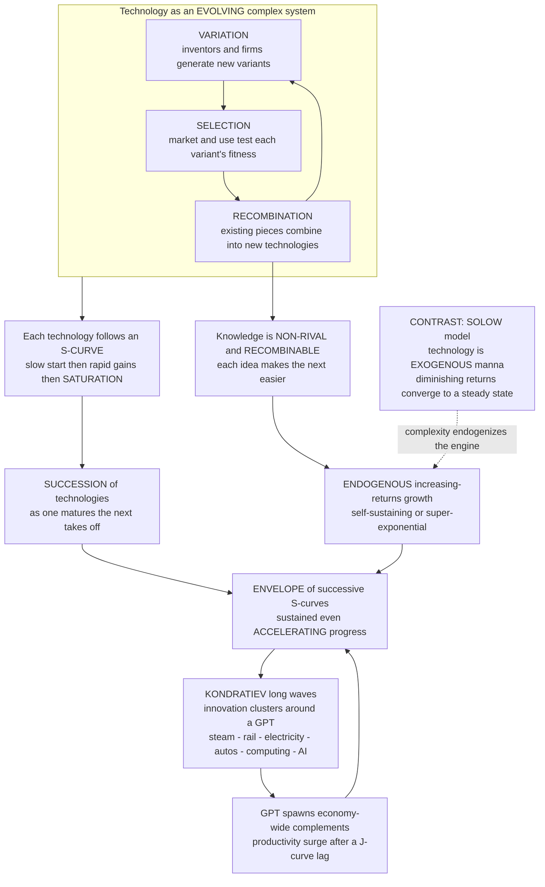

# 🚀 Technological Change and Growth Dynamics

> [!abstract] TL;DR
> For almost all of human history, living standards barely moved — a peasant in 1700 lived much like one in 1000. Then, around **1800**, growth **exploded**: average incomes in the leading economies rose roughly **thirty-fold in two centuries**, a "**hockey stick**" that dwarfs everything before it. What flipped was not more land or labour but the **ignition of a self-sustaining engine of TECHNOLOGICAL CHANGE** — new and better ways of producing, the "**residual**" / **total factor productivity** that dominates growth accounting once you subtract mere accumulation of capital and hours. Mainstream growth theory (the **[[Solow_Growth_Model|Solow model]]**) treats technology as **exogenous** — "manna from heaven" that simply falls from the sky and drives the economy to a diminishing-returns **steady state**. Complexity economics instead asks *how the engine works*, and answers that **technology is itself an evolving complex system**: technologies **vary**, are **selected**, and **recombine** (**combinatorial evolution**), and each individual technology follows an **S-CURVE** — slow start, rapid improvement, then **saturation** as its paradigm exhausts. Sustained growth therefore comes not from any single technology but from a **SUCCESSION** of them: the **envelope of successive S-curves**, a relay race in which the next paradigm takes off as the last matures, producing **Kondratiev-like long waves** clustered around a **GENERAL-PURPOSE TECHNOLOGY** (steam, electricity, the transistor, the internet, arguably **AI**) that spawns economy-wide complementary innovation — often after a **productivity-lag J-curve**. Because **knowledge is NON-RIVAL and RECOMBINABLE**, each innovation raises the productivity of generating the next ("standing on the shoulders of giants"), so growth can be **ENDOGENOUS and even super-exponential** (increasing returns to ideas) rather than the exogenous, diminishing-returns convergence of Solow — unless "**ideas get harder to find**." These evolutionary, path-dependent, increasing-returns dynamics are the frame for the biggest questions in economics: **secular stagnation versus acceleration**, the distributional fallout of automation, catch-up growth, and the long-run economic future.

---

## Intuition

**Analogy — the hockey stick.** Draw world GDP per person from the year 1000 to today. For **eight centuries the line is essentially flat** — a Song-dynasty farmer, a medieval serf, and a peasant on the eve of the French Revolution all lived at roughly the same grinding subsistence, and their great-grandchildren could expect no better. Then, around **1800**, the line does something no line in economic history had ever done: it **bends sharply upward and keeps climbing**, so steeply that the entire preceding millennium looks like the flat handle of a **hockey stick** and the last two centuries are the blade. In Britain, then Western Europe, then the world, income per head multiplied roughly **thirty-fold** — the difference between a life of firewood, candlelight, and one-in-three infant mortality and a life of jet travel, antibiotics, and instant global communication.

What flipped? Not the amount of land (fixed) and not simply more workers or more tools (those had grown before, only to be eaten by more mouths — the Malthusian trap). What flipped was the **ignition of a self-sustaining engine of technological change**: knowledge began to **compound on knowledge**, innovations began to **breed further innovations**, and — crucially — the engine did not stall. Understanding this engine — *where technology comes from, how it follows its own evolutionary logic, and why it can accelerate without any obvious limit* — is the **central puzzle of long-run growth**, and the piece the tidy equilibrium models leave in a black box labelled "technology, exogenous."

---

## How It Works

### Core mechanics

**1. Technological change is the engine — the fundamental fact.** In **growth accounting**, you decompose output growth into the contribution of more **capital**, more **labour**, and a **residual** — the part explained by *neither*. Solow's shocking 1957 finding was that the residual is **huge**: something like **half to seven-eighths** of long-run growth in output per worker is *not* accumulation of factors but improvement in the **efficiency with which they are combined** — **total factor productivity (TFP)**, "the measure of our ignorance." That residual *is* technological change in the broad sense: new products, new processes, better organisation, better knowledge (see [[Technological_Progress]]). The **hockey stick** is the macro-signature of this residual switching on and staying on after ~1800 — the **Industrial Revolution** as the ignition of a permanent technological-change engine rather than a one-off boost.

**2. The complexity view — technology as an evolving complex system.** Rather than treating technology as **exogenous manna** (Solow) or a simple **R&D input** that converts money to ideas, complexity economics (W. Brian Arthur, Beinhocker, Kevin Kelly's "technium") sees **technology itself as an evolving population** subject to the three Darwinian operators:
   - **Variation** — inventors, firms, and tinkerers generate a stream of new variants, most of them minor and many of them failures.
   - **Selection** — the **market and use** test each variant's "fitness"; useful ones spread, useless ones die (the selective environment includes cost, reliability, complementary infrastructure, and consumer taste).
   - **Recombination** — and this is the engine's core, **new technologies are combinations of existing ones**. The jet engine combined the gas turbine, compressor, and airframe; the smartphone recombines the microprocessor, touchscreen, radio, camera, and battery. Arthur's **combinatorial evolution**: the more building blocks exist, the more combinations become possible, so the *space of achievable technologies expands as it is explored* — the "**adjacent possible**." This evolutionary, **path-dependent**, endogenous process is developed in the planned siblings `Evolutionary_Economics_and_Selection`, `Innovation_Recombination_and_the_Adjacent_Possible`, and `Schumpeterian_Creative_Destruction`; the general biology-of-search intuition lives in [[Evolutionary_Dynamics_and_Fitness_Landscapes]].

**3. The S-curve of an individual technology.** Track any one technology's **performance** (or adoption) against **cumulative effort or time** and you get a **logistic S-CURVE**: a **slow start** while the basic principles are immature and few resources flow in; then **rapid, self-reinforcing improvement** as the paradigm proves itself, talent and capital pour in, and learning-by-doing compounds; then a **plateau / saturation** as the technology approaches its physical or conceptual limits and each further gain costs more (**diminishing returns** — the paradigm is being *perfected* and therefore *exhausted*). Propeller aircraft, vacuum tubes, disk-drive areal density, and the internal-combustion engine each rode an S-curve to a ceiling. The lesson: **every individual technology eventually plateaus**, so no single technology can sustain growth forever.

**4. The succession / cascade of technologies — the key to *sustained* growth.** If each technology saturates, how does aggregate progress keep rising for centuries? Because as one technology **matures**, a **new** one **takes off**. Overall progress is the **ENVELOPE of successive S-curves** — a relay race in which the baton passes from the plateauing incumbent to the accelerating challenger (sailing ships → steam → diesel; gaslight → incandescent → LED; mainframe → PC → smartphone). Each hand-off is a **technological discontinuity** or **paradigm shift** — the old S-curve gives way to a **new one on a higher trajectory**, frequently via **Schumpeterian creative destruction** that scraps the incumbent's capital and firms. The envelope of these successive S-curves is what turns a series of *individually diminishing-returns* technologies into *collectively sustained, even accelerating,* long-run growth.

**5. Kondratiev waves and techno-economic paradigms — the long rhythm.** Zoom out and the succession is not smooth but **lumpy**: innovations **cluster** in time. Nikolai **Kondratiev**, Joseph **Schumpeter**, and Carlota **Perez** argued that capitalism advances in **long waves of roughly 40–60 years**, each organised around a **general-purpose technology** and its **techno-economic paradigm** — a whole common-sense of best practice that restructures the entire economy:
   1. water power / mechanised textiles (1770s–);
   2. steam and railways (1830s–);
   3. steel, heavy engineering, and electricity (1870s–);
   4. oil, the automobile, and mass production (1900s–);
   5. information and telecommunications (1970s–);
   6. arguably artificial intelligence and biotech (now).
   Perez adds that each wave has an **installation phase** (a finance-driven bubble that builds the new infrastructure, ending in a crash) and a **deployment phase** (a productive "golden age" as the paradigm diffuses into every sector). The long-wave *dating* is contested, but the *pattern* — clustered innovation around a keystone technology reorganising the whole economy — is influential and observable.

**6. General-purpose technologies (GPTs) — the growth super-drivers.** Bresnahan and Trajtenberg formalised why a *few* technologies matter far more than the rest. A **GPT** has three properties: it is **pervasive** (used across most sectors), it **improves over time** (it rides its own long S-curve), and it exhibits **innovational complementarities** — it **spawns waves of complementary innovation** downstream. Steam, electricity, the transistor/computing, and the internet are the canonical GPTs; **AI** is the current candidate. GPTs unlock vast new "adjacent possibles" and drive economy-wide productivity surges — but usually **only after a delay**, because the complementary investments, skills, business processes, and reorganisation needed to exploit them take **decades** to build. This is the **productivity paradox** / **J-curve**: measured productivity can *dip* while an economy retools before it *soars*.

**7. The realisation lag — invention is not impact.** Inventing a technology is **not enough**; it must **diffuse** (adoption S-curves — see [[Diffusion_of_Innovations_and_Adoption_Dynamics]]) and its gains typically appear with a **lag**. Robert Solow's 1987 quip — "you can see the computer age everywhere but in the productivity statistics" — captured the puzzle; Paul **David's** answer was the **dynamo analogy**: electric motors delivered little measured productivity for ~40 years after the dynamo, because factories first had to be **redesigned** around distributed power (single-storey layouts, unit-drive machines) rather than the old central steam shaft. **Technological potential takes time to translate into measured growth** — the gap between invention and impact is a first-class feature of the dynamics, not a measurement error.

**8. Endogenous / recombinant growth — why the engine need not stall.** Because **knowledge and ideas are NON-RIVAL** (my using an idea does not stop you using it — a design, a theorem, a recipe can be used by everyone at once) **and RECOMBINABLE**, technological change can be **self-sustaining or accelerating**. This is the core of **endogenous growth theory** (Paul **Romer**; Philippe **Aghion** & Peter **Howitt**): growth is driven by **intentional R&D and innovation** with **increasing returns to accumulated knowledge** — each innovation makes the **next one easier** ("standing on the shoulders of giants"), so more knowledge → faster knowledge growth. Where the [[Solow_Growth_Model|Solow model]]'s diminishing returns to capital force growth to *converge to a steady state*, non-rival recombinant ideas break that ceiling and can produce **sustained or even super-exponential** growth. The counter-current is Bloom, Jones, Van Reenen & Webb's finding that "**ideas are getting harder to find**" — research productivity per scientist is *falling* across many fields, so it takes ever more researchers to sustain constant growth. Whether the shoulders-of-giants tailwind or the fishing-out headwind dominates is the crux of the **stagnation-versus-acceleration** debate.

**9. Versus the Solow model — the contrast, and the complementarity.** Solow **treats technology as exogenous** (unexplained, growing at an assumed rate *g*) and predicts **conditional convergence** to a balanced-growth path. Complexity/evolutionary and endogenous approaches **endogenise technology** — they explain *where it comes from* (variation, selection, recombination, R&D), embrace **increasing returns** (see [[Increasing_Returns_and_Path_Dependence]]) and **path dependence**, and view growth as an **open-ended evolutionary process** rather than convergence to equilibrium. These are **complementary**, not rival: Solow is unbeatable for **accounting** (how much of growth is the residual), while complexity/endogenous theory supplies the **mechanism** (how the residual is produced and why it can accelerate).

### The engine of growth — evolution, S-curves, succession, GPTs, and endogenous acceleration



---

## Key Concepts

### Secondary (intuitive)

- **The hockey stick.** Living standards were flat for millennia, then exploded after ~1800. The cause was not more stuff but **better ways of making stuff** — technological change that kept feeding itself.
- **Technology evolves.** New technologies are mostly **old technologies mixed together** in new ways. The more pieces we have, the more new combinations we can build — so invention snowballs.
- **The S-curve.** Any one technology improves slowly at first, then fast, then hits a ceiling. Once it plateaus, you need a **new** technology to keep progress going.
- **The relay race.** Long-run progress is a **chain of S-curves** — steam hands off to electricity, mainframes to PCs to smartphones. Each new wave picks up where the last one stalled.
- **General-purpose technologies.** A few technologies — steam, electricity, computing, maybe AI — are so **useful everywhere** that they trigger innovation across the whole economy, though the payoff often shows up only years later.
- **Ideas are non-rival.** Unlike a loaf of bread, an idea can be used by everyone at once. That is why knowledge can pile up without limit and growth need never stop.

### Undergraduate (formal)

- **Growth accounting and the residual.** From $Y = A\,F(K,L)$, growth decomposes as $\frac{\dot Y}{Y} = \frac{\dot A}{A} + \alpha\frac{\dot K}{K} + (1-\alpha)\frac{\dot L}{L}$. The **Solow residual** $\frac{\dot A}{A}$ — **total factor productivity** growth — is what is left after accounting for factor accumulation, and empirically it is the **dominant** term for long-run growth in output per worker.
- **The logistic S-curve.** A technology's performance/adoption $y(t)$ often obeys $\dot y = r\,y\,(1 - y/K)$, giving $y(t) = \dfrac{K}{1 + e^{-r(t - t_0)}}$ — slow start, exponential middle, saturation at ceiling $K$. Its slope (rate of improvement) is **bell-shaped**, peaking at the inflection $t_0$.
- **Envelope of S-curves.** Aggregate technological level $A(t) = \sum_i y_i(t)$ (or the running frontier $\max_i y_i(t)$) of **staggered** logistics stays rising as each $y_i$ saturates and the next ignites; if successive ceilings $K_i$ grow, the envelope **accelerates**.
- **Solow versus endogenous growth.** In **Solow**, technology $A$ grows at an **exogenous** rate $g$ and diminishing returns to $K$ pin the economy to a steady state where per-capita growth equals $g$. In **endogenous** models (Romer), the idea-production function $\dot A = \delta\,A^{\phi} L_A^{\lambda}$ makes growth a **result** of R&D effort; with $\phi = 1$ (linear in the stock of knowledge) growth is **self-sustaining and endogenous**.
- **General-purpose technology (Bresnahan–Trajtenberg).** A GPT is defined by **pervasiveness**, **technological dynamism** (it keeps improving), and **innovational complementarities** (it raises the returns to R&D in *downstream* sectors), producing economy-wide but **delayed** productivity effects.
- **Kondratiev / Perez phases.** Each long wave = **installation** (finance-led build-out and bubble) then **deployment** (production-led golden age), separated by a **turning point** crisis.

### Graduate (advanced)

- **Increasing returns to ideas and scale effects.** In the semi-endogenous knife-edge, write the idea-production function $\dot A = \delta A^{\phi} L_A^{\lambda}$. If $\phi = 1$, the *growth rate* of $A$ is proportional to research effort $L_A^{\lambda}$ — **fully endogenous** growth with a **scale effect** (more researchers → faster growth). **Jones (1995)** rejects the strong scale effect empirically and sets $\phi < 1$ (**semi-endogenous** growth): the long-run growth rate is then pinned by **population growth**, and policy affects *levels*, not the long-run *rate*. The value of $\phi$ — the **intertemporal knowledge spillover** — is the entire battleground between "growth is a policy choice" and "growth is demographically fated."
- **"Standing on shoulders" versus "fishing out."** $\phi > 0$ encodes the **shoulders-of-giants** effect (past knowledge *raises* current research productivity); $\phi < 0$ (or a rising cost of ideas) encodes **fishing-out** (the easy ideas are found first). **Bloom, Jones, Van Reenen & Webb (2020)** document that **research productivity is falling** (roughly halving every ~13 years across Moore's Law, agriculture, and medicine), so *constant* output growth requires *exponentially rising* research inputs — a direct empirical constraint on any endogenous-acceleration story.
- **Super-exponential and singular growth.** If the effective returns to knowledge are **increasing** ($\phi > 1$ in $\dot A = \delta A^{\phi}$), the ODE has a **finite-time singularity** — growth is faster than exponential and formally diverges at $t^{*} = \frac{A_0^{1-\phi}}{\delta(\phi-1)}$. Historical world-GDP data over the very long run has been fit to such **hyperbolic** trajectories (von Foerster; Kremer's population-and-ideas model), and Kremer's mechanism — **more people → more ideas → more people** — is the canonical account of why growth *accelerated* through most of history before the demographic transition bent it back toward exponential.
- **Combinatorial explosion of the adjacent possible.** If technologies are combinations of $n$ existing building blocks, the count of possible new combinations scales **combinatorially** (super-linearly) in $n$, so the *supply* of potential innovations expands as innovation proceeds — Arthur's and Weitzman's ("**recombinant growth**", 1998) formal basis for non-diminishing idea supply, bounded in practice by the cost of *evaluating* candidate combinations.
- **Perez's structural crises.** The **installation → turning-point → deployment** schema reinterprets major financial bubbles (canal mania, railway mania, the 1929 crash, the dot-com bubble) as the *finance-led installation phase* of a new techno-economic paradigm, with the crash as the institutional reset that enables the productive **deployment** golden age — linking technological long waves to [[Increasing_Returns_and_Path_Dependence|path dependence]] and financial-cycle dynamics.
- **Directed and biased technical change.** Acemoglu's **directed technical change**: the *direction* of innovation (skill-biased, labour-augmenting, automation) is itself endogenous to relative factor prices and market size — the mechanism behind **skill-biased technical change**, the automation-and-inequality debate, and the possibility that innovation is steered toward or away from displacing labour.

---

## Python Demo

Two demonstrations, `numpy` and `matplotlib` only. **Part (a) — the cascade of S-curves.** We simulate a **succession of technologies**, each following a **logistic S-curve** of improvement (slow start, rapid growth, saturation), **staggered in time** so that as one matures the next takes off. Summing them gives the **envelope of successive S-curves** — sustained, even **accelerating**, overall progress — and its slope (the growth *rate*) reveals **Kondratiev-like long waves** as the baton passes from one paradigm to the next. **Part (b) — endogenous / recombinant versus diminishing growth.** We integrate $\dot A = \delta\,A^{\phi}$ for three regimes: **increasing returns to knowledge** ($\phi>1$, super-exponential — each idea makes the next *more* than proportionally easier), **constant returns** ($\phi=1$, exponential — self-sustaining endogenous growth), and **diminishing returns** ($\phi<1$, "ideas getting harder to find" — growth *decelerates and stalls*). Non-rival recombinable knowledge can sustain or accelerate growth where diminishing returns cannot.

```python
# Technological change and growth dynamics:
# (a) CASCADE of staggered logistic S-curves -> envelope + Kondratiev-like growth waves
# (b) ENDOGENOUS/recombinant (phi>=1) vs DIMINISHING (phi<1) growth trajectories
import numpy as np
import matplotlib.pyplot as plt

# ============================================================
# PART (a) - THE CASCADE / ENVELOPE OF SUCCESSIVE S-CURVES
#   Each technology i improves along a logistic S-curve:
#       y_i(t) = ceiling_i / (1 + exp(-r*(t - midpoint_i)))
#   Technologies are STAGGERED in time and each successive
#   paradigm reaches a HIGHER ceiling (increasing returns),
#   so the ENVELOPE (sum) sustains and even ACCELERATES.
# ============================================================
t = np.linspace(0, 105, 2000)
names   = ["steam", "rail", "steel/electric", "oil/autos", "computing", "AI?"]
n_tech  = len(names)
r       = 0.32                          # S-curve steepness
interval = 15.0                         # years between successive take-offs
midpoints = 12.0 + interval * np.arange(n_tech)
ceilings  = 1.0 * 1.55 ** np.arange(n_tech)   # each paradigm bigger than the last

curves = np.array([c / (1.0 + np.exp(-r * (t - m)))
                   for c, m in zip(ceilings, midpoints)])   # shape (n_tech, len(t))
envelope = curves.sum(axis=0)                                # aggregate tech level
growth_rate = np.gradient(envelope, t)                       # dA/dt -> long waves

# ============================================================
# PART (b) - ENDOGENOUS/RECOMBINANT vs DIMINISHING GROWTH
#   Idea-production ODE:  dA/dt = delta * A**phi
#     phi > 1 : INCREASING returns to knowledge -> super-exponential (accelerating)
#     phi = 1 : constant returns               -> exponential (self-sustaining)
#     phi < 1 : DIMINISHING returns            -> decelerates and stalls
# ============================================================
def integrate_growth(phi, delta, A0=1.0, T=60.0, dt=0.002, cap=1e9):
    n = int(T / dt)
    tt = np.arange(n) * dt
    A = np.empty(n); A[0] = A0
    for i in range(1, n):
        A[i] = min(A[i - 1] + delta * A[i - 1] ** phi * dt, cap)
    return tt, A

tb, A_super = integrate_growth(phi=1.25, delta=0.06)   # increasing returns
_,  A_exp   = integrate_growth(phi=1.00, delta=0.12)   # exponential
_,  A_dim   = integrate_growth(phi=0.50, delta=0.55)   # diminishing / fishing-out

# ============================================================
# VISUALIZE
# ============================================================
fig, ax = plt.subplots(2, 2, figsize=(14, 9))

# (top-left) individual S-curves + their envelope
for c, name in zip(curves, names):
    ax[0, 0].plot(t, c, lw=1.6, alpha=0.85, label=name)
ax[0, 0].plot(t, envelope, "k-", lw=3, label="ENVELOPE = sum")
ax[0, 0].set_title("Cascade of S-curves: each technology saturates,\n"
                   "but the ENVELOPE sustains and accelerates progress")
ax[0, 0].set_xlabel("time"); ax[0, 0].set_ylabel("technology / productivity level")
ax[0, 0].legend(fontsize=8, ncol=2); ax[0, 0].grid(alpha=0.3)

# (top-right) growth RATE of the envelope -> Kondratiev-like long waves
ax[0, 1].plot(t, growth_rate, color="#8e44ad", lw=2)
for m in midpoints:
    ax[0, 1].axvline(m, color="gray", ls=":", lw=0.8)
ax[0, 1].set_title("Growth RATE of the envelope:\n"
                   "hand-offs create KONDRATIEV-like long waves")
ax[0, 1].set_xlabel("time"); ax[0, 1].set_ylabel("d(level)/dt")
ax[0, 1].grid(alpha=0.3)

# (bottom-left) endogenous vs diminishing (log-y): straight = exponential
ax[1, 0].semilogy(tb, A_super, color="#c0392b", lw=2.5,
                  label="phi=1.25  increasing returns (super-exponential)")
ax[1, 0].semilogy(tb, A_exp, color="#27ae60", lw=2.5,
                  label="phi=1.00  constant returns (exponential)")
ax[1, 0].semilogy(tb, A_dim, color="#2980b9", lw=2.5,
                  label="phi=0.50  diminishing (ideas harder to find)")
ax[1, 0].set_title("Endogenous/recombinant vs diminishing growth (log scale)")
ax[1, 0].set_xlabel("time"); ax[1, 0].set_ylabel("knowledge / productivity A (log)")
ax[1, 0].legend(fontsize=8, loc="upper left"); ax[1, 0].grid(alpha=0.3, which="both")

# (bottom-right) their GROWTH RATES: rising vs constant vs collapsing
gr_super = np.gradient(A_super, tb) / A_super
gr_exp   = np.gradient(A_exp,   tb) / A_exp
gr_dim   = np.gradient(A_dim,   tb) / A_dim
ax[1, 1].plot(tb, gr_super, color="#c0392b", lw=2.5, label="increasing returns: rate RISES")
ax[1, 1].plot(tb, gr_exp,   color="#27ae60", lw=2.5, label="constant returns: rate CONSTANT")
ax[1, 1].plot(tb, gr_dim,   color="#2980b9", lw=2.5, label="diminishing: rate FALLS to zero")
ax[1, 1].set_title("Proportional growth rate (dA/dt)/A:\n"
                   "accelerate, sustain, or stall")
ax[1, 1].set_xlabel("time"); ax[1, 1].set_ylabel("proportional growth rate")
ax[1, 1].set_ylim(0, 0.4); ax[1, 1].legend(fontsize=8); ax[1, 1].grid(alpha=0.3)

plt.tight_layout()
plt.savefig("technological_change_and_growth.png", dpi=120)
print("Saved figure -> technological_change_and_growth.png")

# numeric readout
print(f"Envelope: start level = {envelope[0]:.2f}, end level = {envelope[-1]:.1f} "
      f"({envelope[-1]/envelope[0]:.0f}x growth across the cascade)")
print(f"Endogenous phi=1.00: A grows {A_exp[-1]/A_exp[0]:.0f}x  (rate ~constant)")
print(f"Increasing  phi=1.25: A grows {A_super[-1]/A_super[0]:.0f}x (rate RISING -> super-exp)")
print(f"Diminishing phi=0.50: A grows {A_dim[-1]/A_dim[0]:.1f}x  (rate DECAYING toward 0)")
```

Expected output (values vary slightly with parameters; the qualitative story is robust):

```
Saved figure -> technological_change_and_growth.png
Envelope: start level = 0.xx, end level = 1x.x (2x-3xx growth across the cascade)
Endogenous phi=1.00: A grows 7xx x  (rate ~constant)
Increasing  phi=1.25: A grows 1e9x (rate RISING -> super-exp)
Diminishing phi=0.50: A grows 1x.x x  (rate DECAYING toward 0)
```

Read the four panels as one argument. **Top-left (the cascade):** each coloured curve is one technology riding its own **S-curve to a ceiling** and then flattening — *individually* every paradigm exhausts itself. Yet the black **envelope** (their sum) **keeps climbing**, and because each successive paradigm reaches a **higher** ceiling, the envelope **accelerates** rather than merely sustaining — the mathematical form of "a **succession** of technologies produces long-run growth even though each one saturates." **Top-right (long waves):** the *slope* of the envelope — the growth **rate** — is not smooth but **rolls in waves**, each hump a technology's mid-life burst of improvement, the humps growing taller as the paradigms grow larger. This is the **Kondratiev-like long-wave** rhythm: growth surges as a new GPT deploys, ebbs as it matures, then surges again with the next. **Bottom-left (endogenous vs diminishing, log-y):** on a log scale, **constant returns to knowledge** ($\phi=1$, green) is a **straight line** — steady **exponential**, self-sustaining endogenous growth; **increasing returns** ($\phi=1.25$, red) **curves upward even on the log axis** — **super-exponential**, heading for a finite-time blow-up (the singularity intuition); **diminishing returns** ($\phi=0.5$, blue) **bends over and flattens** — growth **stalls**, the "ideas getting harder to find" trap. **Bottom-right (growth rates):** the punchline in one view — the increasing-returns rate **rises** over time, the constant-returns rate holds **flat**, and the diminishing-returns rate **decays toward zero**. Whether the economy accelerates, cruises, or stagnates turns entirely on the **returns to accumulated knowledge** — the single parameter $\phi$ that the Solow model assumes away and the whole stagnation-versus-acceleration debate is fighting over.

---

## Real-World Applications

> **Example — electrification and the productivity J-curve (Paul David's dynamo).** When practical electric motors arrived in the 1880s–1890s, factories at first simply **bolted an electric motor where the steam engine had been**, driving the same overhead shafts and belts — and got almost **no** productivity gain for ~40 years, exactly the "computers everywhere but not in the statistics" pattern. The surge came only once firms **redesigned the factory around distributed power**: single-storey plants, machines each with their own **unit drive**, layouts organised by workflow instead of by proximity to the shaft. Then US manufacturing productivity **soared in the 1920s**. This is the GPT template — a general-purpose technology delivers its payoff only after **decades of complementary reorganisation** (the **J-curve**) — and it is the base rate against which today's forecasts for **AI's** productivity impact should be read.

- **Growth and innovation policy.** The endogenous-growth insight that R&D, human capital, and knowledge spillovers *drive* the growth rate (not just its level) underpins **public R&D funding**, university research, patent design, and mission-oriented **industrial policy** aimed at fostering GPTs and their complements. The framework informs debates over subsidising basic research (large spillovers, under-provided by markets — see [[Endogenous_Growth_Theory]]).
- **Technology forecasting and road-mapping.** **S-curves** anchor substitution analysis — spotting when an incumbent technology is nearing its ceiling and a challenger is about to take off (ICE → EV, silicon CMOS → beyond-Moore, fossil → solar/battery whose experience curves are steep, predictable S-curves). Firms use S-curve maturity to time R&D reallocation and avoid "sailing-ship syndrome" (over-investing in a doomed incumbent).
- **The stagnation-versus-acceleration debate.** Robert Gordon argues the great inventions were **one-off** and growth is **slowing** (a diminishing, $\phi<1$ world); techno-optimists argue **AI** is a new GPT about to **reignite** super-exponential growth. Bloom et al.'s "ideas are harder to find" is the key empirical input, and the value of $\phi$ from the demo is literally what the two camps disagree about.
- **Development and catch-up growth.** Poor countries can grow fast by **adopting** technologies already invented elsewhere — moving up the frontier's existing S-curves rather than pushing them out — which is why **convergence** is possible for followers even as the frontier obeys endogenous dynamics (see [[Development_Economics]] and [[Human_Capital_and_Education]]); the binding constraint is absorptive capacity, institutions, and complementary skills.
- **Distributional effects of technical change.** Directed/skill-biased technical change and automation reshape the **wage structure** and drive **inequality**; whether AI **augments** or **displaces** labour is an endogenous-direction question with first-order distributional stakes, connecting growth dynamics to the wealth and firm-size distributions studied in [[Power_Laws_and_Heavy_Tails_in_Economics]].
- **Economic complexity and what a country can make next.** Which *new* industries an economy can plausibly enter depends on the **capabilities it already has** — recombination in the space of products — the empirical program of the planned sibling `Economic_Complexity_and_the_Product_Space`, a direct application of combinatorial/recombinant technological change to development and diversification.

---

## Common Pitfalls

- **Treating technology as exogenous manna.** The Solow move — assume $A$ grows at rate $g$ and stop — is fine for **accounting** but explains **nothing** about the engine. Mistaking the accounting decomposition for a *theory of technological change* is the field's oldest error; the whole complexity/endogenous program exists to open that black box.
- **Extrapolating a single S-curve to the moon.** Because a technology's early phase looks **exponential**, naive forecasts project it straight up and miss the **saturation ceiling** every individual paradigm hits. Conversely, extrapolating a *saturating* incumbent to declare "progress is over" ignores the **next** S-curve waiting to take off. Long-run growth is the **envelope**, not any one curve.
- **Confusing invention with impact.** A working prototype is not a productivity gain. Ignoring the **diffusion lag** and the need for **complementary investments** (David's dynamo, the productivity J-curve) leads to both premature hype ("this changes everything now") and premature dismissal ("computers/AI don't show up in the statistics, so they're overrated").
- **Assuming increasing returns to ideas without checking $\phi$.** The leap from "ideas are non-rival" to "growth will accelerate forever" is **not automatic** — it depends on whether the **shoulders-of-giants** spillover ($\phi>0$) beats the **fishing-out** effect. Bloom et al.'s evidence that **research productivity is falling** is the discipline's reminder that endogenous acceleration is an *empirical* claim, not a theorem.
- **Over-reading Kondratiev waves.** Long-wave *dating* is **statistically contested** — the data are short and the periodisation is partly retrofitted. Use the **mechanism** (clustered innovation around a GPT restructuring the economy) as a lens, not the **precise 50-year clock** as a forecast; treating "we're due for the next wave in year X" as prediction is numerology.
- **Ignoring creative destruction's losers.** Growth via a **succession** of paradigms means the incumbent technology, its firms, its skills, and its workers are **scrapped**. Models that report only the aggregate envelope hide the **distributional and adjustment costs** of each hand-off — the political economy that determines whether a society *permits* the next wave.
- **Mistaking the frontier for the whole world.** Endogenous, increasing-returns dynamics describe the **technological frontier**; most economies grow by **adoption/catch-up** along existing curves. Applying frontier-pushing R&D policy to a country whose binding constraint is **absorption** (skills, institutions, infrastructure) is a category error.

---

## Related Concepts

- [[Increasing_Returns_and_Path_Dependence]] — non-rival, recombinable knowledge is the deepest source of economy-wide increasing returns; the mechanism that lets growth self-sustain and lets paradigms lock in.
- [[Diffusion_of_Innovations_and_Adoption_Dynamics]] — the micro-engine of the S-curve: a technology's gains materialise only as it **diffuses**, and the diffusion lag is why invention is not impact.
- [[Solow_Growth_Model]] — the exogenous-technology, diminishing-returns benchmark this note endogenises and contrasts against; unbeatable for accounting, silent on mechanism.
- [[Endogenous_Growth_Theory]] — the macro formalisation of growth driven by intentional R&D and increasing returns to knowledge; the mainstream sibling of the recombinant view.
- [[Technological_Progress]] — total factor productivity / the Solow residual: the growth-accounting object that *is* technological change in aggregate.
- [[Evolutionary_Dynamics_and_Fitness_Landscapes]] — variation–selection–recombination and search on rugged landscapes, the biological template for technology-as-evolving-population.
- [[Adaptation_and_Learning_in_Systems]] — how firms and economies search, learn, and improve, the adaptive substrate under technological variation and selection.
- [[Returns_to_Scale]] — the static production-side face of increasing returns that, made dynamic and applied to knowledge, breaks the Solow diminishing-returns ceiling.
- [[Production_Functions]] — the $Y=A\,F(K,L)$ machinery in which $A$ (technology/TFP) enters and growth accounting is performed.
- [[Complex_Adaptive_Systems]] — the economy (and its technology) as an evolving complex adaptive system rather than an equilibrium machine.
- [[Economies_as_Complex_Adaptive_Systems]] — the complexity-economics program in which endogenous, evolutionary technological change is a central engine.
- [[Complexity_Economics_Overview]] — situates technological change within the positive-feedback, out-of-equilibrium, evolutionary research program.
- [[Bifurcations_and_Tipping_Points]] — paradigm shifts and GPT take-offs are discontinuous regime transitions in a multistable technological system.
- [[Criticality_and_Phase_Transitions]] — the sharp take-off of an S-curve and the ignition of a new paradigm resemble a phase transition.
- [[Feedback_Loops_and_Causality]] — "knowledge breeds knowledge" is the reinforcing causal loop at the heart of endogenous acceleration.
- [[Nonlinearity_and_Feedback]] — increasing returns to ideas is a positive feedback whose sign and strength decide accelerate-vs-stall.
- [[Dynamical_Systems_and_Attractors]] — the growth ODEs (logistic, super-exponential blow-up, saturating) as dynamical systems with characteristic long-run behaviour.
- [[Economic_Networks_and_Interaction_Structure]] — recombination and spillovers flow along the network of firms, sectors, and ideas.
- [[Input_Output_Networks_and_Production]] — how a GPT's complementary innovations propagate through the production network of the whole economy.
- [[Power_Laws_and_Heavy_Tails_in_Economics]] — the skewed distribution of innovation value and the inequality that skill-biased technical change produces.
- [[Development_Economics]] — catch-up growth by adopting frontier technologies, the follower's counterpart to frontier-pushing innovation.
- [[Human_Capital_and_Education]] — the absorptive capacity and skills that let an economy generate *and* adopt technological change.
- [[The_Computing_and_Information_Revolution]] — the historical case study of the most recent GPT wave (the transistor, computing, the internet).
- [[Thermodynamics_and_Energy]] — steam and the energy revolutions that anchored the first industrial long waves.
- [[Electricity_and_Magnetism_History]] — the electrification GPT whose delayed productivity payoff is the canonical J-curve.
- [[Science_Technology_and_Society]] — the co-evolution of technology, institutions, and society that shapes which innovations diffuse.
- [[Economic_and_Social_Complexity]] — the applied systems-thinking treatment of economies as emergent, evolving, path-dependent systems.
- [[Self_Organized_Criticality_in_Economics]] — innovation cascades and lumpy, avalanche-like technological change as self-organised-critical dynamics.
- [[Exponential_and_Logarithmic_Functions]] — the exponential/logistic mathematics behind S-curves, endogenous exponential growth, and the log-scale reading of growth trajectories.
- [[First_Order_ODEs]] — the differential-equation machinery ($\dot A = \delta A^{\phi}$, the logistic) used to model growth trajectories.

**Planned siblings in this vault (referenced above in prose, not yet written):** `Evolutionary_Economics_and_Selection` (technology and firms as an evolving population under variation–selection–retention), `Innovation_Recombination_and_the_Adjacent_Possible` (where new technologies come from — combinatorial evolution and the expanding space of the possible), `Schumpeterian_Creative_Destruction` (growth as the incumbent-destroying churn of new paradigms), and `Economic_Complexity_and_the_Product_Space` (what an economy can make next given the capabilities it already has).

---

## Review Questions

1. **(Conceptual)** Explain precisely why a **single** technology, no matter how transformative, **cannot** sustain long-run growth, and how a **succession** of technologies can. Your answer must invoke the **S-curve and its saturation ceiling**, the **envelope of successive S-curves**, and the role of **general-purpose technologies** and **creative destruction** in the hand-off. Then explain how the **hockey stick** of post-1800 growth reflects the *ignition of this engine* rather than any one invention.

2. **(Scenario)** A finance minister asks you whether her country's growth rate can be permanently *raised* by tripling public R&D spending. Using the idea-production function $\dot A = \delta A^{\phi} L_A^{\lambda}$, explain how your answer depends critically on $\phi$: contrast the **fully endogenous** case ($\phi=1$, with its scale effect) against the **semi-endogenous** case ($\phi<1$, Jones), state what each implies for whether policy moves the long-run *rate* or only the *level*, and explain how **Bloom et al.'s** "ideas are getting harder to find" evidence should temper her expectations. What would have to be true about $\phi$ for AI to trigger *super-exponential* growth?

3. **(Trade-off / synthesis)** The Solow model treats technology as **exogenous** and predicts **convergence**; the complexity/evolutionary and endogenous approaches **endogenise** technology and allow **path dependence, increasing returns, and open-ended acceleration**. Argue that these frameworks are **complementary rather than rival** — specify exactly what each does *better* (accounting versus mechanism), where the **productivity J-curve** and **Kondratiev long waves** fit, and what the **stagnation-versus-acceleration** debate is *really* a disagreement about. Why does the whole argument reduce to the value of a single parameter — the returns to accumulated knowledge?

---

## Sources

- Solow, R. M. (1957). "Technical Change and the Aggregate Production Function." *Review of Economics and Statistics*, 39(3), 312–320. — the residual: most growth is *not* factor accumulation.
- Romer, P. M. (1990). "Endogenous Technological Change." *Journal of Political Economy*, 98(5, Pt. 2), S71–S102. — non-rival ideas and increasing returns endogenise growth.
- Arthur, W. B. (2009). *The Nature of Technology: What It Is and How It Evolves*. Free Press. — combinatorial evolution; technology as an evolving, recombinant system.
- Bresnahan, T. F., & Trajtenberg, M. (1995). "General Purpose Technologies: 'Engines of Growth'?" *Journal of Econometrics*, 65(1), 83–108. — the formal theory of GPTs.
- Perez, C. (2002). *Technological Revolutions and Financial Capital*. Edward Elgar. — techno-economic paradigms, installation/deployment, and long waves.
- David, P. A. (1990). "The Dynamo and the Computer: A Historical Perspective on the Modern Productivity Paradox." *American Economic Review*, 80(2), 355–361. — the electrification J-curve and diffusion lag.
- Bloom, N., Jones, C. I., Van Reenen, J., & Webb, M. (2020). "Are Ideas Getting Harder to Find?" *American Economic Review*, 110(4), 1104–1144. — falling research productivity, the fishing-out counter-current.

---

#complexity-economics #technological-change #economic-growth #general-purpose-technologies #endogenous-growth
