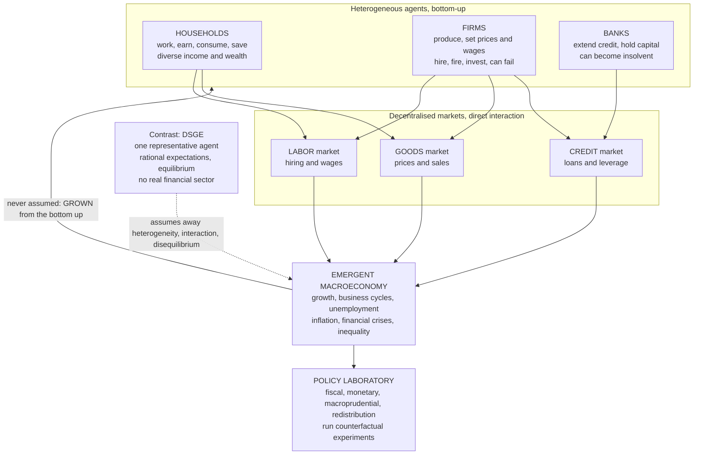

# 🏦 Agent-Based Macroeconomics

> [!abstract] TL;DR
> **Agent-based macroeconomics** applies agent-based modeling to the *whole economy*: instead of the single optimizing **representative agent** of DSGE, it populates a computer with thousands of **heterogeneous, boundedly-rational households, firms, and banks**, gives each simple behavioral rules, lets them interact through **goods, labor, and credit markets** with real money flows and balance sheets, and then lets the macroeconomy — growth, **business cycles**, **unemployment**, inflation, **financial crises**, and **inequality** — *emerge from the bottom up*, without ever assuming market-clearing or equilibrium. It is the complexity-economics alternative to Dynamic Stochastic General Equilibrium (DSGE) macro, whose representative agent, rational expectations, and missing financial sector left it unable to foresee or explain 2008. Reproducing many empirical stylized facts at once (Dosi's "Keynes meets Schumpeter" model, EURACE, Delli Gatti's models), it serves as a **policy laboratory** for fiscal, monetary, macroprudential, and redistributive experiments — including the distributional and crisis effects DSGE misses — which is why central banks (Bank of England, ECB, OECD, the Fed) increasingly explore it.

---

## Intuition

**Analogy:** The workhorse macro model that guided central banks into the 2008 crisis contained, at its core, essentially **one household and one firm** — a single "representative agent" standing in for an entire economy of millions of diverse, interacting people — and **no banks or financial sector worth speaking of**. It is like trying to forecast the weather with a model containing *one air molecule*: you can write down beautiful equations for that molecule, but no storm, no front, no hurricane can ever appear, because storms are *collective* phenomena that only emerge from countless molecules interacting. A single average molecule has, by construction, no weather in it.

Agent-based macroeconomics throws this out and does the obvious thing: it fills the computer with **thousands of diverse households, firms, and banks**, gives each of them simple behaviors, lets them trade, hire, lend, and go bust — and *watches a whole economy*, with its booms, busts, unemployment queues, and widening inequality, **emerge from the bottom up**. Recession is no longer a shock imposed from outside; it is weather the model generates on its own.

---

## How It Works

### The motivation: the failure of representative-agent macro

Mainstream macroeconomics — **DSGE**, *Dynamic Stochastic General Equilibrium* — is built on three assumptions that agent-based modelers regard as fatal simplifications. First, a **representative agent**: one infinitely-lived household and one firm optimize on behalf of everyone, so *heterogeneity is assumed away by construction* (see `Bounded_Rationality_and_Heterogeneous_Agents`). Second, **rational expectations**: agents know the true model of the economy and form unbiased forecasts of the future. Third, **equilibrium**: markets clear, so involuntary unemployment and unsold goods are, strictly, impossible — they must be re-labelled as optimal choices. Until very recently these models also had **no meaningful financial sector** — no leverage, no interbank network, no bankruptcy.

The result was a paradigm that *assumed away exactly what caused the crisis*. The 2008 meltdown originated in financial-sector interactions, leverage, and heterogeneity that the dominant models did not contain, so they could neither foresee nor explain it — Krugman called it "the economics profession's failure," and Queen Elizabeth II, touring the LSE, asked simply "why did nobody see it coming?" The `The_Limits_of_Neoclassical_Equilibrium` note develops this crisis of the paradigm; here it is the launch point.

### What agent-based macro does differently

Macro ABM inverts every one of those assumptions:

1. **Heterogeneous agents, not a representative one.** Many diverse households, firms, and banks — differing in wealth, size, productivity, leverage, and expectations — not one stand-in for the average.
2. **Bounded rationality and behavioral rules, not global optimization with rational expectations.** Firms use simple markup, hiring, and inventory heuristics; households use rules of thumb for consumption and saving. Agents *satisfice and adapt*, they do not solve a lifetime optimization against the true model.
3. **Direct interaction, not anonymous market-clearing.** Agents meet and transact in concrete markets and networks; a firm hires *these* workers and borrows from *that* bank.
4. **Out-of-equilibrium dynamics, not imposed equilibrium.** Markets need not clear. **Unemployment, unsold inventory, unmet credit demand, and disequilibrium are natural outputs**, not contradictions (see `Non_Equilibrium_and_Out_of_Equilibrium_Dynamics`).
5. **Emergent macro, not assumed macro.** Aggregates are *grown* from the interactions, never written down directly — the micro-to-macro link of `Emergence_of_Macro_from_Micro`.

### The anatomy of a macro ABM

A full artificial economy is assembled from four kinds of agent and three markets, kept consistent by **stock-flow accounting** (every payment is simultaneously someone's outflow and another's inflow, and every balance sheet must balance).

- **Firms** — produce goods, set prices and wages, hire and fire workers, invest, borrow from banks, and *can go bankrupt*.
- **Households / workers** — supply labor, earn wage and profit income, consume, and save.
- **Banks** — extend credit, hold capital against loans, and can become insolvent, transmitting distress across the network.
- **Government and central bank** — run fiscal policy (spending, taxes, transfers) and monetary policy (interest rates, credit rules, macroprudential capital requirements).

These interact through the **goods market** (prices and sales), the **labor market** (hiring and wages), and the **credit market** (loans and leverage). Canonical implementations include Dosi, Fagiolo, and Roventini's **"Keynes meets Schumpeter" (K+S)** model, the **EURACE** platform, and Delli Gatti's stock-flow-consistent models.

### Architecture: bottom-up emergence versus DSGE



### What emerges from the bottom up

The scientific payload is that many macro **stylized facts appear at once**, none of them imposed: **endogenous business cycles** (fluctuations born from the interaction of adaptive rules, not just exogenous shocks — the theme of [[Business_Cycles_and_Endogenous_Fluctuations]]), **unemployment** arising from coordination failure and deficient demand rather than a labor-supply choice, **endogenous financial crises** from leverage, contagion, and fire sales on the credit network (see [[Cascades_Contagion_and_Financial_Crises]] and [[Financial_Networks_and_Systemic_Risk]]), **fat-tailed firm growth and firm-size distributions** (see [[Firm_Size_and_City_Size_Distributions]]), **inequality dynamics** (see [[Wealth_and_Income_Inequality_Dynamics]]), and **growth driven by Schumpeterian innovation**. Matching *many* empirical regularities simultaneously — rather than one at a time — is the field's central validation strategy, the subject of [[Calibration_and_Validation_of_Agent_Based_Models]].

### The payoff: a policy laboratory

Because a macro ABM is a running artificial economy, you can **experiment on it**: turn a fiscal-stimulus knob, tighten a credit rule, impose macroprudential capital requirements, add a wealth tax — and observe the *emergent* consequences, **including the distributional and financial-stability effects DSGE cannot represent**. Who wins and who loses, whether a policy raises fragility, how a nonlinear crisis unfolds — these become measurable. This is why the field is migrating from academia into [[Complexity_Economics_and_Public_Policy]] and [[Complexity_and_Financial_Regulation]] at real central banks.

---

## Key Concepts

**Secondary (intuition level)**
- **One molecule has no weather.** A single representative agent cannot contain a recession any more than one air molecule can contain a storm; crises are collective, emergent phenomena.
- **Grow the economy, don't solve it.** Fill a computer with many diverse households, firms, and banks, let them interact, and watch booms, busts, and unemployment appear on their own.
- **Unemployment is allowed to exist.** Because markets need not clear, jobless workers and unsold goods are natural outcomes, not logical impossibilities.
- **A flight simulator for policy.** Try a stimulus or a bank rule inside the model first and see who is helped, who is hurt, and whether it makes the system more fragile.

**Undergraduate (formal level)**
- **The four agents and three markets.** Heterogeneous firms, households, and banks, plus a government/central bank, interacting through goods, labor, and credit markets under stock-flow-consistent accounting.
- **DSGE contrasted point-by-point.** Representative agent versus heterogeneous population; rational expectations versus bounded-rational rules; imposed equilibrium versus out-of-equilibrium adjustment; absent versus explicit financial sector.
- **Endogenous versus exogenous cycles.** DSGE needs outside shocks to move; ABM generates fluctuations internally from the interaction of adaptive expectations and finite money circulation.
- **Stylized-fact validation.** A macro ABM is judged by how many empirical regularities (fat-tailed growth, cycle co-movements, Okun and Beveridge relations) it reproduces jointly without being fitted to them.
- **The canonical models.** Dosi et al.'s "Keynes meets Schumpeter" (K+S), the EURACE platform, and Delli Gatti's stock-flow-consistent macro ABMs.

**Graduate (research level)**
- **The ABM-versus-DSGE debate, honestly.** DSGE is micro-founded on optimization, analytically disciplined, and estimable, but shackled by the representative agent, equilibrium, and (until HANK and financial-friction extensions) missing heterogeneity and finance. ABM captures heterogeneity, interaction, finance, disequilibrium, and emergence, but faces a serious **calibration and validation** burden, weaker analytical transparency (Sims's "wilderness of bounded rationality" and the "black box" critique), and a lack of standardization.
- **Convergence and rapprochement.** DSGE is adding heterogeneity via **HANK** (Heterogeneous-Agent New Keynesian) models — where the *distribution* of wealth and marginal propensities to consume shapes aggregate demand and the transmission of policy — and financial frictions; ABM is adding discipline via simulated method of moments, indirect inference, and Bayesian estimation. Both camps now concede heterogeneity, finance, and (for ABM) disequilibrium matter.
- **MPC heterogeneity and the distribution as a state variable.** When marginal propensities to consume differ across the wealth distribution, redistribution changes aggregate demand — the mechanism shared by HANK and by macro ABMs, and the one exploited in the demo below.
- **Systemic risk as an emergent property.** Leverage cycles, interbank contagion, and fire-sale spirals are network phenomena that equilibrium risk models treat as exogenous; macro ABMs generate them endogenously, giving regulators a stress-testing laboratory.
- **Equifinality and identification.** Because many micro-mechanisms can produce the same macro pattern, matching a stylized fact establishes *sufficiency*, never *necessity*; robustness, parsimony, and out-of-sample tests are the defenses.

---

## Python Demo

We build a **minimal agent-based macroeconomy** and watch macro dynamics *emerge* — then use it as a **policy laboratory**. Heterogeneous **firms** produce goods, post prices, and hire workers using a simple inventory rule (sell out then expand and raise price; pile up stock then contract and cut price). **Households** work, earn wages, and consume a wealth-dependent fraction of their money — *poorer households spend a higher share* (heterogeneous MPC). Money circulates: firm to wages to household to spending to firm. **Nothing imposes equilibrium.** Unemployment appears whenever firms' total labor demand falls short of the workforce, and aggregate output fluctuates as adaptive expectations and finite money over- and under-shoot.

Part (a) runs the baseline and shows the **emergent business cycle**, **emergent unemployment**, and an **emergent firm-size distribution**. Part (b) runs a **policy experiment** — a redistributive fiscal transfer that taxes the employed and pays the unemployed (an automatic stabilizer). Because the money flows to high-MPC households, aggregate demand rises, and we watch **unemployment fall** — the emergent policy effect DSGE's representative agent cannot even pose. Uses only `numpy` and `matplotlib`.

```python
# A minimal agent-based MACROECONOMY. Heterogeneous FIRMS produce, post prices,
# and hire; HOUSEHOLDS work, earn wages, and consume (poorer -> higher MPC).
# Money circulates and NOTHING imposes equilibrium: business cycles, unemployment,
# and a firm-size distribution all EMERGE from the interacting rules. Then we use
# the model as a POLICY LABORATORY: a redistributive transfer lowers unemployment.
import numpy as np
import matplotlib.pyplot as plt

def gini(x):
    """Inequality of a wealth vector: 0 = perfect equality, 1 = maximal."""
    x = np.sort(np.asarray(x, dtype=float))
    n = x.size
    if n == 0 or x.sum() == 0:
        return 0.0
    idx = np.arange(1, n + 1)
    return (2.0 * np.sum(idx * x)) / (n * x.sum()) - (n + 1.0) / n

def run_economy(T=700, N_f=80, N_h=400, wage=1.0, tau=0.0, seed=0):
    """N_f firms, N_h households. 'tau' is the fiscal lever: a tax on the
    employed whose proceeds are transferred to the unemployed (0 = laissez-faire).
    Returns emergent output, unemployment, price level, firm sizes, and wealth."""
    rng = np.random.default_rng(seed)
    # --- heterogeneous firm state ---
    fM = np.full(N_f, 20.0)                 # firm money / deposits
    fp = np.full(N_f, 1.0)                  # posted price
    fI = np.full(N_f, 5.0)                  # inventory
    ftarget = rng.uniform(3.0, 5.0, N_f)    # desired output (already diverse)
    # --- household state ---
    hm = np.full(N_h, 5.0)                  # household money / wealth
    output, urate, plevel = [], [], []
    firm_size = np.zeros(N_f); window = 0
    for t in range(T):
        avg_p = fp.mean()
        # 1) LABOR MARKET: labor demand = desired output, capped by the wage budget
        Ld = np.clip(np.minimum(np.rint(ftarget), np.floor(fM / wage)), 0, None).astype(int)
        total_Ld = int(Ld.sum())
        if total_Ld > N_h and total_Ld > 0:          # ration if firms want too many
            hired = np.floor(Ld * (N_h / total_Ld)).astype(int)
        else:
            hired = Ld.copy()
        employed = int(hired.sum())
        unemployed_n = N_h - employed
        fM -= wage * hired                           # wages flow firm -> household
        earners = (rng.choice(N_h, size=employed, replace=False)
                   if employed > 0 else np.array([], dtype=int))
        hm[earners] += wage
        # 2) PRODUCTION (one unit per worker)
        fI += hired.astype(float)
        # 3) FISCAL POLICY: tax the employed, transfer equally to the unemployed
        if tau > 0 and employed > 0 and unemployed_n > 0:
            collected = tau * wage * employed
            hm[earners] -= tau * wage
            non_earners = np.setdiff1d(np.arange(N_h), earners)
            hm[non_earners] += collected / unemployed_n
        # 4) GOODS MARKET: wealth-dependent MPC (poorer households spend more)
        mpc = np.clip(1.0 - 0.15 * (hm / hm.mean()), 0.55, 0.99)
        budget = mpc * hm
        B = budget.sum()
        attract = np.where(fI > 1e-9, (avg_p / fp) ** 2.0, 0.0)  # cheaper -> more demand
        sold = np.zeros(N_f); S = 0.0
        if attract.sum() > 0 and B > 0:
            attract = attract / attract.sum()
            sold = np.minimum(B * attract / fp, fI)  # nominal demand -> units, rationed
            revenue = sold * fp
            fM += revenue; fI -= sold; S = revenue.sum()
        hm -= budget * (S / B if B > 0 else 0.0)     # households pay for what they got
        # 5) FIRM ADAPTIVE RULES from the inventory signal
        soldout = fI < 0.5
        ftarget = np.clip(np.where(soldout, ftarget * (1 + rng.uniform(0, 0.10, N_f)),
                                            ftarget * (1 - rng.uniform(0, 0.10, N_f))), 1.0, 40.0)
        fp = np.clip(np.where(soldout, fp * (1 + rng.uniform(0, 0.05, N_f)),
                                       fp * (1 - rng.uniform(0, 0.05, N_f))),
                     0.3 * avg_p, 3.0 * avg_p)
        # 6) RECORD emergent aggregates
        output.append(sold.sum())
        urate.append(100.0 * unemployed_n / N_h)
        plevel.append(fp.mean())
        if t >= T - 150:
            firm_size += sold; window += 1
    return (np.array(output), np.array(urate), np.array(plevel),
            firm_size / max(window, 1), hm)

def moving_avg(x, k=15):
    return np.convolve(x, np.ones(k) / k, mode="valid")

# (a) BASELINE laissez-faire economy: cycles and unemployment emerge
out0, u0, p0, fsize0, wealth0 = run_economy(tau=0.00, seed=3)
# (b) POLICY EXPERIMENT: redistributive fiscal transfer (automatic stabilizer)
out1, u1, p1, fsize1, wealth1 = run_economy(tau=0.30, seed=3)

burn = 100  # discard the initial transient for reporting
fig, ax = plt.subplots(2, 2, figsize=(14, 9))

ax[0, 0].plot(out0, color="#7f8c8d", lw=0.7, alpha=0.6, label="output")
ax[0, 0].plot(np.arange(len(out0) - 14) + 7, moving_avg(out0),
              color="#c0392b", lw=2, label="15-step average")
ax[0, 0].set_title("(a) EMERGENT business cycle\naggregate output, no shock imposed")
ax[0, 0].set_xlabel("time step"); ax[0, 0].set_ylabel("real output (units sold)")
ax[0, 0].legend()

ax[0, 1].plot(u0, color="#2980b9", lw=1.2)
ax[0, 1].axhline(u0[burn:].mean(), color="k", ls="--", lw=1,
                 label="mean = {:.1f} percent".format(u0[burn:].mean()))
ax[0, 1].set_title("(a) EMERGENT unemployment\nnot assumed away")
ax[0, 1].set_xlabel("time step"); ax[0, 1].set_ylabel("unemployment rate (percent)")
ax[0, 1].legend()

ax[1, 0].hist(fsize0, bins=25, color="#8e44ad", alpha=0.8)
ax[1, 0].set_title("(a) EMERGENT firm-size distribution\nheterogeneity grown bottom-up")
ax[1, 0].set_xlabel("average firm output"); ax[1, 0].set_ylabel("number of firms")

ax[1, 1].plot(u0, color="#c0392b", lw=1.2, alpha=0.8, label="baseline (no policy)")
ax[1, 1].plot(u1, color="#27ae60", lw=1.2, alpha=0.8, label="with redistribution")
ax[1, 1].axhline(u0[burn:].mean(), color="#c0392b", ls="--", lw=1)
ax[1, 1].axhline(u1[burn:].mean(), color="#27ae60", ls="--", lw=1)
ax[1, 1].set_title("(b) POLICY LABORATORY\nfiscal transfer lowers unemployment")
ax[1, 1].set_xlabel("time step"); ax[1, 1].set_ylabel("unemployment rate (percent)")
ax[1, 1].legend()

fig.suptitle("A macroeconomy grown from the bottom up: cycles, unemployment, and "
             "firm heterogeneity EMERGE; policy is tested in silico", fontsize=13)
fig.tight_layout(rect=[0, 0, 1, 0.95])
plt.savefig("agent_based_macro.png", dpi=120)

# --- numerical summary of the emergent macro effects ---
print("BASELINE   : avg unemployment = {:5.1f} pct | avg output = {:6.1f} | wealth Gini = {:.3f}"
      .format(u0[burn:].mean(), out0[burn:].mean(), gini(wealth0)))
print("WITH POLICY: avg unemployment = {:5.1f} pct | avg output = {:6.1f} | wealth Gini = {:.3f}"
      .format(u1[burn:].mean(), out1[burn:].mean(), gini(wealth1)))
print("A redistributive transfer moves money to high-MPC households, raising demand,")
print("so employment and output rise and inequality falls -- an emergent, distributional")
print("policy effect that a single representative agent could never reveal.")
plt.show()
```

**What the output shows.** The baseline economy is never told to have a recession, yet its aggregate output **oscillates endogenously** (top-left): firms collectively over-expand when goods sell out, pile up inventory, then contract in unison, producing self-generated booms and busts from nothing but adaptive rules and circulating money. **Unemployment emerges and fluctuates** around a double-digit rate (top-right) because total labor demand falls short of the workforce — jobless workers exist as a natural outcome, not a modeling impossibility. A right-skewed **firm-size distribution** grows from identical starting conditions (bottom-left): interaction and luck spread firms across sizes, the heterogeneity a representative agent erases. Finally the **policy experiment** (bottom-right) turns the model into a laboratory: a redistributive transfer routes money to high-MPC households, lifts aggregate demand, and **visibly lowers the unemployment rate** while compressing the wealth Gini — a joint output-and-distribution effect that is invisible to a one-agent model.

---

## Real-World Applications

> **Example — central banks adopt agent-based macro after DSGE's 2008 failure.** The **Bank of England** built an agent-based model of the UK housing and mortgage market (Baptista et al., 2016) with thousands of heterogeneous households — first-time buyers, movers, and buy-to-let investors — to test **macroprudential** rules such as loan-to-value and loan-to-income caps, precisely because a representative agent cannot represent the leveraged buy-to-let investors that drive housing booms. The **OECD** built the multi-country agent-based macro model behind parts of its policy analysis; the **ECB** and researchers at the **Fed** and the **Bank of Italy** run agent-based platforms for financial stability and macro forecasting. Farmer's Oxford INET group has pushed agent-based macro toward operational forecasting and COVID-era supply-shock analysis.

- **Fiscal, monetary, and macroprudential policy.** Counterfactual experiments on stimulus, interest-rate and credit rules, capital requirements, and redistribution — observing emergent effects on output, unemployment, stability, and the *distribution* of gains and losses (Dosi et al.'s K+S model was built expressly to compare fiscal and monetary regimes).
- **Financial stability and crisis modeling.** Endogenous leverage cycles, interbank contagion, and fire-sale spirals for **stress testing** the interactions that equilibrium risk models treat as exogenous.
- **Distributional analysis and inequality.** Modeling *who wins and who loses* from a policy — the heterogeneous impacts DSGE's average agent cannot express — bringing macro ABM close to HANK-style questions.
- **Housing and mortgage markets.** Agent-based housing models at the Bank of England and elsewhere for calibrating macroprudential tools before deployment.
- **Climate-economy modeling.** Agent-based integrated assessment models (the DSK model, Dosi et al.) couple heterogeneous firms and technologies to a climate module to study transition and damage under policy scenarios.

---

## Common Pitfalls

- **"You can grow anything" (over-parameterization).** A macro ABM with dozens of rules and free parameters can be tuned to match almost any target series, so a good fit is *weak* evidence. Validate against **multiple stylized facts the model was not fitted to**, and estimate with simulated method of moments or indirect inference — the discipline of [[Calibration_and_Validation_of_Agent_Based_Models]].
- **Treating the model as a black box.** Because outcomes are emergent, it is tempting to report *what* happened without understanding *why*. Run controlled "knockout" experiments on individual rules and use sensitivity analysis to isolate the mechanism, or the model is a simulation, not an explanation.
- **Ignoring stock-flow consistency.** If money, credit, and balance sheets do not add up every period, aggregate results are artifacts. Real macro ABMs enforce that every payment is someone else's receipt and every asset is someone's liability.
- **Confusing sufficiency with necessity (equifinality).** Reproducing a business cycle proves your mechanism is *sufficient*, never that it is what actually drives real cycles; many micro-stories yield the same macro pattern, so robustness and out-of-sample tests are essential.
- **Dismissing DSGE wholesale.** DSGE remains analytically disciplined, estimable, and useful for many questions, and its HANK and financial-friction extensions absorb much of the ABM critique. The honest position is complementarity and convergence, not replacement.
- **Reaching for ABM when heterogeneity does not matter.** If distributional and interaction effects wash out, a tractable aggregate or DSGE model is cheaper and clearer. Macro ABM earns its cost only when heterogeneity, finance, and disequilibrium genuinely drive the result.
- **Mistaking bounded rationality for irrationality.** Agents using markup, inventory, and rule-of-thumb heuristics are *procedurally* rational; the claim is that the aggregate still self-organizes, not that firms and households are foolish.

---

## Related Concepts

- [[Agent_Based_Modeling_in_Economics]] — the parent method; this note applies agent-based modeling specifically to the whole macroeconomy.
- [[Emergence_of_Macro_from_Micro]] — the micro-to-macro link that macro ABM operationalizes; growth, cycles, and unemployment emerge from agent interaction.
- [[Bounded_Rationality_and_Heterogeneous_Agents]] — the diverse, rule-following agents that replace DSGE's single optimizing representative agent.
- [[Non_Equilibrium_and_Out_of_Equilibrium_Dynamics]] — why macro ABM lets markets fail to clear, so unemployment and unsold goods are natural outputs.
- [[The_Limits_of_Neoclassical_Equilibrium]] — the equilibrium paradigm whose 2008 failure motivated the agent-based turn.
- [[Calibration_and_Validation_of_Agent_Based_Models]] — the central methodological challenge for making macro ABM empirically credible.
- [[Business_Cycles_and_Endogenous_Fluctuations]] — the endogenous cycles a macro ABM generates internally rather than importing as shocks.
- [[Complexity_Economics_and_Public_Policy]] — the policy-laboratory turn where macro ABM is applied to real fiscal and monetary questions.
- [[Complexity_and_Financial_Regulation]] — the macroprudential and systemic-risk applications that macro ABM's banking sector enables.
- [[Cascades_Contagion_and_Financial_Crises]] — the endogenous financial crises a genuine banking sector lets a macro ABM generate.
- [[Financial_Networks_and_Systemic_Risk]] — the interbank leverage and contagion structure that macro ABMs use to model systemic fragility.
- [[Firm_Size_and_City_Size_Distributions]] — the fat-tailed firm-size heterogeneity that emerges in the demo and in real macro ABMs.
- [[Wealth_and_Income_Inequality_Dynamics]] — the emergent inequality that redistribution policy in a macro ABM directly reshapes.
- [[Complexity_Economics_Overview]] — the paradigm this note sits within: the economy as a non-equilibrium complex adaptive system.
- [[Business_Cycle_Indicators]] — the macro fluctuations that agent-based macro aims to generate endogenously rather than impose.
- [[Unemployment]] — the phenomenon DSGE equilibrium struggles to admit but macro ABM produces naturally.
- [[Global_Financial_Crises]] — the 2008 crisis that DSGE could not foresee and that drove central-bank interest in ABM.
- [[Price_Indices_Inflation]] — the aggregate price level that emerges from firms' individual pricing rules in a macro ABM.
- [[Government_Spending_Multiplier]] — the fiscal-multiplier question a macro ABM can answer with heterogeneous, distribution-sensitive agents.
- [[Money_and_Banking]] — the credit and banking sector a macro ABM makes explicit, unlike early DSGE.
- [[Complex_Adaptive_Systems]] — the systems-theory framing of the economy as many adapting, interacting agents.
- [[Economic_and_Social_Complexity]] — the broader complexity-economics program that agent-based macro belongs to.
- [[Herding_Bubbles_and_Crashes]] — the behavioral, interaction-driven dynamics that macro ABMs reproduce and DSGE assumes away.
- [[Multi_Agent_Systems]] — the AI framing of many interacting autonomous agents; macro ABM is its social-science counterpart.

---

## Review Questions

**Tier 1 — Conceptual**
1. Explain the "one air molecule" analogy for DSGE macro. What three assumptions of representative-agent macroeconomics does agent-based macro reject, and how does each rejection change what the model can produce?
2. List the four kinds of agent and three markets in a macro ABM, and give one behavioral rule each for a firm and a household. In what sense is unemployment an *emergent* outcome rather than an assumption?

**Tier 2 — Applied**
3. In the demo, the baseline economy generates business cycles and unemployment without any external shock. Explain *mechanically* how the interaction of firms' inventory-based expansion rule with finite, circulating money produces booms and busts. Then explain why the redistributive transfer lowers unemployment — and why heterogeneous marginal propensities to consume are *essential* for that effect to appear.
4. A central bank wants to evaluate a loan-to-value cap on mortgages and a wealth tax. For each, name one concrete feature of the real economy that would make you insist on an agent-based model over a representative-agent DSGE model, and one output the ABM gives you that DSGE structurally cannot.

**Tier 3 — Analytical / Open-ended**
5. Steel-man the DSGE defense of agent-based macro's critics: that ABM is a "black box" in the "wilderness of bounded rationality," undisciplined and unfalsifiable. Then rebut it using stock-flow consistency, multi-stylized-fact validation, simulated method of moments, and sensitivity analysis. What would convince you a macro ABM is an explanation rather than a curve fit?
6. Both DSGE and ABM are moving toward each other — DSGE via HANK and financial frictions, ABM via estimation and discipline. Describe this convergence. What would a future "best of both" macroeconomics keep from each tradition, and where do you expect the deepest, possibly irreconcilable, disagreement to remain?

---

## Sources

- Farmer, J. D., & Foley, D. (2009). "The economy needs agent-based modelling." *Nature* 460, 685-686. — the post-2008 call to arms.
- Dosi, G., Fagiolo, G., & Roventini, A. (2010). "Schumpeter meeting Keynes: A policy-friendly model of endogenous growth and business cycles." *Journal of Economic Dynamics and Control* 34(9), 1748-1767. — the K+S agent-based macro model.
- Delli Gatti, D., Desiderio, S., Gaffeo, E., Cirillo, P., & Gallegati, M. (2011). *Macroeconomics from the Bottom-Up*. Springer. — a standard reference for stock-flow-consistent macro ABM.
- Fagiolo, G., & Roventini, A. (2017). "Macroeconomic Policy in DSGE and Agent-Based Models Redux." *Journal of Artificial Societies and Social Simulation* 20(1). — the DSGE-versus-ABM debate and policy comparison.
- Haldane, A. G., & Turrell, A. E. (2019). "Drawing on different disciplines: macroeconomic agent-based models." *Journal of Evolutionary Economics* 29, 39-66. — a Bank of England perspective on adopting macro ABM.
- Kaplan, G., Moll, B., & Violante, G. L. (2018). "Monetary Policy According to HANK." *American Economic Review* 108(3), 697-743. — the heterogeneous-agent New Keynesian convergence from the mainstream side.

---

#complexity-economics #agent-based-macro #macroeconomics #DSGE #policy-modeling
