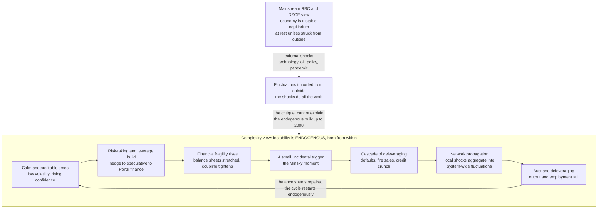

# 🌀 Business Cycles and Endogenous Fluctuations

> [!abstract] TL;DR
> **Complexity economics argues that business cycles are largely *endogenous*** — booms and busts are generated by the economy's *own* internal dynamics of credit, leverage, expectations, interaction, and nonlinearity, rather than being responses to external "shocks." Instability is therefore **intrinsic to capitalism**, not an aberration visited upon an otherwise-stable system from outside — a direct challenge to mainstream macro's picture of a stable equilibrium buffeted by exogenous disturbances (the **Real Business Cycle / DSGE** view, where "the shocks do all the work"). The flagship mechanism is **Hyman Minsky's financial-instability hypothesis**: *financial stability is destabilizing* — calm, profitable times breed rising confidence, risk-taking, and leverage (hedge → speculative → Ponzi finance), which make the system progressively more **fragile** until a small trigger sets off a **"Minsky moment"** of deleveraging and crisis; then the cycle restarts. Alongside Minsky sit the **nonlinear limit-cycle** tradition (multiplier–accelerator, Goodwin's predator–prey growth cycle, Kaldor's investment cycle), **credit and leverage cycles** (Fisher's debt-deflation, Geanakoplos's leverage cycle, Borio's financial cycle, Keen's debt models), **self-fulfilling animal spirits and reflexivity**, and the **network aggregation** of idiosyncratic micro shocks into macro fluctuations. The **"Great Moderation" preceding 2008** vividly illustrates the **paradox of stability** (over-stabilization breeds fragility, a self-organized-criticality logic), implying that crises are **recurrent and partly inevitable**, that **macroprudential vigilance** over endogenous fragility (leverage, credit growth, connectivity) matters more than reacting to shocks, and that **agent-based macro models** are needed — a foundational reconception of macroeconomic instability.

---

## Intuition

**Analogy — the ship versus the heart.** Mainstream macroeconomics explains recessions like a **well-built ship hit by rogue waves**. The vessel is fundamentally sound and, left alone, sails smoothly forever; it only lurches when struck by an external storm — an oil crisis, a pandemic, a policy blunder. On this view the economy is *calm by nature*, and every downturn must be traced to some disturbance that arrived **from outside**. Take away the storms and the sea goes flat.

But what if the storms come from **inside**? A **heart** does not need an external jolt to beat. It generates its own rhythm — a self-sustaining oscillation woven into its very tissue, driven by internal feedback that no outside pacemaker supplies. Complexity economics argues the economy is far more like the **heart** than the **ship**: its booms and busts are largely **endogenous**, manufactured by the system's own internal dynamics of credit, leverage, expectation, and interaction. Instability is not *visited upon* a stable economy from outside — it is **stitched into the fabric of capitalism itself**. And the cruelest twist, which the ship metaphor can never see, is Minsky's: the *calm itself is dangerous*. A long, quiet, profitable expansion is not the absence of the next crisis — it is when the leverage and fragility that *cause* the next crisis are being quietly built. Stability breeds instability. (This note is the macro-dynamics companion to [[Non_Equilibrium_and_Out_of_Equilibrium_Dynamics]], which establishes the general claim that the economy is never at rest.)

---

## How It Works

### The two worldviews

The debate is fundamentally about the **source** of fluctuations.

- **The exogenous-shock view (mainstream).** In **Real Business Cycle (RBC)** and **Dynamic Stochastic General Equilibrium (DSGE)** models, the economy is a **stable equilibrium** — a ball resting at the bottom of a bowl. Left undisturbed it would sit perfectly still. Fluctuations must therefore be *injected from outside* as random **shocks**: technology surprises, oil-price jumps, monetary or fiscal policy changes, pandemics. The internal dynamics only *propagate and dampen* these shocks; they never *create* a cycle. The economy is stable; the world is noisy.
- **The endogenous-cycle view (complexity).** Booms and busts are generated **from within**, by the nonlinear feedback and interaction of the agents themselves. The economy is not a ball in a bowl but a **self-oscillating system** — like the heart, or a predator–prey ecosystem, or a driven pendulum — whose fluctuations are an *intrinsic* property of its structure, requiring no external driver. Crises are internal phase transitions, not bad luck.

### The problem with "the shocks do all the work"

The exogenous view has a well-known embarrassment. To match the observed size and frequency of recessions, DSGE models must postulate shocks that are **implausibly large and frequent** — and much of the "shock" turns out to be an unexplained residual (the *Solow residual* / total-factor-productivity shock is essentially "the part of output we cannot account for," relabelled as a cause). More damningly, the shock view **cannot explain the endogenous buildup to a crisis**: the 2008 collapse was not delivered by an asteroid — it grew **inside** the financial system over years of accumulating leverage and correlated risk. Treating instability as external rather than systemic makes crises look like accidents to be insured against, rather than tendencies to be governed. The critique, sharpened by the crisis, is blunt: *if the shocks do all the explanatory work, the model of the economy itself is doing almost none.*

### Minsky's financial-instability hypothesis — the flagship mechanism

Hyman **Minsky**'s hypothesis is the canonical endogenous-cycle theory, and its slogan is a paradox: **financial stability is destabilizing**.

1. **Calm breeds confidence.** After a period of steady growth with no crises, lenders and borrowers revise their memory of danger downward. Low realized volatility *looks* like low risk.
2. **Confidence breeds leverage.** Rising confidence rewards borrowing. Minsky's taxonomy of financing tracks the drift: **hedge finance** (income covers principal and interest) → **speculative finance** (income covers only interest; debt must be rolled over) → **Ponzi finance** (income covers neither; survival depends on rising asset prices to refinance).
3. **Leverage breeds fragility.** As balance sheets stretch and coupling tightens, the system becomes progressively more **fragile** — a smaller and smaller disturbance can now cause a larger and larger response.
4. **Fragility breeds crisis.** Eventually a small, often *incidental* trigger — a rate rise, a default, a failed rollover — sets off a **"Minsky moment"**: a self-reinforcing cascade of deleveraging, fire sales, defaults, and credit contraction (developed in [[Cascades_Contagion_and_Financial_Crises]]).
5. **The cycle restarts.** Deleveraging repairs balance sheets, memory of danger is refreshed, and — slowly — the calm returns, and with it the next buildup.

The boom **sows the seeds of the bust endogenously**. Minsky, neglected for decades, was vindicated by 2008 to the point that his name entered the trading vocabulary ("Minsky moment"). The mechanism is the same *stability-breeds-fragility* self-organization that drives [[Self_Organized_Criticality_in_Economics]].

### The nonlinear limit-cycle tradition

Independently of finance, a mathematical heterodox tradition shows that **self-sustaining cycles (limit cycles)** arise from purely internal nonlinear dynamics, with **no external shocks**:

- **Multiplier–accelerator (Samuelson, Hicks).** Investment responds to the *growth* of output (the accelerator), while output responds to investment (the multiplier — see [[Government_Spending_Multiplier]]). This feedback, once nonlinear or bounded by ceilings and floors, produces **endogenous oscillations**.
- **Goodwin's growth cycle.** A **predator–prey** dynamic between employment and the wage share: high employment bids up wages → wage share rises → profits fall → investment and employment fall → wages ease → profits recover → employment rises again. A closed **limit cycle** in wage-share/employment space, with no shock required.
- **Kaldor's nonlinear investment cycle** and **Kaleckian/Keynesian dynamics** similarly generate endogenous fluctuations from nonlinear investment and distribution feedbacks.

These belong to the nonlinear-dynamics toolkit ([[Nonlinearity_and_Feedback]], [[Dynamical_Systems_and_Attractors]]): a **Hopf bifurcation** can turn a stable equilibrium into a limit cycle, and stronger nonlinearity can push the system into deterministic chaos.

### The credit and leverage cycle — why finance is central

A key gap in shock-free real-business-cycle models is that **finance barely appears**. The endogenous-cycle tradition puts **credit and debt** at the center:

- **Fisher's debt-deflation.** In a bust, falling prices *raise* the real burden of nominal debt, forcing more distress selling, which lowers prices further — a vicious deflationary spiral.
- **Geanakoplos's leverage cycle.** Collateral requirements are procyclical: easy credit and high leverage inflate asset prices in the boom; a shock tightens margins, forcing deleveraging that crashes prices in the bust.
- **Borio's financial cycle** — slow, large swings in credit and property prices that dwarf the conventional business cycle and are its deeper driver.
- **Keen's debt models** — explicit nonlinear systems where rising private debt fuels booms and its unwinding causes busts, extending Minsky and Goodwin.

The interaction of **credit, asset prices, and the real economy** generates *boozy booms and brutal busts* that a model without a financial sector structurally cannot produce.

### Expectations, animal spirits, and reflexivity

Because agents **forecast a system they collectively create**, expectations are self-referential and generate endogenous instability:

- **Keynes's "animal spirits"** — waves of optimism and pessimism driving investment beyond what fundamentals warrant.
- **Reflexivity (Soros)** — prices influence the fundamentals they are supposed to reflect, producing **self-fulfilling** bubbles (optimism validates itself) and **self-defeating** crashes (panic validates itself).
- **Sunspot equilibria** — extrinsic, "fundamentally irrelevant" beliefs that nonetheless move real outcomes when enough agents coordinate on them.
- **Herding** — agents copying each other amplify sentiment into synchronized swings (see [[Herding_Bubbles_and_Crashes]] and [[Sentiment_and_Noise_Trading]]).

Coordinated shifts in sentiment are an **endogenous driver of cycles**: the economy talks itself into booms and busts. Rational-expectations equilibrium models suppress precisely these dynamics by assumption.

### Network propagation — micro shocks that do not wash out

A classic argument for the shock view is that idiosyncratic firm-level disturbances should **average out** across millions of firms, leaving only aggregate shocks to explain the cycle. **Acemoglu and co-authors** showed this fails when the economy is a **network**: because production is organized through **input–output linkages** with **heavy-tailed** connectivity (a few hub sectors), a disturbance to a central sector does *not* wash out — it **cascades** through the network and aggregates into a **macro fluctuation** (see [[Input_Output_Networks_and_Production]] and [[Emergence_of_Macro_from_Micro]]). The economy's very interconnection turns small, uncorrelated micro events into system-wide volatility — an endogenous mechanism absent from **representative-agent** models, and structurally related to the systemic-risk propagation in [[Financial_Networks_and_Systemic_Risk]].

### The "Great Moderation" and the paradox of stability

From roughly **1985 to 2007**, macroeconomic volatility fell so steadily that economists named the era the **Great Moderation** and declared the business cycle tamed. Then came 2008. The endogenous view reads this not as bad luck but as **prophecy fulfilled**: the prolonged calm was exactly what bred the risk-taking, leverage, and correlated exposure that caused the crisis. This is Minsky's *stability breeds instability* and the **self-organized-criticality** logic together — **suppressing small fluctuations lets fragility build to a bigger one** (see [[Self_Organized_Criticality_in_Economics]] and [[Criticality_and_Phase_Transitions]]). The **paradox of stability**: calm is not safety, and **over-stabilization can breed fragility**. Stabilization policy, pursued naively, can backfire by removing the small corrections that would otherwise vent the pressure.

### Flow / Architecture



---

## Key Concepts

### Secondary (intuition level)
- **The ship versus the heart.** A ship only lurches when a wave hits it from outside; a heart beats on its own. Mainstream macro sees a ship; complexity economics sees a heart — the economy generates its own booms and busts.
- **Endogenous vs exogenous.** *Exogenous* = the cause comes from **outside** (a shock). *Endogenous* = the cause comes from **inside** (the system's own dynamics). Complexity economics says most of the business cycle is endogenous.
- **Stability breeds instability.** Long calm, profitable times make people take more risk and borrow more, which quietly builds up the fragility that causes the next crash. The calm is when the danger is manufactured.
- **The Minsky moment.** The sudden tipping point when built-up debt and fragility give way and a crisis cascades — like the last grain that finally slides a sandpile.

### Undergraduate (mechanism level)
- **Minsky's financing taxonomy.** *Hedge* (income covers principal + interest) → *speculative* (covers interest only) → *Ponzi* (covers neither; survival needs rising asset prices). The drift from hedge to Ponzi across a boom is the endogenous buildup of fragility.
- **Real Business Cycle / DSGE.** The mainstream models in which the economy is a stable equilibrium fluctuating only because of exogenous shocks; the benchmark this note challenges (see [[Business_Cycle_Indicators]]).
- **Goodwin growth cycle.** A predator–prey limit cycle between employment (prey) and wage share (predator); a self-sustaining business cycle with *no* external shock.
- **Multiplier–accelerator.** Investment reacts to output *growth* while output reacts to investment (the [[Government_Spending_Multiplier]]); their nonlinear feedback produces endogenous oscillations (Samuelson, Hicks).
- **Debt-deflation (Fisher) and the leverage cycle (Geanakoplos).** Falling prices raise the real burden of debt, and procyclical collateral requirements amplify booms and busts — finance as the cycle's engine.
- **Animal spirits and reflexivity.** Keynes's waves of optimism/pessimism and Soros's self-fulfilling price–belief feedback drive booms and panics endogenously (see [[Herding_Bubbles_and_Crashes]], [[Market_Anomalies_and_Bubbles]]).

### Graduate (formal / nuance level)
- **Limit cycles and Hopf bifurcation.** A stable equilibrium loses stability as a parameter crosses a critical value, giving birth to a self-sustaining oscillation — the formal home of endogenous cycles (Goodwin, Kaldor; see [[Dynamical_Systems_and_Attractors]], [[Bifurcations_and_Tipping_Points]]).
- **Deterministic chaos in macro.** Nonlinear multiplier–accelerator and cobweb maps can be chaotic (Grandmont, Benhabib–Day): bounded, aperiodic, sensitively dependent dynamics that *look* stochastic but carry no external noise.
- **Sunspot and multiple equilibria.** Self-fulfilling expectations select among many equilibria; extrinsic "sunspot" beliefs coordinate real fluctuations that fundamentals do not require.
- **Network origins of aggregate fluctuations (Acemoglu et al.).** With heavy-tailed input–output connectivity, idiosyncratic micro shocks fail to diversify away and aggregate into macro volatility — endogenous cycles from interaction structure (see [[Input_Output_Networks_and_Production]]).
- **Self-organized criticality and the paradox of stability.** The economy may drive *itself* to a critical, crash-prone state; suppressing small fluctuations lets fragility accumulate to a larger avalanche — the Great-Moderation-then-2008 trap (see [[Self_Organized_Criticality_in_Economics]]).
- **Stock–flow-consistent and agent-based macro.** Keen's debt dynamics and heterogeneous-agent simulations *grow* the cycle from balance-sheet interactions, treating instability as an emergent property rather than a shock response.

---

## Python Demo

Three experiments, `numpy` + `matplotlib` only. **Part (A)** builds a **Minsky-style endogenous cycle** as a fast–slow *relaxation oscillator*: a fast **activity/output** variable and a slow **fragility/leverage** variable. During the long, calm high-activity phase, fragility *slowly builds* (stability breeding leverage) until it crosses a threshold and activity **collapses rapidly** (the Minsky moment); fragility then unwinds and the cycle restarts — **all with no random input anywhere**. We plot the time series (note the asymmetric *slow-build, fast-crash* shape) and the **phase portrait**, which closes into a **limit cycle**. **Part (B)** draws the mainstream contrast: a **stable linear** model that, *without* shocks, decays to rest and simply *sits still*, and only fluctuates when fed **external noise** — "the shocks do all the work." **Part (C)** demonstrates the **paradox of stability**: a deterministic leverage model run under two policies — a *laissez-faire* regime that allows frequent small corrections (many small crises, leverage stays low) versus a *Great Moderation* regime that suppresses small corrections (a long calm buildup ending in one **catastrophic** deleveraging). Suppressing small fluctuations manufactures a bigger one.

```python
# Endogenous business cycles WITHOUT external shocks, contrasted with the
# exogenous-shock view, plus the Minsky "paradox of stability."
import numpy as np
import matplotlib.pyplot as plt

# ================================================================
# (A) MINSKY-STYLE ENDOGENOUS CYCLE  -- a fast-slow relaxation oscillator.
#     a = economic activity / output      (fast: booms and crashes quickly)
#     f = financial fragility / leverage   (slow: builds during calm)
#     During the calm high-activity phase, fragility slowly RISES until it
#     crosses a threshold and activity COLLAPSES (the "Minsky moment").
#     No noise term appears anywhere: the cycle is generated from WITHIN.
# ================================================================
def minsky(a, f, drive, eps, a0, b0):
    da = a - a**3 / 3.0 - f + drive            # activity: bounded nonlinear boom/bust
    df = eps * (a + a0 - b0 * f)               # fragility: slow accumulation / unwind
    return da, df

drive, eps, a0, b0 = 0.5, 0.08, 0.7, 0.8       # oscillatory (limit-cycle) regime
dt, n = 0.02, 60000
a = np.empty(n); f = np.empty(n)
a[0], f[0] = -1.0, -0.6                         # start OFF the fixed point
for k in range(n - 1):                          # RK4 integration -- deterministic, no shocks
    k1a, k1f = minsky(a[k],              f[k],              drive, eps, a0, b0)
    k2a, k2f = minsky(a[k]+0.5*dt*k1a,   f[k]+0.5*dt*k1f,   drive, eps, a0, b0)
    k3a, k3f = minsky(a[k]+0.5*dt*k2a,   f[k]+0.5*dt*k2f,   drive, eps, a0, b0)
    k4a, k4f = minsky(a[k]+dt*k3a,       f[k]+dt*k3f,       drive, eps, a0, b0)
    a[k+1] = a[k] + (dt/6.0)*(k1a + 2*k2a + 2*k3a + k4a)
    f[k+1] = f[k] + (dt/6.0)*(k1f + 2*k2f + 2*k3f + k4f)
t = np.arange(n) * dt

# ================================================================
# (B) EXOGENOUS-SHOCK VIEW  -- a stable linear system.
#     x_{t+1} = phi * x_t (+ noise). Without shocks it decays to rest and
#     SITS STILL; it only fluctuates because external noise is injected.
# ================================================================
phi, m = 0.85, 300
x_calm = np.empty(m); x_calm[0] = 1.0
for k in range(m - 1):
    x_calm[k+1] = phi * x_calm[k]               # NO shocks -> flatlines to zero (rest)

rng = np.random.default_rng(0)
x_shock = np.empty(m); x_shock[0] = 0.0
for k in range(m - 1):
    x_shock[k+1] = phi * x_shock[k] + rng.normal(0, 0.25)   # only noise keeps it alive

# ================================================================
# (C) PARADOX OF STABILITY  -- deterministic leverage/credit cycle.
#     Calm periods breed leverage (L grows). Two policies:
#     Regime 1 (laissez-faire): small corrections allowed at a LOW threshold
#              -> frequent small crises, leverage stays low.
#     Regime 2 (Great Moderation): small corrections suppressed; only a rare
#              SYSTEMIC threshold triggers -> one long calm then a huge crash.
# ================================================================
def leverage_cycle(T, g, thresh, delev):
    L, path, crises = 0.0, [], []               # L = leverage; crises = (time, size)
    for tt in range(T):
        L += g                                  # "stability breeds leverage": calm builds debt
        if L > thresh:                          # fragility threshold reached -> deleveraging
            drop = delev * L
            crises.append((tt, drop))
            L -= drop
        path.append(L)
    return np.array(path), crises

T = 300
L_lf, cr_lf = leverage_cycle(T, g=0.05, thresh=1.0, delev=0.40)   # many small corrections
L_gm, cr_gm = leverage_cycle(T, g=0.05, thresh=5.0, delev=0.85)   # suppressed -> one big crash

# ---------------------------------- plots ----------------------------------
fig, ax = plt.subplots(2, 2, figsize=(14, 9))

# (A) endogenous cycle time series -- asymmetric slow build, fast crash
ax[0, 0].plot(t, a, label="activity / output  a", color="steelblue", lw=1.1)
ax[0, 0].plot(t, f, label="fragility / leverage  f", color="firebrick", lw=1.3)
ax[0, 0].set_title("(A) Minsky endogenous cycle: NO shocks, self-sustaining")
ax[0, 0].set_xlabel("time"); ax[0, 0].set_ylabel("value")
ax[0, 0].legend(fontsize=8); ax[0, 0].grid(alpha=0.3)

# (A) phase portrait -- a closed limit cycle (discard transient)
warm = n // 4
ax[0, 1].plot(a[warm:], f[warm:], color="purple", lw=0.7)
ax[0, 1].set_title("(A) Phase portrait: a closed LIMIT CYCLE (endogenous attractor)")
ax[0, 1].set_xlabel("activity / output  a"); ax[0, 1].set_ylabel("fragility / leverage  f")
ax[0, 1].grid(alpha=0.3)

# (B) exogenous-shock contrast
ax[1, 0].plot(x_calm, label="stable model, NO shocks -> decays to rest", color="gray", lw=1.6)
ax[1, 0].plot(x_shock, label="same model + external shocks -> wiggles", color="darkorange", lw=1.0)
ax[1, 0].axhline(0.0, color="black", ls="--", lw=0.7)
ax[1, 0].set_title("(B) Exogenous-shock view: 'the shocks do all the work'")
ax[1, 0].set_xlabel("time"); ax[1, 0].set_ylabel("output gap  x")
ax[1, 0].legend(fontsize=8); ax[1, 0].grid(alpha=0.3)

# (C) paradox of stability: suppressing small crises breeds one big one
ax[1, 1].plot(L_lf, label="laissez-faire: frequent SMALL crises", color="seagreen", lw=1.1)
ax[1, 1].plot(L_gm, label="'Great Moderation': one HUGE crisis", color="crimson", lw=1.3)
if cr_gm:
    gt, gd = zip(*cr_gm)
    ax[1, 1].plot(gt, [L_gm[i] for i in gt], "rv", ms=9, label="Minsky moment")
ax[1, 1].set_title("(C) Paradox of stability: suppressed small swings -> bigger crash")
ax[1, 1].set_xlabel("time"); ax[1, 1].set_ylabel("leverage  L")
ax[1, 1].legend(fontsize=8); ax[1, 1].grid(alpha=0.3)

plt.tight_layout()
plt.savefig("endogenous_business_cycles.png", dpi=110)
plt.show()

# ------------------------------ console summary ------------------------------
half = n // 2
swing_1 = round(float(a[:half].max() - a[:half].min()), 3)
swing_2 = round(float(a[half:].max() - a[half:].min()), 3)
print(f"(A) Activity swing, first half : {swing_1}")
print(f"(A) Activity swing, second half: {swing_2}")
print("(A) => amplitude persists with NO noise: the cycle is generated from WITHIN.")

worst_lf = max((d for _, d in cr_lf), default=0.0)
worst_gm = max((d for _, d in cr_gm), default=0.0)
print(f"(C) Laissez-faire: {len(cr_lf)} crises, largest deleveraging = {worst_lf:.2f}")
print(f"(C) Great Moderation: {len(cr_gm)} crises, largest deleveraging = {worst_gm:.2f}")
print("(C) => suppressing small corrections trades many small crises for one catastrophe.")
```

**What to notice.** Part (A) contains **no random number generator on the economic side**, yet activity and fragility oscillate *forever*, and the phase portrait closes into a **limit cycle** — a business cycle manufactured purely by internal nonlinear feedback, with the tell-tale **asymmetry** of a Minsky world (a long calm buildup followed by a fast crash). Part (B) is the exogenous worldview in one picture: the *identical* stable rule flatlines to rest without shocks and only fluctuates when noise is fed in. Part (C) makes the **paradox of stability** concrete: the regime that suppresses small corrections enjoys a longer calm — and pays for it with a single catastrophic Minsky moment far larger than any crisis the "volatile" regime ever suffers. The whole argument sits in these figures: *do fluctuations come from inside the system, and is calm the same thing as safety?*

---

## Real-World Applications

> **Example — the 2008 Global Financial Crisis as an endogenous Minsky cycle.** Through the 1990s and 2000s, a long, low-volatility expansion — the **Great Moderation** — steadily rewarded leverage, securitization, and correlated exposure to housing. Financing drifted from *hedge* to *speculative* to outright *Ponzi* (loans repayable only if house prices kept rising). Fragility built silently *inside* the system exactly as Minsky described, until an unremarkable trigger (subprime delinquencies) set off a self-reinforcing cascade of deleveraging, fire sales, and credit collapse — the archetypal **Minsky moment**. The crisis was not a rogue wave that struck a sound ship; it was the system's own accumulated fragility discharging. This reading, dismissed as heterodox before 2008, is now mainstream enough that "Minsky moment" is standard vocabulary (see [[Global_Financial_Crises]]).

- **Macroprudential regulation.** If instability is endogenous, policy must **lean against the buildup**, not just clean up after shocks: countercyclical capital buffers, leverage and loan-to-value caps, and monitoring of credit growth and interconnection. This is the practical program of complexity-informed financial regulation — the subject of the forthcoming sibling note *Complexity_and_Financial_Regulation* and the structural view in [[Financial_Networks_and_Systemic_Risk]].
- **Early-warning systems and forecasting.** Because the trigger is incidental but the fragility is causal, forecasting should track **endogenous fragility indicators** — aggregate leverage, credit-to-GDP gaps, maturity mismatch, network connectivity — rather than hunt for the next external risk. The BIS credit-gap indicator (Borio) operationalizes exactly this.
- **Agent-based macroeconomic models.** Institutions increasingly build ABMs (the Bank of England's work, the EURACE and Keen-style stock–flow-consistent models) that **generate endogenous cycles** from interacting, leveraged, boundedly-rational agents — the tools the endogenous view demands (foreshadowing the sibling *Agent_Based_Macroeconomics*; see also [[Non_Equilibrium_and_Out_of_Equilibrium_Dynamics]]).
- **Critique and reform of DSGE-based policy.** The 2008 failure of workhorse DSGE models to anticipate or even represent an endogenous crisis spurred efforts to add financial frictions, heterogeneous agents, and nonlinearity — and, more radically, to question the equilibrium-plus-shocks paradigm itself.
- **Commodity, housing, and credit cycles.** Cobweb-style overshooting in agriculture, procyclical mortgage credit, and boom–bust property markets are textbook endogenous cycles driven by expectations and leverage rather than by external disturbances (see [[Business_Cycle_Indicators]]).

---

## Common Pitfalls

- **Assuming every fluctuation must be exogenous.** The DSGE reflex is to explain each wiggle with an outside shock. This can *fit* the data while *missing the mechanism* — the feedback that manufactures cycles from within. Endogeneity is a live alternative, not a curiosity.
- **Mistaking calm for safety (the paradox of stability).** Judging a system healthy because it is *quiet* is exactly backwards in a Minsky world: prolonged low volatility is when leverage and fragility accumulate. Over-stabilization can breed a larger catastrophe — the Great-Moderation-then-2008 trap.
- **Hunting for the "guilty trigger."** After a crash we blame the one bank, loan, or headline. In an endogenously fragile system the trigger is largely interchangeable — manage the *fragility* (leverage, coupling, correlation), not the spark. "If only X hadn't happened" is usually false; something else would have.
- **Conflating "unpredictable" with "unmanageable."** Endogenous-cycle theory says the *timing and size* of the next crisis are hard to forecast — it does *not* say fragility is unmeasurable. You can track leverage and connectivity and build resilience; you just cannot promise the date.
- **Throwing out equilibrium and shocks entirely.** Endogenous does not mean shocks never matter — real crises usually mix an internal buildup with an external trigger. The claim is that the *buildup* is the deeper cause, not that shocks are irrelevant.
- **Over-fitting a specific limit-cycle model.** Goodwin, Kaldor, and multiplier–accelerator models are *illustrations* of endogenous mechanism, not literal descriptions of any one economy. Use them to establish that internal dynamics *can* generate cycles, not to make precise quantitative forecasts.

---

## Related Concepts

- [[Non_Equilibrium_and_Out_of_Equilibrium_Dynamics]] — the general claim that the economy is never at rest; this note is its macro-dynamics, business-cycle specialization.
- [[Cascades_Contagion_and_Financial_Crises]] — the mechanism by which the Minsky moment *discharges*: deleveraging, defaults, and fire sales cascading through the system.
- [[Self_Organized_Criticality_in_Economics]] — the sandpile logic behind "stability breeds instability" and the paradox of stability; endogenous fragility building to an avalanche.
- [[Financial_Networks_and_Systemic_Risk]] — the structural companion: the exposure network that channels a local crisis into a systemic one.
- [[Business_Cycle_Indicators]] — the empirical fluctuations, and the RBC/DSGE benchmark, that endogenous-cycle theory seeks to explain from within.
- [[Global_Financial_Crises]] — the macroeconomic anatomy of 2008, reread here as an endogenous Minsky cycle rather than an external shock.
- [[Nonlinearity_and_Feedback]] — the ingredient that makes limit cycles and endogenous fluctuations possible; linearity forbids self-sustaining cycles.
- [[Dynamical_Systems_and_Attractors]] — limit cycles and attractors that replace the single equilibrium as the objects of study.
- [[Bifurcations_and_Tipping_Points]] — the Hopf bifurcation that births a limit cycle, and the tipping structure of a Minsky moment.
- [[Feedback_Loops_and_Causality]] — the reinforcing and balancing loops (leverage, confidence, debt-deflation) that drive the cycle.
- [[Criticality_and_Phase_Transitions]] — the physics of critical states underlying the paradox of stability and crash-prone fragility.
- [[Cascades_and_Systemic_Risk]] — the systems-thinking treatment of cascading failure that the financial cascade specializes.
- [[Herding_Bubbles_and_Crashes]] — the behavioral engine of animal spirits, herding, and self-fulfilling booms and panics.
- [[Sentiment_and_Noise_Trading]] — how sentiment and non-fundamental trading amplify endogenous swings.
- [[Market_Anomalies_and_Bubbles]] — reflexivity and bubbles as self-fulfilling price–belief feedback.
- [[Government_Spending_Multiplier]] — the multiplier half of the multiplier–accelerator endogenous-cycle mechanism.
- [[Input_Output_Networks_and_Production]] — the production network through which micro shocks aggregate into macro fluctuations (Acemoglu et al.).
- [[Emergence_of_Macro_from_Micro]] — the general principle that macro fluctuations emerge from micro interaction, not from a representative agent.
- [[Value_at_Risk]] — the mainstream risk measure whose thin-tailed, calm-period assumptions endogenous fragility systematically breaks.
- [[Systems_of_ODEs]] — the differential-equation machinery for the Goodwin and Minsky continuous-time cycle models.

*Not-yet-written companion notes in this vault:* **Agent_Based_Macroeconomics** (the simulation tools that generate endogenous cycles) and **Complexity_and_Financial_Regulation** (the macroprudential policy program).

---

## Review Questions

**Secondary (conceptual).**
1. Using the ship-versus-heart analogy, explain the difference between the mainstream (exogenous-shock) and complexity (endogenous) accounts of recessions. Why does it matter, for policy, which picture is correct?
2. State Minsky's paradox — "stability breeds instability" — in your own words, and explain why a long, calm, profitable expansion might be a *warning sign* rather than reassurance.

**Undergraduate (applied).**
3. Walk through one full loop of the Minsky cycle (calm → confidence → leverage → fragility → Minsky moment → deleveraging → calm), identifying at each stage whether the driving feedback is *reinforcing* or *balancing*. How does this differ from an economy that only fluctuates when hit by an external shock?
4. In the Python demo, Part (A) produces a business cycle with no random input while Part (B) needs external noise to fluctuate at all. Explain what property of Part (A)'s model makes self-sustaining cycles possible, and why the *linear* model in Part (B) cannot produce them.

**Graduate (research / trade-off).**
5. DSGE models fit macro data well by attributing fluctuations to a stack of exogenous shock processes; an endogenous limit-cycle or leverage model can fit similar data with *no* shocks. On what empirical, methodological, or philosophical grounds would you prefer one over the other, and what evidence (e.g., the pre-2008 credit buildup, network aggregation of micro shocks, the asymmetry of expansions and contractions) could discriminate between them?
6. The "paradox of stability" implies that successful short-run stabilization can raise long-run systemic risk. Design a macroprudential policy stance that respects this tension — leaning against endogenous fragility without merely suppressing the small fluctuations that vent it — and explain which fragility indicators you would monitor and why forecasting the *date* of the next crisis may remain impossible even so.

---

## Sources

- Minsky, H. P. (1986). *Stabilizing an Unstable Economy.* Yale University Press. — the financial-instability hypothesis; stability breeds fragility. See also Minsky (1992), "The Financial Instability Hypothesis," Levy Economics Institute Working Paper No. 74.
- Goodwin, R. M. (1967). "A Growth Cycle." In C. H. Feinstein (ed.), *Socialism, Capitalism and Economic Growth.* Cambridge University Press. — the predator–prey limit-cycle model of the business cycle.
- Keen, S. (2011). *Debunking Economics: The Naked Emperor Dethroned?* (Revised ed.). Zed Books. — nonlinear debt-driven Minsky/Goodwin models and the critique of equilibrium macro.
- Battiston, S., Farmer, J. D., Flache, A., Garlaschelli, D., Haldane, A. G., Heesterbeek, H., Hommes, C., Jaeger, C., May, R., & Scheffer, M. (2016). "Complexity Theory and Financial Regulation." *Science, 351*(6275), 818–819. — endogenous instability and macroprudential implications.
- Acemoglu, D., Carvalho, V. M., Ozdaglar, A., & Tahbaz-Salehi, A. (2012). "The Network Origins of Aggregate Fluctuations." *Econometrica, 80*(5), 1977–2016. — micro shocks aggregating into macro cycles via input–output networks.
- Kirman, A. (2010). *Complex Economics: Individual and Collective Rationality.* Routledge. — interaction, heterogeneity, and endogenous macro dynamics beyond the representative agent.

---

#complexity-economics #business-cycles #endogenous-fluctuations #minsky #financial-instability
