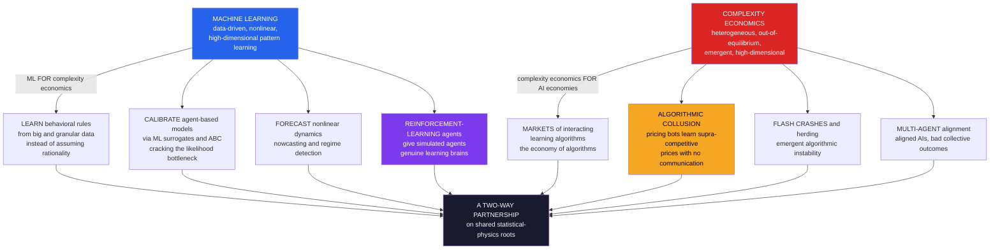

# 🤖 Complexity Economics and Machine Learning

> [!abstract] TL;DR
> **Machine learning** and **complexity economics** are natural, mutually-transforming partners, and the relationship runs **both ways**. Going one way, **ML supplies the computational, data-driven tools complexity economics has always needed**: it can **learn agents' real behavioral rules** from big and granular data (transactions, web traces, satellite imagery, administrative micro-data) instead of assuming rationality; it can **calibrate sprawling agent-based models** via **surrogate/emulator** and **Approximate Bayesian Computation** methods — cracking the field's central methodological bottleneck of intractable likelihoods (see [[Calibration_and_Validation_of_Agent_Based_Models]]); it can **forecast** nonlinear, high-dimensional dynamics and **nowcast** activity from alternative data; and it can give simulated agents **genuine reinforcement-learning brains** so that ABMs contain agents that truly *adapt and learn* rather than follow hand-coded scripts. Going the other way, **complexity economics supplies the framework to understand an economy increasingly run by interacting ML algorithms** — algorithmic trading, algorithmic pricing, recommenders, matching engines, and AI agents transacting — a new **complex adaptive system of learning agents**, "the economy of algorithms." This convergence has already surfaced striking **emergent** phenomena: independent **pricing algorithms that learn to collude** with no communication and no code that says "collude" (an antitrust nightmare — Calvano et al.), algorithmic **flash crashes**, and correlated **algorithmic herding** that breeds fragility. The multi-agent, out-of-equilibrium, emergence-focused lens is therefore essential for building next-generation economic models, forecasting, regulating algorithmic markets, and governing an emerging economy of interacting AIs — all atop the **shared statistical-physics roots** (power laws, phase transitions, spin/agent models, networks) that link economics, physics, and machine learning.

---

## Intuition

**Analogy — the messy jungle finally gets a satellite.** Complexity economics faces a paradox. Its founding claim is that the economy is too **complex, heterogeneous, and out-of-equilibrium** for the tidy equations of neoclassical theory — it is a jungle, not a formal garden. But for decades that same messiness turned against the field: its bottom-up **agent-based models** were hard to *build* (which behavioral rules do real people actually follow?), hard to *calibrate* (they have dozens of knobs and no closed-form likelihood), and hard to *trust* (a flexible simulation can be tuned to grow almost anything). The jungle was real, but nobody could map it. **Machine learning arrives as the perfect partner** because it thrives on exactly the high-dimensional, nonlinear, data-rich messiness that defeated equations. It is the satellite and the drone-swarm the jungle-mapper never had: it can *learn* the behavioral rules directly from millions of real decisions, *emulate* an expensive ABM with a fast surrogate so it can finally be calibrated, *forecast* patterns that linear models miss, and *become* the agents themselves — reinforcement learners that adapt inside the model.

And the relationship runs the other way too, which is where it turns unsettling. The economy is no longer just *studied with* algorithms — it is increasingly *made of* them. Trading bots, pricing bots, ride-share surge engines, and recommender systems are **interacting learning algorithms**, a new kind of **complex adaptive system**. That is precisely the object complexity economics was built to study: many adaptive agents, out of equilibrium, producing **emergent** behavior nobody designed. When independent pricing bots quietly *learn to keep prices high together* without ever communicating, or when interacting trading algorithms trigger a **flash crash** in minutes, you are watching emergence — and only a multi-agent, complexity lens even has the vocabulary to see it.

---

## How It Works

### The two-way partnership

The intersection has two directions, and keeping them straight is the single most important move in the area.

**Direction 1 — ML *for* complexity economics (a computational instrument).** Here ML is the toolkit that makes the messy, high-dimensional models of complexity economics buildable, estimable, and predictive.

1. **Data-driven behavior — learning what agents actually *do*.** Rather than *assuming* rationality or *hand-coding* rules, use ML on **big and granular data** — transaction records, web and search traces, satellite and geolocation data, administrative micro-data — to **learn agents' real behavioral rules and heterogeneity**. This grounds the [[Agent_Based_Modeling_in_Economics|agent-based model]] empirically: the micro-rules are *discovered from data*, not stipulated. Behavioral economics has its own version of this move (see [[Behavioral_Economics_and_Machine_Learning]]); complexity economics uses it to populate whole artificial economies with data-calibrated agents.
2. **Calibrating and analyzing ABMs — cracking the hard problem.** The central methodological challenge of ABMs is **calibration and validation with intractable likelihoods** — you cannot write down the probability of the data given the parameters, and every evaluation is a full, stochastic simulation. ML supplies the state of the art: **surrogate / emulator models** (train a fast Gaussian process or neural net on the ABM's expensive input-output map, then calibrate, optimize, and explore on the cheap surrogate — Lamperti, Roventini & Sani), **Approximate Bayesian Computation** and simulation-based inference, and ML-driven **global sensitivity analysis** to search the huge parameter and behavior space. This is the *key enabler* that turns sprawling ABMs from illustrative toys into estimable, decision-grade instruments — the whole subject of [[Calibration_and_Validation_of_Agent_Based_Models]].
3. **Forecasting complex dynamics — the predictive side.** ML (deep learning, gradient boosting) excels at **nonlinear, high-dimensional prediction**: forecasting economic and financial time series, **nowcasting** real-time GDP and activity from alternative data, and detecting **regimes, patterns, and early-warning signals** that linear models miss. This is the empirical, predictive wing of complexity economics — pursued with appropriate humility about the *fundamental* unpredictability of chaotic, reflexive systems (see [[Non_Equilibrium_and_Out_of_Equilibrium_Dynamics]]): ML finds structure in the mess without pretending the mess is fully forecastable.
4. **Reinforcement-learning agents in ABMs — smart artificial agents.** Replace hand-coded rules with **reinforcement-learning agents** that *learn* adaptive (or near-optimal) behavior through experience (see [[Reinforcement_Learning]]). RL agents make ABMs more behaviorally rich and less arbitrary — the agents genuinely adapt — and let researchers study **how learning itself shapes emergent macro outcomes**. Multi-agent RL is the modern engine of agent-based economics, connecting directly to bounded-rationality accounts of adaptive agents (see [[Bounded_Rationality_and_Heterogeneous_Agents]] and [[Evolutionary_Game_Theory_and_Machine_Learning]], where RL dynamics converge to the replicator equation).

**Direction 2 — complexity economics *for* ML/AI economies (a framework for a new object).** Here complexity economics is what you *need* to make sense of an economy increasingly populated by interacting learning algorithms.

5. **The economy of algorithms.** Markets are more and more **interacting ML algorithms**: algorithmic and high-frequency **trading** bots, algorithmic **pricing** engines (retailers, ride-share surge, airlines), **recommender and matching** systems, and AI agents transacting on our behalf. The economy is becoming a **complex adaptive system of interacting learning algorithms** — a new object for which the multi-agent, emergent, out-of-equilibrium worldview of complexity economics is uniquely suited.
6. **Algorithmic collusion — the flagship emergent concern.** Independent **pricing algorithms** (reinforcement learners) can **learn to collude** — sustaining supra-competitive prices via learned reward-and-punishment strategies — **without any communication and without ever being programmed to collude** (Calvano, Calzolari, Denicolò & Pastorello). This is genuine, demonstrated tacit collusion among Q-learners, and it is an antitrust nightmare: *how do you prosecute collusion that no human designed or agreed to?* It is an **emergent** phenomenon of interacting learning agents that only a multi-agent/complexity analysis reveals (the Python demo below reproduces it), and it is the sharp edge of the not-yet-written sibling *Complexity_and_Financial_Regulation* and of competition policy generally.
7. **Other emergent algorithmic phenomena — the systemic risks.** Beyond collusion: **flash crashes** and algorithmic instability (interacting trading algorithms producing sudden, unintended crashes — the 2010 Flash Crash), algorithmic **herding** (similar algorithms trained on similar data act alike, so homogeneity breeds fragility — see [[Cascades_Contagion_and_Financial_Crises]]), **feedback loops** and reflexivity (algorithms trained on data they collectively generate, driving model-driven bubbles), and market-level **fairness, bias, and manipulation**. This is where multi-agent AI safety meets complexity economics.
8. **AI alignment and multi-agent challenges — the deeper frontier.** An economy of many interacting AIs raises **multi-agent alignment** problems: individually-aligned AIs can still produce bad collective outcomes — emergent misalignment, races, collusion, conflict. Governing AI-driven markets, and asking about welfare and control in an increasingly-automated economy, is a complexity problem at heart. Complexity economics plus multi-agent RL is a natural framework for the emergent behavior of AI collectives, connecting to [[AI_Alignment_and_Existential_Risk]].

**The shared statistical-physics roots.** None of this is coincidence. Complexity economics, statistical mechanics, and machine learning share tools and heritage — **power laws, phase transitions, agent-based and spin models, emergence, networks** (see [[Econophysics_and_Statistical_Mechanics_of_Markets]] and the *Statistical Mechanics ↔ Machine Learning* material). The common language of **complex systems** is what unifies economics, physics, and machine learning into one science of *many interacting adaptive units*.

### Diagram: the two-way relationship



---

## Key Concepts

### Secondary (intuition level)
- **Computers can learn how people behave.** Instead of *assuming* everyone is a perfect calculator, we can feed a program millions of real choices and let it *learn* the rules people actually follow — then put those rules inside a simulated economy.
- **Smart tuning for big simulations.** Agent-based simulations have lots of knobs and are slow to run. ML builds a fast "stand-in" (a surrogate) that mimics the slow simulation, so we can finally tune it to match real data.
- **The economy is becoming a swarm of algorithms.** More and more of the buying, selling, and pricing is done by learning programs — trading bots, pricing bots, recommendation feeds — all reacting to each other. That is exactly the kind of many-agent system complexity economics studies.
- **Bots can learn to cheat without being told to.** Two independent pricing programs, each just trying to make money, can *learn* to keep prices high together — a kind of silent collusion — even though nobody wrote a line of code telling them to cooperate. That is an emergent surprise, and a real worry for regulators.

### Undergraduate (mechanism level)
- **Learning behavioral rules from data.** Use flexible ML (gradient boosting, neural nets) on granular micro-data to estimate heterogeneous decision rules, which then parameterize the agents of an ABM — empirical grounding instead of assumed rationality.
- **Surrogate calibration.** Train a Gaussian process or neural emulator on a sample of `(parameters -> ABM outputs)` runs, then calibrate/optimize on the cheap surrogate (Bayesian optimization). Pair with **Approximate Bayesian Computation** (accept parameters whose simulated summaries are close to observed) to get likelihood-free posteriors — the core of [[Calibration_and_Validation_of_Agent_Based_Models]].
- **Forecasting and nowcasting.** ML predicts nonlinear time series and nowcasts GDP/activity from alternative data, and flags regimes and early-warning signals — while respecting that reflexive, chaotic systems have a *prediction horizon*.
- **RL agents in ABMs.** Each agent runs a reinforcement-learning algorithm (e.g., Q-learning): choose an action, observe reward, update value estimates. Populations of such agents produce *emergent* macro dynamics that depend on how they learn, not just what they optimize.
- **Algorithmic collusion, mechanically.** Two Q-learning firms set prices repeatedly; the **state** includes rivals' recent prices, so a learner can encode "if you cut, I punish; if you hold high, I hold high." Independent learning converges to **supra-competitive prices sustained by learned punishment** — collusion with no agreement.

### Graduate (frontier level)
- **Simulation-based inference for ABMs.** Beyond ABC and surrogates: **neural posterior/likelihood estimation** (SNPE/SNLE), synthetic likelihood, and normalizing-flow density estimators learn the map from summary statistics to parameters, turning intractable-likelihood ABMs into estimable models; identification and moment selection remain the binding constraints.
- **Multi-agent reinforcement learning as economic ABM.** MARL *is* agent-based economics with learning agents. Non-stationarity (each agent's environment includes other learners), equilibrium selection among many self-confirming equilibria, and convergence pathologies are simultaneously ML problems and complexity-economics problems; RL dynamics link to replicator/evolutionary dynamics (see [[Evolutionary_Game_Theory_and_Machine_Learning]]).
- **The mechanism of learned collusion (Calvano et al.).** With memory-1 state and `epsilon`-greedy Q-learning on a logit-demand Bertrand game, independent agents converge to prices between the Bertrand-Nash and monopoly levels and — crucially — off-path experiments reveal **reward-punishment schemes**: a deviation triggers a temporary price war that restores cooperation, exactly the folk-theorem logic, but *learned* rather than agreed. Robust across seeds, discount factors, and demand parameters; the empirical counterpart (Assad et al., German gasoline) shows real markups rising after algorithmic-pricing adoption.
- **Reflexivity and performativity.** Algorithms trained on data they collectively generate create endogenous, non-stationary data-generating processes — model-driven bubbles, correlated de-risking, and herding-driven fragility. Standard estimation assuming a fixed distribution fails; the economy is *non-ergodic and path-dependent*, tying back to [[Non_Equilibrium_and_Out_of_Equilibrium_Dynamics]].
- **Shared statistical mechanics.** Spin-glass energy landscapes, mean-field theory, and phase transitions describe learning dynamics *and* market microstructure *and* opinion/herding models — one mathematical toolbox for economics, physics, and ML, the deep basis of [[Econophysics_and_Statistical_Mechanics_of_Markets]].

---

## Python Demo

We put **reinforcement-learning agents into a market ABM** and reproduce the headline emergent phenomenon: **two independent Q-learning firms, repeatedly setting prices in a Bertrand (price-competition) duopoly, learn to collude** — sustaining prices *well above* the competitive Bertrand-Nash level — **with no communication and no code that rewards cooperation**. This is the Calvano-Calzolari-Denicolò-Pastorello result in miniature. Each firm's **state** is the pair of prices posted last period, which is what lets a learner encode a reward-punishment strategy; each firm greedily maximizes its own discounted profit and updates a Q-table. The demo computes the **Bertrand-Nash** and **monopoly** benchmarks from the same demand system, trains the two learners, and plots the emergent prices converging into the *collusive zone* between the two benchmarks. Uses only `numpy` and `matplotlib`.

```python
# ============================================================================
# EMERGENT ALGORITHMIC COLLUSION FROM REINFORCEMENT-LEARNING AGENTS
#
# Two INDEPENDENT Q-learning "firms" repeatedly set prices in a logit-demand
# BERTRAND duopoly (Calvano, Calzolari, Denicolo & Pastorello, AER 2020).
# Each firm's STATE = the pair of prices posted last period, so a learner CAN
# encode "if you undercut, I punish; if you hold high, I hold high". Neither
# firm can communicate and neither is rewarded for cooperating -- yet learning
# alone drives prices ABOVE the competitive Bertrand-Nash level, PARTWAY to
# the monopoly price: emergent tacit collusion. We plot the learned prices vs
# the Nash and monopoly benchmarks and report a collusion index.
# ============================================================================
import numpy as np
import matplotlib
matplotlib.use("Agg")
import matplotlib.pyplot as plt

rng = np.random.default_rng(7)

# ---- Economic environment: symmetric logit Bertrand duopoly -----------------
A, A0, MU, C = 2.0, 0.0, 0.25, 1.0     # quality, outside option, differentiation, cost

def demand(p0, p1):
    e0 = np.exp((A - p0) / MU)
    e1 = np.exp((A - p1) / MU)
    denom = e0 + e1 + np.exp(A0 / MU)
    return e0 / denom, e1 / denom

def profit0(p0, p1):
    q0, _ = demand(p0, p1)
    return (p0 - C) * q0

# ---- Benchmarks: Bertrand-Nash price and (symmetric) monopoly price ----------
fine = np.linspace(1.0, 2.6, 4001)
def nash_price():                       # iterate simultaneous best responses
    p0 = p1 = 1.6
    for _ in range(2000):
        p0n = fine[np.argmax((fine - C) * demand(fine, p1)[0])]
        p1n = fine[np.argmax((fine - C) * demand(p0n, fine)[1])]
        if abs(p0n - p0) < 1e-4 and abs(p1n - p1) < 1e-4:
            p0, p1 = p0n, p1n; break
        p0, p1 = p0n, p1n
    return 0.5 * (p0 + p1)

def monopoly_price():                   # symmetric joint-profit maximum
    q0, q1 = demand(fine, fine)
    return fine[np.argmax((fine - C) * (q0 + q1))]

P_NASH, P_MONO = nash_price(), monopoly_price()

# ---- Discrete price grid spanning (a bit beyond) Nash..monopoly -------------
M, XI = 15, 0.1
p_grid = np.linspace(P_NASH - XI * (P_MONO - P_NASH),
                     P_MONO + XI * (P_MONO - P_NASH), M)

# Pre-tabulate each firm's profit for every (own_idx, rival_idx) pair
PI0 = np.array([[profit0(p_grid[i], p_grid[j]) for j in range(M)] for i in range(M)])
PI1 = PI0.T                             # symmetric: firm 1's profit is the transpose

# ---- Two independent Q-learners; state = (last price of 0, last price of 1) --
ALPHA, GAMMA, BETA = 0.15, 0.95, 1.2e-5     # learning rate, discount, exploration decay
T = 500_000                                  # reduce (e.g. 150_000) for a quick run
Q0 = np.zeros((M, M, M))                      # Q0[i, j, a] : value of playing a in state (i,j)
Q1 = np.zeros((M, M, M))

i, j = rng.integers(M), rng.integers(M)       # random initial posted prices
BLK = 2000
mean0 = np.zeros(T // BLK); mean1 = np.zeros(T // BLK)
acc0 = acc1 = 0.0

for t in range(T):
    eps = np.exp(-BETA * t)                    # time-declining exploration
    a0 = rng.integers(M) if rng.random() < eps else int(np.argmax(Q0[i, j]))
    a1 = rng.integers(M) if rng.random() < eps else int(np.argmax(Q1[i, j]))
    r0, r1 = PI0[a0, a1], PI1[a0, a1]          # profits realized this period
    # Q-update; next state is (a0, a1) -- the prices just posted
    Q0[i, j, a0] = (1 - ALPHA) * Q0[i, j, a0] + ALPHA * (r0 + GAMMA * Q0[a0, a1].max())
    Q1[i, j, a1] = (1 - ALPHA) * Q1[i, j, a1] + ALPHA * (r1 + GAMMA * Q1[a0, a1].max())
    i, j = a0, a1
    acc0 += p_grid[a0]; acc1 += p_grid[a1]
    if (t + 1) % BLK == 0:
        b = t // BLK
        mean0[b], mean1[b] = acc0 / BLK, acc1 / BLK
        acc0 = acc1 = 0.0

# ---- Converged prices and a collusion index ---------------------------------
tail = slice(-25, None)                          # last blocks (post-convergence)
p_learned = 0.5 * (mean0[tail].mean() + mean1[tail].mean())
pi_nash = profit0(P_NASH, P_NASH)
pi_mono = profit0(P_MONO, P_MONO)
pi_learned = profit0(p_learned, p_learned)
collusion_idx = (pi_learned - pi_nash) / (pi_mono - pi_nash)   # 0 = Nash, 1 = full monopoly

print("=" * 64)
print("EMERGENT ALGORITHMIC COLLUSION AMONG Q-LEARNING FIRMS")
print("=" * 64)
print(f"Bertrand-Nash price        : {P_NASH:.3f}")
print(f"Monopoly price             : {P_MONO:.3f}")
print(f"Learned price (converged)  : {p_learned:.3f}")
print(f"Collusion index Delta      : {collusion_idx:.2f}  "
      f"(0 = competitive, 1 = full monopoly)")
print("=> independent learners settle ABOVE the competitive price with NO "
      "communication.")

# ------------------------------- FIGURE --------------------------------------
fig, ax = plt.subplots(1, 2, figsize=(15, 5.6))
fig.suptitle("Reinforcement-Learning Firms Learn to Collude (no communication)",
             fontsize=14, fontweight="bold")

tt = (np.arange(len(mean0)) + 1) * BLK
ax[0].axhspan(P_NASH, P_MONO, color="#f5a623", alpha=0.15, label="collusive zone")
ax[0].plot(tt, mean0, color="#2563eb", lw=1.6, label="firm 0 learned price")
ax[0].plot(tt, mean1, color="#7c3aed", lw=1.6, label="firm 1 learned price")
ax[0].axhline(P_NASH, color="#059669", ls="--", lw=2, label="Bertrand-Nash (competitive)")
ax[0].axhline(P_MONO, color="#dc2626", ls="--", lw=2, label="monopoly (full collusion)")
ax[0].set_title("Learned prices converge ABOVE the competitive level")
ax[0].set_xlabel("learning steps"); ax[0].set_ylabel("posted price")
ax[0].legend(fontsize=8, loc="lower right"); ax[0].grid(alpha=0.3)

bars = ax[1].bar(["Bertrand-Nash\n(competitive)", "learned\n(Q-learners)", "monopoly\n(collusion)"],
                 [P_NASH, p_learned, P_MONO],
                 color=["#059669", "#7c3aed", "#dc2626"], edgecolor="black")
for b, v in zip(bars, [P_NASH, p_learned, P_MONO]):
    ax[1].text(b.get_x() + b.get_width() / 2, v + 0.01, f"{v:.3f}",
               ha="center", fontsize=10, fontweight="bold")
ax[1].set_ylim(P_NASH - 0.1, P_MONO + 0.1)
ax[1].set_title(f"Emergent markup  (collusion index Delta = {collusion_idx:.2f})")
ax[1].set_ylabel("price"); ax[1].grid(axis="y", alpha=0.3)

plt.tight_layout(rect=[0, 0, 1, 0.94])
plt.savefig("complexity_economics_and_machine_learning.png", dpi=115, bbox_inches="tight")
print("\nSaved figure: complexity_economics_and_machine_learning.png")
```

**What the demo shows.** The environment is a textbook **Bertrand duopoly** with logit demand, for which the code first computes the two anchors: the **Bertrand-Nash price** (what perfectly competitive price-setters would charge — the lowest sustainable price) and the **monopoly price** (what a single colluding cartel would charge — the highest joint-profit price). Two **independent Q-learning firms** are then dropped into the repeated game. Nobody tells them to cooperate; each simply maximizes its *own* discounted profit and updates a Q-table indexed by the *pair of prices posted last period*. That memory-1 state is the crucial ingredient — it lets a learner represent "if my rival held the high price, I'll hold it too; if they undercut, I'll retaliate." Over training, the left panel shows both firms' prices drifting **up out of the competitive region and settling in the shaded collusive zone**, well above Bertrand-Nash and partway to monopoly; the right panel and the printed **collusion index** `Delta` (0 = competitive, 1 = full monopoly) quantify the emergent markup, typically landing well inside the interval. The unsettling punchline: **supra-competitive pricing emerges purely from independent learning** — there is no communication channel, no shared objective, and no line of code that says "collude." It is genuine *emergent* behavior from interacting adaptive agents, exactly the phenomenon that a multi-agent, complexity-economics lens is built to detect — and a live headache for antitrust, since you cannot subpoena an agreement that was never made.

---

## Real-World Applications

> **Antitrust for algorithmic pricing.** The demo is not a curiosity. **Assad, Clark, Ershov & Xu (2024)** find that when German retail gasoline stations adopted algorithmic-pricing software, **margins rose** — larger in duopoly markets, consistent with *learned* tacit collusion rather than pure competition. Regulators (the OECD, the UK CMA, the EU) are now grappling with the core question the demo poses: **how do you prosecute collusion that no human agreed to and no code was written to produce?** This is the applied stake of the not-yet-written sibling *Complexity_and_Financial_Regulation*.

> **Calibrating decision-grade ABMs with ML surrogates.** Central banks and regulators run large agent-based models for macroprudential stress-testing, but each policy scenario is an expensive simulation. Agencies increasingly fit **Gaussian-process or neural surrogates** to the ABM and calibrate the emulator instead of the raw model (**Lamperti, Roventini & Sani, 2018**) — the industrial version of the ML-for-ABM frontier, and the ambition behind the not-yet-written sibling *Agent_Based_Macroeconomics*. See [[Calibration_and_Validation_of_Agent_Based_Models]].

> **Flash crashes and algorithmic instability.** The **2010 Flash Crash** — the Dow dropping roughly a thousand points and rebounding within minutes — is the canonical case of interacting trading algorithms producing an **emergent, unintended crash**. Algorithmic **herding** (many funds running similar ML signals de-risk together) and reflexive feedback loops make markets more fragile, tying algorithmic-market microstructure to the cascade dynamics of [[Cascades_Contagion_and_Financial_Crises]] and [[Financial_Networks_and_Systemic_Risk]].

> **Nowcasting and alternative data.** ML models forecast and **nowcast** GDP, unemployment, and activity in real time from satellite imagery, card transactions, and web traffic — the empirical, predictive wing of complexity economics, deployed at central banks and hedge funds alike (and central to [[ML_in_Trading]] and [[Reinforcement_Learning_Trading]]).

> **Multi-agent RL as artificial economies.** Research platforms (for example, Salesforce's "AI Economist") use **multi-agent reinforcement learning** to populate artificial economies with learning households and a learning policymaker, then study emergent inequality and optimal tax policy — RL agents as the modern engine of agent-based macroeconomics, and a testbed for the multi-agent alignment questions of [[AI_Alignment_and_Existential_Risk]].

---

## Common Pitfalls

- **Conflating the two directions.** "ML *for* complexity economics" (a computational instrument for building and calibrating models) and "complexity economics *for* AI economies" (a framework for markets made of algorithms) are different projects. A better ABM-calibration method says nothing about algorithmic collusion, and vice versa. Keep the arrows straight.
- **Treating ML prediction as understanding.** A model that forecasts a series accurately has found *correlation and structure*, not *mechanism*. Complexity economics wants the generative, out-of-equilibrium mechanism; a black-box predictor that nails the pattern can still teach nothing about *why* — and will break when the reflexive regime shifts.
- **Ignoring non-stationarity in multi-agent learning.** When every agent is learning, each one's environment is *moving*, so single-agent RL guarantees evaporate. Convergence can be to a self-confirming equilibrium, a limit cycle, or nothing; treating a MARL run like a stationary optimization hides real pathologies.
- **Over-trusting a calibrated ABM because ML fit it well.** A surrogate can interpolate the input-output map beautifully and still leave the ABM **non-identified** (many parameter sets match the same moments) or **overfit**. ML makes calibration *possible*, not automatically *credible*; the out-of-sample, multi-moment, sensitivity discipline of [[Calibration_and_Validation_of_Agent_Based_Models]] still applies.
- **Assuming collusion requires intent.** The whole point of algorithmic collusion is that **supra-competitive prices emerge with no agreement, no communication, and no "collude" instruction**. Looking only for a smoking-gun agreement — a shared server, a message, a cartel meeting — will miss learned tacit collusion entirely.
- **Forgetting reflexivity and herding.** Algorithms trained on data they *collectively generate* create endogenous feedback loops (model-driven bubbles, correlated de-risking). Homogeneous algorithms breed correlated behavior and systemic fragility; modeling each bot as an isolated optimizer hides the emergent, market-level risk.
- **Mistaking prediction for controllability.** Even excellent ML forecasting cannot repeal the *fundamental* unpredictability of chaotic, reflexive systems — there is a prediction horizon (see [[Non_Equilibrium_and_Out_of_Equilibrium_Dynamics]]). Over-claiming forecastability invites exactly the overconfidence that precedes crises.

---

## Related Concepts

This note is the **AI/ML frontier** of the *Dynamics, Policy and Frontiers* section. Several sibling notes are referenced above in prose but not yet written: **Agent_Based_Macroeconomics** (ML-calibrated, RL-agent macro ABMs for policy), **Complexity_and_Financial_Regulation** (antitrust for algorithmic pricing and flash-crash regulation), and **The_Reach_and_Future_of_Complexity_Economics** (the field's high-stakes, fast-moving frontier).

Verified links:
- [[Complexity_Economics_Overview]] — same vault: the parent map; this note extends its worldview into the machine-learning era.
- [[Economies_as_Complex_Adaptive_Systems]] — same vault: the CAS lens that makes an economy of interacting algorithms a natural object of study.
- [[Agent_Based_Modeling_in_Economics]] — same vault: the bottom-up simulation method that ML now populates (learned rules, RL agents) and calibrates.
- [[Calibration_and_Validation_of_Agent_Based_Models]] — same vault: the central methodological bottleneck that ML surrogates and ABC crack.
- [[Non_Equilibrium_and_Out_of_Equilibrium_Dynamics]] — same vault: why forecasting has a horizon and why algorithmic economies are non-ergodic and reflexive.
- [[Bounded_Rationality_and_Heterogeneous_Agents]] — same vault: the adaptive, learning agents that RL makes concrete inside ABMs.
- [[Econophysics_and_Statistical_Mechanics_of_Markets]] — same vault: the shared statistical-physics roots (power laws, phase transitions, spin models) linking economics, physics, and ML.
- [[Fat_Tails_and_Financial_Market_Statistics]] — same vault: the heavy-tailed stylized facts that algorithmic markets exhibit and that flash crashes exemplify.
- [[Cascades_Contagion_and_Financial_Crises]] — same vault: algorithmic herding and flash crashes as emergent cascade dynamics.
- [[Financial_Networks_and_Systemic_Risk]] — same vault: the interconnection through which algorithmic instability propagates.
- [[Reinforcement_Learning]] — cross-vault (AI-ML): the core algorithm behind RL agents in ABMs and the pricing bots that learn to collude.
- [[Multi_Agent_Systems]] — cross-vault (AI-ML): interacting learning agents, the computational substrate of the economy of algorithms.
- [[Gradient_Boosting]] — cross-vault (AI-ML): a workhorse for learning behavioral rules and for nonlinear economic forecasting and nowcasting.
- [[Behavioral_Economics_and_Machine_Learning]] — cross-vault (Behavioral Economics): the parallel two-way street where ML learns human biases and RL doubles as a model of human learning.
- [[Bounded_Rationality_and_Satisficing]] — cross-vault (Behavioral Economics): the bounded, adaptive agent that RL operationalizes.
- [[Evolutionary_Game_Theory_and_Machine_Learning]] — cross-vault (EGT): where reinforcement-learning dynamics converge to the replicator equation; multi-agent learning as evolution.
- [[Oligopoly]] — cross-vault (Microeconomics): the Bertrand/Cournot price-competition setting in which algorithmic collusion is studied.
- [[Nash_Equilibrium_Applications]] — cross-vault (Microeconomics): the competitive benchmark that colluding learners exceed.
- [[High_Frequency_Trading]] — cross-vault (Quant Finance): interacting trading algorithms, flash-crash risk, and algorithmic market microstructure.
- [[Reinforcement_Learning_Trading]] — cross-vault (Quant Finance): RL agents deployed in real markets, a live instance of the economy of algorithms.
- [[ML_in_Trading]] — cross-vault (Quant Finance): ML for forecasting and signal generation, and the herding it can induce.
- [[Algorithmic_Execution]] — cross-vault (Quant Finance): algorithmic order placement, part of the algorithm-driven market.
- [[Statistical_Mechanics_of_Machine_Learning_Overview]] — cross-vault (Stat-Mech + ML): the shared statistical-mechanics toolbox underlying both learning and complex markets.
- [[Phase_Transitions_in_Learning_and_Inference]] — cross-vault (Stat-Mech + ML): phase transitions as a shared language of emergence in learning and economies.
- [[AI_Alignment_and_Existential_Risk]] — cross-vault (Ethics): multi-agent alignment — aligned AIs producing bad collective outcomes.
- [[Algorithmic_Fairness_and_Bias]] — cross-vault (Ethics): market-level fairness and bias in an algorithm-driven economy.
- [[AI_Ethics_Overview]] — cross-vault (Ethics): the ethical frame for manipulation, collusion, and governance of AI-driven markets.

---

## Review Questions

1. **(Secondary)** Two competing online stores each use a separate, self-improving pricing program. Neither program can talk to the other, and neither was told to keep prices high. Explain, in plain language, how the two programs might still *learn* to keep prices above the competitive level — and why this is much harder for regulators to catch than two humans agreeing to fix prices.
2. **(Undergraduate)** Machine learning helps complexity economics in four distinct ways: (a) learning agents' behavioral rules from data, (b) calibrating agent-based models, (c) forecasting nonlinear dynamics, and (d) giving ABM agents reinforcement-learning brains. Pick **two** of these, explain the mechanism of each, and for the calibration case explain *why* ABMs are hard to estimate in the first place (what makes their likelihood intractable) and how a **surrogate model** or **Approximate Bayesian Computation** gets around it.
3. **(Graduate)** In the Calvano-style Q-learning duopoly, the agents' **state includes the rivals' recent prices**. (a) Explain precisely why that state design is what *enables* collusion, and what the folk theorem has to do with it. (b) Contrast learned tacit collusion with an explicit cartel: what evidence would a competition authority even look for, and why does the standard "find the agreement" approach fail? (c) Argue why the *same* multi-agent, out-of-equilibrium lens that reveals algorithmic collusion also illuminates flash crashes and algorithmic herding — and identify one way that reflexivity (algorithms trained on data they collectively generate) breaks the assumptions of standard equilibrium analysis.

---

## Sources

- [Calvano, E., Calzolari, G., Denicolò, V. & Pastorello, S. (2020). "Artificial Intelligence, Algorithms, and Collusion." *American Economic Review* 110(10), 3267–3297](https://doi.org/10.1257/aer.20190623) — independent Q-learners learn supra-competitive pricing with reward-punishment strategies and no communication.
- [Assad, S., Clark, R., Ershov, D. & Xu, L. (2024). "Algorithmic Pricing and Competition: Empirical Evidence from the German Retail Gasoline Market." *Journal of Political Economy* 132(3), 723–771](https://doi.org/10.1086/726906) — real-world margins rise after algorithmic-pricing adoption, consistent with learned tacit collusion.
- [Lamperti, F., Roventini, A. & Sani, A. (2018). "Agent-based model calibration using machine learning surrogates." *Journal of Economic Dynamics and Control* 90, 366–389](https://doi.org/10.1016/j.jedc.2018.03.011) — Gaussian-process / neural surrogates to calibrate expensive ABMs.
- [Mullainathan, S. & Spiess, J. (2017). "Machine Learning: An Applied Econometric Approach." *Journal of Economic Perspectives* 31(2), 87–106](https://doi.org/10.1257/jep.31.2.87) — how ML's prediction toolkit enters economics, and where it does and does not fit.
- [Farmer, J. D. (2024). *Making Sense of Chaos: A Better Economics for a Better World*. Yale University Press](https://yalebooks.yale.edu/book/9780300269055/making-sense-of-chaos/) — the case for data-rich, computation-heavy, agent-based complexity economics.

---

#complexity-economics #machine-learning #reinforcement-learning #algorithmic-collusion #agent-based-modeling
