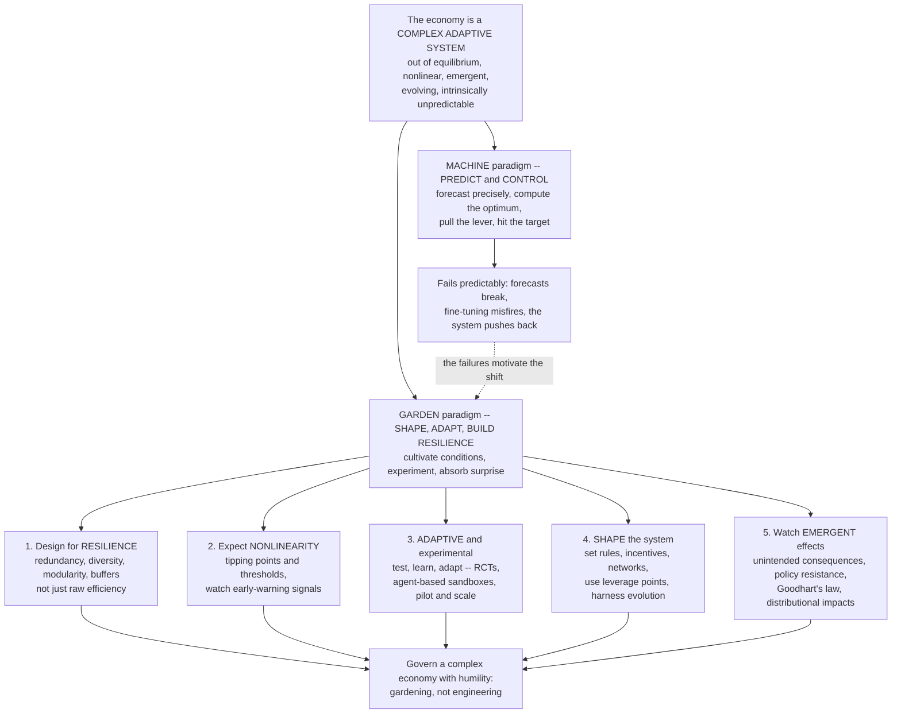

# 🌷 Complexity Economics and Public Policy

> [!abstract] TL;DR
> If the economy is a **complex adaptive system** — out-of-equilibrium, nonlinear, emergent, evolving, and *intrinsically unpredictable* ([[Economies_as_Complex_Adaptive_Systems]]) — then the traditional **"predict-and-control"** approach to policy (forecast precisely, compute the optimal setting, pull the lever, hit the target) is not just hard but *category-mistaken*. Complexity economics calls instead for a fundamentally different posture, captured in one slogan: **the economy is a garden, not a machine**. A gardener cannot command a plant to grow or forecast its exact height; they **shape conditions**, pull weeds, build in slack, experiment, and adapt to what actually happens. Translated into policy, this means five moves: (1) **design for resilience, not just efficiency** — accept redundancy, diversity, modularity, and buffers so the system survives shocks, even at some cost to peak output; (2) **expect nonlinearity and tipping points** — gradual policy can do little and then trigger a sudden shift, so watch thresholds and early-warning signals; (3) **proceed by adaptive experimentation** — "**test, learn, adapt**," randomized controlled trials, agent-based policy sandboxes, pilot-and-scale, and continuous monitoring, rather than one-shot optimization; (4) **shape the system's rules and selection environment** — set institutions, incentives, standards, and network structure and use **leverage points** (Meadows), *harnessing* evolution and self-organization rather than micromanaging outcomes; and (5) **anticipate unintended consequences, policy resistance, and distributional/emergent effects** — because agents adapt and *game* targets (Goodhart's law), naive interventions get absorbed, rerouted, or amplified. The intellectual lineage runs through **Beinhocker**, **Colander & Kupers** (*Complexity and the Art of Public Policy*), **Andy Haldane** at the Bank of England, and the **OECD's "New Approaches to Economic Challenges."** Applied to financial regulation, innovation and industrial policy, climate, inequality, and development, this humbler, resilience-focused, adaptive, systems-aware approach is complexity economics' distinctive and increasingly influential contribution to how we govern a complex economy. It is developed here on the foundations laid in *Complexity_Economics_Overview* and *Economies_as_Complex_Adaptive_Systems*.

---

## Intuition

**Analogy — the gardener and the engineer.** An engineer and a gardener approach problems in fundamentally different ways. The **engineer** designs a machine to precise specifications and expects exact outputs: input this, get that; if the output is wrong, there is a bug to find and a lever to adjust. The engineer's world is *knowable, controllable, and predictable* — it is *built*, and it does what it is told. The **gardener** works with something the engineer never faces: a **living system they can never fully control**. A gardener cannot order a tomato plant to grow, cannot forecast next August's harvest to the gram, and cannot debug a drought. What a gardener *can* do is **cultivate conditions** — enrich the soil, plant a diversity of species, leave room between rows, pull weeds, water in dry spells — and then **adapt to what actually grows**, accepting surprise as the normal state of affairs. The gardener shapes and tends; the plants do the growing.

For roughly a century, economic policymakers acted like **engineers**. They pictured the economy as a great machine that computes its own equilibrium, and they set about pulling levers — the interest rate, the tax rate, the money supply — to hit precise numerical targets, confident that a good enough model would let them forecast the machine's response and fine-tune it into optimal condition. **Complexity economics says this is the wrong picture entirely.** The economy is a **garden, not a machine** — an evolving, adaptive, emergent, nonlinear system whose long-run behaviour is *intrinsically unpredictable*, and which **pushes back** on interventions because it is made of agents who learn, adapt, and respond. So policy should be **less about control and prediction and more about shaping conditions, building resilience, experimenting, and adapting**. Not commanding outcomes, but **gardening** them: creating the conditions in which good things can emerge, and staying humble about everything you cannot foresee.

---

## How It Works

### The starting point: the limits of prediction and control

Everything in complexity policy flows from one epistemic fact. A complex economy is **intrinsically unpredictable** — not merely *hard* to forecast, but structurally resistant to it. **Nonlinearity** means small causes can have huge effects and vice versa. **Chaos** (sensitive dependence) means tiny errors in initial conditions blow up. **Emergence** means macro-outcomes are not deducible from the parts ([[Emergence_of_Macro_from_Micro]]). **Radical (Knightian) uncertainty** means the future contains events we cannot even enumerate, let alone assign probabilities. And **reflexivity** means our forecasts *feed back into* the very process being forecast, so the target moves as we aim (developed in *Non_Equilibrium_and_Out_of_Equilibrium_Dynamics*). The failure of "scientific," prediction-based policy is not an accident of insufficient data or computing power; the 2008 crisis-forecasting failure and the chronic fragility of point forecasts are what you should *expect* when you demand precise prediction from a reflexive, near-critical system.

The policy consequence is a demand for **epistemic humility**: policy must be **robust to being wrong about the future** rather than betting the outcome on a single forecast. This is the hinge of the whole approach — abandon the illusion of fine-tuning and instead ask, "What decision will hold up across the many futures I *cannot* rule out?"

### The five principles of complexity-informed policy

**1. Design for resilience, not just efficiency.** Mainstream economics optimizes for **efficiency**: squeeze out redundancy, eliminate slack, maximize output per unit of input. But a hyper-efficient, tightly-coupled, fully-optimized system is **fragile** — it has *no buffers*, so a shock that would be absorbed by a looser system instead **cascades**. Complexity policy prioritizes **resilience and robustness** ([[Resilience_and_Robustness]]): redundancy, diversity, modularity, buffers, and "firebreaks" that let the system survive shocks and **fail gracefully** — accepting some efficiency loss as the *price of stability*. The **efficiency-resilience trade-off** was seen vividly in the 2008 financial crisis (a hyper-optimized, densely-interconnected banking network with no capital buffers — see [[Financial_Networks_and_Systemic_Risk]]) and again in COVID-era supply chains (just-in-time efficiency that had engineered out every ounce of slack). "Resilience over optimization" is the banner principle.

**2. Expect nonlinearity, tipping points, and thresholds.** Complex systems respond **nonlinearly**: they have **tipping points** and **thresholds** ([[Bifurcations_and_Tipping_Points]], [[Self_Organized_Criticality_in_Economics]]) where gradual policy does almost nothing — until, suddenly, it triggers a large, discontinuous shift. Symmetrically, some *small* interventions have *large* effects (**leverage points** — Meadows), while some large ones barely register. Policy must watch for **critical thresholds** (climate tipping points, the fragility threshold of a financial network) and their **early-warning signals** (critical slowing down, rising variance and autocorrelation before a transition). The danger is twofold: assuming smooth, proportional responses when the system is nonlinear, and inadvertently **tipping** the system over an edge.

**3. Use adaptive, experimental policy.** Since you *cannot* compute the optimal policy in advance, you **adapt**. The method is **"test, learn, adapt"** (the motto of the UK's Behavioural Insights Team). Its toolkit: **randomized controlled trials** and policy experiments for evidence-based, iterative policymaking; **agent-based simulation** as a *policy sandbox* to war-game interventions before deploying them (*Agent_Based_Macroeconomics*); **pilot-and-scale**; and continuous **monitoring and adjustment** — **adaptive management**, an idea borrowed directly from ecosystem management in ecology. Policy becomes **ongoing experimentation and learning**, not a one-shot optimization. As the demo below shows, an adaptive policy that adjusts on feedback *outperforms* a fixed "optimal" policy the moment the world starts to change — which it always does. **Policy is navigation, not calculation.**

**4. Shape the system, don't micromanage outcomes.** Rather than dictating specific outcomes, complexity policy shapes the **selection environment and the rules** within which agents evolve. Set the *rules of the game* — institutions, incentives, standards, network structure (*Institutions_Cooperation_and_Norms*) — and then **harness evolution and self-organization**: create the conditions under which good outcomes can *emerge*, by fostering **variation** (experimentation, entry, diversity) and steering **selection** toward the desired direction ([[Evolutionary_Economics_and_Selection]]). Deploy **leverage points** ([[Leverage_Points_and_Mental_Models]]) — the places Donella Meadows identified where a small structural change shifts the whole system's behaviour (changing the *goal* or *paradigm* of a system beats tweaking a parameter). This is **"gardening" the economy**: cultivating rather than commanding, *enabling emergence* rather than *engineering outcomes*.

**5. Anticipate unintended consequences, policy resistance, and distributional/emergent effects.** Interventions in a complex adaptive system routinely produce **unintended consequences**, because agents *adapt*, feedback loops kick in, and the system **pushes back** — Jay Forrester called this **policy resistance**. **Goodhart's law** is the canonical trap: a measure that becomes a target ceases to be a good measure, because agents *game* it (the metric decouples from the goal it was meant to track). Add **whack-a-mole** dynamics (suppress a problem here, it pops up there) and pervasive side effects, and the pattern is clear: the system's adaptation **defeats naive interventions**. Good policy anticipates *how the system will respond* rather than assuming it holds still ([[Systems_Failure_and_Wicked_Problems]]). And because macro emerges from **heterogeneous** agents, every policy has **distributional effects** (winners and losers) and **emergent aggregate effects** that representative-agent analysis is blind to. Complexity policy treats *who* is affected and *how effects propagate through networks* as central questions — equity and distribution as first-class concerns, not afterthoughts ([[Wealth_and_Income_Inequality_Dynamics]]).

### From machine to garden — the paradigm shift



---

## Key Concepts

### Secondary

- **Garden, not machine.** You cannot *command* a plant to grow or predict its exact size, but you *can* prepare good soil, plant a mix of things, and adapt as the season unfolds. Complexity economics says the economy is like that: you shape the conditions, you do not control the outcome.
- **Prediction has limits.** The economy is so tangled and ever-changing that nobody can forecast it precisely for long — the 2008 crash blindsided almost everyone. So good policy is built to **survive being wrong**, not to bet everything on one guess.
- **Resilience beats pure efficiency.** A super-efficient system with no spare capacity works great — until a shock hits and it collapses (think of a supply chain with no backup suppliers). A slightly less efficient system with **backups and variety** survives the shock. Sometimes it is worth giving up a little performance for a lot of safety.
- **Things fight back.** When you set a rule, people **change their behaviour to get around it** (a school judged only by test scores starts teaching only the test). Smart policy expects the system to react and adapt, instead of assuming it will sit still.
- **Try, learn, adjust.** Because no one can compute the perfect policy up front, you **test small, see what happens, and adjust** — like a gardener watching which plants thrive and changing the plan next season.

### Undergraduate

- **The economy as a CAS implies a new policy philosophy.** Because the economy is out-of-equilibrium, emergent, nonlinear, and evolving ([[Economies_as_Complex_Adaptive_Systems]]), the neoclassical **predict-and-control / optimize-the-machine** approach is inadequate; policy must instead work *with* complexity — shaping, adapting, building resilience, embracing uncertainty.
- **Epistemic humility as the foundation.** Nonlinearity, chaos, emergence, radical uncertainty, and **reflexivity** make precise long-term forecasting and fine-tuning impossible. Policy should be **robust to forecast error**, not optimized to a point prediction.
- **The efficiency-resilience trade-off.** Optimizing for efficiency removes the redundancy, slack, and modularity that let a system absorb shocks. Resilience (redundancy, diversity, buffers, firebreaks) costs efficiency but prevents catastrophic collapse — the central design tension, dramatized by 2008 and COVID.
- **Nonlinearity and leverage points.** Systems have thresholds and tipping points; interventions can be sub-proportional or super-proportional. Meadows' **leverage points** rank *where* to intervene — deep structural changes (goals, rules, paradigms) beat parameter tweaks ([[Leverage_Points_and_Mental_Models]]).
- **Adaptive/experimental policymaking.** RCTs, "test-learn-adapt," agent-based policy sandboxes, pilot-and-scale, and **adaptive management** treat policy as *iterated learning* under uncertainty rather than one-shot optimization.
- **Shaping selection environments.** Set incentives, rules, standards, and network structure; foster variation and steer selection so desired outcomes **emerge** ([[Evolutionary_Economics_and_Selection]]) — cultivating, not commanding.
- **Policy resistance and Goodhart's law.** Agents adapt to interventions, so systems "push back" (Forrester). A target that becomes a policy loses its meaning as agents game it — anticipate the *response*, not just the *impact*.

### Graduate

- **Robust decision-making vs expected-utility optimization.** Under **deep/Knightian uncertainty**, the right criterion is not maximizing expected value against a known distribution but **robustness** — minimax-regret, info-gap, and "robust control" approaches (Hansen & Sargent) that seek policies performing acceptably across a *set* of plausible models rather than optimally against one. This formalizes "robust to being wrong."
- **Reflexivity and the Lucas-critique-on-steroids.** Rational-expectations modelling already warned that policy changes agents' behaviour; complexity deepens this into **non-stationarity** — a reflexive economy may lack a fixed data-generating distribution and a unique rational-expectations fixed point, so *any* estimated policy rule is calibrated to a world that its own deployment alters.
- **Resilience formalized.** Draw on Holling's **ecological resilience** (the size of shock a system absorbs before flipping to another basin of attraction) versus engineering resilience (return speed to *the* equilibrium). Network models quantify the resilience-efficiency frontier: dense, homogeneous, tightly-coupled topologies are efficient and **robust-yet-fragile** — resistant to small shocks but prone to catastrophic percolation past a threshold ([[Cascades_and_Systemic_Risk]], [[Financial_Networks_and_Systemic_Risk]]).
- **Early-warning signals and critical transitions.** Near a bifurcation, **critical slowing down** produces rising autocorrelation and variance (Scheffer et al.); these are candidate leading indicators for financial fragility and climate tipping, and a live research program for macroprudential dashboards ([[Bifurcations_and_Tipping_Points]]).
- **Agent-based policy design.** ABMs (e.g., the JRC's macro-ABMs, the Bank of England's agent-based housing and financial-stability models) serve as **in-silico policy laboratories** that expose emergent and distributional impacts invisible to representative-agent DSGE — capturing heterogeneity, network contagion, and out-of-equilibrium transients (*Agent_Based_Macroeconomics*).
- **Leverage points and the hierarchy of intervention.** Meadows' twelve leverage points form an ordinal theory of *where* structural intervention has the most effect (paradigms and system goals dominate feedback-gains, which dominate parameters), giving a systems-theoretic complement to standard cost-benefit calculus.
- **The operationalization critique and its answers.** The strongest objection is that "build resilience" and "adapt" are **vague** — hard to convert into a specific decision, unfalsifiably flexible, and lacking optimization's sharp prescriptions. The maturing responses: **resilience metrics** and stress-testing, **adaptive-management frameworks**, **leverage-point analysis**, and **agent-based counterfactuals** as concrete tools — a developing but real policy science.

---

## Python Demo

Two lessons of complexity policy, made concrete with `numpy` and `matplotlib`. **Part 1 — the efficiency-resilience trade-off.** Two system designs deliver the same service. The **optimized** design is hyper-efficient and tightly coupled with *zero* redundancy: superb output in calm times, but once a shock passes a low threshold, failure **cascades** and output **collapses** off a nonlinear cliff. The **resilient** design holds spare capacity as a buffer and is modular: it produces *less* in calm times (the efficiency cost of slack) but absorbs shocks module-by-module and **degrades gracefully**. We plot performance against shock size (the crossover) and expected performance in a *normal* regime versus a *crisis* regime — showing exactly why naive optimization is dangerous. **Part 2 — adaptive versus fixed policy.** The economy's "right" policy setting **drifts unpredictably** and suffers a structural break you cannot forecast. A **fixed** one-shot "optimal" setting, locked in for today's world, drifts ever further from correct; an **adaptive** policy that only observes the error and nudges toward it (a simple feedback controller — "test, learn, adapt," *no forecast required*) tracks the moving target and wins.

```python
# Complexity economics and public policy:
#   (1) the EFFICIENCY-RESILIENCE trade-off, and
#   (2) ADAPTIVE policy beating a fixed 'optimal' policy under change.
# numpy + matplotlib only.
import numpy as np
import matplotlib
matplotlib.use("Agg")
import matplotlib.pyplot as plt

rng = np.random.default_rng(42)

# =====================================================================
# PART 1 -- THE EFFICIENCY vs RESILIENCE TRADE-OFF
#   OPTIMIZED : hyper-efficient, tightly coupled, no redundancy.
#               High output when calm, but past a LOW shock threshold
#               failure CASCADES and output COLLAPSES (nonlinear cliff).
#   RESILIENT : redundant + modular, holds a capacity buffer.
#               Lower calm-time output (efficiency cost of slack) but
#               shocks are absorbed module-by-module -> GRACEFUL decay.
# =====================================================================
opt_thresh = 0.25                        # optimized system's fragility edge

def perf_optimized(s):
    # flat-high, then a sharp sigmoid COLLAPSE just past the threshold
    return 1.00 / (1.0 + np.exp(35.0 * (s - opt_thresh)))

def perf_resilient(s):
    # starts lower (buffer costs efficiency), degrades ~linearly to a floor
    return np.clip(0.75 - 0.55 * s, 0.18, None)

shock = np.linspace(0.0, 1.0, 400)       # shock magnitude: 0 calm ... 1 extreme
opt_curve = perf_optimized(shock)
res_curve = perf_resilient(shock)
crossover = shock[np.argmin(np.abs(opt_curve - res_curve))]

# expected performance in two regimes (Monte Carlo over shock draws)
normal_shocks = rng.uniform(0.00, 0.15, 20000)   # calm times: small shocks
crisis_shocks = rng.uniform(0.40, 0.90, 20000)   # crisis: large shocks
means = {
    "optimized": [perf_optimized(normal_shocks).mean(),
                  perf_optimized(crisis_shocks).mean()],
    "resilient": [perf_resilient(normal_shocks).mean(),
                  perf_resilient(crisis_shocks).mean()],
}

# =====================================================================
# PART 2 -- ADAPTIVE vs FIXED 'OPTIMAL' POLICY UNDER A MOVING TARGET
#   The unforecastable 'right' policy setting drifts + suffers a break.
#   FIXED    : lock in today's one-shot optimum -> grows wrong over time.
#   ADAPTIVE : observe last period's error, nudge toward it (feedback);
#              'test, learn, adapt' with NO forecast.
# =====================================================================
T = 200
target = np.cumsum(rng.normal(0.0, 0.05, T)) + 0.8 * np.sin(np.linspace(0, 3*np.pi, T))
target[100:] += 1.5                      # a structural regime shift at t=100

fixed = np.full(T, target[0])            # 'optimal' for the initial world, locked
adaptive = np.zeros(T); adaptive[0] = target[0]
gain = 0.30                              # feedback gain
for t in range(1, T):
    observed = target[t-1] + rng.normal(0.0, 0.10)     # noisy feedback signal
    adaptive[t] = adaptive[t-1] + gain * (observed - adaptive[t-1])

loss_fixed = np.cumsum((fixed - target) ** 2)
loss_adapt = np.cumsum((adaptive - target) ** 2)

# ------------------------------- FIGURE --------------------------------
fig, (ax1, ax2, ax3) = plt.subplots(1, 3, figsize=(17, 5.2))
fig.suptitle("Complexity policy: resilience vs efficiency, and adapting vs "
             "a fixed 'optimal' plan", fontsize=13, fontweight="bold")

# Panel 1: response curves + crossover
ax1.plot(shock, opt_curve, color="#dc2626", lw=2.2, label="optimized (efficient, fragile)")
ax1.plot(shock, res_curve, color="#2563eb", lw=2.2, label="resilient (redundant, robust)")
ax1.axvline(crossover, color="gray", ls=":", lw=1.5)
ax1.text(crossover + 0.02, 0.9, "crossover", color="gray", rotation=90, va="top", fontsize=9)
ax1.fill_between(shock, opt_curve, res_curve, where=(res_curve > opt_curve),
                 color="#2563eb", alpha=0.12)
ax1.set_title("Performance vs shock size\nefficient wins when calm, resilient wins under stress",
              fontsize=10)
ax1.set_xlabel("shock magnitude"); ax1.set_ylabel("system performance")
ax1.legend(fontsize=8, loc="upper right"); ax1.grid(alpha=0.25)

# Panel 2: expected performance, normal vs crisis regime
x = np.arange(2); w = 0.35
ax2.bar(x - w/2, means["optimized"], w, color="#dc2626", label="optimized")
ax2.bar(x + w/2, means["resilient"], w, color="#2563eb", label="resilient")
ax2.set_xticks(x); ax2.set_xticklabels(["normal times", "crisis / shock"])
ax2.set_title("Expected performance by regime\noptimized collapses in crisis; resilient endures",
              fontsize=10)
ax2.set_ylabel("expected performance"); ax2.set_ylim(0, 1.05)
ax2.legend(fontsize=8); ax2.grid(alpha=0.25, axis="y")
for xi, o, r in zip(x, means["optimized"], means["resilient"]):
    ax2.text(xi - w/2, o + 0.02, f"{o:.2f}", ha="center", fontsize=8)
    ax2.text(xi + w/2, r + 0.02, f"{r:.2f}", ha="center", fontsize=8)

# Panel 3: adaptive vs fixed policy tracking a drifting, shifting target
tt = np.arange(T)
ax3.plot(tt, target,   color="#1a1a2e", lw=2.4, label="true 'optimal' setting (unforecastable)")
ax3.plot(tt, fixed,    color="#dc2626", lw=1.8, ls="--", label="fixed one-shot optimum")
ax3.plot(tt, adaptive, color="#059669", lw=1.8, label="adaptive: test-learn-adapt")
ax3.axvline(100, color="gray", ls=":", lw=1.3)
ax3.text(102, ax3.get_ylim()[0], "regime shift", color="gray", rotation=90, va="bottom", fontsize=8)
ax3.set_title("Adaptive vs fixed policy under change\nfeedback tracks the moving target; fixed drifts away",
              fontsize=10)
ax3.set_xlabel("time"); ax3.set_ylabel("policy setting")
ax3.legend(fontsize=8, loc="upper left"); ax3.grid(alpha=0.25)

plt.tight_layout(rect=[0, 0, 1, 0.92])
plt.savefig("complexity_economics_public_policy.png", dpi=110, bbox_inches="tight")
plt.show()

# ------------------------------- REPORT --------------------------------
print("=" * 66)
print("PART 1  EFFICIENCY-RESILIENCE TRADE-OFF (expected performance)")
print("=" * 66)
print(f"  normal times :  optimized {means['optimized'][0]:.2f}   "
      f"resilient {means['resilient'][0]:.2f}   -> optimized wins")
print(f"  crisis/shock :  optimized {means['optimized'][1]:.2f}   "
      f"resilient {means['resilient'][1]:.2f}   -> resilient wins big")
print(f"  crossover shock magnitude ~ {crossover:.2f}")
print("=" * 66)
print("PART 2  ADAPTIVE vs FIXED POLICY (cumulative squared error)")
print("=" * 66)
print(f"  fixed one-shot optimum : {loss_fixed[-1]:8.1f}")
print(f"  adaptive test-learn    : {loss_adapt[-1]:8.1f}")
print(f"  adaptive cuts total loss by {100*(1-loss_adapt[-1]/loss_fixed[-1]):.0f} percent")
```

**What the demo shows.**

- **Panel 1 (performance vs shock).** The **optimized** system (red) is *strictly better* while shocks are small — that is exactly why naive optimization is so tempting. But it sits on a **cliff**: past a shock of about 0.25 it collapses toward zero as failure cascades through a system with no buffers. The **resilient** system (blue) gives up some peak performance for a **graceful, near-linear** decline that survives even extreme shocks. The shaded region past the **crossover** is the entire argument: beyond it, the "worse" design is decisively better.
- **Panel 2 (regime-dependent expected performance).** In **normal times** the optimized design's expected performance is near 1.0 versus roughly 0.67 for the resilient one — optimization looks like free lunch. In a **crisis regime** the picture *inverts*: the optimized design's expected performance collapses to near zero while the resilient design holds around 0.4. A policymaker who optimized purely for the good times has engineered a **catastrophe waiting for a shock** — the exact pathology of 2008 finance and COVID supply chains.
- **Panel 3 (adaptive vs fixed policy).** The black line is the **unforecastable** "right" policy setting: it drifts and then suffers a **structural break** at t = 100. The **fixed** one-shot optimum (red dashed), calibrated to the initial world and locked in, is soon badly wrong and diverges completely after the shift. The **adaptive** policy (green) never forecasts anything — it just **observes the error and nudges** — yet it *tracks the moving target throughout*, including across the regime shift, and the printout shows it slashes cumulative loss by a large margin.

The combined takeaway: **optimizing hard for a predictable world is a trap when the world is neither predictable nor still.** Complexity-aware policy trades a little peak efficiency for resilience, and replaces one-shot optimization with continuous, feedback-driven adaptation — and both choices *pay off precisely when it matters*.

---

## Real-World Applications

> **Example — macroprudential financial regulation after 2008.** The clearest institutional adoption of complexity policy. Andrew Haldane's Bank of England work ("Rethinking the Financial Network," "The dog and the frisbee") reframed the financial system as a **complex adaptive network** that is **"robust-yet-fragile"**: dense interconnection diversifies small shocks but transmits large ones, so the system is *efficient in calm times and catastrophically fragile past a threshold* ([[Financial_Networks_and_Systemic_Risk]], [[Cascades_and_Systemic_Risk]]). The regulatory response was explicitly resilience-oriented — **countercyclical capital buffers**, system-wide **stress tests** against tail scenarios rather than point forecasts, **too-big-to-fail** and interconnectedness surcharges, and simpler, more robust rules over finely-tuned risk models (the "frisbee" argument that simple heuristics beat over-fitted optimization under uncertainty). This is complexity policy operationalized: buffers, firebreaks, and robustness in place of efficiency-maximizing leverage.

- **Innovation and industrial policy.** If growth is an **evolutionary** search over an expanding space of capabilities ([[Evolutionary_Economics_and_Selection]]), policy should *foster the evolutionary process* — maximize variation (fund diverse experiments, tolerate failure), enable selection, and steer direction. **Smart specialization**, **mission-oriented policy** (Mazzucato), and the **economic complexity / product space** approach to development (*Economic_Complexity_and_the_Product_Space*) all reject picking-the-optimum for cultivating an adaptive discovery process — gardening capabilities rather than commanding outcomes.
- **Climate and sustainability policy.** Dominated by **tipping points**, nonlinear transitions, and the need for resilience against shocks already locked in. Policy attends to **planetary-boundary thresholds** ([[Sustainability_and_Planetary_Boundaries]]), early-warning signals, adaptive management of transitions, and building societal resilience — not fine-tuned optimal emission paths that assume a controllable, predictable climate-economy system.
- **Inequality as a dynamic, emergent outcome.** Because distribution *emerges* from heterogeneous interacting agents and compounding feedbacks ([[Wealth_and_Income_Inequality_Dynamics]]), complexity policy treats inequality as a system-level, path-dependent property to be shaped through rules and network structure — attending to *who wins and loses* and *how effects propagate*, rather than as a residual of an aggregate optimum.
- **Development economics.** The **capabilities-and-institutions** view (*Institutions_Cooperation_and_Norms*, [[Development_Economics]]) sees development as an evolving, path-dependent accumulation of productive capabilities and institutional quality — favouring adaptive, experimental, context-specific policy (and RCT-based learning) over one-size-fits-all optimization imported from a textbook equilibrium.
- **Public health and epidemics.** Disease spread is **complex contagion** on a network; interventions face policy resistance (behavioural adaptation, risk compensation) and nonlinear thresholds (herd-immunity, superspreading). Adaptive, monitored, network-aware policy — the same toolkit — governs it far better than a static optimal plan.
- **Behavioural "test-learn-adapt" nudge units.** The UK's Behavioural Insights Team institutionalized **adaptive, RCT-driven** policymaking — the operational face of "experiment, monitor, adjust," and the direct cousin of complexity policy's adaptive-management principle ([[Behavioral_Public_Policy_and_Libertarian_Paternalism]], [[Nudges_and_Choice_Architecture]]).

---

## Common Pitfalls

- **Optimizing for the good times (the fragility trap).** Squeezing out every buffer to maximize normal-time efficiency engineers a system that collapses under the first serious shock — the demo's red cliff, 2008's leverage, COVID's just-in-time chains. Efficiency without resilience is a **catastrophe on a timer**. Always ask what the design does *under stress*, not just on average.
- **Demanding point forecasts and fine-tuning.** Treating the economy as a predictable machine and betting policy on a single forecast ignores nonlinearity, reflexivity, and radical uncertainty. The tractable objects are **distributions, tail risks, and robustness across scenarios**, not "what GDP will be next Tuesday." Robust-to-being-wrong beats optimal-if-right.
- **Ignoring policy resistance and Goodhart's law.** Assuming the system "holds still" while you intervene is the master error. Agents adapt and **game** any target (teach-to-the-test, regulatory arbitrage, emissions displaced offshore). If you have not asked "how will the system *respond* and route around this?", you have not designed the policy yet.
- **Assuming smooth, proportional responses.** Expecting gradual policy to yield gradual effects blinds you to **thresholds and tipping points** — where you get nothing, then everything, then a system flipped into a new basin. Watch for early-warning signals; respect leverage points; do not assume linearity.
- **Micromanaging outcomes instead of shaping the system.** Trying to dictate specific results in a self-organizing system invites unintended consequences. **Shape the rules, incentives, and selection environment** and let good outcomes emerge — intervene at high-leverage structural points (goals, paradigms, feedback structure), not by hand-setting every variable.
- **Using complexity as an excuse for vagueness or inaction.** The honest critique: "build resilience" and "adapt" can degenerate into unfalsifiable hand-waving that licenses anything or nothing. The discipline is to *operationalize* — concrete **resilience metrics**, **stress tests**, **RCTs**, **agent-based counterfactuals**, and **leverage-point analysis**. Complexity is a reason for *better-designed* action, not an alibi for none.
- **Forgetting distribution and emergence.** Representative-agent, aggregate-only analysis hides *who* wins and loses and the **emergent** network effects of a policy. A reform that is optimal in aggregate can be ruinous for a region or a group and can propagate in ways the average conceals — model the heterogeneity and the network, not just the mean.

---

## Related Concepts

**Within this vault (Complexity Economics):**

- [[Complexity_Economics_Overview]] — the parent programme; complexity policy is the applied, governance-facing payoff of the whole framework.
- [[Economies_as_Complex_Adaptive_Systems]] — the foundational premise: *because* the economy is a CAS, predict-and-control fails and gardening is required.
- [[Non_Equilibrium_and_Out_of_Equilibrium_Dynamics]] — the source of intrinsic unpredictability and reflexivity that mandates epistemic humility in policy.
- [[Financial_Networks_and_Systemic_Risk]] — the "robust-yet-fragile" network whose regulation is the flagship case of resilience-over-efficiency policy.
- [[Cascades_and_Systemic_Risk]] — the cascade mechanism that turns a hyper-optimized, tightly-coupled system into a fragile one.
- [[Self_Organized_Criticality_in_Economics]] — why systems poise near thresholds where policy must anticipate sudden, nonlinear shifts.
- [[Emergence_of_Macro_from_Micro]] — why aggregate policy effects are emergent and often surprising, and why distribution matters.
- [[Evolutionary_Economics_and_Selection]] — the variation-selection-retention process that "shape the system" policy seeks to harness rather than override.
- [[Wealth_and_Income_Inequality_Dynamics]] — distribution as a dynamic, emergent policy concern, not an afterthought.
- [[Trade_and_Supply_Chain_Networks]] — the just-in-time efficiency-resilience trade-off dramatized by COVID-era supply shocks.

**Systems Thinking & Complexity vault (the general science behind the principles):**

- [[Resilience_and_Robustness]] — the core design principle: absorbing shocks and failing gracefully versus optimizing for peak performance.
- [[Leverage_Points_and_Mental_Models]] — Meadows' theory of *where* to intervene in a system for maximum effect; the backbone of "shape, don't micromanage."
- [[Bifurcations_and_Tipping_Points]] — the nonlinear thresholds and early-warning signals that policy must anticipate.
- [[Complex_Adaptive_Systems]] — the umbrella framework whose governance implications this note draws out.
- [[Adaptation_and_Learning_in_Systems]] — the general adaptive-learning dynamics that "test, learn, adapt" policymaking exploits.
- [[Feedback_Loops_and_Causality]] — the feedback machinery behind policy resistance, Goodhart's law, and unintended consequences.
- [[Stocks_Flows_and_System_Dynamics]] — Forrester's system dynamics, the origin of "policy resistance" and counterintuitive system behaviour.
- [[Systems_Failure_and_Wicked_Problems]] — why complex policy problems resist optimal solutions and demand adaptive, humble approaches.
- [[Economic_and_Social_Complexity]] — the Systems Thinking vault's economics application; this note is its policy-facing companion.
- [[Sustainability_and_Planetary_Boundaries]] — planetary thresholds as the paradigm case of tipping-point-aware, resilience-focused policy.

**Behavioural Economics, Political Science, and standard policy benchmarks:**

- [[Behavioral_Public_Policy_and_Libertarian_Paternalism]] — the "test-learn-adapt," RCT-driven nudge tradition, the operational cousin of adaptive complexity policy.
- [[Nudges_and_Choice_Architecture]] — shaping the *choice environment* rather than commanding behaviour — a micro instance of "shape the system."
- [[Policy_Analysis_and_the_Policy_Process]] — the political-science account of how policy is actually made, iterated, and contested.
- [[Regulatory_Politics_and_Administrative_Law]] — the institutional machinery through which resilience rules and adaptive regulation are enacted.
- [[Political_Economy_and_Market_State_Relations]] — the market-state boundary that complexity policy reconfigures around shaping and resilience.
- [[Market_Failures]] — the neoclassical rationale for intervention that complexity policy extends beyond static efficiency to dynamics and resilience.
- [[Externalities_and_Pigouvian_Tax]] — the classic "pull-the-lever" optimal-tax instrument, useful but insufficient in a nonlinear, adaptive system.
- [[Monetary_Policy_Tools]] — the archetypal predict-and-control levers that complexity policy urges be wielded with far more humility.
- [[Government_Spending_Multiplier]] — a fiscal lever whose effect is state- and network-dependent, illustrating nonlinearity in aggregate policy.
- [[Global_Financial_Crises]] — the recurring shocks that motivated resilience-based, macroprudential rethinking of policy.
- [[Development_Economics]] — the capabilities-and-institutions development view that favours adaptive, experimental, context-specific policy.

**Forthcoming siblings in this vault (planned, referenced in prose above):** *Complexity_and_Financial_Regulation* (the macroprudential deep-dive), *Agent_Based_Macroeconomics* (the policy-sandbox method), *Institutions_Cooperation_and_Norms* (shaping the rules of the game), and *Economic_Complexity_and_the_Product_Space* (development as capability accumulation).

---

## Review Questions

### Secondary

1. Explain the difference between an **engineer** and a **gardener** in your own words, and say which one complexity economics thinks a policymaker should be more like — and why.
2. A company runs its supply chain with *no* backup suppliers because that is cheapest. Using the idea of the **efficiency-resilience trade-off**, explain what advantage this gives in normal times and what disaster it risks when a shock hits.
3. A school is judged only by its students' test scores, so teachers start teaching *only* what is on the test. What is this an example of, and what does it show about how systems "push back" against simple targets?

### Undergraduate

1. State the **five principles** of complexity-informed policy (resilience, nonlinearity/tipping points, adaptive experimentation, shaping the system, watching emergent/distributional effects) and give one concrete policy example of each.
2. Explain **why intrinsic unpredictability** (nonlinearity, chaos, emergence, radical uncertainty, reflexivity) implies that policy should be *robust to being wrong* rather than *optimized to a forecast*. What does "robust" mean operationally here?
3. Using **Goodhart's law** and Forrester's **policy resistance**, explain why a naive intervention that assumes the system "holds still" tends to backfire. Illustrate with a target that agents predictably game.

### Graduate

1. Contrast **expected-utility optimization** with **robust decision-making** (minimax-regret / info-gap / robust control) as criteria for policy under Knightian uncertainty. In what precise sense does complexity economics favour the latter, and what does it give up?
2. Formalize the **efficiency-resilience trade-off** on a network: explain the "robust-yet-fragile" property, why dense homogeneous coupling is efficient but prone to catastrophic percolation, and how **critical-slowing-down** early-warning signals might inform a macroprudential regulator ([[Cascades_and_Systemic_Risk]]).
3. The strongest critique of complexity policy is that principles like "build resilience" and "adapt" are **vague, unfalsifiable, and hard to operationalize**. Reconstruct this critique fairly, then defend complexity policy by specifying the concrete tools (resilience metrics, stress tests, RCTs, agent-based counterfactuals, leverage-point analysis) that turn the wisdom into decisions — and state honestly where the approach is still underdeveloped.

---

## Sources

- [Colander, D. & Kupers, R. (2014). *Complexity and the Art of Public Policy: Solving Society's Problems from the Bottom Up*. Princeton University Press](https://press.princeton.edu/books/hardcover/9780691152097/complexity-and-the-art-of-public-policy)
- [Haldane, A. G. & May, R. M. (2011). "Systemic risk in banking ecosystems." *Nature*, 469, 351–355](https://doi.org/10.1038/nature09659)
- [Haldane, A. G. & Madouros, V. (2012). "The dog and the frisbee." Bank of England / Federal Reserve Bank of Kansas City, Jackson Hole](https://www.bankofengland.co.uk/-/media/boe/files/paper/2012/the-dog-and-the-frisbee)
- [Beinhocker, E. D. (2006). *The Origin of Wealth: Evolution, Complexity, and the Radical Remaking of Economics*. Harvard Business School Press](https://www.hbs.edu/faculty/Pages/item.aspx?num=22090)
- [Meadows, D. H. (1999). "Leverage Points: Places to Intervene in a System." The Sustainability Institute](http://donellameadows.org/archives/leverage-points-places-to-intervene-in-a-system/)
- [OECD (2020). *New Approaches to Economic Challenges (NAEC): Systemic Thinking for Policy Making*. OECD Publishing](https://www.oecd.org/naec/)
- [Scheffer, M. et al. (2009). "Early-warning signals for critical transitions." *Nature*, 461, 53–59](https://doi.org/10.1038/nature08227)

---

#complexity-economics #public-policy #resilience #adaptive-policy #systems-policy
