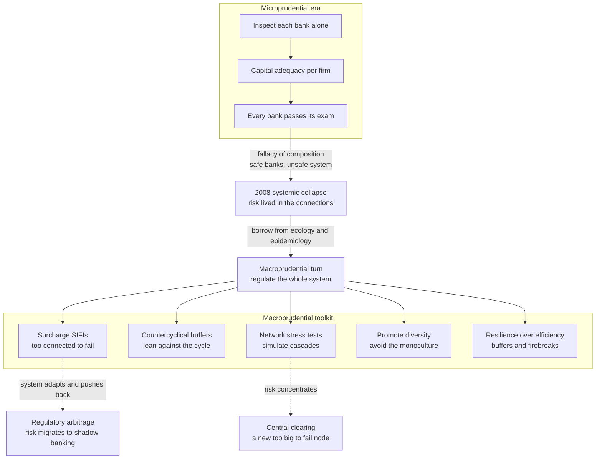

# 🏛️ Complexity and Financial Regulation

> [!abstract] TL;DR
> The 2008 crisis exposed a fatal blind spot: regulators had made each bank individually safe (**microprudential** supervision — capital adequacy per firm) yet missed the **emergent systemic risk** living in the *connections* between banks. A system of individually-sound institutions can still be systemically fragile — the **fallacy of composition**, "safe banks, unsafe system." Complexity economics and network science drove a shift to **macroprudential** regulation: surcharging **systemically-important and highly-interconnected** institutions (*too-connected-to-fail*), **countercyclical capital buffers** that lean against the endogenous leverage cycle, **network-based stress testing** that simulates cascades, and — borrowing explicitly from **ecology** and **epidemiology** — promoting **diversity over homogeneity** ("the diversification of diversity," because a monoculture of identical strategies is fragile) and **resilience over pure efficiency** (buffers, modularity, firebreaks). Because the financial system is a **complex adaptive system that pushes back** (regulatory arbitrage to shadow banking, risk concentrating in central clearinghouses, Goodhart's law), regulation is an evolving cat-and-mouse game now extending to crypto/DeFi, climate risk, and non-bank finance — a flagship, high-stakes application of complex-systems science to keeping the economy stable.

---

## Intuition

**Analogy — the health inspector who checks every restaurant but never traces the outbreak.** Before 2008, financial regulators were like health inspectors touring restaurants one at a time, checking each kitchen for cleanliness. If every restaurant passed its individual inspection, the whole district was pronounced safe. But the danger was never in any single kitchen. It lived in the **invisible web connecting them** — shared suppliers, shared water, shared foot-traffic — where one contaminated source could poison the whole neighborhood at once. Inspecting each kitchen more thoroughly can never reveal a risk that is a property of the *network*, not the kitchens.

Andrew **Haldane**, then chief economist at the Bank of England, drew the crucial lesson not from finance but from **ecologists and epidemiologists**: to keep a complex, interconnected system healthy you cannot merely inspect the parts — you must manage the **whole**, its connections, its diversity, and its contagion pathways. A forest survives shocks because it is *diverse* and *modular*; an epidemic is contained not by treating each patient in isolation but by mapping who infects whom and cutting the transmission chains. Financial regulation, after 2008, had to become the **science of managing a complex adaptive system** — recognizing that systemic risk is **emergent** and lives in the links (see [[Financial_Networks_and_Systemic_Risk]] and [[Cascades_Contagion_and_Financial_Crises]]).

---

## How It Works

### Core Mechanics

1. **Why microprudential regulation failed (the 2008 lesson).** Pre-crisis rules — Basel I and II — focused on making each institution individually sound: hold enough **capital** against your *own* assets, keep *your* Value-at-Risk low. But this is a **fallacy of composition**. A behavior that lowers one bank's risk (diversifying into the "optimal" portfolio, funding cheaply in short-term markets, hedging with a common counterparty) can *raise* the risk of the system when *every* bank does it. Systemic risk is an **emergent** property of interconnections, correlated exposures, and leverage cycles — invisible to any bank-by-bank exam. The system was a sum that was far more dangerous than its parts. This is the intellectual case, made by Haldane, **Battiston**, Doyne **Farmer**, Robert **May**, and others (Battiston et al., *Complexity theory and financial regulation*, **Science 2016**), for treating finance as a complex system.

2. **The macroprudential turn.** The new paradigm regulates for **system-level stability**, not just firm-level solvency. Its pillars: (a) **identify and surcharge systemically-important financial institutions (SIFIs / G-SIBs)** — scored on size *and* **interconnectedness / centrality**, so a modest but hyper-connected node (an AIG-style derivatives book) is *too-connected-to-fail*, not merely too-big-to-fail; (b) **countercyclical capital buffers** — build capital in booms to *lean against* the credit/leverage cycle and provide a cushion for busts, directly addressing **Minsky's** endogenous financial fragility (the theme of the sibling *Business_Cycles_and_Endogenous_Fluctuations*); (c) **limits on leverage and interconnectedness**; and (d) continuous **monitoring of the financial network**. Basel III and the post-2008 Financial Stability Board reforms embody these principles.

3. **Managing the network.** The network itself becomes a **regulatory object**. Supervisors now **map** interbank exposures, derivative graphs, and common holdings; identify **critical/central nodes and contagion channels** using centrality-style measures like **DebtRank**; run **network-based stress tests** that simulate cascades rather than test each firm against a static scenario; and deploy tools to reduce dangerous interconnectedness or add **firebreaks / modularity** so a local failure cannot reach the whole graph. This is regulating *structure*, not just balance sheets.

4. **Diversity vs homogeneity — "the diversification of diversity."** A deep complexity insight from **Haldane and May** (*Systemic risk in banking ecosystems*, **Nature 2011**) and Beale et al.: when every bank *individually* diversifies into the *same* assets and strategies (each prudent on its own), the **system** becomes **homogeneous** — a **monoculture**. In a crisis everyone tries to sell the *same* assets at once — **correlated fire sales** — and the shared exposure that looked like safety becomes the transmission mechanism. Ecology teaches that **diversity confers stability**; regulation should therefore *promote* diversity of institutions, business models, and strategies rather than push everyone toward one "optimal" model (as identical Basel risk-weights and shared risk models tend to do). Heterogeneity is a **systemic stabilizer**.

5. **Resilience over efficiency.** A system optimized for **efficiency** — minimal capital, maximal leverage and interconnection, just-in-time liquidity — is **fragile**: it has no slack to absorb a shock. Complexity regulation deliberately trades some efficiency for **resilience** — higher capital and liquidity **buffers**, **redundancy**, **modularity/firebreaks** to contain contagion, and robustness to shocks (see [[Resilience_and_Robustness]]). You accept lower returns in normal times to buy a system that **fails safely**. This is the efficiency-resilience trade-off, and complexity science comes down firmly on the resilience side.

6. **Ecology and epidemiology as models.** Regulators borrow explicitly. From **ecology**: ecosystem stability, diversity, modularity, and the *robust-yet-fragile* property of highly-connected systems. From **epidemiology**: **contagion**, **super-spreaders** (central nodes), **herd immunity** (system-wide buffers), and **quarantine/firebreaks** — modeling financial contagion the way one models disease spread on a contact network (the machinery of [[Network_Dynamics_and_Contagion]]).

7. **Unintended consequences — the adaptive system pushes back.** Finance is a **complex adaptive system** that responds to regulation, so every rule invites a counter-move. **Regulatory arbitrage** drives risk into the **shadow banking** sector where it is less regulated. **Central clearing (CCPs)** reduces bilateral counterparty risk but **concentrates** it into a single clearinghouse — a *new* too-big-to-fail node. Homogenizing risk models can **synchronize** behavior. And **Goodhart's law** bites: any risk measure that becomes a regulatory target degrades as a measure once firms optimize against it. Regulation is a perpetual, evolving game.

### Flow / Architecture



---

## Key Concepts

### Secondary (intuition level)
- **Safe banks, unsafe system.** You can pass every bank on its own exam and still have a system that collapses — because the danger is in the wiring between banks, which no single-bank checkup can see.
- **Regulate the whole, not just the parts.** Like an epidemiologist tracing an outbreak or an ecologist protecting a forest's diversity, a financial regulator must manage the connections, the contagion paths, and the mix of players — not only each institution.
- **Build the umbrella when the sun shines.** Countercyclical buffers make banks store up extra capital during booms so they have a cushion when the bust arrives — leaning against the credit cycle instead of amplifying it.
- **Beware the monoculture.** If every bank chases the same "safe" strategy, they all hold the same assets, and in a panic they all try to sell at once. Sameness is fragile; diversity is stability.
- **Trade a little efficiency for a lot of safety.** A lean, maximally-efficient system has no slack; a resilient one keeps buffers and firebreaks so one failure cannot burn down the whole thing.

### Undergraduate (mechanism level)
- **Microprudential vs macroprudential.** The former ensures each *firm's* solvency (capital adequacy, VaR limits); the latter ensures the *system's* stability by regulating interconnections, correlated exposures, leverage cycles, and the network as a whole.
- **SIFI / G-SIB surcharges.** Extra capital required of systemically-important banks, scored on **interconnectedness and centrality** as well as size — the operational form of *too-connected-to-fail*.
- **Countercyclical capital buffer (CCyB).** A Basel III tool: raise required capital when credit growth runs hot, release it in downturns — damping the endogenous leverage cycle (Minsky).
- **Network stress testing.** Instead of shocking each firm against a fixed scenario, simulate a **cascade** through the exposure network to find where failures propagate — using DebtRank, SRISK, and CoVaR to rank systemic contributors.
- **The diversification of diversity.** Individually-optimal diversification makes portfolios *homogeneous* across banks; regulation must instead preserve **diversity across** institutions (Haldane-May, ecological analogy).
- **Regulatory arbitrage & shadow banking.** Activity migrates to where rules are lightest; tightening regulated banks can *push* risk into non-bank/shadow intermediaries rather than eliminate it.

### Graduate (nuance and frontier)
- **The fallacy of composition, formalized.** Individually risk-minimizing choices (diversify identically, fund short, hedge via a common CCP) are strategic complements that **synchronize** balance sheets and raise the *systemic* variance even as each firm's *idiosyncratic* variance falls — the micro-macro gap of *Emergence_of_Macro_from_Micro* applied to risk.
- **Robust-yet-fragile and criticality.** Dense connectivity suppresses small-shock contagion (risk-sharing) but triggers a **discontinuous phase transition** to system-wide collapse past a threshold (Gai-Kapadia; Acemoglu-Ozdaglar-Tahbaz-Salehi). Regulation aims to keep the system *away from the critical point* — connecting to self-organized criticality in markets (the sibling *Self_Organized_Criticality_in_Economics*).
- **DebtRank and systemic centrality.** Battiston et al.'s recursive, centrality-like impact measure targets capital surcharges at the *network* location of risk, not just balance-sheet size — the analytic core of network-aware regulation.
- **The CCP concentration trade-off.** Mandating central clearing nets bilateral exposures and mutualizes losses (a firebreak) but transforms a diffuse counterparty network into a **star** centered on the clearinghouse, whose default waterfall and margin procyclicality become the new apex systemic risk.
- **Goodhart's law and model monoculture.** When a risk metric (VaR, a Basel risk-weight) becomes the binding constraint, firms optimize against it and its informativeness decays; shared models further **homogenize** behavior, synchronizing fire sales — a regulatory-induced correlation that the *Complexity_Economics_and_Public_Policy* program studies as policy resistance.
- **Endogenous leverage cycles.** Countercyclical tools target the Minsky-Geanakoplos mechanism whereby rising collateral values relax constraints, expanding leverage until a small shock reverses the cycle — the macro-financial engine explored in the sibling *Business_Cycles_and_Endogenous_Fluctuations* and modeled in *Agent_Based_Macroeconomics*.

---

## Python Demo

This demo shows a **regulator shifting the financial system from a fragile to a resilient regime**, then illustrates an **unintended consequence**. Panel **(A)** runs a default-cascade on a random interbank network and sweeps the **capital-buffer ratio** (the core macroprudential lever): cascade size collapses **sharply past a threshold** — below it a hub failure topples the system, above it the same shock stays contained (fragile → resilient). Panel **(B)** demonstrates **"the diversification of diversity"**: as banks' portfolios move from **diverse** to **homogeneous** (everyone holding the same assets), a single price shock triggers ever-larger **correlated fire-sale** losses — homogeneity amplifies systemic risk even though each bank looks individually diversified. Panel **(C)** shows an **unintended consequence / trade-off**: as the capital requirement on *regulated* banks rises, risk **migrates to the shadow sector** (regulatory arbitrage / Goodhart's law), so the **measured** (regulated-only) systemic risk falls fast while the **true** total risk barely improves — the gap is the risk the rules pushed out of sight. Uses only `numpy` and `matplotlib`.

```python
# Complexity-based financial regulation: a regulatory lever on systemic risk,
# plus an unintended consequence.
#   (A) capital buffer vs default-cascade size  -> fragile-to-resilient threshold
#   (B) portfolio homogeneity vs fire-sale loss  -> "diversification of diversity"
#   (C) capital requirement vs measured-vs-true risk -> shadow-banking arbitrage
import numpy as np
import matplotlib.pyplot as plt

rng = np.random.default_rng(42)


# ---------- shared: a random interbank network of who-lent-to-whom ----------
def build_network(N=60, p=0.08, ext_cushion=6.0):
    """W[i, j] = i's CLAIM on j (money i lent to j)."""
    A = (rng.random((N, N)) < p).astype(float)
    np.fill_diagonal(A, 0.0)
    W = A * rng.uniform(0.5, 1.5, (N, N))
    interbank_assets = W.sum(axis=1)                 # row sum = claims i holds
    external_assets = interbank_assets + ext_cushion
    total_assets = external_assets + interbank_assets
    return W, total_assets


def cascade_fraction(W, capital, seed):
    """Furfine cascade (loss-given-default = 1). Seed defaults; each creditor
    that loses more than its capital defaults in turn. Returns default fraction."""
    resid = capital.astype(float).copy()
    defaulted = np.zeros(len(capital), dtype=bool)
    defaulted[seed] = True
    stack = [seed]
    while stack:
        j = stack.pop()
        resid = resid - W[:, j]                       # creditors of j lose claims
        newly = np.where((~defaulted) & (resid < 0))[0]
        for k in newly:
            defaulted[k] = True
            stack.append(int(k))
    return defaulted.mean()


# ---------- (A) the CAPITAL lever: cascade size vs capital ratio ----------
W, total_assets = build_network()
N = len(total_assets)
degree = (W > 0).sum(axis=1)
top_hubs = np.argsort(degree)[-5:]                    # most-connected banks
cap_grid = np.linspace(0.01, 0.12, 45)
cascade_vs_cap = np.array([
    np.mean([cascade_fraction(W, k * total_assets, int(s)) for s in top_hubs])
    for k in cap_grid
])


# ---------- (B) "diversification of diversity": homogeneity vs fire sales ----
def firesale_loss(rho, nB=60, M=6, shock=0.30, impact=0.05, rounds=60, reps=8):
    """rho = portfolio homogeneity in [0, 1]. rho=0 -> each bank idiosyncratic
    (diverse); rho=1 -> all banks hold the SAME market portfolio (monoculture)."""
    out = []
    for _ in range(reps):
        common = rng.random(M); common /= common.sum()
        holdings = np.zeros((nB, M))
        for i in range(nB):
            idio = rng.random(M); idio /= idio.sum()
            holdings[i] = ((1 - rho) * idio + rho * common) * rng.uniform(8, 12)
        cash = rng.uniform(1.0, 2.0, nB)
        debt = holdings.sum(axis=1) + cash - 1.0      # thin ~1.0 equity buffer
        p = np.ones(M); p[0] -= shock                 # shock asset 0
        defaulted = np.zeros(nB, dtype=bool)
        for _ in range(rounds):
            equity = holdings @ p + cash - debt
            newly = (equity < 0) & (~defaulted)
            if not newly.any():
                break
            sell = holdings[newly].sum(axis=0)        # fire-sale volume per asset
            holdings[newly] = 0.0
            defaulted[newly] = True
            p = np.clip(p - impact * sell / nB, 0.0, None)   # price impact
        out.append(defaulted.mean())
    return np.mean(out)

rho_grid = np.linspace(0.0, 1.0, 30)
loss_vs_homogeneity = np.array([firesale_loss(r) for r in rho_grid])


# ---------- (C) unintended consequence: regulatory arbitrage to shadow banks --
k_reg = np.linspace(0.0, 0.15, 60)                    # capital requirement lever
k_shadow = 0.02                                       # shadow sector: thin, fixed
fragility = lambda cap: np.exp(-18.0 * cap)           # fragility falls with capital
migrated = 1.0 - np.exp(-22.0 * k_reg)                # share fleeing to shadow
measured_risk = (1 - migrated) * fragility(k_reg)     # regulated-only (what we see)
true_risk = measured_risk + migrated * fragility(k_shadow)   # + hidden shadow risk
measured_risk /= true_risk[0]                         # normalise to baseline = 1
true_risk /= true_risk[0]


# ------------------------------- plotting -------------------------------
fig, (axA, axB, axC) = plt.subplots(1, 3, figsize=(16, 4.8))

axA.plot(cap_grid, cascade_vs_cap, "o-", color="crimson")
axA.axvspan(0.01, 0.045, color="crimson", alpha=0.10, label="fragile regime")
axA.axvspan(0.075, 0.12, color="green", alpha=0.12, label="resilient regime")
axA.set_title("(A) Capital buffer contains contagion")
axA.set_xlabel("capital ratio  (macroprudential lever)")
axA.set_ylabel("fraction of banks defaulted")
axA.legend(fontsize=8); axA.grid(True, alpha=0.3)

axB.plot(rho_grid, loss_vs_homogeneity, "s-", color="darkorange")
axB.set_title("(B) The diversification of diversity")
axB.set_xlabel("portfolio homogeneity  (0 diverse -> 1 monoculture)")
axB.set_ylabel("systemic loss  (fraction defaulted)")
axB.grid(True, alpha=0.3)

axC.plot(k_reg, measured_risk, "o-", color="navy", label="measured (regulated banks)")
axC.plot(k_reg, true_risk, "s--", color="firebrick", label="true (incl. shadow)")
axC.fill_between(k_reg, measured_risk, true_risk, color="firebrick", alpha=0.12,
                 label="risk pushed into shadows")
axC.set_title("(C) Unintended consequence: arbitrage")
axC.set_xlabel("capital requirement on regulated banks")
axC.set_ylabel("systemic risk  (normalised)")
axC.legend(fontsize=8); axC.grid(True, alpha=0.3)

plt.tight_layout(); plt.show()

# ------------------------------- summary -------------------------------
print(f"(A) cascade at 2% capital: {cascade_vs_cap[cap_grid.searchsorted(0.02)]:.0%}"
      f"  ->  at 9% capital: {cascade_vs_cap[cap_grid.searchsorted(0.09)]:.0%}")
print(f"(B) fire-sale loss: diverse (rho=0) {loss_vs_homogeneity[0]:.0%}"
      f"  ->  monoculture (rho=1) {loss_vs_homogeneity[-1]:.0%}")
print(f"(C) at max capital req: measured risk {measured_risk[-1]:.0%}"
      f"  but true risk {true_risk[-1]:.0%}  (gap = shadow migration)")
```

Panel **(A)** is the regulator's headline result: cascade size is **flat and catastrophic** at low capital, then **drops sharply past a threshold** — a phase-transition-like shift from a **fragile** to a **resilient** regime. The buffer does not need to be infinite; it needs to clear the tipping point. Panel **(B)** is the **ecological warning**: with **diverse** portfolios a shock stays local, but as banks converge on the **same** holdings (homogeneity → 1), a single asset's fall triggers **correlated fire sales** and system-wide default — individually-prudent diversification breeding a **fragile monoculture**. Panel **(C)** is the **adaptive backlash**: raising capital requirements slashes the **measured** (regulated-sector) risk, but activity **migrates to the thinly-capitalised shadow sector**, so the **true** total risk falls far less — the shaded gap is exactly the risk the regulation pushed *out of view* rather than out of existence (regulatory arbitrage and Goodhart's law in one picture).

---

## Real-World Applications

> **Example — Basel III and the post-2008 macroprudential architecture.** After the Global Financial Crisis (the archetype of a network cascade — see [[Global_Financial_Crises]]), the **Financial Stability Board** and Basel Committee rebuilt regulation around system-level risk. **G-SIB surcharges** require the largest, most-interconnected banks to hold extra capital, scored partly on **interconnectedness** — the operational form of *too-connected-to-fail*. The **countercyclical capital buffer** lets national regulators raise capital in credit booms and release it in busts, leaning against the leverage cycle. Central banks (**Fed**, **Bank of England**, **ECB**) now run **network-aware stress tests** that simulate cascades across the system rather than testing each bank in isolation. This entire edifice is complexity economics translated into binding rules.

- **Systemic-risk measurement and monitoring.** Regulators and researchers rank institutions by systemic contribution using **DebtRank** (Battiston et al.), **SRISK** (expected capital shortfall in a crisis), and **CoVaR** (Adrian-Brunnermeier) — network and tail measures that a single-firm VaR cannot produce. Central banks map **interbank, repo, and derivative networks** for real-time surveillance.
- **Central clearing of derivatives.** Post-crisis reform pushed OTC derivatives into **CCPs** to net exposures — a firebreak that also **concentrates** risk into a systemic node whose default waterfall and margin procyclicality are now themselves top-tier regulatory concerns.
- **Regulating emerging interconnected systems.** The **crypto/DeFi** collapses of 2022 (Terra/Luna, Three Arrows, FTX) were textbook contagions in a new, tightly-coupled, highly-leveraged system, extending network analysis to on-chain graphs and **stablecoins** (see [[Blockchain_and_DeFi_in_Finance]]). **Non-bank financial intermediation** (money-market funds, hedge funds) and **AI-driven / algorithmic markets** are the next frontier.
- **Climate-related financial risk.** Central banks (via the NGFS) now run **climate stress tests**, treating physical and transition risk as a new **systemic** threat with correlated, system-wide exposures — a fresh application of macroprudential thinking.
- **Regtech and supervisory data.** Regulators increasingly rely on granular exposure reporting and network analytics to *see* the graph they must manage (see [[Regtech_and_Financial_Data]]).

---

## Common Pitfalls

- **The microprudential fallacy — sound parts, unsound whole.** Certifying every bank as individually solvent says almost nothing about systemic safety, because risk lives in the *connections*. This was the 2008 blind spot and remains the default cognitive error: supervising firms one at a time cannot see an emergent network risk.
- **Assuming individually-prudent implies systemically-safe.** Diversification, short-term funding, and common hedges each lower one bank's risk while raising the system's by **homogenizing** balance sheets — the "diversification of diversity." What is safe for the node can be dangerous for the network.
- **Believing regulation destroys risk rather than moving it.** Tightening regulated banks often relocates risk to **shadow banking** or concentrates it in a **CCP**; the total may barely fall. Regulators must anticipate the system's **adaptive response**, not assume compliance equals safety.
- **Trusting a targeted risk metric (Goodhart's law).** Once VaR or a Basel risk-weight becomes the binding constraint, firms optimize against it and it decays as a measure — and shared models synchronize behavior, manufacturing the very correlation regulators fear.
- **Optimizing for efficiency in calm times.** A system tuned for minimal capital and maximal interconnection is fragile precisely when it matters. Resilience — buffers, redundancy, modularity — looks like waste until the shock arrives.
- **Managing the mean instead of the tail.** Systemic loss is **nonlinear and bimodal** (usually tiny, occasionally catastrophic). Averaging hides the phase-transition jump where the danger lives; macroprudential policy must target the tail and the tipping point.

---

## Related Concepts

- [[Financial_Networks_and_Systemic_Risk]] — the emergent, network-borne risk this note is designed to *regulate*; the contagion channels (counterparty, fire-sale, funding) that macroprudential tools target.
- [[Cascades_Contagion_and_Financial_Crises]] — the dynamics of crisis propagation whose containment is the whole point of macroprudential design.
- [[Self_Organized_Criticality_in_Economics]] — why markets sit near a critical point; regulation aims to keep the system *away* from the tipping threshold.
- [[Economies_as_Complex_Adaptive_Systems]] — the adaptive, pushes-back nature of finance that produces regulatory arbitrage and Goodhart effects.
- [[Emergence_of_Macro_from_Micro]] — the micro-macro gap that makes "safe banks, unsafe system" possible; the fallacy of composition in formal terms.
- [[Fat_Tails_and_Financial_Market_Statistics]] — why systemic losses are heavy-tailed and non-Gaussian, so managing the mean is not enough.
- [[Cascades_and_Systemic_Risk]] — the general systems-thinking treatment (tight coupling, cascade windows) of which financial regulation is a policy instance.
- [[Resilience_and_Robustness]] — modularity, buffers, and firebreaks as design responses; the efficiency-vs-resilience trade-off at the core of this note.
- [[Network_Dynamics_and_Contagion]] — the threshold-and-spreading and epidemic (SIR-style) dynamics regulators borrow from epidemiology.
- [[Criticality_and_Phase_Transitions]] — the nonlinear tipping point where connectivity flips from stabilizing to catastrophic.
- [[Centrality_and_Community_Structure]] — the centrality measures (adapted into DebtRank) that identify systemically-important nodes to surcharge.
- [[Ecological_Resilience_and_Ecosystems]] — the ecology of diversity, modularity, and robust-yet-fragile that Haldane-May imported into finance.
- [[Community_Ecology]] — the biological grounding for "diversity confers stability," the ecological case against a financial monoculture.
- [[Global_Financial_Crises]] — the macroeconomic account of 2008 that motivated the entire macroprudential turn.
- [[Money_and_Banking]] — the institutional plumbing (banks, leverage, liquidity) that macroprudential rules act upon.
- [[Value_at_Risk]] — the single-firm tail measure whose limitations network measures (CoVaR, SRISK) were built to overcome.
- [[Credit_Risk]] — the institution-level default modeling that forms the *edges* of the contagion network.
- [[Regulatory_Politics_and_Administrative_Law]] — the governance and political-economy layer that turns complexity insight into enforceable rules.

Within this section, this note connects in prose to the not-yet-written siblings *Business_Cycles_and_Endogenous_Fluctuations* (the Minsky/Geanakoplos leverage cycle that countercyclical buffers target), *Complexity_Economics_and_Public_Policy* (the general theory of policy in adaptive systems, including policy resistance and Goodhart effects), and *Agent_Based_Macroeconomics* (the simulation platform for testing macroprudential rules against an adaptive economy).

---

## Review Questions

1. **(Conceptual)** Using the health-inspector analogy, explain why a system of individually-solvent banks can still be systemically fragile. State precisely what a *microprudential* exam measures, what it *structurally cannot* measure, and why the shift to *macroprudential* regulation is a consequence of systemic risk being **emergent** rather than a property of individual firms.
2. **(Scenario)** You chair a financial-stability committee after a decade of calm: connectivity is at a record high, credit is booming, and every bank's VaR is low. Referencing the demo's capital-threshold result and the "diversification of diversity," argue whether these facts should reassure or alarm you, and name **three** macroprudential levers you would deploy *before* a large shock — explaining, for each, which mechanism (leverage cycle, contagion channel, or homogeneity) it targets.
3. **(Trade-off / critique)** A colleague proposes simply raising capital requirements on the big banks to near-zero systemic risk. Using panel (C) of the demo, explain how this can *reduce measured risk while barely improving true risk*, and discuss two adaptive responses of the financial system (shadow-banking migration; CCP concentration) that make regulation a cat-and-mouse game rather than a one-time fix. How does Goodhart's law reframe the goal of a "perfect" systemic-risk metric?

---

## Sources

- Battiston, S., Farmer, J. D., Flache, A., Garlaschelli, D., Haldane, A. G., Heesterbeek, H., Hommes, C., Jaeger, C., May, R., & Scheffer, M. (2016). "Complexity theory and financial regulation." *Science, 351*(6275), 818–819. — the manifesto for complexity-based financial regulation.
- Haldane, A. G., & May, R. M. (2011). "Systemic risk in banking ecosystems." *Nature, 469*, 351–355. — the ecology-of-finance analogy; diversity, modularity, and robust-yet-fragile.
- Haldane, A. G. (2009). "Rethinking the Financial Network." *Speech, Financial Student Association, Amsterdam*, Bank of England. — the speech that put financial-network science on the regulatory map.
- Battiston, S., Puliga, M., Kaushik, R., Tasca, P., & Caldarelli, G. (2012). "DebtRank: Too Central to Fail? Financial Networks, the FED and Systemic Risk." *Scientific Reports, 2*, 541. — targeting regulation at systemic network nodes.
- Bank for International Settlements (2011, rev. 2017). *Basel III: A global regulatory framework for more resilient banks and banking systems.* — SIFI surcharges, countercyclical buffers, and the macroprudential toolkit in practice.
- Beale, N., Rand, D. G., Battey, H., Croxson, K., May, R. M., & Nowak, M. A. (2011). "Individual versus systemic risk and the Regulator's Dilemma." *PNAS, 108*(31), 12647–12652. — formal model of the diversification-of-diversity trap.

---

#complexity-economics #financial-regulation #macroprudential #systemic-risk #resilience
