# 🌐 The Reach and Future of Complexity Economics

> [!abstract] TL;DR
> **Complexity economics** reconceives the economy not as an **equilibrium machine** gliding to a resting state but as a **complex adaptive system** — a restless, evolving web of **heterogeneous, boundedly-rational, adapting agents** whose interactions produce **emergent, out-of-equilibrium** macro phenomena. This capstone synthesizes the whole vault: the **core departures** from neoclassical theory (out-of-equilibrium dynamics, heterogeneous agents, increasing returns and path dependence, networks, power laws and fat tails, emergence, and evolution), the **methods** (agent-based models, network analysis, econophysics, evolutionary dynamics, and increasingly machine learning), the **domains** it illuminates (financial crises and systemic risk, inequality dynamics, innovation and growth, economic development, endogenous business cycles, and policy), and the **frontiers** ahead. Born a fringe **Santa Fe Institute** project in the 1980s and **vindicated by the 2008 crisis** its rival could not foresee, it has scored concrete wins where equilibrium theory failed worst — systemic-risk cascades, economic-complexity development policy, the ubiquity of fat tails, and agent-based models now used inside **central banks**. It remains **heterodox** and faces real challenges — calibration and validation, the lack of parsimony and sharp analytical predictions, and "physics envy" — but, empowered by **computation, big data, and AI**, it is reshaping economics toward realism, dynamics, heterogeneity, and networks. The likely future is not wholesale **replacement** of the mainstream but deep **enrichment**: the economy needs both the equilibrium benchmark and the complexity dynamics.

---

## Intuition

**Analogy — from the ball in the bowl to the rainforest.** For a century and a half, economics borrowed its self-image from **nineteenth-century physics**: the economy as a machine settling into **equilibrium**, elegant and predictable — like a ball rolling to the bottom of a bowl and coming to rest. Nudge the ball and it rolls back; the resting point is unique, stable, and computable. It is a beautiful picture, and it made economics look like a science of certainties. But the real economy looks nothing like a ball in a bowl. It looks like a **rainforest**, a **weather system**, an **evolving ecosystem**: teeming with diverse organisms, endlessly adapting to one another, self-organizing into intricate structures, prone to sudden storms and extinctions, and *continuously creating novelty* that no one designed. A rainforest has no "bottom of the bowl" to settle into — it is defined by its restless, out-of-equilibrium life.

**Complexity economics is the long-overdue upgrade** — swapping the physics of *equilibrium* for the science of *complex adaptive systems*. Where the old view sees a self-correcting machine, complexity economics sees an ecology of heterogeneous, boundedly-rational, adapting agents whose interactions throw up **emergent** patterns — booms, crashes, bubbles, inequality, growth, and innovation — that live *above* any single agent and cannot be read off a lone "representative" optimizer, any more than a rainforest can be understood from one tree. Bruised but **vindicated by the 2008 crash** that its equilibrium rival could not foresee, it is slowly, contentiously, reshaping what economics *is*: not the study of a system at rest, but the study of a system that is never at rest, and whose most important behaviors — the storms — are precisely the ones the ball-in-a-bowl picture throws away.

The whole vault is the elaboration of this single reframing. This capstone pulls the threads together and asks where the field goes next.

---

## How It Works

Complexity economics is best understood as a **coordinated substitution**: it replaces each load-bearing assumption of the neoclassical program with a richer one drawn from the science of complex adaptive systems, then supplies a distinctive **toolkit** to study the result and points it at the **questions the mainstream handled worst**. Read the vault as three concentric rings — a worldview, a method, and a reach — this note assembles all three.

### The core synthesis — seven departures from equilibrium

The intellectual spine, laid out in the vault's foundations ([[Complexity_Economics_Overview]], [[The_Limits_of_Neoclassical_Equilibrium]], [[Economies_as_Complex_Adaptive_Systems]]), is a set of **paired departures**. Each abandons a neoclassical pillar and installs a complex-systems replacement:

1. **From equilibrium to out-of-equilibrium process.** Neoclassical theory studies the *resting state* where all markets clear. Complexity economics denies the economy ever sits still: it is a **process** in which agents' actions continually reshape the environment other agents respond to, so booms, cycles, and revolutions are *self-generated transient dynamics*, not deviations from rest ([[Non_Equilibrium_and_Out_of_Equilibrium_Dynamics]]).
2. **From the representative rational agent to heterogeneous, boundedly-rational agents.** In place of one perfectly-optimizing agent, complexity economics models *populations* of diverse agents who use rules of thumb, learn, and imitate — heterogeneity is the *engine* of the dynamics, not a nuisance to average away ([[Bounded_Rationality_and_Heterogeneous_Agents]]).
3. **From diminishing returns to increasing returns and path dependence.** W. Brian Arthur's pivotal move: take **positive feedback** seriously, so early advantage compounds. This yields **multiple equilibria**, **lock-in**, and **path dependence** — history and chance, not efficiency alone, select the outcome ([[Increasing_Returns_and_Path_Dependence]]).
4. **From anonymous markets to networks and interaction structure.** Interaction has a *shape* — who trades, lends to, and imitates whom — so a shock that would wash out in a well-mixed market can **cascade** through the web ([[Economic_Networks_and_Interaction_Structure]]).
5. **From Gaussian mildness to power laws and fat tails.** Firm sizes, city sizes, wealth, and market crashes follow *non-Gaussian, heavy-tailed* distributions — the statistical fingerprint of a system operating out of equilibrium, often near criticality ([[Power_Laws_and_Heavy_Tails_in_Economics]], [[Fat_Tails_and_Financial_Market_Statistics]]).
6. **From the representative agent to emergence of macro from micro.** The macro-patterns economists care about are *emergent* properties of the crowd that cannot be derived from a single agent ([[Emergence_of_Macro_from_Micro]]).
7. **From static optimization to evolution and innovation.** The economy is an *evolving ecosystem* generating genuine novelty through variation, selection, and amplification ([[Evolutionary_Economics_and_Selection]]).

Together these are not a grab-bag but a **single, coherent alternative worldview**: the economy as a complex adaptive system.

### The methods — a computational, empirical, bottom-up toolkit

Complexity economics is *done* differently from equilibrium theory: bottom-up and computational rather than top-down and analytical. The vault's method notes assemble the toolkit:

- **Agent-based computational modeling (ABM)** — specify simple behavioral rules for a heterogeneous population, *simulate*, and watch macro-patterns emerge. The signature method ([[Agent_Based_Modeling_in_Economics]]), demonstrated by the [[Schelling_Segregation_and_Emergent_Patterns]] model, the [[The_Sugarscape_Model|Sugarscape]] "growing" of an economy from the bottom up, and the [[The_Santa_Fe_Artificial_Stock_Market]] that reproduces bubbles and fat tails from co-evolving trading rules.
- **Network analysis** — systemic risk, contagion, production, and trade as functions of interaction topology ([[Financial_Networks_and_Systemic_Risk]], [[Input_Output_Networks_and_Production]], [[Trade_and_Supply_Chain_Networks]], [[Diffusion_of_Innovations_and_Adoption_Dynamics]]).
- **Power-law / econophysics statistics** — the statistical mechanics of markets and the scaling laws of inequality, firms, and cities ([[Econophysics_and_Statistical_Mechanics_of_Markets]], [[Firm_Size_and_City_Size_Distributions]], [[Wealth_and_Income_Inequality_Dynamics]], [[Self_Organized_Criticality_in_Economics]]).
- **Evolutionary and nonlinear dynamics** — selection over firms and technologies, recombination, and endogenous cycles and tipping points ([[Innovation_Recombination_and_the_Adjacent_Possible]], [[Technological_Change_and_Growth_Dynamics]]).
- **Machine learning and big data** — increasingly used to calibrate ABMs, model agent *learning*, and forecast — the newest and fastest-growing method (developed in the forthcoming sibling *Complexity Economics and Machine Learning*), with the ever-present demand for empirical discipline set by [[Calibration_and_Validation_of_Agent_Based_Models]].

Where neoclassical economics asks "what is the equilibrium, and is it optimal?", complexity economics asks "what patterns *emerge*, how do they *evolve*, and how *stable* are they?"

### The reach — where complexity outperformed equilibrium

The payoff is empirical breadth on exactly the questions the mainstream handled worst:

- **Financial crises and systemic risk** — the flagship vindication. Crises are reframed as **endogenous, network-driven cascades** amplified by leverage and herding, where efficient-markets and equilibrium risk models were blind ([[Cascades_Contagion_and_Financial_Crises]]).
- **Inequality** — heavy-tailed wealth distributions *emerge* from multiplicative dynamics and network position, giving a *generative* account static distribution theory lacks ([[Wealth_and_Income_Inequality_Dynamics]]).
- **Innovation, growth, and development** — the economy as a recombinant, creatively-destructive evolving system, made operational by the **Economic Complexity Index** and the **product space** ([[Economic_Complexity_and_the_Product_Space]]), a data-driven growth framework adopted worldwide.
- **Business cycles and policy** — endogenous fluctuations and Minsky-style fragility, plus agent-based models entering central-bank policy and macroprudential regulation (the forthcoming siblings *Business Cycles and Endogenous Fluctuations*, *Agent-Based Macroeconomics*, *Complexity Economics and Public Policy*, and *Complexity and Financial Regulation*).

### The map — one picture of the whole field

```mermaid
flowchart TD
  ROOT["COMPLEXITY ECONOMICS<br/>the economy as a COMPLEX ADAPTIVE SYSTEM<br/>not an equilibrium machine"]

  subgraph DEP["CORE DEPARTURES from equilibrium"]
    D1["Out-of-equilibrium<br/>process, never at rest"]
    D2["Heterogeneous adaptive agents<br/>boundedly rational, learning"]
    D3["Increasing returns<br/>path dependence, lock-in"]
    D4["Networks and interaction<br/>structure matters"]
    D5["Power laws and fat tails<br/>non-Gaussian, near criticality"]
    D6["Emergence<br/>macro arises from micro"]
    D7["Evolution and innovation<br/>novelty by variation-selection"]
  end

  subgraph MET["METHODS"]
    M1["Agent-based models<br/>grow economies bottom-up"]
    M2["Network analysis<br/>contagion, systemic risk"]
    M3["Power laws and econophysics<br/>statistical mechanics of markets"]
    M4["Evolutionary and nonlinear dynamics<br/>selection, cycles, tipping points"]
    M5["Machine learning and big data<br/>calibration, learning, forecasting"]
  end

  subgraph DOM["DOMAINS it illuminates"]
    O1["Financial crises<br/>and systemic risk"]
    O2["Inequality<br/>emergent wealth dynamics"]
    O3["Innovation, growth<br/>and development"]
    O4["Endogenous business cycles<br/>Minsky fragility"]
    O5["Policy<br/>resilience, macroprudential"]
  end

  subgraph FUT["FRONTIERS and FUTURE"]
    F1["ML and AI-driven ABMs<br/>economy of interacting algorithms"]
    F2["Agent-based macro<br/>rivaling and complementing DSGE"]
    F3["Climate-economy modeling<br/>tipping points, transitions"]
    F4["Network and systemic-risk regulation<br/>crypto, DeFi, climate risk"]
    F5["Deeper integration<br/>evolution, physics, cognition"]
  end

  ROOT --> DEP
  DEP --> MET
  MET --> DOM
  DOM --> FUT

  DOM --> VIND["VINDICATED by 2008<br/>explained the crisis its rival could not"]
  VIND --> STANCE["ENRICHMENT, not replacement<br/>equilibrium benchmark plus complexity dynamics"]

  style ROOT fill:#dc2626,color:#ffffff
  style VIND fill:#7c3aed,color:#ffffff
  style STANCE fill:#059669,color:#ffffff
```



---

## Key Concepts

### Secondary Level

**The big switch.** Old economics imagined the economy as a machine that always balances out — like a ball rolling to rest at the bottom of a bowl. Complexity economics says the economy is more like a **rainforest** or the **weather**: always alive, always changing, making its own storms and calms, and full of surprises no one planned.

**Where it comes from.** It started as a small, offbeat project at the **Santa Fe Institute** in the 1980s, where economists sat with physicists and biologists. For years the mainstream ignored it. Then the **2008 crash** — which the "everything balances out" models never saw coming — made people take the storm-studiers seriously.

**What it is good at:**

| The old machine view struggles with | Complexity economics is built for |
|---|---|
| Sudden crashes and bubbles | Storms that grow from the crowd |
| Why a few people get so rich | Small advantages that snowball |
| How new inventions reshape everything | An economy that evolves and creates |
| Panics spreading person to person | Contagion through networks |

**Why it matters.** By studying the economy as a living, evolving, surprising system, complexity economics can spot fragile, crash-prone situations *before* they blow up — the kind of warning the tidy old models could not give.

### Undergraduate Level

**The coordinated substitution.** Complexity economics is defined *against* a benchmark. Neoclassical theory rests on three pillars — **equilibrium** (markets clear, the system rests), a **representative rational agent** (one optimizer with perfect information), and **diminishing returns** (negative feedback pinning a *unique* equilibrium). Complexity economics swaps each for a complex-systems replacement — **out-of-equilibrium process**, **heterogeneous boundedly-rational agents**, and **increasing returns / path dependence** — and adds **networks**, **fat tails**, **emergence**, and **evolution**. The result is not a list of objections but a single alternative worldview: the economy as a complex adaptive system.

**Why 2008 was the turning point.** Pre-crisis macro (DSGE) and finance (efficient markets, Gaussian risk models) assumed self-correction and mild, Gaussian shocks. They had *no endogenous mechanism* for a systemic collapse. Complexity economics had exactly that mechanism — leverage, herding, and interbank **network cascades** producing **endogenous fragility** and **fat-tailed** losses. The crisis was the field's flagship empirical vindication and the reason agent-based systemic-risk modeling entered central banks.

**The concrete wins.** Beyond crises: (i) **economic complexity** (Hidalgo-Hausmann) turned "why do nations grow?" into a measurable, network-based growth diagnostic adopted worldwide; (ii) the **ubiquity of power laws** — in firm sizes, cities, wealth, and market moves — was documented and mechanistically explained, with direct risk implications; (iii) **agent-based macro** matured into a policy tool; and (iv) **instability and crises** were reframed as *intrinsic and endogenous* rather than as rare external shocks.

**The honest status.** The field is still **heterodox** — influential and growing, not the mainstream. Its real weaknesses are the **calibration/validation problem** (ABMs are so flexible that "you can grow anything," so matching one data series is weak evidence), the lack of the **parsimony and sharp analytical predictions** of equilibrium models, and **"physics envy"** — importing physics metaphors that sometimes describe without explaining. The productive framing is *scope, not refutation*: different tools for different questions.

### Graduate Level

**Existence versus dynamics and selection.** The neoclassical achievement (Arrow-Debreu) is a *static existence* result. Complexity economics presses the two questions it set aside — **stability** (is any equilibrium dynamically reached? — Sonnenschein-Mantel-Debreu shows aggregate excess demand is essentially unrestricted, so tâtonnement need not converge) and **selection** (with multiple equilibria, *which* is chosen?). By making the **adjustment process itself** the object of study, complexity economics treats equilibrium — if it appears — as an emergent, possibly-transient, possibly-multiple pattern rather than an axiom.

**Replacement or enrichment?** The mature answer is **enrichment**. Equilibrium models remain the right tool for many questions — comparative statics, many well-behaved markets, some policy. Complexity approaches are essential where **heterogeneity, interaction, networks, out-of-equilibrium dynamics, emergence, and crises** dominate. Crucially, the mainstream is **absorbing** complexity ideas: **heterogeneous-agent macro (HANK)** re-introduces the distribution that the representative agent erased; **network economics**, **financial frictions**, and **behavioral economics** are now core; and central banks run agent-based models alongside DSGE. This is convergence more than revolution — the economy needs both the equilibrium *benchmark* and the complexity *dynamics*.

**The frontier as a computational program.** The future is being written by **computation, big data, and machine learning**. ML is transforming ABM **calibration** (simulation-based / likelihood-free inference), agent **learning** (reinforcement learning as boundedly-rational adaptation), and **forecasting** — and raises a genuinely new object of study: an **economy of interacting AIs and algorithms** (algorithmic trading, pricing bots, recommender-driven demand) that is *itself* a complex adaptive system. Agent-based macro is maturing into a DSGE-complementing policy tool; **climate-economy** integrated assessment via ABM captures tipping points and transition dynamics that smooth optimizing models miss; and the field is deepening its integration with **evolutionary theory**, **statistical physics** (with the standing caveat that econophysics must illuminate *mechanism*, not just fit distributions), and **cognitive/behavioral science**.

**The enduring significance.** Whether it remains a distinct "complexity economics" or its insights are absorbed into a reformed mainstream, it has *permanently changed* how many think about the economy — as an evolving complex adaptive system rather than an equilibrium machine — and has proven its worth on the questions equilibrium theory handled worst. As computation and data mature, its methods become ever more powerful and empirically grounded, pushing economics toward a more **realistic, dynamic, humble, and useful** understanding of the restless, evolving, surprising economy we actually inhabit.

---

## Python Demo

A capstone **gallery**: four signature phenomena of complexity economics assembled into one dashboard — an **emergent power-law wealth distribution** (Kesten multiplicative dynamics), an **agent-based emergent pattern** (Schelling segregation), an **endogenous bubble-and-crash** (Kirman herding), and **path dependence / lock-in** (Polya urns converging to different limits). Same theme, four faces: heterogeneous adapting agents interacting out of equilibrium, throwing up macro-patterns no one designed. Uses only `numpy` and `matplotlib`.

```python
# The signature phenomena of complexity economics in one dashboard:
#   (1) emergent POWER-LAW wealth distribution (Kesten multiplicative process)
#   (2) agent-based EMERGENT PATTERN (Schelling segregation)
#   (3) endogenous BUBBLE-AND-CRASH (Kirman herding market)
#   (4) PATH DEPENDENCE / LOCK-IN (Polya urns -> different random limits)
import numpy as np
import matplotlib
matplotlib.use("Agg")
import matplotlib.pyplot as plt

rng = np.random.default_rng(11)

# ----------------------------------------------------------------------
# (1) EMERGENT POWER LAW: Kesten process  w <- a*w + b, with E[a] < 1.
#     Contractive on average + small additive injection -> Pareto tail.
#     Tail exponent alpha solves E[a^alpha] = 1; here alpha ~ 2.5.
# ----------------------------------------------------------------------
N, T = 40000, 300
w = np.ones(N)
for _ in range(T):
    a = np.exp(rng.normal(-0.05, 0.20, N))   # E[a] = exp(-0.03) < 1
    b = 0.10                                  # additive floor (income injection)
    w = a * w + b
w = np.sort(w)[::-1]
ccdf = np.arange(1, N + 1) / N                # rank / N  = P(W > w)
# fit tail slope on the top 20% in log-log -> Pareto exponent
tail = slice(0, N // 5)
alpha = -np.polyfit(np.log(w[tail]), np.log(ccdf[tail]), 1)[0]
top1 = w[: N // 100].sum() / w.sum()          # share held by richest 1 percent

# ----------------------------------------------------------------------
# (2) SCHELLING SEGREGATION: mild individual preference -> sharp macro pattern.
# ----------------------------------------------------------------------
L, empty_frac, tol, sweeps = 50, 0.10, 0.40, 40
grid = rng.choice([0, 1, 2], size=(L, L),      # 0 empty, 1 red, 2 blue
                  p=[empty_frac, (1 - empty_frac) / 2, (1 - empty_frac) / 2])

def unhappy(g):
    out = []
    for i in range(L):
        for j in range(L):
            c = g[i, j]
            if c == 0:
                continue
            i0, i1, j0, j1 = max(i-1,0), min(i+2,L), max(j-1,0), min(j+2,L)
            nb = g[i0:i1, j0:j1]
            same = np.sum(nb == c) - 1
            occ = np.sum(nb != 0) - 1
            if occ > 0 and same / occ < tol:
                out.append((i, j))
    return out

for _ in range(sweeps):
    u = unhappy(grid)
    if not u:
        break
    empties = list(zip(*np.where(grid == 0)))
    rng.shuffle(empties)
    for (i, j), (ei, ej) in zip(u, empties):
        grid[ei, ej] = grid[i, j]
        grid[i, j] = 0

# segregation index: mean fraction of like-colored neighbors
def seg_index(g):
    tot, cnt = 0.0, 0
    for i in range(L):
        for j in range(L):
            if g[i, j] == 0:
                continue
            i0, i1, j0, j1 = max(i-1,0), min(i+2,L), max(j-1,0), min(j+2,L)
            nb = g[i0:i1, j0:j1]
            occ = np.sum(nb != 0) - 1
            if occ > 0:
                tot += (np.sum(nb == g[i, j]) - 1) / occ
                cnt += 1
    return tot / cnt
seg = seg_index(grid)

# ----------------------------------------------------------------------
# (3) ENDOGENOUS BUBBLE-AND-CRASH: Kirman herding among N traders.
# ----------------------------------------------------------------------
Nt, eps, delta, steps, F, kappa = 300, 0.02, 0.90, 4000, 100.0, 1.6
opt = Nt // 2
sent = np.empty(steps)
for t in range(steps):
    fo = opt / Nt
    down = rng.binomial(opt, eps + delta * (1 - fo))
    up = rng.binomial(Nt - opt, eps + delta * fo)
    opt = int(np.clip(opt - down + up, 0, Nt))
    sent[t] = opt / Nt - 0.5
ret = kappa * np.diff(sent, prepend=sent[0])
price = F * np.exp(np.cumsum(ret))

# ----------------------------------------------------------------------
# (4) PATH DEPENDENCE / LOCK-IN: linear Polya urns; each run locks into a
#     DIFFERENT random share -> increasing returns select history, not optimum.
# ----------------------------------------------------------------------
runs, urnT = 18, 1500
paths = np.empty((runs, urnT))
finals = np.empty(runs)
for r in range(runs):
    red, blue = 1, 1
    for t in range(urnT):
        if rng.random() < red / (red + blue):
            red += 1
        else:
            blue += 1
        paths[r, t] = red / (red + blue)
    finals[r] = red / (red + blue)

print("=" * 66)
print("COMPLEXITY ECONOMICS — signature phenomena")
print("=" * 66)
print(f"(1) wealth: emergent Pareto tail exponent alpha ~ {alpha:.2f}; "
      f"richest 1% hold {100*top1:.1f}% of wealth")
print(f"(2) Schelling: emergent segregation index = {seg:.2f} "
      f"(from a mild {tol:.0%} same-neighbor preference)")
print(f"(3) herding market: endogenous price range "
      f"{price.min():.0f} to {price.max():.0f} around fundamental {F:.0f}")
print(f"(4) Polya lock-in: {runs} identical rules -> final shares from "
      f"{finals.min():.2f} to {finals.max():.2f} (history selects the outcome)")

# ------------------------------- FIGURE --------------------------------
fig, ax = plt.subplots(2, 2, figsize=(15, 11))
fig.suptitle("Complexity Economics in one dashboard: emergent order from "
             "heterogeneous, adaptive, interacting agents",
             fontsize=14, fontweight="bold")

# Panel 1: power-law wealth (log-log CCDF)
ax[0, 0].loglog(w, ccdf, ".", ms=2, color="#dc2626", alpha=0.5)
ax[0, 0].loglog(w[tail], np.exp(np.polyval([-alpha,
                np.log(ccdf[tail][0]) + alpha * np.log(w[tail][0])],
                np.log(w[tail]))), "k--", lw=1.6,
                label=f"power-law fit  alpha ~ {alpha:.2f}")
ax[0, 0].set_title("(1) Emergent POWER-LAW wealth distribution\n"
                   "fat tail from multiplicative dynamics", fontsize=11)
ax[0, 0].set_xlabel("wealth w (log)"); ax[0, 0].set_ylabel("P(W > w) (log)")
ax[0, 0].legend(fontsize=9); ax[0, 0].grid(alpha=0.25, which="both")

# Panel 2: Schelling segregation grid
ax[0, 1].imshow(grid, cmap=matplotlib.colors.ListedColormap(
    ["white", "#dc2626", "#2563eb"]), interpolation="nearest")
ax[0, 1].set_title(f"(2) Agent-based EMERGENT PATTERN: Schelling\n"
                   f"segregation index {seg:.2f} from a mild {tol:.0%} preference",
                   fontsize=11)
ax[0, 1].set_xticks([]); ax[0, 1].set_yticks([])

# Panel 3: endogenous bubble-and-crash
ax[1, 0].plot(price, color="#7c3aed", lw=1.1, label="emergent price (herding)")
ax[1, 0].axhline(F, color="#1a1a2e", ls="--", lw=1.5,
                 label="equilibrium = fundamental F")
ax[1, 0].set_title("(3) ENDOGENOUS bubble-and-crash\n"
                   "booms and busts with no external shock", fontsize=11)
ax[1, 0].set_xlabel("time (trading steps)"); ax[1, 0].set_ylabel("price")
ax[1, 0].legend(fontsize=9, loc="upper left"); ax[1, 0].grid(alpha=0.25)

# Panel 4: path dependence / lock-in
for r in range(runs):
    ax[1, 1].plot(paths[r], lw=0.9, alpha=0.75)
ax[1, 1].axhline(0.5, color="k", ls=":", lw=1)
ax[1, 1].set_ylim(0, 1)
ax[1, 1].set_title("(4) PATH DEPENDENCE / lock-in (Polya urns)\n"
                   "identical rules -> different final shares", fontsize=11)
ax[1, 1].set_xlabel("time (draws)"); ax[1, 1].set_ylabel("share of technology A")
ax[1, 1].grid(alpha=0.25)

plt.tight_layout(rect=[0, 0, 1, 0.95])
plt.savefig("complexity_economics_capstone.png", dpi=110, bbox_inches="tight")
plt.show()
```

**What the dashboard shows:**

- **Panel 1 (power law).** A Kesten multiplicative process — each agent's wealth grows or shrinks randomly with a small income floor — produces a clean **Pareto tail** (the log-log survival curve is a straight line, exponent near 2.5). A tiny handful of agents end up holding a hugely disproportionate share, with *no* differences in talent assumed. Heavy-tailed inequality is an **emergent property of the dynamics**, not of the agents ([[Wealth_and_Income_Inequality_Dynamics]], [[Power_Laws_and_Heavy_Tails_in_Economics]]).
- **Panel 2 (Schelling).** Agents who merely prefer that *40 percent* of their neighbors share their color — a mild, tolerant preference — self-organize into **sharply segregated** neighborhoods no one intended. The canonical demonstration that **macro is emergent from micro** ([[Schelling_Segregation_and_Emergent_Patterns]], [[Emergence_of_Macro_from_Micro]]).
- **Panel 3 (bubble-and-crash).** Local imitation among boundedly-rational traders drives the price on **endogenous booms and crashes** far from the fundamental `F` (dashed line) — no external shock required. The equilibrium view predicts the flat line; the gap *is* the phenomenon ([[The_Santa_Fe_Artificial_Stock_Market]], [[Fat_Tails_and_Financial_Market_Statistics]]).
- **Panel 4 (lock-in).** Eighteen *identical* Polya urns — increasing returns, "the technology that gets ahead gets further ahead" — each lock into a **different** final market share. Small, early, chance events select which of many possible outcomes the economy freezes into: **path dependence** ([[Increasing_Returns_and_Path_Dependence]]).

One theme, four faces: interacting, adapting, heterogeneous agents produce robust macro-regularities — fat tails, segregation, bubbles, lock-in — that live *above* any individual and are invisible to a representative-agent, equilibrium account.

---

## Real-World Applications

> **Finance and crises — the flagship.** The 2008 crash exposed equilibrium and efficient-markets models that assumed self-correction and Gaussian risk. Complexity economics reframes crises as **endogenous, network-driven cascades** through interbank exposures and fire-sale spillovers, amplified by leverage and herding. Central banks and regulators — the **Bank of England**, the **ECB**, the US **Office of Financial Research** — now build **agent-based and network models of systemic risk** and macroprudential stress tests directly on these ideas ([[Financial_Networks_and_Systemic_Risk]], [[Cascades_Contagion_and_Financial_Crises]], [[Global_Financial_Crises]]).

> **Inequality.** Wealth is empirically **Pareto-tailed**. Agent-based and stochastic-multiplicative models (as in the demo) show how such heavy tails *emerge* from multiplicative returns, increasing returns to capital, and network position — a *generative* account of inequality dynamics that static distribution theory lacks ([[Wealth_and_Income_Inequality_Dynamics]]).

> **Innovation, growth, and development.** Beinhocker's *Origin of Wealth* frames growth as an **evolutionary search** over a vast space of technologies and designs. Hidalgo and Hausmann's **Economic Complexity Index** and **product space** turn this into a data-driven growth diagnostic — the *Atlas of Economic Complexity* — used by the **World Bank** and the **EU's Smart Specialization** regional policy ([[Economic_Complexity_and_the_Product_Space]], [[Innovation_Recombination_and_the_Adjacent_Possible]], [[Technological_Change_and_Growth_Dynamics]], [[Development_Economics]]).

> **Business cycles and macro policy.** Agent-based macro models (the EURACE and "Keynes-meets-Schumpeter" families) generate **endogenous** cycles, credit booms, and recessions from interacting heterogeneous firms, banks, and households — complementing and challenging DSGE approaches to growth and cycles ([[Solow_Growth_Model]], [[Endogenous_Growth_Theory]], [[Business_Cycle_Indicators]]). Because these models let you *experiment* on a synthetic economy, they are increasingly used for policy design that captures distributional and out-of-equilibrium effects representative-agent models average away.

> **Climate and sustainability.** Integrated assessment via ABM and network models captures **tipping points**, transition dynamics, and the distributional effects of decarbonization that smooth, optimizing models miss — mapping the *adjacent possible* of green technologies and the systemic risk of climate shocks to finance and supply chains ([[Sustainability_and_Planetary_Boundaries]], [[Bifurcations_and_Tipping_Points]], [[Externalities_and_Pigouvian_Tax]]).

---

## Common Pitfalls

- **Treating complexity economics as "the mainstream is wrong."** The mature view is *scope, not refutation*. General-equilibrium theory is a superb tool for allocation, prices, and welfare under stable conditions; complexity economics owns the *other* questions — disequilibrium, structure, change, crises, novelty. Framing it as a grudge match misrepresents both and invites easy dismissal — the field's status is **heterodox but converging**, not revolutionary.
- **The calibration / validation problem — "you can grow anything."** The field's real methodological weakness. With enough agents, rules, and free parameters, an ABM can reproduce almost any target series, which is *not* evidence the mechanism is right. Credible practice demands **out-of-sample validation**, matching *multiple independent stylized facts at once*, parameter parsimony, and sensitivity analysis — never a single tuned run ([[Calibration_and_Validation_of_Agent_Based_Models]]).
- **Losing parsimony and sharp predictions.** Equilibrium models buy their elegance with strong assumptions, but they *deliver* crisp comparative statics and testable point predictions. Complexity models are more realistic but often yield distributions and scenarios rather than sharp forecasts. Do not mistake richer description for stronger explanation; the burden is to *out-predict*, not just out-detail.
- **"Physics envy" and over-stretched analogies.** Importing physics metaphors — criticality, phase transitions, universality — can illuminate, but also mislead when the analogy is decorative rather than mechanistic. Econophysics has documented fat tails and scaling superbly, yet is sometimes weak on *economic mechanism* — *why* the market behaves like a critical system in terms of agents and incentives ([[Econophysics_and_Statistical_Mechanics_of_Markets]], [[Criticality_and_Phase_Transitions]]).
- **Description without explanation.** Documenting that wealth is Pareto or that returns are fat-tailed is a *finding*, not a *theory*. The value-add is a *generative* model whose micro-rules produce the macro-regularity — and whose alternative mechanisms can be discriminated by data. A distribution matched is not a mechanism identified.
- **Confusing "emergent" with "mysterious."** Emergence is a precise, demonstrable phenomenon (Schelling, the traffic jam, the Polya urn), not hand-waving that the whole is "more than the sum." If you cannot *simulate* the micro-rules and *watch* the macro-pattern appear, you have asserted emergence, not shown it.
- **Mistaking absorption for defeat.** As the mainstream adopts heterogeneous-agent macro (HANK), networks, and behavioral foundations, some declare complexity economics either "won" or "unnecessary." Both miss the point: its *ideas* are diffusing into a reformed mainstream, which is exactly the enrichment outcome — not a scoreboard.

---

## Related Concepts

**This vault — foundations (the worldview):**

- [[Complexity_Economics_Overview]] — the map this capstone synthesizes; the paradigm shift from equilibrium machine to complex adaptive system.
- [[The_Limits_of_Neoclassical_Equilibrium]] — the benchmark being challenged; why the three pillars blind the mainstream to crises and change.
- [[Economies_as_Complex_Adaptive_Systems]] — the core organizing concept: the economy *is* a CAS of interacting, adapting agents.
- [[Bounded_Rationality_and_Heterogeneous_Agents]] — the realistic agents that replace the representative optimizer; heterogeneity as the engine.
- [[Increasing_Returns_and_Path_Dependence]] — positive feedback, multiple equilibria, and lock-in; Panel 4 of the demo.
- [[Non_Equilibrium_and_Out_of_Equilibrium_Dynamics]] — the economy as perpetual process, never at rest.

**This vault — agent-based methods:**

- [[Agent_Based_Modeling_in_Economics]] — the signature bottom-up computational method of the field.
- [[The_Santa_Fe_Artificial_Stock_Market]] — bubbles, fat tails, and technical trading emerging from co-evolving rules; Panel 3.
- [[Schelling_Segregation_and_Emergent_Patterns]] — the canonical emergence demonstration; Panel 2.
- [[The_Sugarscape_Model]] — growing an artificial economy and its inequality from the bottom up.
- [[Emergence_of_Macro_from_Micro]] — the defining methodological commitment: aggregate patterns are emergent, not assumed.
- [[Calibration_and_Validation_of_Agent_Based_Models]] — the field's central discipline and its hardest open problem.

**This vault — networks, power laws, evolution:**

- [[Economic_Networks_and_Interaction_Structure]] — interaction has a shape; structure changes everything.
- [[Financial_Networks_and_Systemic_Risk]] — the topology of exposure and the mechanics of systemic fragility.
- [[Cascades_Contagion_and_Financial_Crises]] — the flagship vindication: crises as endogenous network cascades.
- [[Input_Output_Networks_and_Production]] — the who-supplies-whom web behind production and shock propagation.
- [[Trade_and_Supply_Chain_Networks]] — global value chains as economic structure and destiny.
- [[Diffusion_of_Innovations_and_Adoption_Dynamics]] — how technologies and behaviors spread across the network.
- [[Power_Laws_and_Heavy_Tails_in_Economics]] — the non-Gaussian statistics that pervade the field; Panel 1.
- [[Firm_Size_and_City_Size_Distributions]] — Zipf/Pareto regularities and their generative mechanisms.
- [[Wealth_and_Income_Inequality_Dynamics]] — emergent heavy-tailed inequality; Panel 1.
- [[Fat_Tails_and_Financial_Market_Statistics]] — the leptokurtic returns the 2008 risk models ignored.
- [[Self_Organized_Criticality_in_Economics]] — endogenous, avalanche-like reorganization of a stressed system.
- [[Econophysics_and_Statistical_Mechanics_of_Markets]] — the statistical-physics program, its power and its "physics envy" caveat.
- [[Evolutionary_Economics_and_Selection]] — variation-selection-retention over firms and technologies.
- [[Innovation_Recombination_and_the_Adjacent_Possible]] — growth as recombinant search through the space of the makeable.
- [[Economic_Complexity_and_the_Product_Space]] — the flagship data-driven development framework.
- [[Technological_Change_and_Growth_Dynamics]] — the increasing-returns engine of long-run growth.

**Systems-thinking foundations (cross-vault):**

- [[Complex_Adaptive_Systems]] — the general science this vault applies to economics.
- [[Emergence_and_Self_Organization]] — the mechanism behind the rainforest and traffic-jam analogies.
- [[Agent_Based_Modeling]] — the general simulation method imported into economics.
- [[Cascades_and_Systemic_Risk]] — how a local shock becomes system-wide; the crisis engine.
- [[Criticality_and_Phase_Transitions]] — the physics of fat tails and sudden regime change.
- [[Bifurcations_and_Tipping_Points]] — the nonlinear-dynamics view of climate and financial tipping.
- [[Network_Science_Fundamentals]] — the formal toolkit for the "economy as a network" pillar.
- [[Evolutionary_Dynamics_and_Fitness_Landscapes]] — selection and adaptation on rugged landscapes.
- [[Economic_and_Social_Complexity]] — the systems-thinking vault's own economics application note.

**The neoclassical benchmark and its questions (cross-vault):**

- [[Market_Equilibrium]] — the resting state complexity economics de-throttles from axiom to emergent pattern.
- [[Returns_to_Scale]] — diminishing returns give uniqueness; increasing returns give multiplicity.
- [[Nash_Equilibrium_Applications]] — the equilibrium concept whose *disequilibrium* adjustment complexity economics studies.
- [[Solow_Growth_Model]] — the equilibrium growth benchmark reconceived by evolutionary/agent-based growth.
- [[Endogenous_Growth_Theory]] — the mainstream attempt to internalize innovation; complexity pushes into novelty.
- [[Business_Cycle_Indicators]] — cycles as endogenous emergent dynamics rather than external shocks.
- [[Global_Financial_Crises]] — the 2008 case that vindicated the complexity critique.
- [[Development_Economics]] — reframed by economic complexity as capability accumulation.
- [[Externalities_and_Pigouvian_Tax]] — the market-failure lens on the climate-economy frontier.

**Behavioral, evolutionary, and quantitative agents (cross-vault):**

- [[Bounded_Rationality_and_Satisficing]] — the realistic decision-maker complexity economics builds on.
- [[The_Rational_Actor_Model_and_Its_Limits]] — the representative-rational-agent assumption dissected.
- [[Herding_Bubbles_and_Crashes]] — the imitation dynamics driving the demo's bubble-and-crash.
- [[Behavioral_Economics_and_Machine_Learning]] — the behavioral-plus-ML frontier that parallels this field's ML turn.
- [[Evolutionary_Economics_and_Bounded_Rationality]] — the economy as an evolving population of strategies.
- [[Evolutionary_Dynamics_in_Markets_and_Institutions]] — how markets and institutions evolve.
- [[Replicator_Dynamics]] — the selection dynamics underlying evolutionary economics.
- [[The_Reach_and_Future_of_Evolutionary_Game_Theory]] — a sibling capstone on the closely-allied evolutionary program.
- [[GARCH_Models]] — the econometric capture of volatility clustering this field explains *mechanistically*.
- [[Value_at_Risk]] — the Gaussian-era risk measure whose fat-tail failure the field diagnosed.
- [[Market_Microstructure]] — the order-flow statistics econophysics models.

**The computational and ML frontier (cross-vault):**

- [[Statistical_Mechanics_of_Machine_Learning_Overview]] — the statistical-physics-of-learning bridge that parallels econophysics.
- [[Reinforcement_Learning]] — RL as a model of boundedly-rational agent *learning* inside ABMs.
- [[AI_Agents_Overview]] — the emerging "economy of interacting AIs" that is itself a complex adaptive system.

**Forthcoming siblings in this vault (referenced in prose, not yet written):** *Institutions, Cooperation and Norms*; *Schumpeterian Creative Destruction*; *Business Cycles and Endogenous Fluctuations*; *Agent-Based Macroeconomics*; *Complexity Economics and Public Policy*; *Complexity and Financial Regulation*; and *Complexity Economics and Machine Learning*. This capstone is the map; those notes complete the territory.

---

## Review Questions

### Secondary

1. Old economics pictured the economy as a ball rolling to rest at the bottom of a bowl. In your own words, explain why "a rainforest" or "the weather" is a better picture, and give two things the economy *does* that a ball in a bowl never would.
2. Complexity economics started as a small, ignored project and then became far more respected after 2008. What happened in 2008 that made people take it seriously, and why might a science built to study *storms* have a better chance of seeing the next crash coming?
3. Pick one of the four dashboard pictures (fat-tailed wealth, Schelling segregation, a bubble-and-crash, or lock-in) and explain, without math, how a big pattern "emerges" from lots of ordinary people or agents each doing something simple.

### Undergraduate

1. State the three neoclassical pillars (equilibrium, representative rational agent, diminishing returns) and, for each, name the complexity-economics replacement and the new phenomenon it lets you capture. Then explain why these replacements form a *single coherent worldview* rather than a list of separate objections.
2. Explain precisely why the 2008 crisis was complexity economics' "flagship vindication." What endogenous mechanisms (leverage, herding, network cascades, fat tails) did it possess that DSGE and efficient-markets models lacked, and which concrete institutions adopted its methods afterward?
3. The field is criticized on calibration ("you can grow anything"), parsimony, and "physics envy." For each criticism, state the concern, then state the strongest defense or the practice (out-of-sample validation, matching multiple stylized facts, demanding mechanism) that addresses it.

### Graduate

1. Using Sonnenschein-Mantel-Debreu, explain why static *existence* of a Walrasian equilibrium leaves the questions of *stability* and *selection* open, and how complexity economics' decision to make the *adjustment process* primary answers both. What does this imply for the epistemic status of "equilibrium" in the two paradigms?
2. Argue the "enrichment, not replacement" thesis with evidence. Identify at least three ways the mainstream is *absorbing* complexity ideas (e.g. HANK, network economics, behavioral foundations, central-bank ABMs), and specify the class of questions for which the equilibrium benchmark remains the right tool versus those that demand complexity dynamics.
3. The frontier is increasingly computational (ML-based calibration, RL agents, an economy of interacting algorithms, climate-economy ABMs). Choose one frontier and analyze both the *opportunity* it creates and the *methodological risk* it carries — being concrete about how you would validate a model there, and how you would distinguish genuine mechanistic insight from a suggestive metaphor or an over-fitted simulation.

---

## Sources

- [Arthur, W. B. (2021). "Foundations of Complexity Economics." *Nature Reviews Physics* 3, 136-145](https://doi.org/10.1038/s42254-020-00273-3)
- [Farmer, J. D. (2024). *Making Sense of Chaos: A Better Economics for a Better World*. Allen Lane / Yale University Press](https://yalebooks.yale.edu/book/9780300273984/making-sense-of-chaos/)
- [Beinhocker, E. D. (2006). *The Origin of Wealth: Evolution, Complexity, and the Radical Remaking of Economics*. Harvard Business School Press](https://www.hbs.edu/faculty/Pages/item.aspx?num=22090)
- [Hidalgo, C. A., & Hausmann, R. (2009). "The building blocks of economic complexity." *PNAS* 106(26), 10570-10575](https://www.pnas.org/doi/10.1073/pnas.0900943106)
- [Battiston, S., Farmer, J. D., et al. (2016). "Complexity theory and financial regulation." *Science* 351(6275), 818-819](https://www.science.org/doi/10.1126/science.aad0299)
- [Kirman, A. (2010). *Complex Economics: Individual and Collective Rationality*. Routledge](https://doi.org/10.4324/9780203847497)

---

#complexity-economics #agent-based-modeling #emergence #evolutionary-economics #capstone
