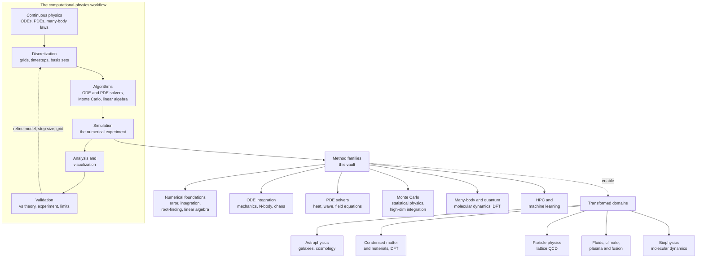

# 🖥️ Computational Physics: Simulating the Laws of Nature

> [!abstract] TL;DR
> **Computational physics** uses numerical algorithms and computers to *solve* physics problems that have **no closed-form solution** — which is nearly every realistic one. Turbulent air, colliding galaxies, a many-electron atom, a chaotic pendulum: we can write the governing law exactly, yet no amount of algebra will produce the answer. The computer breaks the deadlock by **discretizing** the continuous law (space, time, and fields become finite grids and steps) and marching it forward step by step, turning unsolvable mathematics into a **numerical experiment**. This makes simulation the **third pillar of science**, standing beside theory and experiment: a virtual laboratory where you can drop a star into a galaxy, heat a magnet, or fold a protein and simply *watch what the laws produce*. It is the indispensable route to quantitative prediction across astrophysics, condensed matter, particle physics, fluid dynamics, and materials science — and it is now fused with high-performance computing and machine learning.

## Intuition

**Analogy:** Most of the great equations of physics are like a **recipe written in a language no chef can cook from directly**. Newton's law for three gravitating bodies, the Navier–Stokes equations for a curl of smoke, the Schrödinger equation for more than one electron — each is a *perfect* statement of what nature does, and each is *unsolvable* with pen and paper. For centuries that was a wall: we could write the law but could not predict the outcome. The computer knocks the wall down. Instead of demanding one clean formula for "where is the planet at all times," it asks a far humbler question the machine can answer millions of times a second: "given where everything is *right now*, where will it be a tiny instant later?" String enough of those tiny instants together and a trajectory, a shock wave, or an entire simulated universe emerges — not derived, but *grown*.

That shift is the whole discipline. Computational physics treats the computer the way an experimentalist treats a bench: as an **apparatus for asking nature questions**. You do not measure a real galaxy; you build a numerical one from the law of gravity and let it evolve for thirteen billion simulated years. The "experiment" runs inside the machine, but the physics is real — and it is often the *only* way to get a number that theory and the lab both agree with.

---

## How It Works

### Core Mechanics

Computational physics is a pipeline that converts a **continuous physical law** into **discrete numbers a machine can crunch**, then converts those numbers back into physical insight. Six stages recur in nearly every project:

1. **Continuous physics → a mathematical model.** Start from the governing equations: Newton's or Hamilton's equations for mechanics, Maxwell's equations for fields, the heat and wave equations, the Schrödinger equation, the Boltzmann distribution for statistical ensembles. These are almost always **differential equations** or **high-dimensional integrals**, and almost always **nonlinear, coupled, many-body, or chaotic** — the exact features that defeat analytic solution.

2. **Discretization — the central move.** A computer cannot hold a continuum, so we approximate it with something finite: continuous *time* becomes a sequence of small steps `dt`; continuous *space* becomes a grid or mesh of points; a continuous *field* or wavefunction becomes a finite set of sample values or basis coefficients. Derivatives become **finite differences**, integrals become **finite sums**. The art is choosing a discretization fine enough to be faithful yet coarse enough to compute — the perennial **accuracy-versus-cost** trade-off. The vault's numerical backbone lives here: *Floating_Point_and_Numerical_Error*, *Numerical_Integration_and_Differentiation*, and *Numerical_Linear_Algebra*.

3. **Algorithms — the numerical engine.** The discretized problem is handed to a family of workhorse methods: **ODE integrators** to march trajectories forward (*Runge_Kutta_and_Adaptive_Methods*, and the structure-preserving *Symplectic_Integrators_and_Hamiltonian_Dynamics*); **PDE solvers** for fields on grids (*Finite_Difference_Methods*); **Monte Carlo** methods that trade determinism for random sampling to conquer high-dimensional integrals and statistical ensembles (*Monte_Carlo_Integration*, *The_Metropolis_Algorithm_and_MCMC*); and **linear-algebra kernels** (matrix solves, eigenvalue problems) that sit underneath almost everything.

4. **Simulation — the numerical experiment.** The algorithm runs, producing the raw output: positions over time, a temperature field, an energy spectrum, a set of sampled configurations. This is the "experiment," and like a real one it must be *designed* — initial conditions, boundary conditions, resolution, and run length all matter.

5. **Analysis and visualization.** Terabytes of raw numbers are useless until reduced to physics: order parameters, correlation functions, spectra (often via the **FFT**), phase diagrams, and rendered images or animations. Seeing a simulated shock front or a folding protein is frequently how the discovery actually happens.

6. **Validation — the discipline that separates physics from arithmetic.** A number is only trustworthy if the code is right and the discretization is converged. So we check **energy or momentum conservation**, run **convergence tests** (halve `dt`, refine the grid, confirm the answer stops changing), compare against **known analytic limits and special cases**, and ultimately against **theory and experiment**. A simulation that has not been validated is a rumour, not a result.

Two ideas make this specifically *physics* rather than generic numerical analysis. First, **physical problems have structure worth exploiting**: a symplectic integrator is chosen over a naive one precisely because it conserves the Hamiltonian's phase-space volume and keeps energy bounded over billions of steps, respecting a *physical* law rather than merely a mathematical one. Symmetries and conservation laws become both a design principle and a free correctness check. Second, **physical intuition guides and validates**: known limits (small-drag, low-speed, weak-coupling), dimensional analysis, and expected qualitative behaviour tell you instantly when a run is wrong.

The **method families** above map onto the sections of this vault, and each has transformed a domain: **N-body and ODE integration** power *astrophysics* (galaxy and cosmological structure formation); **Monte Carlo and MCMC** power *statistical physics* and *lattice QCD* in particle physics; **PDE solvers** power *fluid dynamics, climate, and plasma/fusion*; **many-body and quantum solvers** (*Molecular_Dynamics_Simulation*, *Numerical_Quantum_Mechanics*, DFT for electronic structure) power *condensed matter, chemistry, and materials*; and increasingly **high-performance/parallel computing** and **machine learning** amplify all of them (*High_Performance_and_Parallel_Computing*, *Machine_Learning_in_Computational_Physics*, and the closing outlook *The_Reach_and_Future_of_Computational_Physics*).

### Flow / Architecture



---

## Key Concepts

**Secondary (intuition first):**
- **Simulation vs. formula.** Some problems have a tidy formula (drag-free projectile: a parabola). Most do not. Simulation answers "where next?" over and over instead of solving "where ever?" once.
- **Step by step.** Split time into tiny steps and update the state each step. Smaller steps generally mean a more faithful answer.
- **The third pillar.** Theory, experiment, and now **simulation** — a way to *do experiments on the equations themselves*.
- **Approximation is the point.** A computer works with finite numbers and finite grids, so every answer is an approximation; good computational physics is the craft of controlling how good.

**Undergraduate (mechanics of the field):**
- **Discretization.** Replacing continuous space/time/fields with finite grids, timesteps, and basis expansions; derivatives → finite differences, integrals → sums.
- **Truncation vs. round-off error.** Truncation error shrinks as the step shrinks; round-off (finite floating-point precision) grows as you take more steps — the two trade off at an optimal step size (*Floating_Point_and_Numerical_Error*).
- **Order of accuracy.** Euler is first-order (`error ∝ dt`); RK4 is fourth-order (`error ∝ dt⁴`) — higher order buys accuracy per unit cost.
- **Stability.** Some schemes blow up unless `dt` is small enough (an explicit stability limit); implicit schemes trade extra work for unconditional stability.
- **Method families.** ODE integrators, PDE solvers (finite difference / finite element / spectral), Monte Carlo, and numerical linear algebra — the four pillars of the toolkit.

**Graduate (system-level judgment):**
- **Structure-preserving integration.** Symplectic integrators conserve phase-space volume and bound energy error over exponentially long times, essential for N-body and molecular dynamics; ordinary RK4 slowly leaks energy (*Symplectic_Integrators_and_Hamiltonian_Dynamics*, *Hamiltonian_Mechanics*).
- **The curse of dimensionality.** Grid methods scale as `N^d`; for the many-body/quantum wavefunction `d` is enormous, which is why **Monte Carlo** (error `∝ 1/√N`, independent of dimension) and **variational/basis** methods dominate high-dimensional problems.
- **Convergence and verification/validation (V&V).** Establishing that the discrete solution converges to the continuum answer (Richardson extrapolation, mesh/step refinement) and that it reproduces the real system.
- **Physics-informed algorithm choice.** Exploiting conservation laws, symmetry, sparsity, and multiscale structure; choosing implicit vs. explicit, spectral vs. finite-difference, based on the physics.
- **Performance and reproducibility.** Parallelism (domain decomposition, GPUs), numerical stability under parallel reduction, and the growing use of ML surrogates and physics-informed networks as accelerators (*High_Performance_and_Parallel_Computing*, *Machine_Learning_in_Computational_Physics*).

---

## Python Demo

```python
# Hello world of computational physics:
# Projectile motion WITH quadratic air drag is a nonlinear ODE with NO
# elementary closed-form solution. We cannot write down x(t); we must SIMULATE.
# We integrate it numerically (RK4) and compare to the drag-FREE parabola,
# which DOES have a pen-and-paper solution. The gap is exactly what
# computation captures that algebra cannot.

import numpy as np
import matplotlib.pyplot as plt

g = 9.81      # gravitational acceleration (m/s^2)
b = 0.02      # drag per unit mass (1/m); drag acceleration = -b * |v| * v

def deriv(state):
    """Right-hand side of d/dt [x, y, vx, vy] with quadratic drag."""
    x, y, vx, vy = state
    speed = np.hypot(vx, vy)
    ax = -b * speed * vx            # drag opposes velocity, scales with speed^2
    ay = -g - b * speed * vy
    return np.array([vx, vy, ax, ay])

def rk4_step(state, dt):
    """One classical 4th-order Runge-Kutta step (error per step ~ dt^5)."""
    k1 = deriv(state)
    k2 = deriv(state + 0.5 * dt * k1)
    k3 = deriv(state + 0.5 * dt * k2)
    k4 = deriv(state + dt * k3)
    return state + (dt / 6.0) * (k1 + 2*k2 + 2*k3 + k4)

def simulate(dt, v0=40.0, angle_deg=50.0):
    """March the ODE forward until the projectile hits the ground (y < 0)."""
    angle = np.deg2rad(angle_deg)
    state = np.array([0.0, 0.0, v0*np.cos(angle), v0*np.sin(angle)])
    xs, ys = [state[0]], [state[1]]
    while state[1] >= 0.0:
        state = rk4_step(state, dt)
        xs.append(state[0]); ys.append(state[1])
    return np.array(xs), np.array(ys)

# --- Numerical solution WITH drag (no closed form exists) ---
x_drag, y_drag = simulate(dt=0.01)

# --- Analytic drag-FREE parabola (b = 0 is solvable by hand) ---
v0, angle = 40.0, np.deg2rad(50.0)
v0x, v0y = v0*np.cos(angle), v0*np.sin(angle)
t = np.linspace(0.0, 2*v0y/g, 400)
x_ideal = v0x * t
y_ideal = v0y * t - 0.5 * g * t**2

# --- Step-size / error demonstration: accuracy vs cost ---
range_fine   = simulate(dt=0.001)[0][-1]   # tiny step -> reference answer
range_coarse = simulate(dt=0.05)[0][-1]    # big step  -> cheaper, less accurate
print(f"Range with drag, dt=0.001 : {range_fine:6.2f} m   (reference)")
print(f"Range with drag, dt=0.05  : {range_coarse:6.2f} m")
print(f"Step-size error           : {abs(range_coarse-range_fine):5.2f} m"
      f"  -> smaller dt = more accuracy, more compute (accuracy vs cost)")
print(f"Analytic drag-free range  : {x_ideal[-1]:6.2f} m"
      f"   (drag steals {x_ideal[-1]-range_fine:4.1f} m of range)")

# --- Visualize what simulation captures that algebra cannot ---
plt.figure(figsize=(8, 5))
plt.plot(x_ideal, y_ideal, '--', lw=2, label='Analytic, no drag (pen & paper)')
plt.plot(x_drag,  y_drag,  '-',  lw=2, label='Numerical, with drag (simulated)')
plt.xlabel('horizontal distance x (m)')
plt.ylabel('height y (m)')
plt.title('Projectile motion: the parabola algebra gives vs. reality with drag')
plt.grid(True, alpha=0.3)
plt.ylim(bottom=0)
plt.legend()
plt.tight_layout()
plt.show()
```

Running this prints the drag-shortened range, shows how a coarser timestep costs accuracy (the essence of the accuracy-versus-cost trade-off), and plots the true drag trajectory falling short of and asymmetric to the ideal parabola — the concrete, quantitative behaviour that no elementary formula can supply.

---

## Real-World Applications

- **Astrophysics and cosmology.** N-body and hydrodynamic codes (e.g. GADGET, IllustrisTNG) evolve billions of particles under gravity to grow galaxies and cosmic web structure from tiny initial fluctuations — an experiment no telescope can run.
- **Condensed matter and materials.** Density Functional Theory (DFT) codes (VASP, Quantum ESPRESSO) numerically solve the many-electron problem to predict band structures, magnetism, and new materials before they are synthesized.
- **Particle physics.** Lattice QCD discretizes spacetime onto a grid and uses Monte Carlo to compute hadron masses from first principles — the only known way to solve QCD in its strongly-coupled regime.
- **Fluid dynamics, weather, and climate.** Numerical weather prediction and climate models solve discretized Navier–Stokes and thermodynamic equations on global grids; aircraft and engines are designed in CFD before any wind tunnel.
- **Plasma and fusion.** Particle-in-cell and MHD simulations model tokamak plasmas and stellar interiors where the equations are hopelessly nonlinear.
- **Biophysics and chemistry.** Molecular dynamics integrates Newton's equations for millions of atoms to watch proteins fold, drugs bind, and membranes assemble.

---

## Common Pitfalls

- **Trusting a run you never validated.** A simulation that has not passed a convergence test or a conservation check is a rumour, not a result. Always halve `dt`, refine the grid, and confirm the answer stops moving; compare to a known analytic limit.
- **Ignoring numerical instability.** Explicit PDE and ODE schemes have stability limits (e.g. the CFL condition); exceed them and the solution explodes into meaningless oscillations even though the code "ran." Diagnose by checking whether errors grow catastrophically as time advances.
- **Confusing "smaller step is always better."** Beyond a point, shrinking `dt` increases round-off error (more operations, more accumulated floating-point noise) and wastes compute. There is an optimal step where truncation and round-off balance (*Floating_Point_and_Numerical_Error*).
- **Using an energy-leaking integrator for long runs.** Plain RK4 slowly drains or pumps energy in orbital and molecular dynamics; over millions of steps the orbit spirals unphysically. Use a symplectic integrator that respects the Hamiltonian structure.
- **Comparing floats with `==`, or letting units drift.** Finite precision means exact equality almost never holds; use tolerances. Dimensional or unit inconsistencies silently corrupt results — check with dimensional analysis.
- **Over-resolving or under-resolving.** Too coarse a grid misses the physics (aliasing, smeared shocks); too fine wastes resources. Resolution should be chosen from the physical length/time scales, not guessed.

---

## Related Concepts

- [[Ordinary_Differential_Equations]] — the ODEs whose intractable, nonlinear versions computational physics integrates numerically.
- [[Partial_Differential_Equations]] — heat, wave, and field equations that become finite-difference/finite-element grids in simulation.
- [[Numerical_ODEs_and_PDEs]] — the mathematics of turning those continuous equations into stable, convergent discrete schemes.
- [[Numerical_Integration]] — quadrature rules underlying both deterministic integration and the Monte Carlo alternative.
- [[Numerical_Linear_Algebra]] — the matrix solves and eigenvalue problems sitting underneath PDE solvers and quantum methods.
- [[Root_Finding]] — Newton and bisection methods used for equilibria, implicit steps, and shooting-method boundary problems.
- [[Error_Analysis_and_Floating_Point]] — truncation vs. round-off error and the finite-precision limits that bound every simulation.
- [[Hamiltonian_Mechanics]] — the phase-space structure that symplectic integrators are built to preserve.
- [[Classical_Statistical_Mechanics]] — the Boltzmann ensembles that Monte Carlo and the Metropolis algorithm sample.
- [[Many_Body_Quantum_Systems]] — the exponentially hard problem that numerical quantum methods and DFT attack.
- [[Schrodinger_Equation]] — solved numerically for potentials and geometries with no analytic wavefunction.
- [[Turbulence_and_Instabilities]] — the nonlinear fluid regime that only computational fluid dynamics can resolve.
- [[DFT_and_FFT]] — the fast Fourier transform behind spectral methods and simulation analysis.
- [[Computational_Biophysics_and_Molecular_Dynamics]] — molecular dynamics as computational physics applied to living matter.
- [[Large_Scale_Structure_and_Structure_Formation]] — the cosmic web grown in N-body simulations.
- [[Electronic_Band_Structure]] — computed numerically via DFT, a flagship condensed-matter application.

---

## Review Questions

**Secondary:**
1. Why can a computer find the flight of a projectile with air drag when pen-and-paper algebra cannot? What is the machine actually doing differently?
2. What does it mean to say simulation is the "third pillar" of science alongside theory and experiment?

**Undergraduate:**
3. Define discretization and give one example each for time, space, and a field. Why is it the central move of computational physics?
4. Euler's method has error proportional to `dt`, RK4 to `dt⁴`. Given a fixed compute budget, which typically gives a more accurate orbit, and why is "just make `dt` tiny" not always the best answer?
5. Distinguish truncation error from round-off error and explain why an optimal step size exists.

**Graduate:**
6. You must integrate a solar-system N-body problem for a billion years. Would you choose RK4 or a symplectic integrator, and what physical property of the system drives that choice?
7. Explain why Monte Carlo integration (error `∝ 1/√N`) can beat grid-based quadrature for a 100-dimensional integral, and connect this to the "curse of dimensionality" in many-body quantum simulation.
8. What is the difference between computational physics and generic numerical analysis? Give a concrete example where exploiting physical structure (a symmetry, conservation law, or known limit) changes both the algorithm and the validation strategy.

---

## Sources

- Newman, M. — *Computational Physics* (Createspace, 2013).
- Landau, R. H., Páez, M. J., & Bordeianu, C. C. — *Computational Physics: Problem Solving with Python* (Wiley-VCH, 3rd ed., 2015).
- Press, W. H., Teukolsky, S. A., Vetterling, W. T., & Flannery, B. P. — *Numerical Recipes: The Art of Scientific Computing* (Cambridge Univ. Press, 3rd ed., 2007).
- Giordano, N. J., & Nakanishi, H. — *Computational Physics* (Pearson, 2nd ed., 2005).
- Thijssen, J. M. — *Computational Physics* (Cambridge Univ. Press, 2nd ed., 2007).

---

#computational-physics #simulation #numerical-methods #scientific-computing #third-pillar
