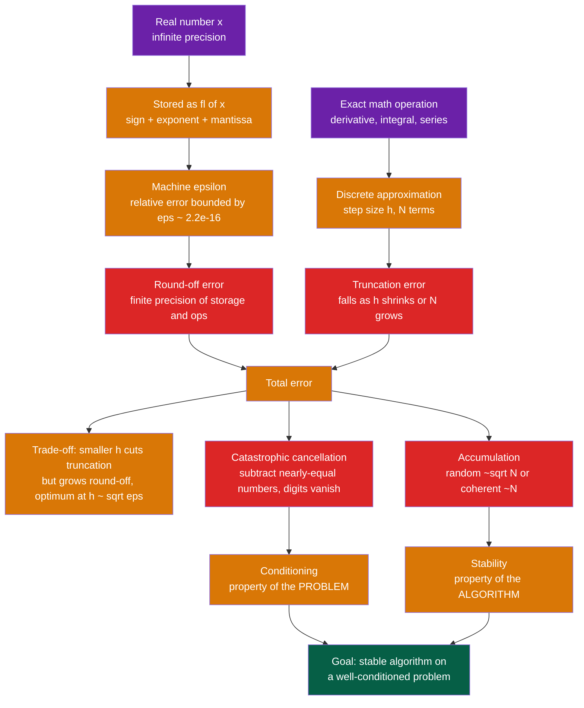

# 🔢 Floating-Point Arithmetic and Numerical Error

> [!abstract] TL;DR
> A computer stores real numbers with only ~16 significant digits, so almost every value is approximate. Two unavoidable errors follow — **round-off** (finite precision) and **truncation** (approximating the exact math) — and they trade off, forcing an optimal discretization size. When you subtract two nearly-equal numbers, **catastrophic cancellation** can silently annihilate every correct digit. Knowing machine epsilon, the difference between a badly-**conditioned** problem and an unstable **algorithm**, and how to reformulate expressions is the first survival skill of computational physics.

## Intuition

**Analogy:** A computer is a calculator with a fixed-width screen — it keeps only about 16 digits and forgets the rest. Usually that is plenty. But do the wrong arithmetic — subtract two nearly-equal huge numbers, or add a grain of sand to a mountain — and those forgotten digits stage a revolt: the leading digits cancel out, the garbage in the trailing digits is promoted to the front, and your answer becomes meaningless.

This is not a hypothetical. In 1991 a **Patriot missile** battery let a 24-bit clock accumulate round-off for 100 hours; the resulting 0.34-second timing drift caused it to miss an incoming Scud, and 28 soldiers died. In 1996 the **Ariane 5** rocket converted a 64-bit floating-point velocity into a 16-bit integer, overflowed, and self-destructed 37 seconds after launch. Knowing where the digits hide, and where they vanish, is what separates a simulation you can trust from one that quietly produces nonsense. This note is the numerical bedrock beneath every other topic in this vault — it underlies **Computational_Physics_Overview**, **Numerical_Integration_and_Differentiation**, **Numerical_Linear_Algebra**, **Root_Finding_and_Optimization**, and **Initial_Value_Problems_and_Euler_Methods**.

---

## How It Works

### Core Mechanics

1. **Finite precision is the foundational fact.** The real line is continuous and uncountable; a 64-bit word can name only about 1.8e19 distinct patterns. Therefore *most* real numbers cannot be stored exactly — they are snapped to the nearest representable neighbor. Even a "simple" decimal like 0.1 has no exact binary expansion, so it is stored slightly wrong.

2. **IEEE-754 gives every number scientific notation in binary.** A value is `(-1)^sign x 1.mantissa x 2^(exponent - bias)`. The **exponent** sets the magnitude (the range), the **mantissa** (or significand) holds the digits (the precision). Single precision (32-bit, 23 mantissa bits) gives ~7 decimal digits; double precision (64-bit, 52 mantissa bits) gives ~16. Special patterns encode `+/-inf` (overflow), `NaN` (invalid, e.g. 0/0), and **subnormals** (gradual underflow near zero). The format deliberately trades range against precision — more exponent bits mean a wider range but fewer digits.

3. **Machine epsilon is the precision floor.** `eps` is the smallest number with `1 + eps != 1`; for double precision it is `2^-52 ~ 2.2e-16`. Every single stored value and every single arithmetic operation carries a relative error bounded by roughly `eps`: `fl(x) = x(1 + delta)` with `|delta| <= eps`. This is exactly why `0.1 + 0.2` returns `0.30000000000000004`, not `0.3`.

4. **Round-off error accumulates.** Each of the `N` operations in a calculation injects a tiny relative error. If the errors are independent and random they grow like `sqrt(N)` (a random walk); if they push coherently in the same direction they grow like `N` (the worst case, as in the Patriot clock).

5. **Truncation error is a completely different source.** It has nothing to do with hardware — it is the error from *approximating the mathematics*: replacing a derivative by a finite difference, an integral by a finite sum, or an infinite series by finitely many terms. Truncation error *shrinks* as you refine the discretization (smaller step `h`, more terms).

6. **The two errors trade off.** Refining the discretization cuts truncation error but eventually inflates round-off, because a finer grid means subtracting numbers that are closer together. Total error bottoms out at an optimal step size — for a first-order finite difference, `h_opt ~ sqrt(eps) ~ 1e-8`. You **cannot** make `h` arbitrarily small.

7. **Conditioning vs stability are distinct.** **Conditioning** is a property of the *problem*: how much the exact output moves when the input is perturbed. **Stability** is a property of the *algorithm*: whether it avoids amplifying round-off beyond what the problem's conditioning demands. The goal is a *stable algorithm* applied to a *well-conditioned problem*.

### Flow / Architecture



---

## Key Concepts

### Secondary (intuition level)
- **A computer keeps ~16 digits, not infinitely many.** Numbers like 0.1 or 1/3 are stored slightly wrong, so `0.1 + 0.2` is not exactly `0.3`.
- **Never test floats for exact equality.** Use a tolerance: check `abs(a - b) < tol` instead of `a == b`.
- **Two kinds of error:** the computer's finite precision (round-off), and the shortcut of approximating real math with a finite recipe (truncation).

### Undergraduate (working knowledge)
- **IEEE-754 layout:** sign / exponent / mantissa. Single ~7 digits, double ~16 digits. Special values `inf`, `NaN`, and subnormals. `NaN != NaN` is `True` — use `isnan`.
- **Machine epsilon** `eps ~ 2.2e-16` (double) sets the relative-error floor; each operation contributes `O(eps)`.
- **Catastrophic cancellation:** subtracting nearly-equal numbers keeps the small absolute error but explodes the *relative* error, because leading significant digits cancel. Classic victims: the naive variance formula, the "bad" root of the quadratic formula, and `1 - cos x` for small `x`. Fix by algebraic reformulation (e.g. use `-2c / (b + sqrt(b^2 - 4ac))` for the small root; use `2 sin^2(x/2)` for `1 - cos x`).
- **Truncation-round-off trade-off:** total error has a V-shape versus step size `h`, with a minimum near `h ~ sqrt(eps)` for first differences. Going smaller makes things *worse*.

### Graduate (analysis level)
- **Conditioning** is quantified by the **condition number** `kappa`: relative output error over relative input error. If `kappa ~ 10^k` you lose about `k` significant digits no matter how good your algorithm is. For linear systems, `kappa(A) = sigma_max / sigma_min`.
- **Stability** is analyzed via **forward error** (distance from computed to true answer) and **backward error** (how much you would have to perturb the *input* to make the computed answer exact). A **backward-stable** algorithm yields the exact answer to a nearby problem; combined with good conditioning this bounds the forward error: `forward error <~ kappa x backward error`.
- **Mitigation toolkit:** reformulate to avoid subtractions; **compensated (Kahan) summation** to recover the `sqrt(N)`-to-`N` accumulation lost bits; promote to higher precision (float128, or double-double) selectively; **scale / nondimensionalize** so quantities are `O(1)`; and validate against analytic special cases with known answers.

---

## Python Demo

```python
# Exposes the three classic floating-point pitfalls:
#   (a) machine epsilon and 0.1 + 0.2 != 0.3
#   (b) catastrophic cancellation in (1 - cos x) / x^2
#   (c) the truncation-vs-roundoff V-curve for a finite-difference derivative
import numpy as np
import matplotlib.pyplot as plt

# ------------------------------------------------------------------
# (a) MACHINE EPSILON -- the precision floor of double precision
# ------------------------------------------------------------------
eps = 1.0
while 1.0 + eps / 2.0 != 1.0:      # keep halving until 1 + eps rounds back to 1
    eps /= 2.0
print(f"Machine epsilon (found)   : {eps:.6e}")
print(f"numpy finfo(float64).eps  : {np.finfo(np.float64).eps:.6e}")
print(f"0.1 + 0.2 == 0.3 ?        : {0.1 + 0.2 == 0.3}")
print(f"0.1 + 0.2 - 0.3           : {0.1 + 0.2 - 0.3:.3e}")

# ------------------------------------------------------------------
# (b) CATASTROPHIC CANCELLATION -- (1 - cos x) / x^2  ->  0.5 as x -> 0
#     naive form subtracts two nearly-equal numbers (1 and cos x);
#     stable form uses the identity 1 - cos x = 2 sin^2(x/2).
# ------------------------------------------------------------------
x       = np.logspace(-1, -8, 300)                       # small x approaching 0
naive   = (1.0 - np.cos(x)) / x**2                        # loses digits as x -> 0
stable  = 0.5 * (np.sin(x / 2.0) / (x / 2.0))**2          # numerically well-behaved
rel_err = np.abs(naive - stable) / np.abs(stable)

# ------------------------------------------------------------------
# (c) TRUNCATION vs ROUND-OFF -- forward difference of sin at x0 = 1
#     exact derivative is cos(1); truncation ~ h, round-off ~ eps / h.
# ------------------------------------------------------------------
x0        = 1.0
h         = np.logspace(0, -16, 500)
approx    = (np.sin(x0 + h) - np.sin(x0)) / h
total_err = np.abs(approx - np.cos(x0))
h_opt     = np.sqrt(np.finfo(float).eps)                 # theoretical optimum ~ 1.5e-8

# ------------------------------------------------------------------
# Visualise both effects side by side
# ------------------------------------------------------------------
fig, (ax1, ax2) = plt.subplots(1, 2, figsize=(12, 5))

ax1.loglog(x, rel_err, "r.-", ms=3, label="naive (1 - cos x) / x^2")
ax1.set_xlabel("x")
ax1.set_ylabel("relative error vs stable formula")
ax1.set_title("(b) Catastrophic cancellation")
ax1.grid(True, which="both", alpha=0.3)
ax1.legend()

ax2.loglog(h, total_err, "b.-", ms=3, label="total error")
ax2.loglog(h, h, "k:", alpha=0.6, label="truncation ~ h")
ax2.loglog(h, np.finfo(float).eps / h, "m:", alpha=0.6, label="round-off ~ eps / h")
ax2.axvline(h_opt, color="green", ls="--", label=f"h ~ sqrt(eps) = {h_opt:.1e}")
ax2.set_xlabel("step size h")
ax2.set_ylabel("error of finite-difference derivative")
ax2.set_title("(c) Truncation vs round-off (V-curve)")
ax2.set_ylim(1e-12, 1e1)
ax2.grid(True, which="both", alpha=0.3)
ax2.legend()

plt.tight_layout()
plt.savefig("numerical_error.png", dpi=120)
plt.show()
```

Running this prints `eps ~ 2.220446e-16`, confirms `0.1 + 0.2 == 0.3` is `False` (off by ~5.6e-17), and produces two plots. The left panel shows the naive `(1 - cos x)/x^2` losing all accuracy as `x -> 0` (relative error climbing toward 1, i.e. 100 percent), while the stable form holds. The right panel shows the signature **V-curve**: total error falls along the `~h` truncation line, hits its minimum near `h ~ sqrt(eps) ~ 1.5e-8`, then climbs back up along the `~eps/h` round-off line.

---

## Real-World Applications

> **Example — molecular dynamics and N-body simulation.** Codes like GROMACS and astrophysical N-body integrators sum millions of tiny pairwise forces per timestep. Naive summation lets round-off accumulate coherently (`~N`) and drains conserved energy over long runs, so production codes use **Kahan compensated summation** and symplectic integrators to keep the total error a slow random walk instead of a systematic drift.

> **Example — the Ariane 5 (1996) and Patriot missile (1991).** Ariane 5 self-destructed because a 64-bit float velocity overflowed a 16-bit integer conversion. The Patriot battery missed a Scud because a 24-bit clock accumulated round-off into a 0.34-second error over 100 hours. Both are textbook consequences of ignoring finite-precision reality.

> **Example — BLAS / LAPACK and deep learning.** Numerical linear algebra libraries expose the **condition number** so users know how many digits they can trust when solving `Ax = b`. Modern ML hardware pushes the other way: `bfloat16` keeps float32's exponent range but throws away mantissa bits, betting that training tolerates round-off while overflow would be fatal — a direct application of the range-vs-precision trade-off.

---

## Common Pitfalls

- **Testing floats with `==`.** `0.1 + 0.2 == 0.3` is `False`. Compare with a tolerance, and choose an *absolute* tolerance near zero and a *relative* tolerance elsewhere (as `numpy.isclose` does).
- **Subtracting nearly-equal numbers.** The classic accuracy killer. Before coding `a - b`, ask whether algebra can eliminate the subtraction (rationalize, use trig identities, or the stable quadratic-root form).
- **Driving `h` to zero.** Shrinking the finite-difference step past `sqrt(eps)` *increases* error as round-off takes over. There is an optimal `h`; smaller is not better.
- **Assuming more bits fixes everything.** If the *problem* is ill-conditioned (`kappa >> 1`), even quadruple precision returns garbage. Reformulate or re-condition the problem; do not just widen the type.
- **`NaN` and `inf` propagating silently.** `NaN != NaN` is `True`, and any operation touching `NaN` yields `NaN`. A single bad value (e.g. `log(0)`, `0/0`) can poison an entire array unnoticed — check with `isnan` / `isfinite`.
- **Summing in the wrong order.** Adding a tiny number to a huge running total loses the small contribution entirely (absorption). Sort ascending, sum in pairs, or use Kahan summation for long reductions.

---

## Related Concepts

- [[Error_Analysis_and_Floating_Point]] — the Mathematics-vault companion covering condition number, forward/backward error, and order-of-accuracy in full analytic detail.
- [[Arithmetic_Circuits_and_IEEE754]] — the hardware side: how the sign/exponent/mantissa fields, subnormals, `NaN`, and GRS rounding are actually built in silicon.
- [[Numerical_Integration]] — a direct application where truncation error (quadrature order) and round-off interact just as they do here.
- [[Numerical_Linear_Algebra]] — where conditioning (`kappa(A) = sigma_max / sigma_min`) and backward stability determine how many digits survive solving `Ax = b`.
- [[Root_Finding]] — convergence and stopping tolerances depend directly on machine epsilon and error orders.
- [[C_Types_and_Operators]] — how `float`, `double`, and integer conversions behave in a systems language, including the overflow class of bug that doomed Ariane 5.

---

## Review Questions

**Tier 1 — conceptual (secondary):**
1. Why does `0.1 + 0.2` not equal `0.3` on a normal computer? What single fact about how numbers are stored explains it?

**Tier 2 — applied (undergraduate):**
2. You must evaluate `(1 - cos x) / x^2` for `x = 1e-6`. The naive formula returns nonsense. Explain *why* in terms of significant digits, and give an algebraically equivalent expression that stays accurate.
3. For a forward-difference derivative you keep halving `h` but the error, after improving, starts getting *worse*. Sketch the error-vs-`h` curve, name the two competing effects, and estimate the optimal `h` in double precision.

**Tier 3 — analysis / trade-off (graduate):**
4. Distinguish **conditioning** from **stability**. Give an example of (a) a well-conditioned problem solved by an unstable algorithm and (b) an ill-conditioned problem where even a perfect algorithm cannot help. If `kappa = 10^10` in double precision, roughly how many correct digits can you expect?
5. You are summing 10^9 positive terms of similar magnitude. Compare the expected error growth of naive left-to-right summation versus Kahan compensated summation, and explain the mechanism by which Kahan recovers the lost bits.

---

## Sources

- Goldberg, D. "What Every Computer Scientist Should Know About Floating-Point Arithmetic," *ACM Computing Surveys*, 1991.
- Higham, N. J. *Accuracy and Stability of Numerical Algorithms*, 2nd ed., SIAM, 2002 (Ch. 1-2).
- Trefethen, L. N. & Bau, D. *Numerical Linear Algebra*, SIAM, 1997 (Lectures 12-15 on conditioning and stability).
- IEEE Standard for Floating-Point Arithmetic, IEEE 754-2019.
- Kahan, W. "Lecture Notes on the Status of IEEE Standard 754 for Binary Floating-Point Arithmetic," UC Berkeley, 1996.

---

#computational-physics #floating-point #numerical-error #machine-epsilon #catastrophic-cancellation
