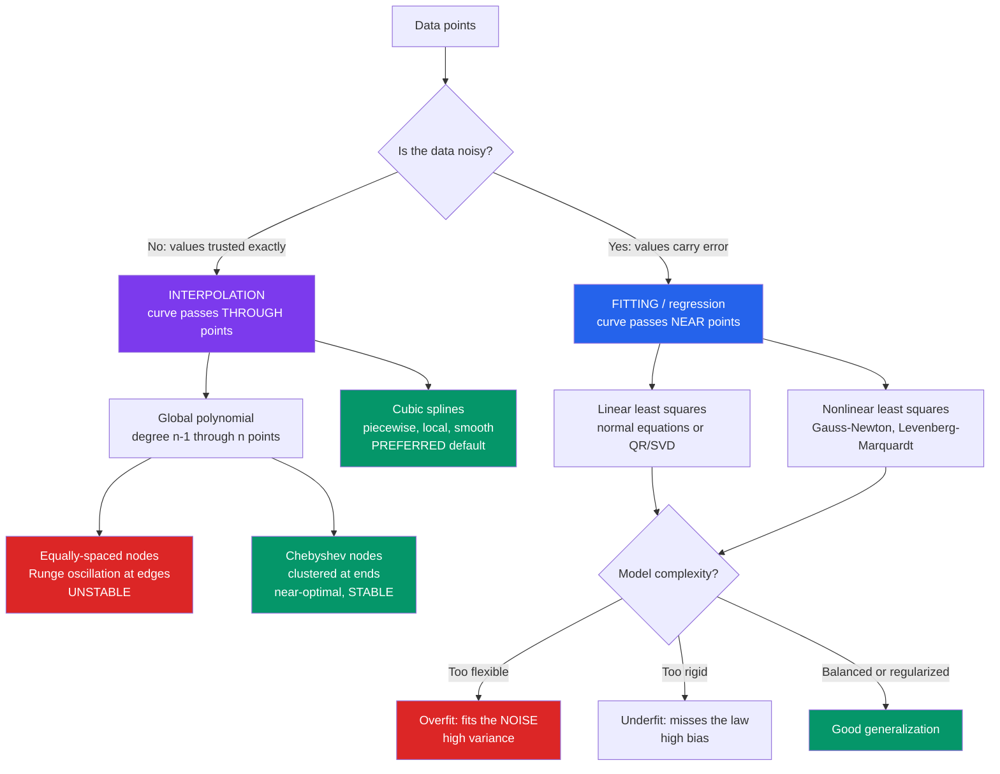

# 📈 Interpolation and Data Fitting

> [!abstract] TL;DR
> Interpolation builds a function that passes **exactly through** data points (data trusted as exact — filling gaps in a table or simulation grid); fitting builds a function that passes **near** data points (data assumed noisy — extracting a law). Confusing them is a classic blunder: force a high-degree polynomial through data and it thrashes (Runge's phenomenon), while overfitting a noisy dataset captures noise instead of physics. Cubic splines, least squares, and regularization are the tools that make the right choice.

---

## Intuition

**Analogy:** You have a handful of measurements — from an experiment or an expensive simulation — and you need the values *in between*, or the underlying *law* they obey. There are two completely different jobs. **Interpolation** draws a curve *through* every point, trusting each one exactly, like tracing a path that hits every stepping stone. **Fitting** draws a curve *near* the points, assuming each is a noisy shot at some smooth truth, like sketching the trend line through a scatter of darts.

Choosing wrong is a textbook mistake. Force a wiggly high-degree polynomial through noisy or equally-spaced data and it oscillates violently between the points — **Runge's phenomenon** — like connecting stars into a constellation so contorted it predicts nothing. Knowing when to *trust data exactly* versus *smooth through it* is one of the core numerical judgments in computational physics.

---

## How It Works

### Core Mechanics

There are two distinct tasks, and the whole discipline hinges on not confusing them:

1. **Interpolation** — construct a function passing *exactly* through `n` given points. The data is assumed **exact** (a lookup table, a simulation grid, a set of tabulated cross-sections). The goal is to *fill in the gaps*.

2. **Fitting / regression** — construct a function passing *near* the points according to a **model**. The data is assumed to carry **measurement error**. The goal is to *extract a law* and its parameters.

**Polynomial interpolation.** Through `n` points there is a unique polynomial of degree `n-1` (written in Lagrange or Newton divided-difference form). Elegant, but *dangerous* at high degree: on **equally-spaced nodes** the interpolant develops violent oscillations near the interval ends. This is **Runge's phenomenon** — the error grows as you *add* points. Lesson: high-degree *global* polynomials are numerically unstable.

**Better nodes — Chebyshev.** Placing nodes at `cos((2k+1)π / 2n)` clusters them near the endpoints. This minimizes the worst-case interpolation error and *tames* Runge's phenomenon, giving near-optimal polynomial interpolation. It is the same idea that powers **spectral methods** (see the sibling note *Spectral_Methods_and_the_FFT*).

**Splines — the practical default.** Instead of one high-degree polynomial, use many low-degree pieces. A **cubic spline** joins cubic polynomials on each sub-interval so that value, first, and second derivatives are all continuous at the knots. The result is **local, stable, and smooth** — no wild oscillations. This is the standard for smooth interpolation, computer graphics, and CAD.

**Least-squares fitting.** For *noisy* data, exact passage is wrong. Instead minimize the sum of squared residuals. If the model is **linear in its parameters** (polynomials, Fourier terms, any linear basis), the solution comes from the **normal equations** `AᵀA c = Aᵀy` — but for stability solve via **QR** or **SVD** rather than forming `AᵀA` (which squares the condition number). Statistically, least squares is the **maximum-likelihood** estimate under Gaussian noise; goodness of fit is judged by chi-squared, `R²`, and residual patterns.

**Nonlinear fitting.** Models nonlinear in their parameters (exponential decays, Lorentzian/Gaussian peaks) require iterative optimization — **Gauss-Newton** or **Levenberg-Marquardt** — which need good starting values and can stall in local minima. This is how physicists extract decay rates and resonance frequencies.

**Overfitting and the bias-variance trade-off.** Too *flexible* a model fits the noise (low bias, high variance — overfits, generalizes badly); too *rigid* misses the law (high bias, underfits). Choose complexity with information criteria (AIC/BIC), **cross-validation**, or **regularization** (a ridge/Tikhonov penalty that stabilizes ill-posed fits and controls complexity). This is *exactly* the machine-learning overfitting problem — the sibling note *Machine_Learning_in_Computational_Physics* pushes this connection further.

### Flow / Architecture



---

## Key Concepts

### Secondary (intuition level)
- **Interpolation vs fitting** — through the points (exact data) vs near the points (noisy data). Pick the wrong one and your answer is meaningless.
- **Runge's phenomenon** — a high-degree polynomial on evenly-spaced nodes wiggles violently near the edges.
- **Splines** — many small smooth pieces beat one giant bendy curve.

### Undergraduate
- **Lagrange / Newton forms** of the unique degree-`n-1` interpolant; the interpolation error bound `f⁽ⁿ⁾ξ · ∏(x - xᵢ) / n!`.
- **Chebyshev nodes** minimize `max|∏(x - xᵢ)|`, the source of Runge blow-up.
- **Cubic splines** — continuity of value, `S'`, `S''` at every knot; natural boundary condition `S'' = 0` at the ends; solved by a tridiagonal system in `O(n)`.
- **Linear least squares** — minimize `Σ(yᵢ - model)²`; normal equations `AᵀA c = Aᵀy`; `R²` and residual plots for goodness of fit.

### Graduate
- **QR / SVD least squares** — never form `AᵀA` for ill-conditioned Vandermonde systems; SVD gives the minimum-norm solution and exposes the condition number.
- **Maximum-likelihood view** — least squares equals ML estimation under i.i.d. Gaussian noise; chi-squared per degree of freedom tests the model.
- **Nonlinear least squares** — Gauss-Newton and Levenberg-Marquardt (trust-region interpolation between Gauss-Newton and gradient descent); Jacobian conditioning and local minima.
- **Regularization / model selection** — ridge (Tikhonov) `min ‖y - Ac‖² + λ‖c‖²`, AIC/BIC, and k-fold cross-validation as principled controls on the bias-variance trade-off; the direct bridge to statistical learning.

---

## Python Demo

```python
# Interpolation vs fitting, and the two ways to get burned:
# (A) Runge's phenomenon (bad interpolation) vs a stable cubic spline,
# (B) sensible least-squares fit vs overfitting noise.
# Pure numpy + matplotlib.
import numpy as np
import matplotlib.pyplot as plt

rng = np.random.default_rng(0)

# ----------------------------------------------------------------------
# (A) INTERPOLATION: Runge function 1/(1 + 25 x^2) on [-1, 1]
# ----------------------------------------------------------------------
runge = lambda x: 1.0 / (1.0 + 25.0 * x**2)
xx = np.linspace(-1, 1, 800)          # dense grid for plotting

n = 11                                 # number of nodes -> degree-10 poly
x_eq = np.linspace(-1, 1, n)           # EQUALLY-SPACED nodes (the trap)
y_eq = runge(x_eq)
poly_eq = np.polyval(np.polyfit(x_eq, y_eq, n - 1), xx)   # exact interpolant

# Chebyshev nodes: clustered at the ends -> tames Runge
k = np.arange(n)
x_cheb = np.cos((2 * k + 1) * np.pi / (2 * n))
y_cheb = runge(x_cheb)
poly_cheb = np.polyval(np.polyfit(x_cheb, y_cheb, n - 1), xx)


def natural_cubic_spline(x, y):
    """Natural cubic spline interpolant through (x, y); returns evaluator."""
    x = np.asarray(x, float); y = np.asarray(y, float)
    m = len(x) - 1
    h = np.diff(x)
    A = np.zeros((m + 1, m + 1)); rhs = np.zeros(m + 1)
    A[0, 0] = A[m, m] = 1.0                          # natural: S'' = 0 at ends
    for i in range(1, m):
        A[i, i - 1], A[i, i], A[i, i + 1] = h[i - 1], 2 * (h[i - 1] + h[i]), h[i]
        rhs[i] = 6 * ((y[i + 1] - y[i]) / h[i] - (y[i] - y[i - 1]) / h[i - 1])
    M = np.linalg.solve(A, rhs)                      # second derivatives
    def ev(t):
        t = np.atleast_1d(np.asarray(t, float))
        i = np.clip(np.searchsorted(x, t) - 1, 0, m - 1)
        dx = t - x[i]; hi = h[i]
        b = (y[i + 1] - y[i]) / hi - hi * (2 * M[i] + M[i + 1]) / 6
        return (y[i] + b * dx + M[i] / 2 * dx**2
                + (M[i + 1] - M[i]) / (6 * hi) * dx**3)
    return ev

spline_eq = natural_cubic_spline(x_eq, y_eq)(xx)     # spline on the SAME nodes

# ----------------------------------------------------------------------
# (B) FITTING: noisy data from a known "physical" law + Gaussian noise
# ----------------------------------------------------------------------
true_law = lambda t: 1.5 * t**2 - 0.8 * t + 2.0      # the law we want to recover
x_d = np.linspace(0, 1, 25)
y_d = true_law(x_d) + rng.normal(0, 0.12, x_d.size)  # noisy measurements
xf = np.linspace(0, 1, 400)

c_good = np.polyfit(x_d, y_d, 2)                      # sensible order (matches law)
c_over = np.polyfit(x_d, y_d, 15)                     # far too flexible -> overfits
fit_good, fit_over = np.polyval(c_good, xf), np.polyval(c_over, xf)

# Train error (on data) vs generalization error (vs the true law on dense grid)
rmse = lambda a, b: np.sqrt(np.mean((a - b) ** 2))
train_good = rmse(np.polyval(c_good, x_d), y_d)
train_over = rmse(np.polyval(c_over, x_d), y_d)
gen_good = rmse(fit_good, true_law(xf))
gen_over = rmse(fit_over, true_law(xf))
print(f"degree 2  : train RMSE = {train_good:.3f}   truth RMSE = {gen_good:.3f}")
print(f"degree 15 : train RMSE = {train_over:.3f}   truth RMSE = {gen_over:.3f}")
# -> degree 15 has LOWER train error but MUCH HIGHER error vs truth: overfitting.

resid = y_d - np.polyval(c_good, x_d)                 # residuals of the good fit

# ----------------------------------------------------------------------
# Plots
# ----------------------------------------------------------------------
fig, ax = plt.subplots(2, 2, figsize=(12, 8))

ax[0, 0].plot(xx, runge(xx), "k--", lw=1, label="true Runge f")
ax[0, 0].plot(xx, poly_eq, "r", lw=2, label="degree-10 poly (equal nodes)")
ax[0, 0].plot(x_eq, y_eq, "ko", ms=5)
ax[0, 0].set_ylim(-0.5, 1.5)
ax[0, 0].set_title("Interpolation gone wrong: Runge oscillation")
ax[0, 0].legend(fontsize=8)

ax[0, 1].plot(xx, runge(xx), "k--", lw=1, label="true Runge f")
ax[0, 1].plot(xx, spline_eq, "g", lw=2, label="natural cubic spline")
ax[0, 1].plot(xx, poly_cheb, "b", lw=1.5, label="degree-10 poly (Chebyshev)")
ax[0, 1].plot(x_eq, y_eq, "ko", ms=4)
ax[0, 1].set_ylim(-0.1, 1.1)
ax[0, 1].set_title("Stable interpolation: spline & Chebyshev")
ax[0, 1].legend(fontsize=8)

ax[1, 0].plot(xf, true_law(xf), "k--", lw=1, label="true law")
ax[1, 0].plot(x_d, y_d, "ko", ms=4, label="noisy data")
ax[1, 0].plot(xf, fit_good, "g", lw=2, label="degree-2 fit (good)")
ax[1, 0].plot(xf, fit_over, "r", lw=1.5, label="degree-15 fit (overfit)")
ax[1, 0].set_ylim(1.5, 3.0)
ax[1, 0].set_title("Fitting: sensible order vs overfitting the noise")
ax[1, 0].legend(fontsize=8)

ax[1, 1].axhline(0, color="k", lw=1)
ax[1, 1].stem(x_d, resid)
ax[1, 1].set_title("Residuals of the degree-2 fit (should look like noise)")

plt.tight_layout()
plt.show()
```

Running it prints something like `degree 2: train RMSE = 0.11, truth RMSE = 0.03` versus `degree 15: train RMSE = 0.07, truth RMSE = 0.28` — the overfit model wins on the training data yet is nearly **10x worse** against the true law. That single comparison *is* the bias-variance trade-off.

---

## Real-World Applications

> **Example — tabulated physics data.** Equations of state, nuclear cross-sections, and interatomic potentials are stored on discrete grids. Codes **interpolate** (cubic splines, never high-degree global polynomials) to get values between grid points during a simulation — exactly the "fill the gap, trust the data" task.

- **Extracting physical parameters** — fitting an exponential to a decay curve recovers a half-life; fitting a Lorentzian to a spectrum recovers a resonance frequency and linewidth. Nonlinear least squares (Levenberg-Marquardt) with good initial guesses.
- **Calibration curves** — instrument counts vs known concentrations/energies are fit to convert future raw readings into physical units.
- **Surrogate / reduced-order models** — a few expensive simulation runs are interpolated or fit to build a cheap surrogate for parameter sweeps and optimization.
- **Computer graphics & CAD** — cubic and Bezier/B-splines define smooth curves and surfaces; the same math as physics interpolation.
- **Signal reconstruction** — trigonometric interpolation of periodic samples is the DFT, tying directly to spectral analysis and the FFT.

---

## Common Pitfalls

- **Interpolating noisy data** — passing exactly through every noisy point captures the noise, not the physics. If there is measurement error, *fit*, do not interpolate.
- **High-degree global polynomials** — degree grows, error grows (Runge). Use cubic splines or Chebyshev nodes; do not raise the polynomial degree to "improve" an equally-spaced interpolation.
- **Forming the normal equations blindly** — `AᵀA` squares the condition number of an already ill-conditioned Vandermonde matrix. Solve via QR or SVD instead (this is the ill-conditioning theme of the sibling note *Numerical_Linear_Algebra* and *Floating_Point_and_Numerical_Error*).
- **Overfitting** — the more parameters you add, the lower the *training* residual and the worse the *generalization*. Validate on held-out data (cross-validation) or regularize.
- **Extrapolation** — every interpolant and fit may behave wildly outside the data range. Never extrapolate without physical justification.
- **Nonlinear fits without good initial guesses** — Gauss-Newton/Levenberg-Marquardt can converge to a wrong local minimum; seed them with physically sensible starting values.

---

## Related Concepts

- [[Interpolation_and_Approximation]] — the pure-math treatment of Lagrange/Newton forms, Chebyshev nodes, and spline theory that this note applies to physics data.
- [[Regression_and_Correlation]] — least-squares fitting is regression; `R²` and residual analysis come from statistics.
- [[Linear_Regression]] — the ML view of the same normal-equations least-squares fit.
- [[Polynomial_Regression]] — polynomial least squares and its overfitting behavior as degree grows.
- [[Bias_Variance_Tradeoff]] — the exact framework behind underfitting vs overfitting a curve.
- [[Regularization]] — ridge/Tikhonov penalties that stabilize ill-posed fits and control complexity.
- [[Cross_Validation]] — the principled way to choose model complexity for a fit.
- [[Singular_Value_Decomposition]] — the numerically stable engine for least squares and rank-deficient fits.
- [[Error_Analysis_and_Floating_Point]] — Runge blow-up and normal-equation instability are ill-conditioning in action.
- [[Numerical_Integration]] — quadrature rules are literally integrals of interpolating polynomials.
- [[DFT_and_FFT]] — trigonometric interpolation of periodic samples, the fast route to spectral methods.

---

## Review Questions

1. **(Conceptual)** You are given 20 exact points from a smooth table and 20 noisy measurements of the same quantity. Explain why you would use different methods for each, and name the method you would pick in both cases.
2. **(Scenario)** A colleague interpolates equally-spaced samples of a smooth function with a degree-19 polynomial and finds the error is *worse* near the interval ends than with degree 9. What is happening, and give two concrete fixes.
3. **(Trade-off)** A degree-2 polynomial fit has a training RMSE of 0.11 while a degree-15 fit has 0.07 on the same noisy data. Which model would you trust to predict new measurements, and what quantity would you compute to justify your choice?

---

## Sources

- Trefethen, *Approximation Theory and Approximation Practice*, SIAM (2013) — Chebyshev interpolation and Runge's phenomenon.
- Press, Teukolsky, Vetterling & Flannery, *Numerical Recipes*, 3rd ed., Ch. 3 (interpolation) & Ch. 15 (modeling of data).
- Burden & Faires, *Numerical Analysis*, Ch. 3–4 (polynomial and spline interpolation, least squares).
- Bevington & Robinson, *Data Reduction and Error Analysis for the Physical Sciences* — least-squares and nonlinear fitting for experiments.
- Hastie, Tibshirani & Friedman, *The Elements of Statistical Learning*, Ch. 7 — bias-variance, model selection, cross-validation.

---

#computational-physics #interpolation #curve-fitting #splines #least-squares
