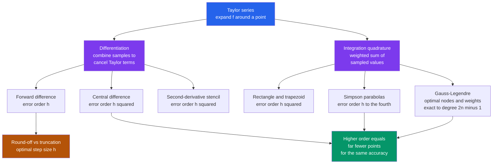

# 🧮 Numerical Integration and Differentiation

> [!abstract] TL;DR
> Computers do calculus not with symbols but with arithmetic on a grid: derivatives become weighted differences of sampled values, integrals become weighted sums. Both formulas fall out of the Taylor series, which also predicts their accuracy *order* — and these two primitives are the atomic operations beneath every force calculation, field solver, and ODE/PDE integrator in physics.

## Intuition

**Analogy:** How do you find the area under a curve you cannot integrate by hand? Chop it into thin vertical strips and add them up — the finer the strips, the better the estimate. And the slope at a point? Look at how the function changes over a tiny step, rise over run. These are schoolroom tricks, but made precise they are *exactly* how a computer performs calculus.

A machine cannot manipulate the symbol $\int$ or $\frac{d}{dx}$; it can only add, subtract, multiply, and divide numbers it has sampled. So the whole of physics simulation rests on a single move: approximate a derivative or an integral by a clever **weighted sum** of function values, chosen so that the errors cancel as much as possible. Choose the weights well and a handful of samples gives many digits of accuracy; choose them badly and no amount of sampling helps.

---

## How It Works

### Core Mechanics

Everything derives from the **Taylor series** — expand $f$ around a point $x$ and combine sampled values so the unwanted terms cancel. The first surviving term is the answer; the first *cancelled-but-not-quite* term is the error, and its power of the step size $h$ is the **order** of the method.

1. **Forward difference (first order).** From $f(x+h) = f(x) + h f'(x) + \tfrac{h^2}{2}f''(x) + \dots$, solve for $f'$:
   $$f'(x) \approx \frac{f(x+h) - f(x)}{h}, \qquad \text{truncation error } = -\tfrac{h}{2}f''(x) = O(h).$$
   Halving $h$ halves the error — slow.

2. **Central difference (second order).** Subtract the expansions of $f(x+h)$ and $f(x-h)$; the $f''$ terms cancel:
   $$f'(x) \approx \frac{f(x+h) - f(x-h)}{2h}, \qquad \text{error } = -\tfrac{h^2}{6}f'''(x) = O(h^2).$$
   Halving $h$ *quarters* the error for the same two evaluations — a free upgrade in accuracy.

3. **Higher-order and second derivatives.** Combining more sample points cancels more Taylor terms. The classic second-derivative stencil is
   $$f''(x) \approx \frac{f(x+h) - 2f(x) + f(x-h)}{h^2} = O(h^2),$$
   the backbone of every *Finite Difference Method* for PDEs.

4. **The differentiation trade-off.** Truncation error shrinks as $h \to 0$, but **round-off error grows**: you are subtracting two nearly-equal numbers, and catastrophic cancellation destroys significant digits (see the sibling note *Floating_Point_and_Numerical_Error*). Total error is a V-shaped curve with an optimal $h \approx \sqrt{\varepsilon_{\text{mach}}} \approx 10^{-8}$ for central differences. Differentiation is inherently **ill-conditioned** — it amplifies noise — which is why it is the more dangerous of the two operations.

5. **Quadrature as a weighted sum.** A definite integral becomes $\int_a^b f\,dx \approx \sum_i w_i f(x_i)$. **Newton-Cotes** rules fix equally spaced nodes and derive the weights by integrating an interpolating polynomial: the **rectangle/midpoint** and **trapezoid** rules are $O(h^2)$, while **Simpson's rule** fits parabolas through triples of points and jumps to $O(h^4)$ — dramatically better for the same spacing. Composite rules apply these across many subintervals.

6. **Gaussian quadrature.** The powerful idea: choose *both* the sample points and the weights optimally. An $n$-point **Gauss-Legendre** rule places nodes at the roots of the $n$-th Legendre polynomial and integrates polynomials up to degree $2n-1$ *exactly* — near-spectral accuracy for smooth functions with very few evaluations. It is the workhorse of high-accuracy integration.

7. **Integration is well-conditioned.** Summing values *averages* their errors (they partly cancel), so integration is stable and forgiving — the exact opposite of differentiation, which amplifies errors. This contrast is one of the most important lessons in numerical physics.

### Flow / Architecture



---

## Key Concepts

### Secondary
- A derivative is a slope; approximate it by "rise over run" over a small step $h$.
- An integral is an area; approximate it by adding up thin strips (rectangles or trapezoids).
- Smaller strips give a better answer — up to a point.

### Undergraduate
- **Taylor series is the source of everything.** Every finite-difference and quadrature formula is a linear combination of sampled values engineered to cancel Taylor terms; what survives is the answer, and the leading uncancelled term gives the **order** $O(h^p)$.
- **Central difference beats forward difference** ($O(h^2)$ vs $O(h)$) at no extra cost by exploiting symmetry.
- **Simpson's rule ($O(h^4)$) crushes the trapezoid rule ($O(h^2)$)** because fitting parabolas captures curvature. Higher order means the target accuracy needs far fewer function evaluations.
- **The differentiation V-curve:** total error $=$ truncation ($\downarrow$ with $h$) $+$ round-off ($\uparrow$ as $h\to 0$); an optimal $h$ exists.

### Graduate
- **Gaussian quadrature** exploits orthogonal polynomials: with $n$ freely-placed nodes and $n$ weights you have $2n$ degrees of freedom, enough to integrate degree-$(2n-1)$ polynomials exactly. Gauss-Hermite, Gauss-Laguerre, and Gauss-Chebyshev variants build the weight function ($e^{-x^2}$, $e^{-x}$, etc.) into the rule for infinite ranges and singular endpoints.
- **Adaptive quadrature** (Gauss-Kronrod, as in `scipy.integrate.quad`) refines only where the integrand varies, comparing two nested rules to estimate local error.
- **Specialized transforms** tame hard integrands: variable substitutions map infinite ranges to $[-1,1]$, the *tanh-sinh* (double-exponential) rule handles endpoint singularities, and Filon/Levin methods handle **oscillatory** integrals where naive quadrature fails.
- **Conditioning duality:** integration is a *smoothing* (well-conditioned) operator; differentiation is a *roughening* (ill-conditioned) one. In high dimensions grid quadrature suffers the **curse of dimensionality** ($N^d$ points) and **Monte Carlo integration** wins with its dimension-independent $O(N^{-1/2})$ rate — the subject of the sibling note *Monte_Carlo_Integration*. For smooth periodic problems, *Spectral_Methods_and_the_FFT* achieve exponential convergence instead.

---

## Python Demo

```python
# Numerical calculus with error analysis:
#   (a) differentiation  -> forward O(h) vs central O(h^2), the round-off V-curve
#   (b) integration      -> trapezoid ~N^-2 vs Simpson ~N^-4 vs Gauss-Legendre
# numpy + matplotlib only.
import numpy as np
import matplotlib.pyplot as plt

# ---------- (a) DIFFERENTIATION -------------------------------------------
f      = np.sin          # test function
fprime = np.cos          # exact derivative
x0     = 1.0
exact_d = fprime(x0)

h = np.logspace(-1, -15, 60)                         # step sizes 1e-1 ... 1e-15
fwd = np.abs((f(x0 + h) - f(x0)) / h - exact_d)      # forward difference O(h)
cen = np.abs((f(x0 + h) - f(x0 - h)) / (2 * h) - exact_d)  # central O(h^2)

# fit the convergence slope in the truncation-dominated region (large h)
mask = h > 1e-4
slope_fwd = np.polyfit(np.log10(h[mask]), np.log10(fwd[mask]), 1)[0]
slope_cen = np.polyfit(np.log10(h[mask]), np.log10(cen[mask]), 1)[0]

# ---------- (b) INTEGRATION -----------------------------------------------
g       = np.sin                  # integrand
a, b    = 0.0, np.pi
exact_I = 2.0                     # integral of sin from 0 to pi

def trapezoid(fn, a, b, N):
    x = np.linspace(a, b, N + 1)
    y = fn(x); hh = (b - a) / N
    return hh * (0.5 * y[0] + y[1:-1].sum() + 0.5 * y[-1])

def simpson(fn, a, b, N):
    if N % 2:                      # Simpson needs an even number of intervals
        N += 1
    x = np.linspace(a, b, N + 1)
    y = fn(x); hh = (b - a) / N
    return hh / 3 * (y[0] + y[-1] + 4 * y[1:-1:2].sum() + 2 * y[2:-2:2].sum())

def gauss(fn, a, b, n):            # n-point Gauss-Legendre on [a, b]
    nodes, w = np.polynomial.legendre.leggauss(n)
    xm = 0.5 * (b - a) * nodes + 0.5 * (b + a)
    return 0.5 * (b - a) * np.sum(w * fn(xm))

N = 2 ** np.arange(1, 13)          # 2, 4, ... 4096 intervals
err_trap  = np.array([abs(trapezoid(g, a, b, n) - exact_I) for n in N])
err_simp  = np.array([abs(simpson(g, a, b, n)   - exact_I) for n in N])
err_gauss = np.array([abs(gauss(g, a, b, n)     - exact_I) for n in N])
err_gauss = np.maximum(err_gauss, 1e-17)             # floor at machine precision

rate_trap = np.polyfit(np.log10(N), np.log10(err_trap), 1)[0]
mask_s    = err_simp > 1e-13                          # ignore the round-off floor
rate_simp = np.polyfit(np.log10(N[mask_s]), np.log10(err_simp[mask_s]), 1)[0]

# ---------- report ---------------------------------------------------------
print(f"Forward difference slope : {slope_fwd:.2f}  (theory 1)")
print(f"Central difference slope : {slope_cen:.2f}  (theory 2)")
print(f"Trapezoid convergence    : N^{rate_trap:.2f}  (theory -2)")
print(f"Simpson  convergence     : N^{rate_simp:.2f}  (theory -4)")

# ---------- plots ----------------------------------------------------------
fig, (ax1, ax2) = plt.subplots(1, 2, figsize=(12, 5))

ax1.loglog(h, fwd, "o-", label="forward  O(h)")
ax1.loglog(h, cen, "s-", label="central  O(h^2)")
ax1.loglog(h, 0.5 * h,        "--", color="gray", label="slope 1 ref")
ax1.loglog(h, 0.15 * h ** 2,  ":",  color="gray", label="slope 2 ref")
ax1.set_xlabel("step size h"); ax1.set_ylabel("abs error")
ax1.set_title("Differentiation: truncation vs round-off (V-curve)")
ax1.legend(); ax1.grid(True, which="both", alpha=0.3)

ax2.loglog(N, err_trap,  "o-", label="trapezoid  ~N^-2")
ax2.loglog(N, err_simp,  "s-", label="Simpson    ~N^-4")
ax2.loglog(N, err_gauss, "^-", label="Gauss-Legendre")
ax2.set_xlabel("number of intervals N"); ax2.set_ylabel("abs error")
ax2.set_title("Integration: higher order = far fewer points")
ax2.legend(); ax2.grid(True, which="both", alpha=0.3)

plt.tight_layout(); plt.show()
```

Running it prints slopes close to the theory (forward $\approx 1$, central $\approx 2$, trapezoid $\approx N^{-2}$, Simpson $\approx N^{-4}$). The differentiation panel shows the tell-tale **V-curve**: error falls with $h$ until round-off takes over near $h \approx 10^{-8}$ (central) and then *rises*. The integration panel shows Simpson reaching machine precision with a few dozen points while the trapezoid rule is still crawling, and Gauss-Legendre plunging to round-off almost immediately — the concrete payoff of higher order.

---

## Real-World Applications

> **Example:** In molecular dynamics and orbital mechanics, the **force** on a particle is $F = -\nabla U$ — a numerical derivative of a potential — and the trajectory is advanced by an ODE integrator whose every internal stage is a quadrature-like weighted sum (see *Initial_Value_Problems_and_Euler_Methods*). The same two primitives reappear everywhere.

- **Work and energy:** $W = \int \mathbf{F}\cdot d\mathbf{s}$ and kinetic/potential energy budgets are evaluated by quadrature when the force is known only at sampled points.
- **Electrostatic potentials and fields:** $V(\mathbf{r}) = \int \frac{\rho(\mathbf{r}')}{4\pi\varepsilon_0|\mathbf{r}-\mathbf{r}'|}\,d^3r'$ over a charge distribution is a 3-D quadrature; the field $\mathbf{E} = -\nabla V$ is then a finite difference of $V$.
- **Statistical mechanics:** partition functions $Z = \int e^{-\beta E}\,d\Gamma$ and thermodynamic averages are integrals over phase space.
- **Quantum mechanics:** expectation values $\langle \hat{A}\rangle = \int \psi^* \hat{A}\psi\,dx$ and normalization integrals are computed by Gaussian quadrature.
- **Every PDE solver:** finite-difference stencils discretize $\nabla^2$, and finite-element codes evaluate stiffness-matrix entries $\int \nabla\phi_i\cdot\nabla\phi_j\,dV$ by Gauss-Legendre on each element — millions of quadratures per simulation.

---

## Common Pitfalls

- **Making $h$ "as small as possible" for a derivative** — past the optimal $h\approx\sqrt{\varepsilon_{\text{mach}}}$, round-off from subtracting nearly-equal values *increases* the error. Use central differences and stop at the V-curve minimum, or use complex-step differentiation to sidestep cancellation entirely.
- **Differentiating noisy or experimental data** — differentiation amplifies high-frequency noise (ill-conditioned). Smooth or fit first, or use regularized/spectral derivatives.
- **Forgetting Simpson needs an even number of intervals** — the alternating $4,2,4,2$ weight pattern only closes correctly when $N$ is even; an odd $N$ silently gives the wrong formula.
- **Applying a smooth rule across a kink or discontinuity** — Simpson and Gaussian quadrature assume the integrand is smooth; a jump or corner drops them back to $O(h)$. Split the integral at the singularity first.
- **Naive quadrature on infinite ranges or singular endpoints** — use a variable transformation (or Gauss-Laguerre/Hermite, tanh-sinh) instead of truncating the domain arbitrarily.
- **Grid quadrature in high dimensions** — cost explodes as $N^d$ (curse of dimensionality); switch to Monte Carlo once $d \gtrsim 6$–$8$.

---

## Related Concepts

- [[Numerical_Integration]] — the Mathematics-vault companion covering Newton-Cotes, Romberg, and Gauss-Legendre in more analytical depth.
- [[Error_Analysis_and_Floating_Point]] — the truncation-vs-round-off trade-off and the optimal step size come straight from floating-point limits.
- [[Interpolation_and_Approximation]] — Newton-Cotes weights are derived by integrating an interpolating polynomial exactly.
- [[Root_Finding]] — the other core numerical primitive; Gauss nodes are roots of Legendre polynomials, found by root-finding.
- [[Sequences_and_Series]] — the Taylor series that every finite-difference and quadrature order is built from.
- [[Differentiation]] — the exact calculus operation these finite differences approximate.
- [[Riemann_Integration]] — quadrature is a Riemann sum with cleverly chosen weights.
- [[Ordinary_Differential_Equations]] — ODE integrators are repeated applications of these differentiation and quadrature primitives.
- [[Work_Energy_and_Conservation]] — work integrals and energy budgets are computed by quadrature.
- [[Gauss_Law_and_Electric_Potential]] — potentials from charge densities are 3-D quadratures; fields are their finite differences.
- [[Sampling_Theorem]] — sampling a function on a grid is the discretization these methods act on.

---

## Review Questions

1. **(Secondary)** You estimate a derivative with $\frac{f(x+h)-f(x)}{h}$ and the answer is off. A friend says "just make $h$ a trillion times smaller." Why is that not guaranteed to help?
2. **(Undergraduate)** Starting from the Taylor expansions of $f(x+h)$ and $f(x-h)$, derive the central-difference formula and show its leading error term is $O(h^2)$. Why does the $f''$ term cancel?
3. **(Undergraduate)** Simpson's rule integrates cubics exactly using only three points. Explain in terms of degrees of freedom why this "super-convergence" happens, and why the trapezoid rule cannot match it.
4. **(Graduate)** You must integrate a smooth function 200 times inside a tight simulation loop, each to 10-digit accuracy. Would you pick composite Simpson or 12-point Gauss-Legendre, and why? How does your answer change if the integrand has a $\sqrt{x}$ singularity at the left endpoint, or if the domain is 8-dimensional?

---

## Sources

- Newman, M. E. J., *Computational Physics* (2013), Ch. 5 — finite differences and quadrature for physics.
- Press, Teukolsky, Vetterling & Flannery, *Numerical Recipes*, 3rd ed., Ch. 4 — integration of functions.
- Burden & Faires, *Numerical Analysis*, 10th ed., Ch. 3–4 — differentiation, Newton-Cotes, Gaussian quadrature.
- Landau, Páez & Bordeianu, *Computational Physics: Problem Solving with Python*, Ch. 5–6.
- Trefethen, L. N., "Is Gauss Quadrature Better than Clenshaw-Curtis?", *SIAM Review* 50 (2008), 67–87.

---

#computational-physics #numerical-integration #finite-differences #quadrature #simpsons-rule
