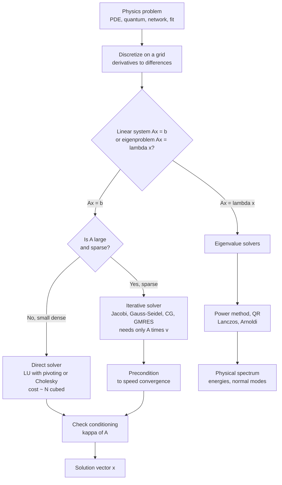

# 🧮 Numerical Linear Algebra

> [!abstract] TL;DR
> Discretize almost any physics problem — a vibrating bridge, an electrostatic field, a quantum atom — and it collapses into the *same* shape: a giant linear system $Ax=b$ or an eigenvalue problem $Ax=\lambda x$. Solving these matrices is the computational engine of physics, and supercomputers spend most of their cycles doing exactly this. The whole art is that a physics matrix is almost never a dense random grid — it is **sparse** (mostly zeros) or structured, and exploiting that structure with the right **direct** or **iterative** solver, while watching the **condition number**, is the difference between a solution in seconds and one that never finishes.

## Intuition — analogy FIRST

Imagine a stretched fishing net with weights at every knot. Push down on one knot and the whole net sags — but *each knot only feels its immediate neighbors* through the strings that touch it. To find the resting shape of the loaded net, you write one balance equation per knot: "my displacement is the average of my neighbors, plus the local load." Stack all those equations together and you have a matrix system $Ax=b$, where $x$ is the vector of all knot positions.

That is exactly what happens when you discretize physics. Replace the continuous field (temperature, potential, wavefunction) by values on a grid, replace derivatives by differences of neighboring grid values, and every physical law becomes an algebraic equation coupling each point to its neighbors. Because a grid point only touches a handful of neighbors, the matrix $A$ is **sparse**: nearly every entry is zero. Numerical linear algebra is the discipline of solving these enormous, structured systems fast and accurately — it is where the physics turns into numbers.

---

## How It Works

### The core translation: physics → matrices

Nearly every computational method funnels physics into one of two canonical problems:

1. **Linear systems** $Ax = b$ — steady states, equilibria, least-squares fits, and every *implicit* time step of a PDE solver. The Poisson/Laplace equation for gravity and electrostatics, resistor networks, and coupled masses on springs all land here.
2. **Eigenvalue problems** $Ax = \lambda x$ — quantum energy levels and orbitals, normal modes of vibration, buckling and stability thresholds, and principal-component directions of data. Here the eigenvalues *are* the measurable physical spectrum.

The rest of the field is the machinery to solve these two problems well.

### Direct solvers: factor, then substitute

A **direct solver** computes the exact answer (up to round-off) in a finite, predictable number of steps. The workhorse is **Gaussian elimination**, expressed as **LU decomposition**: factor $A = LU$ into a lower-triangular $L$ and an upper-triangular $U$, then solve $Ly = b$ by cheap **forward substitution** and $Ux = y$ by **back substitution**. **Pivoting** (row-swapping to put the largest available entry on the diagonal) is essential — without it, dividing by a tiny pivot magnifies round-off and can wreck an otherwise well-posed problem. For a **symmetric positive-definite** matrix you can use **Cholesky** ($A = LL^{\top}$), which is about twice as fast and needs no pivoting.

The catch: for a *dense* $N\times N$ matrix, LU costs on the order of $N^3$ operations and $N^2$ storage. Double the grid resolution in 3D and $N$ grows eightfold — the dense cost explodes a-thousand-fold. Direct dense solvers are hopeless for large grids.

### Sparsity: the crucial physics structure

Here is the escape hatch. Physics matrices are **sparse** — each row has only a few nonzeros because each grid point couples only to its neighbors — and often **banded** (nonzeros hug the diagonal). A 1D Poisson problem yields a **tridiagonal** matrix, and a specialized banded solver (the Thomas algorithm) cracks it in $O(N)$ time and storage — not $O(N^3)$. Storing only the nonzeros (formats like CSR/CSC) and using sparse-aware factorizations with fill-reducing orderings is what makes million-unknown simulations feasible on a laptop. Recognizing and exploiting structure is often more important than the choice of algorithm.

### Iterative solvers: never factor a huge matrix

When $A$ is enormous and sparse (millions of unknowns), even a sparse factorization can generate too much *fill-in*. **Iterative solvers** sidestep factorization entirely: start from a guess and refine it, needing only **matrix-vector products** $Av$ — which are cheap for sparse $A$.

- **Jacobi** and **Gauss-Seidel** are simple *relaxation* schemes: repeatedly replace each unknown by the value that satisfies its own equation given the current neighbors. They are the algebraic twins of PDE relaxation. **Successive over-relaxation (SOR)** overshoots each update by a factor $\omega$ to accelerate.
- **Conjugate Gradient (CG)** is the workhorse for symmetric positive-definite systems: it builds mutually $A$-conjugate search directions so that each is used exactly once, converging in at most $N$ steps and usually far fewer. **GMRES** and other **Krylov** methods handle nonsymmetric systems.
- **Preconditioning** — solving $M^{-1}Ax = M^{-1}b$ with an easy-to-invert $M \approx A$ — is the single biggest lever on iterative convergence.

### Conditioning: why the answer can be garbage even with a perfect algorithm

The **condition number** $\kappa(A) = \|A\|\,\|A^{-1}\|$ (for symmetric $A$, the ratio $\lambda_{\max}/\lambda_{\min}$) measures how much $A$ amplifies input errors. A large $\kappa$ means an **ill-conditioned** system: tiny perturbations in $b$ or round-off in the data produce large errors in $x$, and iterative solvers crawl. A rule of thumb: you lose about $\log_{10}\kappa$ digits of accuracy. Conditioning is a property of the *problem*, not the algorithm — no solver can rescue a near-singular matrix. This ties directly to a companion note on **Floating_Point_and_Numerical_Error**, where round-off and conditioning meet.

### Eigenvalue problems: the physical spectra

For $Ax=\lambda x$, the algorithms differ by how many eigenpairs you need. The **power method** iterates $x \leftarrow Ax / \|Ax\|$ to extract the dominant eigenvalue. The **QR algorithm** reveals *all* eigenvalues of a moderate dense matrix and underlies `numpy.linalg.eig`. For a *few* extreme eigenvalues of a huge sparse matrix — exactly the quantum many-body and normal-mode setting — **Lanczos** (symmetric) and **Arnoldi** (nonsymmetric) build a small Krylov subspace and diagonalize there. These are explored further in the sibling note **Eigenvalue_Problems_in_Physics**.

### The decomposition toolkit and least squares

Matrix **decompositions** are the reusable building blocks: **LU** for general solves, **Cholesky** for SPD systems, **QR** for least squares and eigenvalues, and the **Singular Value Decomposition (SVD)** — the Swiss-army knife that delivers rank, pseudoinverse, low-rank approximation, and PCA. **Least-squares fitting** of physics models to data is an *overdetermined* system (more measurements than parameters); solving it via the normal equations is fast but squares the condition number, whereas **QR** or **SVD** solve it stably.

### The HPC connection

None of this runs on hand-written loops in production. Every serious simulation calls **BLAS** (Basic Linear Algebra Subprograms) and **LAPACK**, whose cache-blocked, vectorized, parallel kernels approach peak hardware throughput. Why blocked algorithms and parallelism matter is the subject of the sibling note **High_Performance_and_Parallel_Computing**.



---

## Key Concepts

### Secondary
- A system of many equations in many unknowns can be written compactly as $Ax=b$, where $A$ is a matrix of coefficients.
- Solving physics problems on a computer means turning smooth fields into lists of numbers on a grid.
- A **sparse** matrix is mostly zeros; storing and skipping those zeros saves enormous time and memory.
- **Direct** methods compute the exact answer in a fixed number of steps; **iterative** methods sneak up on the answer step by step.

### Undergraduate
- **LU decomposition** factors $A=LU$; forward/back substitution then solves any right-hand side cheaply. **Pivoting** keeps it numerically stable.
- **Cost scaling**: dense LU is $O(N^3)$; a tridiagonal solve is $O(N)$ — structure changes the *complexity class*, not just the constant.
- **Jacobi / Gauss-Seidel / SOR** are relaxation iterations; their convergence rate is set by the spectral radius of the iteration matrix.
- **Condition number** $\kappa(A)=\lambda_{\max}/\lambda_{\min}$ (SPD case) bounds how measurement and round-off errors propagate into $x$; expect to lose about $\log_{10}\kappa$ digits.
- **Least squares** for overdetermined systems: normal equations $A^{\top}A x = A^{\top}b$ (fast, less stable) vs QR/SVD (slower, stable).

### Graduate
- **Krylov subspace methods** (CG for SPD, MINRES for symmetric indefinite, GMRES/BiCGStab for nonsymmetric) minimize the residual over $\text{span}\{r_0, Ar_0, A^2 r_0,\dots\}$; CG's error bound scales with $\sqrt{\kappa}$, so **preconditioning** that shrinks $\kappa$ is decisive.
- **Sparse direct solvers** use fill-reducing orderings (nested dissection, minimum-degree) and supernodal/multifrontal factorizations to fight fill-in.
- **Lanczos / Arnoldi** tridiagonalize/Hessenberg-reduce within a Krylov subspace to extract a few eigenpairs of huge sparse operators — the backbone of quantum many-body diagonalization and modal analysis.
- **SVD** $A = U\Sigma V^{\top}$ gives the numerically robust rank, pseudoinverse $A^{+}=V\Sigma^{+}U^{\top}$, and optimal low-rank approximation (Eckart-Young), unifying least squares, PCA, and regularization.
- **BLAS levels** (1: vector, 2: matrix-vector, 3: matrix-matrix) and cache-blocked LAPACK routines determine whether an algorithm is memory-bound or compute-bound in practice.

---

## Python Demo

```python
# Numerical Linear Algebra in action:
# (a) discretize the 1D steady-state heat/Poisson equation into a tridiagonal Ax=b
#     and solve it with a DIRECT method (LAPACK LU under np.linalg.solve),
# (b) solve the SAME system with ITERATIVE methods (Jacobi & Gauss-Seidel) and
#     watch the error decay toward the direct solution,
# (c) show how the CONDITION NUMBER of the discrete Laplacian grows with N,
#     the quiet reason large grids get harder.
import numpy as np
import matplotlib.pyplot as plt

# ------------------------------------------------------------------
# (a) PHYSICS -> LINEAR SYSTEM
#     -T''(x) = f(x) on [0, L], Dirichlet BCs T(0)=TL, T(L)=TR.
#     Central differences give (-T_{i-1} + 2 T_i - T_{i+1}) / h^2 = f_i,
#     i.e. a TRIDIAGONAL system A x = b for the interior temperatures.
# ------------------------------------------------------------------
L      = 1.0
N      = 50                       # interior grid points -> 50x50 sparse matrix
h      = L / (N + 1)
x      = np.linspace(0.0, L, N + 2)   # full grid incl. both boundaries
TL, TR = 100.0, 20.0                  # boundary temperatures (deg C)

# Volumetric heat source: a smooth "heater" centred in the rod
f = 900.0 * np.exp(-((x - 0.5) ** 2) / (2 * 0.08 ** 2))

# Build the (sparse-in-spirit) tridiagonal operator for interior nodes
main = 2.0 * np.ones(N)
offd = -1.0 * np.ones(N - 1)
A = (np.diag(main) + np.diag(offd, 1) + np.diag(offd, -1)) / h**2

# RHS = interior source + boundary contributions folded into b
b = f[1:-1].copy()
b[0]  += TL / h**2
b[-1] += TR / h**2

# ---- DIRECT solve (LU with partial pivoting, via LAPACK) ----
T_int    = np.linalg.solve(A, b)
T_direct = np.concatenate(([TL], T_int, [TR]))

# ------------------------------------------------------------------
# (b) ITERATIVE solvers on the same A x = b, tracking error vs iteration
# ------------------------------------------------------------------
def jacobi(A, b, iters, x_star):
    D    = np.diag(A)
    R    = A - np.diag(D)          # off-diagonal part
    xk   = np.zeros_like(b)
    err  = np.empty(iters)
    for k in range(iters):
        xk     = (b - R @ xk) / D  # each point = average of neighbours + source
        err[k] = np.linalg.norm(xk - x_star)
    return err

def gauss_seidel(A, b, iters, x_star):
    n    = len(b)
    xk   = np.zeros_like(b)
    err  = np.empty(iters)
    for k in range(iters):
        for i in range(n):         # use freshly-updated neighbours immediately
            s     = A[i, :i] @ xk[:i] + A[i, i+1:] @ xk[i+1:]
            xk[i] = (b[i] - s) / A[i, i]
        err[k] = np.linalg.norm(xk - x_star)
    return err

iters   = 2000
err_jac = jacobi(A, b, iters, T_int)
err_gs  = gauss_seidel(A, b, iters, T_int)

# ------------------------------------------------------------------
# (c) CONDITIONING: how kappa(A) of the discrete Laplacian scales with N
# ------------------------------------------------------------------
Ns, conds = [10, 20, 40, 80, 160, 320], []
for n in Ns:
    hn = L / (n + 1)
    An = (np.diag(2.0*np.ones(n))
          + np.diag(-1.0*np.ones(n-1), 1)
          + np.diag(-1.0*np.ones(n-1), -1)) / hn**2
    conds.append(np.linalg.cond(An))

# ------------------------------------------------------------------
# Plot everything
# ------------------------------------------------------------------
fig, ax = plt.subplots(1, 3, figsize=(15, 4.2))

ax[0].plot(x, T_direct, 'o-', ms=3, color='crimson')
ax[0].set(title="(a) Physical solution: heat profile\n(direct LU solve of tridiagonal Ax=b)",
          xlabel="position x", ylabel="temperature T [deg C]")
ax[0].grid(alpha=0.3)

ax[1].semilogy(err_jac, label="Jacobi")
ax[1].semilogy(err_gs,  label="Gauss-Seidel")
ax[1].set(title="(b) Iterative convergence to the direct answer",
          xlabel="iteration", ylabel="||x_k - x_direct||")
ax[1].legend(); ax[1].grid(alpha=0.3, which='both')

ax[2].loglog(Ns, conds, 's-', color='darkgreen', label="kappa(A)")
ref = [conds[0] * (n / Ns[0])**2 for n in Ns]   # N^2 reference, anchored at first point
ax[2].loglog(Ns, ref, '--', color='gray', label="reference ~ N^2")
ax[2].set(title="(c) Conditioning grows: kappa ~ N^2\n(bigger grids are intrinsically harder)",
          xlabel="grid size N", ylabel="condition number kappa(A)")
ax[2].legend(); ax[2].grid(alpha=0.3, which='both')

plt.tight_layout()
plt.show()

# Numerical sanity checks
print(f"Direct residual ||Ax-b||    : {np.linalg.norm(A @ T_int - b):.2e}")
print(f"Gauss-Seidel final error     : {err_gs[-1]:.2e}")
print(f"Jacobi final error           : {err_jac[-1]:.2e}")
print(f"kappa(A) at N={N:<3d}           : {np.linalg.cond(A):.1f}")
```

**What you see:** panel (a) is the physical answer — a temperature profile bulging upward where the heater sits, pinned at the boundary values; panel (b) shows both iterative solvers marching toward the direct solution, with **Gauss-Seidel roughly twice as fast** as Jacobi (it reuses fresh values immediately); panel (c) shows the discrete Laplacian's condition number climbing as $N^2$, quietly explaining why finer grids demand preconditioning and better solvers. The same three-way tension — direct vs iterative vs conditioning — recurs in every large simulation.

---

## Real-World Applications

- **Electrostatics & gravity (Poisson/Laplace):** field solvers in accelerator design, semiconductor device modeling, and cosmological particle-mesh codes assemble sparse Laplacians and hit them with multigrid-preconditioned CG. This connects to the sibling notes **Finite_Difference_Methods** and **The_Poisson_and_Laplace_Equation**.
- **Quantum chemistry & many-body physics:** finding a molecule's ground-state energy is a giant sparse eigenvalue problem; Lanczos/Davidson diagonalization and DFT's self-consistent linear solves dominate the runtime of codes like VASP and Quantum ESPRESSO.
- **Structural & vibration engineering:** finite-element stiffness matrices $Kx=f$ (static loads) and $Kx=\lambda Mx$ (natural frequencies) size bridges, aircraft, and earthquake response — sparse direct solvers and shift-invert eigensolvers do the heavy lifting.
- **Computational fluid dynamics:** implicit time stepping and pressure-Poisson projection produce sparse systems solved every step by Krylov methods with algebraic-multigrid preconditioners.
- **Data fitting & machine learning:** least-squares model fitting, ridge regression, and PCA are QR/SVD problems; recommendation systems and dimensionality reduction lean on the same low-rank machinery.

---

## Common Pitfalls

- **Forming the inverse.** Computing `A_inv = np.linalg.inv(A)` then `A_inv @ b` is slower *and* less accurate than `np.linalg.solve(A, b)`. Never invert to solve.
- **Ignoring sparsity.** Storing a discretized-PDE matrix as a dense array and calling a dense $O(N^3)$ solver wastes memory and time; use `scipy.sparse` and `spsolve`/CG. A tridiagonal system is $O(N)$ — do not pay $O(N^3)$ for it.
- **Normal equations for least squares.** $A^{\top}A$ squares the condition number, so $\kappa(A^{\top}A)=\kappa(A)^2$ can turn a mildly ill-conditioned fit into garbage; prefer QR or SVD.
- **No pivoting on the wrong matrix.** A zero or tiny pivot without partial pivoting causes catastrophic error. Trust LAPACK; only skip pivoting when the matrix is provably SPD (use Cholesky).
- **Blaming the solver for an ill-conditioned problem.** If $\kappa(A)\sim 10^{12}$, no algorithm recovers the lost digits — rescale, reformulate, or regularize the *problem*, not the solver.
- **Un-preconditioned CG on stiff systems.** CG's iteration count scales with $\sqrt{\kappa}$; on a fine grid it can stall. A good preconditioner (incomplete Cholesky, multigrid) is not optional at scale.
- **Assuming iterative always beats direct.** For small or moderately sized dense systems, a direct solve is faster and more reliable; iterative methods win specifically for *large and sparse*.

---

## Related Concepts

- [[Systems_of_Linear_Equations]] — the pure-math foundation of $Ax=b$, rank, and Gaussian elimination that numerical solvers make robust and fast.
- [[Matrices_and_Determinants]] — the algebraic objects and operations (including singularity) that numerical conditioning quantifies.
- [[Eigenvalues_and_Eigenvectors]] — the theory behind the $Ax=\lambda x$ problems that yield physical spectra and normal modes.
- [[Singular_Value_Decomposition]] — the stable, universal decomposition underlying least squares, rank, pseudoinverse, and PCA.
- [[Conjugate_Gradient]] — the flagship Krylov iterative solver for large sparse SPD systems, and how preconditioning tames its convergence.
- [[Error_Analysis_and_Floating_Point]] — round-off and stability that make conditioning a practical concern, not just a bound.
- [[Newtons_Method]] — nonlinear solvers whose every step is itself a linear solve $J\,\Delta x = -F$, chaining root-finding to NLA.
- [[Linear_Algebra]] — the ML-oriented companion connecting these operations to data and models.
- [[PCA]] — an SVD/eigen application: reducing high-dimensional data to its dominant directions.
- [[Oscillations_and_SHM]] — coupled oscillators whose normal modes are an eigenvalue problem of the stiffness matrix.
- [[Many_Body_Quantum_Systems]] — sparse Hamiltonian diagonalization, the physics that drives Lanczos/Arnoldi.
- [[Schrodinger_Equation]] — the eigenproblem $\hat{H}\psi=E\psi$ that discretizes into a matrix eigenvalue problem.
- [[Partial_Differential_Equations]] — the continuous laws whose discretization produces the sparse systems solved here.

---

## Review Questions

1. **(Conceptual)** Explain why discretizing a PDE such as the steady-state heat equation produces a *sparse* matrix, and why the sparsity pattern (tridiagonal in 1D) lets a solver run in $O(N)$ instead of $O(N^3)$.
2. **(Conceptual)** What does the condition number $\kappa(A)$ measure, and why can a "correct" algorithm still return an inaccurate solution when $\kappa$ is large? How does $\kappa$ affect a Conjugate Gradient solve differently from a direct LU solve?
3. **(Scenario)** You must solve a symmetric positive-definite system with $10^7$ unknowns arising from a 3D Poisson problem, where the matrix has about 7 nonzeros per row. Would you choose a dense LU solver, a sparse direct solver, or preconditioned CG — and why? What preconditioner would you reach for?
4. **(Scenario)** You are fitting a physics model to noisy data via least squares and notice the parameter estimates swing wildly. You are currently using the normal equations $A^{\top}Ax=A^{\top}b$. What is the likely cause, and how would switching to QR or SVD help?
5. **(Trade-off)** Compare the power method, the QR algorithm, and Lanczos for eigenvalue problems. For computing the *lowest few* energy levels of a large sparse quantum Hamiltonian, which is appropriate and why are the others poor fits?

---

## Sources

- Trefethen, L. N. & Bau, D. — *Numerical Linear Algebra* (SIAM, 1997). The standard modern text on conditioning, stability, QR, and iterative methods.
- Golub, G. H. & Van Loan, C. F. — *Matrix Computations*, 4th ed. (Johns Hopkins University Press, 2013). The comprehensive reference for direct methods and decompositions.
- Saad, Y. — *Iterative Methods for Sparse Linear Systems*, 2nd ed. (SIAM, 2003). Free PDF: [www-users.cse.umn.edu/~saad/IterMethBook_2ndEd.pdf](https://www-users.cse.umn.edu/~saad/IterMethBook_2ndEd.pdf)
- Press, W. H. et al. — *Numerical Recipes: The Art of Scientific Computing*, 3rd ed. (Cambridge University Press, 2007), Chs. 2 and 11.
- LAPACK Users' Guide (SIAM / netlib): [netlib.org/lapack/lug](https://www.netlib.org/lapack/lug/)

---

#computational-physics #linear-algebra #sparse-matrices #conjugate-gradient #eigenvalue-problems
