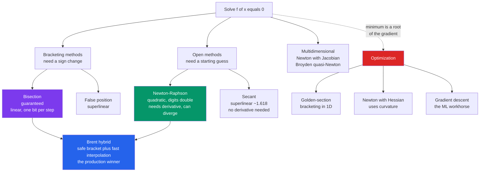

# 🎯 Root Finding and Optimization

> [!abstract] TL;DR
> Solving $f(x)=0$ numerically underlies almost every quantitative physics result — equilibria, energy eigenvalues, orbital positions, critical points. **Bisection** brackets a sign change and halves it: guaranteed but slow (one bit per step). **Newton-Raphson** uses the local slope to leap toward the root: quadratically fast but fragile. Production solvers hybridize the two (**Brent's method**). Optimization is the same problem in disguise — a minimum is a root of the gradient — which ties physics ground states directly to modern machine learning.

---

## Intuition

**Analogy:** Finding where an equation equals zero is a treasure hunt where the only feedback is a "hotter / colder" signal — the *sign* of $f(x)$. The simplest strategy is to keep halving the search region: as long as you know the treasure lies between a "too low" spot and a "too high" spot, splitting the difference can never lose it. This is **bisection** — slow but foolproof. The clever strategy is to read the *slope* of the ground where you stand and leap straight toward where that slope hits zero. This is **Newton's method** — lightning fast when you start near the target, but on a badly chosen spot the slope can hurl you off a cliff and you never come back.

Physics is full of these hunts. The equilibrium separation of two atoms is where the net force is zero. The allowed energy levels of a bound quantum particle are the roots of a transcendental matching condition. The position of a planet at a given time is the root of Kepler's equation. The temperature of a phase transition is where a free-energy derivative vanishes. Every one of them is "find $x$ such that $f(x)=0$."

---

## How It Works

### The root-finding problem

We want $x^{\*}$ with $f(x^{\*}) = 0$ for a function we can *evaluate* but not *invert* analytically. Methods split into two families with opposite personalities:

- **Bracketing (bisection, false position).** Keep two points $a, b$ with $f(a)f(b) < 0$. The Intermediate Value Theorem guarantees a root between them for any continuous $f$. Shrinking the bracket can never lose the root, so convergence is **guaranteed** — but the error only falls by a constant factor each step (**linear** convergence: one binary digit of accuracy per iteration).

- **Open methods (Newton-Raphson, secant).** Extrapolate from a local model. Newton fits a *tangent line* $f(x_k) + f'(x_k)(x - x_k)$ and jumps to where it crosses zero:
  $$x_{k+1} = x_k - \frac{f(x_k)}{f'(x_k)}.$$
  Near a simple root this **squares the error each step** (**quadratic** convergence — correct digits *double* per iteration). But there is no bracket to fall back on: a poor start, an inflection point, or a near-zero derivative $f'\approx 0$ can make it overshoot, oscillate, or diverge.

### Convergence order — why it matters

If the error obeys $|e_{k+1}| \approx C\,|e_k|^{p}$, then $p$ is the **order of convergence**. Bisection has $p=1$ (linear); the secant method has $p\approx 1.618$, the golden ratio (superlinear, and it needs no derivative); Newton has $p=2$ (quadratic). The practical difference is dramatic: to reach machine precision from a rough guess, bisection needs roughly 50 steps while Newton needs about 5. Order-2 means the digit count goes $1 \to 2 \to 4 \to 8 \to 16$.

### The safeguarded compromise

Neither extreme is used raw in production. **Brent's method** keeps a guaranteed bracket at all times but tries fast inverse-quadratic interpolation on each step, falling back to bisection whenever the fast step would leave the bracket or fail to make progress. You get near-superlinear speed *and* the ironclad guarantee. This "wrap a fast fragile method inside a slow safe one" pattern recurs everywhere in scientific computing — it is why `scipy.optimize.brentq` is the default recommendation.

### Multidimensional root finding

For systems $\mathbf{f}(\mathbf{x}) = \mathbf{0}$ in many variables, Newton generalizes using the **Jacobian** matrix $J_{ij} = \partial f_i / \partial x_j$:
$$\mathbf{x}_{k+1} = \mathbf{x}_k - J(\mathbf{x}_k)^{-1}\,\mathbf{f}(\mathbf{x}_k).$$
Here the trouble deepens: there is **no bracketing in higher dimensions**, so you need a good starting point, and forming/inverting $J$ is expensive — the cost of solving that linear system links straight to the `Numerical_Linear_Algebra` sibling note. **Broyden's method** and other quasi-Newton schemes approximate $J$ from successive evaluations to avoid recomputing derivatives.

### The optimization connection

Minimizing $g(\mathbf{x})$ is root finding on its gradient: at a smooth minimum $\nabla g = \mathbf{0}$. So the whole toolbox reappears — **golden-section search** (the bracketing analogue in 1D), **Newton's method for optimization** (using curvature, the Hessian $\nabla^2 g$), **gradient descent** (step downhill along $-\nabla g$, the workhorse of machine learning), and **conjugate gradient**. The catch that dominates real work: these find *local* optima, and telling a local minimum from the *global* ground state is genuinely hard.



---

## Key Concepts

### Secondary / Foundational
- **Root of an equation**: an input where the output is zero; graphically, where the curve crosses the axis.
- **Sign change and the Intermediate Value Theorem**: if a continuous function is negative at $a$ and positive at $b$, it must be zero somewhere between — the entire justification for bracketing.
- **Bisection = binary search on a continuous function**: halve the interval, keep the half that still straddles the axis.
- **Iteration and tolerance**: repeat until $|f(x)|$ or the bracket width drops below a target $\varepsilon$.

### Undergraduate
- **Newton-Raphson update** $x - f/f'$ from the tangent line; **quadratic convergence** near a simple root.
- **Secant method**: replace $f'$ by a finite-difference slope through the last two points — superlinear, derivative-free.
- **Order of convergence** $p$ in $|e_{k+1}|\approx C|e_k|^p$: linear vs superlinear vs quadratic, and the huge practical gap between them.
- **Failure modes of Newton**: divergence from a bad start, oscillation across an inflection point, blow-up near $f'=0$, and being trapped by a nearby extremum.
- **Minimum as a stationary point**: $\nabla g = 0$; first/second-order conditions (positive-definite Hessian for a min).
- **Gradient descent** $\mathbf{x} \leftarrow \mathbf{x} - \eta\,\nabla g$ and the role of the step size (learning rate) $\eta$.

### Graduate
- **Brent's method** and safeguarded hybrids: guaranteed convergence with near-superlinear speed via inverse-quadratic interpolation plus a bisection fallback.
- **Multidimensional Newton with the Jacobian**; local convergence theory and the basin-of-attraction problem.
- **Quasi-Newton** (Broyden for roots; BFGS / L-BFGS for optimization): secant-style low-rank updates that avoid forming derivatives explicitly.
- **Global vs local optimization**: convexity guarantees a unique minimum; non-convex energy landscapes (spin glasses, protein folding) demand basin hopping, simulated annealing, or stochastic search.
- **Root finding *inside* larger algorithms**: implicit ODE integrators solve a nonlinear system every step; **self-consistent field / DFT** iterates to a fixed point; equilibrium and continuation methods trace solution branches — themes developed in the `Numerical_Integration_and_Differentiation` and `Numerical_Quantum_Mechanics` siblings.

---

## Python Demo

```python
# Root finding & optimization on real physics problems:
#   (a) solve Kepler's equation M = E - e*sin(E) for the eccentric anomaly
#       with BISECTION (guaranteed, linear) and NEWTON-RAPHSON (quadratic)
#   (b) compare convergence order on a log scale
#   (c) show Newton DIVERGING from a bad start (motivates Brent-style safeguards)
#   (d) the optimization link: a minimum is a root of the gradient
import numpy as np
import matplotlib.pyplot as plt

# ---------------------------------------------------------------
# (a) KEPLER'S EQUATION  M = E - e*sin(E)   (orbital mechanics)
#     Given mean anomaly M and eccentricity e, find eccentric anomaly E.
# ---------------------------------------------------------------
e = 0.8          # eccentricity: 0 = circle, close to 1 = very elongated orbit
M = 0.5          # mean anomaly (radians)

f  = lambda E: E - e * np.sin(E) - M   # residual; its root is the answer
fp = lambda E: 1 - e * np.cos(E)       # d/dE  (never zero here since e < 1)

# High-accuracy reference root (many Newton steps) for error tracking
E_ref = M
for _ in range(60):
    E_ref -= f(E_ref) / fp(E_ref)

def bisection(f, a, b, tol=1e-14, nmax=100):
    fa = f(a)
    assert fa * f(b) < 0, "root is not bracketed"
    hist = []
    for _ in range(nmax):
        c = 0.5 * (a + b)
        hist.append(c)
        fc = f(c)
        if fa * fc < 0:
            b = c
        else:
            a, fa = c, fc
        if 0.5 * (b - a) < tol:
            break
    return c, np.array(hist)

def newton(f, fp, x0, tol=1e-14, nmax=100):
    x = x0
    hist = [x]
    for _ in range(nmax):
        x -= f(x) / fp(x)
        hist.append(x)
        if abs(f(x)) < tol:
            break
    return x, np.array(hist)

E_bis, hist_bis = bisection(f, 0.0, np.pi)   # E lies in [0, pi] when M in [0, pi]
E_new, hist_new = newton(f, fp, M)           # start at M: a serviceable guess

print(f"Kepler solve  e={e}, M={M}")
print(f"  bisection: E = {E_bis:.12f}  in {len(hist_bis)} steps")
print(f"  newton   : E = {E_new:.12f}  in {len(hist_new) - 1} steps")

err_bis = np.abs(hist_bis - E_ref)
err_new = np.abs(hist_new - E_ref)

# ---------------------------------------------------------------
# (c) NEWTON DIVERGENCE from a bad start (why we safeguard):
#     f(x) = x^3 - 2x + 2 started at x0 = 0 oscillates 0 -> 1 -> 0 -> ...
# ---------------------------------------------------------------
g  = lambda x: x**3 - 2 * x + 2
gp = lambda x: 3 * x**2 - 2
x, osc = 0.0, [0.0]
for _ in range(8):
    x -= g(x) / gp(x)
    osc.append(x)
print("\nNewton on x^3-2x+2 from x0=0 (oscillates, never converges):")
print("  ", np.round(osc, 4))

# ---------------------------------------------------------------
# (d) OPTIMIZATION LINK: a minimum is a root of the derivative.
#     Double-well potential V(x) = (x^2 - 1)^2, so V'(x) = 4x(x^2 - 1).
#     Gradient descent slides downhill to a minimum at x = +/- 1.
# ---------------------------------------------------------------
V  = lambda x: (x**2 - 1)**2
dV = lambda x: 4 * x * (x**2 - 1)
x, eta, gd = 1.7, 0.02, [1.7]     # start on the right-hand slope
for _ in range(60):
    x -= eta * dV(x)              # gradient-descent step
    gd.append(x)
print(f"\nGradient descent on the double well settled at x = {x:.6f}"
      f"  (a root of V', i.e. a minimum)")

# ---------------------------------------------------------------
# Plots: function with root, convergence order, and the optimization link
# ---------------------------------------------------------------
fig, ax = plt.subplots(1, 3, figsize=(15, 4.2))

Egrid = np.linspace(0, np.pi, 400)
ax[0].axhline(0, color="gray", lw=0.8)
ax[0].plot(Egrid, f(Egrid), "b-", label="f(E) = E - e sinE - M")
ax[0].plot(E_ref, 0.0, "r*", ms=16, label="root: eccentric anomaly")
ax[0].set_title("Kepler equation residual")
ax[0].set_xlabel("E (rad)"); ax[0].set_ylabel("f(E)"); ax[0].legend()

ax[1].semilogy(range(len(err_bis)), np.maximum(err_bis, 1e-17),
               "o-", label="Bisection (linear)")
ax[1].semilogy(range(len(err_new)), np.maximum(err_new, 1e-17),
               "s-", label="Newton (quadratic)")
ax[1].set_title("Convergence: |E_k - E*| vs iteration")
ax[1].set_xlabel("iteration"); ax[1].set_ylabel("error (log)"); ax[1].legend()

xg = np.linspace(-1.8, 1.8, 400)
ax[2].plot(xg, V(xg), "k-", label="V(x) = (x^2 - 1)^2")
ax[2].plot(gd, V(np.array(gd)), "r.-", ms=6, label="gradient descent")
ax[2].plot([-1, 1], [0, 0], "g^", ms=11, label="minima = roots of V'")
ax[2].set_title("Optimization = root of the gradient")
ax[2].set_xlabel("x"); ax[2].set_ylabel("V(x)"); ax[2].legend()

plt.tight_layout()
plt.savefig("root_finding_optimization.png", dpi=120)
plt.show()
```

Running it prints Newton reaching machine precision in about 4–5 steps versus roughly 48 for bisection, the middle panel shows Newton's error curve plunging (each point is near the *square* of the previous) while bisection descends as a straight line on the log axis, and the oscillation demo drives home why raw Newton is never shipped without a safety net.

---

## Real-World Applications

- **Orbital mechanics.** Every ephemeris and spacecraft navigation code solves **Kepler's equation** $M = E - e\sin E$ millions of times to convert time into position; it has no closed form, so Newton (seeded by a good analytic guess) is the standard workhorse.
- **Quantum energy levels.** The bound states of a finite square well satisfy a **transcendental** matching condition like $\tan(ka) = \sqrt{V_0/E - 1}$; the allowed energies are its roots — a canonical setup expanded in the `Numerical_Quantum_Mechanics` sibling.
- **Density Functional Theory and self-consistent fields.** Electronic-structure codes iterate a fixed-point/root-finding loop until the potential and the density it generates agree.
- **Equations of state and phase transitions.** Locating a critical point or a coexistence curve means finding where a free-energy derivative vanishes — root finding on thermodynamic potentials.
- **Molecular geometry and ground states.** Relaxing atoms to their minimum-energy configuration is optimization on the potential-energy surface; geometry optimizers are quasi-Newton (BFGS) at heart.
- **Model fitting and machine learning.** Least-squares fitting minimizes a loss; the same gradient-descent and Newton machinery powers neural-network training, the theme of the `Machine_Learning_in_Computational_Physics` sibling.

---

## Common Pitfalls

- **Newton from a bad starting point.** With no bracket to fall back on, a poor $x_0$ can send the iterate to infinity or into a limit cycle (as the $x^3 - 2x + 2$ demo shows). Always seed Newton well, cap the step, or wrap it in a bracketed safeguard like Brent's.
- **Dividing by a vanishing derivative.** Near a flat region or a *multiple* root, $f'\approx 0$ makes the Newton step explode, and quadratic convergence degrades to linear at a repeated root.
- **Losing the bracket.** A sign change only guarantees an *odd* number of roots; an even number of roots in $[a,b]$ shows no sign change and slips past bisection entirely. Sample the function first.
- **Tolerance and floating-point limits.** Demanding an error smaller than the rounding noise of $f$ makes any method stall or thrash — a direct consequence of the issues in the `Floating_Point_and_Numerical_Error` sibling; test on the *residual* $|f(x)|$ and the *step size*, not one alone.
- **Mistaking a local optimum for the global one.** Gradient descent and Newton find whatever basin they start in; on non-convex energy landscapes (protein folding, spin glasses) that is rarely the true ground state — use multi-start, annealing, or basin hopping.
- **Ill-conditioned Jacobians in higher dimensions.** Multidimensional Newton inherits every conditioning problem of the linear solve at its core; scaling variables and monitoring the condition number matter.

---

## Related Concepts

- [[Root_Finding]] — the Mathematics-vault companion with the fixed-point-iteration and false-position derivations in full.
- [[Newtons_Method]] — the optimization view of Newton: quadratic model, Hessian, Newton decrement, and damping.
- [[Gradient_Descent]] — the downhill-gradient workhorse; here it is framed as root finding on $\nabla g = 0$.
- [[Quasi_Newton]] — Broyden/BFGS updates that approximate the Jacobian or Hessian without recomputing derivatives.
- [[Conjugate_Gradient]] — the other large-scale optimizer that avoids explicit second derivatives.
- [[Gradient_Descent_Variants]] — SGD, momentum, and Adam: the same idea scaled to machine learning.
- [[Error_Analysis_and_Floating_Point]] — why tolerances cannot be pushed below rounding noise.
- [[Numerical_Integration]] — a sibling numerical primitive that root finders often call inside implicit schemes.
- [[Schrodinger_Equation]] — bound-state energies arise as roots of transcendental matching conditions.
- [[Phase_Transitions_and_Critical_Phenomena]] — critical points located by vanishing free-energy derivatives.
- [[Lagrangian_Mechanics]] — the least-action principle: physics recast as extremization, the deepest link between physics and optimization.

---

## Review Questions

1. **(Conceptual)** Why is bisection *guaranteed* to converge for any continuous function with a bracketed sign change, while Newton-Raphson carries no such guarantee — and what exactly does "quadratic convergence" buy you over bisection's "linear" once you *are* near the root?
2. **(Scenario)** You must solve Kepler's equation for a highly eccentric comet ($e = 0.97$) at a mean anomaly near periapsis, inside a loop that runs a billion times. Which method(s) would you combine, how would you choose the starting guess, and what safeguard would you add so a rare bad case cannot stall the whole simulation?
3. **(Trade-off)** A minimum is a root of the gradient, so you could "just" apply Newton to $\nabla g = 0$. Compare doing that against plain gradient descent for (a) a smooth low-dimensional potential-energy surface and (b) training a million-parameter neural network — addressing derivative cost, robustness, and local-vs-global behaviour.

---

## Sources

- Press, Teukolsky, Vetterling, Flannery, *Numerical Recipes* (3rd ed., 2007), Ch. 9 "Root Finding and Nonlinear Sets of Equations" and Ch. 10 "Minimization or Maximization of Functions".
- Nocedal & Wright, *Numerical Optimization* (2nd ed., Springer, 2006) — Newton, quasi-Newton, and line-search theory.
- Burden & Faires, *Numerical Analysis* (10th ed.) — bisection, Newton, secant, and convergence-order proofs.
- Brent, R. P., *Algorithms for Minimization Without Derivatives* (Prentice-Hall, 1973) — the original safeguarded hybrid method.
- SciPy documentation, `scipy.optimize` — `brentq`, `newton`, `fsolve`, and `minimize` as the practical reference implementations.

---

#computational-physics #root-finding #newton-raphson #bisection #optimization
