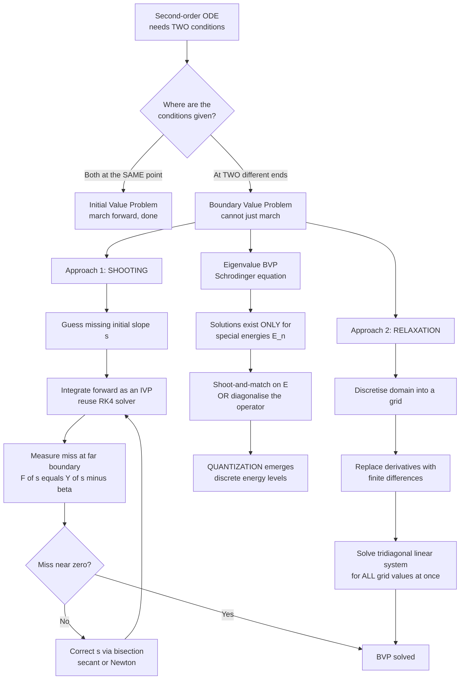

# 🎯 Boundary Value Problems and the Shooting Method

> [!abstract] TL;DR
> An **initial value problem** hands you *everything* at one starting point and marches forward; a **boundary value problem (BVP)** instead pins down conditions at *two different points* — usually the two ends — and asks for the function in between. That single change breaks marching: you cannot step forward because you do not know the full state anywhere. The **shooting method** rescues the IVP machinery by turning the BVP into **root-finding** — *guess* the missing initial slope, *integrate* forward as an IVP, *measure* how far you miss the far boundary, and *correct* the guess with bisection/Newton/secant until you hit ("aim, fire, correct"). The alternative, **relaxation / finite-difference**, discretises the whole domain at once into a (tridiagonal) **linear system** solved globally — the bridge to PDE solvers. The deepest payoff is **eigenvalue BVPs** like the time-independent **Schrödinger equation**: valid solutions exist only for *special* parameter values, so **quantization emerges numerically** — only discrete energies let the wavefunction satisfy both walls.

---

## Intuition

**Analogy:** An initial value problem is *throwing a ball*: you set the launch position, speed, and angle, then watch where it lands — the future is fully determined by the start. A boundary value problem flips the question: "I want the ball to *start here* and *land exactly there* — what launch angle do I need?" You are no longer told the initial velocity; you are told a *constraint at the destination*. The most literal way to solve it is to keep trying launch angles: fire one, see how badly you overshoot or undershoot the target, adjust your aim based on the miss, and fire again — exactly how an artillery crew *sights in* a cannon. That trial-and-correct loop **is** the shooting method.

The catch is that a BVP is a *global* problem. In an IVP you know the complete state at the start, so you can march step by step and never look back. In a BVP the information you need is split across both ends — you must satisfy the destination while respecting the origin *simultaneously* — so naive marching is impossible. Shooting sneaks around this by *guessing* the missing start, and relaxation confronts it head-on by solving the entire domain in one shot.

---

## How It Works

### Core Mechanics

1. **IVP versus BVP — where the data lives.** A second-order ODE `y'' = f(x, y, y')` needs *two* conditions to have a unique solution. An **IVP** supplies both at the *same* point: `y(a)` and `y'(a)`. Knowing the full state there, you march forward with an integrator ([[Initial_Value_Problems_and_Euler_Methods]], [[Runge_Kutta_and_Adaptive_Methods]]). A **BVP** splits the conditions across *two* points: `y(a) = α` and `y(b) = β`. You now know only *half* the state at each end, so you cannot start marching — the problem couples both boundaries at once. BVPs describe **steady states and equilibria**: beam and cable deflection, steady-state temperature and electrostatic potential, quantum bound states, orbital transfers.

2. **The shooting method — convert a BVP into root-finding over IVPs.** The trick: *invent* the missing initial datum. At the left end you know `y(a) = α` but not the slope `y'(a)`; call the unknown slope `s`. For each guess `s` you now have a complete IVP, so integrate forward to `x = b` and read off the value there — call it `Y(s)`. The BVP is satisfied exactly when you hit the far boundary, i.e. when the **miss function** `F(s) = Y(s) − β = 0`. That is a one-dimensional **root-finding** problem ([[Root_Finding_and_Optimization]]): sweep or bracket `s`, then converge with **bisection**, **secant**, or **Newton** (where the derivative `dF/ds` comes from a bracket or from integrating a variational equation). Shooting is attractive because it *reuses your best IVP solver unchanged* — the BVP becomes an outer root-find wrapped around an inner integration.

3. **Aim, fire, correct.** Concretely: pick two slopes that *bracket* the target (one overshoots the far wall, one undershoots), then bisect — each new guess halves the interval and the far-end miss shrinks toward zero. For a *linear* BVP a single secant step is exact (the map `s → Y(s)` is affine); for nonlinear BVPs you iterate Newton/secant to convergence. Plotting successive attempts shows a fan of trajectories all anchored at the left, sweeping toward the target on the right.

4. **Shooting's weakness — instability, and multiple shooting.** Integrating an IVP over a long interval can *amplify* errors: if the ODE has exponentially growing modes, a tiny error in the guessed slope explodes by `x = b`, so the miss function becomes hypersensitive and root-finding fails (the classic failure on stiff or oscillatory-decaying problems, e.g. deep evanescent quantum tails). **Multiple shooting** tames this: split `[a, b]` into sub-intervals, shoot independently on each with *its own* guessed start, and add **matching conditions** requiring the pieces to join continuously. This shortens each integration (limiting error growth) at the cost of a larger, coupled root-finding system.

5. **Relaxation / finite-difference — solve the whole domain at once.** Instead of marching, **discretise** the domain into a grid `x_0, x_1, …, x_N` and replace derivatives with **finite differences**: `y''(x_i) ≈ (y_{i−1} − 2y_i + y_{i+1}) / h²`. Writing this at every interior node turns the ODE into a system of algebraic equations in the unknown grid values `y_i`, with the boundary values `α, β` folded into the end rows. For a linear BVP this is a **tridiagonal linear system** `A y = b` solved directly in `O(N)` by the Thomas algorithm ([[Numerical_Linear_Algebra]]); for a nonlinear BVP you wrap Newton's method around it, solving a linear system each iteration. Relaxation is **global and stable** — it never marches, so it is immune to shooting's exponential blow-up — and it is the conceptual **bridge to PDE solvers** ([[Classification_of_PDEs_and_Discretization]]).

6. **Eigenvalue BVPs — where quantization is born.** Some BVPs are homogeneous (`β = 0` with a trivial solution `y ≡ 0`) and carry a free parameter `λ`: they admit a *non-trivial* solution satisfying both boundaries **only for special values of `λ`** — the **eigenvalues**. This is the numerical origin of **normal-mode frequencies**, **buckling loads**, **waveguide modes**, and — most famously — **quantized energy levels**. The time-independent **Schrödinger equation** `−(ħ²/2m) ψ'' + V(x) ψ = E ψ` with `ψ → 0` at the walls is exactly this: integrate `ψ` from the left wall for a trial energy `E`, and generically `ψ` does *not* vanish at the right wall. Only at discrete energies `E_n` does the far-wall value cross zero — **quantization appears as the discrete roots of the boundary-miss function** ([[Schrodinger_Equation]]).

7. **Two ways to find the eigenvalues.** (a) **Shoot-and-match:** treat `E` as the unknown, define `F(E) = ψ(b; E)`, and root-find `F(E) = 0` — each zero-crossing is a quantized level. (b) **Diagonalise the discretised operator:** build the finite-difference Hamiltonian (a tridiagonal matrix) and compute its **eigenvalues/eigenvectors** directly ([[Eigenvalues_and_Eigenvectors]]) — the matrix eigenvalues *are* the energies and the eigenvectors *are* the wavefunctions. Both recover the same quantized spectrum.

8. **From ODE BVPs to PDE BVPs.** Steady-state PDEs — **Laplace/Poisson** (`∇²φ = ρ`) for electrostatics, steady heat, incompressible flow potentials — are just multi-dimensional BVPs: values fixed on the *boundary* of a region, solved for the interior field. The same relaxation/finite-difference idea generalises (now a large *sparse*, not tridiagonal, system), as do **finite-element** ([[The_Finite_Element_Method]]) and **spectral/collocation** methods that trade grid points for smooth basis functions to reach higher accuracy.

### Flow / Architecture



---

## Key Concepts

### Secondary Level

- **Two ends, not one start.** A boundary value problem fixes the answer at *both* ends of an interval and asks for the shape between — like knowing a rope is nailed to two posts and asking how it hangs.
- **Shooting = trial and correction.** Guess how the solution *leaves* the first post, follow it across, see if it reaches the second post, then adjust the guess based on how badly you missed — repeat until you hit. Exactly like adjusting a cannon's aim shot by shot.
- **Why it is harder than throwing a ball.** With a ball you set the start and *watch* where it lands (an IVP). A BVP demands a *specific* landing spot and makes you *solve* for the launch — you cannot just march forward.

### Undergraduate Level

- **The miss function.** Shooting defines `F(s) = Y(s) − β`, where `s` is the guessed initial slope and `Y(s)` is the integrated value at the far end. Solving the BVP means finding the root `F(s) = 0` — a clean handoff to bisection/secant/Newton ([[Root_Finding_and_Optimization]]).
- **Linear BVPs are easy for shooting.** When the ODE is linear, `s → Y(s)` is affine, so *two* shots plus one linear interpolation hit the target exactly. Nonlinear BVPs require iterating the root-find.
- **Finite-difference discretisation.** Replace `y''` by `(y_{i−1} − 2y_i + y_{i+1})/h²` at every interior node to convert the BVP into `A y = b` with a **tridiagonal** `A`; solve globally in `O(N)`. This is stable where shooting may not be.
- **Eigenvalue BVPs and quantization.** Homogeneous BVPs with a free parameter admit non-trivial solutions only at discrete **eigenvalues**. For the particle in a box, `ψ(0) = ψ(L) = 0` forces `E_n = n²π²ħ²/(2mL²)` — the *numerical* birthplace of quantized energy levels.

### Graduate Level

- **Instability and multiple shooting.** Single shooting fails when the ODE has growing modes: a small slope error is exponentially amplified over `[a, b]`, so `F(s)` becomes ill-conditioned. **Multiple shooting** partitions the domain, shoots per segment, and imposes continuity/matching constraints, converting one sensitive root-find into a larger but well-conditioned coupled system (Newton on the matching residuals).
- **Relaxation as sparse linear algebra.** Nonlinear BVPs relax via Newton: linearise about the current grid solution, solve a banded/sparse Jacobian system each iteration, repeat. Convergence and conditioning inherit directly from [[Numerical_Linear_Algebra]] — the BVP is now a matrix problem.
- **Operator diagonalisation for spectra.** Discretising `−(ħ²/2m) d²/dx² + V(x)` yields a symmetric tridiagonal (or banded) Hamiltonian whose **eigenpairs** ([[Eigenvalues_and_Eigenvectors]]) are the energies and wavefunctions. This *matrix mechanics* view scales to harmonic oscillators, hydrogen radial equations, and coupled channels — often outperforming shoot-and-match for many levels at once.
- **Collocation, spectral, and finite-element methods.** Higher-accuracy families expand the solution in smooth basis functions (Chebyshev, Legendre) or piecewise polynomials, enforcing the ODE at collocation nodes or in a weak (Galerkin) form. They achieve spectral (exponential) convergence for smooth solutions and underpin production BVP/PDE solvers ([[The_Finite_Element_Method]]).
- **PDE BVPs.** Elliptic PDEs (Laplace/Poisson, steady heat, potential flow) are the multidimensional generalisation: Dirichlet/Neumann data on the domain boundary, relaxation/finite-difference/finite-element on the interior, yielding large sparse systems solved by multigrid or Krylov methods.

---

## Python Demo

```python
# Boundary Value Problems solved THREE ways, all with numpy + matplotlib:
#   (a) SHOOTING  -- a loaded cable/beam u'' = w, anchored at u(0)=0 and u(L)=0.
#       Guess the launch slope, integrate as an IVP (RK4), and use BISECTION on
#       the far-end miss to converge; plot the converging attempts hitting the target.
#   (b) RELAXATION / FINITE-DIFFERENCE -- discretise the SAME BVP into a tridiagonal
#       linear system and solve it globally in one shot; compare to shooting + exact.
#   (c) EIGENVALUE BVP -- the particle-in-a-box Schrodinger equation. Show that
#       ONLY special energies let psi vanish at the far wall (QUANTIZATION), two ways:
#       shoot-and-match on E, and diagonalising the finite-difference Hamiltonian.
# Units: hbar = m = 1, well width L = 1.

import numpy as np
import matplotlib.pyplot as plt

# ------------------------------------------------------------------ #
#  Shared RK4 integrator for a first-order system dy/dx = f(x, y).
# ------------------------------------------------------------------ #
def rk4(f, y0, xs):
    ys = np.empty((len(xs), len(y0)))
    ys[0] = y0
    for i in range(len(xs) - 1):
        h = xs[i + 1] - xs[i]
        k1 = f(xs[i],           ys[i])
        k2 = f(xs[i] + h / 2,   ys[i] + h / 2 * k1)
        k3 = f(xs[i] + h / 2,   ys[i] + h / 2 * k2)
        k4 = f(xs[i] + h,       ys[i] + h * k3)
        ys[i + 1] = ys[i] + h / 6 * (k1 + 2 * k2 + 2 * k3 + k4)
    return ys

# ================================================================== #
#  (a) SHOOTING: loaded cable  u'' = w,  u(0)=alpha,  u(L)=beta.
#      State y = [u, u'].  We guess s = u'(0) and bisect on the far miss.
# ================================================================== #
L, w, alpha, beta = 1.0, 2.0, 0.0, 0.0          # symmetric sag, target = 0
xs = np.linspace(0.0, L, 201)

def cable_rhs(x, y):
    u, up = y
    return np.array([up, w])                     # u'' = w (constant load)

def shoot(s):
    """Integrate with guessed initial slope s; return full trajectory + far value."""
    traj = rk4(cable_rhs, np.array([alpha, s]), xs)
    return traj[:, 0], traj[-1, 0]               # u(x),  u(L)

def cable_exact(x):
    C1 = (beta - alpha - 0.5 * w * L**2) / L
    return 0.5 * w * x**2 + C1 * x + alpha

# Bracket the target: one slope overshoots the far wall, one undershoots.
s_lo, s_hi = -3.0, 1.0
attempts = []                                    # store converging shots for the plot
for _ in range(7):
    s_mid = 0.5 * (s_lo + s_hi)
    u_mid, far_mid = shoot(s_mid)
    attempts.append((s_mid, u_mid, far_mid))
    _, far_lo = shoot(s_lo)
    if (far_lo - beta) * (far_mid - beta) < 0:   # root is in [s_lo, s_mid]
        s_hi = s_mid
    else:
        s_lo = s_mid
s_star = attempts[-1][0]
print(f"(a) Shooting converged to launch slope u'(0) = {s_star:.5f} "
      f"(exact = {(beta - alpha - 0.5 * w * L**2) / L:.5f})")

# ================================================================== #
#  (b) RELAXATION / FINITE DIFFERENCE for the SAME cable BVP.
#      (u_{i-1} - 2 u_i + u_{i+1}) / h^2 = w  ->  tridiagonal A u = rhs.
# ================================================================== #
N = 40
xg = np.linspace(0.0, L, N + 1)
h = xg[1] - xg[0]
n = N - 1                                        # interior unknowns
A = (np.diag(-2.0 * np.ones(n))
     + np.diag(np.ones(n - 1), 1)
     + np.diag(np.ones(n - 1), -1)) / h**2
rhs = np.full(n, w)
rhs[0]  -= alpha / h**2                          # fold in left boundary
rhs[-1] -= beta  / h**2                          # fold in right boundary
u_interior = np.linalg.solve(A, rhs)
u_fd = np.concatenate(([alpha], u_interior, [beta]))
print(f"(b) Relaxation max error vs exact = {np.max(np.abs(u_fd - cable_exact(xg))):.2e}")

# ================================================================== #
#  (c) EIGENVALUE BVP: particle in a box, -1/2 psi'' = E psi, psi(0)=psi(L)=0.
#      (c1) shoot-and-match: F(E) = psi(L; E) crosses zero at quantized E_n.
#      (c2) diagonalise the finite-difference Hamiltonian; eigenvalues = energies.
# ================================================================== #
def schro_rhs(x, y, E):
    psi, dpsi = y
    return np.array([dpsi, -2.0 * E * psi])      # psi'' = -2 E psi  (V = 0 inside)

def psi_far(E):
    """Shoot psi from the left wall; return its value at the far wall."""
    traj = rk4(lambda x, y: schro_rhs(x, y, E), np.array([0.0, 1.0]), xs)
    return traj[-1, 0]

E_scan = np.linspace(0.5, 55.0, 600)
F_scan = np.array([psi_far(E) for E in E_scan])   # miss function vs trial energy
# Detect sign changes -> quantized energies (roots of the boundary miss).
roots = []
for i in range(len(E_scan) - 1):
    if F_scan[i] * F_scan[i + 1] < 0:
        a, b = E_scan[i], E_scan[i + 1]
        for _ in range(50):                       # bisection refine
            m = 0.5 * (a + b)
            if psi_far(a) * psi_far(m) < 0: b = m
            else:                                 a = m
        roots.append(0.5 * (a + b))
E_analytic = np.array([n**2 * np.pi**2 / 2 for n in range(1, 4)])
print("(c) Shoot-and-match quantized energies:", np.round(roots[:3], 3))
print("    Analytic  n^2 pi^2 / 2           :", np.round(E_analytic, 3))

# (c2) Finite-difference Hamiltonian H = -1/2 * D2  (tridiagonal), then eigen-solve.
M = 200
xh = np.linspace(0.0, L, M + 1)
hh = xh[1] - xh[0]
main = np.full(M - 1, 2.0) / hh**2
off  = np.full(M - 2, -1.0) / hh**2
Hmat = 0.5 * (np.diag(main) + np.diag(off, 1) + np.diag(off, -1))
evals, evecs = np.linalg.eigh(Hmat)               # symmetric -> real spectrum
print("    FD-Hamiltonian eigenvalues       :", np.round(evals[:3], 3))

# ------------------------------- Plots ------------------------------- #
fig, ax = plt.subplots(2, 2, figsize=(13, 9))

# (a) converging shooting attempts hitting the target.
cmap = plt.cm.viridis(np.linspace(0.15, 0.9, len(attempts)))
for k, (s_k, u_k, far_k) in enumerate(attempts):
    ax[0, 0].plot(xs, u_k, color=cmap[k], lw=1.1,
                  label=f"guess {k}: miss={far_k - beta:+.2f}")
ax[0, 0].plot(0, alpha, 'ks', ms=8)
ax[0, 0].plot(L, beta, 'r*', ms=16, label="target")
ax[0, 0].set_title("(a) Shooting: aim, fire, correct")
ax[0, 0].set_xlabel("x"); ax[0, 0].set_ylabel("u(x)")
ax[0, 0].legend(fontsize=7, ncol=2)

# (b) relaxation vs exact vs shooting.
u_shoot, _ = shoot(s_star)
ax[0, 1].plot(xs, cable_exact(xs), 'k-', lw=2.5, label="exact")
ax[0, 1].plot(xg, u_fd, 'o', ms=4, color="tab:orange", label="relaxation (FD)")
ax[0, 1].plot(xs, u_shoot, '--', color="tab:blue", lw=1.4, label="shooting")
ax[0, 1].set_title("(b) Relaxation and shooting agree with exact")
ax[0, 1].set_xlabel("x"); ax[0, 1].set_ylabel("u(x)")
ax[0, 1].legend(fontsize=8)

# (c1) boundary-miss function vs energy -> zeros are quantized levels.
ax[1, 0].axhline(0, color="gray", lw=0.8)
ax[1, 0].plot(E_scan, F_scan, 'b-', lw=1.3, label="psi at far wall F(E)")
for Ea in E_analytic:
    ax[1, 0].axvline(Ea, color="r", ls=":", lw=1.2)
ax[1, 0].plot(roots[:3], [0, 0, 0], 'r*', ms=14, label="quantized E_n")
ax[1, 0].set_title("(c1) Quantization = zeros of the boundary miss")
ax[1, 0].set_xlabel("trial energy E"); ax[1, 0].set_ylabel("miss at far wall")
ax[1, 0].legend(fontsize=8)

# (c2) finite-difference eigenfunctions (first three bound states).
for n_lvl in range(3):
    psi = evecs[:, n_lvl]
    psi = psi / np.sqrt(np.trapz(psi**2, xh[1:-1]))       # normalise
    if psi[1] < 0:                                        # fix sign for display
        psi = -psi
    ax[1, 1].plot(xh[1:-1], psi + n_lvl * 2.0,
                  label=f"n={n_lvl + 1}, E={evals[n_lvl]:.2f}")
    ax[1, 1].axhline(n_lvl * 2.0, color="gray", lw=0.5)
ax[1, 1].set_title("(c2) Diagonalised Hamiltonian: quantized states")
ax[1, 1].set_xlabel("x"); ax[1, 1].set_ylabel("psi (offset by level)")
ax[1, 1].legend(fontsize=8)

plt.tight_layout()
plt.show()
```

Running this prints a shooting slope of `-1.00000` (matching the exact `u'(0)`), a relaxation error near `1e-15` (the finite-difference solution nails the parabola exactly because the load is constant), and — the headline — three quantized energies `[4.93, 19.74, 44.41]` from *both* shoot-and-match and the diagonalised Hamiltonian, agreeing with the analytic `n²π²/2 = [4.93, 19.74, 44.41]`. Panel (a) shows the fan of shooting attempts converging onto the red target star; panel (b) shows shooting, relaxation, and exact lying on top of one another; panel (c1) shows the boundary-miss curve `F(E)` crossing zero *only* at the quantized energies — quantization is literally the set of roots; panel (c2) shows the first three eigenfunctions (half-sine, full-sine, one-and-a-half-sine) that the tridiagonal Hamiltonian produces without ever being told the answer.

---

## Real-World Applications

- **Quantum bound states and quantum chemistry.** Solving the time-independent Schrödinger equation as a BVP is *the* numerical origin of quantized energy levels — particle in a box, harmonic oscillator, and the hydrogen radial equation are all shoot-and-match or diagonalisation problems. Production quantum-chemistry codes (Hartree–Fock, DFT) solve BVP/eigenvalue problems for molecular orbitals to predict bond lengths, spectra, and reaction energetics ([[Schrodinger_Equation]], [[Quantum_Harmonic_Oscillator]]).
- **Structural and mechanical engineering.** Beam deflection, cable sag, and column **buckling** are BVPs with data at both supports; buckling loads are the *eigenvalues* at which a non-trivial deflected shape first exists. Finite-element solvers (relaxation's high-accuracy descendant) are the industry standard ([[The_Finite_Element_Method]]).
- **Steady-state fields.** Electrostatic potential (Laplace/Poisson), steady-state heat conduction, and potential flow are elliptic PDE BVPs: boundary values fixed, interior field relaxed on a grid or mesh. The finite-difference idea here is identical to the ODE case, just multidimensional and sparse ([[Classification_of_PDEs_and_Discretization]], [[The_Heat_and_Diffusion_Equation]]).
- **Orbital mechanics and trajectory design.** Two-point boundary value problems (Lambert's problem: reach a target position at a target time) are solved by shooting/multiple shooting to design interplanetary transfers and rendezvous burns.
- **Waveguides and vibrations.** Electromagnetic waveguide modes, acoustic resonances, and structural normal modes are eigenvalue BVPs — only discrete frequencies satisfy the boundary conditions, computed by diagonalising the discretised operator ([[Eigenvalues_and_Eigenvectors]]).

---

## Common Pitfalls

- **Trying to march a BVP like an IVP.** You do not know the full state at either end, so stepping forward from `x = a` is impossible without a *guessed* missing condition. Forgetting this and feeding half-data to an IVP solver silently produces a solution to the *wrong* problem.
- **Shooting on an exponentially unstable ODE.** If the equation has growing modes, tiny slope errors blow up before reaching the far wall, so the miss function is hypersensitive and root-finding stalls or diverges (common with deep evanescent quantum tails). The fix is **multiple shooting** or switching to relaxation — not a smaller integrator step.
- **Missing an eigenvalue by scanning too coarsely.** Shoot-and-match finds levels as sign changes of `F(E)`; if two energies lie within one scan cell, or `F` only *touches* zero, a level is skipped. Scan finely, check node counts (the `n`-th state has `n−1` interior nodes), or diagonalise instead to get the whole spectrum at once.
- **Confusing "a solution exists" with "the boundary is satisfied".** For eigenvalue BVPs a generic energy *does* produce a smooth solution of the ODE — it just fails the far-wall condition. Quantization is precisely the special set that *also* satisfies the boundary; do not mistake a non-vanishing far value for a valid state.
- **Ignoring conditioning in relaxation.** Fine grids make the finite-difference matrix large and, for some operators, ill-conditioned; naive dense solves are `O(N³)`. Exploit the **tridiagonal/sparse** structure (Thomas algorithm, sparse solvers) — this is a numerical-linear-algebra problem, not a black box ([[Numerical_Linear_Algebra]]).
- **Sign and normalisation ambiguity of eigenfunctions.** Diagonalisation returns eigenvectors up to an arbitrary sign and scale; always normalise (`∫|ψ|² = 1`) and fix a sign convention before plotting or comparing, or wavefunctions will appear to flip between runs.

---

## Related Concepts

- [[Initial_Value_Problems_and_Euler_Methods]] — the *contrast* class: IVPs march from complete data at one point, whereas shooting *converts* a BVP into a sequence of IVPs.
- [[Runge_Kutta_and_Adaptive_Methods]] — the accurate IVP integrator that shooting calls repeatedly inside the root-finding loop.
- [[Root_Finding_and_Optimization]] — shooting *is* root-finding on the boundary-miss function; bisection/secant/Newton drive the convergence.
- [[Numerical_Linear_Algebra]] — relaxation/finite-difference produces the tridiagonal/sparse linear system whose solution *is* the BVP solution.
- [[Eigenvalues_and_Eigenvectors]] — eigenvalue BVPs become matrix eigenproblems; diagonalising the discretised operator yields energies and modes directly.
- [[Schrodinger_Equation]] — the archetypal eigenvalue BVP whose quantized energies emerge numerically from the boundary conditions.
- [[Quantum_Harmonic_Oscillator]] — another eigenvalue BVP whose evenly spaced spectrum is recovered by shoot-and-match or diagonalisation.
- [[Second_Order_Linear_ODEs]] — the analytic theory of the equations solved here as BVPs.
- [[Introduction_to_PDEs]] — steady-state (elliptic) PDEs are multidimensional BVPs solved by the same relaxation idea.
- [[Classification_of_PDEs_and_Discretization]] — the finite-difference bridge from ODE BVPs to PDE boundary value problems.
- [[The_Heat_and_Diffusion_Equation]] — its steady state is a Poisson/Laplace BVP solved by relaxation.
- [[The_Finite_Element_Method]] — the high-accuracy, geometry-flexible generalisation of relaxation for BVPs and PDEs.
- [[Oscillations_and_SHM]] — normal modes of vibration are eigenvalue BVPs of the same form.

Within this Computational Physics vault, this note sits between the IVP integrators (**Initial_Value_Problems_and_Euler_Methods**, **Runge_Kutta_and_Adaptive_Methods**) that shooting reuses and the PDE-field notes (**Classification_of_PDEs_and_Discretization**, **The_Heat_and_Diffusion_Equation**, **The_Finite_Element_Method**) that generalise relaxation. Sibling deep-dives on *Numerical Quantum Mechanics* and dedicated *Finite-Difference Methods* are natural next steps once those notes exist.

---

## Review Questions

1. **(Conceptual)** Explain precisely why you cannot solve a boundary value problem by simply marching an initial value solver forward from the left end, and describe how the shooting method sidesteps this obstruction. What quantity plays the role of the "unknown" that root-finding solves for?
2. **(Scenario)** You are computing the bound-state energies of a particle in a deep, wide potential well and find that single shooting either overflows or gives wildly sensitive miss values as you increase the well width. Explain the mechanism behind the failure, and give *two* distinct remedies (one that keeps shooting, one that abandons it), justifying why each works.
3. **(Trade-off)** Compare shooting and relaxation for a linear BVP along three axes: reuse of existing solvers, numerical stability, and the type of computation each ultimately performs (root-finding versus linear algebra). Then explain why, for finding *many* eigenvalues of the Schrödinger equation at once, diagonalising the discretised Hamiltonian is often preferable to repeated shoot-and-match.

---

## Sources

- Press, Teukolsky, Vetterling & Flannery, *Numerical Recipes*, 3rd ed. (Cambridge), Ch. 18 — "Two Point Boundary Value Problems": shooting, multiple shooting, and relaxation.
- Ascher, Mattheij & Russell, *Numerical Solution of Boundary Value Problems for Ordinary Differential Equations* (SIAM Classics) — the definitive treatment of shooting, multiple shooting, and collocation.
- LeVeque, *Finite Difference Methods for Ordinary and Partial Differential Equations* (SIAM), Ch. 2 — finite-difference BVPs and the tridiagonal system.
- Giordano & Nakanishi, *Computational Physics*, 2nd ed. — shoot-and-match for the Schrödinger equation and eigenvalue BVPs.
- Thijssen, *Computational Physics*, 2nd ed. (Cambridge), Ch. 2 — numerical solution of the Schrödinger equation as a BVP and quantization.

---

#computational-physics #boundary-value-problems #shooting-method #relaxation #eigenvalue-problems
