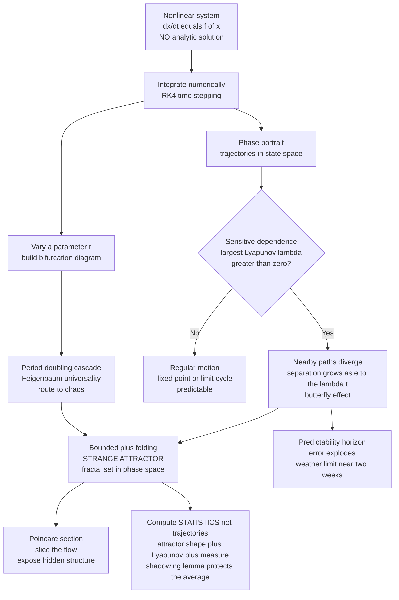

# 🦋 Chaos and Nonlinear Dynamics (Numerically)

> [!abstract] TL;DR
> Most real dynamical systems are **nonlinear** and have **no closed-form solution** — the computer is not a convenience here, it is the *only* instrument that reveals their behaviour, and the entire field was born from a numerical experiment (Edward Lorenz, 1963). **Deterministic chaos** is the profound discovery that simple, noise-free equations can be **effectively unpredictable** long-term. Chaos = **sensitive dependence** on initial conditions (nearby trajectories separate as `e^(λt)`, quantified by a positive **Lyapunov exponent** `λ` that sets a hard **predictability horizon** — why weather dies at ~2 weeks regardless of computing power) **+ boundedness + aperiodicity**. Chaotic motion settles onto **strange attractors** — bounded *fractal* objects in phase space (the **Lorenz** butterfly, **Rössler**) — visible only by simulation. Numerical tools (**phase portraits**, **Poincaré sections**, **bifurcation diagrams**) expose structure that formulas cannot. Systems slide into chaos through the universal **period-doubling cascade** (the **logistic map**, governed by **Feigenbaum's constant**). The deep caveat: because errors also grow exponentially, a *computed* chaotic trajectory is **not** the true one — we reliably compute **statistics** (attractor shape, Lyapunov exponents, invariant measures), not exact long-term paths.

---

## Intuition

**Analogy — the coffee break that founded a science.** In 1961 Edward Lorenz set a weather simulation running on a room-sized computer, went for a coffee, and later restarted the run partway through — typing in the numbers from a printout that had been rounded to three decimal places instead of the machine's internal six. He expected the same forecast. Instead the two runs, starting from states that differed by less than one part in a thousand, tracked each other for a while and then diverged into *completely different weather*. There was no bug and no randomness in his equations — they were perfectly deterministic. The tiny rounding difference had been **amplified exponentially** until it dominated everything.

That is chaos: deterministic equations (no chance, no dice) whose outcomes are so **sensitive to initial conditions** that the smallest difference explodes. It is why weather is unpredictable beyond roughly two weeks *even in principle* — not because our models are crude, but because you can never measure today's atmosphere with infinite precision, and any error doubles and redoubles until the forecast is worthless. These nonlinear systems have **no formulas** to solve; they exist only as their numerically-unfolded, infinitely-intricate behaviour. The computer is the microscope that first made that behaviour visible, and it remains the only way to see it.

---

## How It Works

### Core Mechanics

1. **Nonlinearity is why we need the computer.** A *linear* system (`dx/dt = A x`) can be solved in closed form: its motions are sums of exponentials and sinusoids that decay, grow, or oscillate regularly. The moment you add **nonlinear terms** — products like `XY`, `XZ`, `x(1-x)` — that neat toolbox collapses. There is generally **no analytic solution**. The only way forward is to integrate the equations *numerically*, one small step at a time, using the time-stepping methods introduced in the sibling note on [[Initial_Value_Problems_and_Euler_Methods]] and refined by higher-order schemes (Runge_Kutta_and_Adaptive_Methods). Nonlinear dynamics is therefore a field that *could not exist* before computers — it was discovered by numerical experiment.

2. **Deterministic chaos — "deterministic but unpredictable."** Chaos is not noise. The evolution law `dx/dt = f(x)` is fully deterministic: today's state uniquely fixes all future states. Yet the long-term behaviour is **effectively unpredictable**. The three ingredients that together *define* chaos are: **sensitive dependence** (nearby states diverge exponentially), **boundedness** (the motion stays in a finite region), and **aperiodicity** (it never exactly repeats). Determinism and predictability are *different things*, and chaos is precisely the gap between them.

3. **Sensitive dependence — the butterfly effect.** Take two initial conditions separated by a tiny vector of size `δ₀`. Their separation grows *on average* as `|δ(t)| ≈ δ₀ · e^(λt)`, where `λ` is the **largest Lyapunov exponent**. If `λ > 0`, the divergence is exponential — this is the mathematical signature of chaos. Stretching pulls nearby points apart; folding (from boundedness) keeps them corralled.

4. **The Lyapunov exponent sets a predictability horizon.** If you know the initial state to precision `δ₀` and can tolerate error up to `Δ`, the forecast stays useful only until `δ₀ e^(λt) ≈ Δ`, i.e. for `t_pred ≈ (1/λ) · ln(Δ/δ₀)`. Because the dependence on `δ₀` is only **logarithmic**, improving your measurements a *millionfold* buys only a *handful* of extra doubling-times of skill. This logarithmic wall — not model quality — is why deterministic weather forecasts collapse near two weeks. Numerically, `λ` is estimated by evolving a tiny perturbation and measuring its average exponential growth rate.

5. **Strange attractors — bounded yet never repeating.** Exponential divergence cannot continue forever inside a finite region, so trajectories are repeatedly *folded* back. The set they are drawn onto is a **strange attractor**: a bounded object of *zero volume* with **fractal** (non-integer) dimension. The Lorenz attractor's two-lobed "butterfly" and the Rössler attractor's folded band are the icons. The system is confined for all time yet its path never closes — an object that has no formula and is visualised *only* by simulation.

6. **Phase space, Poincaré sections, and return maps.** A **phase portrait** plots trajectories in state space (axes are the state variables) rather than versus time, turning dynamics into geometry. A **Poincaré section** slices that flow with a lower-dimensional surface and records only the punctures — reducing a continuous 3D flow to a 2D map, which exposes hidden periodicity and the attractor's fractal cross-section. **Return maps** (plotting `x_{n+1}` against `x_n` from those punctures) reveal deterministic structure lurking inside apparently random time series — order hiding within the noise.

7. **The route to chaos — bifurcations and universality.** Systems do not become chaotic all at once; they do so as a control parameter is turned. The **logistic map** `x_{n+1} = r·x_n·(1 - x_n)` is the canonical example: as `r` rises, a stable fixed point splits into a 2-cycle, then a 4-cycle, 8-cycle, ... — a **period-doubling cascade** that accumulates at `r ≈ 3.5699`, beyond which lies chaos. Astonishingly, the *ratio* of successive bifurcation spacings converges to a **universal** constant, **Feigenbaum's number δ ≈ 4.6692**, the *same* for wildly different systems (dripping taps, circuits, convection). Period-doubling is one route; **intermittency** and **quasiperiodic** routes are others. A **bifurcation diagram** — plotting the long-term states against the parameter — is a numerical *map of a system's entire behavioural repertoire*.

8. **The deep numerical caveat — we compute statistics, not trajectories.** Here is the twist that makes chaos a lesson in humility. Because trajectories diverge exponentially, **numerical errors diverge exponentially too**. After enough steps, a computed chaotic trajectory has *no relationship* to the true trajectory from the same initial condition — round-off (see [[Floating_Point_and_Numerical_Error]]) has been amplified past the point of meaning. What saves us is the **shadowing lemma**: near a computed noisy trajectory there exists a *true* trajectory (from a slightly different start) that it stays close to. So the simulation is representative even though it is not exact. The practical upshot: we do not trust the *exact* long-term path; we compute reliable **statistics** — the attractor's shape, its fractal dimension, the Lyapunov spectrum, and the **invariant measure** (how often the system visits each region). This is a profound statement about what simulation can and cannot deliver.

### Flow / Architecture



---

## Key Concepts

### Secondary Level

- **Nonlinear:** the response is not proportional to the cause — doubling the input does not double the output. Almost every real system (weather, a swinging double pendulum, populations) is nonlinear, and nonlinear systems usually cannot be solved with a formula.
- **Deterministic chaos:** fixed rules with *no randomness* can still produce behaviour you cannot predict far ahead, because tiny differences in the start explode.
- **Butterfly effect:** a tiny change now leads to a huge change later. "A butterfly's wingbeat in Brazil could set off a tornado in Texas" is a metaphor for sensitive dependence, not literal cause.
- **Strange attractor:** the endlessly looping-but-never-repeating shape a chaotic system traces out (the Lorenz "butterfly") — bounded, yet infinitely intricate.

### Undergraduate Level

- **Sensitive dependence and the Lyapunov exponent `λ`:** separation of nearby trajectories grows as `δ₀ e^(λt)`. A **positive** `λ` *is* the definition of chaos; `λ ≤ 0` means order. Estimated numerically by tracking a small perturbation's average log-growth.
- **Predictability horizon:** `t_pred ≈ (1/λ) ln(Δ/δ₀)`. Logarithmic in precision — so better instruments buy shockingly little forecast time. This is the principled reason weather forecasting turned to **ensembles**.
- **Phase portrait and Poincaré section:** plot state-vs-state, not state-vs-time; slice the flow to drop a dimension and reveal periodicity and fractal cross-sections.
- **Logistic map and period doubling:** `x_{n+1} = r x_n (1 - x_n)`. Sweeping `r` produces the bifurcation diagram — a stable point, then a 2-cycle, 4-cycle, 8-cycle, cascading into chaos at `r ≈ 3.5699`. The classic minimal model of the *route* to chaos.
- **Classic chaotic systems:** Lorenz (convection/weather), the double pendulum and driven damped/Duffing pendulum (mechanical chaos), the three-body problem, the Hénon map.

### Graduate Level

- **Lyapunov spectrum:** a `d`-dimensional system has `d` Lyapunov exponents `λ₁ ≥ λ₂ ≥ ... ≥ λ_d`, computed by evolving an orthonormal frame under the linearised flow with periodic Gram–Schmidt re-orthonormalisation (Benettin's algorithm). Chaos requires `λ₁ > 0`; the sum `Σλᵢ < 0` reflects phase-space contraction onto the attractor.
- **Fractal dimension and invariant measure:** the strange attractor has non-integer dimension (box-counting / correlation dimension); the **Kaplan–Yorke** formula ties this to the Lyapunov spectrum. The **invariant measure** (natural/SRB measure) gives the long-run frequency of visiting each region — the object that makes chaotic *statistics* well-defined even when trajectories are not.
- **Feigenbaum universality:** the period-doubling ratio `δ ≈ 4.6692` and the scaling constant `α ≈ 2.5029` are universal for smooth unimodal maps — explained by renormalization-group analysis. The *same* route appears across unrelated physical systems.
- **Shadowing lemma and backward error:** for hyperbolic systems a numerically computed (noisy) orbit is uniformly close to some *exact* orbit. This — not per-step accuracy — is what justifies trusting simulated attractor statistics, and it reframes what "correct" means for a chaotic solver.
- **Routes to chaos:** period-doubling, quasiperiodic (Ruelle–Takens–Newhouse), and intermittency (Pomeau–Manneville) — distinguishable numerically by their bifurcation and spectral signatures.

---

## Python Demo

```python
# Exploring chaos numerically, three classic experiments in one script:
#   (a) integrate the LORENZ system with RK4 and plot its STRANGE ATTRACTOR
#       (the butterfly) in phase space;
#   (b) SENSITIVE DEPENDENCE: two runs whose starts differ by 1e-8 -> plot
#       their separation vs time on a LOG axis, showing EXPONENTIAL divergence,
#       and estimate the largest LYAPUNOV exponent from the slope;
#   (c) the LOGISTIC MAP bifurcation diagram: the period-doubling cascade
#       (route to chaos) as the parameter r increases.
# Requires: numpy, matplotlib.

import numpy as np
import matplotlib.pyplot as plt

# ------------------------------------------------------------------
# Lorenz 1963 system:  x' = sigma (y - x)
#                      y' = x (rho - z) - y
#                      z' = x y - beta z
# Classic chaotic parameters (sigma, rho, beta) = (10, 28, 8/3).
# ------------------------------------------------------------------
sigma, rho, beta = 10.0, 28.0, 8.0 / 3.0

def lorenz(state):
    x, y, z = state
    return np.array([sigma * (y - x),
                     x * (rho - z) - y,
                     x * y - beta * z])

def rk4_step(f, s, h):
    k1 = f(s)
    k2 = f(s + 0.5 * h * k1)
    k3 = f(s + 0.5 * h * k2)
    k4 = f(s + h * k3)
    return s + (h / 6.0) * (k1 + 2 * k2 + 2 * k3 + k4)

def integrate(f, s0, h, n):
    traj = np.empty((n + 1, len(s0)))
    traj[0] = s0
    for i in range(n):
        traj[i + 1] = rk4_step(f, traj[i], h)
    return traj

# ---- (a) Strange attractor -----------------------------------------------
h, n = 0.01, 10000
traj = integrate(lorenz, np.array([1.0, 1.0, 1.0]), h, n)

# ---- (b) Sensitive dependence + Lyapunov estimate ------------------------
s0 = np.array([1.0, 1.0, 1.0])
s0b = s0 + np.array([1e-8, 0.0, 0.0])   # perturb by 1e-8 in x
a = integrate(lorenz, s0,  h, n)
b = integrate(lorenz, s0b, h, n)
sep = np.linalg.norm(a - b, axis=1)     # Euclidean separation vs step
t = np.arange(n + 1) * h

# Fit the log-separation in the exponential-growth window (before it
# saturates at the attractor diameter). Slope of ln(sep) vs t = lambda_1.
mask = (sep > 1e-7) & (sep < 5.0)
lam = np.polyfit(t[mask], np.log(sep[mask]), 1)[0]
print(f"Estimated largest Lyapunov exponent lambda ~ {lam:.3f}  (Lorenz ~ 0.906)")
print(f"Predictability horizon for tolerance 1.0: t ~ {np.log(1.0 / 1e-8) / lam:.1f} time units")

# ---- (c) Logistic map bifurcation diagram --------------------------------
#   x_{n+1} = r x_n (1 - x_n).  Sweep r, discard transient, keep attractor.
r_vals = np.linspace(2.5, 4.0, 2000)
n_transient, n_keep = 400, 200
R, X = [], []
for r in r_vals:
    x = 0.5
    for _ in range(n_transient):          # let transients die out
        x = r * x * (1.0 - x)
    for _ in range(n_keep):               # record the long-term set
        x = r * x * (1.0 - x)
        R.append(r); X.append(x)

# ------------------------------ Plots -------------------------------------
fig = plt.figure(figsize=(16, 5))

ax1 = fig.add_subplot(1, 3, 1)
ax1.plot(traj[:, 0], traj[:, 2], lw=0.4, color='navy')   # x-z projection
ax1.set_xlabel('x'); ax1.set_ylabel('z')
ax1.set_title('(a) Lorenz strange attractor (the butterfly)')

ax2 = fig.add_subplot(1, 3, 2)
ax2.semilogy(t, sep, lw=0.8, color='crimson', label='separation')
ax2.semilogy(t[mask], 1e-8 * np.exp(lam * t[mask]), 'k--',
             label=f'e^(lambda t), lambda={lam:.2f}')
ax2.set_xlabel('time'); ax2.set_ylabel('separation (log scale)')
ax2.set_title('(b) Sensitive dependence: exponential divergence')
ax2.legend(loc='lower right')

ax3 = fig.add_subplot(1, 3, 3)
ax3.plot(R, X, ',', color='black', alpha=0.25)   # comma marker = 1 pixel
ax3.set_xlabel('parameter r'); ax3.set_ylabel('long-term x')
ax3.set_title('(c) Logistic map: period-doubling route to chaos')

plt.tight_layout()
plt.show()
```

Running this prints a Lyapunov estimate near `0.9` (the accepted Lorenz value is `≈ 0.906`) and a predictability horizon of roughly 20 time units, then draws three panels. Panel (a) is the unmistakable two-winged **butterfly** — a bounded fractal the trajectory fills forever without repeating. Panel (b) shows the two near-identical starts staying glued together, then peeling apart in a *straight line on the log axis* (pure exponential growth), before saturating once the gap reaches the attractor's own size — the visual proof that prediction has a hard wall. Panel (c) is the iconic **bifurcation diagram**: a single curve that forks into 2, then 4, then 8 branches in an ever-faster cascade before dissolving into the black mist of chaos near `r ≈ 3.57`, shot through with white *periodic windows*. Three short experiments, and the entire skeleton of chaos theory is on the screen — none of it reachable by pen and paper.

---

## Real-World Applications

- **Weather and climate.** The Lorenz system is a toy model of atmospheric convection, and its chaos is *the* reason single deterministic forecasts are useless beyond ~2 weeks. Operational centres therefore run **ensemble forecasting** — dozens of runs from slightly perturbed initial states — and report probabilities rather than a single future, exactly as [[Ensemble_Forecasting_and_Uncertainty]] and [[Numerical_Weather_Prediction]] describe.
- **Celestial mechanics.** The Solar System is chaotic on ~5-million-year timescales; the inner planets' orbits have positive Lyapunov exponents, so their precise positions are unknowable in the deep future even with perfect Newtonian gravity. This is the chaotic heart of the three-body problem explored in the sibling note The_N_Body_Problem_and_Gravitational_Simulation.
- **Fluid turbulence.** The transition from smooth to turbulent flow follows chaotic routes (period-doubling, quasiperiodicity), linking nonlinear dynamics to the onset of turbulence.
- **Engineering and circuits.** Chua's circuit and other nonlinear electronics produce laboratory strange attractors; chaos is deliberately *controlled* (OGY method) to stabilise lasers, or *exploited* for secure communication and mixing.
- **Population and disease dynamics.** The logistic and Ricker maps model boom-bust animal populations; chaotic dynamics appear in measles epidemics and other seasonally forced systems.
- **Chemistry and physiology.** The Belousov–Zhabotinsky reaction oscillates and can go chaotic; cardiac fibrillation and EEG dynamics are studied as chaotic/nonlinear systems.

---

## Common Pitfalls

- **Trusting a single long chaotic trajectory.** After enough steps your computed path has *no* pointwise relation to the true one — errors grew exponentially. Report **statistics** (attractor shape, Lyapunov exponents, invariant measure), never the exact late-time state. This is the shadowing-lemma lesson, not a coding bug.
- **Blaming the solver for divergence.** Two runs (different step sizes, different machines, single vs double precision) *will* diverge on a chaotic system. That is physics, not a mistake. Only ensemble/statistical quantities should agree.
- **Estimating `λ` over the wrong window.** Fit the log-separation *only* in the exponential-growth regime. Include the early transient or the post-saturation plateau (where the gap is capped by the attractor's diameter) and your Lyapunov estimate is garbage.
- **Too-large a time step masquerading as chaos.** An unstable or under-resolved integrator can *manufacture* fake "chaos." Always confirm results survive halving `h` (in a statistical sense) and use an accurate scheme (RK4 or adaptive), not raw Euler.
- **Confusing chaos with noise.** Chaos is *deterministic*; a return map or Poincaré section reveals crisp geometric structure where true noise would show none. Never model a chaotic series as random without checking.
- **Ignoring transients in bifurcation diagrams.** Plotting iterates before transients decay smears the diagram. Discard the first few hundred iterations at each parameter value, then record.
- **Forgetting 3D is the minimum for continuous chaos.** The Poincaré–Bendixson theorem forbids chaos in 2D autonomous flows; a smooth continuous system needs at least three state variables (maps can be chaotic in 1D).

---

## Related Concepts

- [[Initial_Value_Problems_and_Euler_Methods]] — the time-stepping foundation; chaos is what happens when you integrate a *nonlinear* IVP and errors amplify instead of average out.
- [[Floating_Point_and_Numerical_Error]] — round-off is the "tiny perturbation" that chaos magnifies; it is why computed trajectories only *shadow* real ones.
- [[Chaos_Theory_and_Sensitive_Dependence]] — the systems-thinking companion: the butterfly effect, Lyapunov exponents, and predictability horizons from the complexity-science angle.
- [[Dynamical_Systems_and_Attractors]] — the phase-space viewpoint (fixed points, limit cycles, tori, strange attractors) that this note simulates.
- [[Bifurcations_and_Tipping_Points]] — the parameter-driven qualitative changes that constitute the *route* to chaos and the tipping-point language of complex systems.
- [[Fractals_and_Self_Similarity]] — strange attractors are fractal; the same self-similar geometry underlies their non-integer dimension.
- [[Nonlinearity_and_Feedback]] — nonlinearity (stretch-and-fold) is the mandatory ingredient without which chaos is impossible.
- [[Systems_of_ODEs]] — the coupled first-order form (`dx/dt = f(x)`) that the Lorenz and pendulum systems are written in.
- [[First_Order_ODEs]] — the atomic building block behind every dynamical system integrated here.
- [[Oscillations_and_SHM]] — the *linear*, perfectly predictable oscillator against which chaotic (driven, nonlinear) oscillators are contrasted.
- [[Hamiltonian_Mechanics]] — conservative chaos (double pendulum, three-body) lives in Hamiltonian phase space and demands symplectic integrators.
- [[Turbulence_and_Instabilities]] — fluid turbulence as a high-dimensional relative of low-dimensional chaos, reached via chaotic transitions.
- [[Newtons_Laws_and_Kinematics]] — the deterministic laws whose *nonlinearity* produces unpredictability, dissolving the clockwork-universe intuition.
- [[Ensemble_Forecasting_and_Uncertainty]] — the practical response to the predictability horizon: forecast a *distribution*, not a point.
- [[Numerical_Weather_Prediction]] — the applied arena where Lorenz's discovery reshaped how forecasts are made.

Within this Computational Physics vault, this note continues the ODE thread begun in [[Initial_Value_Problems_and_Euler_Methods]] and refined in Runge_Kutta_and_Adaptive_Methods; it connects to The_N_Body_Problem_and_Gravitational_Simulation (chaotic gravitational dynamics), rests on the round-off floor of [[Floating_Point_and_Numerical_Error]], and its "we compute statistics, not trajectories" moral is a centrepiece of The_Reach_and_Future_of_Computational_Physics.

---

## Review Questions

1. **(Conceptual)** A system is fully deterministic — its equations contain no random term at all — yet its long-term behaviour is called "unpredictable." Reconcile these two statements precisely, using the largest Lyapunov exponent and the predictability-horizon formula `t_pred ≈ (1/λ) ln(Δ/δ₀)`. Why does improving your initial measurement a *millionfold* extend the useful forecast by only a small additive amount?
2. **(Scenario)** You integrate the Lorenz system twice from the *same* printed initial condition, once in single precision and once in double, and after 40 time units the two trajectories bear no resemblance to each other. Your colleague concludes the code has a bug. Explain why this divergence is expected, what the shadowing lemma guarantees despite it, and which quantities you *would* expect the two runs to agree on.
3. **(Trade-off)** You must characterise an unfamiliar nonlinear oscillator. Contrast what a **phase portrait**, a **Poincaré section**, and a **bifurcation diagram** each reveal, what each costs to compute, and what each can miss. If you could produce only one to decide whether the system is chaotic and *how* it became so, which would you choose and why?

---

## Sources

- Lorenz, E. N. (1963). "Deterministic Nonperiodic Flow." *Journal of the Atmospheric Sciences*, 20(2), 130–141. — the founding numerical experiment.
- Strogatz, S. H. (2015). *Nonlinear Dynamics and Chaos* (2nd ed.). Westview Press. — the standard text on Lyapunov exponents, bifurcations, and strange attractors.
- Feigenbaum, M. J. (1978). "Quantitative Universality for a Class of Nonlinear Transformations." *Journal of Statistical Physics*, 19(1), 25–52. — the universal period-doubling constant.
- Ott, E. (2002). *Chaos in Dynamical Systems* (2nd ed.). Cambridge University Press. — fractal dimensions, invariant measures, control of chaos.
- Press, W. H., Teukolsky, S. A., Vetterling, W. T. & Flannery, B. P. (2007). *Numerical Recipes* (3rd ed.), Ch. 17. — practical numerical integration and the shadowing caveat.

---

#computational-physics #chaos #lorenz-attractor #lyapunov-exponent #bifurcation
