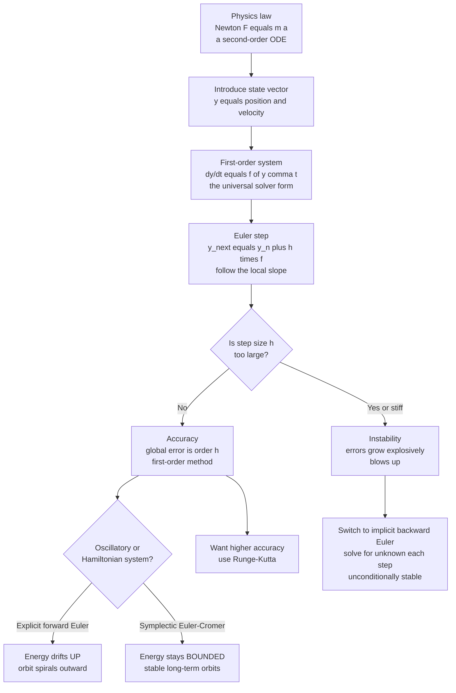

# 🧭 Initial Value Problems and Euler Methods

> [!abstract] TL;DR
> Almost all of dynamics — Newton's laws, circuits, chemical kinetics, populations — is an **initial value problem (IVP)**: given the state *now* and a rule for how it changes, `dy/dt = f(y, t)`, evolve it forward in time. Recast any high-order equation as a **first-order system** with a state vector, and the simplest solver — the **Euler method** (`y_{n+1} = y_n + h·f(y_n, t_n)`, "follow the local slope") — steps it forward. Euler introduces the two ideas that govern *every* integrator: **order of accuracy** (Euler is first-order, `O(h)`) and, more subtly, **numerical stability** (explicit Euler can blow up on stiff problems and systematically *gains* energy on oscillators). Understanding these flaws motivates Runge-Kutta, implicit, and symplectic methods.

---

## Intuition

**Analogy:** Newton's second law is oddly unhelpful at first glance. It tells you the planet's *acceleration right now* — but what you actually want to know is where the planet will be in a year. The computer's answer is beautifully simple: if you know where you are and which way you're heading, take a tiny step in that direction, then look again and repeat. It is exactly like navigating through fog by taking one short step, rechecking your compass, and stepping again.

That "follow the arrows" idea *is* Euler's method, and it is the seed of all dynamical simulation. The catch — the reason this note has a sequel — is that naive stepping quietly cheats. On a swinging pendulum or an orbiting planet, plain forward Euler slowly *leaks* or *gains* energy: the orbit spirals outward forever, even though real gravity would keep it closed. Physics needs smarter steps, but every one of them starts from this fog-walking picture.

---

## How It Works

### Core Mechanics

1. **Everything dynamical is an IVP.** An initial value problem gives you the state at a starting time and a differential rule for its rate of change: `dy/dt = f(y, t)`, with `y(t_0) = y_0`. Newton's laws, RC circuits, reaction kinetics, and predator-prey models are all IVPs. Solving one means marching that state forward in discrete time steps of size `h`.

2. **Reduce physics to a first-order system.** Newton's law `F = m·a` is *second* order (it involves acceleration, the second derivative of position). The universal trick is to introduce a **state vector** that bundles position *and* velocity: let `y = [x, v]`. Then position's derivative is velocity and velocity's derivative is force over mass:
   $$\frac{d}{dt}\begin{bmatrix} x \\ v \end{bmatrix} = \begin{bmatrix} v \\ F(x, v, t)/m \end{bmatrix} = f(y, t)$$
   Any order-$n$ ODE becomes a system of $n$ first-order ODEs this way. This `dy/dt = f(y, t)` form is what *every* solver expects — Euler, Runge-Kutta, and the rest all operate on this single canonical shape.

3. **The Euler step: follow the local slope.** Approximate the derivative by its definition and rearrange. Over a small interval `h`, the state moves along the tangent line defined by the current slope `f`:
   $$y_{n+1} = y_n + h \cdot f(y_n, t_n)$$
   Geometrically you evaluate the arrow (the vector field `f`) at where you are, and walk along it for time `h`. Repeat. That is the entire method — one line of code.

4. **Local vs global error and order.** Euler is the first-order Taylor expansion of the true solution, so it drops the `O(h^2)` term. The error committed in a *single* step (the **local truncation error**) is `O(h^2)`. Over a fixed time interval you take `~1/h` steps, so the errors accumulate into a **global error** of `O(h)`. This is what "first-order" means: halve the step size, halve the total error. A general method of **order** `p` has global error `O(h^p)` — the single most important number describing a solver's accuracy.

5. **Stability is a separate issue from accuracy.** Even a formally "accurate" method can be **unstable**: if the step is too large, errors do not just accumulate slowly — they *grow explosively*, doubling every step until the numbers overflow. For the test equation `y' = λy`, explicit Euler is stable only when `|1 + hλ| ≤ 1`, a small disk in the complex plane. Step outside that **stability region** and the simulation detonates regardless of how "small" `h` feels physically.

6. **Stiffness forces the crisis.** A **stiff** system has widely separated timescales — a fast-decaying transient riding on top of slow interesting dynamics (a fast and a slow chemical reaction, say). Stability, not accuracy, then dictates the step: you must take tiny steps to keep the *fast* mode stable, even long after it has died and you only care about the slow mode. Explicit methods choke here.

7. **Explicit vs implicit — the fundamental trade-off.** **Explicit** (forward Euler) evaluates `f` at the *known* current state: cheap per step, but a limited stability region. **Implicit** (backward Euler, `y_{n+1} = y_n + h·f(y_{n+1}, t_{n+1})`) evaluates `f` at the *unknown* future state, so each step requires *solving an equation* — expensive — but it is unconditionally stable and is the right tool for stiff problems.

8. **Energy drift — the physics-specific flaw.** On oscillatory or Hamiltonian systems, explicit Euler systematically *gains* energy (the orbit spirals outward), while backward Euler *loses* energy (it damps toward the origin). Neither conserves energy, so both are wrong over long times. The fix is a **symplectic integrator** — the semi-implicit **Euler-Cromer** method (update velocity first, then use the *new* velocity to update position) is a one-line change that keeps energy *bounded* forever. This is why orbits and molecular dynamics use symplectic methods, not plain Euler.

### Flow / Architecture



---

## Key Concepts

### Secondary Level

- **Initial value problem (IVP):** you are given the state *now* plus a rule for how fast it changes, and you predict the future. "The car is here going this speed; where is it in ten seconds?"
- **Euler's method:** take a small time step `h`, move along the current velocity/slope, then re-evaluate. `new = old + h × rate`.
- **Step size `h`:** smaller steps are more accurate but cost more computation. There is always a trade-off.

### Undergraduate Level

- **First-order reduction:** a second-order ODE like `F = m·a` becomes two coupled first-order ODEs by treating position and velocity as independent state variables `y = [x, v]`. The canonical form `dy/dt = f(y, t)` is what all solvers consume.
- **Order of accuracy:** local truncation error `O(h^2)` per step accumulates to global error `O(h)` — Euler is *first-order*. Halving `h` halves the error. A log-log plot of error vs `h` has slope equal to the order.
- **Stability region:** for `y' = λy`, forward Euler's amplification factor is `1 + hλ`; the method is stable only inside `|1 + hλ| ≤ 1`. Accuracy and stability are *different* constraints.
- **Energy drift:** apply forward Euler to a simple harmonic oscillator and the total energy grows every period — the phase-space orbit spirals outward. This is a structural defect, not a small numerical error.

### Graduate Level

- **Stiffness:** systems with eigenvalues spanning many orders of magnitude force `h ≤ C / |λ_fast|` for *stability* even when accuracy would allow far larger steps. Quantified by the stiffness ratio `|λ_max| / |λ_min|`.
- **Implicit methods and A-stability:** backward Euler solves `y_{n+1} = y_n + h·f(y_{n+1}, t_{n+1})` — a (possibly nonlinear) root-find each step — and is *A-stable*: stable for any `h > 0` when the true system is dissipative. The cost buys unconditional stability.
- **Symplectic integrators:** Euler-Cromer, Verlet, and leapfrog preserve the symplectic two-form of Hamiltonian phase space. They do not conserve energy exactly, but the energy error stays *bounded and oscillatory* rather than drifting — essential for million-step orbital and molecular-dynamics runs.
- **Modified equation analysis:** a numerical scheme exactly solves a *perturbed* ODE (the "modified equation"). For symplectic methods that perturbed system is itself Hamiltonian, which is *why* their energy error stays bounded — a deep result from backward error analysis.

---

## Python Demo

```python
# Integrating the simple harmonic oscillator (SHO) as an initial value problem.
# Demonstrates: (a) forward Euler's error and ENERGY GAIN (spiral-out),
#               (b) first-order O(h) accuracy on a log-log plot,
#               (c) symplectic Euler-Cromer keeping energy BOUNDED.
# Requires: numpy, matplotlib.

import numpy as np
import matplotlib.pyplot as plt

# ---- Physics: SHO  x'' = -omega^2 x, written as a first-order system ----
# State vector y = [x, v].  f(y) = [v, -omega^2 * x].
omega = 2.0 * np.pi          # angular frequency -> period T = 1.0
x0, v0 = 1.0, 0.0            # initial state: released from rest at x = 1

def f(y):
    x, v = y
    return np.array([v, -omega**2 * x])

def energy(y):
    x, v = y
    return 0.5 * v**2 + 0.5 * omega**2 * x**2   # KE + PE per unit mass

def exact(t):
    return x0 * np.cos(omega * t) + (v0 / omega) * np.sin(omega * t)

# ---- (a) Forward (explicit) Euler: y_{n+1} = y_n + h f(y_n) ----
def forward_euler(h, t_end):
    steps = int(t_end / h)
    ys = np.empty((steps + 1, 2))
    ys[0] = [x0, v0]
    for n in range(steps):
        ys[n + 1] = ys[n] + h * f(ys[n])
    t = np.linspace(0.0, steps * h, steps + 1)
    return t, ys

# ---- (c) Symplectic Euler-Cromer: update v first, then x with the NEW v ----
def euler_cromer(h, t_end):
    steps = int(t_end / h)
    ys = np.empty((steps + 1, 2))
    ys[0] = [x0, v0]
    for n in range(steps):
        x, v = ys[n]
        v_new = v + h * (-omega**2 * x)   # velocity kick first
        x_new = x + h * v_new             # drift using the updated velocity
        ys[n + 1] = [x_new, v_new]
    t = np.linspace(0.0, steps * h, steps + 1)
    return t, ys

# Run both for 8 periods with the SAME step size.
h = 0.01
t_end = 8.0
t_fe, y_fe = forward_euler(h, t_end)
t_ec, y_ec = euler_cromer(h, t_end)

# ---- (b) Accuracy order: global error at t_end vs step size h ----
hs = np.array([0.2, 0.1, 0.05, 0.025, 0.0125, 0.00625]) / omega
errs = []
for hh in hs:
    t, y = forward_euler(hh, 1.0)          # integrate one period
    errs.append(abs(y[-1, 0] - exact(t[-1])))
errs = np.array(errs)

# Fit the log-log slope -> should recover Euler's first order (slope ~ 1).
slope = np.polyfit(np.log(hs), np.log(errs), 1)[0]
print(f"Measured accuracy order of forward Euler: {slope:.2f}  (theory = 1)")

# ---------------------------- Plots ----------------------------
fig, ax = plt.subplots(1, 3, figsize=(16, 4.6))

# Left: trajectory vs exact solution.
ax[0].plot(t_fe, exact(t_fe), 'k-', lw=1.2, label='exact')
ax[0].plot(t_fe, y_fe[:, 0], 'r-', lw=1.0, label='forward Euler')
ax[0].plot(t_ec, y_ec[:, 0], 'b-', lw=1.0, label='Euler-Cromer')
ax[0].set_xlabel('time'); ax[0].set_ylabel('position x')
ax[0].set_title('Trajectory: Euler drifts outward'); ax[0].legend()

# Middle: energy vs time -- the headline result.
E_fe = np.array([energy(s) for s in y_fe])
E_ec = np.array([energy(s) for s in y_ec])
E0 = energy(np.array([x0, v0]))
ax[1].plot(t_fe, E_fe / E0, 'r-', label='forward Euler (gains energy)')
ax[1].plot(t_ec, E_ec / E0, 'b-', label='Euler-Cromer (bounded)')
ax[1].axhline(1.0, color='k', ls='--', lw=0.8, label='exact (conserved)')
ax[1].set_xlabel('time'); ax[1].set_ylabel('energy / E0')
ax[1].set_title('Energy drift: explicit Euler blows up'); ax[1].legend()

# Right: global error vs h on log-log -> slope 1 (first order).
ax[2].loglog(hs, errs, 'ro-', label='measured error')
ax[2].loglog(hs, errs[0] * (hs / hs[0]), 'k--', label='O(h) reference')
ax[2].set_xlabel('step size h'); ax[2].set_ylabel('global error at t=T')
ax[2].set_title(f'First-order accuracy (slope = {slope:.2f})'); ax[2].legend()

plt.tight_layout()
plt.show()
```

Running this prints an accuracy order near `1.00` and produces three panels: the forward-Euler position amplitude visibly grows while Euler-Cromer tracks the exact cosine; the energy panel shows the red curve climbing without bound while the blue curve oscillates in a tight band around 1; and the log-log panel confirms the `O(h)` slope. The one-line difference between `forward_euler` and `euler_cromer` — using the *updated* velocity to advance position — is the entire leap from a broken integrator to a stable symplectic one.

---

## Real-World Applications

- **Orbital mechanics and astrodynamics.** Propagating a spacecraft or planet forward is a gravitational IVP. Explicit Euler's energy drift would make a simulated orbit spiral into or away from the primary within a few revolutions, so mission software uses symplectic (leapfrog) or high-order Runge-Kutta integrators — the concern that motivates the sibling notes on symplectic methods and the N-body problem.
- **Circuit simulation (SPICE).** Node voltages evolve by `C dV/dt = i(V, t)`, an IVP. Real circuits mix nanosecond switching with millisecond envelopes — a textbook *stiff* system — so SPICE relies on implicit backward-Euler and trapezoidal integration rather than explicit stepping.
- **Chemical kinetics and combustion.** Reaction networks span picosecond radical reactions and second-scale bulk conversion. The extreme stiffness ratio makes explicit Euler hopeless; implicit stiff solvers are the industry default.
- **Molecular dynamics.** Simulating protein or material dynamics over billions of steps demands *bounded* energy error, which only symplectic velocity-Verlet delivers — plain Euler would "heat up" the simulation artificially.
- **Real-time game and animation physics.** Semi-implicit (symplectic) Euler is the default cloth, ragdoll, and particle integrator precisely because it stays stable at large frame-rate step sizes where explicit Euler would explode.

---

## Common Pitfalls

- **Confusing accuracy with stability.** A tiny step can still be unstable on a stiff system, and a stable method can still be inaccurate. They are governed by *different* conditions — the stability region versus the order — and must be checked separately.
- **Using explicit Euler for long oscillatory or Hamiltonian runs.** Energy drifts up and the orbit spirals outward no matter how small `h` is; shrinking the step only postpones the divergence. Switch to a symplectic integrator, not a smaller step.
- **Applying explicit methods to stiff problems.** Stability forces absurdly tiny steps dictated by the fastest (often irrelevant) mode. The symptom is a solver that either crawls or produces wild oscillations. The cure is an implicit method.
- **Assuming backward Euler is "safe" because it is stable.** It is unconditionally stable but *numerically dissipative*: it artificially damps oscillations and *loses* energy, which is just as wrong as forward Euler's gain for a conservative system.
- **Forgetting to reduce to first order correctly.** Dropping the velocity from the state vector, or ordering the components inconsistently between `f` and the update, silently produces garbage. The state vector must fully capture the system's instantaneous configuration.
- **Ignoring floating-point round-off at tiny `h`.** Past a point, shrinking `h` stops helping because accumulated round-off from millions of additions dominates truncation error — the concern of the sibling floating-point note.

---

## Related Concepts

- [[First_Order_ODEs]] — the canonical `dy/dt = f(y, t)` form that every IVP solver consumes; Euler discretises exactly this.
- [[Systems_of_ODEs]] — the state-vector reduction turns any high-order physics law into a coupled first-order system.
- [[Second_Order_Linear_ODEs]] — Newton's `F = m·a` is the prototypical second-order ODE that gets reduced to a first-order system here.
- [[Newtons_Laws_and_Kinematics]] — the physical source of most IVPs: acceleration now, position later.
- [[Oscillations_and_SHM]] — the harmonic oscillator used in the demo, whose exact energy conservation exposes Euler's drift.
- [[Hamiltonian_Mechanics]] — the geometric structure that symplectic integrators preserve and explicit Euler violates.
- [[Numerical_ODEs_and_PDEs]] — the broader numerical toolkit (Runge-Kutta, implicit, multistep) that Euler introduces.
- [[Error_Analysis_and_Floating_Point]] — order of accuracy, truncation error, and the round-off floor on step size.
- [[Root_Finding]] — implicit methods require solving an equation for the unknown future state each step.
- [[Dynamical_Systems_and_Attractors]] — the phase-space viewpoint in which Euler's spiral-out is a spurious change of attractor.
- [[Ordinary_Differential_Equations]] — the analytic theory of the ODEs we integrate numerically here.
- [[State_Space_Basics]] — the same state-vector formalism used in control and signals.

Within this Computational Physics vault, this note is the entry point for the sequels **Runge_Kutta_and_Adaptive_Methods** (higher-order accuracy and error-controlled stepping), **Symplectic_Integrators_and_Hamiltonian_Dynamics** (bounded energy for orbits and molecular dynamics), **The_N_Body_Problem_and_Gravitational_Simulation**, **Chaos_and_Nonlinear_Dynamics_Numerically**, and **Floating_Point_and_Numerical_Error** (the round-off floor beneath truncation error).

---

## Review Questions

1. **(Conceptual)** Starting from the first-order Taylor expansion of `y(t_n + h)` about `t_n`, derive the forward Euler update and identify precisely which term makes the local truncation error `O(h^2)`. Then explain why the *global* error over a fixed interval is only `O(h)`.
2. **(Scenario)** You must simulate a stiff chemical reaction network — some species decay in microseconds, the reaction of interest unfolds over seconds — for a full second of physical time. Would you choose explicit forward Euler or implicit backward Euler, and what specifically goes wrong with the other choice? Reference the stability region in your answer.
3. **(Trade-off)** For a frictionless pendulum swung over thousands of periods, forward Euler gains energy and backward Euler loses it, yet Euler-Cromer — differing from forward Euler by a single line — keeps energy bounded. Explain the mechanism behind each behaviour and articulate the trade-off between per-step cost, accuracy order, and long-term energy conservation when choosing among explicit, implicit, and symplectic integrators.

---

## Sources

- Hairer, Nørsett & Wanner, *Solving Ordinary Differential Equations I: Nonstiff Problems* (Springer, 2nd ed.) — Euler, order, and error foundations.
- Hairer & Wanner, *Solving Ordinary Differential Equations II: Stiff and Differential-Algebraic Problems* — stiffness, A-stability, implicit methods.
- Hairer, Lubich & Wanner, *Geometric Numerical Integration* (Springer) — symplectic integrators and backward error / modified-equation analysis.
- LeVeque, *Finite Difference Methods for Ordinary and Partial Differential Equations* (SIAM), Ch. 5–7 — stability regions and absolute stability.
- Press, Teukolsky, Vetterling & Flannery, *Numerical Recipes*, 3rd ed., Ch. 17 — practical integration of initial value problems.

---

#computational-physics #ODEs #euler-method #initial-value-problem #numerical-stability
