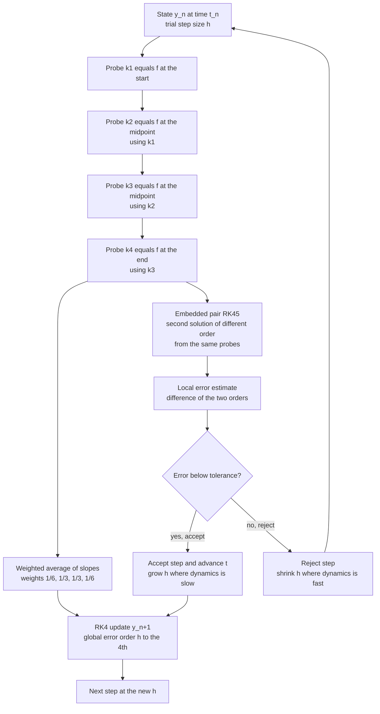

# 🧮 Runge-Kutta and Adaptive Methods

> [!abstract] TL;DR
> **Runge-Kutta (RK)** methods are the general-purpose workhorses for integrating the ordinary differential equations of physics. Instead of blindly stepping along the slope where you are standing (Euler, first-order and often unstable), RK **probes the slope function at several intermediate points inside the step and takes a clever weighted average** that cancels low-order error terms — matching the Taylor series to high order *without ever computing higher derivatives*. The celebrated **RK4** does this four times per step for `O(h^4)` global accuracy, making it vastly more efficient than Euler despite four evaluations per step. The key practical advance is **adaptive step-size control**: **embedded pairs** like RK45 (Fehlberg, Dormand-Prince) compute two solutions of different order from the *same* probes, and their difference estimates the local error, driving `h` to be small where the dynamics is fast and large where it is slow. Understanding order, stability, stiffness (which forces *implicit* solvers), and how to use production integrators like `scipy.integrate.solve_ivp` is essential for reliably simulating dynamical physics.

## Intuition

**Analogy:** Euler's method is a hiker in fog who reads the slope directly under their boots, commits to one long stride in that direction, and only then looks again. Over a big stride the terrain curves away, so they drift off the true path and the error piles up. **Runge-Kutta is a smarter hiker who scouts before committing.** Before taking the stride, they send out a few *probe steps* — a pace forward to feel the slope there, another probe from that tentative point, one to the far edge — and only then take a single stride built from a *weighted average* of all those sampled slopes. Because the probes sample how the slope is *changing* across the step, the averaged stride hugs the curving trail far more tightly than any single reading could.

The classic **RK4** probes four times per step — once at the start, twice at the midpoint, once at the end — and blends them so precisely that its error shrinks as the *fourth power* of the step size. That accuracy made it the default workhorse of physics simulation for a century. And once you have two probes of *different accuracy* to compare, you get something even better: an on-the-fly estimate of your own error, which lets the method **automatically shorten its stride on treacherous fast-changing ground and lengthen it across smooth open terrain** — the essence of adaptive stepping.

---

## How It Works

### Core Mechanics

We are solving an **initial value problem**: `dy/dt = f(t, y)` with `y(t0) = y0`, where `y` may be a vector (position and velocity, all six phase-space coordinates of a body, etc.). The task is to march `y` forward in time in discrete steps of size `h`. This note assumes the framing from the sibling *Initial_Value_Problems_and_Euler_Methods*, where Euler's update `y_{n+1} = y_n + h·f(t_n, y_n)` is shown to be **first-order** (global error `∝ h`) and often unstable — the motivation for everything below.

1. **The Runge-Kutta idea: high order without higher derivatives.** A brute-force way to beat Euler is to add Taylor terms `y + h·f + (h^2/2)·f' + …`, but `f'`, `f''` require differentiating the (often messy, vector) right-hand side by hand. RK's insight is to instead **evaluate `f` itself at several cleverly chosen intermediate points** and combine them with weights tuned so the combination *matches the Taylor expansion to high order*. The extra function evaluations stand in for the derivatives you refused to compute. This is "probe, then step."

2. **RK2 / the midpoint method — the simplest improvement.** Take a half-step with Euler to *estimate* the midpoint, read the slope there, then use that better-informed slope to take the *full* step:
   - `k1 = f(t_n, y_n)` — slope at the start
   - `k2 = f(t_n + h/2, y_n + (h/2)·k1)` — slope at the estimated midpoint
   - `y_{n+1} = y_n + h·k2`

   Geometrically, the midpoint slope averages the beginning-of-step and end-of-step behaviour far better than the start slope alone. This is a **predictor-corrector** idea and buys `O(h^2)` global accuracy for two evaluations — one extra probe, one extra order.

3. **The classic RK4 — four probes, fourth order.** The famous fourth-order method samples the slope four times and blends them with weights `1/6, 1/3, 1/3, 1/6`:
   - `k1 = f(t_n,        y_n)` — slope at the start
   - `k2 = f(t_n + h/2,  y_n + (h/2)·k1)` — slope at the midpoint, using `k1`
   - `k3 = f(t_n + h/2,  y_n + (h/2)·k2)` — slope at the midpoint again, using `k2`
   - `k4 = f(t_n + h,    y_n + h·k3)` — slope at the end, using `k3`
   - `y_{n+1} = y_n + (h/6)·(k1 + 2·k2 + 2·k3 + k4)`

   The double weighting of the two midpoint slopes is what cancels the error terms through third order in the Taylor match, leaving a **global error `∝ h^4`**. Halving `h` cuts the error roughly sixteen-fold — quadrupling your accurate digits' growth rate compared to Euler.

4. **Order and efficiency — why higher order pays.** RK4 costs four evaluations per step versus Euler's one, so naively it looks four times as expensive. But because its error is `O(h^4)`, it can take *far larger* steps for the same accuracy. To reach a global error of `10^-6` on a smooth problem, Euler might need millions of tiny steps while RK4 needs a few thousand — so despite four evaluations per step RK4 wins by orders of magnitude in **accuracy per unit cost**. This is the whole argument for high order. The returns do diminish: very high order (RK8, DOP853) only pays on very *smooth* problems where the extra Taylor terms are meaningful; on rough or noisy right-hand sides the extra evaluations are wasted.

5. **Adaptive step size — the key practical advance.** Real physics has *varying timescales*: a comet crawls near aphelion and whips through perihelion; a stiff chemical mixture reacts explosively then coasts. A fixed `h` is either too coarse for the fast phase or wastefully fine for the slow phase. Adaptive methods **estimate the local error each step and choose `h` to keep it near a target tolerance** — tiny steps where the solution varies rapidly, large steps where it is smooth. This gives both efficiency (no wasted steps) and reliability (a controlled, user-specified accuracy).

6. **Embedded RK pairs — how adaptivity actually works.** To adapt you need a cheap error estimate. **Embedded methods** compute *two* solutions of different order — say order 4 and order 5 — from the **same set of `k` evaluations**, using two different weight vectors. Their **difference estimates the local truncation error** essentially for free. **Runge-Kutta-Fehlberg (RKF45)** and **Dormand-Prince (RK45, "dopri5")** are the classic embedded pairs; dopri5 is the engine behind MATLAB's `ode45` and SciPy's default `RK45`. Given the estimated error `err` and tolerance `tol`, the controller scales the next step as `h_new ≈ safety·h·(tol/err)^(1/(p+1))`, accepting the step if `err ≤ tol` and rejecting-and-retrying with smaller `h` otherwise. An older alternative, **step doubling**, takes one step of size `h` and two of size `h/2` and Richardson-extrapolates their difference as the error estimate — simpler to code from scratch (the Python demo uses it) but roughly three times the work of a true embedded pair.

7. **Stiffness and implicit RK.** Some systems are **stiff**: they contain fast-decaying modes that have long since died out, yet an *explicit* method must still take absurdly tiny steps to stay stable, even though the solution is smooth. Explicit RK crawls. The cure is **implicit Runge-Kutta** and specialized stiff solvers — **BDF / Gear** methods, **Radau** (an implicit RK), and **Rosenbrock** methods — which solve an algebraic (often nonlinear) system each step but remain stable at large `h`. Recognizing stiffness (the step size collapses even though nothing interesting is happening) and switching solvers is a core practical skill.

8. **Stability regions.** Every method has a **region of absolute stability** in the complex `h·λ` plane (where `λ` is an eigenvalue of the local Jacobian). If `h·λ` leaves that region, round-off errors are *amplified* every step and the solution explodes even though the code "ran." Explicit methods (Euler, RK4) have **bounded** stability regions, capping `h` for stiff problems; implicit methods (backward Euler, Radau) have **large or unbounded** (A-stable) regions, which is exactly why they conquer stiffness. Stability, not accuracy, is often what limits the step.

### Flow / Architecture



---

## Key Concepts

### Secondary (intuition level)
- **Probe, then step.** Instead of trusting the slope where you stand, sample it at a few points across the step and take a weighted average. That average tracks a curving solution far better.
- **RK4 is the workhorse.** Four slope evaluations per step give error that shrinks like `h^4` — halve the step, cut the error ~16×. It was the default of physics simulation for a century.
- **Adaptive stepping = smart pacing.** The method takes small steps where things change fast and big steps where things are calm, automatically, to hit a target accuracy.

### Undergraduate (working knowledge)
- **Order of accuracy.** Global error `∝ h^p`: Euler `p=1`, midpoint/RK2 `p=2`, RK4 `p=4`. On a log-log error-vs-`h` plot the slope *is* the order.
- **Accuracy per cost.** RK4 costs 4 evaluations/step but its high order lets it take far larger steps, so for a fixed accuracy it needs vastly fewer total evaluations than Euler on smooth problems.
- **Local vs global error.** Local (per-step) error for an order-`p` method is `O(h^{p+1})`; accumulated over `~1/h` steps this gives global `O(h^p)`. Adaptivity controls the *local* error each step.
- **Embedded pairs.** Two weight sets over the same `k`'s produce order-4 and order-5 answers; their difference is the free error estimate that drives `h`.
- **Stability limit.** Even a high-order explicit method blows up if `h` is too large for the problem's fastest mode; this stability ceiling can bind before accuracy does.

### Graduate (analysis level)
- **Butcher tableau.** Any RK method is fully specified by its coefficients `(a_ij, b_i, c_i)` arranged in a Butcher tableau; **order conditions** are algebraic constraints on these that make the scheme match the Taylor series to order `p`. Embedded pairs add a second row `b*_i`.
- **Regions of absolute stability.** Applying a method to `y' = λy` gives an amplification factor `R(hλ)`; the method is stable where `|R(hλ)| ≤ 1`. Explicit methods have bounded regions; **A-stable** implicit methods contain the entire left half-plane, and **L-stable** ones also damp very stiff modes — essential for `Radau`/`BDF`.
- **Stiffness diagnosis.** Stiffness ratio ≈ `|λ_max| / |λ_min|` of the Jacobian; when large, explicit `h` is capped by `|λ_max|` (stability) while the solution evolves on the `|λ_min|` timescale — the step size collapses for no accuracy reason. Switch to implicit.
- **Step-size controllers.** Beyond the elementary `I` controller, production solvers use **PI controllers** on the error history to avoid oscillating step sizes and repeated rejections, plus dense-output (continuous interpolants) for event detection and uniform sampling.
- **Structure preservation caveat.** RK methods are *not* symplectic; on Hamiltonian systems they slowly drift energy. For long-term conservative dynamics, symplectic and geometric integrators (see below) are preferred — the subject of the sibling *Symplectic_Integrators_and_Hamiltonian_Dynamics*.

---

## Python Demo

```python
# Runge-Kutta and adaptive stepping, two demonstrations:
#   (a) ORDER: integrate the simple harmonic oscillator (small-angle pendulum),
#       whose exact solution is known, and plot global error vs step size h on
#       log-log for Euler (slope 1) and RK4 (slope 4). RK4 reaches the same
#       accuracy with FAR larger/fewer steps -> accuracy per cost.
#   (b) ADAPTIVE: integrate an eccentric Kepler orbit with an RK4 step-doubling
#       error estimate that shrinks h near perihelion (fast) and grows it near
#       aphelion (slow). Plot the orbit (points cluster where h is small) and the
#       step size adapting over time.
import numpy as np
import matplotlib.pyplot as plt

# ---------- generic single steppers ----------
def euler_step(f, t, y, h):
    return y + h * f(t, y)

def rk4_step(f, t, y, h):
    k1 = f(t,          y)
    k2 = f(t + 0.5*h,  y + 0.5*h*k1)
    k3 = f(t + 0.5*h,  y + 0.5*h*k2)
    k4 = f(t + h,      y + h*k3)
    return y + (h/6.0) * (k1 + 2*k2 + 2*k3 + k4)

def integrate_fixed(step, f, y0, t0, t1, h):
    n = max(1, int(round((t1 - t0) / h)))
    h = (t1 - t0) / n                      # land exactly on t1
    t, y = t0, y0.astype(float).copy()
    for _ in range(n):
        y = step(f, t, y, h); t += h
    return y

# ================================================================
# (a) ORDER OF ACCURACY -- simple harmonic oscillator (small pendulum)
#     y = [theta, omega],  y' = [omega, -theta];  exact: theta = cos t
# ================================================================
def sho(t, y):
    return np.array([y[1], -y[0]])

y0   = np.array([1.0, 0.0])
t1   = 10.0
exact = np.array([np.cos(t1), -np.sin(t1)])
hs = np.logspace(-1.0, -2.5, 12)           # h from 0.1 down to ~0.003
err_euler = np.array([np.linalg.norm(integrate_fixed(euler_step, sho, y0, 0, t1, h) - exact) for h in hs])
err_rk4   = np.array([np.linalg.norm(integrate_fixed(rk4_step,   sho, y0, 0, t1, h) - exact) for h in hs])

# fitted slopes (should be ~1 and ~4)
slope_euler = np.polyfit(np.log(hs), np.log(err_euler), 1)[0]
slope_rk4   = np.polyfit(np.log(hs), np.log(err_rk4),   1)[0]
print(f"Fitted convergence order  Euler ~ {slope_euler:.2f}   RK4 ~ {slope_rk4:.2f}")

# steps needed to reach a target accuracy -> the efficiency argument
target = 1e-6
c_e = err_euler[0] / hs[0]          # Euler  err ~ c_e * h
c_r = err_rk4[0]   / hs[0]**4       # RK4    err ~ c_r * h^4
steps_euler = t1 / (target / c_e)                  # 1 eval/step
steps_rk4   = t1 / (target / c_r)**0.25            # 4 evals/step
print(f"To reach global error {target:g}:")
print(f"  Euler needs ~ {steps_euler:10.0f} steps ({steps_euler:10.0f} evals)")
print(f"  RK4   needs ~ {steps_rk4:10.0f} steps ({4*steps_rk4:10.0f} evals)")
print(f"  RK4 uses ~ {steps_euler/(4*steps_rk4):.0f}x FEWER function evaluations")

# ================================================================
# (b) ADAPTIVE STEP SIZE -- eccentric Kepler orbit, RK4 step doubling
#     y = [x, y, vx, vy],  acceleration = -GM * r / |r|^3
# ================================================================
GM = 1.0
def kepler(t, y):
    x, yy, vx, vy = y
    r3 = (x*x + yy*yy) ** 1.5
    return np.array([vx, vy, -GM*x/r3, -GM*yy/r3])

def adaptive_rk4(f, y0, t0, t1, tol=1e-9, h0=0.05):
    """Adaptive RK4 via step doubling: compare one step of h with two of h/2.
    RK4 local error ~ h^5, so (y_two - y_one)/15 estimates it (Richardson)."""
    t, y, h = t0, y0.astype(float).copy(), h0
    T, Y, H = [t], [y.copy()], []
    while t < t1 - 1e-12:
        h = min(h, t1 - t)
        y_one  = rk4_step(f, t, y, h)                       # one full step
        y_half = rk4_step(f, t, y, 0.5*h)                   # two half steps
        y_two  = rk4_step(f, t + 0.5*h, y_half, 0.5*h)
        err = np.linalg.norm(y_two - y_one) / 15.0          # local error estimate
        if err <= tol or h < 1e-9:                          # accept
            t += h
            y = y_two + (y_two - y_one) / 15.0              # local extrapolation
            T.append(t); Y.append(y.copy()); H.append(h)
        # step-size controller (order-5 error -> exponent 1/5)
        scale = 0.9 * (tol / err) ** 0.2 if err > 0 else 4.0
        h *= min(4.0, max(0.2, scale))
    return np.array(T), np.array(Y), np.array(H)

# eccentric orbit: e = 0.7, semi-major a = 1, started at APHELION
e, a = 0.7, 1.0
r_aph = a * (1 + e)
v_aph = np.sqrt(GM * (1 - e) / (a * (1 + e)))
Y0 = np.array([r_aph, 0.0, 0.0, v_aph])
period = 2 * np.pi * np.sqrt(a**3 / GM)
T, Y, H = adaptive_rk4(kepler, Y0, 0.0, 2*period, tol=1e-9, h0=0.02)
print(f"\nAdaptive orbit: {len(H)} accepted steps for 2 orbits "
      f"(step h ranges {H.min():.1e} .. {H.max():.1e})")
print(f"Uniform stepping at the smallest h would need ~ {2*period/H.min():.0f} steps")

# ================================================================
# Plots
# ================================================================
fig, ax = plt.subplots(1, 3, figsize=(16, 5))

# (a) error-order comparison
ax[0].loglog(hs, err_euler, 'o-', color='crimson',  label=f'Euler (order {slope_euler:.1f})')
ax[0].loglog(hs, err_rk4,   's-', color='navy',     label=f'RK4 (order {slope_rk4:.1f})')
ax[0].loglog(hs, c_e*hs,      'k--', alpha=0.5, label='slope 1 reference')
ax[0].loglog(hs, c_r*hs**4,   'k:',  alpha=0.6, label='slope 4 reference')
ax[0].set_xlabel('step size h'); ax[0].set_ylabel('global error at t = 10')
ax[0].set_title('(a) Order of accuracy: Euler vs RK4')
ax[0].grid(True, which='both', alpha=0.3); ax[0].legend(fontsize=8)

# (b) the eccentric orbit, points colored by step size (small near perihelion)
sc = ax[1].scatter(Y[1:, 0], Y[1:, 1], c=np.log10(H), s=14, cmap='viridis')
ax[1].plot(0, 0, '*', color='orange', ms=20, label='focus (star)')
ax[1].set_aspect('equal'); ax[1].set_xlabel('x'); ax[1].set_ylabel('y')
ax[1].set_title('(b) Adaptive orbit: points cluster near perihelion')
ax[1].legend(fontsize=8, loc='upper right')
fig.colorbar(sc, ax=ax[1], label='log10 step size h')

# (c) step size adapting over time
ax[2].semilogy(T[1:], H, '.-', color='teal', ms=3)
for k in (0.5, 1.5):                      # perihelion passages at t = period/2, 3/2 period
    ax[2].axvline(k*period, color='red', ls='--', alpha=0.6)
ax[2].text(0.5*period, H.max(), ' perihelion\n (fast, small h)', color='red', fontsize=8, va='top')
ax[2].set_xlabel('time t'); ax[2].set_ylabel('adaptive step size h')
ax[2].set_title('(c) Step size shrinks where dynamics is fast')
ax[2].grid(True, which='both', alpha=0.3)

plt.tight_layout()
plt.savefig('runge_kutta_adaptive.png', dpi=120)
plt.show()
```

Running this prints fitted convergence orders near **1.0 for Euler and 4.0 for RK4**, and shows the efficiency payoff: to reach a global error of `1e-6`, Euler needs on the order of a million function evaluations while RK4 needs a few thousand — hundreds of times fewer despite four evaluations per step. Panel **(a)** is the signature log-log plot: two straight lines whose *slopes* are the orders (steep RK4 plunging four decades for one decade of `h`, shallow Euler descending one-for-one). Panel **(b)** draws the eccentric orbit with sample points colored by step size — they bunch tightly at perihelion (fast motion, small `h`) and spread out at aphelion. Panel **(c)** shows `h` collapsing by orders of magnitude at each perihelion passage and relaxing in between: adaptivity in action.

---

## Real-World Applications

> **Example — SciPy `solve_ivp` and MATLAB `ode45`.** The default non-stiff integrator in both ecosystems is the **Dormand-Prince RK45 ("dopri5")** embedded pair — a fifth-order solution with an embedded fourth-order error estimate driving adaptive stepping and a dense-output interpolant for smooth plotting and event detection. `solve_ivp` exposes an entire menu: `RK45`, `RK23`, and the high-order `DOP853` for smooth non-stiff problems; `Radau` (implicit RK) and `BDF` for stiff problems; and `LSODA`, which *auto-detects stiffness and switches* between an Adams method and BDF on the fly. Choosing correctly (non-stiff → `RK45`/`DOP853`; stiff → `Radau`/`BDF`) is the everyday practical skill.

> **Example — orbital mechanics and mission design.** Trajectory tools (GMAT, NASA/JPL propagators) integrate spacecraft equations of motion with high-order adaptive RK such as Dormand-Prince RK7(8); adaptive stepping is essential because a transfer orbit spends months coasting far from any body (huge `h`) then screams through a gravity-assist flyby (tiny `h`). This is the working setting behind the sibling *The_N_Body_Problem_and_Gravitational_Simulation*.

> **Example — stiff chemical kinetics and circuit simulation.** Combustion and reaction-network models have rate constants spanning many orders of magnitude — textbook stiffness — so packages like SUNDIALS/CVODE and Cantera use **implicit BDF**, not explicit RK, to avoid step sizes collapsing to nanoseconds. SPICE circuit simulators similarly rely on implicit trapezoidal/Gear integration for the same reason.

> **Example — chaotic and nonlinear dynamics.** Studies of the Lorenz system, driven pendula, and other chaotic flows (see *Chaos_and_Nonlinear_Dynamics_Numerically*) rely on adaptive RK45/DOP853 with tight tolerances, because sensitive dependence means loose steps rapidly poison the trajectory — though only *statistical* features (attractor shape, Lyapunov exponents) survive, never the pointwise long-term path.

---

## Common Pitfalls

- **Defaulting to Euler.** It is first-order and often unstable; for almost any real simulation an RK4 or adaptive RK45 is both more accurate *and* cheaper for a given tolerance. Euler is a teaching tool, not a production integrator.
- **Using explicit RK on a stiff problem.** The step size mysteriously collapses to keep the method stable even though the solution is smooth and slow, and the run crawls. Diagnose stiffness (a huge Jacobian eigenvalue ratio) and switch to `Radau`/`BDF`/`LSODA`; do not just lower the tolerance.
- **Using RK4 for long-term Hamiltonian/orbital integration.** RK methods are not symplectic and slowly *drift the energy*, so an orbit spirals in or out unphysically over millions of steps. For conservative long-term dynamics use a **symplectic integrator** (velocity Verlet, leapfrog) — see *Symplectic_Integrators_and_Hamiltonian_Dynamics*. Adaptive stepping actually *worsens* the drift by breaking the symplectic structure.
- **Mis-setting tolerances.** Too loose (`rtol=1e-2`) silently returns a wrong trajectory that still "looks smooth"; too tight (`1e-13`) wastes enormous effort and eventually hits the round-off floor (see *Floating_Point_and_Numerical_Error*). Set `rtol`/`atol` deliberately, and set `atol` sensibly for components that pass through zero.
- **Adaptive solvers stepping over sharp events.** A large accepted step can leap across a spike, discontinuity, or collision the solver never "saw." Use event functions (`solve_ivp`'s `events=`) and/or cap `max_step`; naive discontinuities (e.g. a switch in the force law) should be handled by restarting the integration at the event.
- **Wrong RHS signature or non-vectorized output.** `solve_ivp` expects `f(t, y)` returning an array shaped like `y`; passing `f(y, t)` (the old `odeint` order) or returning a Python list of wrong shape produces silent nonsense or errors.
- **Reading global order off a single step.** Local error is `O(h^{p+1})`, global is `O(h^p)`; confirm order by the *slope* of a log-log error-vs-`h` plot over many `h`, not one comparison — and note the slope flattens once round-off dominates at very small `h`.

---

## Related Concepts

- [[Ordinary_Differential_Equations]] — the ODEs and initial value problems that Runge-Kutta methods integrate; this note is their numerical engine.
- [[Numerical_ODEs_and_PDEs]] — the broader numerical-analysis treatment of one-step vs multistep methods, order conditions, and stability that RK sits inside.
- [[Floating_Point_and_Numerical_Error]] — why shrinking `h` past `~sqrt(eps)` stops helping (round-off floor) and why adaptive tolerances must respect machine precision.
- [[Hamiltonian_Mechanics]] — the phase-space/energy structure that plain RK fails to conserve, motivating symplectic integrators for long orbital runs.
- [[Oscillations_and_SHM]] — the simple harmonic oscillator used in the demo as the exactly-solvable benchmark for measuring integrator order.
- [[Newtons_Laws_and_Kinematics]] — the second-order equations of motion recast as first-order systems that RK integrates for orbits and trajectories.
- [[Dynamical_Systems_and_Attractors]] — flows and attractors whose trajectories are produced numerically by adaptive RK integration.
- [[Chaos_Theory_and_Sensitive_Dependence]] — why tight-tolerance adaptive RK is needed for chaotic flows, yet only statistical features remain trustworthy long-term.
- [[Root_Finding]] — the nonlinear solves that implicit RK (Radau) and shooting-method boundary problems perform each step.
- [[Computational_Physics_Overview]] — the parent note placing ODE integrators among the method families of computational physics.

---

## Review Questions

**Secondary (conceptual):**
1. In plain terms, what does Runge-Kutta do *differently* from Euler within a single step, and why does "probing before stepping" produce a more accurate result on a curving trajectory?
2. RK4 does four times as much work per step as Euler. Explain why it can still be the *cheaper* method to reach a given accuracy.

**Undergraduate (applied):**
3. You integrate a known-solution ODE and plot global error versus step size `h` on log-log axes. What feature of the plot tells you the method's order, and what slopes would you expect for Euler, the midpoint method, and RK4? What happens to the RK4 line at very small `h`, and why?
4. An embedded pair like RK45 produces two answers per step from the same evaluations. How is the local error estimated, and how is that estimate turned into a decision to accept the step and a choice of the next `h`?
5. For an eccentric orbit, sketch qualitatively how an adaptive step size varies over one period and explain the physics driving the variation.

**Graduate (analysis / trade-off):**
6. Define a stiff problem in terms of the Jacobian spectrum, and explain precisely why an explicit RK4 is forced to take tiny steps on it even when the solution is smooth. What property of implicit methods (Radau, BDF) removes this restriction, and what does it cost per step?
7. You must integrate the solar system for a billion years and separately integrate a stiff combustion network for a few milliseconds. Which solver family would you pick for each — symplectic, explicit adaptive RK, or implicit — and what property of each *problem* drives the choice?
8. Explain why applying adaptive step-size control to a symplectic integrator generally destroys its long-term energy-conservation advantage, and what this implies for the "use RK45 for everything" default.

---

## Sources

- Press, W. H., Teukolsky, S. A., Vetterling, W. T., & Flannery, B. P. — *Numerical Recipes: The Art of Scientific Computing*, 3rd ed., Cambridge Univ. Press, 2007 (Ch. 17: integration of ODEs, adaptive stepsize and RK45).
- Hairer, E., Nørsett, S. P., & Wanner, G. — *Solving Ordinary Differential Equations I: Nonstiff Problems*, 2nd ed., Springer, 1993.
- Hairer, E., & Wanner, G. — *Solving Ordinary Differential Equations II: Stiff and Differential-Algebraic Problems*, 2nd ed., Springer, 1996.
- Dormand, J. R., & Prince, P. J. — "A family of embedded Runge-Kutta formulae," *Journal of Computational and Applied Mathematics*, 6(1), 19-26, 1980.
- Virtanen, P., et al. — "SciPy 1.0: Fundamental Algorithms for Scientific Computing in Python," *Nature Methods*, 17, 261-272, 2020 (documentation: `scipy.integrate.solve_ivp`).

---

#computational-physics #runge-kutta #RK4 #adaptive-step-size #ODE-solvers
