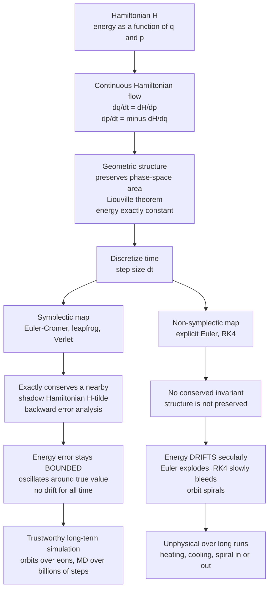

# 🪐 Symplectic Integrators and Hamiltonian Dynamics

> [!abstract] TL;DR
> For **conservative systems integrated over very many periods** — a planet over billions of years, a protein over billions of femtosecond steps — even excellent general-purpose solvers like **RK4 slowly drift the energy**, making orbits spiral and molecular dynamics unphysically heat or cool. The cause is not sloppiness but *structure*: they do not respect the special **symplectic (phase-space-volume) geometry** of Hamiltonian flow. A **symplectic integrator** (Euler-Cromer, leapfrog / Verlet, higher-order Yoshida) makes a different bargain — it is only *approximate* at each instant, yet it **exactly preserves the symplectic structure**, so it exactly conserves a nearby *shadow* Hamiltonian. The payoff is profound: the energy error stays **bounded and oscillating around the true value for all time**, never drifting. This "geometric integration" philosophy — honour the physics, not the per-step number — makes symplectic methods the standard of celestial mechanics, molecular dynamics, and Hamiltonian Monte Carlo.

## Intuition

**Analogy:** Simulate the Earth orbiting the Sun with a standard high-accuracy solver and let it run — not for a year, but for a few million. Watch closely and something absurd happens: the planet slowly **spirals into the Sun** or **drifts away into the dark**. Nothing in the physics does this; the equations conserve energy exactly. The culprit is the *numbers*. Each tiny step commits a tiny error, and those errors don't cancel — they **leak energy in one direction**, and a one-way leak repeated a billion times sinks the planet. It is death by a trillion rounding cuts.

A **symplectic integrator** refuses that trap by striking a different deal. It does *not* try to get each instant perfectly right. Instead it insists on respecting the **deep geometric law of Hamiltonian mechanics** — the conservation of phase-space "area" — even at the cost of small per-step inaccuracy. The consequence is that its energy **never drifts; it only wobbles slightly, forever**, oscillating around the true value like a bounded tremor that never grows. For a single short trajectory the fancy solver may win. But for long-term orbits and molecular dynamics, **honouring the physics beats chasing per-step accuracy** — and it is not even close.

---

## How It Works

### Core mechanics

**1. Hamiltonian dynamics has hidden structure.** A conservative system is described by a **Hamiltonian** $H(q,p)$ (its energy as a function of positions $q$ and momenta $p$). The motion obeys Hamilton's equations,

$$\dot q = \frac{\partial H}{\partial p}, \qquad \dot p = -\frac{\partial H}{\partial q}.$$

This flow does two remarkable things at once. It **conserves energy** ($H$ is constant along trajectories), and, more deeply, it **preserves phase-space volume** — **Liouville's theorem**: a blob of initial conditions is stretched and folded but never compressed or inflated. Geometrically, the flow preserves the *symplectic 2-form* $\omega = \sum_i dq_i \wedge dp_i$; it is a **symplectic** map. See [[Hamiltonian_Mechanics]].

**2. What "symplectic" means for an integrator.** A numerical integrator is a discrete map $(q_n, p_n) \mapsto (q_{n+1}, p_{n+1})$ that approximates the true flow over one step $\Delta t$. It is called **symplectic** if that discrete map **exactly preserves the symplectic structure** — the phase-space-area/volume — even though it is only *approximate in time*. This is the heart of **geometric integration**: preserve the *qualitative, structural* physics (conservation laws, symmetries, reversibility) rather than chase pointwise accuracy.

**3. The key property — bounded energy (the shadow Hamiltonian).** A symplectic method does **not** conserve $H$ exactly. What it conserves exactly is a slightly different, nearby **"shadow" Hamiltonian** $\tilde H = H + \Delta t\, H_1 + \Delta t^2 H_2 + \dots$ (this is **backward error analysis**: the numerical trajectory is the *exact* solution of a perturbed problem). Because $\tilde H$ is exactly conserved and stays $O(\Delta t^p)$ close to $H$, the **true energy error stays bounded and oscillates** around the true value for **all time** — no secular drift. A non-symplectic method conserves no such invariant, so its energy error **accumulates without bound** (Euler explodes, RK4 slowly bleeds).

**4. Simple symplectic methods:**
- **Euler-Cromer / semi-implicit (symplectic) Euler** — the *one-line fix* to explicit Euler: update the **velocity first**, then update the **position using the new velocity**. First-order accurate, but symplectic — energy stays bounded where plain Euler blows up.
- **Leapfrog / Verlet / velocity-Verlet** — **second-order, time-reversible, symplectic**; the workhorse of molecular dynamics and orbital mechanics. Its **kick-drift-kick** form: half **kick** the momentum, full **drift** the position, half **kick** the momentum again.
- **Higher-order symplectic** — **Yoshida** and **Forest-Ruth** methods build 4th- and 6th-order symplectic schemes by *composing* leapfrog steps with cleverly chosen sub-step sizes.

**5. Time-reversibility.** Leapfrog/Verlet is **time-reversible**: run it backwards and it retraces its own path exactly. The underlying physics is also time-reversible, so preserving reversibility is another *structural* property worth honouring — and it is closely tied to the absence of energy drift.

**6. Why RK is not ideal here.** RK4 is *more accurate per step* but **non-symplectic** — over long integrations its energy drifts. The lesson is to **match the method to the physics**: for short or **dissipative** problems (drag, control, stiff chemistry) RK's accuracy and adaptivity win; for **long-term conservative** dynamics, symplectic wins decisively.

### Flow / architecture



---

## Key Concepts

**Secondary (intuition first):**
- **Energy drift.** A good solver can still be *wrong in the long run*: if its tiny errors all point the same way, energy slowly leaks and an orbit spirals. Symplectic methods stop the leak.
- **Bounded, not exact.** A symplectic method doesn't keep energy *perfectly* constant — it lets energy *wobble* a little. The magic is that the wobble never grows: it stays in a fixed band forever.
- **The one-line fix.** Explicit Euler blows up on an orbit; swapping *two lines* so position uses the **just-updated** velocity (Euler-Cromer) tames it. Same cost, wildly better behaviour.
- **Match method to physics.** Fancier is not always better. For a comet you'll track for a billion years, a "less accurate" symplectic step beats a "more accurate" RK4 step.

**Undergraduate (mechanics of the method):**
- **Hamilton's equations & phase space.** State $(q,p)$; flow $\dot q=\partial H/\partial p,\ \dot p=-\partial H/\partial q$; trajectories are curves of constant $H$ in phase space ([[Hamiltonian_Mechanics]], [[Oscillations_and_SHM]]).
- **Symplectic Euler (Euler-Cromer).** $p_{n+1}=p_n+\Delta t\,F(q_n)$, then $q_{n+1}=q_n+\Delta t\,p_{n+1}$. First-order, symplectic. Contrast explicit Euler, which uses $p_n$ for both updates and pumps energy.
- **Velocity-Verlet (leapfrog).** Kick-drift-kick: $p_{n+1/2}=p_n+\tfrac{1}{2}\Delta t\,F(q_n)$; $q_{n+1}=q_n+\Delta t\,p_{n+1/2}$; $p_{n+1}=p_{n+1/2}+\tfrac{1}{2}\Delta t\,F(q_{n+1})$. Second-order, time-reversible, symplectic.
- **Order vs. structure.** RK4 is 4th-order (error $\propto \Delta t^4$ per unit time) but non-symplectic; Verlet is 2nd-order but structure-preserving. Different axes of quality.

**Graduate (system-level judgment):**
- **Symplecticity as area preservation.** The one-step map's Jacobian $M$ satisfies $M^{\top} J M = J$ with $J=\begin{psmallmatrix}0&I\\-I&0\end{psmallmatrix}$; equivalently it preserves $\omega=\sum dq_i\wedge dp_i$ and hence phase-space volume (Liouville) exactly.
- **Backward error analysis & the shadow Hamiltonian.** A symplectic method's numerical trajectory is the *exact* flow of a perturbed $\tilde H = H + O(\Delta t^p)$. Because $\tilde H$ is conserved, energy error is bounded over **exponentially long** times ($e^{c/\Delta t}$), not merely polynomially — the rigorous reason there is no drift.
- **Composition & splitting.** Leapfrog is the symmetric Strang split of $H=T(p)+V(q)$ into exactly solvable kinetic and potential flows; **Yoshida/Forest-Ruth** compose such splits to cancel low-order error terms and reach 4th/6th order while remaining symplectic.
- **Time-symmetry.** Symmetric (self-adjoint) methods have only even-order error terms and no secular energy drift; reversibility and symplecticity together are the structural core.
- **Adaptivity caveat.** Naive per-step **variable timesteps destroy symplecticity** and reintroduce drift; fixes include the *time-transformed / Wisdom-Holman* framework and symmetric step-size control.

---

## Python Demo

```python
# Long-term integration of a HAMILTONIAN system: harmonic oscillator
#   H(q,p) = p^2/2 + q^2/2   (mass=1, spring=1, omega=1);  exact energy E = 0.5(p^2+q^2)
# We compare four integrators over a LONG run and show:
#   (a) energy vs time: explicit Euler EXPLODES, RK4 DRIFTS (secular decay),
#       symplectic (Euler-Cromer, velocity-Verlet) stays BOUNDED forever;
#   (b) phase-space (q,p) orbit: Euler spirals OUT, symplectic traces a CLOSED orbit.
import numpy as np
import matplotlib.pyplot as plt

def force(q):    return -q                     # F = -dV/dq for V = q^2/2
def energy(q, p): return 0.5 * (p**2 + q**2)

q0, p0 = 1.0, 0.0                              # start at max displacement -> E_true = 0.5
E_true = energy(q0, p0)
dt = 0.25

# ---------------- integrators (return arrays q, p) ----------------
def explicit_euler(q0, p0, dt, n):             # NON-symplectic: both updates use OLD values
    q = np.empty(n+1); p = np.empty(n+1); q[0], p[0] = q0, p0
    for k in range(n):
        q[k+1] = q[k] + dt * p[k]
        p[k+1] = p[k] + dt * force(q[k])
    return q, p

def euler_cromer(q0, p0, dt, n):               # SYMPLECTIC (1st order): p first, then q with NEW p
    q = np.empty(n+1); p = np.empty(n+1); q[0], p[0] = q0, p0
    for k in range(n):
        p[k+1] = p[k] + dt * force(q[k])
        q[k+1] = q[k] + dt * p[k+1]
    return q, p

def velocity_verlet(q0, p0, dt, n):            # SYMPLECTIC (2nd order), time-reversible: kick-drift-kick
    q = np.empty(n+1); p = np.empty(n+1); q[0], p[0] = q0, p0
    f = force(q[0])
    for k in range(n):
        p_half = p[k] + 0.5 * dt * f           # half kick
        q[k+1] = q[k] + dt * p_half            # drift
        f      = force(q[k+1])
        p[k+1] = p_half + 0.5 * dt * f         # half kick
    return q, p

def rk4(q0, p0, dt, n):                        # NON-symplectic but 4th-order accurate
    q = np.empty(n+1); p = np.empty(n+1); q[0], p[0] = q0, p0
    deriv = lambda s: np.array([s[1], force(s[0])])
    s = np.array([q0, p0])
    for k in range(n):
        k1 = deriv(s); k2 = deriv(s + 0.5*dt*k1)
        k3 = deriv(s + 0.5*dt*k2); k4 = deriv(s + dt*k3)
        s = s + (dt/6.0)*(k1 + 2*k2 + 2*k3 + k4)
        q[k+1], p[k+1] = s
    return q, p

# ---------------- runs ----------------
N_long, N_short = 16000, 400                   # ~640 periods; Euler kept short so it doesn't overflow
t_long  = np.arange(N_long+1)  * dt
t_short = np.arange(N_short+1) * dt

qE, pE = explicit_euler(q0, p0, dt, N_short)
qC, pC = euler_cromer(q0, p0, dt, N_long)
qV, pV = velocity_verlet(q0, p0, dt, N_long)
qR, pR = rk4(q0, p0, dt, N_long)
E_E, E_C, E_V, E_R = energy(qE, pE), energy(qC, pC), energy(qV, pV), energy(qR, pR)

# ---------------- plots ----------------
fig, ax = plt.subplots(2, 2, figsize=(13, 10))

# (a1) energy on log scale: explicit Euler explodes, symplectic stays flat
ax[0,0].semilogy(t_short, E_E, 'r-', lw=1.5, label='explicit Euler (blows up)')
ax[0,0].semilogy(t_long,  E_V, 'g-', lw=1.2, label='velocity-Verlet (symplectic)')
ax[0,0].axhline(E_true, color='k', ls='--', lw=1, label='true energy')
ax[0,0].set_xlim(0, 100); ax[0,0].set_xlabel('time'); ax[0,0].set_ylabel('energy (log scale)')
ax[0,0].set_title('Explicit Euler pumps energy in: exponential blow-up')
ax[0,0].legend(loc='upper left'); ax[0,0].grid(True, which='both', alpha=0.3)

# (a2) energy zoomed (linear): RK4 secular drift vs bounded symplectic
ax[0,1].plot(t_long, E_R, 'm-', lw=1.2,           label='RK4 (non-symplectic: drifts down)')
ax[0,1].plot(t_long, E_C, 'b-', lw=0.6, alpha=0.8, label='Euler-Cromer (symplectic: bounded)')
ax[0,1].plot(t_long, E_V, 'g-', lw=1.2,           label='velocity-Verlet (symplectic: bounded)')
ax[0,1].axhline(E_true, color='k', ls='--', lw=1, label='true energy')
ax[0,1].set_ylim(0.40, 0.60); ax[0,1].set_xlabel('time'); ax[0,1].set_ylabel('energy')
ax[0,1].set_title('Long run: RK4 slowly drifts, symplectic energy stays bounded')
ax[0,1].legend(loc='upper right'); ax[0,1].grid(True, alpha=0.3)

# (b1) phase space: explicit Euler spirals OUT (area grows)
n_sp = 100
ax[1,0].plot(qE[:n_sp], pE[:n_sp], 'r-', lw=0.9)
ax[1,0].plot(q0, p0, 'ko', ms=5)
ax[1,0].set_aspect('equal'); ax[1,0].set_xlabel('q (position)'); ax[1,0].set_ylabel('p (momentum)')
ax[1,0].set_title('Explicit Euler: phase-space spiral OUT (area grows)')
ax[1,0].grid(True, alpha=0.3)

# (b2) phase space: velocity-Verlet traces a CLOSED orbit (area preserved)
theta = np.linspace(0, 2*np.pi, 400); r = np.sqrt(2*E_true)
ax[1,1].plot(r*np.cos(theta), r*np.sin(theta), 'k--', lw=1, label='true orbit')
ax[1,1].plot(qV[:400], pV[:400], 'g-', lw=1.0, label='velocity-Verlet')
ax[1,1].set_aspect('equal'); ax[1,1].set_xlabel('q (position)'); ax[1,1].set_ylabel('p (momentum)')
ax[1,1].set_title('Velocity-Verlet: closed orbit, phase-space area preserved')
ax[1,1].legend(loc='upper right'); ax[1,1].grid(True, alpha=0.3)

plt.tight_layout(); plt.show()

# ---------------- numeric summary ----------------
print(f"True energy                     : {E_true:.6f}")
print(f"Explicit Euler energy at t={t_short[-1]:.0f}  : {E_E[-1]:.3e}   (exploded)")
print(f"RK4 energy at t={t_long[-1]:.0f}          : {E_R[-1]:.6f}   (secular drift {E_R[-1]-E_true:+.2e})")
print(f"Euler-Cromer energy range       : [{E_C.min():.4f}, {E_C.max():.4f}]  (bounded, oscillates)")
print(f"Velocity-Verlet energy range    : [{E_V.min():.4f}, {E_V.max():.4f}]  (bounded, tight)")
```

The run tells the whole story: **explicit Euler's** energy climbs exponentially (its phase-space orbit spirals outward); **RK4's** energy shows a slow, one-way **secular drift** downward (accurate per step, but no conserved invariant, so it never stops drifting); while **Euler-Cromer** and **velocity-Verlet** keep the energy in a **fixed band, oscillating around the true value forever**, and their phase-space orbit stays a **closed loop** — the symplectic structure preserved.

---

## Real-World Applications

- **Celestial mechanics & N-body.** Long-term solar-system integrations over gigayears — the outer solar system is provably *chaotic*, so only **symplectic maps** (the **Wisdom-Holman** mapping, which splits the Kepler motion from planetary perturbations) make such multi-billion-year integrations trustworthy. This is the numerical companion to the sibling note *The_N_Body_Problem_and_Gravitational_Simulation* and to [[Orbital_Mechanics_and_Celestial_Dynamics]].
- **Molecular dynamics.** **Velocity-Verlet** is *the* standard MD integrator (GROMACS, LAMMPS, AMBER, NAMD), conserving energy over **billions of femtosecond steps** so a simulated protein or liquid neither spuriously heats nor freezes — see the sibling *Molecular_Dynamics_Simulation* and [[Computational_Biophysics_and_Molecular_Dynamics]].
- **Accelerator physics.** Charged-particle beams are tracked through millions of magnet turns; symplectic tracking preserves phase-space **emittance** (Liouville), the analogue of energy conservation for beam optics.
- **Hamiltonian Monte Carlo (HMC/NUTS) in statistics & ML.** HMC proposes distant states by simulating Hamiltonian dynamics with a **leapfrog** integrator; its reversibility and near-energy-conservation are exactly what keep the Metropolis acceptance rate high, making HMC the engine of Stan and PyMC.
- **Plasma physics.** Particle-in-cell codes use symplectic/energy-conserving pushers (e.g. Boris) to run stable long-time simulations of magnetized plasmas.

---

## Common Pitfalls

- **Using RK4 for long conservative runs.** RK4's per-step accuracy is seductive, but with *no* conserved invariant its energy drifts secularly; over a planetary or MD timescale the orbit spirals or the system heats/cools. Diagnose by plotting energy vs time and looking for a *trend* (drift) rather than a *band* (bounded).
- **Breaking symplecticity with adaptive timesteps.** Naive per-step $\Delta t$ variation destroys the structure and reintroduces drift — the very disease you switched integrators to cure. Use fixed steps, or symmetric / time-transformed adaptive schemes.
- **Adding dissipation, then blaming the integrator.** A thermostat, friction, or velocity rescaling makes the *system* non-Hamiltonian; energy is no longer supposed to be conserved. Symplectic integrators are for the *conservative* core; keep bookkeeping honest.
- **Confusing "bounded" with "exact."** Symplectic energy still oscillates by $O(\Delta t^p)$; if you need tight instantaneous energy, use a smaller $\Delta t$ or higher-order (Yoshida) scheme — the point is the error never *grows*, not that it is zero.
- **Wrong velocity synchronization in leapfrog.** In the kick-drift-kick / half-step form, positions and velocities live on staggered time grids; reporting energy with mismatched $q$ and $p$ shows fake oscillations. Use velocity-Verlet's synchronized form for on-step diagnostics.
- **Order without reversibility.** A high formal order does not guarantee no drift; **time-symmetry (reversibility)** is what kills the secular term. Prefer symmetric composition methods.

---

## Related Concepts

- [[Hamiltonian_Mechanics]] — the phase-space structure (Hamilton's equations, Liouville's theorem, the symplectic 2-form) that these integrators are built to preserve.
- [[Lagrangian_Mechanics]] — the variational origin of conservative dynamics; the Legendre transform leads to the Hamiltonian used here.
- [[Work_Energy_and_Conservation]] — the energy-conservation law whose *numerical* survival is the whole point of going symplectic.
- [[Oscillations_and_SHM]] — the harmonic oscillator, the cleanest phase-space test bed used in the demo.
- [[Integrable_Systems]] — action-angle variables and the KAM theorem behind why long-term solar-system integration is subtle (and chaotic).
- [[Classical_Statistical_Mechanics]] — Liouville's theorem underpins the ensembles that molecular dynamics samples.
- [[Ordinary_Differential_Equations]] — the ODE framework these are specialized integrators for.
- [[Numerical_ODEs_and_PDEs]] — the general theory of discretizing ODEs (order, stability) that symplectic methods extend with structure preservation.
- [[Computational_Physics_Overview]] — situates structure-preserving integration within the broader simulation workflow.
- [[Numerical_Integration_and_Differentiation]] — finite-difference/quadrature building blocks underlying every stepper.
- [[Floating_Point_and_Numerical_Error]] — truncation vs. round-off; the error budget within which a symplectic method's bounded drift lives.
- [[Orbital_Mechanics_and_Celestial_Dynamics]] — the celestial-mechanics application: orbits, precession, and long-term stability.
- [[Computational_Biophysics_and_Molecular_Dynamics]] — velocity-Verlet as the energy-conserving heart of molecular dynamics.

*Not-yet-written Computational Physics siblings this note connects to:* **Initial_Value_Problems_and_Euler_Methods** (where explicit/symplectic Euler are introduced), **Runge_Kutta_and_Adaptive_Methods** (the non-symplectic accuracy champions contrasted here), **The_N_Body_Problem_and_Gravitational_Simulation** (Wisdom-Holman symplectic mapping), **Molecular_Dynamics_Simulation** (velocity-Verlet in production), and **Chaos_and_Nonlinear_Dynamics_Numerically** (why chaotic long-term orbits demand structure-preserving numerics).

---

## Review Questions

**Secondary:**
1. A simulated planet slowly spirals into its star even though gravity conserves energy. What is actually causing the spiral, and how does a symplectic integrator prevent it?
2. What does it mean to say a symplectic method keeps the energy "bounded but not exact"? Contrast that with RK4's behaviour over a very long run.

**Undergraduate:**
3. Write the update equations for explicit Euler and for Euler-Cromer on a 1-D oscillator. Exactly which term differs, and why does that single change make one symplectic and the other not?
4. State the kick-drift-kick steps of velocity-Verlet and explain why the method is time-reversible. What is the practical benefit of reversibility?
5. RK4 is 4th-order and velocity-Verlet is only 2nd-order. For a 10-million-year orbit integration, which do you choose and why? Which "axis of quality" matters more here?

**Graduate:**
6. Using backward error analysis, explain why a symplectic integrator's energy error stays bounded over exponentially long times. What object is *exactly* conserved, and how does it relate to $H$?
7. Leapfrog is the symmetric splitting of $H=T(p)+V(q)$. Sketch how Yoshida's method composes leapfrog sub-steps to reach 4th order while remaining symplectic, and state what property the sub-step coefficients must satisfy.
8. Why do naive adaptive timesteps destroy symplecticity, and what is the resulting failure mode? Describe one strategy (e.g. time-transformation / Wisdom-Holman) that restores good long-term behaviour.

---

## Sources

- Hairer, E., Lubich, C., & Wanner, G. — *Geometric Numerical Integration: Structure-Preserving Algorithms for Ordinary Differential Equations* (Springer, 2nd ed., 2006).
- Leimkuhler, B., & Reich, S. — *Simulating Hamiltonian Dynamics* (Cambridge Univ. Press, 2004).
- Yoshida, H. — "Construction of higher order symplectic integrators," *Physics Letters A* 150, 262–268 (1990).
- Wisdom, J., & Holman, M. — "Symplectic maps for the N-body problem," *The Astronomical Journal* 102, 1528–1538 (1991).
- Frenkel, D., & Smit, B. — *Understanding Molecular Simulation: From Algorithms to Applications* (Academic Press, 2nd ed., 2002).

---

#computational-physics #symplectic-integrators #hamiltonian-dynamics #leapfrog-verlet #energy-conservation
