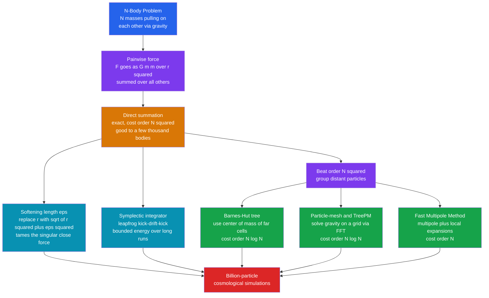

# 🌌 The N-Body Problem and Gravitational Simulation

> [!abstract] TL;DR
> Given $N$ masses that all pull on each other by gravity, predict their motion. Two bodies is Kepler's solved ellipse; **three or more has no closed-form solution** and is generally **chaotic**, so the only route is numerical integration. The naive method — sum every pairwise force — costs $O(N^2)$ per step, hopeless for the billions of particles in a galaxy or a cosmological box. The whole field is the art of taming that cost with **softening**, **symplectic integrators** (leapfrog), and **fast approximate force solvers** — Barnes-Hut trees, the Fast Multipole Method, and particle-mesh FFT methods that cut $O(N^2)$ down to $O(N\log N)$ or even $O(N)$. This is the computational backbone of modern astrophysics and cosmology.

## Intuition

**Analogy:** Two objects orbiting under gravity — the Earth and the Sun — is a *solved* problem you learn in school: a clean ellipse, one tidy formula. Now add just **one** more body and the mathematics shatters. There is no formula for three gravitating masses, only the numerical unfolding of their intricate, often chaotic dance — nudge the starting positions by a hair and the future rearranges completely. Now scale up: not three bodies but a **billion** stars in a galaxy, or dark-matter particles filling the observable universe. Every particle pulls on every other, so writing down all the forces is like asking each person in a stadium to shake hands with every other person — the work explodes as the square of the crowd. The story of gravitational simulation is a story of **ingenious shortcuts** that make the impossible merely enormous.

The two-body ellipse is a lucky special case where the math closes. The universe is not a special case: it is an $N$-body integral computers must grind out step by tiny step, and the entire craft is figuring out how to grind faster without lying about the physics.

---

## How It Works

### Core Mechanics

The governing law is just Newton in a sum. The acceleration of particle $i$ is the vector sum of the gravitational pull of every other particle:

$$
\ddot{\mathbf{r}}_i = G \sum_{j \neq i} m_j \, \frac{\mathbf{r}_j - \mathbf{r}_i}{\lVert \mathbf{r}_j - \mathbf{r}_i \rVert^{3}} .
$$

That is a coupled system of $N$ second-order ODEs — a large *system of ODEs* to be advanced in time. Everything hard about the field lives in two words in that formula: the **sum over $j$** (cost) and the **cube of the distance** (singularity and chaos).

1. **No closed form beyond two bodies.** The two-body problem separates into a single relative coordinate and integrates to a conic section (Kepler). For $N \geq 3$ there are too few conserved quantities to reduce the system; **Poincaré** proved no general analytic solution exists, and the motion is generically **chaotic** — exponentially sensitive to initial conditions. Special periodic solutions exist (the Lagrange equilibria, the restricted three-body problem, the celebrated **figure-eight choreography**), but they are isolated islands in a sea of chaos. Numerical integration is not a convenience; it is the *only* option.

2. **Direct summation.** The straightforward method: for each particle, loop over all others and add up the forces. It is **exact** (to round-off) but costs $O(N^2)$ force evaluations per timestep. Fine for $N$ up to a few thousand (star clusters, planetary systems); catastrophic for $N = 10^9$.

3. **Softening.** The $1/r^2$ force diverges as two particles approach, producing near-infinite accelerations and forcing the timestep toward zero. In **collisionless** systems — where each particle is a *tracer* of a smooth mass field (a galaxy's stars, dark matter), not a real point mass — you add a **softening length** $\varepsilon$, replacing $r$ with $\sqrt{r^2 + \varepsilon^2}$. This smears each particle into a small blob, killing the singularity. Softening is *physically correct* for collisionless dynamics but *wrong* for planetary systems, where genuine close encounters and precise Keplerian orbits matter.

4. **Symplectic time integration.** Naive integrators (forward Euler, even standard Runge-Kutta) slowly **drift the energy**, so a galaxy artificially heats up or collapses over millions of steps. **Symplectic** integrators such as **leapfrog / velocity-Verlet** preserve the geometric (Hamiltonian) structure of the flow, so energy oscillates within a bounded band forever instead of drifting. Leapfrog is second-order, time-reversible, and costs one force evaluation per step — the default for N-body work. Systems with a wide range of dynamical times (a tight binary inside a slow cluster) use **adaptive or individual/block timesteps**.

5. **Beating $O(N^2)$ with approximation.** The key insight: a *distant* clump of particles pulls almost exactly like a single mass at its center of mass — you do not need each one individually. **Barnes-Hut tree codes** recursively subdivide space into cells; when a cell is far enough away (its size divided by distance is below an opening angle $\theta$), its whole content is approximated by a single multipole, giving $O(N\log N)$. The **Fast Multipole Method (FMM)** carries multipole *and* local expansions and reaches $O(N)$. **Particle-mesh (PM)** methods deposit mass on a grid and solve Poisson's equation with an **FFT** in $O(N\log N)$ for the smooth long-range field; **P3M** and **TreePM** hybrids add a short-range correction for accuracy. These algorithms — not faster hardware alone — are what made billion-particle simulations possible.

### Flow / Architecture



---

## Key Concepts

### Secondary
- Two bodies orbiting under gravity trace a neat ellipse with one formula. **Three or more bodies have no formula** — you must simulate step by step.
- Three-body motion is usually **chaotic**: a tiny change in the start leads to a wildly different future.
- To simulate, chop time into tiny steps and, each step, add up the gravity from every particle on every other. With many particles this becomes an enormous amount of arithmetic.

### Undergraduate
- **Direct summation is $O(N^2)$.** Every particle feels every other, so the force calculation dominates and scales as the square of $N$. Exact but expensive.
- **Softening** replaces $1/r^2$ with $1/(r^2+\varepsilon^2)$ to remove the singularity when particles get close — essential for collisionless galaxy/dark-matter runs, inappropriate for planetary systems that need real close encounters.
- **Symplectic integrators (leapfrog/Verlet)** conserve energy in the long run where Euler and generic Runge-Kutta drift. That bounded-energy property, not raw local accuracy, is why they dominate — see the sibling notes *Symplectic_Integrators_and_Hamiltonian_Dynamics* and *Runge_Kutta_and_Adaptive_Methods*.
- **Barnes-Hut** groups distant particles into tree cells and uses their center of mass, cutting cost to $O(N\log N)$ at the price of a controlled approximation set by the opening angle $\theta$.

### Graduate
- **Chaos and Lyapunov time.** Few-body gravitating systems have positive Lyapunov exponents; trajectories diverge exponentially, so individual orbits are unpredictable past a horizon even though statistical/ensemble behavior is robust. The long-term stability of the Solar System is itself a deep numerical question (Laskar's integrations show the inner planets are marginally chaotic with a Lyapunov time of a few million years). See *Chaos_and_Nonlinear_Dynamics_Numerically*.
- **Force-solver taxonomy.** Barnes-Hut trees $O(N\log N)$; FMM $O(N)$ via translated multipole and local expansions with rigorous error bounds; PM $O(N\log N)$ via FFT Poisson solve on a mesh; P3M/TreePM split the force into an FFT long-range part plus a direct/tree short-range part for both speed and accuracy. Choice depends on clustering, geometry (periodic cosmological box vs isolated cluster), and required force resolution.
- **Symplectic subtleties.** Fixed-step leapfrog is symplectic and conserves a *shadow* Hamiltonian; **adaptive timesteps break symplecticity** unless done carefully (e.g. via time-symmetric criteria or symplectic block-step schemes). Individual/hierarchical timesteps (Aarseth-style) handle the huge dynamic range in dense stellar systems.
- **Beyond pure gravity.** Coupling **hydrodynamics** (SPH — smoothed-particle hydrodynamics, or grid/AMR methods) plus radiation, cooling, star formation, and feedback turns an N-body code into a full astrophysical simulation; the particle-based SPH machinery is a close cousin of *Molecular_Dynamics_Simulation*, and scaling to $10^9$–$10^{12}$ particles is an exercise in *High_Performance_and_Parallel_Computing*.

---

## Python Demo

```python
# Gravitational N-body simulation, numpy + matplotlib only.
#   (a) Direct-summation SOFTENED gravity + LEAPFROG (symplectic) integrator,
#       run on the famous stable THREE-BODY figure-eight choreography.
#       -> plot the orbits and show energy stays BOUNDED (no secular drift).
#   (b) Time the O(N^2) direct-summation force kernel vs N to expose the
#       quadratic wall that Barnes-Hut / FMM / particle-mesh methods break.
import numpy as np
import matplotlib.pyplot as plt
import time

G = 1.0  # work in natural units (G = 1, masses = 1)

def accelerations(pos, mass, eps):
    """Direct-summation softened gravity. pos:(N,2) mass:(N,) -> acc:(N,2). O(N^2)."""
    dx = pos[None, :, :] - pos[:, None, :]          # dx[i,j] = r_j - r_i, shape (N,N,2)
    r2 = np.sum(dx**2, axis=2) + eps**2             # softened squared distance
    inv_r3 = r2**-1.5
    np.fill_diagonal(inv_r3, 0.0)                   # a particle exerts no force on itself
    return G * np.sum((inv_r3[:, :, None] * mass[None, :, None]) * dx, axis=1)

def energy(pos, vel, mass, eps):
    """Total mechanical energy (softened potential)."""
    ke = 0.5 * np.sum(mass * np.sum(vel**2, axis=1))
    dx = pos[None, :, :] - pos[:, None, :]
    inv_r = 1.0 / np.sqrt(np.sum(dx**2, axis=2) + eps**2)
    np.fill_diagonal(inv_r, 0.0)
    pe = -0.5 * G * np.sum((mass[:, None] * mass[None, :]) * inv_r)  # 0.5 fixes double count
    return ke + pe

def leapfrog(pos, vel, mass, eps, dt, nsteps, sample=5):
    """Kick-drift-kick velocity-Verlet: 2nd order, symplectic, time-reversible."""
    acc = accelerations(pos, mass, eps)
    traj, E = [], []
    for s in range(nsteps):
        vel = vel + 0.5 * dt * acc          # half kick
        pos = pos + dt * vel                # drift
        acc = accelerations(pos, mass, eps) # recompute force at new positions
        vel = vel + 0.5 * dt * acc          # half kick
        if s % sample == 0:
            traj.append(pos.copy())
            E.append(energy(pos, vel, mass, eps))
    return np.array(traj), np.array(E)

# ---------- (a) the stable figure-eight three-body choreography ------------
# Classic Chenciner-Montgomery initial conditions (equal masses, G = 1).
pos = np.array([[ 0.97000436, -0.24308753],
                [-0.97000436,  0.24308753],
                [ 0.0,          0.0       ]])
v3  = np.array([-0.93240737, -0.86473146])
vel = np.array([-v3/2, -v3/2, v3])          # zero total momentum, COM at origin
mass = np.ones(3)

eps   = 1e-3          # tiny softening: negligible here, essential for large-N runs
dt    = 1e-3
T     = 6.3259        # one period of the figure-eight
steps = int(3 * T / dt)                       # integrate three full periods
traj, E = leapfrog(pos, vel, mass, eps, dt, steps)

E_drift = np.abs((E - E[0]) / E[0]).max()
print(f"(a) figure-eight: {steps} leapfrog steps, "
      f"max relative energy drift = {E_drift:.2e}  (bounded, no runaway)")

# ---------- (b) O(N^2) cost scaling of direct summation --------------------
Ns, t_force = [16, 32, 64, 128, 256, 512, 1024], []
rng = np.random.default_rng(0)
for N in Ns:
    p = rng.standard_normal((N, 2))
    m = np.ones(N)
    reps = max(1, 20000 // N)                 # more repeats for small N -> stable timing
    t0 = time.perf_counter()
    for _ in range(reps):
        accelerations(p, m, 0.05)
    t_force.append((time.perf_counter() - t0) / reps)
Ns, t_force = np.array(Ns), np.array(t_force)
slope = np.polyfit(np.log10(Ns), np.log10(t_force), 1)[0]
print(f"(b) direct-summation force cost scales as N^{slope:.2f}  (theory 2.0); "
      f"Barnes-Hut would bend this toward N log N")

# ---------- plots ----------------------------------------------------------
fig, (ax1, ax2, ax3) = plt.subplots(1, 3, figsize=(16, 4.6))

colors = ["#2563eb", "#dc2626", "#16a34a"]
for k in range(3):
    ax1.plot(traj[:, k, 0], traj[:, k, 1], lw=0.8, color=colors[k], label=f"body {k+1}")
    ax1.plot(traj[-1, k, 0], traj[-1, k, 1], "o", color=colors[k])
ax1.set_aspect("equal"); ax1.set_title("(a) Figure-eight 3-body choreography")
ax1.set_xlabel("x"); ax1.set_ylabel("y"); ax1.legend(loc="upper right", fontsize=8)

t_axis = np.arange(len(E)) * dt * 5
ax2.plot(t_axis, (E - E[0]) / abs(E[0]), color="#7c3aed")
ax2.set_title("(b) Leapfrog energy stays bounded")
ax2.set_xlabel("time"); ax2.set_ylabel("relative energy error"); ax2.grid(alpha=0.3)

ax3.loglog(Ns, t_force, "o-", color="#d97706", label="direct summation")
ax3.loglog(Ns, t_force[0] * (Ns / Ns[0])**2, "--", color="gray", label="N^2 reference")
ax3.loglog(Ns, t_force[0] * (Ns / Ns[0]) * np.log2(Ns) / np.log2(Ns[0]),
           ":", color="green", label="N log N (tree goal)")
ax3.set_title("(c) O(N^2) wall of direct summation")
ax3.set_xlabel("number of particles N"); ax3.set_ylabel("seconds per force eval")
ax3.legend(fontsize=8); ax3.grid(True, which="both", alpha=0.3)

plt.tight_layout(); plt.show()
```

Running it prints a **max relative energy drift of order $10^{-4}$ or smaller that stays bounded** across three full orbital periods — the signature of a symplectic integrator: the energy *wiggles* but never runs away, so the figure-eight closes on itself instead of spiralling apart. The first panel shows all three equal-mass bodies chasing each other around the same figure-eight curve; the second confirms the bounded energy band; the third shows the timed force kernel climbing along the $N^2$ reference line, with the $N\log N$ curve underneath it as the target every fast solver aims for. Swap the figure-eight initial conditions for a slightly perturbed triangle and the same code will instead show chaos — two bodies pairing off and ejecting the third.

---

## Real-World Applications

> **Example:** The **Millennium Simulation** (2005) and **IllustrisTNG** evolve $10^9$–$10^{10}$ dark-matter (and gas) particles in an expanding cosmological box using **TreePM** gravity — a particle-mesh FFT for the smooth long-range field plus a Barnes-Hut tree for short-range forces — with individual timesteps. The resulting **cosmic web** of filaments, voids, and halos is compared statistically to galaxy surveys to test the $\Lambda$CDM dark-matter model. No closed-form solution exists for $10^{10}$ gravitating bodies; the simulation *is* the theory's prediction.

- **Cosmological structure formation.** Dark-matter/gas particles in an expanding background collapse under gravity into halos and the cosmic web; matching the observed clustering constrains dark matter, dark energy, and initial fluctuations — N-body simulation is a pillar of modern cosmology.
- **Galaxy and star-cluster dynamics.** Collisionless (softened) codes model galaxy mergers, disk stability, and dark-matter halos; collisional direct-summation codes (e.g. NBODY6, with regularization for close binaries) model globular clusters where two-body relaxation and binary formation genuinely matter.
- **Planetary system stability and formation.** High-accuracy symplectic integrators (WHFast, MERCURY, REBOUND) track planetary systems over billions of years — no softening, because real close encounters and resonances drive the dynamics; Laskar's integrations revealed the Solar System's inner planets are weakly chaotic.
- **Planetary rings and resonances.** N-body plus collision models explain the sharp edges, gaps, and density waves in Saturn's rings driven by moon resonances.
- **Full astrophysical simulation.** Adding SPH or grid/AMR **hydrodynamics**, radiation, cooling, star formation, and feedback turns gravity-only N-body codes (GADGET, AREPO, RAMSES) into end-to-end galaxy-formation laboratories.

---

## Common Pitfalls

- **Using a non-symplectic integrator for long runs** — forward Euler or generic RK4 has beautiful *local* accuracy but a *secular energy drift*; over millions of steps a cluster spuriously heats up or collapses. Use leapfrog/Verlet (or higher-order symplectic) and monitor energy conservation, not just per-step error.
- **Wrong softening choice** — softening a *planetary* system smooths away the very close encounters and resonances that drive its evolution (wrong physics); running a *collisionless galaxy* with zero softening produces spurious two-body scattering and tiny timesteps (wrong and slow). Match softening to whether particles represent real point masses or a smooth field.
- **Forgetting the self-force / diagonal term** — including $j = i$ in the force sum divides by zero (or by $\varepsilon^2$) and injects garbage; always zero the diagonal.
- **Fixed global timestep for a system with huge dynamic range** — a single tight binary forces the whole simulation to a crawl. Use adaptive, individual, or block timesteps, but beware: naive adaptivity *breaks symplecticity* and reintroduces energy drift.
- **Trusting an individual chaotic trajectory** — few-body gravity is chaotic, so bit-level differences (or a change in force-solver accuracy) diverge exponentially. Individual orbits past the Lyapunov horizon are meaningless; trust statistical/ensemble quantities instead.
- **Setting the Barnes-Hut opening angle too large** — a big $\theta$ is fast but lumps in nearby cells crudely, corrupting forces and energy conservation. Tune $\theta$ (and multipole order) against a direct-summation reference on a small test problem.

---

## Related Concepts

- [[Orbital_Mechanics_and_Celestial_Dynamics]] — the analytically solved two-body / Kepler case that the N-body problem generalizes and breaks.
- [[Hamiltonian_Mechanics]] — gravity is a Hamiltonian system; symplectic integrators exist precisely to preserve that phase-space structure.
- [[Newtons_Laws_and_Kinematics]] — the inverse-square force and $F=ma$ that every pairwise term in the sum encodes.
- [[Work_Energy_and_Conservation]] — the conserved total energy whose bounded drift is the diagnostic for a good integrator.
- [[Systems_of_ODEs]] — the N-body equations are a large coupled system of second-order ODEs advanced in time.
- [[Dark_Matter]] — the dominant mass whose gravitational clustering cosmological N-body simulations actually track.
- [[Large_Scale_Structure_and_Structure_Formation]] — the cosmic web these billion-particle simulations produce and match to surveys.
- [[Galaxy_Formation_and_Evolution]] — gravity-plus-hydrodynamics N-body codes are the primary tool for modeling how galaxies form.
- [[Formation_of_the_Solar_System]] — planetesimal accretion and long-term stability are studied with high-accuracy symplectic N-body integrations.
- [[The_Milky_Way_Galaxy]] — its disk, halo, and dark-matter structure are modeled with collisionless N-body dynamics.
- [[Big_O_Notation]] — the language for the $O(N^2)$ direct sum vs $O(N\log N)$ tree/PM and $O(N)$ FMM cost distinction.
- [[Binary_Tree_Fundamentals]] — Barnes-Hut is a spatial-tree (quadtree/octree) algorithm; the tree data structure is what buys the $\log N$.
- [[Numerical_Integration_and_Differentiation]] — the sibling on the finite-difference and quadrature primitives that time integrators are built from.
- [[Computational_Physics_Overview]] — the map of the vault this dynamical-simulation note sits in.
- [[Floating_Point_and_Numerical_Error]] — round-off sets the noise floor that chaotic N-body trajectories amplify exponentially.

---

## Review Questions

1. **(Secondary)** Why can we write one exact formula for the Earth-Sun orbit but not for three or more gravitating bodies? What do we do instead, and why does a tiny change in the starting conditions matter so much?
2. **(Undergraduate)** Explain why direct-summation gravity costs $O(N^2)$ per timestep, and describe the single geometric idea that lets Barnes-Hut reduce it to $O(N\log N)$. What does the opening angle $\theta$ trade off?
3. **(Undergraduate/Graduate)** You must simulate (a) the Solar System over 1 billion years, and (b) a dark-matter cosmological box with $10^9$ particles. For each, decide whether to use softening and which force solver and integrator you would choose, and justify the difference.
4. **(Graduate)** A colleague speeds up a cluster simulation with adaptive per-particle timesteps and reports that the total energy now drifts steadily upward over long runs. Diagnose the likely cause and propose a fix that preserves both efficiency and long-term energy behavior.

---

## Sources

- Aarseth, S. J., *Gravitational N-Body Simulations: Tools and Algorithms* (Cambridge, 2003).
- Barnes, J. & Hut, P., "A hierarchical O(N log N) force-calculation algorithm", *Nature* 324 (1986), 446–449.
- Greengard, L. & Rokhlin, V., "A fast algorithm for particle simulations", *J. Comput. Phys.* 73 (1987), 325–348 (Fast Multipole Method).
- Springel, V. et al., "Simulations of the formation, evolution and clustering of galaxies and quasars" (the Millennium Simulation), *Nature* 435 (2005), 629–636.
- Chenciner, A. & Montgomery, R., "A remarkable periodic solution of the three-body problem in the case of equal masses", *Annals of Mathematics* 152 (2000), 881–901 (the figure-eight).

---

#computational-physics #n-body-problem #gravitational-simulation #barnes-hut #celestial-mechanics
