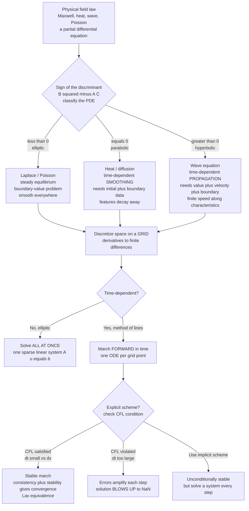

# 🌐 Classification of PDEs and Discretization

> [!abstract] TL;DR
> The great laws that describe **fields** — Maxwell's equations for electromagnetism, the heat equation for diffusion, the wave equation for sound and light, the Schrödinger equation for quantum amplitudes, Navier-Stokes for fluids, Poisson's equation for gravity and electrostatic potential — are all **partial differential equations (PDEs)**, and solving them numerically is the core of computational physics. Second-order linear PDEs come in exactly **three personalities**: **elliptic** (Laplace/Poisson — a steady equilibrium fixed by its boundary, smooth everywhere, solved *all at once* as a linear system), **parabolic** (heat/diffusion — time-dependent *smoothing* that blurs sharp features away, marched forward from an initial condition), and **hyperbolic** (wave — time-dependent *propagation* at finite speed along characteristics, carrying features intact). The class dictates the well-posedness, which boundary/initial data you must supply, and — critically — *which numerical method works*. **Discretization** replaces the continuous field by values on a **grid** and derivatives by **finite differences**, turning the PDE into algebraic equations; but explicit time-marching is stable only if the timestep respects the **CFL condition** (`dt ~ dx` for waves, `dt ~ dx²` for diffusion) — violate it and the simulation explodes. Classify first, discretize second, respect stability always.

---

## Intuition

**Analogy:** Picture the three most familiar things a field can do. Drop a spoonful of dye into still water and it *spreads and fades* — a sharp blob blurs into a soft, ever-smoother smudge that never sharpens again. Pluck a guitar string and the disturbance *travels* — a crisp pulse races outward at a fixed speed, splitting and rippling but keeping its shape. Now dip a wire loop into soapy water: the film snaps taut into a *steady equilibrium*, a smooth surface pulled into whatever shape the wire boundary demands, changeless once settled. Blurring, travelling, settling — heat, waves, and soap films — these are the three and *only three* personalities a second-order field law can have. Physicists name them **parabolic**, **hyperbolic**, and **elliptic**.

That classification is not academic bookkeeping. It tells you what information you are even allowed to ask for (a soap film needs its whole boundary; a travelling wave needs a starting shape *and* a starting velocity), and it tells you which numerical recipe will succeed. Feed a wave problem to a method built for diffusion and you get numbers that either smear the signal into mush or detonate into `NaN`. Knowing which of the three you face — *before* you write a single line of solver code — is the first and most consequential decision in all of field simulation.

---

## How It Works

### Core Mechanics

1. **PDEs are the language of fields.** A field is a quantity defined at every point of space (and possibly time): temperature `T(x, y, z, t)`, electric potential `φ`, a wave amplitude `u`, a fluid velocity `v`. Its physics is a rule relating the field's spatial curvature to its rate of change — a **partial** differential equation because several independent variables (space *and* time) are differentiated. The canonical examples: the **heat equation** `∂u/∂t = D ∇²u`, the **wave equation** `∂²u/∂t² = c² ∇²u`, and **Poisson's equation** `∇²u = -ρ` (with **Laplace's equation** `∇²u = 0` its source-free case). Maxwell, Schrödinger, and Navier-Stokes are all PDE systems built from the same differential operators.

2. **The general second-order linear PDE and its discriminant.** Write a two-variable second-order linear PDE as `A u_xx + 2B u_xy + C u_yy + (lower order) = 0`. Exactly as a conic section is classified by `B² - AC`, the PDE's **type** is fixed by the sign of the discriminant of its *principal part* (the highest-derivative terms):
   $$B^2 - AC \;\begin{cases} < 0 & \text{elliptic (equilibrium)} \\ = 0 & \text{parabolic (diffusion)} \\ > 0 & \text{hyperbolic (propagation)} \end{cases}$$
   Laplace `u_xx + u_yy = 0` has `A=C=1, B=0` so `B²-AC = -1 < 0` → **elliptic**. The heat equation `u_t - u_xx = 0` (treating `t` as the second variable, no `u_tt`) gives `B²-AC = 0` → **parabolic**. The wave equation `u_tt - u_xx = 0` gives `B²-AC = 1 > 0` → **hyperbolic**. This single sign governs everything that follows.

3. **Elliptic — steady state, boundary-value, smooth everywhere.** No time appears; the field is an *equilibrium* determined entirely by conditions on the **boundary** of the domain (a **boundary-value problem**, BVP). Elliptic solutions are maximally smooth — the value at any interior point is a weighted average of its neighbours (the **mean-value property**), so sharp features and noise are impossible; a disturbance anywhere is felt *everywhere instantly*. There is no "marching direction," so the discretized problem is one large **coupled linear system** `A u = b` solved **all at once**.

4. **Parabolic — time-dependent smoothing.** One time derivative and second-order space derivatives. Given an **initial condition** (the field now) plus **boundary conditions** for all later times, the field evolves *forward*, and diffusion relentlessly **smooths**: high-frequency wiggles decay fastest, sharp peaks flatten, total "energy" dissipates. Information propagates at *infinite* speed in principle (a change at one point instantly perturbs all others, though exponentially weakly). Time is a one-way street — you cannot run diffusion backward stably.

5. **Hyperbolic — finite-speed propagation.** Two time derivatives. It needs **two** pieces of initial data (the field *and* its time derivative — position and velocity), plus boundary conditions. Solutions **propagate along characteristics** at a finite speed `c`; a disturbance influences only its future "light cone" and features are *preserved* rather than smeared (an idealized pulse keeps its shape). This finite **domain of dependence** is the deep reason for the CFL stability limit below.

6. **Why the class decides the method — and the data you must supply.** Each class is **well-posed** only with the matching data: elliptic wants the *whole boundary*; parabolic wants *initial + boundary*; hyperbolic wants *initial value, initial velocity, + boundary*. Supply the wrong data (e.g. only initial data to an elliptic problem) and the problem is **ill-posed** — no solution, or one that depends discontinuously on the input. Numerically, elliptic problems are solved as global linear systems (iterative or direct); parabolic and hyperbolic are **marched in time**. Using an elliptic global solver on a wave, or an over-large explicit step on either time-dependent class, produces nonsense or blow-up.

7. **Discretization: continuous field → values on a grid.** We cannot store a value at *every* point, so we sample the field on a **grid** of points spaced `dx` apart (and time levels `dt` apart), storing an array `u[i]` (or `u[i][j]` in 2D). Each derivative becomes a **finite difference** of nearby grid values — Taylor expansion gives the second derivative as
   $$\left.\frac{\partial^2 u}{\partial x^2}\right|_i \approx \frac{u_{i+1} - 2u_i + u_{i-1}}{dx^2} + O(dx^2),$$
   the *stencil* at the heart of nearly every scheme. Substituting these differences into the PDE converts a continuous differential equation into a large set of **algebraic equations** in the grid values — something a computer can actually solve.

8. **Grids and meshes; the accuracy-cost trade-off.** A **structured** grid (a regular Cartesian lattice) makes stencils trivial and cache-friendly but fits awkwardly to curved geometry; an **unstructured** mesh (triangles/tetrahedra) conforms to complex shapes at the cost of bookkeeping. Halving `dx` typically quadruples the work in 2D (and multiplies the linear-system size), while a second-order scheme cuts the error by four — the eternal **resolution vs cost** tension. Adaptive meshes refine only where the field varies sharply.

9. **Time-marching vs solving-all-at-once; the method of lines.** For **parabolic/hyperbolic** problems, discretize *space* first to get a giant system of ODEs `du/dt = f(u)` (one ODE per grid point) — the **method of lines** — then integrate in time with an ODE stepper (forward Euler, Runge-Kutta, leapfrog). For **elliptic** problems there is no time; discretizing gives a single sparse linear system `A u = b` solved **globally** (Gaussian elimination, conjugate gradient, multigrid). This is the concrete meaning of "the class decides the method."

10. **Stability and the CFL condition.** An **explicit** time-marching scheme computes the new field purely from known values — cheap, but **conditionally stable**. The **Courant-Friedrichs-Lewy (CFL) condition** demands the numerical domain of dependence *contain* the physical one: information must not physically travel more than one grid cell per timestep. For the wave equation this is the **Courant number** `C = c·dt/dx ≤ 1`; for diffusion the far stricter `D·dt/dx² ≤ 1/2` (so `dt` shrinks like `dx²` — halving the grid quarters the timestep). Break CFL and rounding errors amplify each step, doubling until the solution **blows up** to `NaN`. Implicit schemes evade CFL (unconditionally stable) at the price of solving a linear system every step.

11. **Consistency + Stability = Convergence (Lax equivalence).** A scheme is **consistent** if its truncation error → 0 as `dx, dt → 0` (it approximates the *right* PDE), and **stable** if errors do not amplify without bound. The **Lax equivalence theorem** states that for a consistent scheme of a well-posed linear problem, **stability is necessary and sufficient for convergence** to the true solution. This is why we obsess over CFL: consistency is usually easy, but *without stability the refined solution never converges no matter how fine the grid*.

12. **Method families.** **Finite difference (FDM)** — derivatives as grid-point differences; simplest, best on structured grids. **Finite volume (FVM)** — integrate the PDE over control cells, enforcing *conservation* exactly; the workhorse of computational fluid dynamics. **Finite element (FEM)** — expand the field in local basis functions on an unstructured mesh; unmatched for complex geometry and elliptic/structural problems. **Spectral** — expand in global smooth basis functions (Fourier/Chebyshev); exponential accuracy for smooth fields on simple domains. All four are just different ways to turn "continuous PDE" into "solvable algebraic system."

### Flow / Architecture



---

## Key Concepts

### Secondary Level

- **A field is a value at every point.** Temperature across a metal plate, height of a ripple across a pond — a partial differential equation is the rule that says how that field bends in space and changes in time.
- **Three behaviours.** Some fields **spread and smooth out** (heat, dye in water — *parabolic*); some **travel at a fixed speed keeping their shape** (waves on a string — *hyperbolic*); some **settle into a steady shape fixed by their edges** (a stretched soap film — *elliptic*).
- **Grid + finite differences.** A computer cannot store infinitely many points, so it samples the field on a grid of dots spaced `dx` apart and approximates slopes and curvatures by subtracting neighbouring dots.
- **Take small steps or it explodes.** When marching a simulation forward in time, the time step `dt` must be small compared to the grid spacing `dx`. Too large a step and the numbers grow out of control and crash — the **CFL rule**.

### Undergraduate Level

- **Discriminant classification.** For `A u_xx + 2B u_xy + C u_yy + ... = 0`, the sign of `B² − AC` gives elliptic (`<0`), parabolic (`=0`), or hyperbolic (`>0`) — precisely the conic-section test applied to the highest derivatives.
- **Well-posedness and matching data.** Elliptic → boundary values on the whole domain; parabolic → one initial condition + boundaries; hyperbolic → value *and* first time derivative + boundaries. Wrong data makes the problem ill-posed (Hadamard).
- **The three-point Laplacian stencil.** `u_xx ≈ (u_{i+1} − 2u_i + u_{i−1})/dx²`, second-order accurate. Assembling it over the grid yields the tridiagonal (1D) or five-point (2D) discrete Laplacian used by all three classes.
- **Method of lines vs global solve.** Discretize space to get `du/dt = f(u)` and time-step it (parabolic/hyperbolic); or, with no time derivative, assemble and solve the sparse linear system `A u = b` once (elliptic).
- **CFL number.** Wave: `C = c·dt/dx ≤ 1` (an explicit stencil "sees" only its immediate neighbours, so information must not outrun one cell per step). Diffusion: `r = D·dt/dx² ≤ 1/2`, forcing `dt ∝ dx²`.
- **Domain of dependence.** A hyperbolic solution at a point depends only on initial data inside its backward characteristic cone; CFL is exactly the requirement that the numerical stencil's dependence cone contain the physical one.

### Graduate Level

- **Characteristics and canonical forms.** Hyperbolic PDEs possess two real families of characteristic curves along which the equation reduces to ODEs and along which discontinuities/shocks propagate; parabolic has one (double) real family; elliptic has none (complex characteristics) — the analytic origin of the three behaviours.
- **Lax equivalence theorem.** For a consistent finite-difference approximation to a well-posed linear initial-value problem, **stability ⟺ convergence**. Von Neumann (Fourier) analysis diagnoses stability by demanding every Fourier mode's amplification factor satisfy `|g(k)| ≤ 1`.
- **Von Neumann stability analysis.** Insert `u_i^n = g^n e^{i k x_i}` into the scheme; FTCS diffusion gives `g = 1 − 4r sin²(k dx/2)`, stable iff `r ≤ 1/2`; leapfrog wave gives `|g| = 1` iff `C ≤ 1` (non-dissipative, marginally stable).
- **Stiffness of the diffusion operator.** The discrete Laplacian's eigenvalues scale like `1/dx²`, so explicit diffusion is *stiff* — the `dt ∝ dx²` restriction is a stability, not accuracy, limit; implicit (backward Euler / Crank-Nicolson) schemes are unconditionally stable and standard for fine grids.
- **Conservation and finite volume.** FVM discretizes the *integral* conservation form, guaranteeing discrete conservation of mass/momentum/energy and correctly capturing shocks (via Godunov/Riemann solvers) where FDM of the differential form can fail.
- **Numerical dispersion and dissipation.** Discretization makes wave phase speed depend on wavenumber (dispersion) and can artificially damp amplitude (dissipation); the modified-equation / truncation analysis reveals which spurious `u_xxx` or `u_xxxx` term the scheme secretly adds.
- **Mixed-type and nonlinear PDEs.** Transonic flow (elliptic subsonic / hyperbolic supersonic in one domain), the Euler/Navier-Stokes system, and the Schrödinger equation (`i u_t = −u_xx`, a *complex* parabolic/dispersive hybrid) break the clean three-way split and demand specialized, often adaptive, schemes.

---

## Python Demo

```python
# The THREE personalities of second-order PDEs, from ONE peaked initial condition.
# (a) DIFFUSION (parabolic): the peak SPREADS, SMOOTHS, and DECAYS  -> FTCS march.
# (b) WAVE (hyperbolic): the peak SPLITS into two pulses PROPAGATING at fixed speed,
#     preserving shape (d'Alembert)                                 -> leapfrog march.
# (c) POISSON / steady (elliptic): the same peak as a SOURCE gives a smooth
#     equilibrium field with fixed boundaries, solved ALL AT ONCE   -> linear solve.
# Requires: numpy, matplotlib.

import numpy as np
import matplotlib.pyplot as plt

# ---------------- Shared grid and initial peak ----------------
N  = 401
x  = np.linspace(0.0, 1.0, N)
dx = x[1] - x[0]
w  = 0.03                                   # peak width
peak = np.exp(-((x - 0.5) / w) ** 2)        # the SAME sharp Gaussian for all three
peak[0] = peak[-1] = 0.0                     # clamp to zero at the boundaries

# =============== (a) PARABOLIC: diffusion u_t = D u_xx ===============
D  = 1.0
r  = 0.40                                    # stability number r = D dt/dx^2 ; need r <= 0.5
dt_diff = r * dx**2 / D
u  = peak.copy()
diff_snaps, diff_times, save_at = [], [], {0, 200, 800, 2500, 8000}
for n in range(8001):
    if n in save_at:
        diff_snaps.append(u.copy()); diff_times.append(n * dt_diff)
    lap = u[2:] - 2*u[1:-1] + u[:-2]
    u[1:-1] += r * lap                        # explicit forward-time centered-space step
    u[0] = u[-1] = 0.0                         # Dirichlet boundaries

# =============== (b) HYPERBOLIC: wave u_tt = c^2 u_xx ===============
c  = 1.0
C  = 0.8                                      # Courant number C = c dt/dx ; need C <= 1
dt_wave = C * dx / c
C2 = C**2
u_old = peak.copy()                           # initial displacement = the peak
u_now = u_old.copy()
# first step (initial velocity zero): u1 = u0 + 0.5 C^2 (laplacian)
u_now[1:-1] = u_old[1:-1] + 0.5*C2*(u_old[2:] - 2*u_old[1:-1] + u_old[:-2])
u_now[0] = u_now[-1] = 0.0
wave_snaps, wave_times, wave_save = [], [], {0, 60, 130, 200}
wave_snaps.append(peak.copy()); wave_times.append(0.0)
for n in range(1, 201):
    u_new = np.empty_like(u_now)
    u_new[1:-1] = (2*u_now[1:-1] - u_old[1:-1]
                   + C2*(u_now[2:] - 2*u_now[1:-1] + u_now[:-2]))
    u_new[0] = u_new[-1] = 0.0                 # fixed ends
    u_old, u_now = u_now, u_new
    if n in wave_save:
        wave_snaps.append(u_now.copy()); wave_times.append(n * dt_wave)

# =============== (c) ELLIPTIC: Poisson  -u'' = f, f = the peak ===============
# Steady equilibrium with u(0)=u(1)=0. Solved GLOBALLY as one tridiagonal system.
Ni = N - 2                                    # interior unknowns
main = 2.0 * np.ones(Ni)
off  = -1.0 * np.ones(Ni - 1)
A = np.diag(main) + np.diag(off, 1) + np.diag(off, -1)   # discrete -d2/dx2 * dx^2
b = peak[1:-1] * dx**2                         # right-hand side from the source
u_int = np.linalg.solve(A, b)                 # ONE global solve -- no time-marching
u_ell = np.concatenate(([0.0], u_int, [0.0]))

# ------------------------- Stability report -------------------------
print("=== CFL / stability summary ===")
print(f"grid spacing dx = {dx:.5f}")
print(f"(a) diffusion : r = D dt/dx^2 = {r:.2f}  -> STABLE (need r <= 0.5); dt = {dt_diff:.2e}")
print(f"(b) wave      : C = c dt/dx   = {C:.2f}  -> STABLE (need C <= 1.0); dt = {dt_wave:.2e}")
print( "(c) elliptic  : no timestep - solved all at once as a linear system A u = b")
print(f"    If diffusion used r = 0.6 (> 0.5) the FTCS march would BLOW UP to NaN.")
print(f"    Note dt_diff ~ dx^2 but dt_wave ~ dx : refining the grid punishes diffusion far more.")

# ------------------------------ Plots ------------------------------
fig, ax = plt.subplots(1, 3, figsize=(16, 4.6))

for snap, t in zip(diff_snaps, diff_times):
    ax[0].plot(x, snap, label=f"t = {t:.3f}")
ax[0].set_title("(a) Parabolic diffusion: peak SPREADS and DECAYS")
ax[0].set_xlabel("x"); ax[0].set_ylabel("u"); ax[0].legend(fontsize=8)

for snap, t in zip(wave_snaps, wave_times):
    ax[1].plot(x, snap, label=f"t = {t:.3f}")
ax[1].set_title("(b) Hyperbolic wave: peak SPLITS and PROPAGATES")
ax[1].set_xlabel("x"); ax[1].set_ylabel("u"); ax[1].legend(fontsize=8)

ax[2].plot(x, peak, 'r--', lw=1.0, label="source (the peak)")
ax[2].plot(x, u_ell, 'b-', lw=1.8, label="elliptic steady u")
ax[2].set_title("(c) Elliptic Poisson: smooth EQUILIBRIUM field")
ax[2].set_xlabel("x"); ax[2].set_ylabel("u"); ax[2].legend(fontsize=8)

plt.tight_layout()
plt.show()
```

Running this prints the CFL summary and draws three panels that make the trichotomy visceral. **Panel (a)**: the sharp Gaussian melts — each snapshot is broader, shorter, and smoother than the last, and the area (heat) leaks away through the boundaries; diffusion *destroys* structure. **Panel (b)**: the identical peak instantly splits into two half-height pulses that glide left and right at speed `c`, keeping their crisp shape — d'Alembert's `u = ½[f(x−ct) + f(x+ct)]` made visible; waves *transport* structure. **Panel (c)**: feeding the same peak as a *source* to Poisson's equation yields a single smooth tent-like equilibrium pinned at both ends — no time, no marching, just one linear solve; elliptic problems *balance* structure globally. Change `r` from `0.40` to `0.60` in the diffusion loop and watch the FTCS march erupt into `NaN` within a few dozen steps — the CFL limit is not a suggestion.

---

## Real-World Applications

- **Electromagnetics — FDTD and electrostatics.** Maxwell's equations are hyperbolic; the ubiquitous **finite-difference time-domain (FDTD)** method marches the coupled E and H fields on a staggered (Yee) grid under a strict CFL limit to simulate antennas, waveguides, and radar cross-sections. The electrostatic limit reduces to *elliptic* Poisson `∇²φ = −ρ/ε`, solved globally for chip interconnect and capacitor design.
- **Heat transfer and semiconductor processing.** Thermal management of CPUs, additive manufacturing melt pools, and dopant diffusion in silicon are *parabolic* problems marched in time with implicit (Crank-Nicolson) schemes to dodge the crippling `dt ∝ dx²` explicit limit on fine meshes.
- **Computational fluid dynamics.** Aircraft and turbine design solves the Navier-Stokes system — a mixed elliptic (pressure)/hyperbolic (convection)/parabolic (viscous diffusion) beast — almost always with **finite volume** methods that enforce exact conservation and capture shocks. Correctly identifying the local character (subsonic elliptic vs supersonic hyperbolic) is essential.
- **Seismology and acoustics.** Earthquake wavefields and ultrasound imaging are *hyperbolic* wave propagation, simulated with spectral-element or high-order finite-difference marching; the CFL condition sets the maximum stable timestep across the whole velocity model.
- **Weather and climate models.** The primitive equations mix all three types; operational forecasting centres split them and integrate with semi-implicit schemes so the fast (CFL-limiting) acoustic and gravity waves do not force impractically tiny timesteps.
- **Quantum simulation.** The Schrödinger equation `i ∂ψ/∂t = −∇²ψ/2 + Vψ` is dispersive and demands *unitary* (norm-preserving) integrators such as Crank-Nicolson or split-step Fourier — a case where naive explicit marching is unconditionally unstable.

---

## Common Pitfalls

- **Skipping the classification step.** Reaching for a solver before asking "elliptic, parabolic, or hyperbolic?" is the root error. The class dictates what data is required and which method is even valid; guessing wastes days debugging a fundamentally wrong scheme.
- **Supplying the wrong boundary/initial data.** Giving a hyperbolic problem only an initial *position* (forgetting the initial *velocity*), or handing an elliptic BVP an initial condition instead of full boundary data, makes the problem ill-posed — the solver returns garbage that no grid refinement can fix.
- **Violating the CFL condition.** Choosing `dt` for accuracy while ignoring stability is the classic blow-up. For explicit diffusion the killer is that `dt` must shrink like `dx²`: doubling resolution demands a *quarter* the timestep, a cost people routinely forget until the run explodes into `NaN`.
- **Assuming convergence follows from consistency alone.** A scheme can match the PDE perfectly as `dx → 0` yet still diverge because it is unstable. Lax equivalence is explicit: *consistency plus stability* — check both, ideally with a von Neumann analysis.
- **Running diffusion backward in time.** The heat equation is well-posed only forward; integrating it in reverse (e.g. naive image deblurring) is exponentially ill-posed and amplifies every bit of noise catastrophically.
- **Ignoring numerical dispersion on long-range wave runs.** Low-order schemes make different wavelengths travel at slightly different speeds, so an initially crisp pulse smears over long propagation distances — a *scheme* artifact, not physics. High-order or spectral methods are the remedy.
- **Using finite differences of the differential form where conservation matters.** For shocks and conservation laws, differencing the non-conservative form can put shocks in the wrong place or at the wrong speed; the finite-volume conservative form is required.

---

## Related Concepts

- [[Introduction_to_PDEs]] — the analytic theory of PDEs (separation of variables, characteristics, well-posedness) that this note discretizes.
- [[Partial_Differential_Equations]] — the physics-side treatment of Laplace, heat, wave, and Poisson equations and their solution methods.
- [[Numerical_ODEs_and_PDEs]] — the companion numerical-methods overview covering finite-difference and time-stepping schemes.
- [[Numerical_Integration_and_Differentiation]] — the Taylor-series finite-difference stencils that turn derivatives into grid-value differences.
- [[Initial_Value_Problems_and_Euler_Methods]] — the time-marching engine (forward Euler, stability regions) reused per grid point in the method of lines.
- [[Runge_Kutta_and_Adaptive_Methods]] — higher-order time integrators applied to the semi-discrete `du/dt = f(u)` from the method of lines.
- [[Numerical_Linear_Algebra]] — how the elliptic global system `A u = b` is actually solved (direct factorization, conjugate gradient, multigrid).
- [[Floating_Point_and_Numerical_Error]] — the round-off floor and the way instabilities amplify representation error into blow-up.
- [[Computational_Physics_Overview]] — the vault entry point situating PDE field simulation within numerical physics.
- [[Maxwells_Equations]] — the electromagnetic field PDEs (hyperbolic time-domain, elliptic electrostatic) that FDTD and Poisson solvers target.
- [[Wave_Motion_and_Properties]] — the physics of the hyperbolic wave equation and its finite-speed propagation.
- [[Gauss_Law_and_Electric_Potential]] — electrostatic potential governed by the elliptic Poisson/Laplace equation.
- [[Schrodinger_Equation]] — the dispersive quantum PDE requiring unitary (norm-preserving) time integration.
- [[Viscous_Fluids_and_Navier_Stokes]] — the mixed elliptic/parabolic/hyperbolic fluid system solved by finite-volume CFD.
- [[Fourier_Analysis]] — the basis behind von Neumann stability analysis and spectral discretization.

This note is the section-opener for **PDEs and Field Simulation**; its planned sequels — *Finite_Difference_Methods*, *The_Heat_and_Diffusion_Equation*, *The_Wave_Equation_and_Hyperbolic_PDEs*, *The_Poisson_and_Laplace_Equation*, and *The_Finite_Element_Method* — each drill into one class or one method family introduced here.

---

## Review Questions

1. **(Conceptual)** Using the discriminant `B² − AC`, classify the heat equation `u_t = u_xx`, the wave equation `u_tt = u_xx`, and Laplace's equation `u_xx + u_yy = 0`. For each, state exactly what initial and/or boundary data must be supplied for the problem to be well-posed, and explain physically why a hyperbolic problem needs *two* pieces of initial data while a parabolic one needs only *one*.
2. **(Scenario)** You must simulate heat spreading through a thin rod and separately a pulse travelling along a taut string, both on a grid of spacing `dx`. For each, write the explicit stability limit on `dt` (in terms of `dx`, `D`, and `c`). If you halve `dx` to double the resolution, by what factor must you cut `dt` in each case — and why is the diffusion problem punished so much more severely? What method would you switch to in order to escape that penalty?
3. **(Trade-off)** The Lax equivalence theorem says convergence requires *both* consistency and stability. Give a concrete example of a scheme that is consistent yet unstable, describe how a von Neumann (Fourier) analysis would reveal the instability, and discuss the trade-off between an explicit scheme (cheap per step, CFL-limited) and an implicit scheme (unconditionally stable, but a linear solve every step) when choosing a solver for a stiff diffusion problem on a very fine grid.

---

## Sources

- LeVeque, R. J., *Finite Difference Methods for Ordinary and Partial Differential Equations* (SIAM, 2007) — classification, consistency/stability/convergence, and the CFL condition.
- Strikwerda, J. C., *Finite Difference Schemes and Partial Differential Equations* (SIAM, 2nd ed., 2004) — von Neumann analysis and the Lax equivalence theorem.
- Courant, R., Friedrichs, K. & Lewy, H., "On the Partial Difference Equations of Mathematical Physics" (1928; IBM J. Res. Dev. transl. 1967) — the original CFL condition.
- Press, Teukolsky, Vetterling & Flannery, *Numerical Recipes*, 3rd ed. (Cambridge, 2007), Ch. 20 — practical PDE discretization and stability.
- Langtangen, H. P. & Linge, S., *Finite Difference Computing with PDEs* (Springer, 2017) — worked Python implementations of diffusion, wave, and Laplace solvers.

---

#computational-physics #PDEs #discretization #elliptic-parabolic-hyperbolic #finite-differences
