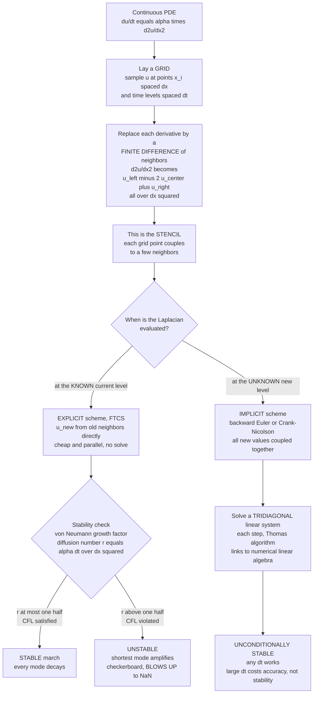

# 🔲 Finite Difference Methods

> [!abstract] TL;DR
> **Finite difference methods (FDM)** are the most intuitive and pervasive way to make a computer solve field equations: lay a **grid** over space and time, then replace *every derivative* with a **finite-difference of neighboring grid values** — a **stencil** — turning a partial differential equation into either a simple **update rule** or an algebraic **linear system**. The central lesson is **stability**. **Explicit** schemes (FTCS for heat, leapfrog for waves) compute the next time level *directly* from known current values — cheap, parallelizable, no solve — but they are only **conditionally stable**: the timestep must obey the **CFL condition** (`dt ≲ dx²/(2α)` so `r = α·dt/dx² ≤ 1/2` for diffusion; `C = c·dt/dx ≤ 1` for waves), and violating it makes the shortest-wavelength mode amplify each step until the solution **detonates into a checkerboard and NaN**. **Implicit** schemes (backward Euler, **Crank-Nicolson**) evaluate the stencil at the *unknown* new level, coupling all points into a **tridiagonal/sparse solve** each step — costlier per step but **unconditionally stable**, letting you take large timesteps limited only by accuracy. **Von Neumann analysis** (tracking Fourier-mode growth factors) is the tool that predicts exactly where each scheme lives. Master stencils, the CFL limit, boundary conditions, and the explicit-vs-implicit trade-off and you can simulate heat, waves, and fields.

---

## Intuition

**Analogy:** To simulate a continuous field — the temperature across a metal plate — you cannot track infinitely many points, so you lay down a **grid** and keep only the values at the intersections, exactly like the **pixels** of an image. Then the physics — *"heat flows from hot to cold neighbors"* — becomes simple arithmetic: each pixel's next value is a small correction computed from its current neighbors' values. Run that neighbor-based update over and over and you watch heat crawl, ripples travel, and hot spots fade — the whole continuous film reconstructed from a grid of pixels nudging each other. **That "grid of pixels, each updated from its neighbors" is the finite-difference method** — the most intuitive and widely-used way to make a computer solve the equations of fields.

The one twist that separates a working simulation from a screenful of `NaN` is **how big a time step you dare take**. Update the pixels in *too large* a jump and the corrections overshoot, feed back on themselves, and the picture explodes into a violent checkerboard. That fragile line between "smooth evolution" and "catastrophic blow-up" is the **CFL stability condition**, and understanding it is the real skill this note teaches.

---

## How It Works

### Core Mechanics

1. **A grid turns a field into an array.** Sample the continuous field `u(x, t)` at grid points `x_i = i·dx` and time levels `t_n = n·dt`, storing an array `u[i]` (or `u[i][j]` in 2-D). Everything the computer does is arithmetic on these stored neighbor values — no calculus at run time.

2. **Derivatives become differences (Taylor's theorem).** A Taylor expansion of the neighbors gives the workhorse **centered second-difference** for the Laplacian in 1-D:
   $$\left.\frac{\partial^2 u}{\partial x^2}\right|_i \approx \frac{u_{i+1} - 2u_i + u_{i-1}}{dx^2} + O(dx^2),$$
   and a first derivative as `(u_{i+1} − u_{i−1})/(2dx)` (centered, second-order) or `(u_{i+1} − u_i)/dx` (one-sided, first-order). Each formula is exact up to a **truncation error** that shrinks as a power of `dx` — its **order of accuracy**.

3. **The stencil: each point couples to a few neighbors.** The set of grid points appearing in one equation is the **stencil**. The 1-D Laplacian is a **three-point** stencil `[1, −2, 1]/dx²`; in 2-D it is the famous **five-point stencil** `(u_{i+1,j} + u_{i−1,j} + u_{i,j+1} + u_{i,j−1} − 4u_{i,j})/dx²`; higher accuracy uses wider stencils (a five-point 1-D stencil `[−1, 16, −30, 16, −1]/12dx²` is fourth-order). The stencil *is* the discrete physics — "each point listens only to its immediate neighbors."

4. **Substitute and you get an update rule or a system.** Plugging stencils into the PDE converts a differential equation into algebra. For the heat equation `∂u/∂t = α∇²u`, using a *forward* time difference and the *centered* space stencil gives the **explicit FTCS** update
   $$u_i^{n+1} = u_i^n + r\big(u_{i+1}^n - 2u_i^n + u_{i-1}^n\big), \qquad r = \frac{\alpha\,dt}{dx^2},$$
   where every quantity on the right is *already known* — one multiply-add per point, embarrassingly parallel, no solve. This is the cheapest possible field solver.

5. **Explicit = cheap but conditionally stable.** Because the new value depends only on old neighbors, an explicit stencil "sees" only one cell away per step; information physically must not outrun that reach. When the timestep is too large, the update overcorrects, the error feeds back, and the scheme is **unstable**.

6. **The CFL / stability condition.** The **Courant-Friedrichs-Lewy** condition ties `dt` to `dx`. For **diffusion**, stability needs the **diffusion number** `r = α·dt/dx² ≤ 1/2` in 1-D (`≤ 1/4` in 2-D), i.e. `dt ≤ dx²/(2α)` — the brutal `dt ∝ dx²` scaling means *halving the grid quarters the timestep*. For **waves**, the **Courant number** `C = c·dt/dx ≤ 1` — a disturbance may cross at most one cell per step. Break the limit and the solution **blows up catastrophically**.

7. **Von Neumann stability analysis.** Insert a single Fourier mode `u_j^n = g^n e^{i k j\,dx}` into the scheme and solve for the per-step **amplification factor** `g(k)`; the scheme is stable iff `|g(k)| ≤ 1` for *every* wavenumber `k`. For FTCS diffusion, `g = 1 − 4r\sin^2(k\,dx/2)`; the worst mode is the shortest wavelength (`\sin^2 = 1`), giving `g = 1 − 4r`, and `|g| ≤ 1` demands exactly `r ≤ 1/2`. Overshoot and that jagged mode grows by `|1 − 4r| > 1` each step — the **checkerboard** you see in a blow-up.

8. **Implicit = evaluate the stencil at the *new* level.** Write the Laplacian using the *unknown* future values. **Backward Euler (BTCS)** gives `u_i^{n+1} − r(u_{i+1}^{n+1} − 2u_i^{n+1} + u_{i-1}^{n+1}) = u_i^n`; **Crank-Nicolson** averages the explicit and implicit stencils. Now every unknown couples to its neighbors *simultaneously*, so one step is no longer a formula but a **linear system** `A u^{n+1} = b`.

9. **The system is tridiagonal (or sparse) — a linear-algebra problem.** In 1-D the coupling matrix `A` is **tridiagonal** and solved in `O(N)` by the **Thomas algorithm**; in 2-D it is sparse and solved by conjugate gradient or multigrid. This is the price of going implicit — and the reason implicit PDE solving is inseparable from numerical linear algebra.

10. **Implicit = unconditionally stable.** For backward Euler the amplification factor is `g = 1/(1 + 4r\sin^2(k\,dx/2))`, which is `≤ 1` for *any* `r`; Crank-Nicolson gives `g = (1 − 2r\sin^2)/(1 + 2r\sin^2)`, also always `|g| ≤ 1`. So implicit schemes **never blow up** no matter how large the timestep — you trade a per-step solve for freedom from the CFL leash.

11. **Crank-Nicolson — the parabolic workhorse.** By averaging the two time levels, Crank-Nicolson is **second-order in time** (`O(dt²)`) *and* second-order in space (`O(dx²)`) *and* unconditionally stable — the default production scheme for the heat/diffusion equation. Its one quirk: for very large steps on non-smooth data the near-`(-1)` amplification of the highest mode produces slowly-decaying **ringing** — stability is not accuracy.

12. **Accuracy orders and boundary conditions.** A scheme's error is quoted as its **temporal + spatial order**: FTCS is `O(dt) + O(dx²)`, Crank-Nicolson `O(dt²) + O(dx²)`. **Boundary conditions** are essential and error-prone: **Dirichlet** fixes the value (clamp the edge array), **Neumann** fixes the flux `∂u/∂n` and is imposed with a **ghost point** (mirror the interior so the one-sided derivative equals the prescribed flux), **periodic** wraps the ends (`np.roll`). A wrong boundary silently changes the steady state or leaks conserved quantity.

13. **Conservation and finite volume.** Naive finite differencing of the *differential* form may not conserve mass or energy exactly, and can put **shocks** at the wrong speed. The **finite volume method** instead integrates the *conservation* form over each cell and balances **fluxes** across cell faces, guaranteeing discrete conservation — the reason CFD and shock physics prefer it.

14. **The PDE zoo, method by method.** **Parabolic** (heat) → FTCS or Crank-Nicolson. **Hyperbolic** (waves) → leapfrog / Lax-Wendroff; pure **advection** needs **upwind** differencing (difference *into* the direction the flow comes from) to stay stable. **Elliptic** (Laplace/Poisson) → no time march; solve the global system by **iterative relaxation** (Jacobi, Gauss-Seidel, SOR, multigrid) or a direct sparse solve.

### Flow / Architecture



---

## Key Concepts

### Secondary Level

- **Grid of pixels.** A computer cannot store every point of a field, so it keeps a grid of dots and only tracks those. Slopes and curvatures are found by subtracting neighboring dots — that subtraction is a *finite difference*.
- **Update from neighbors.** Each dot's next value is its current value plus a small nudge computed from its neighbors. Repeat and the whole field evolves.
- **Small steps or it explodes.** If you march time forward in jumps that are too big, the nudges overshoot, feed back, and the numbers grow out of control and crash. Keep the step small — that is the **CFL rule**.
- **Two styles.** *Explicit* is cheap arithmetic but needs tiny steps. *Implicit* solves a little puzzle each step but can take giant steps without crashing.

### Undergraduate Level

- **Second-difference stencil.** `u_xx ≈ (u_{i+1} − 2u_i + u_{i−1})/dx²`, second-order accurate; the 2-D **five-point stencil** is its direct extension and the discrete Laplacian used by all three PDE classes.
- **FTCS explicit heat scheme.** `u_i^{n+1} = u_i^n + r(u_{i+1}^n − 2u_i^n + u_{i−1}^n)` with diffusion number `r = α·dt/dx²`; stable iff `r ≤ 1/2`, forcing `dt ∝ dx²`.
- **CFL condition, two flavors.** Diffusion: `r = α·dt/dx² ≤ 1/2`. Waves: Courant number `C = c·dt/dx ≤ 1`. The explicit stencil sees one cell per step, so information must not outrun one cell per step.
- **Implicit schemes and the tridiagonal solve.** Backward Euler and Crank-Nicolson put the unknowns on the left, giving `A u^{n+1} = b` with `A` tridiagonal in 1-D — solved in `O(N)` by the Thomas algorithm; **unconditionally stable**.
- **Crank-Nicolson.** The `O(dt²) + O(dx²)`, unconditionally stable average of explicit and implicit — the standard parabolic solver.
- **Boundary conditions.** Dirichlet (fixed value), Neumann (fixed flux via a **ghost point**), periodic (wrap). Getting them wrong changes the answer even when the interior scheme is perfect.

### Graduate Level

- **Von Neumann analysis.** Substituting `u_j^n = g^n e^{i k j\,dx}` yields the amplification factor `g(k)`; `\max_k |g(k)| ≤ 1` is the stability criterion. FTCS: `g = 1 − 4r\sin^2(k\,dx/2)` → `r ≤ 1/2`. Backward Euler: `g = 1/(1+4r\sin^2)` → always stable. Crank-Nicolson: `g = (1−2r\sin^2)/(1+2r\sin^2)` → `|g| ≤ 1` always, but `g → −1` for the top mode at large `r` (the ringing).
- **Lax equivalence theorem.** For a consistent scheme applied to a well-posed linear problem, **stability ⟺ convergence**. Consistency (truncation error → 0) is usually easy; stability is the substantive requirement, which is why CFL matters so much.
- **Stiffness and the method of lines.** Semi-discretizing space gives `du/dt = A u` with the discrete Laplacian `A`; its eigenvalues span `0` to `~ −4α/dx²`, a stiffness ratio `~ dx^{-2}`. Explicit time-stepping is throttled by the fastest (most negative) eigenvalue — the very origin of `dt ∝ dx²` — while implicit (A-stable) schemes are immune.
- **Numerical dispersion and dissipation.** The **modified equation** reveals the leading spurious term a scheme secretly adds: an even-derivative `u_{xxxx}` term damps amplitude (artificial dissipation), an odd-derivative `u_{xxx}` term makes phase speed depend on wavenumber (dispersion), smearing a crisp pulse over long runs. Upwind advection is stable precisely because it adds implicit dissipation.
- **Conservative finite volume.** Differencing the integral conservation form `∂_t \bar u + (F_{i+1/2} − F_{i-1/2})/dx = 0` guarantees discrete conservation and, via Godunov/Riemann flux solvers, correct shock speeds where non-conservative FDM fails (Lax-Wendroff theorem).
- **Operator splitting and ADI.** Multidimensional implicit solves are made tractable by **alternating-direction-implicit (ADI)** and Strang splitting, reducing a 2-D sparse solve to a sequence of cheap tridiagonal sweeps.

---

## Python Demo

```python
# Solving the 1D heat/diffusion equation  du/dt = alpha * u_xx  by finite differences,
# with STABILITY as the star of the show.
#   (1) EXPLICIT FTCS, r = 0.40  <= 1/2  -> STABLE : the profile smoothly diffuses.
#   (2) EXPLICIT FTCS, r = 0.55  >  1/2  -> UNSTABLE: a checkerboard grows and BLOWS UP.
#   (3) IMPLICIT Crank-Nicolson, r = 8.0 (>> 1/2) via a TRIDIAGONAL (Thomas) solve
#       -> STABLE for ANY timestep (a large step merely loses accuracy = mild ringing).
# Prints the CFL/stability condition. numpy + matplotlib only.

import numpy as np
import matplotlib.pyplot as plt

# ------------------------- grid and physics -------------------------
L, N   = 1.0, 101
x      = np.linspace(0.0, L, N)
dx     = x[1] - x[0]
alpha  = 1.0

# initial condition: a top-hat (rich in high frequencies so instability shows fast),
# clamped to zero at the Dirichlet boundaries.
u0 = np.where(np.abs(x - 0.5) < 0.15, 1.0, 0.0)
u0[0] = u0[-1] = 0.0

# ------------------------- stability condition ----------------------
r_limit  = 0.5
dt_limit = r_limit * dx**2 / alpha
print("=== FTCS explicit stability (CFL) condition, 1D diffusion ===")
print(f"dx = {dx:.4e}")
print(f"diffusion number  r = alpha*dt/dx^2  must satisfy  r <= 1/2")
print(f"i.e.  dt <= dx^2 / (2*alpha) = {dt_limit:.4e}")
print("Explicit r=0.40 -> STABLE ; r=0.55 -> UNSTABLE ; Crank-Nicolson stable for ANY r.\n")

def second_diff(u):
    """Interior centered second difference (Dirichlet ends left untouched)."""
    d = np.zeros_like(u)
    d[1:-1] = u[2:] - 2.0 * u[1:-1] + u[:-2]
    return d

def ftcs(u_init, r, nsteps):
    """Explicit forward-time centered-space march; returns snapshots + steps."""
    u = u_init.copy()
    hist = [u.copy()]
    for _ in range(nsteps):
        u = u + r * second_diff(u)
        u[0] = u[-1] = 0.0                      # Dirichlet boundaries
        hist.append(u.copy())
    return hist

def thomas(a, b, c, d):
    """Solve a tridiagonal system: sub-diag a, diag b, super-diag c, rhs d."""
    n  = len(b)
    cp = np.zeros(n); dp = np.zeros(n)
    cp[0], dp[0] = c[0] / b[0], d[0] / b[0]
    for i in range(1, n):
        m     = b[i] - a[i] * cp[i - 1]
        cp[i] = c[i] / m
        dp[i] = (d[i] - a[i] * dp[i - 1]) / m
    xsol = np.zeros(n)
    xsol[-1] = dp[-1]
    for i in range(n - 2, -1, -1):
        xsol[i] = dp[i] - cp[i] * xsol[i + 1]
    return xsol

def crank_nicolson(u_init, r, nsteps):
    """Implicit Crank-Nicolson via a tridiagonal solve each step:
       (I - r/2 L) u^{n+1} = (I + r/2 L) u^n on the interior (Dirichlet)."""
    u  = u_init.copy()
    ni = N - 2                                   # interior unknowns
    a  = np.full(ni, -r / 2.0)                   # sub-diagonal
    b  = np.full(ni, 1.0 + r)                    # main diagonal
    c  = np.full(ni, -r / 2.0)                   # super-diagonal
    a[0] = 0.0; c[-1] = 0.0                       # Dirichlet: no coupling past the edge
    hist = [u.copy()]
    for _ in range(nsteps):
        ui  = u[1:-1]
        rhs = ui + (r / 2.0) * (u[2:] - 2.0 * ui + u[:-2])   # (I + r/2 L) u^n
        u   = np.zeros_like(u)
        u[1:-1] = thomas(a, b, c, rhs)           # solve for the new interior
        hist.append(u.copy())
    return hist

# ------------------------- run the three cases ----------------------
# (1) stable explicit: r = 0.40, march to physical time ~0.024
r_s     = 0.40
dt_s    = r_s * dx**2 / alpha
steps_s = 600
stable  = ftcs(u0, r_s, steps_s)
snap_s  = [0, 60, 200, 600]

# (2) unstable explicit: r = 0.55 (> 1/2) -- watch it erupt
r_u     = 0.55
dt_u    = r_u * dx**2 / alpha
steps_u = 60
unstable = ftcs(u0, r_u, steps_u)
snap_u   = [0, 20, 40, 60]

# (3) implicit CN with a HUGE step: r = 8.0 (20x the explicit limit) -- still stable
r_i     = 8.0
dt_i    = r_i * dx**2 / alpha
steps_i = 30                                     # reaches ~same physical time as (1)
implicit = crank_nicolson(u0, r_i, steps_i)
snap_i   = [0, 3, 10, 30]

# ------------------------------- plots ------------------------------
fig, ax = plt.subplots(1, 3, figsize=(16, 4.8))

for n in snap_s:
    ax[0].plot(x, stable[n], label=f"t = {n*dt_s:.4f}")
ax[0].set_title(f"(1) Explicit FTCS, r = {r_s} <= 1/2\nSTABLE: smooth diffusion")
ax[0].set_xlabel("x"); ax[0].set_ylabel("u"); ax[0].legend(fontsize=8); ax[0].grid(alpha=0.3)

for n in snap_u:
    ax[1].plot(x, unstable[n], label=f"step {n}")
ax[1].set_title(f"(2) Explicit FTCS, r = {r_u} > 1/2\nUNSTABLE: checkerboard BLOWS UP")
ax[1].set_xlabel("x"); ax[1].set_ylabel("u"); ax[1].legend(fontsize=8); ax[1].grid(alpha=0.3)

for n in snap_i:
    ax[2].plot(x, implicit[n], label=f"t = {n*dt_i:.4f}")
ax[2].set_title(f"(3) Implicit Crank-Nicolson, r = {r_i} >> 1/2\nSTABLE at any dt (mild ringing)")
ax[2].set_xlabel("x"); ax[2].set_ylabel("u"); ax[2].legend(fontsize=8); ax[2].grid(alpha=0.3)

plt.tight_layout()
plt.show()

# quantify the blow-up
print(f"(1) stable explicit : max|u| after {steps_s} steps = {np.abs(stable[-1]).max():.3e}")
print(f"(2) unstable explicit: max|u| after {steps_u} steps = {np.abs(unstable[-1]).max():.3e}  (should be huge)")
print(f"(3) implicit CN      : max|u| after {steps_i} steps = {np.abs(implicit[-1]).max():.3e}  (bounded, r={r_i})")
```

Running it prints the CFL condition and draws three panels that make stability tangible. **Panel (1)** is the well-behaved explicit run at `r = 0.40`: the top-hat's sharp corners round off and the whole profile decays smoothly toward zero — heat diffusing exactly as physics demands. **Panel (2)** is the *same* scheme with `r = 0.55`, a hair over the `1/2` limit: within a few dozen steps a jagged **checkerboard** oscillation (the shortest-wavelength mode, amplified by `|1 − 4r| = 1.2` per step) erupts out of the discontinuity and grows without bound — the printed `max|u|` is enormous, a hands-on encounter with a CFL violation. **Panel (3)** is implicit **Crank-Nicolson** with `r = 8.0`, sixteen times over the explicit ceiling: each step solves a tridiagonal system with the Thomas algorithm, yet the profile stays bounded and smoothly diffuses — **unconditionally stable**. The only price of the giant step is a touch of ringing near the initial jump, the visible reminder that implicit stability buys freedom from blow-up, not freedom from truncation error.

---

## Real-World Applications

> **Example:** The **finite-difference time-domain (FDTD)** method — the standard tool for simulating antennas, photonic waveguides, and radar cross-sections — is finite differences applied to Maxwell's (hyperbolic) equations on Yee's staggered grid. It marches the E and H fields *explicitly* with a leapfrog stencil, so every commercial FDTD solver lives and dies by the **CFL condition** `c·dt ≤ dx/√(dimensions)`: pick a timestep a whisker too large and a multi-hour electromagnetic simulation detonates into `NaN`. The explicit/CFL trade-off from this note is literally the first setting an FDTD engineer configures.

- **Thermal and semiconductor engineering.** Transient heat conduction in CPUs, additive-manufacturing melt pools, and dopant diffusion in silicon are parabolic problems marched with **Crank-Nicolson** to escape the crippling `dt ∝ dx²` explicit penalty on fine meshes.
- **Computational fluid dynamics.** Compressible flow and shocks are solved with **finite-volume** schemes (Lax-Wendroff, Godunov, MUSCL) precisely because naive finite differencing of the differential form fails to conserve mass/momentum and misplaces shocks.
- **Seismology and acoustics.** Earthquake wavefields and ultrasound imaging are hyperbolic and simulated by high-order explicit finite differences; the CFL number caps the stable step across the whole velocity model.
- **Quantitative finance.** The Black-Scholes PDE maps to the heat equation and is priced with Crank-Nicolson on a grid of asset price versus time — the industry-standard finite-difference option pricer.
- **Weather and climate.** Operational forecast models integrate the primitive equations with **semi-implicit** schemes so fast acoustic and gravity waves do not force absurdly small CFL-limited timesteps.
- **Quantum simulation.** The time-dependent Schrödinger equation is evolved with Crank-Nicolson (or split-step Fourier) because these preserve the wavefunction's norm (unitarity), where explicit marching is unconditionally unstable.

---

## Common Pitfalls

- **Violating the CFL condition.** Choosing `dt` for accuracy while ignoring stability is the classic blow-up. For explicit diffusion `dt` must shrink like `dx²`, so *doubling* resolution demands *a quarter* of the timestep — a cost people forget until the run erupts into a checkerboard and `NaN`. Fix with a smaller `dt` or an implicit scheme; never a smaller `dx` alone (that makes it worse).
- **Assuming implicit means accurate.** Unconditional *stability* is not accuracy. A large Crank-Nicolson step stays bounded but smears the solution and can ring near sharp features; backward Euler over-damps. Pick the step for the physics you need to resolve, not just to avoid `NaN`.
- **Mishandling boundary conditions.** Implementing an insulated **Neumann** wall as a clamped value (instead of a **ghost point** enforcing zero flux) silently changes the steady state and leaks conserved quantity. Dirichlet, Neumann, and periodic each need their own careful stencil at the edge.
- **Using non-conservative differencing where conservation matters.** Differencing the differential form of a conservation law can put shocks at the wrong speed or location; use the **finite-volume** conservative flux form for fluids and shocks.
- **Centered differencing pure advection.** A centered stencil for `∂u/∂t + a∂u/∂x = 0` (FTCS advection) is *unconditionally unstable* by von Neumann analysis; advection needs **upwind** (or Lax-Wendroff) differencing that leans into the flow direction.
- **Under-resolving sharp gradients.** A discontinuity spread over one cell aliases into spurious high-frequency ripples (Gibbs-like) and, under an unstable scheme, is exactly what the checkerboard mode feeds on. Resolve steep features or expect oscillatory artifacts.
- **Confusing accuracy order with stability.** A scheme can be beautifully consistent (`O(dx²)`) yet diverge because it is unstable — Lax equivalence requires *both* consistency and stability. Always run a von Neumann check before trusting a new stencil.

---

## Related Concepts

- [[Classification_of_PDEs_and_Discretization]] — the section-opener that fixes which class (elliptic/parabolic/hyperbolic) you face and therefore which finite-difference recipe applies; this note is its methods deep-dive.
- [[The_Heat_and_Diffusion_Equation]] — the canonical parabolic PDE whose FTCS `r ≤ 1/2` limit and Crank-Nicolson solver are worked out in full here.
- [[The_Wave_Equation_and_Hyperbolic_PDEs]] — the hyperbolic counterpart, with the Courant number `C = c·dt/dx ≤ 1` and leapfrog/upwind stencils.
- [[The_Poisson_and_Laplace_Equation]] — the elliptic side of finite differences: no time march, solved globally by iterative relaxation (Jacobi, Gauss-Seidel, SOR, multigrid).
- [[Numerical_Integration_and_Differentiation]] — the Taylor-series finite-difference formulas (first and second derivatives) that every stencil is built from.
- [[Initial_Value_Problems_and_Euler_Methods]] — the forward/backward Euler time march reused per grid point in the method of lines, and the stability-region idea reappearing as CFL.
- [[Runge_Kutta_and_Adaptive_Methods]] — higher-order time integrators applied to the semi-discrete `du/dt = A u` from the method of lines.
- [[Numerical_Linear_Algebra]] — the tridiagonal/sparse solves (Thomas, conjugate gradient, multigrid) that every implicit and elliptic finite-difference scheme requires.
- [[The_Finite_Element_Method]] — the unstructured-mesh alternative to finite differences for complex geometry and elliptic problems.
- [[Floating_Point_and_Numerical_Error]] — the round-off floor that a CFL-violating scheme amplifies into blow-up.
- [[Computational_Physics_Overview]] — the vault entry point situating field simulation within numerical physics.
- [[Introduction_to_PDEs]] — the mathematics-vault analytic theory (well-posedness, characteristics) behind the schemes discretized here.
- [[Numerical_ODEs_and_PDEs]] — the mathematics-vault companion on finite-difference and time-stepping methods.
- [[Fourier_Analysis]] — the mode decomposition underlying von Neumann stability analysis.
- [[Partial_Differential_Equations]] — the physics-vault treatment of the heat, wave, and Poisson equations these methods solve.
- [[Fourier_Analysis_and_Integral_Transforms]] — Fourier/Green's-function methods that give the analytic yardstick for a scheme's accuracy.
- [[Wave_Motion_and_Properties]] — the physics of the finite-speed propagation the Courant condition protects.
- [[Viscous_Fluids_and_Navier_Stokes]] — the fluid system whose finite-volume finite-difference solvers this note motivates.
- [[BIBO_Stability]] — the signals-and-systems notion of bounded-input bounded-output stability, the discrete-dynamics cousin of `|g(k)| ≤ 1`.
- [[Fourier_Transform]] — the transform in which each grid mode `e^{ikx}` and its amplification factor `g(k)` live.
- [[Stochastic_Differential_Equations_and_Langevin]] — the Brownian/Fokker-Planck face of diffusion, the stochastic counterpart of the deterministic grids marched here.

---

## Review Questions

1. **(Secondary / conceptual)** A metal plate is simulated as a grid of pixels where each pixel's next temperature is a nudge computed from its four neighbors. Explain in plain terms (a) why the method needs no calculus at run time, and (b) what physically goes wrong if the simulation takes too large a time step. Which single dimensionless number decides whether the run is safe?

2. **(Undergraduate / scenario)** You must simulate 1-D heat conduction on a grid of `N = 1000` points to a fixed physical time. (a) Write the explicit FTCS update and its stability limit on `dt` in terms of `dx` and `α`. (b) If you refine to `N = 2000` for accuracy, by what factor does the explicit timestep shrink and the total step count grow? (c) Would you switch to Crank-Nicolson, and what new per-step cost does that incur? Justify with the `dt ∝ dx²` scaling.

3. **(Graduate / trade-off)** Carry out a von Neumann analysis for FTCS diffusion to derive `g(k) = 1 − 4r\sin^2(k\,dx/2)` and show `|g| ≤ 1 ⟺ r ≤ 1/2`. Then explain, via the amplification factor, why backward Euler is unconditionally stable but only first-order in time, why Crank-Nicolson is second-order yet develops `g → −1` ringing for the highest mode at large `r`, and how the discrete Laplacian's eigenvalue spectrum (`0` to `~ −4α/dx²`) recasts the explicit restriction as a *stiffness* limit of the method-of-lines ODE system.

---

## Sources

- LeVeque, R. J., *Finite Difference Methods for Ordinary and Partial Differential Equations* (SIAM, 2007), Ch. 9–10 — FTCS, Crank-Nicolson, method of lines, stability and convergence.
- Strikwerda, J. C., *Finite Difference Schemes and Partial Differential Equations*, 2nd ed. (SIAM, 2004) — von Neumann analysis, amplification factors, the Lax equivalence theorem.
- Courant, R., Friedrichs, K. & Lewy, H., "On the Partial Difference Equations of Mathematical Physics" (1928; IBM J. Res. Dev. transl. 1967) — the original CFL condition.
- Morton, K. W. & Mayers, D. F., *Numerical Solution of Partial Differential Equations*, 2nd ed. (Cambridge, 2005), Ch. 2–3 — parabolic schemes, boundary conditions, stability.
- Press, Teukolsky, Vetterling & Flannery, *Numerical Recipes*, 3rd ed. (Cambridge, 2007), Ch. 20 — explicit/implicit PDE schemes, operator splitting, and practical stability.

---

#computational-physics #finite-difference #CFL-condition #explicit-implicit #crank-nicolson
