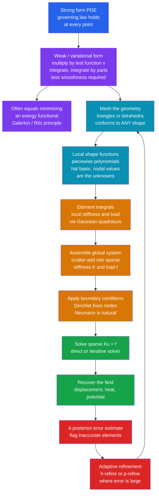

# 🧱 The Finite Element Method

> [!abstract] TL;DR
> Finite differences love tidy square grids, but real engineering objects are curvy — a turbine blade, a car chassis, a human femur. The **finite element method (FEM)** tiles the *actual* shape with an unstructured **mesh** of little triangles or tetrahedra, then represents the unknown field as a **patchwork of simple polynomials** (one per element) glued together at the mesh nodes. It solves the PDE not point-by-point (the "strong form") but in its **weak / variational form** — multiply by a test function and integrate, which for many physics problems is exactly **minimizing an energy**. Integrating the weak form element-by-element **assembles** a giant **sparse stiffness matrix** $K$ and load vector $f$; solving $Ku=f$ recovers the field. Geometric flexibility, natural boundary conditions, and rigorous, refinable **error estimates** made FEM the dominant tool of engineering simulation — the mathematics behind crash tests, stress analysis, heat transfer, and antenna design.

## Intuition

**Analogy:** Think of approximating a smooth sphere with a **geodesic dome** — a shell of small flat triangles. No single triangle is curved, yet together they capture the sphere's shape as closely as you like by using more, smaller facets. The finite element method does the same thing to a *field* on a *shape*. First it tiles the object's geometry with a mesh of tiny triangles (2D) or tetrahedra (3D); then, on each little tile, it approximates the unknown quantity — temperature, displacement, electric potential — with a dead-simple function, usually just a straight (linear) ramp. The full solution is a **patchwork quilt**: crude on each patch, but seamlessly stitched at the shared corners into something that hugs the true answer.

The genius is that the tiles can conform to *any* geometry. A finite-difference grid is a rigid sheet of graph paper — wonderful for a rectangle, agony for a curved wing spar. A finite-element mesh is a flexible net you can drape over a bone, a bridge joint, or an engine block, packing tiny elements where the physics is fierce (a crack tip, a bolt hole) and coarse ones where nothing much happens. That single freedom — **mesh any shape** — is FEM's superpower and the reason it conquered engineering.

---

## How It Works

### Core Mechanics

FEM turns "solve this PDE everywhere" into "solve one modest sparse matrix equation." Six moves get you there.

1. **Weak (variational) form — the mathematical heart.** The PDE in its raw pointwise "strong form" (e.g. $-u'' = f$ *at every point*) demands a solution that is twice differentiable everywhere. FEM instead multiplies the equation by an arbitrary **test function** $v$ (that vanishes where the solution is prescribed) and integrates over the domain. **Integration by parts** then moves one derivative off the unknown and onto the test function, giving the weak form: find $u$ such that $\int u'v' \,dx = \int f v\,dx$ for all admissible $v$. This asks for far *less smoothness* — the solution only needs one square-integrable derivative — which is exactly why jagged, piecewise-linear patchworks are legal. For many problems (elasticity, electrostatics, steady heat) the weak form is equivalent to **minimizing an energy functional** (the *principle of minimum potential energy*); the **Galerkin/Ritz** methods make this precise.

2. **Mesh the domain.** Partition the geometry into non-overlapping **elements** — triangles/quads in 2D, tetrahedra/hexahedra in 3D — sharing **nodes** at their corners. This is where arbitrary geometry is handled: the mesh conforms to curved and irregular boundaries that a structured grid cannot.

3. **Local basis (shape) functions.** On each element, approximate the field as a weighted sum of simple **shape functions** — typically piecewise polynomials. The classic **linear "hat" (tent) function** equals 1 at its own node and ramps to 0 at neighboring nodes, so it is **nonzero over only a few elements**. Crucially, the unknown **coefficients are just the nodal values** of the field — the number your engineer actually wants.

4. **Assembly.** Because each basis function is local, you compute a small **element stiffness matrix** and **element load vector** by integrating the weak form over one element at a time (usually with **Gaussian quadrature** — see the sibling *Numerical_Integration_and_Differentiation*), then **scatter-add** them into the global **sparse stiffness matrix** $K$ and load vector $f$. Overlapping local supports produce a matrix that is mostly zeros — the systematic bookkeeping of assembly is the practical core of every FEM code.

5. **Apply boundary conditions and solve.** **Dirichlet** (prescribed-value) conditions fix nodal unknowns; **Neumann** (prescribed-flux) conditions fall out *naturally* as boundary integrals in the weak form — no special grid stencils required. What remains is the sparse linear system $Ku=f$, handed to a direct or iterative solver (the province of the sibling *Numerical_Linear_Algebra*). Time-dependent or nonlinear problems wrap this in a time-stepping loop or a Newton iteration.

6. **Recover the field and estimate the error.** The nodal solution $u$ reconstructs the field everywhere via the shape functions. FEM's rigorous foundation supplies **a priori** convergence rates (error shrinks as $h^{p+1}$ in element size $h$ for degree-$p$ elements) and **a posteriori** error estimators that flag *which* elements are inaccurate — driving **adaptive mesh refinement** (h-refinement: smaller elements; p-refinement: higher-order polynomials).

### Flow / Architecture



---

## Key Concepts

### Secondary
- Real objects are curvy, but simple grids are square. FEM covers **any shape** with a **mesh** of tiny triangles or tetrahedra.
- On each little tile, the unknown (temperature, bending, stress) is approximated by a **simple straight-line function**; stitched together, they hug the true curve — like a geodesic dome approximating a sphere.
- The unknowns are just the **values at the mesh corners (nodes)**. Find those and you know the field everywhere.
- More, smaller tiles → a more accurate answer, at more computational cost.

### Undergraduate
- **Strong vs. weak form.** The strong form is the PDE at every point; the **weak form** multiplies by a test function and integrates, so integration by parts lowers the smoothness the solution must have. Piecewise-linear approximations are then legal.
- **Galerkin method.** Choose the test functions from the *same* space as the trial (basis) functions. This makes the error **orthogonal** to the approximation space — the best fit in the energy norm — and, for symmetric problems, equals **minimizing potential energy**.
- **Shape functions & assembly.** Linear "hat" functions have local support, so each contributes to only a few matrix rows. The global **stiffness matrix $K$ is sparse**; you build it by summing tiny element matrices — assembly.
- **Stiffness matrix, load vector, and $Ku=f$.** $K$ encodes how nodes resist deformation/diffusion; $f$ encodes sources and Neumann fluxes; solving the sparse system gives the nodal field.
- **Convergence rate.** For linear (P1) elements, the $L^2$ error scales as $O(h^2)$ and the energy (derivative) error as $O(h^1)$ — halving element size $h$ quarters the field error.

### Graduate
- **Function-space framing.** The weak solution lives in a **Sobolev space** $H^1$; the bilinear form $a(u,v)=\int u'v'$ is coercive and bounded, and the **Lax-Milgram theorem** guarantees existence/uniqueness. **Céa's lemma** bounds the FEM error by the best-approximation error, making convergence a question of how well polynomials approximate the true solution.
- **A priori vs. a posteriori estimates.** A priori: $\lVert u-u_h\rVert \le C\,h^{p}\lvert u\rvert_{p+1}$ ties error to mesh size $h$, polynomial order $p$, and solution regularity. A posteriori: computable residual-based estimators localize the error per element and **drive adaptive h/p refinement** to certify accuracy — a decisive advantage over finite differences.
- **Element technology & pitfalls.** Isoparametric mapping to a reference element, quadrature order selection, **locking** (spurious stiffness in thin/incompressible elements), **hourglass** modes under reduced integration, and **mixed formulations** (e.g. displacement-pressure for incompressibility) — the practical craft.
- **Method taxonomy.** FEM (complex geometry, rigorous error control, structural/EM) vs. **finite difference** (fast on regular grids) vs. **finite volume** (locally conservative, ideal for fluids/conservation laws) vs. **spectral** (exponential accuracy on smooth, periodic domains). **Discontinuous Galerkin** blends FEM's geometry with FV's conservation; **isogeometric analysis** uses CAD spline bases directly. The comparison connects to the siblings *Finite_Difference_Methods* and *Classification_of_PDEs_and_Discretization*.
- **Solver coupling.** $K$ is symmetric positive-definite for elliptic problems, so **Cholesky / preconditioned Conjugate Gradient** dominate; nonlinear problems Newton-linearize into a sequence of sparse solves; transient problems use implicit time integrators for stability.

---

## Python Demo

```python
# Minimal 1D FINITE ELEMENT METHOD from scratch (numpy + matplotlib only).
# Boundary-value problem:  -u''(x) = f(x)  on [0, 1],  u(0) = u(1) = 0.
# Chosen so the EXACT answer is u(x) = sin(pi x)  =>  f(x) = pi^2 sin(pi x).
#
# We: (a) build linear "hat" (P1) shape functions on a mesh of elements,
#     (b) integrate the weak form element-by-element with 2-pt Gauss quadrature
#         and ASSEMBLE the global sparse-pattern STIFFNESS MATRIX K and load f,
#     (c) apply Dirichlet BCs and SOLVE Ku = f,
#     (d) plot FEM vs exact, the tent basis, a 2D triangular mesh, and the
#         CONVERGENCE of the error as the mesh is refined (error vs element size h).
import numpy as np
import matplotlib.pyplot as plt
from matplotlib.tri import Triangulation

# ---- the manufactured problem (known exact solution for error checking) ----
f_source = lambda x: (np.pi**2) * np.sin(np.pi * x)   # right-hand side
u_exact  = lambda x: np.sin(np.pi * x)                # exact field
du_exact = lambda x: np.pi * np.cos(np.pi * x)        # exact derivative

# 2-point Gauss-Legendre rule on the reference element [-1, 1] (exact for cubics)
gp = np.array([-1.0/np.sqrt(3.0), 1.0/np.sqrt(3.0)])
gw = np.array([1.0, 1.0])

def fem_solve(n_elem):
    """Linear (P1) FEM for -u''=f on [0,1] with homogeneous Dirichlet BCs.
    Returns the nodes and the nodal solution vector."""
    nodes   = np.linspace(0.0, 1.0, n_elem + 1)
    n_nodes = n_elem + 1
    K = np.zeros((n_nodes, n_nodes))     # global stiffness (sparse in pattern)
    F = np.zeros(n_nodes)                # global load vector

    for e in range(n_elem):                       # loop over elements
        i, j   = e, e + 1                          # the two local nodes
        x0, x1 = nodes[i], nodes[j]
        h      = x1 - x0
        # local stiffness of a linear element: integral of N'_a N'_b dx
        ke = np.array([[ 1.0, -1.0],
                       [-1.0,  1.0]]) / h
        # local load  fe_a = integral f * N_a dx, via 2-pt Gauss quadrature
        fe = np.zeros(2)
        for q in range(2):
            xi = gp[q]
            xg = 0.5 * (x0 + x1) + 0.5 * h * xi           # map to physical x
            N  = np.array([0.5 * (1 - xi), 0.5 * (1 + xi)])  # hat shape fns
            fe += gw[q] * f_source(xg) * N * (0.5 * h)       # Jacobian = h/2
        # ASSEMBLE: scatter-add the element contributions into the global system
        K[np.ix_([i, j], [i, j])] += ke
        F[[i, j]]                 += fe

    # Dirichlet BCs: nodes 0 and n_elem are pinned to 0 -> solve interior block
    interior = np.arange(1, n_nodes - 1)
    u = np.zeros(n_nodes)
    u[interior] = np.linalg.solve(K[np.ix_(interior, interior)], F[interior])
    return nodes, u

def error_norms(nodes, u, spe=40):
    """L2 and H1-seminorm (derivative) error of the piecewise-linear FEM field."""
    l2sq = h1sq = 0.0
    for e in range(len(nodes) - 1):
        x0, x1 = nodes[e], nodes[e + 1]
        slope  = (u[e + 1] - u[e]) / (x1 - x0)      # constant on a P1 element
        xs     = np.linspace(x0, x1, spe)
        uh     = u[e] + slope * (xs - x0)           # FEM value inside element
        l2sq  += np.trapz((uh - u_exact(xs))**2, xs)
        h1sq  += np.trapz((slope - du_exact(xs))**2, xs)
    return np.sqrt(l2sq), np.sqrt(h1sq)

# ---- (c) solve on a coarse mesh and (d) run a convergence study ----
nodes_c, u_c = fem_solve(8)                      # coarse mesh for display
elem_counts  = np.array([4, 8, 16, 32, 64, 128, 256])
hs, l2, h1   = [], [], []
for n in elem_counts:
    nd, uu = fem_solve(n)
    e2, e1 = error_norms(nd, uu)
    hs.append(1.0 / n); l2.append(e2); h1.append(e1)
hs, l2, h1 = map(np.array, (hs, l2, h1))
p_l2 = np.polyfit(np.log(hs), np.log(l2), 1)[0]   # measured convergence slopes
p_h1 = np.polyfit(np.log(hs), np.log(h1), 1)[0]
print(f"measured L2 convergence rate ~ h^{p_l2:.2f}   (theory 2.0 for P1)")
print(f"measured H1 convergence rate ~ h^{p_h1:.2f}   (theory 1.0 for P1)")

# =================== visualization ===================
fig, ax = plt.subplots(2, 2, figsize=(13, 9))

# (1) tent / hat basis functions on a 5-element mesh
mesh5 = np.linspace(0, 1, 6)
xx    = np.linspace(0, 1, 400)
for k in range(1, 5):                              # interior hats
    phi = np.clip(1 - np.abs(xx - mesh5[k]) / (mesh5[1] - mesh5[0]), 0, None)
    ax[0, 0].plot(xx, phi, lw=2, label=f"node {k}")
ax[0, 0].plot(mesh5, np.zeros_like(mesh5), "ks", ms=6)
ax[0, 0].set_title("(1) Linear 'hat' shape functions (local support)")
ax[0, 0].set_xlabel("x"); ax[0, 0].set_ylabel("phi(x)")
ax[0, 0].legend(fontsize=8, ncol=2); ax[0, 0].grid(alpha=0.3)

# (2) FEM patchwork vs exact solution on the coarse mesh
xf = np.linspace(0, 1, 400)
ax[0, 1].plot(xf, u_exact(xf), "k--", lw=2, label="exact sin(pi x)")
ax[0, 1].plot(nodes_c, u_c, "o-", color="crimson", lw=2, ms=6,
              label="FEM (8 linear elements)")
ax[0, 1].set_title("(2) FEM piecewise-linear field vs exact")
ax[0, 1].set_xlabel("x"); ax[0, 1].set_ylabel("u(x)")
ax[0, 1].legend(fontsize=9); ax[0, 1].grid(alpha=0.3)

# (3) convergence: error vs element size h (log-log), with reference slopes
ax[1, 0].loglog(hs, l2, "o-", color="#2563eb", label=f"L2 error  (~h^{p_l2:.2f})")
ax[1, 0].loglog(hs, h1, "s-", color="#d97706", label=f"H1 error  (~h^{p_h1:.2f})")
ax[1, 0].loglog(hs, l2[0]*(hs/hs[0])**2, "--", color="gray", label="slope 2 ref")
ax[1, 0].loglog(hs, h1[0]*(hs/hs[0])**1, ":",  color="gray", label="slope 1 ref")
ax[1, 0].set_title("(3) Convergence: error shrinks as the mesh refines")
ax[1, 0].set_xlabel("element size h"); ax[1, 0].set_ylabel("error norm")
ax[1, 0].legend(fontsize=8); ax[1, 0].grid(alpha=0.3, which="both")

# (4) a simple 2D unstructured triangular mesh (FEM's superpower: any geometry)
rng   = np.random.default_rng(1)
pts   = np.vstack([rng.random((60, 2)),                       # interior points
                   np.column_stack([np.linspace(0, 1, 12), np.zeros(12)]),
                   np.column_stack([np.linspace(0, 1, 12), np.ones(12)]),
                   np.column_stack([np.zeros(12), np.linspace(0, 1, 12)]),
                   np.column_stack([np.ones(12), np.linspace(0, 1, 12)])])
tri = Triangulation(pts[:, 0], pts[:, 1])                     # Delaunay mesh
ax[1, 1].triplot(tri, color="#0891b2", lw=0.7)
ax[1, 1].plot(pts[:, 0], pts[:, 1], "k.", ms=3)
ax[1, 1].set_title("(4) Unstructured triangular mesh of a 2D domain")
ax[1, 1].set_xlabel("x"); ax[1, 1].set_ylabel("y"); ax[1, 1].set_aspect("equal")

plt.tight_layout(); plt.show()
```

**What you see:** panel (1) shows the tent/hat basis functions, each spiking to 1 at its own node and vanishing at neighbors — the local support that makes $K$ sparse. Panel (2) overlays the FEM patchwork on the exact sine; with linear elements the P1 solution is even **nodally exact** for this 1D problem (a famous 1D curiosity), so the dots sit on the curve while the straight segments between them carry the approximation error. Panel (3) is the payoff: on a log-log plot the **$L^2$ error falls along slope 2 ($O(h^2)$)** and the **derivative/energy error along slope 1 ($O(h^1)$)** — the printed fitted exponents confirm the a-priori theory for degree-1 elements. Panel (4) shows an unstructured Delaunay triangular mesh filling a 2D domain: the same machinery drapes over *any* geometry, which is exactly what finite differences cannot do.

---

## Real-World Applications

> **Example:** When an automaker runs a **crash simulation**, an explicit-dynamics FEM code (LS-DYNA, Abaqus/Explicit) meshes the entire vehicle body into millions of shell and solid elements. Each element carries a material model (elastic-plastic steel, foam, glass); at every microsecond time step the solver assembles internal forces from element stresses, marches the nodal accelerations forward, and watches crumple zones fold — capturing exactly where metal yields and how much energy is absorbed. The mesh conforms to every flange, weld, and curved panel, and adaptive refinement concentrates elements at buckling fronts. This is a simulation no finite-difference grid could represent.

- **Structural & mechanical engineering.** Stress/strain analysis of bridges, buildings, aircraft frames, and pressure vessels; buckling and modal (natural-frequency) analysis via the eigenproblem $Ku=\lambda Mu$; crash and impact dynamics. The workhorse of civil, mechanical, and aerospace design.
- **Heat transfer.** Steady and transient conduction in engine blocks, electronics, and turbine blades — Neumann (flux) and convective boundary conditions drop naturally out of the weak form.
- **Electromagnetics.** Antenna radiation patterns, electric-motor and transformer design, waveguides, and MRI coil fields — vector (edge/Nédélec) elements handle Maxwell's equations on complex geometry.
- **Biomechanics & biomedical.** Stress in bones and dental/orthopedic **implants**, patient-specific artery and heart-valve models, and surgical-device design — meshes built directly from CT/MRI scans.
- **Geomechanics & multiphysics.** Dam and tunnel stability, reservoir geomechanics, and coupled thermo-mechanical-fluid (poroelastic) problems.
- **The software ecosystem.** Commercial codes **ANSYS, Abaqus, COMSOL, Nastran, LS-DYNA**; open-source **FEniCS, deal.II, MFEM, Elmer**. All rest on the same weak-form-assemble-solve pipeline.

---

## Common Pitfalls

- **Bad mesh quality (slivers & high aspect ratio).** Long, thin, or nearly-degenerate elements wreck the condition number of $K$ and destroy accuracy. Watch aspect ratio and minimum angle; use quality-controlled Delaunay meshing and smoothing. The mesh, not the solver, is usually the weakest link.
- **Under-integration / over-integration.** Too few Gauss points misses the load or produces spurious zero-energy **hourglass** modes; too many wastes time. Match the quadrature order to the polynomial degree of the integrand.
- **Locking in thin or incompressible elements.** Low-order elements can be spuriously over-stiff for bending (shear locking) or near-incompressibility (volumetric locking), giving badly wrong displacements. Use higher-order, reduced-integration, or mixed/incompatible-mode elements.
- **Confusing "it ran" with "it converged."** A single mesh gives *a* number, not *the* number. Always run a **convergence study** — refine the mesh (h) or raise the order (p) and confirm the answer stops changing. Trust a-posteriori error estimates, not eyeballing.
- **Mishandling boundary conditions.** Forgetting that Neumann conditions are *natural* (already in the weak form) and instead imposing them like Dirichlet, or leaving a body under-constrained so $K$ is singular (rigid-body modes), yields nonsense or a solver failure.
- **Ignoring sparsity.** Storing $K$ dense and calling a dense $O(N^3)$ solver is fatal at scale. Use sparse storage and sparse direct or preconditioned iterative solvers — the concern of the sibling *Numerical_Linear_Algebra*.
- **Wrong method for the physics.** FEM is not always best: for shock-dominated compressible flow a **finite-volume** scheme conserves fluxes better; for smooth periodic problems a **spectral** method is far more accurate per DOF. Choose the tool to fit the problem.

---

## Related Concepts

- [[Numerical_Integration_and_Differentiation]] — Gaussian quadrature is how each element's stiffness and load integrals are actually evaluated.
- [[Numerical_Linear_Algebra]] — the assembled system $Ku=f$ is a large **sparse** linear system; sparse direct and Krylov solvers are what make FEM scale (note: also a Mathematics/16 note of the same name).
- [[Root_Finding_and_Optimization]] — nonlinear FEM Newton-linearizes into a sequence of sparse solves; energy minimization is an optimization view of the weak form.
- [[Initial_Value_Problems_and_Euler_Methods]] — transient FEM wraps the spatial solve in a time-stepping loop.
- [[Interpolation_and_Data_Fitting]] — shape functions are exactly piecewise-polynomial interpolation of nodal values.
- [[Computational_Physics_Overview]] — the map of the discretize-solve-validate pipeline this note sits in.
- [[Partial_Differential_Equations]] — the strong-form governing laws (heat, elasticity, Maxwell) that FEM recasts in weak form.
- [[Vector_Calculus_and_Differential_Operators]] — integration by parts and the divergence theorem are the machinery that produces the weak form.
- [[Introduction_to_PDEs]] — classification (elliptic/parabolic/hyperbolic) that guides which discretization and solver to pick.
- [[Numerical_ODEs_and_PDEs]] — the finite-difference cousin FEM is contrasted against.
- [[Systems_of_Linear_Equations]] — the linear-algebra foundation of $Ku=f$.
- [[Eigenvalues_and_Eigenvectors]] — modal and buckling analysis solve the generalized eigenproblem $Ku=\lambda Mu$.
- [[Hilbert_Spaces]] — the weak solution lives in a Sobolev/Hilbert space; Lax-Milgram and Céa's lemma live here.
- [[Stress_Strain_and_Elastic_Moduli]] — the constitutive relations that structural FEM assembles into element stiffness.
- [[Fracture_Mechanics_and_Toughness]] — FEM resolves the stress concentrations and crack-tip fields that drive fracture.
- [[Biomechanics_of_Movement]] — bone and implant stress analysis is a major FEM application in biomechanics.
- [[Maxwells_Equations]] — computational electromagnetics uses edge-element FEM for antennas and motors.
- [[Physics_and_Collision]] — real-time game physics uses simplified FEM-like deformable-body models for cloth and soft bodies.

---

## Review Questions

1. **(Secondary)** Why is a finite-element mesh of triangles better than a square finite-difference grid for simulating stress in a curved, oddly shaped part? Use the geodesic-dome analogy in your answer.
2. **(Undergraduate)** Explain what the *weak form* of a PDE is and why moving one derivative onto the test function (integration by parts) lets FEM use crude piecewise-linear "hat" functions that are not even twice differentiable.
3. **(Undergraduate)** Describe the *assembly* step: how do small element stiffness matrices become a single global sparse matrix $K$, and why is $K$ sparse rather than dense?
4. **(Undergraduate/Graduate)** For linear (P1) elements the $L^2$ error scales as $O(h^2)$. If a simulation gives an error of $0.01$ on a mesh of 100 elements, roughly what mesh would you need to reach an error of $0.0001$, and how much more work is that in 3D?
5. **(Graduate)** You must simulate (a) transonic airflow with shocks over a wing, (b) stress in a hip implant meshed from a CT scan, and (c) a smooth periodic diffusion problem on a square. For each, argue whether finite volume, finite element, or a spectral method is the best fit and why.
6. **(Graduate)** What is an *a posteriori* error estimator, and how does it enable adaptive h/p refinement? Why is this "certifiable accuracy" often cited as FEM's key advantage over finite differences?

---

## Sources

- Hughes, T. J. R. — *The Finite Element Method: Linear Static and Dynamic Finite Element Analysis* (Dover, 2000). The standard graduate text on formulation and element technology.
- Zienkiewicz, O. C., Taylor, R. L. & Zhu, J. Z. — *The Finite Element Method: Its Basis and Fundamentals*, 7th ed. (Butterworth-Heinemann, 2013). The classic engineering reference.
- Brenner, S. C. & Scott, L. R. — *The Mathematical Theory of Finite Element Methods*, 3rd ed. (Springer, 2008). Sobolev spaces, Céa's lemma, and error estimates.
- Reddy, J. N. — *An Introduction to the Finite Element Method*, 3rd ed. (McGraw-Hill, 2005). Accessible derivations from the weak form to assembly.
- Logg, A., Mardal, K.-A. & Wells, G. (eds.) — *Automated Solution of Differential Equations by the Finite Element Method* (the FEniCS Book, Springer, 2012). Free: [fenicsproject.org](https://fenicsproject.org/book/)

---

#computational-physics #finite-element-method #FEM #mesh #engineering-simulation
