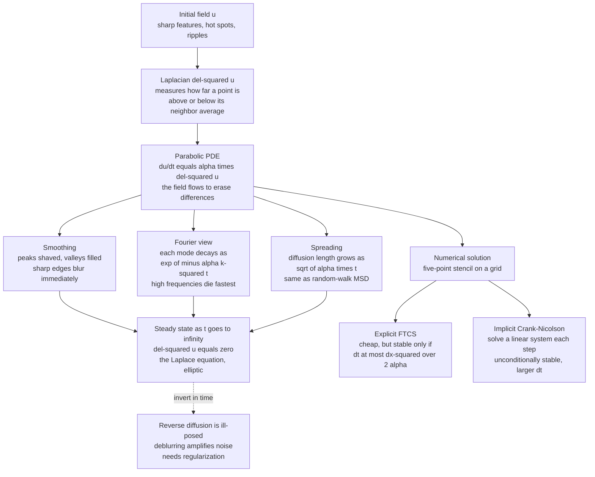

# 🌡️ The Heat and Diffusion Equation

> [!abstract] TL;DR
> The **diffusion (heat) equation** `∂u/∂t = α∇²u` is the canonical **parabolic PDE** and one of the most universal laws in science: the *same* equation governs heat conduction (Fourier), molecular diffusion (Fick), Brownian motion and probability (the heat kernel / Fokker-Planck), option pricing (Black-Scholes), and image blurring (Gaussian scale space). Its engine is the **Laplacian** `∇²u`, which measures how far a point sits *above or below the average of its neighbors*; the field then flows to erase that difference — hot spots cool, cold spots warm, and everything relaxes toward a bland equilibrium. It is a **smoothing, entropy-increasing, irreversible** process with three signature behaviors: sharp features **blur immediately**, each Fourier mode **decays as `e^(−α k² t)`** (high frequencies die fastest), and a point source **spreads as `√(α·t)`** (the same as random-walk MSD). Solving it numerically by **finite differences** — the simple explicit **FTCS** scheme with its `dt ≲ dx²/(2α)` stability leash, or the unconditionally stable implicit **Crank-Nicolson** — is the gateway to all of field simulation. Its steady state `∇²u = 0` is the **Laplace equation**, and running it *backward* in time is famously **ill-posed**.

---

## Intuition

**Analogy:** Drop a bead of ink into a glass of still water and watch it bloom outward — the sharp dark point softens, the edges blur, tendrils widen and fade, and after long enough the whole glass is a uniform, featureless gray. Heat does exactly the same thing crawling through a metal bar; a rumor does it spreading through a crowd; a stock price does it (roughly) through time. The diffusion equation is **nature's great equalizer** — it relentlessly smooths out differences, erasing sharp features and driving everything toward a bland, uniform equilibrium.

Technically, the equation encodes a single rule applied everywhere at once: *every point nudges itself toward the average of its immediate neighbors.* A point hotter than its surroundings loses heat; a point colder gains it. Iterate that local averaging forever and you get global smoothing, the slow death of all structure, and the arrow of time made visible. Because that rule is so generic, the *same* equation reappears wherever a conserved quantity flows down its own gradient — which is why mastering it is the first real step into computational field theory.

---

## How It Works

### Core Mechanics

1. **The equation and what each piece means.** In `∂u/∂t = α∇²u`, the field `u(x, t)` is temperature, concentration, or probability density; `α` (the **diffusivity**, units of length² / time) sets how fast smoothing happens; `∇²u = ∂²u/∂x² + ∂²u/∂y² + …` is the **Laplacian**. Being *parabolic* means the equation is **first order in time, second order in space** — time marches forward irreversibly while space is smoothed symmetrically. (The companion sibling note *Classification_of_PDEs_and_Discretization* places this against the elliptic and hyperbolic families.)

2. **The Laplacian is a "neighbor-average detector."** The discrete Laplacian at a point is `(sum of neighbor values) − (number of neighbors) × (own value)`, all over `dx²`. It is **positive** where a point sits in a valley (colder than its surroundings) and **negative** where it sits on a peak (hotter). So `∂u/∂t = α∇²u` reads literally as: *"grow toward your neighbors' average."* Peaks are shaved down, valleys filled in. This is why diffusion **smooths** — it is local averaging run continuously in time.

3. **Smoothing and infinite propagation speed.** Any sharp feature begins blurring *instantly*: mathematically a point disturbance influences the entire domain immediately (an idealization — real signals are not infinitely fast, but the model is superbly useful). Diffusion never sharpens, never creates new extrema (a **maximum principle**), and monotonically destroys structure — the hallmark of an entropy-increasing, irreversible flow.

4. **Fourier view: mode decay, high frequencies die fastest.** Decompose the field into spatial waves. Because `∇²` turns a wave of wavenumber `k` into `−k²` times itself, each Fourier mode evolves independently and **decays exponentially**: `û(k, t) = û(k, 0) · e^(−α k² t)`. The `k²` is decisive — **short-wavelength (high-frequency) ripples vanish enormously faster than long, gentle undulations.** A jagged edge loses its fine texture in a blink while the broad shape lingers; this is exactly *Gaussian blur* and the reason diffusion is used as a denoiser and scale-space smoother.

5. **The `√t` spreading law and the Gaussian heat kernel.** A point source (a delta spike) evolves into a **widening Gaussian** — the **heat kernel** `G(x, t) ∝ t^(−d/2) exp(−x² / 4αt)`. Its width, the **diffusion length**, grows as `L(t) ~ √(α·t)`. This sub-linear spreading is *slow*: to diffuse twice as far takes four times as long. It is identical to the **mean-squared displacement of a random walk**, `⟨x²⟩ = 2·d·α·t` — the deep bridge between the deterministic heat equation and Brownian motion (see *Stochastic_Differential_Equations_and_Langevin*).

6. **Steady state = the Laplace equation.** As `t → ∞` the time derivative dies (`∂u/∂t → 0`) and the field freezes into the configuration where `∇²u = 0` — the **Laplace equation**, an *elliptic* PDE. Diffusion is thus the physical relaxation *toward* the electrostatic-potential-like steady state, connecting the parabolic and elliptic worlds. Running diffusion to equilibrium is precisely the **Jacobi iteration** used to solve Laplace/Poisson problems: each sweep of neighbor-averaging is one step of diffusion in disguise (the sibling note *The_Poisson_and_Laplace_Equation* develops this).

7. **Numerical solution by finite differences (FTCS).** Discretize space on a grid of spacing `dx` and time in steps `dt`. Replace `∇²u` by the five-point stencil and `∂u/∂t` by a forward difference (**Forward-Time, Centered-Space**):
   $$u_{i}^{n+1} = u_i^n + \frac{\alpha\,dt}{dx^2}\big(u_{i+1}^n - 2u_i^n + u_{i-1}^n\big).$$
   This is explicit (each new value depends only on *known* old values) and trivially cheap — but its stability is on a short leash. The five-point stencil is built directly from the second-derivative formula in *Numerical_Integration_and_Differentiation*, and the time march is the same forward-Euler step as in *Initial_Value_Problems_and_Euler_Methods*.

8. **The explicit stability limit `dt ≲ dx²/(2α)`.** Von Neumann analysis asks how each Fourier mode is amplified per step; stability requires the **diffusion number** `r = α·dt/dx²` to satisfy `r ≤ 1/2` in 1-D (and `r ≤ 1/4` in 2-D). Overshoot it and the shortest-wavelength mode is amplified rather than damped: the solution erupts into a growing **checkerboard oscillation** and overflows. The brutal consequence is `dt ~ dx²` — **halving the grid spacing quarters the time step**, so fine grids crawl. (Detailed in the sibling *Finite_Difference_Methods*.)

9. **Implicit and Crank-Nicolson — buying back the step size.** Evaluate the Laplacian at the *new* time level (**implicit / BTCS**) and each step requires solving a linear system, but the scheme is **unconditionally stable** — any `dt` works. **Crank-Nicolson** averages the explicit and implicit stencils, giving second-order accuracy in time *and* unconditional stability, at the cost of a tridiagonal (or sparse 2-D) solve each step — the province of *Numerical_Linear_Algebra*.

10. **Boundary conditions.** **Dirichlet** fixes the value on the boundary (an edge held at a set temperature); **Neumann** fixes the flux `∂u/∂n` (an *insulated* wall lets no heat through, `∂u/∂n = 0`). Boundary conditions select the steady state: hold opposite edges hot and cold and diffusion relaxes to a smooth harmonic gradient between them.

11. **The reverse problem is catastrophically ill-posed.** Running diffusion *backward* (recovering the sharp original from a blurred image — deblurring) means multiplying each mode by `e^(+α k² t)`, which **amplifies high-frequency noise without bound**. A whisper of measurement noise explodes into garbage. This is the textbook example of an **ill-posed inverse problem** requiring **regularization** — a permanent lesson in why smoothing cannot simply be undone.

12. **The rich extended family.** Add a source and `∂u/∂t = α∇²u + f` is the **Poisson-driven** heat equation. Make `α` depend on `u` (temperature-dependent conductivity) and you get **nonlinear diffusion**. Add a reaction term, `∂u/∂t = α∇²u + R(u)`, and diffusion can *create* structure instead of destroying it — **reaction-diffusion** and Turing **pattern formation**. Add a transport term `v·∇u` and you get **advection-diffusion**, the workhorse of pollutant and heat transport.

### Flow / Architecture



---

## Key Concepts

### Secondary Level

- **Diffusion smooths things out.** Heat, ink, smell, or a crowd's mood all spread from where there is a lot to where there is little, until everything is even. The diffusion equation is the math for that spreading.
- **Neighbor averaging.** Each point creeps toward the average of the points next to it. Do that everywhere, forever, and bumps flatten out.
- **Slow but steady.** Spreading is fast at first (sharp things blur quickly) and then slows down — reaching *twice* as far takes *four* times as long.

### Undergraduate Level

- **`∂u/∂t = α∇²u` is parabolic:** first order in time, second in space. The Laplacian `∇²u` is a curvature / neighbor-average detector; the sign of `∇²u` tells a point whether to heat up or cool down.
- **Fourier decay `e^(−α k² t)`:** modes are eigenfunctions of `∇²`; the `k²` means high-frequency detail dies exponentially faster than low-frequency shape. This *is* Gaussian blur.
- **Diffusion length `√(α t)`** and the **Gaussian heat kernel:** a point source spreads into a widening bell curve whose variance grows *linearly* in time — the deterministic face of a random walk.
- **FTCS and its stability leash:** the explicit scheme is `u_new = u + r·(stencil)` with diffusion number `r = α dt/dx²`; stability demands `r ≤ 1/2` (1-D), forcing `dt ~ dx²`.
- **Steady state is Laplace's equation:** `∂u/∂t → 0` gives `∇²u = 0`; iterating diffusion to equilibrium *is* the Jacobi relaxation method for elliptic problems.

### Graduate Level

- **Von Neumann stability analysis:** substitute `u_j^n = ξ^n e^{i k j dx}`; the amplification factor for FTCS is `ξ = 1 − 4r·sin²(k dx/2)`, and `|ξ| ≤ 1` for *all* `k` requires `r ≤ 1/2`. Crank-Nicolson gives `ξ = (1 − 2r sin²)/(1 + 2r sin²)`, whose magnitude is always `≤ 1` — hence unconditional stability.
- **Consistency + stability = convergence (Lax equivalence theorem):** a consistent, stable finite-difference scheme converges to the true solution as `dx, dt → 0`; FTCS is `O(dt) + O(dx²)`, Crank-Nicolson is `O(dt²) + O(dx²)`.
- **Semi-discretization and the method of lines:** discretize space only and the heat equation becomes a large *stiff* ODE system `du/dt = A u` with `A` the discrete Laplacian; its eigenvalues span `0` down to `~ −4α/dx²`, and the stiffness (ratio `~ dx^{-2}`) is exactly why explicit time-stepping is throttled — connecting directly to stiff-ODE theory.
- **Ill-posedness and regularization:** backward diffusion multiplies modes by `e^{+α k² t}`, an unbounded operator; recovering the sharp field is a Fredholm problem of the first kind requiring Tikhonov or total-variation regularization. Anisotropic (Perona-Malik) diffusion tames this for edge-preserving denoising.
- **Universality via the Feynman-Kac / Fokker-Planck link:** the heat kernel is the transition density of Brownian motion; adding drift and a potential yields Fokker-Planck; a change of variables maps Black-Scholes onto the heat equation — one PDE, many disciplines.

---

## Python Demo

```python
# The 2D heat/diffusion equation  du/dt = alpha * laplacian(u)
# solved by the explicit FTCS finite-difference scheme.
# Demonstrates three signature behaviors:
#   (A) SMOOTHING  -- a point source blurs into a widening Gaussian (imshow snapshots)
#   (B) MODE DECAY -- high-frequency patterns decay FASTEST (e^{-alpha k^2 t})
#   (C) sqrt(t) SPREADING -- diffusion length grows as sqrt(alpha * t)
#   (+) STEADY STATE -- a plate with one hot edge relaxes to the Laplace equation
# numpy + matplotlib only.

import numpy as np
import matplotlib.pyplot as plt

# ---------------------------------------------------------------------------
# Grid, physics, and the explicit-stability time step
# ---------------------------------------------------------------------------
L, N   = 1.0, 160
dx     = L / N
alpha  = 1.0

# FTCS stability: diffusion number r = alpha*dt/dx^2 must be <= 1/4 in 2D
# (the canonical 1D limit is r <= 1/2, i.e. dt <= dx^2 / (2*alpha)).
r  = 0.20                      # safely below the 2D limit 0.25
dt = r * dx**2 / alpha
print(f"dx = {dx:.4e}   dt = {dt:.4e}   diffusion number r = {r} (2D limit 0.25)")

x = (np.arange(N) - N // 2) * dx
X, Y = np.meshgrid(x, x, indexing="ij")

def laplacian(u):
    # 5-point stencil, periodic wrap (conserves total heat) via np.roll
    return (np.roll(u, 1, 0) + np.roll(u, -1, 0)
            + np.roll(u, 1, 1) + np.roll(u, -1, 1) - 4.0 * u) / dx**2

def step(u):
    return u + alpha * dt * laplacian(u)

# ---------------------------------------------------------------------------
# (A) + (C) Point source -> widening Gaussian; track the spread sigma(t)
# ---------------------------------------------------------------------------
u = np.zeros((N, N))
u[N // 2, N // 2] = 1.0 / dx**2        # approx unit-mass delta spike

record = [0, 200, 1600]                # snapshot steps (blob stays inside domain)
snaps, sigmas, times = {}, [], []

for n in range(record[-1] + 1):
    if n in record:
        snaps[n] = u.copy()
    m    = u.sum()                     # total heat (conserved)
    varx = (u * X**2).sum() / m        # second moment about the center
    vary = (u * Y**2).sum() / m
    sigmas.append(np.sqrt(0.5 * (varx + vary)))   # per-axis std dev
    times.append(n * dt)
    u = step(u)

sigmas, times = np.array(sigmas), np.array(times)
# theory: variance per axis = 2*alpha*t  ->  sigma = sqrt(2*alpha*t)
sigma_theory = np.sqrt(2.0 * alpha * times)

# ---------------------------------------------------------------------------
# (B) High-frequency modes decay fastest: cos(k*X) are exact eigenfunctions
# ---------------------------------------------------------------------------
kfac  = 2.0 * np.pi / L
modes = [1, 3, 8]                      # spatial frequencies (cycles per L)
fields = {mo: np.cos(kfac * mo * X) for mo in modes}
amp    = {mo: [] for mo in modes}

nB, tB = 2400, []
for n in range(nB + 1):
    tB.append(n * dt)
    for mo in modes:
        amp[mo].append(fields[mo].max())          # peak amplitude of the mode
        fields[mo] = step(fields[mo])
tB = np.array(tB)

# ---------------------------------------------------------------------------
# (+) Steady state: square plate, TOP edge hot (Dirichlet), relax to Laplace
# ---------------------------------------------------------------------------
M   = 60
p   = np.zeros((M, M))
p[0, :] = 1.0                          # hot top edge; other three edges cold (0)
dxp = 1.0 / M
dtp = 0.20 * dxp**2 / alpha
for _ in range(20000):                 # iterate diffusion -> del^2 p = 0
    lap = (p[2:, 1:-1] + p[:-2, 1:-1] + p[1:-1, 2:] + p[1:-1, :-2]
           - 4.0 * p[1:-1, 1:-1]) / dxp**2
    p[1:-1, 1:-1] += alpha * dtp * lap

# ---------------------------------------------------------------------------
# Plots
# ---------------------------------------------------------------------------
fig, ax = plt.subplots(2, 3, figsize=(15, 9))

# Top row: SMOOTHING snapshots of the spreading point source
vmax = snaps[record[1]].max()
for k, n in enumerate(record):
    im = ax[0, k].imshow(snaps[n].T, origin="lower", cmap="inferno",
                         extent=[x[0], x[-1], x[0], x[-1]], vmin=0, vmax=vmax)
    ax[0, k].set_title(f"t = {n*dt:.4f}   (step {n})")
    ax[0, k].set_xlabel("x"); ax[0, k].set_ylabel("y")
    fig.colorbar(im, ax=ax[0, k], fraction=0.046)
ax[0, 0].set_ylabel("SMOOTHING\ny")

# Bottom-left: sqrt(t) spreading law
ax[1, 0].plot(np.sqrt(times), sigmas, "b.", ms=3, label="measured spread")
ax[1, 0].plot(np.sqrt(times), sigma_theory, "k--", lw=1.5,
              label="theory  sqrt(2*alpha*t)")
ax[1, 0].set_xlabel("sqrt(t)"); ax[1, 0].set_ylabel("diffusion length  sigma")
ax[1, 0].set_title("(C) Spread grows as sqrt(alpha * t)")
ax[1, 0].legend(); ax[1, 0].grid(alpha=0.3)

# Bottom-middle: mode decay -- high frequency dies fastest
for mo in modes:
    kk = kfac * mo
    ln = ax[1, 1].semilogy(tB, np.maximum(np.abs(amp[mo]), 1e-6),
                           label=f"mode k = {mo}")[0]
    ax[1, 1].semilogy(tB, np.exp(-alpha * kk**2 * tB), "--",
                      color=ln.get_color(), alpha=0.6)
ax[1, 1].set_xlabel("time t"); ax[1, 1].set_ylabel("mode amplitude")
ax[1, 1].set_title("(B) High freq decays fastest  (dashed = theory)")
ax[1, 1].set_ylim(1e-5, 2); ax[1, 1].legend(); ax[1, 1].grid(alpha=0.3, which="both")

# Bottom-right: steady state = solution of Laplace's equation
im = ax[1, 2].imshow(p.T, origin="lower", cmap="coolwarm",
                     extent=[0, 1, 0, 1], vmin=0, vmax=1)
ax[1, 2].set_title("Steady state: del^2 u = 0 (Laplace)")
ax[1, 2].set_xlabel("x"); ax[1, 2].set_ylabel("y")
fig.colorbar(im, ax=ax[1, 2], fraction=0.046)

plt.tight_layout()
plt.show()
```

Running it prints the chosen `dt` and confirms `r = 0.2` sits safely under the 2-D limit. The **top row** shows the delta spike blooming into an ever-wider, ever-flatter Gaussian — visible smoothing. The **bottom-left** panel plots the measured width against `√t` and lands right on the `√(2αt)` line: the diffusion length grows as the square root of time. The **bottom-middle** panel is the punchline of the whole note — the `k = 8` mode plunges to the noise floor almost immediately, `k = 3` follows, and `k = 1` barely budges, each tracking its `e^(−α k² t)` theory curve: **high frequencies die fastest.** The **bottom-right** panel shows the hot-top-edge plate after diffusion has relaxed it into the smooth harmonic gradient that solves `∇²u = 0` — the Laplace steady state. Push `r` above `0.25` and the whole thing detonates into a checkerboard, a hands-on encounter with the explicit-stability limit.

---

## Real-World Applications

> **Example:** In **semiconductor fabrication**, dopant atoms are driven into silicon by heating the wafer, and the resulting concentration profile is computed by solving *exactly* this equation — `∂C/∂t = D∇²C` (Fick's second law, mathematically identical to the heat equation). Process engineers pick the diffusion time and temperature so the junction depth `~ √(D·t)` lands where the transistor design requires. The `√t` spreading law is not a curiosity here — it is a manufacturing dial.

- **Heat transfer and thermal engineering** — temperature fields in engines, buildings, electronics cooling, and heat sinks are transient-conduction problems solved by finite-difference or finite-element heat solvers.
- **Groundwater and pollutant transport** — contaminant plumes obey advection-diffusion; environmental models forecast spread and dilution by adding a transport term to the diffusion equation.
- **Neutron diffusion in reactors** — the neutron flux in a reactor core is modeled by a diffusion equation (with a fission source term); reactor criticality is a steady-state eigenvalue problem of this kind.
- **Quantitative finance (Black-Scholes)** — a change of variables maps the Black-Scholes option-pricing PDE onto the heat equation, so option values *diffuse* backward from expiry; the same numerical machinery prices derivatives.
- **Image processing and computer vision** — Gaussian blur *is* running the heat equation for a short time; **Gaussian scale space**, edge-preserving anisotropic diffusion, and diffusion-based denoising are all built on this, and modern generative **diffusion models** borrow the same forward-noising intuition.
- **Biology and pattern formation** — reaction-diffusion systems (Turing) explain animal coat patterns, morphogen gradients, and chemical waves — diffusion that *creates* structure once a reaction term is added.

---

## Common Pitfalls

- **Violating the stability limit** — setting `dt` even slightly above `dx²/(2α)` (1-D) or `dx²/(4α)` (2-D) makes the shortest-wavelength mode grow instead of decay; the solution erupts into a **checkerboard oscillation** and overflows. The fix is either a smaller `dt` or an implicit scheme — *never* a smaller `dx` alone (that makes it worse).
- **The `dt ~ dx²` trap** — refining the grid for accuracy quietly *quarters* the allowed explicit time step, so a "just make the grid finer" instinct can make an explicit run 8× more expensive per doubling. Switch to Crank-Nicolson when the grid is fine.
- **Trying to run diffusion backward / naive deblurring** — inverting the heat equation amplifies noise catastrophically (ill-posed). Deblurring or sharpening *must* be regularized; treating it as a plain inverse produces pure noise.
- **Mishandling boundary conditions** — forgetting to hold Dirichlet edges fixed, or implementing an insulated (Neumann) wall as a fixed value, silently changes the steady state and can leak or inject heat. Neumann needs a ghost-cell or one-sided stencil, not a clamped value.
- **Non-conservation from the wrong stencil or BC** — an inconsistent boundary treatment lets total heat drift; check that `Σu·dx^d` is conserved (closed/periodic) or changes only through the boundary flux.
- **Under-resolving sharp features** — a discontinuity spread over one grid cell aliases into spurious high-frequency ripples (Gibbs-like); resolve steep gradients with enough points or expect oscillatory artifacts.
- **Confusing diffusivity units** — `α` carries units of length²/time; mixing up `α`, `dx`, and `dt` units is the most common source of a solver that is silently unstable or absurdly slow.

---

## Related Concepts

- [[Partial_Differential_Equations]] — the physics-vault treatment of the heat equation, separation of variables, and the parabolic/elliptic/hyperbolic classification this note discretizes.
- [[Introduction_to_PDEs]] — the mathematics-vault primer on PDE types and analytic solution methods behind the diffusion equation.
- [[Vector_Calculus_and_Differential_Operators]] — the Laplacian `∇²`, divergence, and gradient that make up the diffusion operator.
- [[Fourier_Analysis]] — the mode decomposition in which each wavenumber decays independently as `e^(−α k² t)`.
- [[Fourier_Analysis_and_Integral_Transforms]] — Fourier and Green's-function methods that solve the heat equation analytically and give the heat kernel.
- [[Entropy_and_Second_Law]] — diffusion is the entropy-increasing, irreversible smoothing that embodies the arrow of time.
- [[Diffusion_in_Solids_and_Ficks_Laws]] — Fick's first and second laws, the atomistic diffusion identical in form to the heat equation (semiconductor doping, carburizing).
- [[Thermal_Properties_and_Heat_Conduction]] — Fourier's law of conduction, the physical origin of the heat equation and of the diffusivity `α`.
- [[Diffusion_and_Brownian_Motion_in_Cells]] — the random-walk / Brownian picture whose `⟨x²⟩ = 2Dt` matches the `√t` diffusion length exactly.
- [[Common_Probability_Distributions]] — the Gaussian heat kernel is the normal distribution; diffusion is a moving, widening Gaussian.
- [[Pattern_Formation_and_Morphogenesis]] — reaction-diffusion and Turing patterns: diffusion that *creates* structure once a reaction term is added.
- [[Black_Scholes_Model]] — the option-pricing PDE that transforms into the heat equation, pricing derivatives by (backward) diffusion.
- [[Initial_Value_Problems_and_Euler_Methods]] — the forward-Euler time march used in FTCS, and the explicit-stability idea reappearing as `dt ~ dx²`.
- [[Numerical_Integration_and_Differentiation]] — the second-derivative finite-difference stencil that discretizes `∇²`.
- [[Numerical_Linear_Algebra]] — the sparse linear solves that implicit and Crank-Nicolson schemes require each time step.

Within this Computational Physics vault, this note is the entry point for the PDE section and leads into the not-yet-written siblings *Finite_Difference_Methods* (stencils, von Neumann stability, and the FTCS/Crank-Nicolson machinery in full), *Classification_of_PDEs_and_Discretization* (parabolic vs elliptic vs hyperbolic), *The_Poisson_and_Laplace_Equation* (the elliptic steady state and iterative relaxation solvers), *The_Wave_Equation_and_Hyperbolic_PDEs* (the finite-speed, oscillatory counterpart to diffusion's infinite-speed smoothing), and *Stochastic_Differential_Equations_and_Langevin* (the Brownian-motion / Fokker-Planck face of the same physics).

---

## Review Questions

1. **(Secondary)** Ink dropped into still water blurs from a sharp dot into a wide gray cloud but never spontaneously re-collects into a dot. Which two features of the diffusion equation — one about *what it does to sharp features* and one about *reversing time* — explain this everyday irreversibility?
2. **(Undergraduate)** Starting from `û(k, t) = û(k, 0)·e^(−α k² t)`, explain *why* a jagged, high-frequency pattern blurs almost instantly while a broad, low-frequency shape persists. Then use the same result to explain why deblurring (running diffusion backward) is numerically hopeless in the presence of noise.
3. **(Graduate)** You must simulate 2-D heat conduction on a `1000 × 1000` grid over a long physical time. Using the diffusion number `r = α·dt/dx²`, quantify the explicit FTCS time-step ceiling and the number of steps required; then argue whether Crank-Nicolson is worth its per-step linear solve. In your answer, connect the explicit-step restriction to the *stiffness* of the semi-discrete ODE system `du/dt = A u` and the eigenvalue spectrum of the discrete Laplacian.

---

## Sources

- Morton, K. W. & Mayers, D. F., *Numerical Solution of Partial Differential Equations*, 2nd ed. (Cambridge, 2005), Ch. 2–3 — FTCS, Crank-Nicolson, von Neumann stability for the heat equation.
- LeVeque, R. J., *Finite Difference Methods for Ordinary and Partial Differential Equations* (SIAM, 2007), Ch. 9–10 — the diffusion equation, method of lines, stability and convergence.
- Crank, J., *The Mathematics of Diffusion*, 2nd ed. (Oxford, 1975) — analytic solutions, the heat kernel, and the `√t` spreading law.
- Newman, M. E. J., *Computational Physics* (2013), Ch. 9 — FTCS and Crank-Nicolson for parabolic and elliptic PDEs in Python.
- Press, Teukolsky, Vetterling & Flannery, *Numerical Recipes*, 3rd ed. (2007), Ch. 20 — parabolic PDEs, operator splitting, and implicit schemes.

---

#computational-physics #heat-equation #diffusion #parabolic-PDE #smoothing
