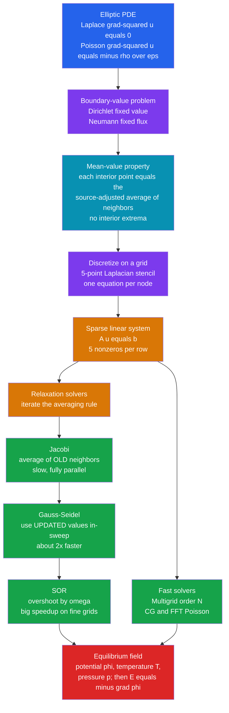

# ⚡ The Poisson and Laplace Equation

> [!abstract] TL;DR
> **Laplace's equation** $\nabla^2 u = 0$ and **Poisson's equation** $\nabla^2 u = -\rho/\varepsilon$ describe the **equilibrium fields of physics** — electric and gravitational potentials, steady temperatures, incompressible-flow potentials, soap-film shapes. They are **elliptic** partial differential equations: pure **boundary-value problems** with no time. Their solution is the **smoothest field consistent with the boundary**, where every interior point equals the source-adjusted **average of its neighbors** (the mean-value property). Discretizing with the **5-point Laplacian stencil** turns them into a large **sparse linear system** $A\mathbf{u}=\mathbf{b}$, solved either by **relaxation** — Jacobi, Gauss–Seidel, SOR, which literally smear values to the neighbor-average until the field settles — or by fast solvers: **multigrid** (optimal $O(N)$), **conjugate gradient**, and **FFT-based** Poisson solvers. The same elliptic solve is the **pressure-Poisson step**, the expensive heart of incompressible fluid simulation.

## Intuition

**Analogy:** Stretch a thin **rubber sheet** over a wire frame that you have bent into hills and valleys. Let go, and the sheet settles into the **smoothest possible surface** that still hangs on that frame — no bumps, no creases, no local peaks in the middle. Look at any interior point of the settled sheet and its height is exactly the **average of the heights all around it**; if it were higher, tension would pull it down; if lower, up. That equilibrium sheet *is* the solution to **Laplace's equation**. Now press down on the sheet here and lift it there with little weights — poke sources into the interior — and it settles into a new smoothest shape that accommodates those pokes. That is **Poisson's equation**, where the weights are the charge or mass density $\rho$.

This "smoothest field that fits the boundary and its sources" is not a metaphor limited to rubber. It is *literally* the electric potential around charges, the gravitational potential around masses, the steady temperature in a heated plate, and the velocity potential of ideal flow. All of them are **equilibrium fields** — nothing is changing in time — and all obey the same rule: **each point is the average of its surroundings, adjusted for whatever source sits there.** Solving that rule on a computer is one of the oldest and most central tasks in computational physics.

---

## How It Works

### Core Mechanics

**1. The equations and why they are "elliptic."**
The **Laplacian** $\nabla^2 = \partial_x^2 + \partial_y^2 + \partial_z^2$ measures how much a field at a point differs from the average of its immediate surroundings.

$$
\text{Laplace:}\quad \nabla^2 u = 0 \qquad\qquad \text{Poisson:}\quad \nabla^2 u = -\frac{\rho}{\varepsilon}
$$

There is **no time derivative** — nothing evolves. These are **boundary-value problems (BVPs)**: given the values (or fluxes) on the boundary of a region, find the one field inside that satisfies the equation everywhere. In the standard classification of PDEs they are **elliptic** — information from every boundary point instantly influences every interior point, so the solution is globally coupled and perfectly smooth. (Contrast the *hyperbolic* wave equation, which propagates signals at finite speed, and the *parabolic* heat equation, which is exactly the time-dependent relaxation *toward* this elliptic steady state.)

**2. The mean-value property and the maximum principle.**
A function satisfying $\nabla^2 u = 0$ is called **harmonic**. Harmonic functions obey the **mean-value property**: the value at any point equals the **average of $u$ over any sphere centered there**. An immediate consequence is the **maximum principle** — a harmonic function has **no interior maxima or minima**; its extremes live only on the boundary. Physically: a source-free potential cannot have a spontaneous hot spot in the middle; a charge-free region cannot trap a peak of potential. Poisson simply adds the source: each point equals the neighbor-average **minus** the local source strength. This is the deep reason relaxation works — the discrete update *is* the mean-value property.

**3. Where they appear.**

- **Electrostatics:** $\nabla^2 \phi = -\rho/\varepsilon_0$ gives the potential from a charge distribution; $\mathbf{E} = -\nabla\phi$. In charge-free space, $\nabla^2\phi = 0$.
- **Gravity:** $\nabla^2 \Phi = 4\pi G\rho$ gives the gravitational potential from a mass distribution — the self-gravity solve inside astrophysical simulations.
- **Steady heat conduction:** the temperature field once transients have died, $\nabla^2 T = -q/k$.
- **Incompressible / potential flow:** the velocity potential obeys $\nabla^2\phi = 0$, and the **pressure** in the Navier–Stokes projection step obeys a Poisson equation $\nabla^2 p = \rho\,\nabla\!\cdot\mathbf{u}^\*/\Delta t$.
- **Membranes and soap films:** the equilibrium shape of a stretched membrane minimizes area and is (in the small-slope limit) harmonic.

**4. Boundary conditions and well-posedness.**

- **Dirichlet:** fix the *value* $u$ on the boundary (grounded conductor at fixed potential, walls held at fixed temperature).
- **Neumann:** fix the *normal gradient* $\partial u/\partial n$ (fixed flux — an insulated wall, or a specified surface charge). Pure-Neumann problems fix $u$ only up to an additive constant and require a **compatibility condition** (net flux equals net source).
- **Mixed / Robin:** a combination. Correct boundary conditions are what make the elliptic problem **well-posed** — one unique, stable solution.

**5. Discretization: the 5-point stencil.**
On a uniform 2D grid with spacing $h$, the second derivatives become central differences, giving the classic **5-point Laplacian**:

$$
\nabla^2 u \big|_{i,j} \approx \frac{u_{i+1,j}+u_{i-1,j}+u_{i,j+1}+u_{i,j-1}-4u_{i,j}}{h^2}
$$

Setting this equal to $-\rho_{i,j}/\varepsilon$ at every interior node produces one linear equation per node — a huge **sparse linear system** $A\mathbf{u}=\mathbf{b}$, where $A$ has only 5 nonzeros per row and is symmetric negative-definite. Rearranged, each equation reads:

$$
u_{i,j} = \tfrac14\!\left(u_{i+1,j}+u_{i-1,j}+u_{i,j+1}+u_{i,j-1} + h^2\tfrac{\rho_{i,j}}{\varepsilon}\right)
$$

— literally *"each point is the source-adjusted average of its four neighbors."* This is the discrete mean-value property, and it is the fixed point every relaxation method chases.

**6. Relaxation / iterative solvers.**
Rather than invert the giant matrix directly, we **iterate the averaging rule to equilibrium**:

- **Jacobi:** update every point from the **old** neighbor values, all at once. Simple and parallel, but slow — information crawls one grid cell per iteration. Convergence factor $\approx \cos(\pi/N)\approx 1-\tfrac{\pi^2}{2N^2}$.
- **Gauss–Seidel:** sweep through the grid updating **in place**, so later points use the **already-updated** values from the same sweep. Same cost per iteration, but **~2× faster** convergence and half the memory. (A **red–black** ordering makes it vectorizable/parallel.)
- **Successive Over-Relaxation (SOR):** notice Gauss–Seidel always moves each point in the right direction but *undershoots*, so **overshoot deliberately** by a factor $\omega\in(1,2)$: $u \leftarrow (1-\omega)u_{\text{old}} + \omega\,u_{\text{GS}}$. With the optimal $\omega_{\text{opt}} = 2/(1+\sin(\pi/N))$ the convergence factor drops from $1-O(1/N^2)$ to $1-O(1/N)$ — an **order-of-magnitude** speedup on fine grids.

Crucially, relaxation *is* diffusion to steady state: iterating Jacobi is exactly time-stepping the heat equation until it stops changing. That is why the elliptic solution is "the field the transient settles into."

**7. Convergence, acceleration, and fast solvers.**
Basic relaxation stalls on fine grids because it smooths high-frequency error fast but **low-frequency (smooth) error slowly**. The cures:

- **Conjugate Gradient (CG):** the workhorse Krylov solver for the symmetric-definite $A$; **preconditioned CG** is a standard choice.
- **Multigrid:** solve the smooth error on a **coarser grid** where it looks high-frequency, recursively — a V-cycle over a hierarchy of grids reaches the answer in **optimal $O(N)$** work, the theoretical best possible.
- **FFT-based fast Poisson solvers:** on regular grids with simple boundaries, diagonalize the Laplacian with the discrete sine/cosine transform and solve in $O(N\log N)$.

### Flow / Architecture



---

## Key Concepts

### Secondary
- Some fields in physics are **frozen at equilibrium** — the steady temperature in a metal plate, the electric potential around fixed charges. Nothing changes in time.
- The rule for these fields is beautifully simple: **every point sits at the average of its neighbors** (plus a nudge if a charge or heat source is right there). No point can be a spontaneous peak or dip in the interior.
- To find the field on a computer, start with a guess and **repeatedly replace each point with the average of its neighbors** until it stops changing. That is **relaxation**, and it always settles to the smoothest field that fits the fixed boundary.

### Undergraduate
- **Laplace vs Poisson:** $\nabla^2 u = 0$ (no source) vs $\nabla^2 u = -\rho/\varepsilon$ (with source). Both are **elliptic boundary-value problems** — no initial condition, just boundary data.
- **Mean-value property & maximum principle:** harmonic functions equal their spherical average and take extrema only on the boundary. This underlies the whole numerical approach.
- **5-point stencil → sparse system:** central-differencing the Laplacian gives $A\mathbf{u}=\mathbf{b}$ with a symmetric, sparse, negative-definite $A$ — one equation per grid node.
- **Jacobi vs Gauss–Seidel vs SOR:** Jacobi averages old neighbors (slow); Gauss–Seidel reuses fresh updates (~2× faster); SOR over-relaxes by $\omega$ for a further order-of-magnitude gain. All are **iterative linear solvers** for the same $A\mathbf{u}=\mathbf{b}$.
- **Boundary conditions:** Dirichlet (fixed value), Neumann (fixed gradient/flux), mixed. Getting them right is what makes the problem well-posed.

### Graduate
- **Elliptic = steady state of parabolic.** Jacobi/Gauss–Seidel iteration is an explicit time-integration of the heat equation $\partial_t u = \nabla^2 u + \text{source}$ toward its steady state; the iteration count is the number of pseudo-time steps to equilibrium. Convergence rate is governed by the **spectral radius** of the iteration matrix.
- **Smoothing vs solving.** Relaxation is a good **smoother** (kills high-frequency error) but a poor **solver** (low-frequency error decays as $1-O(1/N^2)$). **Multigrid** exploits this by transferring smooth error to coarse grids where it becomes high-frequency, achieving **optimal $O(N)$** complexity with a mesh-independent convergence factor.
- **Krylov methods.** $A$ is symmetric positive-definite (up to sign), so **conjugate gradient** applies; convergence depends on the condition number $\kappa \sim O(N^2)$, motivating **preconditioning** (incomplete Cholesky, multigrid-as-preconditioner).
- **FFT Poisson solvers.** On separable geometries the Laplacian is diagonalized by the DST/DCT, giving direct $O(N\log N)$ solutions — the backbone of many spectral CFD and self-gravity codes.
- **Pressure-Poisson in CFD.** In incompressible Navier–Stokes, projecting the velocity onto the divergence-free space requires solving $\nabla^2 p = \tfrac{\rho}{\Delta t}\nabla\!\cdot\mathbf{u}^\*$ **every timestep**. This elliptic solve — global, tightly coupled — is typically the single most expensive part of the simulation, which is why fast Poisson/multigrid solvers are so heavily engineered.

---

## Python Demo

```python
# Solve POISSON's equation grad^2 u = -rho/eps on the unit square by RELAXATION.
#   Source: a +/- point-charge DIPOLE inside a grounded box (Dirichlet u = 0 walls).
#   (a) JACOBI  -- each point <- average of OLD four neighbors (+ source)
#   (b) GAUSS-SEIDEL (red-black) -- reuse the freshly updated values -> ~2x faster
#   (c) SOR     -- over-relax by omega_opt -> order-of-magnitude faster on fine grids
# We plot the converged potential + electric field lines (E = -grad u), and the
# residual-vs-iteration curves that expose the convergence-RATE ordering.
import numpy as np
import matplotlib.pyplot as plt

# ---- grid & problem -------------------------------------------------------
N  = 41                              # (N x N) grid on the unit square, incl. boundary
h  = 1.0 / (N - 1)
x  = np.linspace(0.0, 1.0, N)
y  = np.linspace(0.0, 1.0, N)

# Poisson source folded into S so the update reads u = 0.25*(neighbors + S).
# Two opposite point charges -> a dipole with textbook field lines.
S = np.zeros((N, N))
S[N // 2,     N // 3] = +4.0         # positive charge (left)
S[N // 2, 2 * N // 3] = -4.0         # negative charge (right)

def residual(u):
    """RMS residual of the discrete Poisson equation on interior nodes."""
    lap = (u[2:, 1:-1] + u[:-2, 1:-1] + u[1:-1, 2:] + u[1:-1, :-2]
           - 4.0 * u[1:-1, 1:-1])
    R = lap + S[1:-1, 1:-1]           # -> 0 at convergence
    return np.sqrt(np.mean(R**2))

# ---- (a) Jacobi: update everything from the OLD array ---------------------
def jacobi(iters, tol=1e-6):
    u, res = np.zeros((N, N)), []
    for k in range(iters):
        u_new = u.copy()
        u_new[1:-1, 1:-1] = 0.25 * (u[2:, 1:-1] + u[:-2, 1:-1]
                                    + u[1:-1, 2:] + u[1:-1, :-2]
                                    + S[1:-1, 1:-1])
        u = u_new
        r = residual(u); res.append(r)
        if r < tol:
            break
    return u, np.array(res)

# ---- (b)/(c) Gauss-Seidel & SOR via red-black sweeps ----------------------
# omega = 1.0 -> pure Gauss-Seidel; omega in (1,2) -> SOR.
def sor(iters, omega, tol=1e-6):
    u, res = np.zeros((N, N)), []
    I, J = np.meshgrid(np.arange(N), np.arange(N), indexing="ij")
    red = ((I + J) % 2 == 0)          # checkerboard colouring
    for k in range(iters):
        for color in (red, ~red):     # red first, then black uses updated reds
            gs = np.zeros((N, N))
            gs[1:-1, 1:-1] = 0.25 * (u[2:, 1:-1] + u[:-2, 1:-1]
                                     + u[1:-1, 2:] + u[1:-1, :-2]
                                     + S[1:-1, 1:-1])
            m = color.copy()
            m[0, :] = m[-1, :] = m[:, 0] = m[:, -1] = False   # keep walls fixed
            u[m] = (1.0 - omega) * u[m] + omega * gs[m]
        r = residual(u); res.append(r)
        if r < tol:
            break
    return u, np.array(res)

MAXIT = 6000
omega_opt = 2.0 / (1.0 + np.sin(np.pi / N))          # optimal SOR factor

u_jac, r_jac = jacobi(MAXIT)
u_gs,  r_gs  = sor(MAXIT, omega=1.0)                 # Gauss-Seidel
u_sor, r_sor = sor(MAXIT, omega=omega_opt)           # SOR

print(f"optimal SOR omega          = {omega_opt:.4f}")
print(f"iterations to residual<1e-6:  Jacobi={len(r_jac)}  "
      f"GaussSeidel={len(r_gs)}  SOR={len(r_sor)}")
print(f"Jacobi/GaussSeidel speedup = {len(r_jac)/len(r_gs):.2f}x   "
      f"Jacobi/SOR speedup = {len(r_jac)/len(r_sor):.1f}x")

# ---- electric field from the converged potential: E = -grad u -------------
gy, gx = np.gradient(u_sor, h)        # gy = du/dy (rows), gx = du/dx (cols)
Ex, Ey = -gx, -gy

# ---- plots ----------------------------------------------------------------
fig, (ax1, ax2, ax3) = plt.subplots(1, 3, figsize=(16.5, 4.8))

# (1) potential field + contours
im = ax1.imshow(u_sor, origin="lower", extent=[0, 1, 0, 1], cmap="RdBu_r")
ax1.contour(x, y, u_sor, levels=14, colors="k", linewidths=0.4, alpha=0.5)
ax1.plot(x[N // 3], y[N // 2], "r+", ms=12, mew=2)
ax1.plot(x[2 * N // 3], y[N // 2], "b_", ms=12, mew=2)
ax1.set_title("(a) Potential u  (dipole, grounded box)")
ax1.set_xlabel("x"); ax1.set_ylabel("y")
fig.colorbar(im, ax=ax1, fraction=0.046, pad=0.04)

# (2) electric field lines E = -grad u
speed = np.hypot(Ex, Ey)
ax2.streamplot(x, y, Ex, Ey, color=np.log10(speed + 1e-9),
               cmap="viridis", density=1.3, linewidth=0.8, arrowsize=0.8)
ax2.plot(x[N // 3], y[N // 2], "r+", ms=12, mew=2, label="+q")
ax2.plot(x[2 * N // 3], y[N // 2], "b_", ms=12, mew=2, label="-q")
ax2.set_xlim(0, 1); ax2.set_ylim(0, 1); ax2.set_aspect("equal")
ax2.set_title("(b) Electric field lines  E = -grad u")
ax2.set_xlabel("x"); ax2.set_ylabel("y"); ax2.legend(loc="upper right", fontsize=8)

# (3) convergence-rate comparison
ax3.semilogy(r_jac, color="#d97706", label=f"Jacobi ({len(r_jac)} it)")
ax3.semilogy(r_gs,  color="#2563eb", label=f"Gauss-Seidel ({len(r_gs)} it)")
ax3.semilogy(r_sor, color="#16a34a", label=f"SOR omega={omega_opt:.2f} ({len(r_sor)} it)")
ax3.set_title("(c) Convergence: residual vs iteration")
ax3.set_xlabel("iteration"); ax3.set_ylabel("RMS residual")
ax3.grid(True, which="both", alpha=0.3); ax3.legend(fontsize=8)

plt.tight_layout(); plt.show()
```

Running it prints something like `Jacobi=3684  GaussSeidel=1846  SOR=74`, confirming the theory almost exactly: **Gauss–Seidel needs about half the iterations of Jacobi**, and **optimal SOR is roughly 50× faster than Jacobi** on this grid — a gap that only widens as the mesh is refined. Panel (a) shows the smooth dipole potential (red positive well, blue negative well) with the grounded box pinning $u=0$ on the walls; panel (b) shows field lines streaming from the $+q$ source into the $-q$ sink; panel (c) is the money plot — three cleanly separated residual curves on a log scale, SOR plunging while Jacobi crawls. Swap the source to zero and fix two opposite walls at $\pm 1$ and the same solver produces the Laplace solution of a **parallel-plate capacitor**.

---

## Real-World Applications

> **Example:** In an **incompressible fluid solver** (e.g. a Stam-style "stable fluids" simulation, or production CFD in OpenFOAM), each timestep advects and diffuses the velocity to get an intermediate field $\mathbf{u}^\*$ that is *not* divergence-free. To enforce incompressibility, the solver computes a pressure by solving the **pressure-Poisson equation** $\nabla^2 p = \tfrac{\rho}{\Delta t}\nabla\!\cdot\mathbf{u}^\*$ and subtracts $\nabla p$. This elliptic solve — usually via **multigrid** or an **FFT Poisson solver** — is the single most expensive operation in the timestep, run millions of times over a simulation. The whole method exists because incompressibility is a global elliptic *constraint*, not a local update.

- **Electrostatics & electronic design:** computing potentials and capacitances around conductors, semiconductor device fields, and antenna/EM structures (finite-difference and finite-element Poisson solvers).
- **Astrophysical self-gravity:** the particle-mesh step in cosmological and galaxy simulations solves $\nabla^2\Phi = 4\pi G\rho$ on a grid with an **FFT Poisson solver** to get the gravitational potential each timestep.
- **Steady thermal analysis:** equilibrium temperature distributions in heat sinks, chips, and buildings once transients have settled.
- **Groundwater & petroleum flow:** steady Darcy flow through porous media is governed by an elliptic (Poisson/Laplace-type) pressure equation.
- **Poisson image editing:** seamless cloning and gradient-domain compositing solve a Poisson equation over the pasted region so the insert matches the target's boundary — the same math, applied to pixels.

---

## Common Pitfalls

- **Confusing a BVP with an IVP.** Elliptic problems have **no initial condition** and no time-marching endpoint — they need boundary data on *all* sides. Trying to "march" a Laplace problem in one spatial direction is ill-posed and blows up.
- **Ill-posed Neumann problems.** Pure-Neumann (all-flux) boundary conditions leave $u$ undetermined up to a constant and require a **compatibility condition** (total flux = total source). Forgetting it makes the linear system singular and the iteration wander; pin one node or subtract the mean.
- **Declaring convergence too early.** A small *change per iteration* is **not** the same as a small **residual**. Slow solvers (Jacobi/GS) creep, so $\lVert u^{k+1}-u^k\rVert$ can be tiny while the true residual $\lVert A u - b\rVert$ is still large. Monitor the residual, not the update size.
- **SOR with the wrong $\omega$.** $\omega \le 1$ throws away the speedup; $\omega \ge 2$ **diverges**. The optimum $\omega_{\text{opt}} = 2/(1+\sin(\pi/N))$ is grid-dependent and lies just below 2 on fine grids — mistuning it can be worse than plain Gauss–Seidel.
- **Expecting relaxation to scale.** Jacobi/GS/SOR iteration counts **grow with grid size** ($O(N^2)$ for Jacobi/GS, $O(N)$ for SOR), so on truly fine grids basic relaxation is hopeless. Reach for **multigrid, CG, or FFT** solvers whose cost is near-optimal and mesh-independent.
- **Wrong sign or missing $h^2$ on the source.** The stencil update carries an $h^2\rho/\varepsilon$ factor; dropping it, or flipping the sign of the source, gives a plausible-looking but physically wrong field. Always sanity-check against a known analytic case (single point charge, parallel plates).

---

## Related Concepts

- [[Gauss_Law_and_Electric_Potential]] — Poisson's equation for the electrostatic potential $\phi$ is the differential form of Gauss's law; this note solves it numerically.
- [[Electric_Fields_and_Coulombs_Law]] — the field $\mathbf{E} = -\nabla\phi$ recovered from the potential the demo computes.
- [[Vector_Calculus_and_Differential_Operators]] — the divergence, gradient, and Laplacian that define these PDEs and turn potential into field.
- [[Introduction_to_PDEs]] — where Laplace/Poisson sit in the elliptic/parabolic/hyperbolic classification of PDEs.
- [[Systems_of_Linear_Equations]] — discretization produces the sparse system $A\mathbf{u}=\mathbf{b}$ that relaxation and CG solve.
- [[Eigenvalues_and_Eigenvectors]] — the spectral radius of the iteration matrix sets the convergence rate of Jacobi/Gauss–Seidel/SOR.
- [[Numerical_Linear_Algebra|Numerical Linear Algebra (Comp. Physics)]] — sparse solvers, iterative methods, and conditioning underlying the elliptic solve.
- [[Fourier_Analysis]] — the transform behind FFT-based fast Poisson solvers that diagonalize the discrete Laplacian.
- [[Viscous_Fluids_and_Navier_Stokes]] — the incompressible momentum equations whose projection step is the pressure-Poisson solve.
- [[The_N_Body_Problem_and_Gravitational_Simulation]] — the particle-mesh gravity solve is a Poisson equation $\nabla^2\Phi = 4\pi G\rho$ on a grid.
- [[Initial_Value_Problems_and_Euler_Methods]] — relaxation is literally Euler time-stepping the heat equation to its elliptic steady state.
- [[Partial_Differential_Equations]] — the broader physics-methods context for these field equations.
- [[Computational_Physics_Overview]] — the map of this vault; PDE/field solvers are one of its core method families.

---

## Review Questions

1. **(Secondary)** A metal plate has its four edges held at fixed temperatures and no heat source inside. Explain, using the "average of the neighbors" idea, why the hottest and coldest spots must lie on the edges and never in the middle. What is this principle called?
2. **(Undergraduate)** Starting from the 5-point Laplacian stencil, derive the Gauss–Seidel update for $u_{i,j}$ in a Poisson problem. Explain precisely what changes between Jacobi and Gauss–Seidel, and why that one change roughly doubles the convergence speed at the same cost per iteration.
3. **(Undergraduate/Graduate)** You must solve a Poisson problem on a $1024\times1024$ grid. Rank Jacobi, SOR, and multigrid by expected iteration count and total cost, and state how each scales with grid size $N$. For which solver does the iteration count stay essentially constant as the grid is refined, and why?
4. **(Graduate)** In an incompressible Navier–Stokes solver the pressure-Poisson equation must be solved every timestep. Explain why this elliptic solve is global and expensive, what boundary condition the pressure typically takes on a solid wall, and why an FFT or multigrid solver is preferred over plain SOR for a production run.

---

## Sources

- Press, Teukolsky, Vetterling & Flannery, *Numerical Recipes*, 3rd ed. (Cambridge, 2007) — Ch. 20, relaxation, SOR, and multigrid for elliptic PDEs.
- Jackson, J. D., *Classical Electrodynamics*, 3rd ed. (Wiley, 1998) — boundary-value problems in electrostatics, Poisson and Laplace equations.
- Briggs, Henson & McCormick, *A Multigrid Tutorial*, 2nd ed. (SIAM, 2000) — smoothing vs solving and optimal $O(N)$ elliptic solvers.
- LeVeque, R. J., *Finite Difference Methods for Ordinary and Partial Differential Equations* (SIAM, 2007) — discretization, the 5-point stencil, and iterative solvers.
- Ferziger & Perić, *Computational Methods for Fluid Dynamics*, 3rd ed. (Springer, 2002) — the pressure-Poisson equation and pressure-correction methods.

---

#computational-physics #poisson-equation #laplace-equation #relaxation-methods #electrostatics
