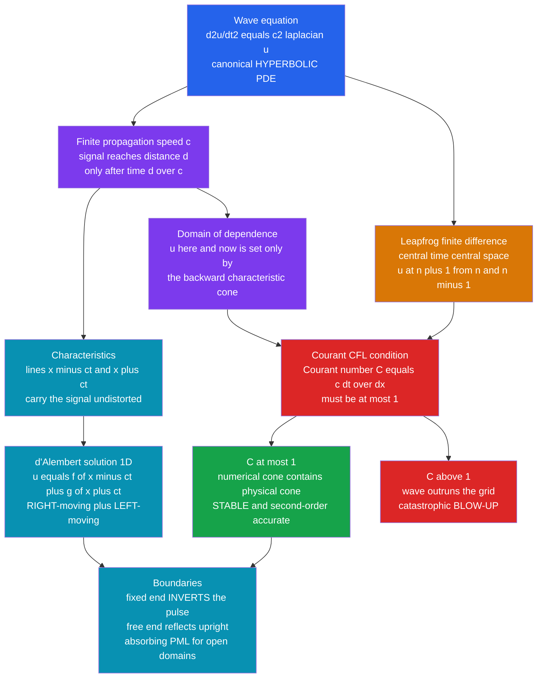

# 🌊 The Wave Equation and Hyperbolic PDEs

> [!abstract] TL;DR
> The **wave equation** $\partial^2 u/\partial t^2 = c^2 \nabla^2 u$ is the canonical **hyperbolic PDE**: it describes a disturbance that **propagates at a finite speed $c$** — sound, light, seismic waves, a vibrating string — rather than diffusing away. In 1D, **d'Alembert** proved every solution is a **right-moving plus a left-moving** shape, $f(x-ct)+g(x+ct)$, each travelling undistorted. Numerically you discretize the second time derivative into an explicit, second-order, time-reversible **leapfrog** (central-time, central-space) scheme, and you are forever bound by the **Courant–Friedrichs–Lewy (CFL) condition**: the **Courant number** $C = c\,\Delta t/\Delta x$ must stay **at most 1**, or the wave outruns the grid and the simulation blows up. Managing **numerical dispersion**, **boundary reflections** (absorbing layers / PML for open domains), and — for nonlinear conservation laws — **shocks**, is the craft behind seismic imaging, FDTD electromagnetics, and computational acoustics.

## Intuition

**Analogy:** Pluck a guitar string. A shape races along it at a fixed speed, hits the fixed ends, bounces back, and interferes with itself. Now contrast that with dropping ink in still water: **diffusion** blurs the ink into a featureless smudge, erasing structure everywhere at once. Waves are the opposite. They **preserve information** and **carry it across space at a finite speed** — a signal you send *now* arrives *there*, *later*, still recognizable. That single fact — *information travels at a finite speed* — is the signature of a **hyperbolic** equation, and it dictates everything about how you simulate one.

The catch is that finite speed becomes a hard numerical law. Your grid updates in discrete ticks $\Delta t$ over cells of width $\Delta x$. If you let the physical wave cross **more than one grid cell per tick**, the grid literally cannot "see" the information coming — it computes a future from the wrong past, and the answer detonates into infinities within a handful of steps. Respecting the wave's finite speed is not a nicety; it is the **CFL condition**, the defining constraint of every explicit hyperbolic solver.

---

## How It Works

### Core Mechanics

The 1D wave equation on a string is

$$
\frac{\partial^2 u}{\partial t^2} = c^2 \frac{\partial^2 u}{\partial x^2},
$$

where $u(x,t)$ is the displacement and $c$ is the wave speed. The name **hyperbolic** comes from classifying the second-order operator like a conic section (the companion note *Classification_of_PDEs_and_Discretization* covers the elliptic / parabolic / hyperbolic trichotomy). The physics contrasts sharply with its parabolic cousin, the heat equation $\partial u/\partial t = D\,\partial^2 u/\partial x^2$ (see *The_Heat_and_Diffusion_Equation*), and its elliptic steady-state limit, Laplace/Poisson (see *The_Poisson_and_Laplace_Equation*).

1. **Finite propagation speed and characteristics.** Unlike diffusion — where a point disturbance instantly (if faintly) affects the whole domain — a hyperbolic equation propagates information along **characteristic** curves at speed $c$. In 1D these are the straight lines $x - ct = \text{const}$ and $x + ct = \text{const}$. A signal placed at a point reaches a distance $d$ **only after time $d/c$**. This carves space-time into a **domain of dependence** (the backward "light cone" of points that can influence $u$ here-and-now) and a **domain of influence** (the forward cone of points this event can reach). Everything about numerical stability comes back to matching these cones.

2. **D'Alembert's solution.** Change variables to $\xi = x - ct$, $\eta = x + ct$ and the equation collapses to $\partial^2 u/\partial \xi \partial \eta = 0$, whose general solution is

$$
u(x,t) = f(x - ct) + g(x + ct).
$$

Any solution is a **right-moving** shape $f$ plus a **left-moving** shape $g$, each translating **undistorted** at speed $c$. Start a string from rest with a localized bump and d'Alembert gives $u = \tfrac{1}{2}[\,\phi(x-ct) + \phi(x+ct)\,]$: the pluck **splits into two half-height pulses** racing apart. That split-and-travel behavior is the thing your simulation must reproduce.

3. **Wave phenomena to capture.** Linearity gives **superposition** — waves pass through each other and add. At boundaries they **reflect**: a **fixed (Dirichlet) end inverts** the pulse (a crest returns as a trough), a **free (Neumann) end reflects it upright**. Confined between two ends, forward and backward waves lock into **standing waves / normal modes** — the eigenvalues of a boundary-value problem (Fourier modes; see *Introduction_to_PDEs*). In a medium where speed depends on frequency you get **dispersion** (wave packets spread), and where speed changes across an interface you get **refraction**.

4. **Discretization into leapfrog.** Replace both second derivatives by centered differences on a grid $u_i^n \approx u(i\,\Delta x,\, n\,\Delta t)$. The time derivative needs **three time levels**, giving the explicit **leapfrog** (central-time, central-space, or CTCS) update:

$$
u_i^{n+1} = 2u_i^n - u_i^{n-1} + C^2\,\big(u_{i+1}^n - 2u_i^n + u_{i-1}^n\big), \qquad C = \frac{c\,\Delta t}{\Delta x}.
$$

It is **second-order** accurate in space and time, and — beautifully — **time-reversible**, mirroring the wave equation's own reversibility (the finite-difference toolkit lives in *Finite_Difference_Methods*). The first step uses the initial velocity $\partial u/\partial t|_{t=0}$ to seed $u^1$ from $u^0$.

5. **The Courant–Friedrichs–Lewy (CFL) condition.** The 1D leapfrog scheme is stable **if and only if**

$$
C = \frac{c\,\Delta t}{\Delta x} \le 1.
$$

Physically: the **numerical domain of dependence** (the grid cells the update actually reads) must **contain the true physical domain of dependence** (the backward characteristic cone). The wave may cross **at most one grid cell per timestep**. Violate it — $C > 1$ — and the numerical scheme is starved of the information it needs; a von Neumann stability analysis shows short-wavelength modes grow without bound, and the field **blows up catastrophically** within a few steps. In multiple dimensions the limit tightens: $c\,\Delta t\,\sqrt{1/\Delta x^2 + 1/\Delta y^2} \le 1$.

6. **Numerical dispersion and dissipation.** Even a *stable* scheme lies a little. Because the grid samples space, different wavelengths travel at slightly **wrong** speeds — **numerical dispersion** — so a sharp pulse slowly develops trailing ripples and spreads. (Remarkably, at exactly $C=1$ the 1D leapfrog is *exact* — the "magic timestep.") Some schemes also **damp amplitude** artificially — **numerical dissipation**. Leapfrog is **non-dissipative** (it conserves a discrete energy); first-order **upwind** for advection is dissipative but robust. The trade is accuracy versus stability.

7. **Advection, conservation laws, and shocks.** The simpler hyperbolic cousin is the **advection equation** $\partial u/\partial t + c\,\partial u/\partial x = 0$ (pure transport). Its **nonlinear** relatives — **Burgers'** equation and the **Euler equations** of compressible flow — can spontaneously form **shocks**: characteristics collide and the solution develops genuine **discontinuities**. Capturing shocks without spurious oscillations demands **conservative finite-volume** methods — **Godunov**, **flux limiters**, **WENO** — the hard heart of computational fluid dynamics.

8. **Open boundaries.** Reflecting ends are easy; simulating an **open** domain (a wave radiating to infinity) is not. A naive truncation reflects energy back and corrupts the interior. You need **absorbing / non-reflecting boundary conditions** — **radiation conditions** or a **Perfectly Matched Layer (PML)**, an artificial absorbing sponge that swallows outgoing waves without reflection. This is essential for realistic EM and seismic simulation.

### Flow / Architecture



---

## Key Concepts

### Secondary
- A **wave** carries a *shape* across space at a fixed **speed $c$** without carrying the material along. Pluck a string and the bump travels, bounces off the ends, and comes back.
- This is the opposite of **diffusion**, which blurs everything into a smooth mush. Waves **keep the signal recognizable** as it moves.
- A single pluck **splits into two pulses** — one going left, one going right — each half the height of the original.
- To simulate it on a computer you chop space into a grid and time into ticks, and update each point from its neighbours. The wave must not move **more than one grid cell per tick**, or the calculation explodes.

### Undergraduate
- **D'Alembert:** every 1D solution is $f(x-ct) + g(x+ct)$ — a right-mover plus a left-mover, travelling undistorted. This is *why* a pluck splits in two.
- **Leapfrog (CTCS) scheme:** $u_i^{n+1} = 2u_i^n - u_i^{n-1} + C^2(u_{i+1}^n - 2u_i^n + u_{i-1}^n)$, explicit, **second-order**, and **time-reversible**. Needs two starting time levels; seed the first from the initial velocity.
- **CFL / Courant number:** $C = c\,\Delta t/\Delta x \le 1$ is the hard stability line. It is the numerical statement of finite propagation speed — the wave can cross at most one cell per step, so the numerical domain of dependence contains the physical one.
- **Boundary reflection:** a **fixed** (Dirichlet, $u=0$) end **inverts** the reflected pulse; a **free** (Neumann, $\partial u/\partial x = 0$) end reflects it **upright**. Trapped between two ends, waves form **standing modes** — a boundary-value eigenproblem.
- **Numerical dispersion:** away from $C=1$, short wavelengths travel at the wrong speed, so a crisp pulse grows ripples and smears — an *artifact*, not physics.

### Graduate
- **Von Neumann stability analysis.** Insert $u_i^n = \xi^n e^{\mathrm{i} k x_i}$; the leapfrog amplification factor satisfies $\xi + \xi^{-1} = 2 - 4C^2\sin^2(k\Delta x/2)$. Both roots stay on the unit circle (bounded, non-dissipative) iff $C \le 1$; for $C>1$ the highest modes give $|\xi|>1$ — exponential blow-up. This *is* the CFL condition, derived rather than asserted.
- **Numerical dispersion relation.** The discrete scheme has $\sin^2(\omega\Delta t/2) = C^2\sin^2(k\Delta x/2)$, versus the exact $\omega = ck$. The mismatch (worst for short wavelengths, vanishing at $C=1$) is the **grid dispersion** that limits FDTD/seismic accuracy and forces "points-per-wavelength" resolution rules.
- **Conservative form and shock capturing.** Nonlinear hyperbolic conservation laws $\partial_t \mathbf{q} + \partial_x \mathbf{F}(\mathbf{q}) = 0$ (Burgers, Euler) develop discontinuities in finite time. Only **conservative finite-volume** discretizations (Godunov with a Riemann solver, then high-resolution **flux-limited** or **WENO** reconstruction) converge to the correct weak solution with the right shock speed; naive centered schemes produce spurious oscillations or wrong shock positions. See *Euler_Equations_and_Ideal_Fluids* for the physics of the fluxes.
- **Absorbing boundaries and PML.** Truncating an open domain reflects outgoing energy. **Perfectly Matched Layers** introduce a complex coordinate stretch so waves decay inside the layer with *zero* reflection at any angle/frequency (to the discrete order) — indispensable in computational electromagnetics, seismology, and numerical relativity.
- **Method-of-lines and spectral alternatives.** One can instead discretize space with high order or with a **Fourier / spectral** representation (see *Spectral_Methods_and_the_FFT*) and integrate the resulting ODE system in time (cf. *[[Runge_Kutta_and_Adaptive_Methods]]*); spectral methods have near-zero numerical dispersion but demand smoothness and special care at shocks.

---

## Python Demo

```python
# 1D WAVE EQUATION vs the CFL limit -- numpy + matplotlib only.
#   (a) leapfrog (central-time central-space) solve of  d2u/dt2 = c^2 d2u/dx2:
#       a Gaussian "pluck" SPLITS into a LEFT- and a RIGHT-moving pulse, each
#       travelling at speed c, REFLECTS off the ends (fixed end INVERTS, free
#       end stays upright) and interferes  ->  snapshots + space-time images.
#   (b) the COURANT/CFL condition C = c*dt/dx: stable for C <= 1, but a
#       catastrophic blow-up for C > 1 (the wave outruns the grid).
#   (c) the wave PRESERVES the pulse shape where diffusion SMEARS it into mush.
import numpy as np
import matplotlib.pyplot as plt

L   = 1.0                              # string length
nx  = 401                              # grid points
x   = np.linspace(0.0, L, nx)
dx  = x[1] - x[0]
c   = 1.0                              # wave speed

def pluck(x0=0.5, w=0.03):
    """A smooth localized Gaussian bump, released from rest."""
    return np.exp(-((x - x0) / w) ** 2)

def solve_wave(C, bc="fixed", nsteps=1400):
    """Leapfrog FD for the 1D wave equation. C = c*dt/dx is the Courant number.
       Returns the full space-time history u[time, space] and dt."""
    dt = C * dx / c
    u_prev = pluck()                                   # u at t = 0
    lap = np.zeros_like(u_prev)
    lap[1:-1] = u_prev[2:] - 2*u_prev[1:-1] + u_prev[:-2]
    u = u_prev + 0.5 * C**2 * lap                      # first step, zero init velocity
    hist = np.empty((nsteps, nx))
    hist[0] = u_prev
    for n in range(1, nsteps):
        lap[1:-1] = u[2:] - 2*u[1:-1] + u[:-2]
        u_next = 2*u - u_prev + C**2 * lap             # leapfrog update
        if bc == "fixed":                              # Dirichlet: ends pinned to 0
            u_next[0] = u_next[-1] = 0.0
        elif bc == "free":                             # Neumann: zero-gradient ends
            u_next[0], u_next[-1] = u_next[1], u_next[-2]
        hist[n] = u_next
        u_prev, u = u, u_next
    return hist, dt

def solve_diffusion(alpha=0.4, nsteps=1400):
    """Explicit FTCS heat/diffusion for contrast (alpha = D*dt/dx^2 <= 0.5)."""
    u = pluck()
    hist = np.empty((nsteps, nx))
    for n in range(nsteps):
        hist[n] = u
        lap = np.zeros_like(u)
        lap[1:-1] = u[2:] - 2*u[1:-1] + u[:-2]
        u = u + alpha * lap
        u[0] = u[-1] = 0.0
    return hist

# ---- (a) stable propagation: split + reflection, fixed vs free ends -------
H_fix,  dt = solve_wave(C=0.9, bc="fixed", nsteps=1400)
H_free, _  = solve_wave(C=0.9, bc="free",  nsteps=1400)

# ---- (b) CFL stability sweep: track max|u| over time for several C --------
np.seterr(over="ignore", invalid="ignore")             # let C>1 overflow quietly
Cs = [0.5, 0.9, 1.0, 1.02]
maxamp = {C: np.max(np.abs(solve_wave(C, "fixed", 350)[0]), axis=1) for C in Cs}

# ---- (c) diffusion smears where the wave preserves -----------------------
H_diff = solve_diffusion(alpha=0.4, nsteps=1400)

# ================================ plots ===================================
fig = plt.figure(figsize=(15, 8.5))

# (a) snapshots: one bump splits into two travelling pulses
ax1 = fig.add_subplot(2, 3, 1)
for frac, col in [(0.00, "#111111"), (0.10, "#2563eb"), (0.28, "#16a34a")]:
    n = int(frac * (H_fix.shape[0] - 1))
    ax1.plot(x, H_fix[n], color=col, label=f"t = {n*dt:.2f}")
ax1.set_title("(a) Pluck SPLITS into left + right pulses")
ax1.set_xlabel("x"); ax1.set_ylabel("u"); ax1.legend(fontsize=8)

# (b) space-time, FIXED ends -> characteristics form an X, reflections invert
ax2 = fig.add_subplot(2, 3, 2)
ax2.imshow(H_fix, aspect="auto", origin="lower", cmap="RdBu_r",
           extent=[0, L, 0, H_fix.shape[0]*dt], vmin=-1, vmax=1)
ax2.set_title("(b) Space-time, FIXED ends (inverting bounces)")
ax2.set_xlabel("x"); ax2.set_ylabel("time")

# (c) space-time, FREE ends -> reflections stay upright
ax3 = fig.add_subplot(2, 3, 3)
ax3.imshow(H_free, aspect="auto", origin="lower", cmap="RdBu_r",
           extent=[0, L, 0, H_free.shape[0]*dt], vmin=-1, vmax=1)
ax3.set_title("(c) Space-time, FREE ends (upright bounces)")
ax3.set_xlabel("x"); ax3.set_ylabel("time")

# (d) CFL: amplitude bounded for C<=1, explodes for C>1
ax4 = fig.add_subplot(2, 3, 4)
for C in Cs:
    style = "-" if C <= 1.0 else "--"
    ax4.semilogy(np.clip(maxamp[C], 1e-3, 1e30), style, label=f"C = {C}")
ax4.axhline(1.5, color="gray", ls=":", lw=1)
ax4.set_title("(d) CFL: C<=1 stable, C>1 BLOWS UP")
ax4.set_xlabel("timestep"); ax4.set_ylabel("max |u|  (log)"); ax4.legend(fontsize=8)

# (e) reflection detail: fixed inverts, free does not (after 1 bounce)
ax5 = fig.add_subplot(2, 3, 5)
nb = int(0.34 * (H_fix.shape[0] - 1))
ax5.plot(x, H_fix[nb],  color="#dc2626", label="fixed end (inverted)")
ax5.plot(x, H_free[nb], color="#2563eb", label="free end (upright)")
ax5.axhline(0, color="gray", lw=0.6)
ax5.set_title(f"(e) After reflection  (t = {nb*dt:.2f})")
ax5.set_xlabel("x"); ax5.set_ylabel("u"); ax5.legend(fontsize=8)

# (f) wave keeps its shape; diffusion erases it
ax6 = fig.add_subplot(2, 3, 6)
nt = int(0.12 * (H_fix.shape[0] - 1))
ax6.plot(x, H_fix[0],   color="#111111", lw=1, label="initial bump")
ax6.plot(x, H_fix[nt],  color="#16a34a", label="wave: sharp pulses PRESERVED")
ax6.plot(x, H_diff[nt], color="#d97706", label="diffusion: SMEARED away")
ax6.set_title("(f) Waves preserve, diffusion blurs")
ax6.set_xlabel("x"); ax6.set_ylabel("u"); ax6.legend(fontsize=8)

plt.tight_layout(); plt.show()
```

Running it: panel **(a)** shows the single Gaussian bump splitting into two half-height pulses that march apart at speed $c$ (exactly d'Alembert's $\tfrac12[\phi(x-ct)+\phi(x+ct)]$). Panels **(b)/(c)** are space-time images: the pulses trace the **characteristic lines** $x\pm ct$, and where they hit the walls the **fixed**-end run flips color (inversion) while the **free**-end run keeps its sign — the same physics panel **(e)** shows head-on after one bounce. Panel **(d)** is the punchline: for $C = 0.5, 0.9, 1.0$ the maximum amplitude stays **bounded forever**, but at $C = 1.02$ it rockets past $10^{30}$ in a few dozen steps — the wave has outrun the grid and the CFL condition is violated. Panel **(f)** drives home the contrast with diffusion: the wave keeps its **sharp, recognizable pulses** while the heat equation, given the identical initial bump, has already **smeared it into a low broad mush**. Set $C = 1.0$ exactly and the pulses stay pixel-perfect — the "magic timestep" where leapfrog has zero numerical dispersion.

---

## Real-World Applications

> **Example:** **Seismic full-waveform inversion (FWI)** and **reverse-time migration (RTM)** — the backbone of oil-and-gas exploration and earthquake imaging — solve the elastic/acoustic **wave equation** with explicit finite differences on grids of billions of cells, marching wavefields forward (and backward) in time under a strict CFL timestep. The subsurface velocity model is iteratively updated until simulated seismograms match field recordings. **PML** absorbing boundaries are mandatory so the finite computational box mimics an infinite Earth.

- **Seismology and exploration geophysics.** Simulating earthquake ground motion and imaging the subsurface both rest on time-domain wave-equation solvers with CFL-limited leapfrog and absorbing boundaries; see *[[Seismology_and_Earthquakes]]*.
- **Computational electromagnetics — FDTD.** The **Yee finite-difference time-domain** scheme is a leapfrog for **Maxwell's equations** (electric and magnetic fields staggered in space and time), the industry standard for antennas, radar cross-sections, photonic devices, and metamaterials — CFL-bounded, PML-terminated. See *[[Maxwells_Equations]]* and *[[Electromagnetic_Waves_and_Radiation]]*.
- **Acoustics and medical ultrasound.** Room acoustics, sonar, and ultrasound imaging/therapy propagate pressure waves through tissue with the same hyperbolic solvers; underwater sound is a whole discipline (*[[Ocean_Acoustics_and_Underwater_Sound]]*).
- **Computational aeroacoustics and CFD.** Predicting jet and airframe noise, and capturing **shocks** in compressible flow, needs high-order low-dissipation schemes (WENO, flux limiters) built on the conservation-law machinery — the hard end of *[[Euler_Equations_and_Ideal_Fluids]]* and *[[Turbulence_and_Instabilities]]*.
- **Gravitational-wave source modeling.** Numerical relativity evolves Einstein's (hyperbolic, after suitable formulation) field equations to compute the waveforms LIGO/Virgo match against black-hole and neutron-star mergers — CFL, dispersion control, and constraint-preserving boundaries all matter.
- **Tsunami and ocean-wave forecasting.** Shallow-water and surface-gravity-wave models are hyperbolic transport problems (*[[Surface_Gravity_Waves]]*, *[[Tsunamis_and_Storm_Surges]]*).

---

## Common Pitfalls

- **Violating the CFL condition** — the number-one killer. Pick $\Delta t$ first and forget $c\,\Delta t/\Delta x \le 1$ and the run explodes in a handful of steps. Refining the *space* grid ($\Delta x \downarrow$) **without** shrinking $\Delta t$ silently breaks CFL. Always set $\Delta t$ *from* the Courant number and the fastest wave speed present.
- **Numerical dispersion mistaken for physics** — away from $C=1$, short wavelengths lag and a clean pulse grows trailing ripples and spreads. This is a *grid artifact*. Cure it with more points per wavelength, higher-order stencils, or spectral methods — not by trusting the wiggles.
- **Spurious boundary reflections** — truncating an open domain with a simple wall bounces energy back and pollutes the interior. Open-domain problems (EM, seismic, GW) **require** absorbing conditions or a **PML**; a "reflection-free" boundary that still reflects a few percent will ruin a sensitive inversion.
- **Wrong first step** — the three-level leapfrog needs $u^0$ *and* $u^1$. Seed $u^1$ using the **initial velocity** ($u^1 = u^0 + \Delta t\,v^0 + \tfrac12 C^2 u_{xx}$); a lazy $u^1 = u^0$ injects the wrong initial energy and a spurious counter-pulse.
- **Using a dissipative scheme where energy matters** — first-order upwind is stable but **damps** amplitude; over long propagation your wave quietly shrinks. For conservative wave propagation prefer non-dissipative leapfrog (and monitor discrete energy).
- **Applying centered schemes to shocks** — for nonlinear conservation laws (Burgers/Euler), naive centered differences produce oscillations or the *wrong* shock speed. Use **conservative finite-volume** shock-capturing (Godunov / flux-limited / WENO); non-conservative forms converge to nonsense.
- **Forgetting the multi-D CFL tightening** — in 2D/3D the limit becomes $c\,\Delta t\sqrt{\sum 1/\Delta x_d^2}\le 1$, stricter than the 1D rule; a timestep that was fine in 1D can be unstable on a 2D grid.

---

## Related Concepts

- [[Wave_Motion_and_Properties]] — the analytic physics of waves, superposition, and standing modes this note discretizes and simulates.
- [[Oscillations_and_SHM]] — each grid point of a vibrating string is a coupled oscillator; normal modes are their collective motion.
- [[Interference_and_Diffraction]] — the superposition and boundary phenomena the simulation reproduces numerically.
- [[Polarization_and_Dispersion]] — real dispersion (frequency-dependent speed) versus its numerical grid-artifact cousin.
- [[Electromagnetic_Waves_and_Radiation]] — light is a solution of the wave equation; FDTD is the direct numerical descendant.
- [[Maxwells_Equations]] — the FDTD / Yee scheme is a leapfrog applied to these coupled field equations.
- [[Euler_Equations_and_Ideal_Fluids]] — the nonlinear hyperbolic conservation laws where shocks appear and shock-capturing is needed.
- [[Waves_in_Fluids_and_Acoustics]] — pressure waves obey the same hyperbolic equation; acoustics is a core application.
- [[Turbulence_and_Instabilities]] — compressible turbulence and aeroacoustics push wave/CFD solvers to their limits.
- [[Introduction_to_PDEs]] — the elliptic/parabolic/hyperbolic classification and separation-of-variables that frame this note.
- [[Partial_Differential_Equations]] — the physicist's methods (characteristics, Green's functions) behind d'Alembert's solution.
- [[Seismology_and_Earthquakes]] — seismic imaging is wave-equation simulation with CFL timesteps and absorbing boundaries.
- [[Surface_Gravity_Waves]] — ocean waves as a hyperbolic transport problem.
- [[Tsunamis_and_Storm_Surges]] — shallow-water hyperbolic modeling for coastal forecasting.
- [[Ocean_Acoustics_and_Underwater_Sound]] — underwater sound propagation, a direct acoustic-wave application.
- [[Initial_Value_Problems_and_Euler_Methods]] — the method-of-lines view: a PDE becomes a big system of IVPs in time.
- [[Runge_Kutta_and_Adaptive_Methods]] — alternative time integrators for the semi-discrete (method-of-lines) form.
- [[The_N_Body_Problem_and_Gravitational_Simulation]] — the sibling on dynamical simulation; both hinge on leapfrog and stability.
- [[Numerical_Integration_and_Differentiation]] — the finite-difference stencils the leapfrog scheme is built from.
- [[Floating_Point_and_Numerical_Error]] — round-off is the noise floor that a CFL-violating scheme amplifies to infinity.
- [[DFT_and_FFT]] — the transform underlying spectral wave solvers and dispersion analysis.
- [[Computational_Physics_Overview]] — the map of the vault this PDE-and-field-simulation note belongs to.

---

## Review Questions

1. **(Secondary)** You pluck a guitar string in the middle and let go. Describe in words what happens to that single bump over the next moment, and how it differs from a drop of ink spreading in water. Why does the string's shape stay recognizable while the ink's does not?
2. **(Undergraduate)** State the CFL condition for the 1D leapfrog wave solver and explain it *physically* in terms of the domain of dependence. If you halve $\Delta x$ to sharpen your spatial resolution, what must you do to $\Delta t$, and what happens if you forget?
3. **(Undergraduate)** A fixed end and a free end reflect a pulse differently. Which inverts the pulse and which does not, and how would you impose each boundary condition in a finite-difference code?
4. **(Graduate)** Via a von Neumann analysis, sketch why the leapfrog scheme is stable for $C\le 1$ and unstable for $C>1$, and separately explain what "numerical dispersion" is and why it vanishes at exactly $C=1$.
5. **(Graduate)** You must simulate a seismic wave radiating outward from a source into a half-space, on a finite grid. What two distinct numerical hazards threaten physical fidelity at the grid edges and within the interior, and which techniques address each?

---

## Sources

- Courant, R., Friedrichs, K., Lewy, H., "Über die partiellen Differenzengleichungen der mathematischen Physik", *Mathematische Annalen* 100 (1928), 32–74 (the original CFL paper).
- LeVeque, R. J., *Finite Volume Methods for Hyperbolic Problems* (Cambridge University Press, 2002).
- Taflove, A. & Hagness, S. C., *Computational Electrodynamics: The Finite-Difference Time-Domain Method*, 3rd ed. (Artech House, 2005).
- Strikwerda, J. C., *Finite Difference Schemes and Partial Differential Equations*, 2nd ed. (SIAM, 2004).
- Berenger, J.-P., "A perfectly matched layer for the absorption of electromagnetic waves", *J. Comput. Phys.* 114 (1994), 185–200.

---

#computational-physics #wave-equation #hyperbolic-PDE #courant-condition #propagation
