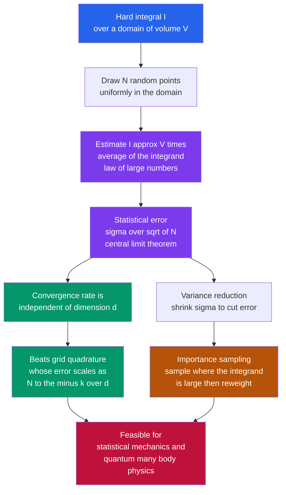

# 🎲 Monte Carlo Integration

> [!abstract] TL;DR
> Monte Carlo integration replaces exact calculation with **random sampling**: an integral becomes the *average* of the integrand over random points times the domain volume, with an error that shrinks as $1/\sqrt{N}$. That rate is slow — but crucially **independent of dimension**, so it defeats the curse of dimensionality that cripples grid methods and becomes the *only* feasible way to evaluate the high-dimensional integrals of statistical mechanics, quantum many-body physics, and particle physics.

## Intuition

**Analogy:** How would you measure the area of an oddly-shaped pond? Draw a rectangle of known area around it and throw pebbles at random across the whole rectangle. Count the fraction that splash into the water, multiply by the rectangle's area, and you have the pond's area — no calculus, no surveying, just counting splashes. That is Monte Carlo integration: replacing an exact computation with random sampling.

It sounds crude, and in low dimensions it *is* crude — a grid of measuring sticks would be far more accurate for the pond. But the method has a superpower that only appears in high dimensions. A grid collapses under the **curse of dimensionality**: to keep the same resolution, a 10-dimensional grid needs an astronomically large number of points ($n^{10}$). Random sampling doesn't care how many dimensions there are — its error shrinks at the *same* $1/\sqrt{N}$ rate whether the space is 2-D or 2000-D. That single fact makes Monte Carlo the workhorse for the high-dimensional beasts of physics: partition functions over $10^{23}$ coordinates, quantum path integrals, particle-detector simulations.

---

## How It Works

### Core Mechanics

The whole method rests on rewriting an integral as an **expectation** — an average — and then estimating that average by sampling.

1. **The sample-mean estimator.** For $I = \int_\Omega f(x)\,dx$ over a domain of volume $V$, note that
   $$I = V \cdot \frac{1}{V}\int_\Omega f(x)\,dx = V \cdot \mathbb{E}_{x\sim U(\Omega)}[f(x)].$$
   Draw $N$ points $x_1,\dots,x_N$ uniformly at random in $\Omega$ and estimate the expectation by the sample average:
   $$I \approx \hat{I}_N = V\cdot\frac{1}{N}\sum_{i=1}^{N} f(x_i).$$
   The **law of large numbers** guarantees $\hat{I}_N \to I$ as $N\to\infty$. This is the efficient, general-purpose method — it works for expectations, areas, and volumes alike.

2. **Hit-or-miss versus sample-mean.** The pebble/$\pi$ picture is the **hit-or-miss** method: bound the region, throw uniform points, and estimate the answer as (fraction of hits) $\times$ (bounding volume). It is intuitive but wasteful — it only uses a 0/1 indicator and throws away the magnitude of $f$. The **sample-mean** method averages the *actual value* $f(x_i)$ and almost always has lower variance for the same $N$. Prefer it in practice.

3. **The $1/\sqrt{N}$ convergence.** $\hat{I}_N$ is a sample mean, so by the **central limit theorem** its statistical error is the *standard error*
   $$\text{error} \approx \frac{\sigma}{\sqrt{N}}, \qquad \sigma^2 = \operatorname{Var}\!\big[V f(x)\big].$$
   This is the fundamental scaling. It is *slow*: cutting the error by 10 needs $100\times$ more samples. But it comes with a priceless property — the exponent $-1/2$ is fixed no matter the setting.

4. **Dimension independence — beating the curse.** Here is the killer feature. Deterministic **grid quadrature** (trapezoid, Simpson, Gauss — see [[Numerical_Integration_and_Differentiation]]) has error scaling like $N^{-k/d}$ in $d$ dimensions, because a total budget of $N$ points gives only $N^{1/d}$ points *per axis*. In 10-D that exponent $-k/d$ is nearly zero — the grid barely converges at all. Monte Carlo's $N^{-1/2}$ rate is **untouched by $d$**. Crossing over around $d \approx 4$–$6$, Monte Carlo becomes the *only* feasible method. This is why it is indispensable for statistical mechanics (phase-space integrals over $\sim 10^{23}$ coordinates), quantum many-body problems, and Feynman path integrals.

5. **Variance reduction — the art of efficient Monte Carlo.** Since the error is $\sigma/\sqrt{N}$, halving $\sigma$ is worth quadrupling $N$. The premier technique is **importance sampling**: instead of sampling uniformly, sample *more densely where $f$ is large* from a proposal density $p(x)$, and reweight:
   $$I = \int f(x)\,dx = \int \frac{f(x)}{p(x)}\,p(x)\,dx = \mathbb{E}_{x\sim p}\!\left[\frac{f(x)}{p(x)}\right] \approx \frac{1}{N}\sum_i \frac{f(x_i)}{p(x_i)}.$$
   If $p$ is chosen to mimic the shape of $f$, the ratio $f/p$ is nearly constant and the variance collapses (perfectly, if $p \propto f$). Companion tricks — **stratified sampling** (partition the domain and sample each stratum), **control variates** (subtract a correlated known integral), and **antithetic variates** (pair each sample with its mirror) — all attack the same $\sigma^2$.

6. **Free error bars.** A bonus of the statistical framing: Monte Carlo reports *its own uncertainty*. The sample standard error $s/\sqrt{N}$ (with $s$ the sample standard deviation of the $f(x_i)$) tells you how accurate the estimate is, at no extra cost. The randomness is a feature, not a bug.

7. **Quasi-Monte Carlo.** A refinement for moderate dimensions: replace pseudo-random points with **low-discrepancy sequences** (Sobol, Halton) that fill space more evenly than randomness. These achieve a faster $\sim (\log N)^d / N$ convergence — close to $1/N$ — though the advantage erodes as $d$ grows large.

### Flow / Architecture



---

## Key Concepts

### Secondary
- To find an area, scatter random points over a known box and count the fraction that land inside — that fraction times the box area is your answer.
- More random points give a better estimate, but the improvement is slow: 100 times as many points for 10 times the accuracy.
- The big win is in "many dimensions," where a regular grid of points is hopeless but random scattering still works.

### Undergraduate
- **An integral is an average.** $I = V\,\mathbb{E}[f]$, so the sample mean $\frac{V}{N}\sum f(x_i)$ estimates it, converging by the law of large numbers (see [[Random_Variables]]).
- **The $1/\sqrt{N}$ standard error** is the central limit theorem applied to that sample mean; the constant is the integrand's standard deviation $\sigma$ (see [[Statistical_Inference]]).
- **Sample-mean beats hit-or-miss** because it uses the value of $f$, not just a 0/1 indicator.
- **Importance sampling** reweights $f(x)/p(x)$ under a proposal $p$ concentrated where $f$ is large, cutting $\sigma$ and thus the error for the same $N$.

### Graduate
- **Dimension independence, made precise.** The estimator variance is $\operatorname{Var}[\hat I_N] = \sigma^2/N$ with $\sigma^2 = V^2\big(\mathbb{E}[f^2]-\mathbb{E}[f]^2\big)$ — no explicit $d$ appears. Grid error, by contrast, is $O(N^{-p/d})$ for a $p$-th-order rule, so Monte Carlo wins whenever $p/d < 1/2$, i.e. $d > 2p$.
- **Optimal importance density.** The variance-minimizing proposal is $p^\star(x) \propto |f(x)|$; then $\operatorname{Var}=0$ for sign-definite $f$. In practice $p$ is a tractable approximation, and a poorly matched $p$ with light tails can make the variance *infinite* — a real hazard.
- **Quasi-Monte Carlo** trades the probabilistic CLT bound for the deterministic Koksma-Hlawka inequality: error $\le$ (variation of $f$) $\times$ (discrepancy of the point set), with low-discrepancy sequences giving $O((\log N)^d/N)$.
- **From integration to sampling.** For the sharply peaked, high-dimensional Boltzmann distribution $e^{-\beta E}/Z$ of statistical physics you cannot even draw independent samples directly. **Markov-chain Monte Carlo** (the Metropolis algorithm) generates correlated samples from such distributions — the subject of the sibling note *The_Metropolis_Algorithm_and_MCMC* and the engine behind *The_Ising_Model_and_Statistical_Physics*.

---

## Python Demo

```python
# Monte Carlo integration and its scaling laws, numpy + matplotlib only.
#   (a) estimate PI by random darts; show convergence and the 1/sqrt(N) error
#   (b) MC vs GRID for the volume of a d-ball -> the curse of dimensionality
#   (c) IMPORTANCE SAMPLING slashing the variance of a peaked integrand
import numpy as np
import matplotlib.pyplot as plt
from math import gamma

rng = np.random.default_rng(0)

# ============ (a) ESTIMATE PI + 1/sqrt(N) CONVERGENCE ====================
N_pi  = 100_000
reps  = 30
Ngrid = np.arange(1, N_pi + 1)
err_accum = np.zeros(N_pi)
run = None
for _ in range(reps):
    pts    = rng.random((N_pi, 2))                    # uniform in the unit square
    inside = (pts[:, 0]**2 + pts[:, 1]**2) <= 1.0     # inside the quarter circle
    run    = 4.0 * np.cumsum(inside) / Ngrid          # running estimate of pi
    err_accum += np.abs(run - np.pi)                  # accumulate abs error
mean_err = err_accum / reps                           # error averaged over runs

fit_mask  = Ngrid >= 100
slope_pi  = np.polyfit(np.log10(Ngrid[fit_mask]),
                       np.log10(mean_err[fit_mask]), 1)[0]

# ============ (b) MC vs GRID: THE CURSE OF DIMENSIONALITY ================
def ball_volume(d):                                   # exact volume of the unit d-ball
    return np.pi**(d / 2) / gamma(d / 2 + 1)

def mc_ball_error(d, N):                              # Monte Carlo relative error
    x      = rng.uniform(-1.0, 1.0, size=(N, d))
    inside = (x**2).sum(axis=1) <= 1.0
    vol    = (2.0**d) * inside.mean()
    return abs(vol - ball_volume(d)) / ball_volume(d)

def grid_ball_error(d, N_budget):                     # regular grid, same point budget
    n     = max(int(round(N_budget**(1.0 / d))), 2)   # points per axis -> collapses in high d
    coord = -1.0 + (np.arange(n) + 0.5) * (2.0 / n)   # cell midpoints in [-1, 1]
    mesh  = np.meshgrid(*([coord] * d), indexing="ij")
    pts   = np.stack([m.ravel() for m in mesh], axis=1)
    vol   = (2.0**d) * ((pts**2).sum(axis=1) <= 1.0).mean()
    return abs(vol - ball_volume(d)) / ball_volume(d)

dims      = np.arange(1, 11)
N_budget  = 100_000
mc_errs   = np.array([mc_ball_error(d, N_budget)   for d in dims])
grid_errs = np.array([grid_ball_error(d, N_budget) for d in dims])

# ============ (c) IMPORTANCE SAMPLING VARIANCE REDUCTION =================
def g(x):
    return np.exp(-100.0 * (x - 0.3)**2)              # a sharply peaked integrand
I_true      = np.sqrt(np.pi / 100.0)                  # integral over the whole real line
box_lo, box_hi = -1.0, 2.0
L           = box_hi - box_lo
s_prop      = 0.10                                    # proposal width ~ matches the peak
def q_pdf(x):
    return np.exp(-(x - 0.3)**2 / (2 * s_prop**2)) / (s_prop * np.sqrt(2 * np.pi))

Ns_is   = np.unique(np.logspace(2, 4.5, 12).astype(int))
trials  = 200
std_uniform, std_import = [], []
for n in Ns_is:
    xu    = rng.uniform(box_lo, box_hi, (trials, n))  # plain uniform sampling
    est_u = L * g(xu).mean(axis=1)
    xi    = rng.normal(0.3, s_prop, (trials, n))      # importance sampling
    est_i = (g(xi) / q_pdf(xi)).mean(axis=1)
    std_uniform.append(est_u.std())
    std_import.append(est_i.std())
std_uniform = np.array(std_uniform)
std_import  = np.array(std_import)
var_reduction = (std_uniform[-1] / std_import[-1])**2

# ---------- report ---------------------------------------------------------
print(f"(a) pi estimate  (N={N_pi}): {run[-1]:.4f}   error-vs-N slope = {slope_pi:.2f}  (theory -0.5)")
print(f"(b) d=10 relative error   : MC = {mc_errs[-1]:.3f}   GRID = {grid_errs[-1]:.3f}")
print(f"(c) importance sampling variance reduction factor: {var_reduction:.0f}x")

# ---------- plots ----------------------------------------------------------
fig, ax = plt.subplots(2, 2, figsize=(13, 10))

# (a1) pi running estimate converging
ax[0, 0].plot(Ngrid, run, lw=0.8, color="#2563eb")
ax[0, 0].axhline(np.pi, color="k", ls="--", label="true pi")
ax[0, 0].set_xscale("log")
ax[0, 0].set_xlabel("number of samples N"); ax[0, 0].set_ylabel("pi estimate")
ax[0, 0].set_title("(a) Estimating pi by random darts"); ax[0, 0].legend()
ax[0, 0].set_ylim(2.9, 3.4); ax[0, 0].grid(True, alpha=0.3)

# (a2) error vs N, recovering 1/sqrt(N)
ax[0, 1].loglog(Ngrid[fit_mask], mean_err[fit_mask], color="#2563eb", label="MC error")
ax[0, 1].loglog(Ngrid[fit_mask], mean_err[fit_mask][0] *
                (Ngrid[fit_mask] / Ngrid[fit_mask][0])**-0.5,
                "--", color="gray", label="1/sqrt(N) reference")
ax[0, 1].set_xlabel("number of samples N"); ax[0, 1].set_ylabel("mean abs error")
ax[0, 1].set_title(f"(a) 1/sqrt(N) convergence (fit slope {slope_pi:.2f})")
ax[0, 1].legend(); ax[0, 1].grid(True, which="both", alpha=0.3)

# (b) MC vs grid across dimension
ax[1, 0].semilogy(dims, mc_errs,   "o-", color="#059669", label="Monte Carlo")
ax[1, 0].semilogy(dims, grid_errs, "s-", color="#b45309", label="grid quadrature")
ax[1, 0].set_xlabel("dimension d"); ax[1, 0].set_ylabel("relative error")
ax[1, 0].set_title("(b) Curse of dimensionality: fixed budget N")
ax[1, 0].legend(); ax[1, 0].grid(True, which="both", alpha=0.3)

# (c) importance sampling variance reduction
ax[1, 1].loglog(Ns_is, std_uniform, "o-", color="#be123c", label="uniform sampling")
ax[1, 1].loglog(Ns_is, std_import,  "^-", color="#7c3aed", label="importance sampling")
ax[1, 1].loglog(Ns_is, std_uniform[0] * (Ns_is / Ns_is[0])**-0.5,
                "--", color="gray", label="1/sqrt(N) reference")
ax[1, 1].set_xlabel("number of samples N"); ax[1, 1].set_ylabel("std of estimator")
ax[1, 1].set_title(f"(c) Importance sampling: {var_reduction:.0f}x less variance")
ax[1, 1].legend(); ax[1, 1].grid(True, which="both", alpha=0.3)

plt.tight_layout(); plt.show()
```

Running it prints a $\pi$ estimate near $3.14$ with an error-vs-$N$ slope close to the theoretical $-0.5$. Panel (b) is the punchline: the Monte Carlo curve stays low and nearly flat as the dimension grows, while the grid curve climbs steeply — with a fixed budget of $10^5$ points, a 10-D grid has only $3$ points per axis and is hopelessly coarse. (The mild rise in the MC curve is a separate effect — the ball fills a vanishing fraction of the cube, so uniform darts rarely hit; that is a *variance* problem cured by importance sampling, not the *rate* collapse that kills the grid.) Panel (c) shows both estimators falling as $1/\sqrt{N}$, but importance sampling sits far lower — the same accuracy for orders of magnitude fewer samples.

---

## Real-World Applications

> **Example:** In **statistical mechanics**, a thermal average $\langle A\rangle = \frac{1}{Z}\int A(\mathbf{x})\,e^{-\beta E(\mathbf{x})}\,d\mathbf{x}$ is an integral over a phase space of $\sim 10^{23}$ coordinates. No grid can touch it; Monte Carlo — specifically the importance-sampling-based Metropolis algorithm — is the *only* option, which is exactly where computational statistical physics was born (see [[Classical_Statistical_Mechanics]]).

- **Statistical mechanics:** partition functions and thermal averages; the peaked Boltzmann weight demands importance sampling, motivating *The_Metropolis_Algorithm_and_MCMC* and *The_Ising_Model_and_Statistical_Physics*.
- **Quantum Monte Carlo:** Feynman **path integrals** are integrals over all field configurations — infinite-dimensional (see [[Path_Integral_Formulation]]). Variational and diffusion Monte Carlo estimate many-body ground-state energies by sampling, covered in the sibling *The_Variational_and_Diffusion_Monte_Carlo*.
- **High-energy and nuclear physics:** detector and event simulators (GEANT, Pythia) trace millions of random particle histories through matter — Monte Carlo particle transport.
- **Radiative transfer and astrophysics:** photon-scattering through stellar atmospheres and interstellar dust is a high-dimensional transport integral solved by sampling photon paths.
- **Quantitative finance:** option pricing averages discounted payoffs over random price paths — the Monte Carlo method of [[Monte_Carlo_Pricing]], where variance reduction is essential for tolerable runtimes.

---

## Common Pitfalls

- **Expecting fast convergence.** $1/\sqrt{N}$ is genuinely slow — one more digit costs $100\times$ the samples. Reach for **variance reduction** (importance sampling, control variates) before brute-forcing $N$.
- **Using hit-or-miss when sample-mean is available.** The 0/1 indicator throws away information; averaging $f(x_i)$ almost always has lower variance for the same cost.
- **A badly matched importance density.** If the proposal $p$ has *lighter tails* than $f$, the ratio $f/p$ can blow up and the variance becomes infinite — the estimator looks converged, then jumps wildly. Always ensure $p$ dominates $f$ in the tails.
- **Trusting the error bar with correlated samples.** The $s/\sqrt{N}$ formula assumes *independent* draws. With Markov-chain Monte Carlo the samples are correlated and the naive error bar is too optimistic; you must account for the autocorrelation time.
- **A poor random source.** Low-quality or short-period pseudo-random generators introduce structured bias, and reusing seeds destroys independence — see the sibling *Random_Number_Generation*.
- **Reaching for Monte Carlo in low dimensions.** For $d \lesssim 4$ a good grid rule (Gauss-Legendre, Simpson) converges far faster; Monte Carlo only wins once the curse of dimensionality bites, as detailed in [[Numerical_Integration_and_Differentiation]].

---

## Related Concepts

- [[Numerical_Integration_and_Differentiation]] — the deterministic grid quadrature that Monte Carlo replaces once the curse of dimensionality strikes; its $N^{-k/d}$ error is the foil for MC's $N^{-1/2}$.
- [[Random_Variables]] — expectation and variance are exactly what the sample-mean estimator computes; the law of large numbers guarantees its convergence.
- [[Statistical_Inference]] — the sample mean, standard error, and central limit theorem that give Monte Carlo its $1/\sqrt{N}$ rate and its free error bars.
- [[Multiple_Integrals]] — the high-dimensional integrals over regions and volumes that MC evaluates when analytic and grid methods fail.
- [[Riemann_Integration]] — deterministic quadrature is a weighted Riemann sum; Monte Carlo swaps the regular partition for random samples.
- [[Classical_Statistical_Mechanics]] — partition functions and thermal averages are the archetypal high-dimensional integrals that MC (via Metropolis) makes tractable.
- [[Path_Integral_Formulation]] — quantum amplitudes are integrals over all paths, the infinite-dimensional targets of quantum Monte Carlo.
- [[Monte_Carlo_Pricing]] — the finance application: averaging payoffs over random price paths, with variance reduction to control cost.
- [[Probability_and_Statistics]] — the AI-ML foundations note covering sampling, expectation, and importance sampling as used in variational inference.
- [[Variational_Autoencoders]] — machine-learning models trained with Monte Carlo estimates of intractable expectations, using the reparameterization trick to cut variance.

---

## Review Questions

1. **(Secondary)** You estimate a pond's area by throwing 100 pebbles and 30 splash in a $10\text{ m}\times 10\text{ m}$ box around it. What is your area estimate, and roughly how many pebbles would you need to make it ten times more precise?
2. **(Undergraduate)** Starting from $I = V\,\mathbb{E}[f]$, explain why the Monte Carlo error scales as $\sigma/\sqrt{N}$ and why this rate does *not* depend on the dimension $d$, whereas an order-$p$ grid rule scales as $N^{-p/d}$. At what dimension does Monte Carlo overtake a second-order grid rule?
3. **(Graduate)** You must evaluate a 20-dimensional integral whose integrand is sharply peaked in a tiny region. Naive uniform Monte Carlo gives a huge variance. Describe how you would design an importance-sampling proposal, what property it must satisfy in the tails to avoid infinite variance, and how this idea generalizes to sampling from the Boltzmann distribution via Markov-chain Monte Carlo.

---

## Sources

- Newman, M. E. J., *Computational Physics* (2013), Ch. 10 — Monte Carlo integration, importance sampling, and Markov-chain methods.
- Press, Teukolsky, Vetterling & Flannery, *Numerical Recipes*, 3rd ed., Ch. 7 — random numbers and Monte Carlo integration.
- Metropolis, N. & Ulam, S., "The Monte Carlo Method", *Journal of the American Statistical Association* 44 (1949), 335–341.
- Landau, D. P. & Binder, K., *A Guide to Monte Carlo Simulations in Statistical Physics*, 4th ed. (2014), Cambridge University Press.
- Caflisch, R. E., "Monte Carlo and quasi-Monte Carlo methods", *Acta Numerica* 7 (1998), 1–49.

---

#computational-physics #monte-carlo #integration #curse-of-dimensionality #importance-sampling
