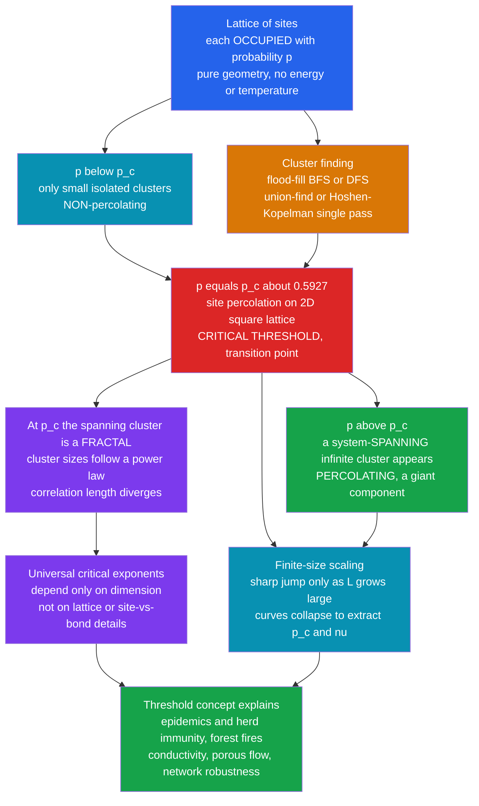

# 💧 Percolation and Random Processes

> [!abstract] TL;DR
> **Percolation** is the simplest model of a **connectivity phase transition**: randomly **occupy** each site (or bond) of a lattice with probability $p$, and ask a single yes-or-no question — *does a connected cluster **span** the system from one side to the other?* There is no energy, no temperature, no Hamiltonian — only **geometry and randomness**. Yet as $p$ climbs, at a sharp **critical threshold $p_c$** the answer flips abruptly: below $p_c$ only small isolated clusters exist (non-percolating); above $p_c$ a single **system-spanning "infinite" cluster** suddenly appears (percolating). That jump is a genuine **second-order phase transition** made of pure connectivity — for **site percolation on a 2D square lattice $p_c \approx 0.5927$**. Simulating it reduces to **finding connected clusters** (flood-fill / BFS / **union-find** / the single-pass **Hoshen–Kopelman** algorithm), and out of that simple recipe fall **universal critical exponents**, a **fractal** spanning cluster, and **finite-size scaling** — the very same critical-phenomena machinery as the Ising model. The same threshold idea is the **herd-immunity threshold** of an epidemic, the tree density at which a **forest fire** spreads, the point at which a random composite starts to **conduct**, when **oil** flows through rock, and how many nodes an **internet** or **power grid** can lose before it fragments.

## Intuition

**Analogy:** Pour water onto a slab of ground that is randomly **porous** in some spots and **solid** in others. If only a few spots are porous, the water just **pools locally** — it seeps a little way and stops, trapped in disconnected pockets. Now add porous spots one at a time, at random. For a long while nothing dramatic happens: the wet patches grow, merge here and there, but the water still cannot get through. Then, at **one magic threshold**, you add a single spot and — suddenly — a **connected channel opens all the way through the slab**, and the water **gushes out the bottom**. Nothing about that last spot was special; what changed is that the random porous spots finally linked into a path that **spans** the whole thickness.

That abrupt *"does a path span the system?"* jump **is** percolation. It is a **phase transition made of pure geometry and randomness** — no heat, no forces, just *how likely is it that random pieces connect all the way across?* The astonishing part is that this same one-parameter picture explains **forest fires**, **epidemics**, **electrical conductivity**, **coffee brewing**, and the **robustness of networks** — and it is a beautifully simple thing to simulate: throw random dots on a grid and count clusters.

---

## How It Works

### Core Mechanics

1. **The model.** Take a lattice — say an $L \times L$ square grid. Independently mark each **site** as *occupied* with probability $p$ and *empty* with probability $1-p$. Two occupied sites belong to the same **cluster** if they are adjacent (share an edge) — connectivity is defined by the nearest-neighbour graph. This is **site percolation**. The twin variant, **bond percolation**, instead keeps each *edge* open with probability $p$ and asks which sites are linked through open bonds. Both are *purely geometric*: unlike the Ising model (the sibling note *The_Ising_Model_and_Statistical_Physics*), there is **no temperature, no energy, no Boltzmann weight** — every configuration is drawn from independent coin flips.

2. **The central question — spanning.** Does any single cluster **connect one boundary to the opposite one** (top row to bottom row, or left edge to right edge)? A configuration that has such a cluster is **percolating**; one that does not is **non-percolating**. In the infinite-lattice limit this is equivalent to asking whether an **infinite cluster** exists.

3. **The percolation transition.** As the single knob $p$ increases from $0$ to $1$, the probability of spanning does not rise gently — it stays near zero, then **snaps** from "essentially never" to "essentially always" across a razor-thin window centred on a **critical threshold $p_c$**. Below $p_c$ the largest cluster is a vanishing fraction of the system; exactly *at* $p_c$ a fragile, tenuous spanning cluster first appears; above $p_c$ a robust **giant component** grabs a finite fraction of all sites. This is a **continuous (second-order) phase transition**, with $p$ playing the role temperature plays in thermal transitions. The value of $p_c$ **depends on the lattice and dimension**: site percolation on the **2D square lattice** sits at $p_c \approx 0.5927$; bond percolation on the same lattice is exactly $p_c = 1/2$; the triangular lattice, honeycomb, 3D cubic, and Bethe lattice each have their own thresholds.

4. **Cluster finding is the computational core.** To answer "does it span?" you must **identify the connected components** of the occupied sites — a classic algorithms problem shared with graph theory and image analysis (labelling connected regions of pixels). Three standard tools:
   - **Flood fill via BFS/DFS.** Start at an unvisited occupied site and sweep outward to all reachable occupied neighbours, tagging them with one label; repeat. Linear time, dead simple, and identical to the *island-counting* pattern.
   - **Union–Find (disjoint-set).** Scan the lattice once; for each occupied site, **union** it with already-seen occupied neighbours. With path compression and union by rank this labels all clusters in near-linear $O(N\,\alpha(N))$ time and answers "are these two sites connected?" incrementally — ideal when you *add* sites one at a time and watch the giant cluster form.
   - **Hoshen–Kopelman.** A beautiful **single raster-scan** algorithm (a disjoint-set specialization) that assigns a provisional label to each occupied site from its up/left neighbours and records label *equivalences* to be resolved in a second pass — the classic memory-frugal method for labelling percolation clusters on huge lattices.

5. **Critical phenomena and universality.** Near $p_c$, percolation behaves exactly like a thermal critical point. The **cluster-size distribution follows a power law** $n_s \sim s^{-\tau}$ (no characteristic cluster size — clusters of every scale coexist). The spanning cluster at $p_c$ is a **fractal**: its mass grows as $M \sim L^{d_f}$ with fractal dimension $d_f = 91/48 \approx 1.896$ in 2D, *less* than the embedding dimension $2$ — it is full of holes at every scale. The **correlation length** $\xi$ (typical cluster diameter below $p_c$) **diverges** as $\xi \sim |p - p_c|^{-\nu}$. The order parameter — the fraction $P_\infty$ of sites in the spanning cluster — rises as $P_\infty \sim (p - p_c)^{\beta}$ above threshold. Crucially, the **critical exponents $\tau, \nu, \beta, d_f$ are universal**: they depend *only on the dimension*, **not** on whether it is site or bond percolation, square or triangular lattice. This **universality** is the same phenomenon that lets the renormalization group (see *Renormalization_and_RG*) classify the Ising transition — different microscopic systems share one **universality class**.

6. **Finite-size scaling.** The transition is mathematically sharp **only for an infinite lattice**. On a finite $L \times L$ grid the spanning probability is a *smooth S-curve* that **sharpens as $L$ grows**, and its crossing point drifts toward the true $p_c$. **Finite-size scaling** turns this limitation into a measurement tool: because the only relevant length near criticality is $\xi \sim |p-p_c|^{-\nu}$, curves for different $L$ **collapse** onto one universal function when plotted against $(p - p_c)\,L^{1/\nu}$ — letting you extract both $p_c$ and $\nu$ from modest simulations. This is the identical technique used for the Ising model and for MCMC studies (see *The_Metropolis_Algorithm_and_MCMC*).

7. **The family of percolation problems.** Beyond **site vs bond**, there is **directed percolation** (bonds pass flow only in a preferred direction — the canonical model of spreading with a bias, e.g. epidemics with time's arrow, in its own universality class); **continuum percolation** (randomly placed overlapping disks or spheres connect when they overlap — no lattice at all); and **percolation on networks / random graphs** — the **Erdős–Rényi giant-component transition**, where at mean degree $\langle k \rangle = 1$ a giant connected component abruptly emerges, is percolation on a graph rather than a lattice, and underlies epidemic and robustness thresholds on real networks.

### Flow / Architecture



---

## Key Concepts

### Secondary
- **Fill in dots at random.** Colour each square of a grid with probability $p$. Small $p$ gives scattered specks; large $p$ gives a nearly solid sheet.
- A **cluster** is a group of coloured squares touching edge-to-edge. Small $p$ means many tiny clusters; large $p$ means a few big ones.
- **Percolation** asks: *is there one cluster that reaches all the way from the top to the bottom?* If yes, water (or fire, or a rumour) can travel clear across.
- There is a **magic tipping point** $p_c$. Below it, essentially never any spanning cluster; above it, essentially always one — and the switch is startlingly **sudden**, not gradual.

### Undergraduate
- **Site vs bond percolation.** Occupy *sites* with probability $p$, or open *bonds* (edges) with probability $p$; in both, a cluster is a connected set. **2D square site** $p_c \approx 0.5927$; **2D square bond** $p_c = 0.5$ exactly.
- **Spanning cluster = order parameter.** Define $P_\infty(p)$ = fraction of sites in the largest cluster (in the infinite limit, the *spanning* cluster). It is **zero below $p_c$** and rises as $P_\infty \sim (p - p_c)^{\beta}$ above — the hallmark of a **continuous phase transition**, with $p$ acting like temperature.
- **Cluster finding.** Connected components via **BFS/DFS flood fill** ($O(N)$), or **union–find** for incremental "are these connected?" queries — the same disjoint-set structure used for Kruskal's MST. **Hoshen–Kopelman** does it in a single memory-cheap pass.
- **Power laws at $p_c$.** At threshold the cluster-size distribution has **no characteristic scale**: $n_s \sim s^{-\tau}$, and the spanning cluster is a **fractal** with $d_f = 91/48$ in 2D. Clusters of every size coexist — the signature of criticality.
- **Finite-size effects.** On a finite grid the spanning probability is a smooth S-curve that steepens with $L$; the true transition is sharp only as $L \to \infty$.

### Graduate
- **Universality and exponents.** In 2D the exact critical exponents are $\beta = 5/36$, $\nu = 4/3$, $\gamma = 43/18$, $\tau = 187/91$, $d_f = 91/48$, tied together by scaling and hyperscaling relations (e.g. $d_f = d - \beta/\nu$). They depend **only on dimension**, defining the percolation universality class — a fixed point of the **renormalization group** (see *Renormalization_and_RG*), which is *why* real-space RG was first cut its teeth on percolation.
- **Finite-size scaling collapse.** Near $p_c$ the correlation length $\xi \sim |p-p_c|^{-\nu}$ is the only relevant scale, so the spanning probability obeys $\Pi_L(p) = F\!\big[(p-p_c)\,L^{1/\nu}\big]$. Plotting $\Pi_L$ vs the scaling variable **collapses all $L$** onto one curve — the standard way to extract $p_c$ and $\nu$ from finite lattices, identical in spirit to Ising Monte Carlo.
- **Upper critical dimension and mean field.** Above $d_c = 6$, percolation exponents take **mean-field** values ($\beta = 1$, $\gamma = 1$, $\tau = 5/2$), and the **Bethe lattice / random-graph** solution ($p_c = 1/(z-1)$; Erdős–Rényi giant component at $\langle k\rangle = 1$) becomes exact — the deep link between lattice percolation and the giant-component transition on graphs.
- **Directed percolation (DP).** With a preferred direction, the transition into an "absorbing" spreading state defines the **DP universality class**, the generic class for spreading/epidemic/contact-process models — a distinct set of exponents and a cornerstone of non-equilibrium critical phenomena.
- **Self-organized criticality (SOC).** Related driven-dissipative models — the **sandpile (Bak–Tang–Wiesenfeld)** and **forest-fire** models — spontaneously sit *at* a critical, power-law state **without tuning any $p$** to $p_c$, producing scale-free avalanches. Percolation is the tuned prototype; SOC is its self-tuning cousin. **Invasion percolation** (advancing along the lowest-threshold available bond) is another self-organizing variant that finds the percolation cluster dynamically.

---

## Python Demo

```python
# PERCOLATION on a 2D square lattice -- numpy + matplotlib only.
#   (a) occupy each site with probability p; FIND the clusters (connected
#       components of occupied sites) with a Hoshen-Kopelman single-pass
#       union-find labeler we implement ourselves, and COLOR them;
#   (b) show that BELOW p_c ~ 0.5927 clusters stay small, but ABOVE p_c a
#       single SPANNING cluster (top row connected to bottom row) appears --
#       we highlight it; at p_c it is a tenuous FRACTAL;
#   (c) compute the SPANNING PROBABILITY vs p for several lattice sizes L,
#       revealing the sharp PHASE TRANSITION at p_c that SHARPENS with L
#       (finite-size scaling), plus the largest-cluster fraction (order param).
import numpy as np
import matplotlib.pyplot as plt

P_C = 0.5927  # site percolation threshold, 2D square lattice

# ---------- cluster labeling: single-pass Hoshen-Kopelman / union-find -------
def label_clusters(occ):
    """Return an int label array (0 = empty; clusters numbered 1..K)."""
    ny, nx = occ.shape
    labels = np.zeros((ny, nx), dtype=np.int64)
    parent = [0]                                   # parent[0] is a sentinel

    def find(x):                                   # find root with path compression
        root = x
        while parent[root] != root:
            root = parent[root]
        while parent[x] != root:
            parent[x], x = root, parent[x]
        return root

    def union(a, b):                               # merge, keep smaller root
        ra, rb = find(a), find(b)
        if ra == rb:
            return ra
        lo, hi = (ra, rb) if ra < rb else (rb, ra)
        parent[hi] = lo
        return lo

    nxt = 1
    for i in range(ny):                            # one raster scan
        for j in range(nx):
            if not occ[i, j]:
                continue
            up   = labels[i - 1, j] if i > 0 else 0
            left = labels[i, j - 1] if j > 0 else 0
            if up == 0 and left == 0:              # new cluster
                parent.append(nxt); labels[i, j] = nxt; nxt += 1
            elif up and not left:
                labels[i, j] = find(up)
            elif left and not up:
                labels[i, j] = find(left)
            else:                                  # both occupied -> merge
                labels[i, j] = union(up, left)

    remap, out, k = {}, np.zeros_like(labels), 1   # second pass: flatten roots
    for i in range(ny):
        for j in range(nx):
            if labels[i, j]:
                r = find(labels[i, j])
                if r not in remap:
                    remap[r] = k; k += 1
                out[i, j] = remap[r]
    return out

def spanning_label(labels):
    """Label of a cluster touching BOTH top and bottom rows, else None."""
    top = set(np.unique(labels[0]))  - {0}
    bot = set(np.unique(labels[-1])) - {0}
    common = top & bot
    return min(common) if common else None

def color_image(labels, span, rng):
    """RGB image: empty=white, spanning cluster=bold red, others=random pastel."""
    K = int(labels.max())
    colors = 0.35 + 0.6 * rng.random((K + 1, 3))   # pastel palette
    colors[0] = 1.0                                # empty -> white
    if span is not None:
        colors[span] = np.array([0.85, 0.05, 0.05])  # spanning -> red
    return colors[labels]

# ---------------- (a,b) colored clusters below / at / above p_c --------------
L_img = 120
rng   = np.random.default_rng(7)
panels = [("below  p = 0.50", 0.50), (f"at  p = {P_C}", P_C), ("above  p = 0.70", 0.70)]
imgs = []
for _, p in panels:
    occ  = rng.random((L_img, L_img)) < p
    lab  = label_clusters(occ)
    span = spanning_label(lab)
    imgs.append((color_image(lab, span, rng), span))

# ---------------- (c) spanning probability & order parameter vs p ------------
ps  = np.linspace(0.45, 0.75, 16)
Ls  = [(25, 120), (50, 60), (100, 20)]             # (lattice size, trials)
span_prob = {L: np.zeros_like(ps) for L, _ in Ls}
big_frac  = {L: np.zeros_like(ps) for L, _ in Ls}
rng2 = np.random.default_rng(1)
for L, trials in Ls:
    for ip, p in enumerate(ps):
        hits, frac = 0, 0.0
        for _ in range(trials):
            occ  = rng2.random((L, L)) < p
            lab  = label_clusters(occ)
            hits += spanning_label(lab) is not None
            if lab.max() > 0:
                sizes = np.bincount(lab.ravel())[1:]
                frac += sizes.max() / (L * L)
        span_prob[L][ip] = hits / trials
        big_frac[L][ip]  = frac / trials

# ================================ plots ======================================
fig = plt.figure(figsize=(15, 8.5))

for k, (title, _) in enumerate(panels):           # (a,b) three lattices
    ax = fig.add_subplot(2, 3, k + 1)
    img, span = imgs[k]
    ax.imshow(img, origin="lower", interpolation="nearest")
    tag = "SPANNING cluster (red)" if span is not None else "no spanning cluster"
    ax.set_title(f"{title}\n{tag}", fontsize=10)
    ax.set_xticks([]); ax.set_yticks([])

ax4 = fig.add_subplot(2, 3, 4)                     # (c) spanning probability
for L, _ in Ls:
    ax4.plot(ps, span_prob[L], "-o", ms=3, label=f"L = {L}")
ax4.axvline(P_C, color="gray", ls=":", lw=1)
ax4.text(P_C + 0.005, 0.05, "p_c", color="gray")
ax4.set_title("(c) Spanning probability sharpens with L")
ax4.set_xlabel("occupation probability p"); ax4.set_ylabel("P(spanning)")
ax4.legend(fontsize=8)

ax5 = fig.add_subplot(2, 3, 5)                     # order parameter
for L, _ in Ls:
    ax5.plot(ps, big_frac[L], "-o", ms=3, label=f"L = {L}")
ax5.axvline(P_C, color="gray", ls=":", lw=1)
ax5.set_title("(d) Largest-cluster fraction (order parameter)")
ax5.set_xlabel("occupation probability p"); ax5.set_ylabel("largest cluster / N")
ax5.legend(fontsize=8)

ax6 = fig.add_subplot(2, 3, 6)                     # cluster-size distribution at p_c
occ  = rng.random((300, 300)) < P_C
sizes = np.bincount(label_clusters(occ).ravel())[1:]
bins = np.logspace(0, np.log10(sizes.max() + 1), 22)
hist, edges = np.histogram(sizes, bins=bins, density=True)
cen = np.sqrt(edges[:-1] * edges[1:])
m = hist > 0
ax6.loglog(cen[m], hist[m], "s", ms=4, color="#7c3aed")
ax6.set_title("(e) Cluster sizes at p_c: power law (scale-free)")
ax6.set_xlabel("cluster size s"); ax6.set_ylabel("n(s)")

plt.tight_layout(); plt.show()
```

Running it: panels **(a)/(b)** are the punchline as three pictures. At **$p = 0.50$** (below $p_c$) the occupied sites break into a confetti of **small, disconnected** clusters — no red, because nothing spans. At **$p \approx 0.5927$** (right at $p_c$) a **tenuous, lacy red spanning cluster** first threads its way from top to bottom: it is a **fractal**, riddled with holes at every scale. At **$p = 0.70$** (above $p_c$) the red spanning cluster is a **thick, dominant giant component** engulfing most of the lattice. Panel **(c)** is the transition itself: the probability of spanning stays near $0$, then **rockets to $1$** across a narrow window at $p_c$ — and the jump **sharpens visibly as $L$ grows from 25 to 100** (finite-size scaling: the true transition is a step only for $L \to \infty$). Panel **(d)** shows the **order parameter** — the largest-cluster fraction — switching on just above $p_c$, the connectivity analogue of magnetization. Panel **(e)** confirms criticality: exactly at $p_c$ the cluster sizes follow a **straight line on log–log axes**, a **power law** with no characteristic scale — clusters of every size coexist, the fingerprint of a critical point.

---

## Real-World Applications

> **Example:** **Epidemic thresholds and herd immunity.** Model a population as a contact network and let a pathogen cross each contact with transmission probability $p$ (an SIR outbreak maps almost exactly onto **bond percolation** on that network). Below the percolation threshold the outbreak dies out in small local clusters; above it, a **giant connected component** of infections spans the population — a full epidemic. Vaccinating a fraction of nodes **removes them from the lattice**, pushing the system back **below threshold** — which is precisely what the **herd-immunity threshold** *is*, and why targeting high-degree "hub" individuals (immunizing the best-connected nodes) fragments the network far more efficiently than random vaccination.

- **Porous media and fluid flow — the original motivation.** Percolation was invented (Broadbent & Hammersley, 1957) to describe fluid seeping through a random porous solid. Whether **oil** can be extracted from rock, or **groundwater** flows through soil, is a percolation question: the pore network must connect across the reservoir. Enhanced oil recovery and hydrology use percolation thresholds directly.
- **Electrical conductivity of composites.** Mix conducting particles (carbon black, metal flakes) into an insulating polymer. Below a critical filler fraction the material is an insulator; above it a **spanning cluster of conductor** suddenly forms and the composite **conducts** — a percolation transition exploited to design conductive plastics, sensors, and battery electrodes.
- **Forest fires and spreading.** A fire jumps between adjacent trees; it can burn **across** the forest only when tree density exceeds the percolation threshold. Below it, fires stay local; above it, a single spark can consume the whole stand — the basis of firebreak spacing and the **forest-fire model** of self-organized criticality (see *[[Cellular_Automata]]* and *[[Agent_Based_Modeling]]*).
- **Network robustness — attack and failure.** How many routers can the **internet** lose before it fragments? How many substations can a **power grid** shed before a blackout cascades? Random node removal is **inverse percolation**: the network stays connected until enough nodes are gone to drop it below threshold. Scale-free networks are **robust to random failure** but **fragile to targeted hub attacks** — a percolation result with direct infrastructure-security consequences (see *[[Resilience_and_Robustness]]* and *[[Cascades_and_Systemic_Risk]]*).
- **Gelation and polymerization.** As monomers cross-link, a liquid **sol** turns into a solid **gel** exactly when a spanning molecular network first forms — the **Flory–Stockmayer** gelation point is a percolation threshold.
- **Coffee, and everyday filtration.** Water percolating through packed coffee grounds must find a connected path of channels; over-compacted grounds fall below threshold and the water pools or channels unevenly — the word "percolation" is not a metaphor here.

---

## Common Pitfalls

- **Confusing $p_c$ across models and lattices.** $p_c$ is **not universal** — only the *critical exponents* are. Site vs bond, square vs triangular vs cubic, 2D vs 3D each have different thresholds (2D square site $\approx 0.5927$, 2D square bond $= 0.5$). Quoting one $p_c$ for the "wrong" lattice is a classic error.
- **Reading a finite lattice as if it were infinite.** On any finite grid the spanning probability is a **smooth S-curve**, not a step; the largest cluster never vanishes exactly. Estimating $p_c$ from where a *single small* lattice "looks" percolating overshoots — you **must** use finite-size scaling across several $L$ to locate the true threshold.
- **Wrong connectivity convention.** Deciding whether diagonal (8-neighbour) or only edge (4-neighbour) contacts count **changes $p_c$**. Site percolation on the square lattice conventionally uses 4-neighbour connectivity; silently switching to 8-neighbour gives a different, lower threshold and inconsistent results.
- **Inefficient cluster finding.** Naively re-running a global flood fill after every added site is $O(N^2)$ or worse. For incremental studies use **union–find** ($\approx O(N)$ amortized); for one-shot labeling of a big lattice use **Hoshen–Kopelman** (single pass, low memory). Getting the algorithm wrong makes large-$L$ studies infeasible.
- **Ambiguous spanning definition.** "Spanning" can mean top-to-bottom, left-to-right, *either*, or *both*, and with open vs periodic (wrap-around) boundaries. These give slightly different finite-size curves; mixing conventions within one study corrupts the scaling collapse.
- **Under-sampling near $p_c$.** Right at criticality, fluctuations are **largest** (clusters of every size), so estimates of spanning probability and cluster statistics have big variance. Too few Monte Carlo trials near $p_c$ (see *Random_Number_Generation* and *Monte_Carlo_Integration* for the sampling backbone) yield noisy, misleading transition curves.
- **Assuming random-graph formulas on lattices.** The clean mean-field result ($p_c = 1/(z-1)$, giant component at $\langle k\rangle = 1$) is exact only on trees / Bethe lattices / Erdős–Rényi graphs and above 6 dimensions — applying it to a 2D lattice gives the wrong threshold because loops matter.

---

## Related Concepts

- [[Criticality_and_Phase_Transitions]] — the general theory of critical points; percolation is its purest *geometric* example, with $p$ replacing temperature.
- [[Phase_Transitions_and_Critical_Phenomena]] — the physics of order parameters, correlation lengths, and exponents that percolation instantiates without any energy.
- [[Classical_Statistical_Mechanics]] — the ensemble viewpoint; percolation is a "temperature-free" statistical-mechanics model of connectivity.
- [[Renormalization_and_RG]] — real-space RG was pioneered on percolation; it explains *why* the critical exponents are universal.
- [[Fractals_and_Self_Similarity]] — the spanning cluster at $p_c$ is a fractal with dimension $91/48$; percolation is a canonical fractal-generator.
- [[Emergence_and_Self_Organization]] — a system-spanning path is an emergent global property absent from any single site; SOC models are its self-tuning relatives.
- [[Network_Science_Fundamentals]] — percolation on graphs is the giant-component transition; the network-science backbone for the applications here.
- [[Small_World_and_Scale_Free_Networks]] — network topology sets $p_c$ and the robust-yet-fragile response to random vs targeted node removal.
- [[Resilience_and_Robustness]] — network fragmentation under node/edge failure is inverse percolation; the threshold is the resilience limit.
- [[Network_Dynamics_and_Contagion]] — epidemic/rumor spreading maps onto bond percolation; the epidemic threshold *is* $p_c$.
- [[Cascades_and_Systemic_Risk]] — cascading failures on infrastructure networks are driven past percolation thresholds.
- [[Cellular_Automata]] — the forest-fire and SOC models that generalize percolation into driven, self-organizing dynamics.
- [[Agent_Based_Modeling]] — simulating spreading processes (fire, disease, information) on lattices/graphs, percolation's dynamic cousin.
- [[Union_Find]] — the disjoint-set data structure at the computational heart of incremental cluster finding.
- [[BFS]] — breadth-first flood fill, the simplest connected-component labeling for percolation clusters.
- [[DFS]] — depth-first flood fill, the recursive alternative for tagging clusters.
- [[Island_Traversal]] — the grid connected-components pattern is exactly percolation cluster labeling in disguise.
- [[Graph_Theory]] — connectivity, components, and random graphs formalize the percolation question.
- [[Probability_Theory]] — the independent-occupation model and its threshold behavior rest on basic probability.
- [[Computational_Physics_Overview]] — the map of this vault; percolation is the Monte-Carlo-and-stochastic-methods exemplar.
- [[Chaos_and_Nonlinear_Dynamics_Numerically]] — a sibling on emergent complexity from simple rules; percolation is its equilibrium-geometry counterpart.
- [[The_N_Body_Problem_and_Gravitational_Simulation]] — a companion simulation note; contrast deterministic dynamics with pure stochastic geometry.
- [[Numerical_Integration_and_Differentiation]] — the numerical toolkit; Monte Carlo estimates like spanning probability are its stochastic extension.

---

## Review Questions

1. **(Secondary)** You keep randomly colouring squares of a grid, one at a time, and after each one you check whether a coloured path connects the top edge to the bottom edge. Describe what you would see: does the connecting path appear *gradually* or *suddenly*, and roughly when? Why does this look like water finally gushing through porous ground?
2. **(Undergraduate)** Explain the difference between **site** and **bond** percolation, and state the 2D square-lattice threshold for each. Given an occupied/empty lattice, describe how you would use **union–find** (or a BFS flood fill) to decide whether a spanning cluster exists, and give its time complexity.
3. **(Undergraduate)** Why is the percolation transition perfectly sharp only on an *infinite* lattice? Sketch what the spanning-probability-vs-$p$ curve looks like for a small versus a large finite lattice, and explain how **finite-size scaling** lets you extract $p_c$ from finite simulations.
4. **(Graduate)** Percolation and the Ising model have *different* $p_c$/$T_c$ but can share **universal critical exponents**. Explain what "universality class" means, why exponents depend on dimension but not on lattice details, and how the **renormalization group** accounts for this. What is special about the spanning cluster's structure exactly at $p_c$?
5. **(Graduate)** An epidemiologist models disease spread as bond percolation on a contact network with transmission probability $p$, and finds the outbreak is just above threshold. Compare the effect of vaccinating (a) a random fraction of the population versus (b) the highest-degree "hub" individuals, in terms of pushing the system below $p_c$. Why does network topology (e.g. scale-free vs random) change the answer dramatically?

---

## Sources

- Stauffer, D. & Aharony, A., *Introduction to Percolation Theory*, 2nd ed. (Taylor & Francis, 1994) — the standard textbook.
- Broadbent, S. R. & Hammersley, J. M., "Percolation processes I. Crystals and mazes", *Mathematical Proceedings of the Cambridge Philosophical Society* 53 (1957), 629–641 — the founding paper.
- Hoshen, J. & Kopelman, R., "Percolation and cluster distribution. I. Cluster multiple labeling technique and critical concentration algorithm", *Physical Review B* 14 (1976), 3438–3445.
- Newman, M. E. J. & Ziff, R. M., "Efficient Monte Carlo algorithm and high-precision results for percolation", *Physical Review Letters* 85 (2000), 4104–4107.
- Callaway, D. S., Newman, M. E. J., Strogatz, S. H. & Watts, D. J., "Network robustness and fragility: Percolation on random graphs", *Physical Review Letters* 85 (2000), 5468–5471.
- Sahimi, M., *Applications of Percolation Theory*, 2nd ed. (Springer, 2023) — porous media, composites, and networks.

---

#computational-physics #percolation #phase-transition #critical-threshold #connectivity
