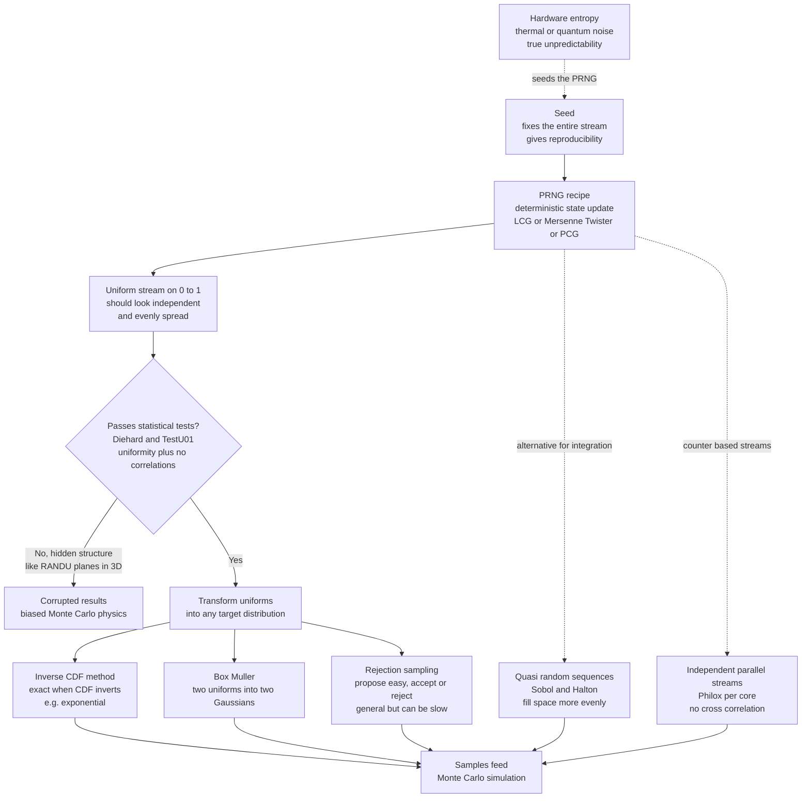

# 🎲 Random Number Generation

> [!abstract] TL;DR
> Random numbers are the **fuel of every Monte Carlo simulation**, yet a computer is a perfectly **deterministic** machine — it cannot actually be random. The resolution is the **pseudorandom number generator (PRNG)**: a fixed arithmetic recipe (`x_{n+1} = f(x_n)`) that churns out a stream of numbers so scrambled and uniform that they **pass every statistical test for randomness**, even though the whole sequence is fixed once you choose the **seed**. Classic recipes are the **linear congruential generator (LCG)** — `x = (a·x + c) mod m`, fast but short-period and correlated — the **Mersenne Twister** (period `≈ 2^19937`, the long-time default), and modern **PCG / xoshiro / Philox** (better statistics, used in NumPy's new `Generator`). **Quality genuinely matters**: the infamous **RANDU** generator's triples fall on just 15 planes in 3D, and it silently **corrupted published physics results**. All Monte Carlo needs samples from *arbitrary* distributions, and every one is built from uniform randoms via a **transform** — the **inverse-CDF** method (exact when the CDF inverts, e.g. the exponential), **Box-Muller** (uniforms into Gaussians), and **rejection sampling** (propose easy, accept/reject to match a hard target). Beyond raw randomness lie two twists: **quasi-random low-discrepancy sequences** (Sobol, Halton) fill space *more* evenly than random points and converge integration at `O(1/N)` instead of `O(1/sqrt(N))`; and **counter-based generators** give the **independent parallel streams** that make large HPC runs trustworthy. Reproducible **seeding** ties it all together — the same seed reruns a stochastic experiment *exactly*, which is what makes simulation science and not guesswork.

---

## Intuition

**Analogy — the casino that never gambles.** Imagine a croupier who has memorised an enormous, fixed book of dice rolls. Every time you ask for "a random number," they simply read the next entry and turn the page. Nothing is left to chance — if you knew the page they started on, you could predict every roll for the rest of the night. And yet, if the book was written well, no gambler at the table could *ever* tell the difference: the rolls are evenly spread across one through six, no number follows another too often, streaks are the right length, and every statistical audit comes back clean. The croupier is faking randomness *brilliantly* by following a recipe.

That is exactly what a computer does. It is a deterministic machine — it literally cannot flip a real coin — yet Monte Carlo simulation demands the coin-flip chaos of a diffusing molecule, a scattering neutron, or a quantum measurement. So the computer runs a **pseudorandom number generator**: a fixed formula that, starting from a **seed** (the page you open to), spits out a stream of numbers so scrambled and uniform that they pass every test for randomness while being utterly predictable to anyone who knows the seed. The predictability is not a bug — it is the *feature* that lets you rerun a simulation exactly for debugging and peer review. But the analogy carries the warning too: if the book is written badly, with hidden patterns, the gambler *will* eventually notice — and in physics, a badly written generator has silently poisoned real published results. Choosing and transforming your randomness correctly is a genuine part of doing trustworthy computational physics.

---

## How It Works

### Core Mechanics

1. **The paradox and its resolution.** Monte Carlo methods estimate answers by *sampling* — averaging over many random trials. But a CPU executes deterministic instructions; there is no true randomness inside it. The resolution is to abandon *true* randomness and settle for **statistical** randomness: a **pseudorandom number generator (PRNG)** is a deterministic map `x_{n+1} = f(x_n)` on a hidden internal **state**, engineered so that the *output sequence* is indistinguishable from random by any reasonable statistical test. It is deterministic in mechanism, random in behaviour — and for simulation that is all you need.

2. **The linear congruential generator (LCG) — the simplest recipe.** The oldest and simplest PRNG is `x_{n+1} = (a·x_n + c) mod m`, returning `u_n = x_n / m` as a uniform number in `[0, 1)`. It needs only a multiply, an add, and a modulo — blazingly fast. But it has two intrinsic weaknesses: its **period** (how long before the sequence repeats) is at most `m`, and its outputs carry **serial correlations**. Choose `a`, `c`, `m` badly and the generator is worthless (see RANDU below). LCGs are fine for toy code and teaching, and are still buried inside some standard libraries, but they are **not** adequate for serious Monte Carlo.

3. **The Mersenne Twister — the long-time default.** For roughly two decades the workhorse generator was the **Mersenne Twister (MT19937)**, with an astronomical period of `2^19937 − 1` and excellent equidistribution in up to 623 dimensions. It has a large internal state (624 words) that it stirs with bit shifts, masks, and XORs. It passes almost all statistical tests and became the default in Python, MATLAB, R, and old NumPy. Its known weaknesses — slow recovery from a poor (mostly-zero) seed, a large cache-unfriendly state, and failure of *some* stringent tests — motivated newer designs.

4. **Modern generators — PCG, xoshiro, Philox.** Contemporary PRNGs are smaller, faster, and statistically stronger. **PCG** (permuted congruential generator) takes a well-understood LCG core and applies an output *permutation* that hides the LCG's structure, giving excellent statistics with tiny state. **xoshiro / xoroshiro** are fast XOR-shift-rotate generators. **Philox** and **Threefry** are **counter-based** (their output is a keyed function of a counter, not a chained state) which makes them ideal for parallelism. NumPy's modern API (`np.random.default_rng`) uses **PCG64** by default and offers Philox precisely for these reasons — the days of blindly trusting a single global generator are over.

5. **Seed, state, period, reproducibility.** A PRNG's behaviour is fixed by its **seed**, which sets the initial state. Because the map is deterministic, *the same seed reproduces the same stream exactly* — the bedrock of scientific reproducibility, letting you rerun a simulation to debug it or letting a reviewer verify your result bit-for-bit. The **period** is how many draws before the stream repeats; a Monte Carlo run must consume far fewer numbers than the period (Mersenne Twister's `2^19937` makes this a non-issue, an LCG's `2^31` can be exhausted in seconds). There is a real tension here: reproducibility *wants* determinism, while cryptography and gambling want genuine *unpredictability* — different jobs, different tools.

6. **Quality and testing — what "good randomness" means.** A good generator must be **uniform** (every value equally likely), **independent** (no value predicts the next), have a **long period**, and show **no correlations** in any dimension. These properties are checked by empirical **test suites**: the historic **Diehard** battery and the modern gold standard **TestU01** (with its "SmallCrush", "Crush", and "BigCrush" batteries of dozens of statistical tests). A generator that fails BigCrush can still look fine in a casual histogram, which is exactly why the danger is *hidden*.

7. **The RANDU catastrophe — why this matters.** IBM's **RANDU** (`a = 65539`, `c = 0`, `m = 2^31`), shipped in the 1960s–70s, is the textbook cautionary tale. Its consecutive triples satisfy the exact relation `x_{n+2} = 6·x_{n+1} − 9·x_n (mod 2^31)`, forcing every triple `(u_n, u_{n+1}, u_{n+2})` to lie on just **15 parallel planes** in the unit cube. A one-dimensional histogram of RANDU looks perfectly uniform — the flaw is invisible until you look in 3D. Simulations that sampled 3D configurations with RANDU produced **wrong physics**, and results from that era are viewed with suspicion. The lesson: generator choice is a scientific decision, not a detail.

8. **Sampling non-uniform distributions — everything from uniforms.** A PRNG only gives uniform `[0, 1)` numbers, but Monte Carlo needs samples from *arbitrary* distributions (exponential lifetimes, Gaussian velocities, Boltzmann weights). Every such sample is manufactured from uniforms by a **transform**:
   - **Inverse-CDF (inverse transform):** if `F` is the target cumulative distribution and `U` is uniform, then `X = F^{-1}(U)` has exactly the target distribution. Exact and elegant *when the CDF inverts in closed form* — the exponential is the poster child: `X = −ln(1 − U) / λ`.
   - **Box-Muller:** the Gaussian CDF has no elementary inverse, so a clever trick converts *two* uniforms into *two* independent standard normals: `Z0 = sqrt(−2 ln U1)·cos(2π U2)`, `Z1 = sqrt(−2 ln U1)·sin(2π U2)`. It samples the 2D Gaussian in polar coordinates, where both radius and angle *are* easy to invert.
   - **Rejection sampling:** for a hard target `p(x)` with no invertible CDF, propose from an easy envelope `M·g(x) ≥ p(x)`, then **accept** a proposal `x` with probability `p(x) / (M·g(x))`. Completely general, but its **efficiency** is `1/M` — a loose envelope wastes most proposals, foreshadowing the need for **importance sampling** to concentrate effort where the integrand matters.

9. **Quasi-random sequences — when randomness is *not* optimal.** Here is the twist: for *integration*, deliberately non-random points can beat random ones. **Quasi-Monte Carlo** uses **low-discrepancy sequences** (**Sobol**, **Halton**) that are engineered to fill space *more evenly* than random points, which always clump and leave gaps. Even filling means integration error falls like `O(1/N)` instead of the `O(1/sqrt(N))` of plain Monte Carlo — a huge speed-up in low-to-moderate dimensions. The catch: quasi-random points are correlated by design, so they are for integration, not for simulating genuinely independent physical events.

10. **True randomness and parallel streams — the practical frontiers.** When you need *unpredictability* rather than reproducibility — cryptographic keys, or a fresh seed for each run — you draw from a **hardware RNG** that harvests physical entropy (thermal noise, jitter, quantum shot noise) via the OS entropy pool (`/dev/urandom`, `os.urandom`). And on a supercomputer running Monte Carlo across thousands of cores, each processor needs its **own independent random stream** — naively seeding each core with its rank produces *correlated* streams and biased results. The fixes are **counter-based generators** (Philox, where core `k` simply uses key `k`) and **stream-splitting** APIs (NumPy's `SeedSequence.spawn`), which hand out provably independent substreams. This is an everyday requirement for trustworthy large-scale simulation.

### Flow / Architecture



---

## Key Concepts

### Secondary Level

- **Pseudorandom:** *fake* randomness produced by a fixed recipe. The numbers look random and pass tests, but the whole sequence is decided the moment you pick the starting **seed**.
- **Seed:** the starting value that fixes the entire stream. Same seed, same numbers — which is how a scientist reruns an experiment exactly.
- **Uniform random number:** a number equally likely to be anywhere between 0 and 1. This is the raw material; every other kind of randomness is built from it.
- **Why it can go wrong:** a bad recipe leaves hidden patterns. A histogram can look perfectly flat while secret correlations quietly bias the result — the famous **RANDU** generator looked fine but ruined real simulations.

### Undergraduate Level

- **Linear congruential generator (LCG):** `x_{n+1} = (a·x_n + c) mod m`. Fast and simple; limited **period** (`≤ m`) and serial correlations. Fine for demos, unsafe for research.
- **Period and state:** the number of draws before the sequence repeats. Mersenne Twister has period `2^19937 − 1`; an LCG on `2^31` can be exhausted quickly. Never consume a sizeable fraction of the period.
- **Inverse-CDF sampling:** `X = F^{-1}(U)` turns a uniform `U` into any distribution whose CDF `F` inverts — exact for the exponential, `X = −ln(1 − U)/λ`.
- **Box-Muller:** converts two uniforms into two independent standard Gaussians using `sqrt(−2 ln U1)` for the radius and `2π U2` for the angle.
- **Rejection sampling:** propose from an easy envelope, accept with probability equal to the target-to-envelope ratio. General-purpose but its **acceptance efficiency** is `1/M`; a loose envelope is wasteful.
- **Reproducibility vs unpredictability:** simulation wants a fixed seed (rerunnable science); cryptography wants genuine unpredictability (hardware entropy). Same tool family, opposite goals.

### Graduate Level

- **Equidistribution and spectral test:** an LCG's `k`-tuples lie on a lattice of parallel hyperplanes; the **spectral test** measures the spacing between them. RANDU fails catastrophically (15 planes in 3D); good multipliers maximise the minimum inter-plane distance. Mersenne Twister is 623-dimensionally equidistributed to 32-bit accuracy.
- **TestU01 batteries:** SmallCrush, Crush, and BigCrush apply dozens of empirical tests (birthday spacings, rank of random binary matrices, gaps, collisions). Passing BigCrush is the modern bar; MT19937 fails a couple of linear-complexity tests that PCG and Philox pass.
- **Counter-based RNGs (Philox, Threefry):** output is a keyed bijection of a counter rather than an iterated state, giving `O(1)` random access, trivially parallel independent streams, and cryptographic-flavour statistics — now standard for GPU and HPC Monte Carlo.
- **Discrepancy and Koksma-Hlawka:** the integration error of a point set is bounded by the product of the integrand's variation and the set's **star discrepancy**. Low-discrepancy (Sobol, Halton) sequences achieve discrepancy `O((log N)^d / N)`, giving near-`O(1/N)` convergence versus `O(1/sqrt(N))`, though the advantage erodes in high dimension.
- **Ziggurat algorithm:** the fastest practical Gaussian/exponential sampler, a highly optimised rejection method using precomputed layered rectangles — what production libraries actually use instead of Box-Muller for speed.
- **Adaptive and squeeze rejection:** adaptive-rejection sampling builds a tight piecewise envelope for log-concave densities; squeeze functions avoid evaluating the expensive target on most accepted points, raising efficiency toward 1.

---

## Python Demo

```python
# Random number generation, end to end, in one runnable script:
#   (a) implement a LINEAR CONGRUENTIAL GENERATOR (LCG) from scratch, show a
#       GOOD LCG's flat uniform histogram, then expose the infamous RANDU's
#       HIDDEN STRUCTURE: its consecutive triples fall on ~15 planes in 3D;
#   (b) TRANSFORM uniform randoms into other distributions and histogram them
#       against the true PDFs: INVERSE-CDF for an exponential, BOX-MULLER for
#       a Gaussian;
#   (c) REJECTION SAMPLING for an arbitrary bimodal target, reporting the
#       acceptance efficiency.
# Requires: numpy, matplotlib.

import numpy as np
import matplotlib.pyplot as plt
from mpl_toolkits.mplot3d import Axes3D  # noqa: F401  (enables 3d projection)

# ------------------------------------------------------------------
# A minimal Linear Congruential Generator:  x_{n+1} = (a*x_n + c) mod m
# ------------------------------------------------------------------
class LCG:
    def __init__(self, a, c, m, seed=1):
        self.a, self.c, self.m, self.state = a, c, m, seed
    def next_int(self):
        self.state = (self.a * self.state + self.c) % self.m
        return self.state
    def uniform(self, n):
        out = np.empty(n)
        for i in range(n):
            out[i] = self.next_int() / self.m
        return out

# A decent LCG (Numerical Recipes "ranqd1" constants) and the notorious RANDU.
good  = LCG(a=1664525, c=1013904223, m=2**32, seed=42)   # good enough for 1D
randu = LCG(a=65539,   c=0,          m=2**31, seed=1)     # IBM RANDU: BAD

u_good  = good.uniform(50000)
u_randu = randu.uniform(60000)

# ---- (a2) Expose RANDU's hidden lattice: consecutive triples in 3D --------
xr, yr, zr = u_randu[:-2], u_randu[1:-1], u_randu[2:]     # (u_n, u_n+1, u_n+2)

# ---- (b1) Inverse-CDF sampling of an EXPONENTIAL from uniforms ------------
#   CDF F(x) = 1 - exp(-lam x)  ->  inverse  X = -ln(1 - U) / lam
lam = 1.5
u_exp = LCG(1664525, 1013904223, 2**32, seed=7).uniform(40000)
u_exp = np.clip(u_exp, 0.0, 1.0 - 1e-12)                  # avoid log(0)
x_exp = -np.log(1.0 - u_exp) / lam

# ---- (b2) Box-Muller: two uniforms -> two standard Gaussians --------------
u_bm = LCG(1664525, 1013904223, 2**32, seed=99).uniform(40000)
U1 = np.clip(u_bm[0::2], 1e-12, 1.0)                      # avoid log(0)
U2 = u_bm[1::2]
z0 = np.sqrt(-2.0 * np.log(U1)) * np.cos(2.0 * np.pi * U2)
z1 = np.sqrt(-2.0 * np.log(U1)) * np.sin(2.0 * np.pi * U2)
z_gauss = np.concatenate([z0, z1])

# ---- (c) Rejection sampling for an arbitrary bimodal target --------------
def target(x):
    # unnormalised bimodal density on [-6, 6]
    return np.exp(-0.5 * (x + 1.5) ** 2) + 0.7 * np.exp(-0.5 * ((x - 2.0) / 0.6) ** 2)

lo, hi = -6.0, 6.0
grid = np.linspace(lo, hi, 2000)
M = target(grid).max() * 1.05                            # envelope height
rng = np.random.default_rng(0)                           # modern PCG64 for proposals
n_want = 30000
xs_prop = rng.uniform(lo, hi, size=5 * n_want)           # propose in bulk
ys_prop = rng.uniform(0.0, M, size=5 * n_want)
accept = ys_prop <= target(xs_prop)
x_rej = xs_prop[accept][:n_want]
efficiency = accept.mean()
print(f"Rejection-sampling acceptance efficiency: {efficiency:.1%}")

# normalise the target for overlay
area = np.trapz(target(grid), grid)
pdf_rej = target(grid) / area

# ------------------------------ Plots -------------------------------------
fig = plt.figure(figsize=(16, 9))

# (a1) Good LCG uniform histogram
ax1 = fig.add_subplot(2, 3, 1)
ax1.hist(u_good, bins=50, density=True, color='steelblue', edgecolor='white')
ax1.axhline(1.0, color='k', ls='--', label='ideal uniform')
ax1.set_title('(a) Good LCG: flat uniform histogram')
ax1.set_xlabel('u'); ax1.set_ylabel('density'); ax1.legend()

# (a2) RANDU 3D lattice, viewed edge-on along the plane normal (9,-6,1)
ax2 = fig.add_subplot(2, 3, 2, projection='3d')
ax2.scatter(xr[:20000], yr[:20000], zr[:20000], s=1, color='crimson', alpha=0.3)
ax2.view_init(elev=6, azim=-34)   # look along (9,-6,1): planes collapse to lines
ax2.set_title('(b) RANDU triples: ~15 hidden planes')
ax2.set_xlabel('u_n'); ax2.set_ylabel('u_n+1'); ax2.set_zlabel('u_n+2')

# (b1) Exponential via inverse-CDF vs true PDF
ax3 = fig.add_subplot(2, 3, 4)
ax3.hist(x_exp, bins=60, density=True, color='seagreen', edgecolor='white')
xx = np.linspace(0, x_exp.max(), 400)
ax3.plot(xx, lam * np.exp(-lam * xx), 'k-', lw=2, label='true exponential PDF')
ax3.set_title('(c) Inverse-CDF: exponential')
ax3.set_xlabel('x'); ax3.set_ylabel('density'); ax3.legend()

# (b2) Gaussian via Box-Muller vs true PDF
ax4 = fig.add_subplot(2, 3, 5)
ax4.hist(z_gauss, bins=60, density=True, color='darkorange', edgecolor='white')
zz = np.linspace(-4, 4, 400)
ax4.plot(zz, np.exp(-0.5 * zz ** 2) / np.sqrt(2 * np.pi), 'k-', lw=2,
         label='true normal PDF')
ax4.set_title('(d) Box-Muller: Gaussian')
ax4.set_xlabel('z'); ax4.set_ylabel('density'); ax4.legend()

# (c) Rejection sampling vs normalised target
ax5 = fig.add_subplot(2, 3, 6)
ax5.hist(x_rej, bins=60, density=True, color='mediumpurple', edgecolor='white')
ax5.plot(grid, pdf_rej, 'k-', lw=2, label='target PDF')
ax5.set_title(f'(e) Rejection sampling (accept {efficiency:.0%})')
ax5.set_xlabel('x'); ax5.set_ylabel('density'); ax5.legend()

# spare panel: message
ax6 = fig.add_subplot(2, 3, 3); ax6.axis('off')
ax6.text(0.0, 0.5,
         "All five panels are built\nfrom UNIFORM randoms.\n\n"
         "RANDU passes a 1D histogram\nyet fails in 3D: quality is\n"
         "invisible until you look\nin the right dimension.",
         fontsize=12, va='center')

plt.tight_layout()
plt.show()
```

Running this prints a rejection-sampling acceptance rate of roughly `35%` (most proposals under a loose box are wasted — the practical argument for smarter samplers). Panel (a) is the good LCG's featureless flat histogram; panel (b) is the punchline — RANDU's 60000 numbers look uniform in 1D, but plotting consecutive **triples** and rotating the view to look *along* the lattice normal `(9, −6, 1)` collapses the whole point cloud onto a handful of parallel **lines**: those are RANDU's 15 planes, seen edge-on, the visual proof of a corrupted generator. Panels (c), (d), and (e) show the three transforms doing their job — an exponential from `−ln(1 − U)/λ`, a Gaussian from Box-Muller's polar trick, and an arbitrary bimodal density from rejection sampling — each histogram sitting cleanly under its true PDF. Every one of those distributions was manufactured from nothing but uniform `[0, 1)` numbers, which is the entire craft of sampling in one figure.

---

## Real-World Applications

- **Particle transport and nuclear engineering.** Codes like **MCNP** and **Geant4** trace billions of neutrons and photons through matter, drawing free-flight distances by **inverse-CDF** of the exponential and scattering angles by rejection. Reactor design, radiation shielding, and medical-physics dose calculations rest entirely on the quality of the underlying PRNG.
- **Statistical physics simulation.** Every **Metropolis Monte Carlo** and molecular-dynamics-with-thermostat run consumes torrents of random numbers to accept/reject moves and draw thermal velocities — the direct sequel notes The_Metropolis_Algorithm_and_MCMC and The_Ising_Model_and_Statistical_Physics build straight on this foundation.
- **Computational finance.** Derivative pricing by simulating asset paths (see the cross-vault [[Monte_Carlo_Pricing]]) uses **Box-Muller / ziggurat** Gaussians for Brownian increments and increasingly **Sobol** quasi-random sequences to price high-dimensional options with far fewer paths.
- **Machine learning and generative models.** Weight initialisation, dropout, stochastic gradient descent, VAEs, and diffusion models all sample from Gaussians and categoricals; reproducible **seeding** of the framework RNG is what makes ML experiments repeatable, and the reparameterisation trick is inverse-transform sampling in disguise.
- **Cryptography and security.** Here the requirement flips to genuine **unpredictability**: keys and nonces come from **hardware entropy** and cryptographically secure generators, never from a Mersenne Twister — a distinction developed in the cross-vault [[Cryptography/04_Protocols_and_Applications/Random_Number_Generation|Random Number Generation (Cryptography)]] note and in [[Stream_Ciphers_and_PRGs]].
- **Graphics and global illumination.** Path-traced rendering (offline film, and modern real-time ray tracing) integrates light transport by Monte Carlo, leaning heavily on **low-discrepancy** sampling and **counter-based** per-pixel streams to keep noise low and independent.

---

## Common Pitfalls

- **Trusting the default global generator.** The old `random.seed()` / legacy `np.random` global state is a single Mersenne Twister shared across your whole program and libraries. Prefer an explicit `np.random.default_rng(seed)` object you pass around — global state silently breaks reproducibility and parallel independence.
- **Judging a generator by a 1D histogram.** RANDU's lesson: uniformity in one dimension says nothing about correlations in higher dimensions. Quality can only be established by real test suites (TestU01), not by eyeballing a histogram.
- **Correlated parallel streams.** Seeding each of `N` processors with its rank (`seed = rank`) produces streams that are shifted copies or otherwise correlated, biasing the aggregate result. Use `SeedSequence.spawn` or a counter-based generator (Philox) to get provably independent substreams.
- **Exhausting a short period.** An LCG on `m = 2^31` repeats after ~2 billion draws — trivially reachable in a large run, after which your "random" numbers are an exact rerun. Always check period versus total draws, or just use a long-period generator.
- **`log(0)` and boundary blow-ups in transforms.** Inverse-CDF of the exponential and Box-Muller both take `log(U)`; if `U` can be exactly `0` (or `1 − U = 0`) you get `-inf` or NaN. Clip uniforms into the open interval, and beware that round-off (see [[Floating_Point_and_Numerical_Error]]) makes the endpoints reachable.
- **Reusing rejected proposals or a biased envelope.** In rejection sampling the envelope `M·g(x)` must dominate the target *everywhere*; if it dips below `p(x)` anywhere, that region is under-sampled and your distribution is silently wrong. And never recycle a rejected `x` — it biases the sample.
- **Confusing reproducibility with unpredictability.** A seeded PRNG is perfect for science and catastrophic for security. Using a Mersenne Twister to generate a password or key is a textbook vulnerability, because its full state can be reconstructed from a modest run of outputs.
- **Assuming quasi-random beats random everywhere.** Sobol/Halton win for smooth integrands in low-to-moderate dimensions, but their built-in correlations make them wrong for simulating independent physical events, and their advantage decays in very high dimensions.

---

## Related Concepts

- [[Numerical_Integration_and_Differentiation]] — deterministic quadrature is the alternative to random sampling for integrals; the coming Monte_Carlo_Integration note pits `O(1/sqrt(N))` random sampling against grid quadrature and quasi-random `O(1/N)`.
- [[Floating_Point_and_Numerical_Error]] — PRNGs live on finite-precision integers and floats; round-off makes transform endpoints reachable and sets the granularity of every uniform draw.
- [[Random_Variables]] — the formal object being sampled: a random variable is defined by its distribution, and sampling is the act of drawing realisations of one.
- [[Common_Probability_Distributions]] — the exponential, Gaussian, and others are the *targets* the transforms in this note produce from uniforms.
- [[Mathematics/06_Probability_and_Statistics/Probability_Theory|Probability Theory]] — the CDF, the law of large numbers, and independence that justify why sampled averages converge to expectations.
- [[Bayesian_Statistics]] — posterior distributions are usually sampled, not integrated; rejection and (next note) MCMC are how Bayesian inference is actually computed.
- [[Statistical_Inference]] — the statistical tests (uniformity, independence) used to certify a generator are the same hypothesis-testing machinery applied to the RNG itself.
- [[Entropy_and_Information_Content]] — a "good" random stream is maximally unpredictable, i.e. maximum entropy per output; hardware seeding is literally harvesting physical entropy.
- [[Kolmogorov_Complexity_and_Algorithmic_Information]] — the deepest definition of randomness: a truly random sequence is incompressible, which no deterministic PRNG output can be, sharpening why "pseudo" is unavoidable.
- [[Mathematics/13_Number_Theory/Modular_Arithmetic|Modular Arithmetic]] — the `mod m` at the heart of every LCG and counter-based generator; number theory dictates which multipliers give long periods and good lattices.
- [[Cryptography/04_Protocols_and_Applications/Random_Number_Generation|Random Number Generation (Cryptography)]] — the Cryptography-vault companion on *cryptographically secure* RNGs, entropy pools, and why simulation-grade generators must never be used for keys.
- [[Stream_Ciphers_and_PRGs]] — cryptographic pseudorandom generators, the security-hardened cousins of the simulation PRNGs discussed here.
- [[Monte_Carlo_Pricing]] — the quantitative-finance application that consumes exactly these Gaussian and quasi-random samplers to price derivatives.

Within this Computational Physics vault, this note is the section opener for **Monte Carlo & Stochastic Methods**: it supplies the raw randomness that Monte_Carlo_Integration turns into integrals, that The_Metropolis_Algorithm_and_MCMC and The_Ising_Model_and_Statistical_Physics turn into equilibrium physics, and that Stochastic_Differential_Equations_and_Langevin turn into noisy trajectories — all resting on the round-off floor of [[Floating_Point_and_Numerical_Error]].

---

## Review Questions

1. **(Conceptual)** A computer is a fully deterministic machine, yet we use it to run "random" Monte Carlo simulations, and we call this a *feature* rather than a fraud. Explain precisely what a pseudorandom number generator provides that makes deterministic randomness useful, and describe the one property — reproducibility from a seed — that a *truly* random source could never give you. Why is that property essential to science?
2. **(Scenario)** You are sampling 3D molecular configurations and, to be safe, you plot a 1D histogram of your generator's output: it is perfectly flat, so you conclude the generator is fine. Six months later your published diffusion coefficient cannot be reproduced by another group using a different generator. Explain, using the RANDU example and the idea of `k`-tuples lying on hyperplanes, how a generator can pass a 1D histogram yet corrupt a 3D simulation, and state exactly what test you should have run instead.
3. **(Trade-off)** You must draw one million samples from a messy, multimodal probability density that has no closed-form inverse CDF. Compare **rejection sampling** and (foreshadowing) **importance sampling / MCMC** for this task: discuss acceptance efficiency and the cost of a loose envelope, when rejection sampling becomes impractically slow, and how the shape of the target should drive your choice. Separately, if instead you only needed to *integrate* a smooth function over a 4D cube, argue whether plain Monte Carlo or a **Sobol** quasi-random sequence would converge faster and why.

---

## Sources

- Knuth, D. E. (1997). *The Art of Computer Programming, Vol. 2: Seminumerical Algorithms* (3rd ed.), Ch. 3. Addison-Wesley. — the definitive treatment of LCGs, the spectral test, and what "random" means.
- Matsumoto, M. & Nishimura, T. (1998). "Mersenne Twister: A 623-Dimensionally Equidistributed Uniform Pseudo-Random Number Generator." *ACM Transactions on Modeling and Computer Simulation*, 8(1), 3–30.
- L'Ecuyer, P. & Simard, R. (2007). "TestU01: A C Library for Empirical Testing of Random Number Generators." *ACM Transactions on Mathematical Software*, 33(4), Article 22. — the modern gold-standard test batteries.
- O'Neill, M. E. (2014). "PCG: A Family of Simple Fast Space-Efficient Statistically Good Algorithms for Random Number Generation." Harvey Mudd College Technical Report HMC-CS-2014-0905.
- Press, W. H., Teukolsky, S. A., Vetterling, W. T. & Flannery, B. P. (2007). *Numerical Recipes* (3rd ed.), Ch. 7. Cambridge University Press. — practical generators, transforms (inverse-CDF, Box-Muller, rejection), and the RANDU cautionary tale.
- Marsaglia, G. (1968). "Random Numbers Fall Mainly in the Planes." *Proceedings of the National Academy of Sciences*, 61(1), 25–28. — the original exposé of LCG lattice structure.

---

#computational-physics #random-numbers #monte-carlo #pseudorandom #sampling
