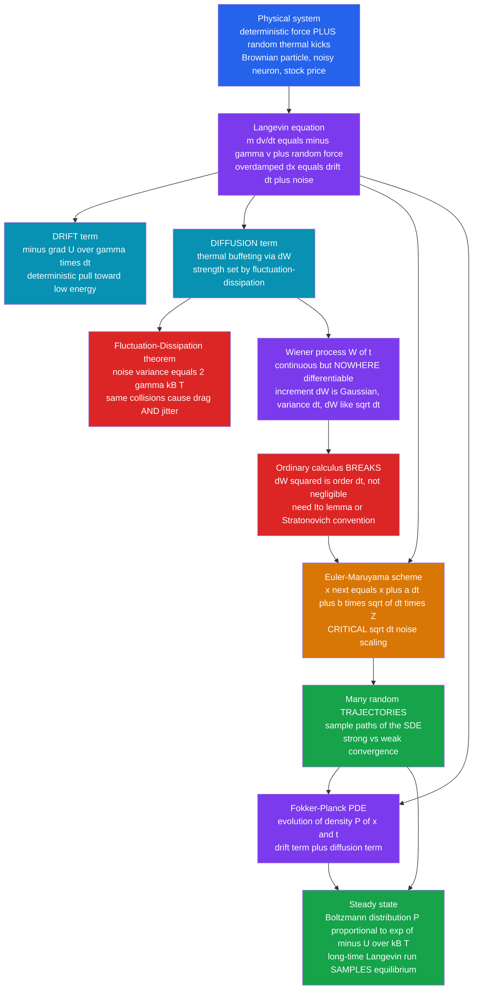

# 🎲 Stochastic Differential Equations and Langevin Dynamics

> [!abstract] TL;DR
> A **stochastic differential equation (SDE)** is an equation of motion with a **random forcing term** bolted onto the deterministic physics: $dx = \underbrace{a(x,t)\,dt}_{\text{drift}} + \underbrace{b(x,t)\,dW}_{\text{diffusion}}$. The paradigm is the **Langevin equation** — Newton's law plus a random thermal force, $m\,\dot v = -\gamma v + \xi(t)$ — whose **overdamped** limit $\dot x = -U'(x)/\gamma + \text{noise}$ governs a Brownian particle, a diffusing molecule, a noisy neuron, or a fluctuating stock price. The randomness is a **Wiener process** $W(t)$ (Brownian motion): continuous but **nowhere differentiable**, with increments $dW \sim \mathcal N(0,\,dt)$. Because $dW^2 \sim dt$ is **not** negligible, ordinary calculus breaks and you need **Itô** (or **Stratonovich**) calculus. Numerically, the **Euler–Maruyama** scheme $x_{n+1} = x_n + a\,\Delta t + b\,\sqrt{\Delta t}\,Z$ integrates it — with the **critical $\sqrt{\Delta t}$ scaling** of the noise (scaling by $\Delta t$ is the classic bug). The dual, distribution-level view is the **Fokker–Planck equation** for $P(x,t)$, whose steady state is the **Boltzmann distribution** — so a Langevin run *samples* equilibrium at long times. The **fluctuation–dissipation theorem** ties noise strength to friction and temperature: the same molecular collisions cause **both** drag and jitter. SDEs power molecular-dynamics thermostats, chemical-reaction noise, computational neuroscience, the Black–Scholes model, and the **diffusion models** behind modern generative AI.

## Intuition

**Analogy:** Watch a speck of pollen suspended in a drop of water under a microscope. It never sits still — it **jitters endlessly**, staggering along a jagged, unpredictable path. Nobody is pushing it on purpose; it is being **bombarded from every side by water molecules** far too small to see, and the imbalance of those countless tiny collisions kicks it this way, then that, forever. Now suppose you want to *simulate* that speck. You cannot use an ordinary equation of motion, because there is no smooth force you can write down — the pollen's future is genuinely random. What you *can* do is split the physics into two parts: a **deterministic drift** you understand (gravity settling it downward, drag from the fluid slowing it) **plus a relentless random buffeting** standing in for the unseen molecular kicks. An equation of motion with a random term in it is a **stochastic differential equation**, and the specific one for the pollen speck is the **Langevin equation**.

The catch is that the random buffeting is **infinitely jagged** — zoom in on the pollen's path and it never smooths out, it looks equally jagged at every scale (it is a *fractal*, nowhere differentiable). That jaggedness quietly wrecks the ordinary rules of calculus you learned for smooth curves: a term that would normally be too small to matter, the *square* of a tiny random step, refuses to vanish. So you need a modified calculus (**Itô's**) and special numerical schemes with a peculiar rule — the random kick each step must be scaled by $\sqrt{\Delta t}$, **not** $\Delta t$. Get that one factor right and the payoff is enormous: the very same machinery simulates diffusing molecules, noisy electronic circuits, fluctuating chemical concentrations, spiking neurons, and — with a change of names — the price of a stock and the images generated by a diffusion model.

---

## How It Works

### Core Mechanics

1. **Why physics needs randomness.** A huge class of systems evolve under **both** deterministic forces **and** unresolved random fluctuations. A colloidal particle feels gravity and viscous drag *and* $\sim 10^{21}$ molecular collisions per second; a chemical reaction obeys mass-action rate laws *and* discrete birth-death shot noise; a neuron integrates synaptic current *and* channel/synaptic noise; a stock has a drift *and* market volatility. You *could* try to model every molecule, but it is far cheaper and more honest to **coarse-grain the fast, unresolved degrees of freedom into a random force**. That trade — replace a hopeless many-body problem with a small deterministic law plus calibrated noise — is the whole idea of an SDE.

2. **The Langevin equation.** For a Brownian particle of mass $m$ and velocity $v$, Langevin (1908) wrote Newton's law with the fluid's influence split in two:

$$
m\,\frac{dv}{dt} = \underbrace{-\gamma v}_{\text{systematic drag}} + \underbrace{\xi(t)}_{\text{random thermal force}},
$$

where $\gamma$ is the friction coefficient and $\xi(t)$ is a rapidly fluctuating force with zero mean. Both terms come from the *same* molecular collisions — a point we make precise in step 4. When friction dominates inertia (small particle, viscous fluid — the **overdamped** or **Brownian** limit) the $m\ddot x$ term is negligible and, for a particle in a potential $U(x)$ so that the systematic force is $-U'(x)$, the equation collapses to a first-order SDE for position:

$$
\gamma\,\frac{dx}{dt} = -\,U'(x) + \xi(t)
\qquad\Longleftrightarrow\qquad
dx = \underbrace{-\frac{U'(x)}{\gamma}\,dt}_{\text{drift}} + \underbrace{\sqrt{2D}\;dW}_{\text{diffusion}},
$$

with diffusion constant $D = k_B T/\gamma$. This **drift + diffusion** form is the workhorse: drift slides the particle downhill toward low energy, noise jiggles it back up.

3. **The Wiener process (mathematical Brownian motion).** The driving randomness $W(t)$ is a **Wiener process**: it starts at $W(0)=0$, is **continuous** in $t$, has **independent Gaussian increments** $W(t+\Delta t) - W(t) \sim \mathcal N(0,\,\Delta t)$ (variance grows *linearly* with time), yet is **nowhere differentiable** — its path is a fractal with infinite total length. Informally, **white noise** $\xi(t)$ is "the derivative" $dW/dt$, but that derivative does not exist in the ordinary sense — which is exactly why we write SDEs in *differential* form $dx = \dots dW$ rather than as $\dot x = \dots$. The defining scaling is $dW \sim \sqrt{dt}$: a random step whose *size* shrinks like the square root of the timestep, so its *variance* shrinks like $dt$.

4. **The fluctuation–dissipation theorem.** The noise and the drag are not independent — they are two faces of the *same* molecular bombardment. Demanding that the particle eventually reach thermal equilibrium (equipartition, $\tfrac12 m\langle v^2\rangle = \tfrac12 k_B T$) forces the noise strength to satisfy

$$
\langle \xi(t)\,\xi(t')\rangle = 2\gamma k_B T\,\delta(t-t').
$$

**More friction demands more jitter, and hotter means noisier.** This **fluctuation–dissipation theorem** is why you cannot pick the drag and the noise independently: the collisions that slow the particle down (dissipation) are the same ones that kick it around (fluctuation). It is the linchpin that makes a Langevin simulation reproduce the correct temperature.

5. **Why ordinary calculus breaks — Itô vs Stratonovich.** For a smooth path, the chain rule for $f(x)$ keeps only first-order terms because $dx^2$ is negligible. For a Brownian path this fails: since $dW \sim \sqrt{dt}$, we have $dW^2 \sim dt$ — **first order, not negligible**. The corrected chain rule, **Itô's lemma**, carries an extra second-derivative term:

$$
df = f'(x)\,dx + \tfrac12 f''(x)\,b^2\,dt .
$$

That $\tfrac12 f'' b^2\,dt$ "Itô correction" has no counterpart in ordinary calculus and shows up everywhere (it is precisely the $-\tfrac12\sigma^2$ term in the Black–Scholes lognormal solution). There is a genuine **interpretation ambiguity** for *multiplicative* noise (when $b$ depends on $x$): do you evaluate $b$ at the **start** of each step (**Itô**, natural for causal/financial models) or at the **midpoint** (**Stratonovich**, the limit of smooth-noise physics and obeys the ordinary chain rule)? The two give **different answers**, differ by a well-defined drift term, and you must state which convention you mean. For **additive** noise (constant $b$, as in ordinary Brownian motion) the distinction vanishes.

6. **Numerical integration — Euler–Maruyama.** The SDE analog of the forward-Euler method (see *[[Initial_Value_Problems_and_Euler_Methods]]*) for $dx = a\,dt + b\,dW$ is:

$$
x_{n+1} = x_n + a(x_n,t_n)\,\Delta t + b(x_n,t_n)\,\sqrt{\Delta t}\;Z_n,
\qquad Z_n \sim \mathcal N(0,1)\ \text{i.i.d.}
$$

The **crucial** feature is the $\boxed{\sqrt{\Delta t}}$ on the noise term — it correctly reproduces $dW \sim \sqrt{dt}$. Scaling the noise by $\Delta t$ (the reflex from deterministic Euler) is the single most common SDE bug: it makes the noise **vanish** as you refine the grid, so your "stochastic" run silently converges to the deterministic drift. Euler–Maruyama has **strong order $1/2$** (path-wise error $\sim \sqrt{\Delta t}$) and **weak order $1$** (error in *averages/distributions* $\sim \Delta t$). The higher-order **Milstein** scheme adds a $\tfrac12 b\,b'(Z_n^2 - 1)\Delta t$ term to reach strong order $1$; **stochastic Runge–Kutta** methods exist but are subtler than their deterministic cousins because you cannot naively reuse ODE tableaux. Which order you need depends on your goal — see step 8.

7. **The Fokker–Planck equation — the dual view.** Instead of following one jagged random *trajectory*, you can ask how the **probability density** $P(x,t)$ of an ensemble of particles evolves. That density obeys a deterministic PDE, the **Fokker–Planck** (a.k.a. **Smoluchowski** in the overdamped case) equation:

$$
\frac{\partial P}{\partial t}
= -\frac{\partial}{\partial x}\!\big[a(x)\,P\big]
+ \frac{\partial^2}{\partial x^2}\!\big[D(x)\,P\big] .
$$

It is a **drift term + diffusion term** — the same drift as the SDE, plus a diffusion that spreads probability (this is literally the *[[Introduction_to_PDEs|advection–diffusion]]* structure of the heat equation with a drift; see the companion sibling *The_Heat_and_Diffusion_Equation*). Its **steady state** ($\partial_t P = 0$) for the overdamped Langevin equation is the **Boltzmann distribution** $P_\text{eq}(x) \propto e^{-U(x)/k_B T}$. This is the profound bridge: **a long Langevin simulation samples the Boltzmann distribution** — it is a physically-motivated Monte Carlo sampler, kin to the sibling *The_Metropolis_Algorithm_and_MCMC*. Trajectory (SDE) and distribution (Fokker–Planck PDE) are two exact descriptions of the *same* physics.

8. **Strong vs weak convergence.** Because SDEs have two "correctness" notions, so do their solvers. **Strong convergence** measures how well the numerical path tracks the *true realization driven by the same noise* — you need it for pathwise questions (option payoffs on a specific trajectory, first-passage times). **Weak convergence** measures how well *statistical averages and distributions* match — enough for computing $\langle f(x_T)\rangle$, equilibrium histograms, or expected option prices. Weak order is typically higher (Euler–Maruyama: weak $1$ vs strong $1/2$), so if you only care about ensemble statistics, plain Euler–Maruyama with a modest step is often perfectly adequate.

### Flow / Architecture



---

## Key Concepts

### Secondary
- A pollen speck in water **jitters forever** because unseen molecules keep knocking it. To simulate it you add a **random kick** to the ordinary physics — that is a **stochastic** ("random") equation of motion.
- The picture is **drift + noise**: a predictable pull (gravity, drag, a downhill force) *plus* an unpredictable buffeting.
- Zoom into the jittery path and it never smooths out — it stays jagged at every scale. That is why simulating it needs a special rule, not the usual one.
- The magic rule: each timestep, the random kick is scaled by the **square root** of the time step, not the time step itself.
- Run it long enough and the wandering particle settles into a familiar bell-shaped spread of positions — random motion produces a predictable *distribution*.

### Undergraduate
- **Langevin equation:** $m\dot v = -\gamma v + \xi(t)$; overdamped limit $dx = -\tfrac{1}{\gamma}U'(x)\,dt + \sqrt{2D}\,dW$ with $D = k_BT/\gamma$. Drift = deterministic force / friction; diffusion = thermal noise.
- **Fluctuation–dissipation:** $\langle\xi(t)\xi(t')\rangle = 2\gamma k_BT\,\delta(t-t')$ — noise strength is *locked* to friction and temperature, so a Langevin run reaches the right temperature.
- **Wiener process:** increments $\Delta W \sim \mathcal N(0,\Delta t)$; **variance $\propto$ time**, hence the mean-square displacement of free diffusion is $\langle x^2\rangle = 2Dt$.
- **Euler–Maruyama:** $x_{n+1} = x_n + a\,\Delta t + b\,\sqrt{\Delta t}\,Z_n$. Memorize the $\sqrt{\Delta t}$ — scaling by $\Delta t$ kills the noise.
- **Ornstein–Uhlenbeck process** (Langevin in a harmonic well): $dx = -\theta x\,dt + \sigma\,dW$; a **mean-reverting** Gaussian process with steady variance $\sigma^2/2\theta$ — the tractable test case whose exact distribution you can check a simulation against.
- **Fokker–Planck / Boltzmann:** the ensemble density obeys a drift–diffusion PDE whose equilibrium is $P \propto e^{-U/k_BT}$; the SDE trajectory and this PDE describe the same physics.

### Graduate
- **Itô calculus and Itô's lemma:** $df = f'\,dx + \tfrac12 f''\,b^2\,dt$; the extra term arises because $(dW)^2 = dt$. This underlies the lognormal solution of geometric Brownian motion, $x_T = x_0\exp[(\mu-\tfrac12\sigma^2)T + \sigma W_T]$ — note the $-\tfrac12\sigma^2$ Itô drift.
- **Itô vs Stratonovich:** for multiplicative noise the two conventions differ by the "spurious"/noise-induced drift $\tfrac12 b\,b'$. Physics from smooth colored noise → Stratonovich; causal/financial models → Itô. Choose deliberately; converting between them is a fixed drift shift.
- **Convergence orders:** Euler–Maruyama is **strong order $1/2$**, **weak order $1$**; **Milstein** adds $\tfrac12 b b'(Z^2-1)\Delta t$ for strong order $1$; stochastic RK methods require order-conditions that differ from deterministic Butcher trees. Pathwise accuracy (strong) vs distributional accuracy (weak) dictate the choice.
- **Fokker–Planck operator and detailed balance:** $\partial_t P = \mathcal L_{FP} P$ with $\mathcal L_{FP} = -\partial_x(a\,\cdot) + \partial_x^2(D\,\cdot)$; the overdamped generator can be symmetrized into a Schrödinger-like operator, giving spectral **relaxation rates** to equilibrium. Detailed balance ⇔ Boltzmann steady state ⇔ the Langevin dynamics is reversible.
- **Sampling and ML bridge:** **Unadjusted Langevin Algorithm (ULA)** and **stochastic-gradient Langevin dynamics (SGLD)** are Euler–Maruyama on $dx = \tfrac12\nabla\log\pi(x)\,dt + dW$ to sample a target $\pi$; **score-based / diffusion generative models** run a *reverse-time* SDE whose drift needs the learned score $\nabla\log p_t(x)$ — the direct descendant of this whole framework in generative AI (see *[[Diffusion_Models]]*, *[[DDPM_Paper]]*).
- **Chemical Langevin equation:** the diffusion approximation of the chemical master equation, $dX = \sum_j \nu_j a_j(X)\,dt + \sum_j \nu_j\sqrt{a_j(X)}\,dW_j$ — multiplicative, molecule-count-dependent noise bridging deterministic rate laws and the exact Gillespie stochastic simulation algorithm.

---

## Python Demo

```python
# STOCHASTIC DIFFERENTIAL EQUATIONS via EULER-MARUYAMA -- numpy + matplotlib only.
#   (a) Integrate the overdamped LANGEVIN / Ornstein-Uhlenbeck SDE in a
#       harmonic well  dx = -theta*x*dt + sqrt(2D)*dW  with Euler-Maruyama,
#       stressing that the NOISE scales as sqrt(dt) (NOT dt). Plot sample paths.
#   (b) Show the ENSEMBLE of trajectories reproduces the Fokker-Planck density:
#       a time-dependent Gaussian that relaxes to the BOLTZMANN (equilibrium)
#       distribution  P ~ exp(-U/kT)  in the well  ->  histogram vs analytic.
#   (c) For FREE diffusion (theta=0) verify mean-square displacement  MSD = 2Dt,
#       and demonstrate the classic BUG: scaling noise by dt instead of sqrt(dt)
#       makes diffusion collapse as the timestep shrinks (non-convergent).
import numpy as np
import matplotlib.pyplot as plt

rng = np.random.default_rng(0)

# ---- physical parameters (overdamped Langevin in a harmonic potential) ----
D      = 1.0                 # diffusion constant  D = kT/gamma
theta  = 1.0                 # restoring rate      theta = k/gamma  (well stiffness)
sigma  = np.sqrt(2.0 * D)    # noise amplitude so that  <xi xi'> = 2D delta
x0     = 4.0                 # start far from the bottom of the well
T      = 6.0                 # total time
dt     = 0.002               # timestep
nsteps = int(T / dt)
npart  = 20000               # ensemble size
t      = np.linspace(0.0, T, nsteps + 1)

def euler_maruyama_OU(dt, nsteps, npart, sqrt_dt_noise=True):
    """Euler-Maruyama for  dx = -theta*x*dt + sigma*dW.
       sqrt_dt_noise=True  -> CORRECT sqrt(dt) scaling.
       sqrt_dt_noise=False -> the BUG: noise scaled by dt."""
    x = np.full(npart, x0, dtype=float)
    traj = np.empty((nsteps + 1, npart))
    traj[0] = x
    scale = np.sqrt(dt) if sqrt_dt_noise else dt      # <-- the crucial factor
    for n in range(nsteps):
        drift = -theta * x * dt
        noise = sigma * scale * rng.standard_normal(npart)
        x = x + drift + noise
        traj[n + 1] = x
    return traj

# ---- (a) & (b): OU process, ensemble of trajectories ----------------------
traj = euler_maruyama_OU(dt, nsteps, npart)

# Analytic OU statistics (exact solution of the Fokker-Planck equation):
mean_t = x0 * np.exp(-theta * t)                          # mean decays to 0
var_t  = (D / theta) * (1.0 - np.exp(-2.0 * theta * t))   # -> Boltzmann var D/theta
var_eq = D / theta                                        # equilibrium <x^2> = kT/k

# ---- (c): FREE diffusion (theta = 0) to check MSD = 2Dt -------------------
theta_free = theta
theta = 0.0                                              # switch off the well
traj_free      = euler_maruyama_OU(dt, nsteps, npart, sqrt_dt_noise=True)
traj_free_bug  = euler_maruyama_OU(dt, nsteps, npart, sqrt_dt_noise=False)
theta = theta_free                                      # restore
msd      = np.mean((traj_free     - x0) ** 2, axis=1)
msd_bug  = np.mean((traj_free_bug - x0) ** 2, axis=1)

# ================================ plots ===================================
fig = plt.figure(figsize=(15, 9))

# (a) a handful of OU sample paths: jagged, mean-reverting to the well bottom
ax1 = fig.add_subplot(2, 3, 1)
for k in range(8):
    ax1.plot(t, traj[:, k], lw=0.8, alpha=0.8)
ax1.plot(t, mean_t, "k--", lw=2, label="ensemble mean  x0 exp(-theta t)")
ax1.fill_between(t, mean_t - np.sqrt(var_t), mean_t + np.sqrt(var_t),
                 color="gray", alpha=0.25, label="+/- 1 std (analytic)")
ax1.set_title("(a) Langevin/OU sample paths (Euler-Maruyama)")
ax1.set_xlabel("time"); ax1.set_ylabel("x"); ax1.legend(fontsize=7)

# (b) ensemble mean & variance vs the exact Fokker-Planck prediction
ax2 = fig.add_subplot(2, 3, 2)
ax2.plot(t, np.mean(traj, axis=1), color="#2563eb", lw=1.2, label="mean (sim)")
ax2.plot(t, mean_t, "k--", lw=1, label="mean (analytic)")
ax2.plot(t, np.var(traj, axis=1), color="#dc2626", lw=1.2, label="var (sim)")
ax2.plot(t, var_t, "k:", lw=1, label="var (analytic)")
ax2.axhline(var_eq, color="#16a34a", lw=1, ls="-", label="Boltzmann var D/theta")
ax2.set_title("(b) Ensemble stats match Fokker-Planck")
ax2.set_xlabel("time"); ax2.set_ylabel("moment"); ax2.legend(fontsize=7)

# (c) histograms at 3 times vs analytic Gaussian -> relaxing to Boltzmann
ax3 = fig.add_subplot(2, 3, 3)
xg = np.linspace(-6, 6, 400)
for frac, col in [(0.05, "#7c3aed"), (0.25, "#d97706"), (1.00, "#16a34a")]:
    n = int(frac * nsteps)
    ax3.hist(traj[n], bins=80, density=True, alpha=0.35, color=col)
    m, v = mean_t[n], var_t[n]
    pdf = np.exp(-(xg - m) ** 2 / (2 * v)) / np.sqrt(2 * np.pi * v)
    ax3.plot(xg, pdf, color=col, lw=1.8, label=f"t = {t[n]:.1f}")
ax3.set_title("(c) Density relaxes to BOLTZMANN  exp(-U/kT)")
ax3.set_xlabel("x"); ax3.set_ylabel("P(x,t)"); ax3.legend(fontsize=7)

# (d) free-diffusion MSD = 2Dt (correct) vs collapsed MSD (the dt bug)
ax4 = fig.add_subplot(2, 3, 4)
ax4.plot(t, msd,     color="#2563eb", lw=1.5, label="sim MSD (sqrt(dt) noise)")
ax4.plot(t, 2*D*t,   "k--", lw=1.5, label="analytic  2 D t")
ax4.plot(t, msd_bug, color="#dc2626", lw=1.5, ls="--",
         label="BUG: noise scaled by dt (collapses)")
ax4.set_title("(d) Free diffusion: MSD = 2 D t")
ax4.set_xlabel("time"); ax4.set_ylabel("mean-square displacement")
ax4.legend(fontsize=7)

# (e) free-diffusion density: a spreading Gaussian, variance = 2Dt
ax5 = fig.add_subplot(2, 3, 5)
for frac, col in [(0.08, "#7c3aed"), (0.35, "#d97706"), (1.00, "#16a34a")]:
    n = int(frac * nsteps)
    ax5.hist(traj_free[n] - x0, bins=80, density=True, alpha=0.35, color=col)
    v = 2 * D * t[n]
    pdf = np.exp(-xg ** 2 / (2 * v)) / np.sqrt(2 * np.pi * v)
    ax5.plot(xg, pdf, color=col, lw=1.8, label=f"t = {t[n]:.1f}")
ax5.set_title("(e) Free diffusion: spreading Gaussian")
ax5.set_xlabel("displacement"); ax5.set_ylabel("P"); ax5.legend(fontsize=7)

# (f) why sqrt(dt): a single dW increment has std sqrt(dt), variance dt
ax6 = fig.add_subplot(2, 3, 6)
dts = np.array([0.5, 0.2, 0.1, 0.05, 0.02, 0.01, 0.005])
emp_var = [np.var(rng.standard_normal(200000) * np.sqrt(h)) for h in dts]
ax6.plot(dts, emp_var, "o", color="#2563eb", label="empirical var of dW")
ax6.plot(dts, dts, "k--", label="line  var = dt")
ax6.set_xscale("log"); ax6.set_yscale("log")
ax6.set_title("(f) Wiener increment: var(dW) = dt, so dW ~ sqrt(dt)")
ax6.set_xlabel("dt"); ax6.set_ylabel("variance of dW"); ax6.legend(fontsize=7)

plt.tight_layout(); plt.show()
```

Running it: panel **(a)** shows a few **jagged Ornstein–Uhlenbeck sample paths** starting at $x_0=4$, mean-reverting toward the bottom of the well while jittering — the drift pulls them home, the noise keeps them dancing. Panel **(b)** confirms the simulated **ensemble mean and variance** track the exact Fokker–Planck prediction (mean $x_0 e^{-\theta t}$, variance $\tfrac{D}{\theta}(1-e^{-2\theta t})$) and the variance saturates at the **Boltzmann value** $D/\theta = k_BT/k$ — the equilibrium of $P\propto e^{-U/k_BT}$. Panel **(c)** histograms the whole ensemble at three times: a Gaussian that starts narrow, widens, and **relaxes onto the Boltzmann distribution**, each overlaid with its analytic curve. Panel **(d)** switches the well off (free diffusion) and recovers the textbook **mean-square displacement $\langle x^2\rangle = 2Dt$** — while the red curve shows the classic **bug**: scaling the noise by $\Delta t$ instead of $\sqrt{\Delta t}$ makes the diffusion *collapse* (its MSD is tiny and shrinks further as you refine $\Delta t$ — a non-convergent scheme). Panel **(e)** is the free-diffusion **spreading Gaussian**, variance $2Dt$, the fundamental solution of the diffusion equation. Panel **(f)** is the reason for all of it: the variance of a Wiener increment is exactly $\Delta t$, so its *size* is $\sqrt{\Delta t}$ — the single factor Euler–Maruyama must respect.

---

## Real-World Applications

> **Example:** **Langevin thermostats in molecular dynamics.** To hold a simulated protein or material at body/room temperature, MD codes (GROMACS, LAMMPS, OpenMM) integrate an SDE — Newton's equations plus a per-atom friction $-\gamma v$ and a random force calibrated by the **fluctuation–dissipation theorem** ($\langle\xi\xi'\rangle = 2\gamma m k_BT\delta$). The friction bleeds off excess kinetic energy while the noise injects thermal energy, and their balance drives the system to the **Boltzmann distribution** at the target temperature — turning a deterministic mechanics engine into a correct *canonical-ensemble* sampler. See *[[Diffusion_and_Brownian_Motion_in_Cells]]* and *[[Classical_Statistical_Mechanics]]*.

- **Brownian motion and colloidal / soft-matter physics.** Diffusion of nanoparticles, tracer beads, and macromolecules is Langevin dynamics with $\langle x^2\rangle = 2Dt$; the **Stokes–Einstein** relation $D = k_BT/6\pi\eta r$ is the fluctuation–dissipation theorem in disguise. Single-particle tracking calibrates optical tweezers this way.
- **Chemical and biochemical reaction noise.** When molecule counts are small (gene expression, signaling), deterministic rate equations fail; the **chemical Langevin equation** adds $\sqrt{\text{propensity}}\,dW$ shot noise, bridging deterministic kinetics and the exact **Gillespie** stochastic simulation algorithm.
- **Computational neuroscience.** **Stochastic integrate-and-fire** and noisy Hodgkin–Huxley models add Langevin channel/synaptic noise to reproduce spike-timing variability and threshold crossings — see *[[Diffusion_and_Brownian_Motion_in_Cells]]* for the biophysical noise sources.
- **Quantitative finance.** **Geometric Brownian motion** $dS = \mu S\,dt + \sigma S\,dW$ is the SDE at the heart of the **Black–Scholes** option-pricing model; Monte Carlo option pricers simulate millions of Euler–Maruyama paths. See *[[Black_Scholes_Model]]* and *[[Monte_Carlo_Pricing]]*.
- **Generative AI — diffusion models.** Score-based generative models **corrupt** data with a forward SDE (add noise) and **generate** by numerically integrating the *reverse-time* SDE, whose drift is a neural-network-learned score $\nabla\log p_t$. Sampling is Langevin/Euler–Maruyama in disguise — the hottest modern descendant of this theory (*[[Diffusion_Models]]*, *[[Stable_Diffusion]]*, *[[DDPM_Paper]]*).
- **Bayesian sampling in ML.** **Stochastic-gradient Langevin dynamics (SGLD)** adds calibrated Gaussian noise to SGD so the parameters *sample* the posterior instead of merely minimizing loss (*[[Gradient_Descent_Variants]]*).

---

## Common Pitfalls

- **Scaling the noise by $\Delta t$ instead of $\sqrt{\Delta t}$** — the signature SDE bug (panel **d** above). It makes the diffusion vanish as you refine the grid, so your stochastic simulation silently degenerates into the deterministic drift. The noise term is $b\,\sqrt{\Delta t}\,Z$, always.
- **Using an ordinary ODE integrator (RK4) on an SDE** — high-order deterministic solvers assume a smooth right-hand side. White noise is nowhere-differentiable, so RK4's Taylor-expansion accuracy collapses; naively plugging noise into RK4 does **not** give a high-order SDE method. Use Euler–Maruyama / Milstein / stochastic-RK schemes with the correct order conditions.
- **Ignoring the Itô vs Stratonovich choice for multiplicative noise** — when $b$ depends on $x$, the two conventions give **different physical answers** (they differ by the noise-induced drift $\tfrac12 b b'$). Silently mixing them, or using an Itô scheme when the physics is Stratonovich, produces a systematically wrong steady state.
- **Confusing strong and weak accuracy** — chasing tiny pathwise error when you only need ensemble averages wastes effort; conversely, trusting a single path from a weak-order scheme for a first-passage-time question gives garbage. Match the convergence notion to the question.
- **Timestep too large for the fastest drift** — Euler–Maruyama is only *conditionally* stable; a stiff drift (steep potential, large $\theta$) with a big $\Delta t$ can overshoot the well and blow up, even though the noise is handled correctly. Stiff SDEs need implicit/split integrators or a smaller step.
- **Correlated or non-Gaussian "random" numbers** — a poor PRNG or reused seed injects spurious correlations that masquerade as physical structure; the noise must be i.i.d. standard normal (see the sibling *Random_Number_Generation*). Reusing the same noise across "independent" trajectories destroys the ensemble.
- **Forgetting the fluctuation–dissipation link in thermostats** — picking friction and noise strength independently breaks $\langle\xi\xi'\rangle = 2\gamma k_BT\delta$, so the simulation equilibrates to the *wrong* temperature (or never reaches Boltzmann at all).

---

## Related Concepts

- [[Brownian_Motion]] — the Wiener process itself: the mathematical object that drives every SDE in this note.
- [[Mathematics/17_Stochastic_Processes/Stochastic_Calculus|Stochastic Calculus]] — Itô's lemma, Itô vs Stratonovich integrals, and the rigorous meaning of $\int b\,dW$.
- [[Markov_Chains]] — SDEs are continuous-state, continuous-time Markov processes; the Fokker–Planck operator is the continuous analog of a transition matrix.
- [[Classical_Statistical_Mechanics]] — supplies the Boltzmann distribution that a long Langevin run samples, and the equipartition that fixes the noise via fluctuation–dissipation.
- [[Diffusion_and_Brownian_Motion_in_Cells]] — the biophysical home of Langevin/Brownian dynamics: molecular diffusion, Stokes–Einstein, and noisy transport.
- [[Diffusion_Models]] — modern generative AI runs a *reverse* SDE with a learned score; the direct machine-learning descendant of Langevin dynamics.
- [[DDPM_Paper]] — the denoising-diffusion paper whose sampler is Langevin/Euler–Maruyama in disguise.
- [[Stable_Diffusion]] — a production diffusion model built on the reverse-SDE / score-based framework.
- [[Gradient_Descent_Variants]] — SGLD is Euler–Maruyama added to SGD to turn optimization into posterior sampling.
- [[Black_Scholes_Model]] — geometric Brownian motion, the finance SDE, and the Itô correction in its lognormal solution.
- [[Monte_Carlo_Pricing]] — prices derivatives by simulating many Euler–Maruyama paths of the underlying SDE.
- [[Initial_Value_Problems_and_Euler_Methods]] — Euler–Maruyama is the stochastic generalization of forward Euler; same skeleton, plus the $\sqrt{\Delta t}$ noise.
- [[Runge_Kutta_and_Adaptive_Methods]] — why deterministic high-order tableaux do **not** transfer directly to SDEs.
- [[Chaos_and_Nonlinear_Dynamics_Numerically]] — the deterministic-unpredictability counterpart; SDEs add *genuine* randomness on top of (or instead of) chaotic sensitivity.
- [[Introduction_to_PDEs]] — the Fokker–Planck equation is a drift–diffusion PDE; its analysis borrows the parabolic-PDE toolkit.
- [[Computational_Physics_Overview]] — the vault map this Monte-Carlo-and-stochastic-methods note belongs to.

---

## Review Questions

1. **(Secondary)** A pollen grain in water jitters forever even though nothing visible is pushing it. In plain words, what is doing the pushing, and why can't you write a normal, smooth equation of motion for the grain? What two ingredients does the stochastic description use instead?
2. **(Undergraduate)** Write the Euler–Maruyama update for $dx = -\theta x\,dt + \sigma\,dW$. Explain precisely why the noise term carries $\sqrt{\Delta t}$ and not $\Delta t$, and predict what happens to a free-diffusion simulation's mean-square displacement if you use $\Delta t$ by mistake.
3. **(Undergraduate)** State the fluctuation–dissipation theorem for the Langevin equation and explain, physically, why the friction and the random force cannot be chosen independently. How does this guarantee a molecular-dynamics thermostat reaches the correct temperature?
4. **(Graduate)** Starting from $(dW)^2 = dt$, derive the extra term in Itô's lemma for $f(x)$ and show how it produces the $-\tfrac12\sigma^2$ drift in the solution of geometric Brownian motion. When does the Itô-vs-Stratonovich distinction actually matter, and by how much do the two interpretations differ?
5. **(Graduate)** You simulate an overdamped particle in a potential $U(x)$ and let it run for a long time. Explain, via the Fokker–Planck equation, why the histogram of its positions converges to $P\propto e^{-U/k_BT}$, and contrast the "strong" and "weak" senses in which your Euler–Maruyama trajectories can be called accurate. Which one matters for estimating this equilibrium histogram?

---

## Sources

- Gardiner, C. W., *Stochastic Methods: A Handbook for the Natural and Social Sciences*, 4th ed. (Springer, 2009).
- Kloeden, P. E. & Platen, E., *Numerical Solution of Stochastic Differential Equations* (Springer, 1992) — the standard reference for Euler–Maruyama, Milstein, and convergence orders.
- Van Kampen, N. G., *Stochastic Processes in Physics and Chemistry*, 3rd ed. (Elsevier, 2007).
- Higham, D. J., "An Algorithmic Introduction to Numerical Simulation of Stochastic Differential Equations", *SIAM Review* 43(3), 525–546 (2001).
- Song, Y. et al., "Score-Based Generative Modeling through Stochastic Differential Equations", *ICLR* (2021) — the SDE view of diffusion models.

---

#computational-physics #stochastic-differential-equations #langevin #brownian-motion #euler-maruyama
