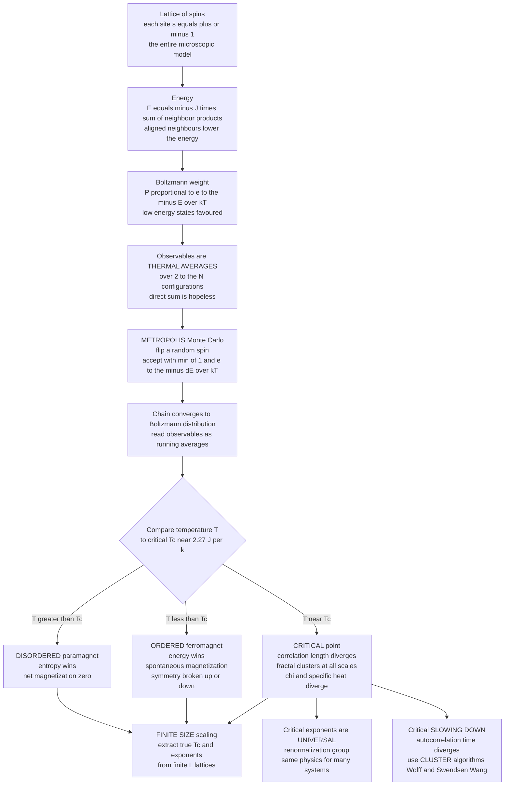

# 🧲 The Ising Model and Statistical Physics

> [!abstract] TL;DR
> The **Ising model** is the "fruit fly" of statistical physics — the *simplest* system that exhibits a genuine **phase transition**. It is nothing but a lattice of **spins** `s = ±1`, each coupled to its **nearest neighbours** by a term that rewards alignment (`E = -J Σ sᵢsⱼ`), immersed in a heat bath at temperature `T`. Each configuration carries a **Boltzmann weight** `P ∝ e^(-E/kT)`, so every observable (magnetization, energy, specific heat, susceptibility) is a **thermal average** over an astronomically large configuration space — a sum with `2^N` terms that *demands* **Monte Carlo**. The workhorse is **Metropolis Monte Carlo**: repeatedly propose a single spin flip and accept it with probability `min(1, e^(-ΔE/kT))`; the lattice random-walks toward the equilibrium Boltzmann distribution, and observables are read off as running averages. The magic is what happens as you cool: at a sharp **critical temperature** the system undergoes a continuous **second-order phase transition** from a **disordered** (paramagnetic, zero net magnetization) phase to an **ordered** (ferromagnetic, spontaneously magnetized) phase — **collective order emerging from purely local rules plus randomness**, a textbook case of **spontaneous symmetry breaking**. The competition is **energy** (favours alignment) versus **entropy** (favours disorder), and it tips exactly at `Tc`. The 2D model is *exactly solved* — **Onsager's** `Tc = 2 / ln(1+√2) ≈ 2.269 J/k` — making it the gold-standard benchmark for any simulation. Near `Tc` the physics turns rich and universal: the **correlation length diverges** (domains of all sizes, scale-invariant fractal clusters), susceptibility and specific heat diverge, and **critical exponents** obey power laws that are the *same* for wildly different systems — the **universality** at the heart of the **renormalization group**. Finite simulations round and shift the transition (**finite-size scaling** recovers the true behaviour), and Metropolis suffers **critical slowing down** near `Tc` (motivating **cluster algorithms** like Swendsen–Wang and Wolff). The model's reach is vast: alloys, spin glasses, neural networks, image segmentation, opinion dynamics — the *same* physics everywhere.

---

## Intuition

**Analogy — a grid of tiny compass needles.** Picture a checkerboard where every square holds a miniature compass needle, and each needle *wants* to point the same way as its four neighbours — a little magnetic peer pressure. Now heat the board. Heat is a relentless jostling: it kicks the needles at random, flipping them regardless of what their neighbours are doing. At **high temperature** the jostling wins outright — needles point every which way, the board is a churning mess, and if you step back and ask "which way does the whole board point?" the answer is *nowhere*: the ups and downs cancel, there is no net magnetism. Now cool it slowly. The peer pressure gains ground on the fading jostling, and at one precise **critical temperature** something dramatic and sudden happens: the entire board **snaps into alignment**. Almost every needle now points the same way, the board has become a **magnet**, and it "chose" up-or-down all on its own with nothing telling it which — that spontaneous choice is **symmetry breaking**.

That abrupt, collective, all-or-nothing switch is a **phase transition**, and the astonishing thing is that it emerged from *nothing but* a trivially simple local rule ("match your neighbours") plus randomness ("heat flips you"). No needle can see the whole board; order appears because local preferences, amplified through the lattice, cascade into global behaviour. This is why the Ising model is the **"fruit fly" of statistical physics** — the simplest possible organism in which we can watch collective order be born, dissect exactly how and when it happens, and simulate it on a computer. Everything deep about phase transitions — order versus disorder, energy versus entropy, criticality, universality — is already visible in this humble grid of `±1`.

---

## How It Works

### Core Mechanics

1. **The model — spins on a lattice.** Place a variable `sᵢ ∈ {+1, -1}` (spin "up" or "down") on each site `i` of a lattice — a 2D square grid in the canonical case. That is the *entire* microscopic description. Despite this austerity, the collective behaviour of `N = L×L` such spins is bottomlessly rich.

2. **The energy — nearest-neighbour coupling.** A configuration's energy is `E = -J Σ_⟨i,j⟩ sᵢ sⱼ - h Σᵢ sᵢ`, where the first sum runs over **nearest-neighbour pairs** only and `h` is an optional external field. With `J > 0` (**ferromagnetic**), aligned neighbours (`sᵢsⱼ = +1`) *lower* the energy, so the system *prefers* order. The locality — each spin talks only to its immediate neighbours — is exactly why the model is both physically realistic and computationally tractable.

3. **The Boltzmann distribution — statistical mechanics in one line.** At temperature `T`, equilibrium statistical mechanics assigns each configuration `{s}` a probability `P({s}) = e^(-E({s})/kT) / Z`, where the **partition function** `Z = Σ_{s} e^(-E/kT)` normalizes over *all* configurations. Low-energy (ordered) states are favoured; the factor `kT` sets how much thermal noise blurs that preference. This Boltzmann weight is the bridge between the microscopic rule and the macroscopic behaviour, and it is the foundation laid in [[Classical_Statistical_Mechanics]].

4. **Observables are thermal averages — and that is the computational wall.** Anything you can measure is an average over the Boltzmann distribution: the **magnetization** `⟨m⟩ = ⟨(1/N) Σ sᵢ⟩`, the energy `⟨E⟩`, the **specific heat** `C = (⟨E²⟩ - ⟨E⟩²)/(kT²)`, the **magnetic susceptibility** `χ = (⟨M²⟩ - ⟨M⟩²)/(kT)`. Each is a sum weighted by `e^(-E/kT)` over `2^N` configurations. For a modest `32×32` lattice that is `2^1024` terms — more than the number of atoms in the universe, many times over. Direct summation is *hopeless*. This intractable high-dimensional sum is precisely what **Monte Carlo** was invented to conquer (see the sibling notes Monte_Carlo_Integration and Random_Number_Generation).

5. **Metropolis Monte Carlo — sampling instead of summing.** Rather than enumerate configurations, we *sample* them in proportion to their Boltzmann weight using a **Markov chain**. The **Metropolis** recipe: (i) pick a random spin; (ii) compute the energy change `ΔE` if it were flipped — for the nearest-neighbour Ising model `ΔE = 2 J sᵢ · (sum of its four neighbours)`, needing only *local* information; (iii) if `ΔE ≤ 0` accept the flip; if `ΔE > 0` accept it only with probability `e^(-ΔE/kT)`, otherwise leave the spin alone. Repeating this drives the lattice's distribution to converge to the exact Boltzmann distribution at temperature `T`. Observables are then simply **running averages** over the sampled configurations (after discarding an initial equilibration transient). The full machinery — detailed balance, ergodicity, autocorrelation, why the acceptance rule guarantees the right stationary distribution — lives in the sibling note The_Metropolis_Algorithm_and_MCMC; this note is its flagship application.

6. **The phase transition — energy versus entropy.** The behaviour is governed by minimizing the **free energy** `F = E - TS`, a tug-of-war between two terms. **Energy** `E` is minimized by *order* (all spins aligned). **Entropy** `S` — the number of ways to arrange the spins — is maximized by *disorder* (random spins). At **high `T`**, the `-TS` term dominates: entropy wins, spins are random, net magnetization is zero (the **paramagnetic** phase). At **low `T`**, the energy term dominates: order wins, spins align, and a nonzero **spontaneous magnetization** appears (the **ferromagnetic** phase). They trade places at a single **critical temperature** `Tc`, and the crossover is not gradual but a genuine **continuous (second-order) phase transition**.

7. **Spontaneous symmetry breaking.** The Ising energy is perfectly symmetric under flipping *every* spin (`s → -s`) when `h = 0` — up and down are equivalent. Yet below `Tc` the system settles into one of the two ordered states, magnetized *either* up *or* down, "choosing" one and abandoning the symmetry the rules possess. This is the lattice-magnet incarnation of **spontaneous symmetry breaking**, the same phenomenon that in field theory gives particles mass (see [[Spontaneous_Symmetry_Breaking]]).

8. **Critical phenomena — the rich physics at `Tc`.** Exactly *at* the transition the system is **scale-invariant**: spin domains appear at *every* length scale, forming self-similar **fractal** clusters (linking to [[Fractals_and_Self_Similarity]]). The **correlation length** `ξ` — the typical size of a correlated domain — **diverges**, and with it the susceptibility `χ` and specific heat `C` blow up. Near `Tc`, observables follow **power laws** `∝ |T - Tc|^exponent`, and the **critical exponents** (`β` for magnetization, `γ` for susceptibility, `ν` for correlation length, `α` for specific heat) are strikingly **universal**: they depend only on the dimensionality and symmetry, not on microscopic details, so utterly different physical systems share the *same* exponents — the profound insight explained by the **renormalization group** ([[Renormalization_and_RG]]) and organized into **universality classes** ([[Criticality_and_Phase_Transitions]]).

9. **The exact benchmark — Onsager.** The 2D Ising model with zero field is one of the very few interacting many-body systems solved *exactly*: **Lars Onsager** (1944) derived a closed form, pinning the critical temperature at `Tc = 2J / [k · ln(1+√2)] ≈ 2.269 J/k` and the magnetization exponent at exactly `β = 1/8`. Because the true answer is known, the 2D Ising model is *the* standard test that any Monte Carlo code — and any new algorithm — must reproduce.

10. **Finite-size effects and scaling.** Real simulations use *finite* `L×L` lattices, where a truly sharp transition is impossible: the divergences are **rounded** into finite peaks and **shifted** away from `Tc`. **Finite-size scaling** turns this limitation into a tool — by studying how the peak height and position drift with `L` (using the scaling form `χ ∼ L^(γ/ν) f[L^(1/ν)(T - Tc)]`), one **extrapolates** to the true infinite-system critical point and exponents. This is a cornerstone computational technique of the field.

11. **Critical slowing down — why we need cluster algorithms.** The sting in the tail: *near* `Tc`, single-spin Metropolis becomes agonizingly slow. Because correlated domains span the whole lattice, flipping one spin at a time barely changes the configuration, and the **autocorrelation time** diverges as `τ ∼ ξ^z` (**critical slowing down**, dynamic exponent `z ≈ 2.17` for 2D Metropolis). The cure is **cluster algorithms** — **Swendsen–Wang** and **Wolff** — which identify whole clusters of like-aligned spins (via bond percolation on the lattice) and flip them *all at once*, slashing the autocorrelation time to near-constant and making criticality efficiently simulable. This was a major algorithmic advance, and it connects directly to the sibling note Percolation_and_Random_Processes.

### Flow / Architecture



---

## Key Concepts

### Secondary Level

- **Spin:** a tiny arrow that can only point up (`+1`) or down (`-1`) — the simplest possible magnetic element.
- **Ferromagnet:** a material where neighbouring spins prefer to line up, producing net magnetism (a fridge magnet). The Ising model is the barest cartoon of one.
- **Temperature as jostling:** heat randomly flips spins; more heat means more disorder. Cold lets the "line up with your neighbours" rule win.
- **Phase transition:** a sudden, qualitative change of the whole system at one special temperature — like water freezing into ice. Here, a disordered soup of spins abruptly becomes an ordered magnet.
- **Critical temperature `Tc`:** the exact temperature where the switch happens. For the 2D Ising model, about `2.27` in natural units.

### Undergraduate Level

- **Energy and the Boltzmann factor:** `E = -J Σ sᵢsⱼ`; each configuration occurs with probability `∝ e^(-E/kT)`. This weight, and the partition function `Z` that normalizes it, are the core of equilibrium statistical mechanics.
- **Order parameter — magnetization:** `m = (1/N) Σ sᵢ`. It is `≈ 0` above `Tc` (disordered) and grows to `±1` below `Tc` (ordered). It is the quantity that "detects" the phase transition.
- **Metropolis algorithm:** propose a single-spin flip; accept with `min(1, e^(-ΔE/kT))`. For the Ising model, `ΔE = 2 J sᵢ (Σ neighbours)` — purely local, so each step is `O(1)`. The chain samples the Boltzmann distribution; observables are running averages after equilibration.
- **Second-order transition and spontaneous symmetry breaking:** the magnetization rises *continuously* from zero below `Tc` (no latent heat, unlike a first-order transition). The `s → -s` symmetry of the `h = 0` Hamiltonian is spontaneously broken as the system picks up or down.
- **Response functions:** specific heat `C = Var(E)/(kT²)` and susceptibility `χ = Var(M)/(kT)` — fluctuation formulas that both *peak sharply* near `Tc`, a hallmark of criticality.
- **Onsager's exact result:** `Tc = 2/ln(1+√2) ≈ 2.269` (with `J = k = 1`); the exact magnetization curve `m(T) = [1 - sinh(2J/kT)^(-4)]^(1/8)` for `T < Tc`. The benchmark every simulation is checked against.

### Graduate Level

- **Critical exponents and universality:** near `Tc`, `m ∼ (Tc - T)^β`, `χ ∼ |T - Tc|^(-γ)`, `ξ ∼ |T - Tc|^(-ν)`, `C ∼ |T - Tc|^(-α)`. For 2D Ising: `β = 1/8`, `γ = 7/4`, `ν = 1`, `α = 0` (logarithmic). These exponents obey scaling relations (Rushbrooke, Widom) and are shared by *all* systems in the 2D Ising universality class — the deep content of the renormalization group.
- **Correlation length and scale invariance:** `⟨sᵢsⱼ⟩ - ⟨s⟩² ∼ e^(-r/ξ)/r^(d-2+η)`; at `Tc` the exponential dies (`ξ → ∞`) leaving pure power-law correlations — the signature of self-similar, fractal critical clusters and conformal invariance in 2D.
- **Finite-size scaling:** on an `L×L` lattice, `χ_max ∼ L^(γ/ν)`, the pseudo-critical temperature shifts as `Tc(L) - Tc(∞) ∼ L^(-1/ν)`, and the **Binder cumulant** `U = 1 - ⟨m⁴⟩/(3⟨m²⟩²)` crosses at `Tc` independent of `L` — the cleanest numerical estimator of the true critical point.
- **Critical slowing down and dynamic exponents:** integrated autocorrelation time `τ ∼ ξ^z`; local Metropolis has `z ≈ 2.17` in 2D. Cluster algorithms (Wolff, Swendsen–Wang) exploit the Fortuin–Kasteleyn mapping of the partition function to a correlated bond-percolation problem, reducing `z` to `≈ 0.25`, essentially eliminating critical slowing down.
- **Transfer matrix and exact solution:** Onsager's solution diagonalizes the row-to-row transfer matrix; the singularity of the free energy at `Tc` (a logarithmic specific-heat divergence) is the analytic fingerprint of the transition — a rare exact window into a nontrivial critical point.
- **Generalizations and mappings:** the `q`-state **Potts model**, continuous-spin **XY** and **Heisenberg** models, random-coupling **spin glasses** (Edwards–Anderson, Sherrington–Kirkpatrick — NP-hard ground states, links to combinatorial optimization), **lattice gauge theory**, and the lattice-gas/binary-alloy mapping. Ising-type energy functions also underlie **Hopfield networks** and **Boltzmann machines** in machine learning — the same statistical physics reappearing across disciplines (see Machine_Learning_in_Computational_Physics).

---

## Python Demo

```python
# Simulate the 2D ISING MODEL with METROPOLIS Monte Carlo (J = k = 1).
#   (a) SNAPSHOTS via imshow at three temperatures:
#         - DISORDERED  (T > Tc): random salt-and-pepper spins, no net order
#         - CRITICAL    (T ~ Tc): fractal-like clusters of every size
#         - ORDERED     (T < Tc): a spontaneously magnetized aligned domain
#   (b) The PHASE TRANSITION curve: mean |magnetization| and susceptibility
#         vs temperature, sweeping through the Onsager critical point
#         Tc = 2 / ln(1 + sqrt(2)) ~ 2.269, with Onsager's exact m(T) overlaid.
#   The metropolis update uses a CHECKERBOARD (bipartite) scheme so that all
#   spins of one colour can be updated in parallel with numpy -- correct
#   because a spin's dE depends only on its opposite-colour neighbours.
# Requires: numpy, matplotlib.

import numpy as np
import matplotlib.pyplot as plt

rng = np.random.default_rng(2026)
TC = 2.0 / np.log(1.0 + np.sqrt(2.0))   # Onsager: ~ 2.2692

def neighbour_sum(s):
    """Sum of the four nearest neighbours (periodic boundary conditions)."""
    return (np.roll(s, 1, 0) + np.roll(s, -1, 0) +
            np.roll(s, 1, 1) + np.roll(s, -1, 1))

# Precompute the two checkerboard sublattices for an L x L grid.
def checkerboard(L):
    colour = (np.indices((L, L)).sum(axis=0)) % 2
    return colour == 0, colour == 1

def metropolis_sweep(s, beta, masks):
    """One full sweep: update each checkerboard colour once."""
    for m in masks:
        dE = 2.0 * s * neighbour_sum(s)             # energy change to flip
        # accept if dE <= 0 (exp >= 1 always passes), else with prob e^(-beta dE)
        accept = (rng.random(s.shape) < np.exp(-beta * dE)) & m
        s[accept] *= -1
    return s

def simulate(L, T, n_equil, n_measure, s0=None):
    """Equilibrate, then measure |m| and energy per site each sweep."""
    s = rng.choice(np.array([-1, 1]), size=(L, L)) if s0 is None else s0.copy()
    beta = 1.0 / T
    masks = checkerboard(L)
    for _ in range(n_equil):                        # burn-in transient
        metropolis_sweep(s, beta, masks)
    mags, ens = [], []
    for _ in range(n_measure):
        metropolis_sweep(s, beta, masks)
        mags.append(abs(s.mean()))                  # |magnetization| per site
        ens.append(-(s * neighbour_sum(s)).sum() / (2.0 * s.size))  # E per site
    return s, np.array(mags), np.array(ens)

# ----- (a) three representative snapshots ---------------------------------
L_snap = 128
snaps = {}
for label, T in [("Disordered  T = 3.4", 3.4),
                 ("Critical   T ~ Tc",   TC),
                 ("Ordered    T = 1.6",  1.6)]:
    config, _, _ = simulate(L_snap, T, n_equil=400, n_measure=1)
    snaps[label] = config

# ----- (b) magnetization + susceptibility across the transition -----------
L = 32
temps = np.linspace(1.4, 3.4, 26)
mean_absM, chi = [], []
for T in temps:
    _, m, _ = simulate(L, T, n_equil=300, n_measure=400)
    mean_absM.append(m.mean())
    # susceptibility per site: chi = (N / T) * Var(|m|)
    chi.append((L * L / T) * m.var())
mean_absM, chi = np.array(mean_absM), np.array(chi)

# Onsager's exact spontaneous magnetization (T < Tc), zero above.
Tfine = np.linspace(1.4, 3.4, 400)
onsager = np.where(Tfine < TC,
                   (1.0 - np.sinh(2.0 / Tfine) ** (-4)) ** (0.125),
                   0.0)
onsager = np.nan_to_num(onsager)   # clip tiny negatives inside the root

# ------------------------------ Plots -------------------------------------
fig = plt.figure(figsize=(16, 8))

# Row 1: the three spin snapshots.
for k, (label, cfg) in enumerate(snaps.items()):
    ax = fig.add_subplot(2, 3, k + 1)
    ax.imshow(cfg, cmap="coolwarm", interpolation="nearest")
    ax.set_title(label)
    ax.set_xticks([]); ax.set_yticks([])

# Row 2 left: magnetization vs T with Onsager overlay.
ax4 = fig.add_subplot(2, 3, 4)
ax4.plot(temps, mean_absM, "o-", color="crimson", label="Metropolis  |m|")
ax4.plot(Tfine, onsager, "k--", lw=1.5, label="Onsager exact")
ax4.axvline(TC, color="gray", ls=":", label=f"Tc = {TC:.3f}")
ax4.set_xlabel("temperature T"); ax4.set_ylabel("|magnetization|")
ax4.set_title("Phase transition: order parameter")
ax4.legend()

# Row 2 middle: susceptibility peak at Tc.
ax5 = fig.add_subplot(2, 3, 5)
ax5.plot(temps, chi, "s-", color="navy")
ax5.axvline(TC, color="gray", ls=":")
ax5.set_xlabel("temperature T"); ax5.set_ylabel("susceptibility chi")
ax5.set_title("Diverging fluctuations near Tc")

# Row 2 right: annotate the physics.
ax6 = fig.add_subplot(2, 3, 6); ax6.axis("off")
ax6.text(0.02, 0.95,
         "Energy vs entropy:\n"
         "  T < Tc  ->  order wins  (ferromagnet)\n"
         "  T > Tc  ->  entropy wins (paramagnet)\n"
         "  T ~ Tc  ->  fractal clusters, chi peaks\n\n"
         "Spontaneous symmetry breaking:\n"
         "  the system picks up OR down\n"
         "  with nothing telling it which.",
         va="top", ha="left", fontsize=11, family="monospace")

plt.tight_layout()
plt.show()
```

Running this produces two rows. The **top row** is the punchline in pictures: at `T = 3.4` the lattice is a featureless red-and-blue static (**disordered**, no net magnetization); at `T ≈ Tc` it fragments into **fractal-like clusters of every size** — the visual signature of a diverging correlation length; and at `T = 1.6` a single colour floods the grid (**ordered**, spontaneously magnetized — the system has *chosen* a direction). The **bottom row** quantifies it: the measured `|m|` stays near zero above `Tc`, then rises steeply below it, hugging **Onsager's exact curve**; and the susceptibility spikes into a sharp peak right at `Tc ≈ 2.27`. In a few dozen lines of local flip-and-accept rules, the simulation has reproduced a genuine phase transition, spontaneous symmetry breaking, and diverging critical fluctuations — the entire conceptual skeleton of statistical physics on one screen. (Note the finite `32×32` lattice *rounds* the ideal sharp transition; **finite-size scaling** across several `L` would sharpen it toward the true Onsager point.)

---

## Real-World Applications

- **Magnetism and materials.** The Ising model is the minimal theory of ferromagnetism — the paradigm for how spins in iron, nickel, or a thin magnetic film order below a Curie temperature. Real magnetic domains and the loss of magnetism on heating are exactly the physics captured, connecting to [[Magnetic_Materials_and_Magnetic_Domains]].
- **Binary alloys and lattice gases.** Reinterpret `s = +1/-1` as "atom A / atom B" on a lattice site, and the *same* mathematics describes order–disorder transitions in metallic alloys (e.g. brass) and, as a lattice gas, the liquid–gas critical point — a striking case of universality across utterly different physics.
- **Neural networks and machine learning.** **Hopfield networks** (associative memory) and **Boltzmann machines** are Ising models in disguise: neurons are spins, synaptic weights are couplings, and stored memories are energy minima. Training and inference are Monte Carlo sampling of a Boltzmann distribution — statistical physics recycled as computation, elaborated in Machine_Learning_in_Computational_Physics.
- **Spin glasses and hard optimization.** With *random* couplings the Ising model becomes a **spin glass**, whose rugged energy landscape is a canonical **NP-hard** optimization problem. Simulated annealing, and modern quantum annealers (D-Wave), are literally solvers for Ising-form cost functions.
- **Image processing.** Markov Random Field / Ising-type priors drive **image denoising and segmentation**: pixels are spins that prefer to agree with neighbours, and Metropolis/Gibbs sampling cleans noisy images.
- **Social and epidemic modelling.** Opinion dynamics (voter and Sznajd models), the spread of adoption, and threshold contagion are Ising-flavoured: agents align with neighbours, and a "critical" tipping point separates fragmented from consensus states — an emergence story shared with agent-based complexity models.
- **Benchmarking algorithms.** Because 2D is *exactly solved*, the Ising model is the universal proving ground for new Monte Carlo methods, GPU simulation techniques, and even tensor-network and machine-learning approaches to statistical mechanics.

---

## Common Pitfalls

- **Measuring before equilibration.** The chain starts far from equilibrium; averaging observables during the burn-in transient poisons the estimates. Always discard an equilibration period (and check that observables have plateaued) before measuring.
- **Ignoring autocorrelation — especially near `Tc`.** Successive Metropolis configurations are *highly correlated*; naive error bars that assume independent samples are wildly overconfident. Near `Tc`, **critical slowing down** makes this catastrophic — estimate the autocorrelation time, thin the samples, or switch to a **cluster algorithm**.
- **Using signed `⟨m⟩` on a finite lattice.** Below `Tc` a finite system spontaneously *tunnels* between the up and down states over long runs, so the signed average magnetization drifts toward zero and hides the transition. Measure `⟨|m|⟩` (or `√⟨m²⟩`) as the order parameter instead.
- **Forgetting boundary conditions.** Open boundaries introduce large edge effects on small lattices. Use **periodic boundary conditions** (the `np.roll` trick) so every spin has the full complement of neighbours.
- **Mistaking finite-size rounding for the real answer.** A single small lattice shows a *smeared, shifted* transition, never the ideal sharp one. Do not read `Tc` off one lattice — use **finite-size scaling** across several `L` (or the Binder-cumulant crossing) to reach the thermodynamic limit.
- **Getting `ΔE` wrong.** For the square-lattice Ising model the flip cost is `ΔE = 2 J sᵢ (Σ of four neighbours)`; dropping the factor of 2, or the sign, silently simulates a *different* temperature or an antiferromagnet.
- **Confusing "sweeps" with "steps".** One Monte Carlo *sweep* should attempt `N = L²` flips (a chance for every spin), not one flip. Reporting times in single-flip steps versus full sweeps by a factor of `N` is a classic apples-to-oranges error.
- **Trusting a poor random number generator.** Monte Carlo consumes enormous streams of random numbers; a low-quality or short-period generator introduces subtle bias into critical quantities (a lesson expanded in Random_Number_Generation).

---

## Related Concepts

- [[Phase_Transitions_and_Critical_Phenomena]] — the physics parent note; the Ising model is *the* concrete, simulable realization of the abstract theory of continuous transitions, order parameters, and critical exponents.
- [[Classical_Statistical_Mechanics]] — supplies the Boltzmann distribution, partition function, and free energy `F = E - TS` that the whole simulation is built on.
- [[Criticality_and_Phase_Transitions]] — the systems-thinking companion: criticality, universality classes, and scale invariance viewed through the lens of complex systems.
- [[Spontaneous_Symmetry_Breaking]] — the ordered Ising phase "choosing" up or down is the archetype of this deep principle that recurs from magnetism to the Higgs mechanism.
- [[Renormalization_and_RG]] — explains *why* critical exponents are universal; the Ising model is the standard first system the renormalization group is applied to.
- [[Fractals_and_Self_Similarity]] — the scale-invariant, self-similar spin clusters seen exactly at `Tc` are fractal objects with non-integer dimension.
- [[Entropy_and_Second_Law]] — entropy is the disorder-favouring protagonist in the energy-versus-entropy competition that sets `Tc`.
- [[Emergence_and_Self_Organization]] — global magnetic order emerging from purely local spin-alignment rules is a canonical example of emergence.
- [[Magnetic_Materials_and_Magnetic_Domains]] — the real condensed-matter magnetism (domains, Curie temperature) that the Ising model idealizes.
- [[Chaos_and_Nonlinear_Dynamics_Numerically]] — a sibling in this vault where, likewise, simple deterministic-plus-random rules produce rich collective behaviour only visible by simulation.
- [[Computational_Physics_Overview]] — situates Monte Carlo statistical physics within the broader landscape of computational methods.
- [[Floating_Point_and_Numerical_Error]] — the finite-precision floor beneath every simulated observable and random-number stream.
- [[Renormalization_and_RG]] — (see above) the theoretical engine behind universality.

Within this Computational Physics vault, this note opens the Monte Carlo thread: it rests on the sampling machinery of The_Metropolis_Algorithm_and_MCMC, shares the variance-reduction and estimator concerns of Monte_Carlo_Integration, depends on the entropy source of Random_Number_Generation, borrows the cluster/bond ideas of Percolation_and_Random_Processes, and feeds forward into Machine_Learning_in_Computational_Physics (Boltzmann machines and energy-based models).

---

## Review Questions

1. **(Conceptual)** The Ising Hamiltonian with zero field is exactly symmetric under flipping every spin, `s → -s`, so "up" and "down" are physically identical. Explain how, below `Tc`, the system nonetheless ends up magnetized in one definite direction. What is this phenomenon called, and why does raising the temperature above `Tc` *restore* the symmetry in the observed behaviour? Frame your answer in terms of the competition between energy and entropy in `F = E - TS`.
2. **(Scenario)** You run single-spin Metropolis on a `256×256` lattice and find that right around `T ≈ 2.27` your magnetization and energy estimates are extremely noisy and your error bars are enormous, even though the run looks long. Diagnose what is happening (name the effect and the quantity that is diverging), explain *why* single-spin updates struggle here, and describe a concrete algorithmic change that would fix it and *how* it works.
3. **(Trade-off)** You need the critical temperature of a 2D Ising variant to three-digit accuracy, but you can only simulate finite lattices. Contrast three estimators — the peak of the specific heat, the peak of the susceptibility, and the Binder-cumulant crossing — for how each behaves with system size `L`, which is biased and which is not, and how finite-size scaling lets you extrapolate to the infinite-system `Tc`. Which would you trust most, and why?

---

## Sources

- Onsager, L. (1944). "Crystal Statistics. I. A Two-Dimensional Model with an Order-Disorder Transition." *Physical Review*, 65(3-4), 117–149. — the exact 2D solution and `Tc = 2/ln(1+√2)`.
- Newman, M. E. J. & Barkema, G. T. (1999). *Monte Carlo Methods in Statistical Physics*. Oxford University Press. — the definitive practical text on Metropolis, cluster algorithms, and finite-size scaling for the Ising model.
- Landau, D. P. & Binder, K. (2014). *A Guide to Monte Carlo Simulations in Statistical Physics* (4th ed.). Cambridge University Press. — autocorrelation, error analysis, and the Binder cumulant.
- Metropolis, N., Rosenbluth, A. W., Rosenbluth, M. N., Teller, A. H. & Teller, E. (1953). "Equation of State Calculations by Fast Computing Machines." *Journal of Chemical Physics*, 21(6), 1087–1092. — the original Metropolis algorithm.
- Wolff, U. (1989). "Collective Monte Carlo Updating for Spin Systems." *Physical Review Letters*, 62(4), 361–364. — the single-cluster algorithm that defeats critical slowing down.
- Sethna, J. P. (2021). *Statistical Mechanics: Entropy, Order Parameters, and Complexity* (2nd ed.). Oxford University Press. — order parameters, universality, and the renormalization-group picture of the Ising transition.

---

#computational-physics #ising-model #phase-transition #monte-carlo #critical-phenomena
