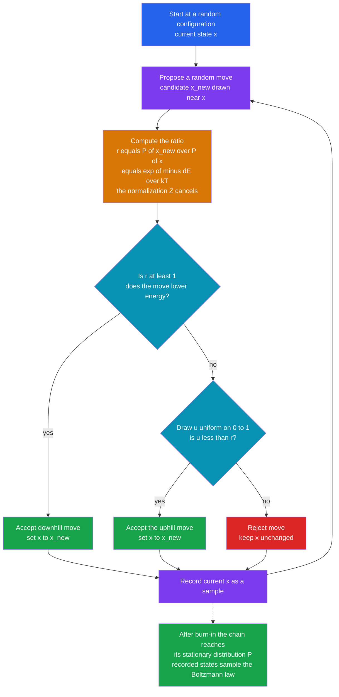

# 🎲 The Metropolis Algorithm and Markov-Chain Monte Carlo (MCMC)

> [!abstract] TL;DR
> Statistical and quantum physics need **averages over the Boltzmann distribution** $P \propto e^{-E/k_BT}$ across astronomically large configuration spaces (think $10^{23}$ spins), but you **cannot sample that distribution directly** — you cannot even compute its normalization (the partition function $Z$), and the probability piles up on a vanishingly tiny fraction of states, so naive uniform sampling is hopeless. **MCMC** solves this by building a **Markov chain** — a guided random walk through configuration space — whose *stationary distribution IS the target* $P$; the states it visits *are* samples from $P$. The **Metropolis algorithm** (1953) realizes this with one elegant rule: propose a random change, accept it always if it lowers the energy, or with probability $e^{-\Delta E/k_BT}$ if it raises it. Because only the **ratio** $P_{\text{new}}/P_{\text{old}}$ enters, the intractable $Z$ **cancels** — you can sample a distribution you can't even normalize. This single idea powers Ising-model and lattice simulations and, generalized to **Metropolis-Hastings**, became the engine of **Bayesian statistics and machine learning**.

## Intuition

**Analogy:** Imagine a hiker exploring a vast mountain landscape in thick fog. She wants to spend time in each spot *in proportion to how low (favorable) it is* — but she can only ever see her immediate surroundings, never a map. Her rule is simple: **always step downhill; step uphill only sometimes**, with a probability that shrinks the steeper the climb. If she wanders long enough, something magical happens — the fraction of time she spends at each altitude ends up *exactly matching* the Boltzmann distribution, even though she never measured the overall shape of the terrain. That is the Metropolis algorithm: a random walk cleverly rigged so that it samples any probability distribution you want, **even one you can't compute directly**.

The reason the fog doesn't stop her is that her uphill-acceptance rule only ever compares *two neighboring altitudes* — a local height *difference* — never an absolute reference. In physics that difference is $\Delta E$, and the "absolute reference" she never needs is the partition function $Z$. She samples the whole global distribution using only local information.

---

## How It Works

### The problem MC integration cannot solve

Ordinary Monte Carlo integration (the sibling note *Monte_Carlo_Integration*) throws **independent, uniformly random** points at a domain and averages. That works when the integrand is spread out. But a canonical-ensemble average

$$
\langle A \rangle = \frac{1}{Z}\sum_{\text{configs } c} A(c)\, e^{-E(c)/k_BT}, \qquad Z = \sum_c e^{-E(c)/k_BT}
$$

is different in two fatal ways. First, the sum runs over an astronomically large space — a modest $30 \times 30$ Ising lattice already has $2^{900}$ configurations, more than the atoms in the universe — so $Z$ is **uncomputable** and even one uniform pass is impossible. Second, the Boltzmann weight is **fiercely concentrated**: essentially all of the probability lives on a microscopic sliver of "typical" states, and uniform random configurations land in that sliver with probability $\approx 0$. Uniform sampling wastes every draw on states that contribute nothing.

### The MCMC idea

Instead of drawing independent samples, **build a Markov chain** — a random walk $c_0 \to c_1 \to c_2 \to \dots$ where each step depends only on the current state — engineered so that its **stationary (equilibrium) distribution equals the target $P$**. Run the chain and the states it visits *are* samples from $P$. This performs **importance sampling automatically**: the chain naturally lingers in high-probability regions in exactly the right proportion, spending its effort where the physics is, not on the empty vastness of configuration space. (See the sibling *Markov_Chains* note for stationary distributions and mixing.)

### The Metropolis rule

Metropolis, Rosenbluth, Rosenbluth, Teller, and Teller (1953) gave the recipe — routinely voted one of the top algorithms of the 20th century:

1. **Propose** a small random change to the current configuration (flip a spin, nudge a particle), giving a candidate $c'$.
2. **Compute** the energy change $\Delta E = E(c') - E(c)$.
3. **Accept** the move outright if $\Delta E \le 0$ (it lowers energy). If $\Delta E > 0$, accept it only with probability $e^{-\Delta E/k_BT}$; otherwise **reject** and keep the current state (recording it *again*).
4. **Repeat.** The sequence of states visited samples the Boltzmann distribution.

Compactly, the acceptance probability is $\alpha = \min\!\left(1,\ e^{-\Delta E/k_BT}\right)$.

### Why it works: detailed balance and ergodicity

The chain samples $P$ if it satisfies two conditions. **Detailed balance** — $P(c)\,T(c\to c') = P(c')\,T(c'\to c)$ for the transition kernel $T$ — makes the chain *reversible* with respect to $P$, which is a sufficient condition for $P$ to be stationary (probability flowing $c\to c'$ is balanced by flow $c'\to c$). The Metropolis acceptance rule is constructed precisely so that this holds. **Ergodicity** — the chain can eventually reach any state from any other (irreducible and aperiodic) — guarantees it *converges to* that unique stationary distribution rather than getting trapped. Together they prove the visited states sample $P$.

### The key trick: only ratios are needed

Look at what the acceptance rule actually uses:

$$
\frac{P(c')}{P(c)} = \frac{e^{-E(c')/k_BT}/Z}{e^{-E(c)/k_BT}/Z} = e^{-\Delta E/k_BT}.
$$

**The partition function $Z$ cancels.** Metropolis never needs the normalization — only the *ratio* of target probabilities, i.e. an energy *difference*. This is the crucial insight that makes statistical-physics simulation possible: you can sample a distribution you can only evaluate **up to an unknown constant**. The same fact is why MCMC later conquered Bayesian inference, where the posterior $P(\theta \mid \text{data}) \propto P(\text{data} \mid \theta)P(\theta)$ is known only up to an intractable evidence integral.

### Metropolis-Hastings: the general recipe

The original Metropolis rule assumes a **symmetric** proposal (proposing $c'$ from $c$ is as likely as the reverse). **Hastings (1970)** generalized it to *asymmetric* proposals by adding a correction factor:

$$
\alpha = \min\!\left(1,\ \frac{P(c')\,q(c \mid c')}{P(c)\,q(c' \mid c)}\right),
$$

where $q$ is the proposal density. The ratio $q(c\mid c')/q(c'\mid c)$ un-biases proposals that prefer one direction. This **Metropolis-Hastings** form is the general-purpose recipe for sampling *any* distribution known up to a constant, and it contains Gibbs sampling and many others as special cases.

### Flow / Architecture



---

## Key Concepts

### Secondary
- To find the *average* behavior of a huge collection of particles, you cannot check every arrangement — there are unimaginably many. So you **wander randomly** through arrangements with a smart rule.
- The rule: try a small change. If it makes the energy **lower**, keep it. If it makes the energy **higher**, keep it only *sometimes* — more rarely the bigger the increase.
- Wander long enough and the arrangements you visit occur in the right proportions all by themselves. The list of visited states is your sample.

### Undergraduate
- **The target is the Boltzmann distribution** $P(c) \propto e^{-E(c)/k_BT}$; the goal is estimating averages $\langle A\rangle$ over it.
- **Only ratios matter.** Metropolis needs $P(c')/P(c) = e^{-\Delta E/k_BT}$, so the partition function $Z$ never appears — you sample a distribution you cannot normalize.
- **Detailed balance** ($P(c)T(c\to c') = P(c')T(c'\to c)$) plus **ergodicity** are what guarantee the chain converges to $P$.
- **Practical hygiene:** discard an initial **burn-in** transient before the chain equilibrates; remember that **successive samples are correlated**, so the number of *effectively independent* samples is smaller than the number of steps.
- **Proposal step size** controls everything: too small crawls (high acceptance but tiny moves), too large is rejected constantly (few moves accepted). An acceptance rate around **50 percent** (roughly 20 to 50 percent in practice) is a good target for random-walk proposals.

### Graduate
- **Autocorrelation time** $\tau$ sets the cost: the effective sample size is $N_{\text{eff}} \approx N/(2\tau)$, and the Monte Carlo error scales as $\sqrt{2\tau/N}$. Estimating $\tau$ (integrated autocorrelation time) is essential for honest error bars.
- **Convergence diagnostics** — running multiple chains from dispersed starts and comparing within- to between-chain variance (Gelman-Rubin $\hat R$), trace inspection, and effective-sample-size estimates — guard against a chain that looks converged but has not explored the full space.
- **Critical slowing down.** Near a continuous **phase transition** the correlation length diverges, so local single-spin Metropolis updates decorrelate agonizingly slowly ($\tau \sim L^z$ with dynamical exponent $z \approx 2$). This motivated **cluster algorithms** (Swendsen-Wang 1987, Wolff 1989) that identify and flip whole correlated clusters at once, collapsing $z$ toward $0$ — a landmark advance for the *The_Ising_Model_and_Statistical_Physics* problem. (See *Phase_Transitions_and_Critical_Phenomena*.)
- **Modern gradient-informed samplers.** **Hamiltonian (Hybrid) Monte Carlo** augments the state with momentum and integrates Hamiltonian dynamics with a **leapfrog symplectic integrator** (linking directly to *Symplectic_Integrators_and_Hamiltonian_Dynamics*) to propose distant, high-acceptance moves; **NUTS** (No-U-Turn Sampler) auto-tunes the trajectory length. **Gibbs sampling** updates one coordinate at a time from its exact conditional. These are the workhorses inside **Stan** and **PyMC**.
- **Ergodicity failures** are the real-world danger: multimodal targets separated by high barriers can trap a chain in one mode for practically forever, giving a beautifully converged-looking but *wrong* answer. Tempering, parallel tempering, and cluster moves are remedies.

---

## Python Demo

```python
# Metropolis MCMC from scratch: numpy + matplotlib only.
#   (a) Sample an UNNORMALIZED target P(x) ~ exp(-beta V(x)) for a DOUBLE-WELL
#       potential V(x) = (x^2 - 1)^2, then overlay the sampled histogram on the
#       true (numerically normalized) PDF to show they match.
#   (b) Diagnostics: the random-walk TRACE (burn-in + mixing), the effect of
#       PROPOSAL STEP SIZE on the ACCEPTANCE RATE (the ~50% sweet spot), and
#       the AUTOCORRELATION between samples for small / good / large steps.
#   (c) A 2D correlated-Gaussian walk showing the chain exploring the density.
import numpy as np
import matplotlib.pyplot as plt

rng = np.random.default_rng(42)

# ---------------------------------------------------------------------------
# TARGET: Boltzmann weight of a symmetric DOUBLE-WELL  V(x) = (x^2 - 1)^2.
# We work with log P (unnormalized). We NEVER compute the normalization Z --
# Metropolis only needs the RATIO P(x')/P(x) = exp(logP(x') - logP(x)).
# ---------------------------------------------------------------------------
beta = 1.0
def V(x):        return (x**2 - 1.0)**2
def log_p(x):    return -beta * V(x)          # log of UNNORMALIZED target

def metropolis(log_p, x0, step, n):
    """1D random-walk Metropolis. Returns the chain and the acceptance rate."""
    x, lp = x0, log_p(x0)
    chain = np.empty(n)
    n_accept = 0
    for i in range(n):
        x_prop = x + rng.normal(0.0, step)            # symmetric Gaussian proposal
        lp_prop = log_p(x_prop)
        # accept with prob min(1, P'/P): log(u) < logP' - logP
        if np.log(rng.random()) < lp_prop - lp:
            x, lp = x_prop, lp_prop
            n_accept += 1
        chain[i] = x                                   # record even on rejection
    return chain, n_accept / n

# ---------- (a) sample the double well and compare to the true PDF ----------
n_steps = 200_000
chain, acc = metropolis(log_p, x0=0.0, step=1.0, n=n_steps)
burn = 2_000
samples = chain[burn:]                                 # discard burn-in transient
print(f"(a) step=1.0  acceptance rate = {acc:.2f}")

xs = np.linspace(-2.5, 2.5, 600)                        # true normalized PDF for overlay
pdf = np.exp(log_p(xs))
pdf /= np.sum(pdf) * (xs[1] - xs[0])                    # numerical Z (comparison only)

# ---------- (b1) acceptance rate vs proposal step size ----------------------
steps_scan = np.array([0.05, 0.15, 0.4, 1.0, 2.5, 6.0, 15.0])
acc_scan = np.array([metropolis(log_p, 0.0, s, 20_000)[1] for s in steps_scan])
for s, a in zip(steps_scan, acc_scan):
    print(f"    step={s:5.2f}  ->  acceptance={a:.2f}")

# ---------- (b2) autocorrelation for small / good / large step --------------
def autocorr(x, maxlag):
    x = x - x.mean()
    var = np.dot(x, x) / len(x)
    return np.array([np.dot(x[:len(x)-k], x[k:]) / (len(x) - k)
                     for k in range(maxlag)]) / var

lag = 400
labels = {"too small (step=0.15)": 0.15, "good (step=1.5)": 1.5, "too large (step=12)": 12.0}
acorrs = {name: autocorr(metropolis(log_p, 0.0, s, 60_000)[0][burn:], lag)
          for name, s in labels.items()}

# ---------- (c) 2D correlated-Gaussian Metropolis walk ----------------------
cov = np.array([[1.0, 0.85], [0.85, 1.0]])
inv_cov = np.linalg.inv(cov)
def log_p2(v):
    return -0.5 * v @ inv_cov @ v
def metropolis2d(x0, step, n):
    x, lp = x0.copy(), log_p2(x0)
    chain = np.empty((n, 2)); nacc = 0
    for i in range(n):
        xp = x + rng.normal(0.0, step, size=2)
        lpp = log_p2(xp)
        if np.log(rng.random()) < lpp - lp:
            x, lp, = xp, lpp; nacc += 1
        chain[i] = x
    return chain, nacc / n
chain2, acc2 = metropolis2d(np.array([4.0, -4.0]), step=0.75, n=30_000)  # far start
print(f"(c) 2D walk acceptance = {acc2:.2f}  (note the burn-in path from the corner)")

# ---------- plots -----------------------------------------------------------
fig, ax = plt.subplots(2, 3, figsize=(16, 9))

# (1) histogram vs true PDF
ax[0, 0].hist(samples, bins=120, density=True, color="#2563eb", alpha=0.55,
              label="Metropolis samples")
ax[0, 0].plot(xs, pdf, color="#dc2626", lw=2.2, label="true P(x) ~ exp(-beta V)")
ax[0, 0].set_title("(a) Sampled histogram matches the target")
ax[0, 0].set_xlabel("x"); ax[0, 0].set_ylabel("density"); ax[0, 0].legend(fontsize=8)

# (2) trace: burn-in + mixing between the two wells
ax[0, 1].plot(chain[:4000], color="#7c3aed", lw=0.6)
ax[0, 1].axvspan(0, burn, color="gray", alpha=0.25, label="burn-in (discarded)")
ax[0, 1].axhline(1, color="k", ls=":", lw=0.8); ax[0, 1].axhline(-1, color="k", ls=":", lw=0.8)
ax[0, 1].set_title("(b) Trace: random walk hopping between wells")
ax[0, 1].set_xlabel("step"); ax[0, 1].set_ylabel("x"); ax[0, 1].legend(fontsize=8)

# (3) acceptance rate vs step size
ax[0, 2].semilogx(steps_scan, acc_scan, "o-", color="#d97706")
ax[0, 2].axhspan(0.2, 0.5, color="#16a34a", alpha=0.18, label="~20-50% sweet spot")
ax[0, 2].set_title("(b) Acceptance rate vs proposal step")
ax[0, 2].set_xlabel("proposal step size"); ax[0, 2].set_ylabel("acceptance rate")
ax[0, 2].legend(fontsize=8); ax[0, 2].grid(alpha=0.3, which="both")

# (4) autocorrelation
colors = ["#dc2626", "#16a34a", "#2563eb"]
for (name, ac), c in zip(acorrs.items(), colors):
    ax[1, 0].plot(ac, color=c, lw=1.6, label=name)
ax[1, 0].axhline(0, color="k", lw=0.6)
ax[1, 0].set_title("(b) Autocorrelation: how fast samples decorrelate")
ax[1, 0].set_xlabel("lag (steps)"); ax[1, 0].set_ylabel("autocorrelation")
ax[1, 0].legend(fontsize=8); ax[1, 0].grid(alpha=0.3)

# (5) 2D density explored by the walk
ax[1, 1].plot(chain2[:, 0], chain2[:, 1], color="#0891b2", lw=0.25, alpha=0.6)
ax[1, 1].plot(chain2[0, 0], chain2[0, 1], "s", color="#dc2626", ms=8, label="start (corner)")
ax[1, 1].set_title("(c) 2D walk exploring a correlated Gaussian")
ax[1, 1].set_xlabel("x"); ax[1, 1].set_ylabel("y"); ax[1, 1].legend(fontsize=8)
ax[1, 1].set_aspect("equal")

# (6) 2D marginal histogram after burn-in
post = chain2[2000:]
ax[1, 2].hist2d(post[:, 0], post[:, 1], bins=60, cmap="magma")
ax[1, 2].set_title("(c) 2D samples after burn-in")
ax[1, 2].set_xlabel("x"); ax[1, 2].set_ylabel("y"); ax[1, 2].set_aspect("equal")

plt.tight_layout(); plt.show()
```

Running it prints an acceptance rate near **0.7** for `step=1.0` and shows the histogram of samples sitting almost perfectly on the true double-well PDF — even though `Z` was never used in the sampler. The step-size scan makes the trade-off concrete: tiny steps accept nearly everything but barely move (slow mixing), huge steps are rejected almost always, and the useful regime sits in the shaded **20 to 50 percent** band. The autocorrelation panel shows the payoff of good tuning: the well-chosen step decorrelates in a few dozen lags, while the too-small and too-large steps stay correlated for hundreds of steps, meaning far fewer *effectively independent* samples per unit work. The trace panel shows the chain physically hopping between the two wells (the rare barrier crossings are exactly the "uphill" moves the acceptance rule occasionally permits), and the 2D panels show a chain launched from a far corner *walking in* through a visible burn-in path before settling into the correct tilted-Gaussian cloud.

---

## Real-World Applications

> **Example:** The **2D Ising model** — the canonical testbed of computational statistical physics — is simulated almost universally with Metropolis: propose flipping one spin, compute $\Delta E$ from its four neighbors, accept with $\min(1, e^{-\Delta E/k_BT})$. Sweep the lattice millions of times and the magnetization, susceptibility, and specific heat emerge as simple averages over the visited configurations, reproducing Onsager's exact critical temperature. Near $T_c$, local Metropolis suffers **critical slowing down**, which is exactly why the **Wolff and Swendsen-Wang cluster algorithms** were invented — they flip whole correlated domains and mix far faster. (See the sibling *The_Ising_Model_and_Statistical_Physics*.)

- **Lattice statistical physics and field theory.** Ising, Potts, Heisenberg, and lattice QCD simulations all rest on Metropolis / heat-bath / cluster updates to sample Boltzmann or path-integral weights over enormous configuration spaces.
- **Bayesian statistics and ML — the huge reach.** MCMC is *the* workhorse of Bayesian inference: it samples posterior distributions known only up to the evidence constant. Modern probabilistic programming (**Stan**, **PyMC**, **NumPyro**) ships **Hamiltonian Monte Carlo** and **NUTS** as defaults; **Gibbs sampling** underlies classic LDA topic models and hierarchical Bayesian models. The same 1953 algorithm bridges physics and statistics. (Connects to *Bayesian_Statistics* and *Machine_Learning_in_Computational_Physics*.)
- **Molecular simulation and chemistry.** Metropolis Monte Carlo samples molecular configurations for free-energy calculations, protein-folding landscapes, and adsorption/phase equilibria (grand-canonical MC), complementing molecular dynamics.
- **Optimization via simulated annealing.** Slowly lowering the "temperature" in a Metropolis walk turns sampling into global optimization — escaping local minima by occasionally accepting uphill moves — used in circuit placement, scheduling, and the traveling-salesman problem.
- **Computational biology and cosmology.** Phylogenetic tree inference (MrBayes, BEAST) and cosmological parameter estimation from CMB/large-scale-structure data (CosmoMC) both explore high-dimensional posteriors with Metropolis-Hastings variants.

---

## Common Pitfalls

- **Not discarding burn-in** — including the initial transient before the chain has reached its stationary distribution biases every estimate. Always throw away the equilibration phase (and check *where* it ends by inspecting the trace), as the 2D demo makes visible with its walk-in from the corner.
- **Treating correlated samples as independent** — successive states are strongly autocorrelated, so naive error bars (using $N$ instead of $N_{\text{eff}} \approx N/2\tau$) are wildly overconfident. Estimate the autocorrelation time and thin or correct accordingly.
- **Mistuned proposal step size** — too small gives a high acceptance rate but glacial exploration; too large is rejected almost always and the chain sits still. Both *look* like they are running while barely sampling. Tune toward the roughly 20 to 50 percent acceptance band and watch the autocorrelation, not just the acceptance number.
- **Broken ergodicity / trapped chains** — a multimodal target with high barriers (or a phase-coexistence region) can trap the chain in one mode essentially forever, producing a smooth, converged-*looking* but flatly wrong answer. Run multiple dispersed chains, use tempering/parallel tempering or cluster moves, and never trust a single chain.
- **Critical slowing down ignored** — near a phase transition, local single-site updates have autocorrelation times that blow up with system size; results look noisy no matter how long you run. Switch to cluster algorithms (Wolff/Swendsen-Wang) built for that regime.
- **Forgetting the Hastings correction** — with an *asymmetric* proposal, using the plain Metropolis rule (dropping the $q(c\mid c')/q(c'\mid c)$ factor) samples the *wrong* distribution. Only symmetric proposals may omit it.
- **Recording only accepted moves** — you must record the current state on *every* step, including rejections (the state repeats). Skipping rejected steps distorts the sampled distribution.

---

## Related Concepts

- [[Markov_Chains]] — MCMC is a Markov chain engineered so its stationary distribution is the target; this note supplies transition kernels, stationarity, and mixing.
- [[Classical_Statistical_Mechanics]] — the source of the Boltzmann distribution $P \propto e^{-E/k_BT}$ and partition function $Z$ that Metropolis samples without ever computing $Z$.
- [[Quantum_Statistical_Mechanics]] — quantum canonical ensembles and path-integral Monte Carlo extend the same sampling machinery to quantum systems.
- [[Entropy_and_Second_Law]] — the entropy/free-energy landscape whose Boltzmann weighting the algorithm reproduces state-by-state.
- [[Phase_Transitions_and_Critical_Phenomena]] — diverging correlation lengths cause critical slowing down, motivating cluster algorithms.
- [[Bayesian_Statistics]] — MCMC's second home: sampling posteriors known only up to the evidence, exactly the "ratios only" trick.
- [[Hamiltonian_Mechanics]] — Hamiltonian Monte Carlo proposes moves by integrating Hamiltonian dynamics, borrowing momentum and symplectic structure.
- [[Numerical_Integration]] — deterministic quadrature that MCMC replaces once dimensions and concentration make grids hopeless.
- [[Probability_Theory]] — the distributions, expectations, and convergence notions underlying the whole method.
- [[Common_Probability_Distributions]] — the Gaussian proposals and target densities used throughout.
- [[Maximum_Entropy_Principle]] — the Boltzmann form $e^{-\beta E}$ is itself the max-entropy distribution at fixed mean energy.
- [[Chaos_and_Nonlinear_Dynamics_Numerically]] — sister topic on stochastic vs deterministic exploration of state space.
- [[Computational_Physics_Overview]] — the map of the vault this Monte Carlo note belongs to.

---

## Review Questions

1. **(Secondary/Undergraduate)** In one or two sentences, why can we sample the Boltzmann distribution with Metropolis even though we can never compute the partition function $Z$? Which quantity in the acceptance rule lets $Z$ disappear?
2. **(Undergraduate)** You run a Metropolis sampler and get a 98 percent acceptance rate. Is that good? Explain what it implies about your proposal step size, your mixing, and your autocorrelation time, and what you would change.
3. **(Undergraduate/Graduate)** State the detailed-balance condition and explain in words why it, together with ergodicity, guarantees the chain converges to the target distribution $P$. What goes wrong if ergodicity fails for a bimodal target?
4. **(Graduate)** Near a continuous phase transition, a local single-spin Metropolis simulation of the Ising model mixes catastrophically slowly. Name the phenomenon, explain its origin in terms of correlation length and autocorrelation time, and describe the class of algorithms that fixes it and why they work.
5. **(Graduate)** Compare random-walk Metropolis-Hastings with Hamiltonian Monte Carlo for a high-dimensional, strongly correlated posterior. Why does HMC typically achieve far lower autocorrelation, and what role does a symplectic integrator play in keeping its acceptance rate high?

---

## Sources

- Metropolis, N., Rosenbluth, A. W., Rosenbluth, M. N., Teller, A. H., & Teller, E., "Equation of State Calculations by Fast Computing Machines", *Journal of Chemical Physics* 21 (1953), 1087–1092.
- Hastings, W. K., "Monte Carlo Sampling Methods Using Markov Chains and Their Applications", *Biometrika* 57 (1970), 97–109.
- Newman, M. E. J. & Barkema, G. T., *Monte Carlo Methods in Statistical Physics* (Oxford University Press, 1999).
- Gelman, A., Carlin, J. B., Stern, H. S., Dunson, D. B., Vehtari, A., & Rubin, D. B., *Bayesian Data Analysis*, 3rd ed. (CRC Press, 2013), chapters 11–12.
- Neal, R. M., "MCMC using Hamiltonian dynamics", in *Handbook of Markov Chain Monte Carlo* (Chapman & Hall/CRC, 2011), arXiv:1206.1901.

---

#computational-physics #metropolis #MCMC #markov-chain-monte-carlo #detailed-balance
