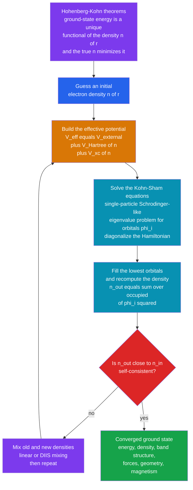

# ⚛️ Density Functional Theory and Electronic Structure

> [!abstract] TL;DR
> Predicting the properties of any atom, molecule, or material means solving quantum mechanics for its **electrons** — but the many-electron wavefunction $\Psi(\mathbf{r}_1,\dots,\mathbf{r}_N)$ lives in **$3N$ dimensions**, so its cost explodes exponentially and even a modest molecule is hopeless (the curse of dimensionality of numerical quantum mechanics). **Density Functional Theory (DFT)** performs a near-miraculous **dimensional collapse**: the **Hohenberg-Kohn theorems** (1964) prove that the ground-state energy is a unique *functional of the electron density* $n(\mathbf{r})$ — a simple cloud in ordinary **3D space** — so the density secretly encodes *everything*. The **Kohn-Sham scheme** (1965) makes this practical by mapping the hard **interacting** electron system onto a fictitious set of **non-interacting** electrons moving in an **effective potential** that reproduces the same density; you solve Schrödinger-like single-particle eigenvalue equations and iterate to **self-consistency (the SCF loop)**. All the many-body quantum difficulty is bundled into one **unknown exchange-correlation functional** that must be **approximated** (LDA, GGA/PBE, hybrids/B3LYP). This turned quantum prediction of real materials from impossible into *routine*, won the **1998 Nobel Prize in Chemistry** (Kohn & Pople), and — fused with machine learning — now drives the discovery of new materials, drugs, and catalysts.

## Intuition

**Analogy:** To predict a material's properties from first principles you would need the full quantum **wavefunction of all its electrons** — but that wavefunction is a *monster*. For even a small molecule it lives in a space of thousands of dimensions (three coordinates per electron, and electrons number in the dozens to hundreds), so writing it down, let alone computing it, is utterly impossible: adding one electron multiplies the cost. Density Functional Theory pulls off an escape act that sounds too good to be true. It **proves you can throw the monstrous wavefunction away** and work instead with just the **electron density** $n(\mathbf{r})$ — a single scalar cloud in plain 3D space telling you how much electron charge sits at each point — because that humble density *secretly encodes the entire ground state*. A quantity of three variables replaces a quantity of thousands. This dimensional collapse is what turned the quantum prediction of real materials from a fantasy into a daily workhorse, and it earned a Nobel Prize.

The trade is subtle: the density knows everything *in principle* (Hohenberg-Kohn), but the exact rule mapping density to energy contains one piece — the **exchange-correlation** energy, where all the genuinely hard many-body physics hides — that nobody can write down exactly. DFT's entire practical story is the art of *approximating that one term well enough* while keeping the 3D simplicity.

---

## How It Works

### The electronic-structure problem

Almost every property you care about — a molecule's shape and binding energy, a reaction barrier, whether a crystal is a metal or insulator, its magnetism, its color, its catalytic surface — is set by the **electrons**. Fix the nuclei (the Born-Oppenheimer approximation) and the electrons obey the time-independent many-electron Schrödinger equation

$$
\hat{H}\,\Psi = \left[ -\tfrac{1}{2}\sum_i \nabla_i^2 \;+\; \sum_i v_{\text{ext}}(\mathbf{r}_i) \;+\; \sum_{i<j}\frac{1}{|\mathbf{r}_i-\mathbf{r}_j|} \right]\Psi = E\,\Psi,
$$

in atomic units. The wavefunction $\Psi(\mathbf{r}_1,\dots,\mathbf{r}_N)$ depends on **$3N$ spatial coordinates** (plus spin). Represent it on a modest grid of $M$ points per axis and the storage is $M^{3N}$ — for 10 electrons on a coarse $10$-point grid that is $10^{30}$ numbers. This is the **curse of dimensionality** that makes brute-force numerical quantum mechanics (the sibling note *Numerical_Quantum_Mechanics*) hopeless beyond a few particles, and the culprit is the **electron-electron repulsion** term $\tfrac{1}{|\mathbf{r}_i-\mathbf{r}_j|}$, which correlates every electron with every other and forbids clean separation of variables. This intractability is the central challenge of quantum chemistry and computational materials science.

### The key idea: density instead of wavefunction

DFT's revolutionary insight is that you do not need $\Psi$ at all. The **ground-state electron density**

$$
n(\mathbf{r}) = N\!\int |\Psi(\mathbf{r},\mathbf{r}_2,\dots,\mathbf{r}_N)|^2 \, d\mathbf{r}_2\cdots d\mathbf{r}_N
$$

is a function of just **three** spatial coordinates and integrates to the electron count $N$. Replacing the $3N$-dimensional wavefunction by this 3D scalar field is a dramatic **dimensional collapse** — and it is what makes real materials computable.

### The Hohenberg-Kohn theorems (1964)

Hohenberg and Kohn put this idea on a rigorous foundation with two theorems:

1. **The density determines everything.** The ground-state density $n(\mathbf{r})$ *uniquely* determines the external potential $v_{\text{ext}}$ (up to a constant), and hence the Hamiltonian, and hence *all* ground-state properties. So there exists a universal **energy functional** $E[n]$ whose value at the true density is the ground-state energy. The density is a legitimate, complete variable — no information is lost by discarding $\Psi$.
2. **A variational principle in the density.** For any trial density, $E[n] \ge E_0$, with equality only for the true ground-state density. So the true density **minimizes** the energy functional. This converts the whole problem into: *find the density that minimizes $E[n]$*.

The functional splits as $E[n] = T[n] + \int v_{\text{ext}}\,n\,d\mathbf{r} + E_{ee}[n]$, but the **kinetic** $T[n]$ and **electron-electron** $E_{ee}[n]$ pieces have no known exact expression in terms of $n$ alone — which is why the theorems, though profound, are not directly usable. That gap is what Kohn and Sham closed.

### The Kohn-Sham scheme (1965) — the practical breakthrough

The masterstroke: **map the hard interacting system onto a fictitious system of non-interacting electrons** chosen so that it has the **same density** $n(\mathbf{r})$ as the real interacting system. Non-interacting electrons occupy single-particle orbitals $\phi_i$ that satisfy Schrödinger-like **Kohn-Sham equations**:

$$
\left[ -\tfrac{1}{2}\nabla^2 + v_{\text{eff}}(\mathbf{r}) \right]\phi_i(\mathbf{r}) = \varepsilon_i\,\phi_i(\mathbf{r}), \qquad n(\mathbf{r}) = \sum_{i \in \text{occ}} |\phi_i(\mathbf{r})|^2 .
$$

This is an ordinary eigenvalue problem (the sibling *Eigenvalue_Problems_in_Physics*), one electron at a time, solved with the numerical-linear-algebra machinery of diagonalization. The **effective potential** carries all the physics:

$$
v_{\text{eff}}(\mathbf{r}) = \underbrace{v_{\text{ext}}(\mathbf{r})}_{\text{nuclei}} + \underbrace{\int \frac{n(\mathbf{r}')}{|\mathbf{r}-\mathbf{r}'|}\,d\mathbf{r}'}_{\text{Hartree (classical repulsion)}} + \underbrace{v_{\text{xc}}(\mathbf{r})}_{\text{exchange-correlation}} .
$$

The genius is that the *entire* many-body difficulty — everything the simple non-interacting kinetic energy and the classical Hartree repulsion miss — is **bundled into one term**, the exchange-correlation potential $v_{\text{xc}} = \delta E_{\text{xc}}/\delta n$. If we knew $E_{\text{xc}}[n]$ exactly, Kohn-Sham DFT would be **exact**.

### The exchange-correlation functional — the crux and the approximation

We do *not* know $E_{\text{xc}}[n]$ exactly, so it must be **approximated**. This single choice is where DFT's accuracy lives and dies — the art and the limitation. The historical "**Jacob's ladder**" of ever-more-sophisticated rungs:

- **LDA (Local Density Approximation).** Assume $E_{\text{xc}}$ at each point depends only on the *local* density there, borrowing the exchange-correlation energy per electron of the **uniform electron gas** — a quantity computed to high precision by **quantum Monte Carlo** (the sibling *The_Variational_and_Diffusion_Monte_Carlo*). Remarkably good for many solids despite its crudeness.
- **GGA (Generalized Gradient Approximation).** Also use the density *gradient* $\nabla n$ to sense inhomogeneity. **PBE** (Perdew-Burke-Ernzerhof) is the workhorse for solids.
- **Hybrids.** Mix in a fraction of *exact* (Hartree-Fock) exchange. **B3LYP** dominates molecular quantum chemistry; **HSE** improves solid band gaps.
- Higher rungs (meta-GGA like **SCAN**, double hybrids) climb toward chemical accuracy at rising cost.

### The self-consistent-field (SCF) loop — how it is actually solved

Here is the chicken-and-egg problem: the effective potential $v_{\text{eff}}$ depends on the density $n$; but $n$ is built from the orbitals $\phi_i$; and the orbitals come from diagonalizing the Hamiltonian *built from* $v_{\text{eff}}$. Potential $\to$ orbitals $\to$ density $\to$ potential — a closed loop. The resolution is **iteration to a fixed point**:

1. **Guess** an initial density $n(\mathbf{r})$.
2. **Build** $v_{\text{eff}}[n]$ (external + Hartree + exchange-correlation).
3. **Solve** the Kohn-Sham equations (diagonalize) for orbitals $\phi_i$ and energies $\varepsilon_i$.
4. **Fill** the lowest orbitals and **recompute** the density $n_{\text{out}} = \sum_{\text{occ}}|\phi_i|^2$.
5. **Compare.** If $n_{\text{out}} \approx n_{\text{in}}$ the density is **self-consistent** — stop. Otherwise **mix** the old and new densities and return to step 2.

This is the computational **heart** of every electronic-structure code. Naive feedback ($n \leftarrow n_{\text{out}}$) oscillates or diverges (charge sloshing), so convergence is accelerated with **linear mixing** ($n \leftarrow (1-\beta)n_{\text{in}} + \beta\,n_{\text{out}}$) or, far better, **DIIS / Pulay mixing** and Broyden schemes that extrapolate from the history of residuals.

### Basis sets, codes, and scaling

Orbitals must be represented numerically. Two great families: **plane waves** (delocalized, natural for **periodic solids**, paired with **pseudopotentials** that replace chemically inert core electrons by a smooth effective potential) — used by **VASP** and **Quantum ESPRESSO**; and **localized/Gaussian orbitals** centered on atoms (natural for **molecules**) — used by **Gaussian** and **NWChem**. Standard DFT scales as $\mathcal{O}(N^3)$ with system size (dominated by orthogonalization / diagonalization), which caps routine calculations at hundreds to a few thousand atoms; **linear-scaling** $\mathcal{O}(N)$ methods exploit the locality ("nearsightedness") of the density matrix for much larger systems.

### Flow / Architecture



---

## Key Concepts

### Secondary
- To know how a material behaves, you must know what its **electrons** are doing. But tracking every electron's wave at once is impossibly complicated — the difficulty explodes as you add electrons.
- The clever trick: instead of the full quantum wave, keep only the **electron density** — a simple cloud showing where the electrons pile up in ordinary 3D space. It turns out this cloud is enough to determine everything.
- To find that cloud, you **guess it, use it to compute the forces the electrons feel, redo the electrons, and get a new cloud — then repeat until the cloud stops changing** (self-consistency). That loop is how the answer is found.

### Undergraduate
- **The intractability:** the many-electron wavefunction depends on $3N$ coordinates; cost scales exponentially in $N$ because electron-electron repulsion couples all electrons.
- **Hohenberg-Kohn (1964):** (1) the ground-state density $n(\mathbf{r})$ determines the Hamiltonian and all properties, so $E[n]$ exists; (2) the true density **minimizes** $E[n]$ (a variational principle in 3D density instead of $3N$-D wavefunction).
- **Kohn-Sham (1965):** replace interacting electrons by non-interacting ones in an effective potential $v_{\text{eff}} = v_{\text{ext}} + v_{\text{Hartree}} + v_{\text{xc}}$ reproducing the same density; solve single-particle Schrödinger-like equations for orbitals $\phi_i$.
- **Exchange-correlation** $v_{\text{xc}}$ holds all the hard many-body physics and is **approximated** — LDA (uniform electron gas), GGA (adds gradient, e.g. PBE), hybrids (add exact exchange, e.g. B3LYP).
- **SCF loop:** guess density $\to$ build potential $\to$ diagonalize for orbitals $\to$ new density $\to$ repeat to a **fixed point**; use mixing to converge.
- Kohn-Sham eigenvalues $\varepsilon_i$ are *auxiliary* — they are not, in general, true removal energies (only the highest occupied one is exact for the exact functional), and the **band gap** they predict is systematically too small.

### Graduate
- **The XC functional is the whole game.** LDA borrows $\epsilon_{\text{xc}}^{\text{unif}}(n)$ from quantum Monte Carlo simulations of the electron gas (Ceperley-Alder). GGAs (PBE) restore gradient dependence; meta-GGAs (SCAN) add the kinetic-energy density; hybrids mix a fraction $a$ of exact exchange, formally justified by the **adiabatic connection**. Jacob's ladder trades accuracy for cost.
- **The band-gap problem** stems from the **derivative discontinuity** of $E_{\text{xc}}$ at integer particle number, which LDA/GGA lack; this, plus **self-interaction error** (an electron spuriously repelling itself through the Hartree term), causes gap underestimation and over-delocalization.
- **Strong correlation fails.** Mott insulators, transition-metal oxides, and $f$-electron systems break semi-local DFT. Remedies: **DFT+U** (an on-site Hubbard penalty), **hybrids**, **dynamical mean-field theory (DMFT)**, and beyond-DFT many-body methods.
- **Total energy and forces.** $E_{\text{tot}} = \sum_i \varepsilon_i - E_{\text{Hartree}} + \big(E_{\text{xc}} - \int v_{\text{xc}} n\big) + E_{\text{nuc-nuc}}$ (the eigenvalue sum double-counts electron-electron terms, corrected here). The **Hellmann-Feynman theorem** gives atomic forces $-\partial E/\partial \mathbf{R}$ almost for free, enabling geometry optimization and *ab initio* molecular dynamics (the sibling *Molecular_Dynamics_Simulation*).
- **Numerics:** plane-wave energy cutoffs, $k$-point Brillouin-zone sampling, pseudopotentials/PAW, smearing for metals, and $\mathcal{O}(N^3)$ diagonalization vs $\mathcal{O}(N)$ linear-scaling. Convergence acceleration via **Pulay/DIIS** and Broyden mixing is essential for robust SCF.

---

## Python Demo

```python
# ---------------------------------------------------------------------------
# The SELF-CONSISTENT FIELD (SCF) idea at the heart of DFT / electronic structure.
#
# We solve a 1D pedagogical "atom": N_e electrons bound to a nucleus, treated
# in a Kohn-Sham-LIKE mean-field. The whole point is the FIXED-POINT LOOP:
#
#     guess density n(x)
#        -> build effective potential  V_eff = V_ext + V_Hartree[n] + V_xc[n]
#        -> solve the single-particle Schrodinger eq (DIAGONALIZE on a grid)
#        -> fill the lowest orbitals -> recompute density n_out
#        -> MIX and REPEAT until n stops changing (SELF-CONSISTENCY).
#
# We use a soft-Coulomb interaction (standard 1D model) and an illustrative
# LDA-type local exchange V_xc = -alpha * n^(1/3). numpy + matplotlib only.
# NOTE: model units, not real DFT -- it exposes the ALGORITHM, not chemistry.
# ---------------------------------------------------------------------------
import numpy as np
import matplotlib.pyplot as plt

# ---- grid and model parameters --------------------------------------------
L, N   = 10.0, 401
x      = np.linspace(-L, L, N)
dx     = x[1] - x[0]
a_soft = 1.0        # soft-Coulomb softening (avoids 1/0 singularity)
Z      = 4.0        # nuclear charge (external attraction)
occ    = [2, 2]     # closed shell: 2 electrons in each of the 2 lowest orbitals
N_e    = sum(occ)   # 4 electrons (neutral "atom")
alpha  = 1.0        # illustrative LDA-type exchange strength
mixing = 0.30       # linear density mixing (damps charge sloshing)
tol, max_iter = 1e-6, 80

# External potential: soft-Coulomb well of the nucleus at the origin
V_ext = -Z / np.sqrt(x**2 + a_soft**2)

# Soft-Coulomb kernel for the Hartree (classical mean-field) repulsion:
#   V_H(x_i) = sum_j n(x_j) * dx / sqrt((x_i - x_j)^2 + a^2)
Xi, Xj = np.meshgrid(x, x, indexing="ij")
K = dx / np.sqrt((Xi - Xj)**2 + a_soft**2)

# Kinetic operator  T = -1/2 d^2/dx^2  via a 3-point finite difference
main = np.full(N,     1.0 / dx**2)
offd = np.full(N - 1, -0.5 / dx**2)
T = np.diag(main) + np.diag(offd, 1) + np.diag(offd, -1)

def solve_ks(V_eff):
    """Diagonalize H = T + diag(V_eff); return energies and grid-normalized orbitals."""
    eps, phi = np.linalg.eigh(T + np.diag(V_eff))
    phi = phi / np.sqrt(dx)                 # so that sum |phi|^2 dx = 1
    return eps, phi

def density(phi):
    n = np.zeros(N)
    for i, f in enumerate(occ):
        n += f * phi[:, i]**2               # occupied orbitals, weighted by filling
    return n

def total_energy(eps, n, V_H):
    """KS total energy with Hartree + xc double-counting corrections removed."""
    band   = sum(f * eps[i] for i, f in enumerate(occ))    # sum of occupied eps
    E_H_dc = -0.5 * np.sum(n * V_H) * dx                   # -1/2 int n V_H
    E_xc_dc = (alpha / 4.0) * np.sum(np.cbrt(n) * n) * dx  # +alpha/4 int n^(4/3)
    return band + E_H_dc + E_xc_dc

# ---- initial guess: a normalized Gaussian holding N_e electrons -----------
n = np.exp(-x**2 / 4.0)
n *= N_e / (np.sum(n) * dx)

energies, residuals, snapshots = [], [], [n.copy()]
for it in range(max_iter):
    V_H   = K @ n                            # Hartree potential from current density
    V_xc  = -alpha * np.cbrt(n)              # illustrative local (LDA-type) exchange
    V_eff = V_ext + V_H + V_xc
    eps, phi = solve_ks(V_eff)               # <-- the eigenvalue solve
    n_out = density(phi)
    E     = total_energy(eps, n, V_H)        # energy of the INPUT density
    res   = np.max(np.abs(n_out - n))        # SCF residual = how self-consistent we are
    energies.append(E); residuals.append(res)
    n = (1 - mixing) * n + mixing * n_out    # DENSITY MIXING (the SCF update)
    snapshots.append(n.copy())
    if res < tol:
        print(f"SCF converged in {it + 1} iterations   (residual = {res:.2e})")
        break

print(f"Converged total energy     E = {energies[-1]:.5f}   (model units)")
print(f"Occupied orbital energies  eps = {np.round(eps[:len(occ)], 4)}")
print(f"Electron count  int n dx = {np.sum(n) * dx:.4f}   (should be {N_e})")

# ---- final self-consistent quantities for plotting ------------------------
V_H   = K @ n
V_xc  = -alpha * np.cbrt(n)
V_eff = V_ext + V_H + V_xc

# ===========================================================================
# PLOTS: SCF convergence (energy + residual), density evolution, and the
# converged orbitals / density / potential decomposition.
# ===========================================================================
fig, ax = plt.subplots(2, 3, figsize=(16, 9))

# (1) SCF energy convergence
it_axis = np.arange(1, len(energies) + 1)
ax[0, 0].plot(it_axis, energies, "o-", color="#2563eb")
ax[0, 0].set_title("(1) SCF energy converging to the ground state")
ax[0, 0].set_xlabel("SCF iteration"); ax[0, 0].set_ylabel("total energy")
ax[0, 0].grid(alpha=0.3)

# (2) density residual (self-consistency error) on a log scale
ax[0, 1].semilogy(it_axis, residuals, "s-", color="#dc2626")
ax[0, 1].axhline(tol, color="k", ls=":", lw=1, label="tolerance")
ax[0, 1].set_title("(2) Density residual -> self-consistency")
ax[0, 1].set_xlabel("SCF iteration"); ax[0, 1].set_ylabel("max |n_out - n_in|")
ax[0, 1].legend(fontsize=8); ax[0, 1].grid(alpha=0.3, which="both")

# (3) density evolving from the guess to the converged solution
cmap = plt.cm.viridis(np.linspace(0.15, 0.9, len(snapshots)))
for k, (ns, c) in enumerate(zip(snapshots, cmap)):
    lw = 2.4 if k in (0, len(snapshots) - 1) else 0.8
    ax[0, 2].plot(x, ns, color=c, lw=lw)
ax[0, 2].plot([], [], color=cmap[0], lw=2.4, label="initial guess")
ax[0, 2].plot([], [], color=cmap[-1], lw=2.4, label="converged")
ax[0, 2].set_title("(3) Electron density n(x) evolving over SCF steps")
ax[0, 2].set_xlabel("x"); ax[0, 2].set_ylabel("density n(x)")
ax[0, 2].legend(fontsize=8); ax[0, 2].set_xlim(-6, 6)

# (4) effective-potential decomposition
ax[1, 0].plot(x, V_ext, color="#7c3aed", lw=1.8, label="V_ext (nucleus)")
ax[1, 0].plot(x, V_H,   color="#d97706", lw=1.8, label="V_Hartree")
ax[1, 0].plot(x, V_xc,  color="#16a34a", lw=1.8, label="V_xc (exchange)")
ax[1, 0].plot(x, V_eff, color="#111827", lw=2.6, label="V_eff (total)")
ax[1, 0].set_title("(4) Kohn-Sham effective potential = sum of pieces")
ax[1, 0].set_xlabel("x"); ax[1, 0].set_ylabel("potential")
ax[1, 0].legend(fontsize=8); ax[1, 0].set_xlim(-6, 6)

# (5) converged Kohn-Sham orbitals
for i, col in zip(range(len(occ)), ["#2563eb", "#dc2626"]):
    ax[1, 1].plot(x, phi[:, i] + eps[i], color=col, lw=1.8,
                  label=f"phi_{i}  (eps={eps[i]:.2f})")
    ax[1, 1].axhline(eps[i], color=col, ls=":", lw=0.8)
ax[1, 1].plot(x, V_eff, color="#111827", lw=1.2, alpha=0.6, label="V_eff")
ax[1, 1].set_title("(5) Converged orbitals on their energy levels")
ax[1, 1].set_xlabel("x"); ax[1, 1].set_ylabel("energy  /  offset orbital")
ax[1, 1].legend(fontsize=8); ax[1, 1].set_xlim(-6, 6); ax[1, 1].set_ylim(-4, 2)

# (6) converged density with the effective potential (twin axis)
ax[1, 2].plot(x, n, color="#2563eb", lw=2.4, label="converged n(x)")
ax[1, 2].fill_between(x, n, color="#2563eb", alpha=0.18)
ax[1, 2].set_xlabel("x"); ax[1, 2].set_ylabel("density n(x)", color="#2563eb")
ax[1, 2].set_xlim(-6, 6)
axt = ax[1, 2].twinx()
axt.plot(x, V_eff, color="#111827", lw=1.4, alpha=0.7, label="V_eff")
axt.set_ylabel("V_eff", color="#111827")
ax[1, 2].set_title("(6) Self-consistent density sits in its own potential")

plt.tight_layout(); plt.show()
```

Running it, the SCF loop converges in a couple of dozen iterations. Panel (1) shows the **total energy settling to a fixed value** and panel (2) shows the **density residual $\max|n_{\text{out}}-n_{\text{in}}|$ dropping geometrically toward the tolerance** — the numerical signature of reaching self-consistency. Panel (3) shows the electron density visibly morphing from the crude Gaussian guess to the converged self-consistent cloud (spread wider than the guess because the **Hartree repulsion** pushes the four electrons apart). Panel (4) decomposes $v_{\text{eff}}$ into the attractive nuclear well, the repulsive Hartree hump, and the attractive exchange dip that together shape the potential the orbitals actually feel; panels (5)–(6) show the two occupied Kohn-Sham orbitals sitting on their energy levels and the final density resting self-consistently inside the very potential it generates. The key takeaway is structural, not chemical: **the potential depends on the density, the density comes from orbitals, the orbitals come from the potential — and iteration to a fixed point is what breaks that circle.** Real DFT codes run exactly this loop, only with 3D grids, proper LDA/GGA functionals, pseudopotentials, and DIIS mixing.

---

## Real-World Applications

> **Example:** **VASP** and **Quantum ESPRESSO** — the two most-used plane-wave DFT codes in materials science — run precisely the SCF loop above, but with electrons in a periodic crystal: a plane-wave basis, pseudopotentials replacing core electrons, Brillouin-zone $k$-point sampling, and PBE/hybrid exchange-correlation. From one self-consistent solve they deliver the crystal's **total energy, forces, electronic band structure** (revealing metal vs semiconductor vs insulator), density of states, and magnetic moments. This is how the **Materials Project** database screened *hundreds of thousands* of hypothetical compounds for batteries, catalysts, and photovoltaics — automated DFT at industrial scale.

- **Computational materials discovery.** High-throughput DFT predicts crystal structures, formation energies, phase stability (convex hulls), and **band structures**, guiding the search for battery cathodes, thermoelectrics, superconductors, and 2D materials before any synthesis.
- **Quantum chemistry.** B3LYP/DFT is the default for molecular geometries, reaction energies and barriers, vibrational spectra, and NMR/UV-Vis properties in **Gaussian**, **ORCA**, and **Q-Chem** — the everyday tool of computational chemists and a pillar of computational drug discovery.
- **Catalysis and surface science.** DFT models adsorption energies and reaction pathways on catalyst surfaces (the *d*-band model, Sabatier volcano plots), underpinning the rational design of heterogeneous catalysts for ammonia synthesis, fuel cells, and CO$_2$ reduction.
- **Ab initio molecular dynamics.** Combining DFT forces (Hellmann-Feynman) with Newtonian dynamics (**Car-Parrinello / Born-Oppenheimer MD**) simulates liquids, proteins, and phase transitions with quantum-accurate forces — bridging to the sibling *Molecular_Dynamics_Simulation*.
- **Phonons, mechanics, and beyond.** Density-functional perturbation theory yields **phonon** spectra, elastic constants, thermal expansion, and electron-phonon coupling (including conventional superconducting $T_c$), tying electronic structure to thermal and mechanical properties.
- **Machine-learning acceleration — the frontier.** DFT is the *labeling engine* for **ML interatomic potentials** (neural-network and graph potentials trained on millions of DFT energies/forces) that run near-DFT-accurate MD thousands of times faster, and for **ML exchange-correlation functionals** — the fusion driving today's materials, drug, and catalyst discovery (the sibling *Machine_Learning_in_Computational_Physics*).

---

## Common Pitfalls

- **Trusting Kohn-Sham eigenvalues as physical energies.** The $\varepsilon_i$ are auxiliary quantities of a fictitious non-interacting system; only the highest occupied one is (formally) a true ionization energy for the exact functional. Reading off excitation energies or accurate ionization potentials directly from KS levels is a classic mistake — use $\Delta$SCF, GW, or TDDFT instead.
- **The band-gap underestimation trap.** LDA/GGA systematically *underestimate* semiconductor and insulator band gaps (often by 30–100 percent) because of missing derivative discontinuity and self-interaction error. Quoting a raw PBE gap as the physical gap is wrong; use hybrids (HSE) or GW.
- **Applying DFT to strongly-correlated systems blindly.** Mott insulators, transition-metal oxides, and *f*-electron materials break semi-local functionals — DFT may wrongly predict a metal, or the wrong magnetic ground state. Recognize when you need DFT+U, hybrids, or DMFT.
- **Ignoring van der Waals / dispersion.** Standard (semi-)local functionals miss long-range London dispersion entirely, badly describing molecular crystals, layered materials, and physisorption. Add an empirical dispersion correction (**DFT-D3/D4**) or a nonlocal vdW functional.
- **SCF that will not converge (charge sloshing).** Feeding the output density straight back in ($\beta = 1$) makes metals and large cells oscillate or diverge. Use conservative **linear mixing** or, better, **DIIS/Pulay** and Broyden mixing; check for a small enough mixing parameter and adequate smearing for metals.
- **Unconverged numerical parameters.** Reporting energies before converging the plane-wave cutoff, $k$-point mesh, or grid/basis size yields non-reproducible garbage. Always converge these *before* trusting energy differences (which is what physics cares about, not absolute energies).
- **Comparing energies across different functionals or pseudopotentials.** Total energies are only meaningful *within a consistent setup*; mixing a PBE energy with an LDA one, or different pseudopotentials, corrupts the comparison.

---

## Related Concepts

- [[Schrodinger_Equation]] — the Kohn-Sham equations are single-particle Schrödinger equations; DFT is a strategy for evading the many-body version's $3N$-dimensional cost.
- [[Many_Body_Quantum_Systems]] — the interacting many-electron problem DFT is built to sidestep; exchange and correlation are exactly the many-body effects bundled into $E_{\text{xc}}$.
- [[Quantum_Chemistry_and_Atomic_Orbitals]] — DFT (B3LYP) is the workhorse of quantum chemistry; orbitals and Hartree-Fock exchange are its conceptual neighbors.
- [[Molecular_Structure_and_Bonding]] — molecular geometries, bond energies, and vibrational spectra are standard DFT outputs.
- [[Chemical_Bonding_and_Molecular_Geometry]] — the bonding DFT predicts from first principles, connecting electron density to structure.
- [[Multi_Electron_Atoms]] — the atomic many-electron problem (screening, shells) that DFT and pseudopotentials tame.
- [[Electronic_Band_Structure]] — the band structure (metal / semiconductor / insulator) that DFT computes from Kohn-Sham eigenvalues across the Brillouin zone.
- [[Crystal_Structure_and_Band_Theory]] — periodic solids solved with plane-wave DFT and $k$-point sampling.
- [[Semiconductors_and_Devices]] — DFT band gaps and defect levels underpin semiconductor design (with the gap-underestimation caveat).
- [[Phonons_and_Lattice_Dynamics]] — phonon spectra and electron-phonon coupling from density-functional perturbation theory.
- [[Quantum_Simulation_and_VQE]] — quantum computers aim to solve the electronic-structure problem exactly where DFT approximates, benchmarking against and eventually complementing it.
- [[Numerical_Linear_Algebra]] — the diagonalization/eigensolver machinery that powers the Kohn-Sham solve at each SCF step.
- [[The_Metropolis_Algorithm_and_MCMC]] — quantum Monte Carlo (via Metropolis sampling) provides the uniform-electron-gas data that LDA is built on and the high-accuracy benchmarks beyond DFT.
- [[Computational_Physics_Overview]] — the map of the computational-physics vault this many-body/quantum-simulation note belongs to.

---

## Review Questions

1. **(Secondary/Undergraduate)** In one or two sentences, explain the central trade DFT makes: what monstrous object does it throw away, what simple object does it keep instead, and why does keeping the simpler object not lose information?
2. **(Undergraduate)** State the two Hohenberg-Kohn theorems in your own words. Why are they, by themselves, not enough to *compute* anything — and what does the Kohn-Sham construction add to make DFT practical?
3. **(Undergraduate)** Describe the SCF loop step by step and explain the chicken-and-egg problem it resolves. Why does naively setting the new density equal to the output density often fail to converge, and what fixes it?
4. **(Undergraduate/Graduate)** Where in Kohn-Sham DFT is *all* the many-body difficulty hidden? Contrast LDA, GGA, and hybrid functionals in one line each, and explain why "Jacob's ladder" is a ladder of *cost as well as accuracy*.
5. **(Graduate)** A colleague reports a PBE calculation predicting a semiconductor's band gap and claims it matches experiment closely. Give two independent reasons to be skeptical of a raw PBE gap, name the underlying functional deficiencies, and state which methods you would use for a trustworthy gap.
6. **(Graduate)** For a transition-metal oxide, plain GGA-DFT wrongly predicts a metal. Explain the physics of why semi-local DFT fails for strongly-correlated systems (self-interaction, missing derivative discontinuity), and describe two corrective approaches and what each adds.

---

## Sources

- Hohenberg, P. & Kohn, W., "Inhomogeneous Electron Gas", *Physical Review* 136 (1964), B864–B871.
- Kohn, W. & Sham, L. J., "Self-Consistent Equations Including Exchange and Correlation Effects", *Physical Review* 140 (1965), A1133–A1138.
- Perdew, J. P., Burke, K. & Ernzerhof, M., "Generalized Gradient Approximation Made Simple", *Physical Review Letters* 77 (1996), 3865–3868 (the PBE functional).
- Martin, R. M., *Electronic Structure: Basic Theory and Practical Methods*, 2nd ed. (Cambridge University Press, 2020).
- Sholl, D. S. & Steckel, J. A., *Density Functional Theory: A Practical Introduction* (Wiley, 2009).
- Kohn, W., "Nobel Lecture: Electronic structure of matter — wave functions and density functionals", *Reviews of Modern Physics* 71 (1999), 1253–1266.

---

#computational-physics #DFT #electronic-structure #kohn-sham #materials-simulation
