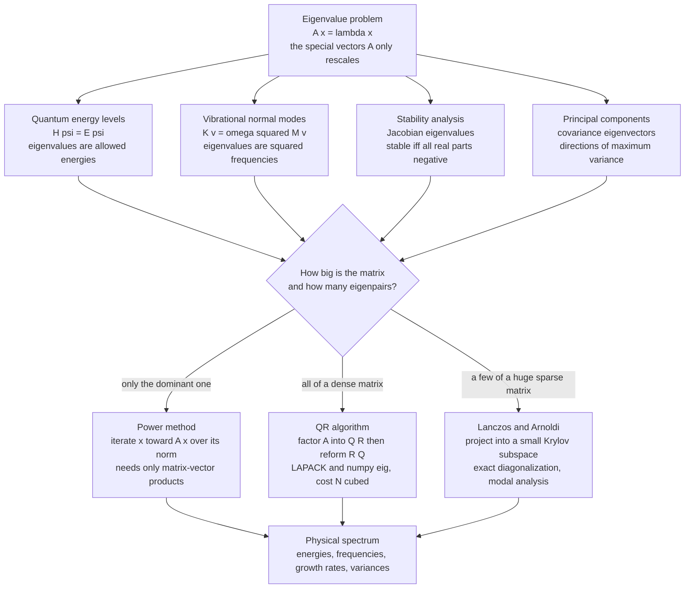

# 🎻 Eigenvalue Problems in Physics

> [!abstract] TL;DR
> Pluck a guitar string, shine light through a hot gas, or shake a bridge, and the same mathematical object decides what happens: an **eigenvalue problem** $A\mathbf{x} = \lambda \mathbf{x}$. The eigenvectors are the special "modes" a system naturally supports, and the eigenvalues are the numbers attached to them — vibration frequencies, quantum energies, growth rates, data variances. A staggering fraction of physics reduces to *finding the eigenpairs of a matrix*, and because real matrices are huge, the whole game is choosing the right numerical eigensolver: the **power method** for the single dominant mode, the **QR algorithm** for the full spectrum of a dense matrix, and **Lanczos/Arnoldi** for a few eigenvalues of an enormous sparse operator.

## Intuition — analogy FIRST

Pluck a guitar string and it does **not** vibrate in a random, formless blur. It rings at specific, discrete pitches — a fundamental plus a ladder of overtones. Those are its **natural modes**: shapes the string "likes" to move in, each with its own frequency. Now heat a gas of hydrogen: it does not glow in a smear of all colors, but emits sharp, discrete lines — its **energy levels**. And a suspension bridge does not sway at just any frequency; it has a handful of natural frequencies that engineers lose sleep over, because a matching gust or footfall can drive it to catastrophe.

Underneath all three lives the **same mathematical creature**. Each system is described by a matrix (or an operator that becomes a matrix once you put it on a grid), and asking "what are the natural modes and their frequencies/energies?" is *exactly* asking: for which special vectors $\mathbf{x}$ does the matrix merely **stretch** the vector without rotating it, $A\mathbf{x} = \lambda\mathbf{x}$? Those stretch-only directions are the **eigenvectors** — the modes. The stretch factors $\lambda$ are the **eigenvalues** — the frequencies, energies, or growth rates. Solving eigenvalue problems on a computer is how we compute the **resonances, spectra, and stabilities** of the physical world.

---

## How It Works

### One structure, four faces

The equation $A\mathbf{x} = \lambda\mathbf{x}$ says: applying $A$ to $\mathbf{x}$ does nothing but rescale it. Almost every appearance of "special, discrete, allowed values" in physics is this equation in disguise:

1. **Quantum energy levels.** The time-independent Schrödinger equation $\hat{H}\psi = E\psi$ *is* an eigenvalue problem: the Hamiltonian operator $\hat{H}$ has eigenvalues that are the **allowed energies** and eigenvectors that are the **stationary states** (orbitals). Discretize $\hat{H}$ on a grid and it becomes a matrix eigenproblem — the subject of the sibling note **Numerical_Quantum_Mechanics**.
2. **Vibrational normal modes.** For masses coupled by springs, Newton's law linearizes to $M\ddot{\mathbf{u}} = -K\mathbf{u}$. Seeking oscillating solutions $\mathbf{u} = \mathbf{v}\,e^{i\omega t}$ turns this into $K\mathbf{v} = \omega^2 M\mathbf{v}$: the eigenvalues are **squared frequencies** and the eigenvectors are **mode shapes**. This governs molecules, crystal lattices (**phonons**), skyscrapers, and musical instruments.
3. **Stability analysis.** Near a fixed point of a dynamical system, the behavior is set by the **Jacobian** of the linearized dynamics. The fixed point is stable if and only if **all eigenvalues have negative real part** — a positive real part means an exponentially growing mode. The same test decides buckling loads of a column and the onset of turbulence in a shear flow (see the sibling **Chaos_and_Nonlinear_Dynamics_Numerically**).
4. **Principal Component Analysis.** The eigenvectors of a data **covariance matrix** are the directions of maximum variance; the eigenvalues are how much variance each captures. Physics, statistics, and machine learning meet here.

The astonishing point is the **unity**: the identical computation returns quantum spectra, mechanical resonances, dynamical growth rates, and data principal axes.

### Why numerical methods at all

By hand you can diagonalize $2\times 2$ or a lucky symmetric $3\times 3$ matrix. Real physics does not hand you those. Discretizing an operator on a grid of $N$ points gives an $N \times N$ matrix; a quantum many-body Hamiltonian on $L$ spins gives a matrix of dimension $2^L$ (thousands to billions). No characteristic polynomial is being factored by hand here — **numerical eigensolvers** are the only way in, and *which* solver you pick depends on the matrix's size, sparsity, and how many eigenpairs you actually need.

### The power method: the simplest idea that works

Take a random vector, multiply it by $A$, normalize, and repeat:
$$\mathbf{x}_{k+1} = \frac{A\mathbf{x}_k}{\lVert A\mathbf{x}_k\rVert}.$$
Write $\mathbf{x}_0$ in the eigenvector basis; each multiplication multiplies component $i$ by $\lambda_i$. The **largest-magnitude** eigenvalue's component grows fastest and dominates all the others, so the iterate converges to the **dominant eigenvector**, and the Rayleigh quotient $\mathbf{x}^\top A\mathbf{x}$ converges to the dominant eigenvalue. It needs only **matrix-vector products** (never the full matrix stored densely), which makes it sparse-friendly — and it is literally the seed of Google's **PageRank**, whose ranking vector is the dominant eigenvector of the web's link matrix. Convergence rate is set by the ratio $\lvert\lambda_2/\lambda_1\rvert$: close subdominant eigenvalues mean slow convergence. To target a *specific* eigenvalue instead of the largest, use **inverse iteration** (apply $A^{-1}$, which amplifies the *smallest* eigenvalue) or **shift-and-invert** with $(A - \sigma I)^{-1}$ to home in on the eigenvalue nearest a chosen shift $\sigma$ — the key to reaching interior or ground-state energies.

### The QR algorithm: the dense-matrix workhorse

When you want **all** eigenvalues of a moderate dense matrix, the standard tool is the **QR algorithm**: factor $A = QR$ (orthogonal times upper-triangular), then reform $A' = RQ$, and iterate. This orthogonal-similarity sweep drives the matrix toward (quasi-)triangular **Schur form**, whose diagonal reveals every eigenvalue. With Hessenberg reduction and shifts it converges fast and stably; it is what **LAPACK** and hence `numpy.linalg.eig`/`eigh` call under the hood. The cost is $O(N^3)$ in time and $O(N^2)$ in memory — perfect for hundreds or low thousands of unknowns, hopeless for millions.

### Krylov methods — Lanczos and Arnoldi — for huge sparse matrices

The frontier of computational physics lives where $N$ is enormous, the matrix is **sparse** (or defined only through its action on a vector), and you need just a **few** eigenvalues — typically the lowest ones (ground state and first excitations). You cannot store, let alone $O(N^3)$-diagonalize, a $2^{40}$-dimensional Hamiltonian. **Krylov subspace methods** build a small subspace $\mathcal{K}_m = \text{span}\{\mathbf{v}, A\mathbf{v}, A^2\mathbf{v}, \dots, A^{m-1}\mathbf{v}\}$ from cheap matrix-vector products, project $A$ into it as a tiny $m \times m$ matrix, and diagonalize *that* instead. **Lanczos** does this for symmetric/Hermitian matrices (producing a tridiagonal projection); **Arnoldi** handles the general case (producing a Hessenberg projection). This is the engine behind **exact diagonalization** of quantum spin systems and large-scale **modal analysis** of structures, exposed in `scipy.sparse.linalg.eigsh` (symmetric) and `eigs` (general).

### Exploit the physics: symmetric/Hermitian structure

Physical matrices are almost always **symmetric** (real, as in a stiffness matrix) or **Hermitian** (complex, as in a Hamiltonian). This is a gift: such matrices have **real eigenvalues** and a complete set of **orthogonal eigenvectors**. Use the specialized routines (`eigh`, `eigsh`) rather than the general ones (`eig`, `eigs`) — they are faster, use less memory, and are numerically more stable because they cannot produce spurious complex eigenvalues.

### The generalized eigenvalue problem

Vibration and quantum-chemistry problems often arrive as $A\mathbf{x} = \lambda B\mathbf{x}$ rather than $A\mathbf{x} = \lambda\mathbf{x}$. In structural dynamics $A = K$ (stiffness) and $B = M$ (mass); in quantum chemistry $B = S$ is the **overlap matrix** of non-orthogonal basis functions. When $B$ is symmetric positive-definite you can Cholesky-factor $B = LL^\top$ and transform to a standard problem $L^{-1}AL^{-\top}\mathbf{y} = \lambda\mathbf{y}$, or simply call a generalized solver (`scipy.linalg.eigh(A, B)`).



---

## Key Concepts

### Secondary
- An **eigenvector** of a matrix is a special direction that the matrix only stretches or shrinks, never rotates; the stretch factor is its **eigenvalue**.
- A vibrating system has **natural modes** — specific shapes it likes to oscillate in — each with its own frequency; these are eigenvectors and (square-rooted) eigenvalues.
- The discrete "allowed" energies of an atom are the eigenvalues of its energy operator; that is why atoms emit sharp spectral lines.
- **Diagonalizing** a matrix means finding all its eigenvectors and eigenvalues at once.

### Undergraduate
- $A\mathbf{x} = \lambda\mathbf{x}$ has nontrivial solutions when $\det(A - \lambda I) = 0$; hand methods stop at tiny matrices, so we use **numerical eigensolvers**.
- **Symmetric/Hermitian** matrices have **real eigenvalues** and **orthogonal eigenvectors** — use `eigh`, not `eig`.
- **Power method**: $\mathbf{x}\leftarrow A\mathbf{x}/\lVert A\mathbf{x}\rVert$ converges to the **dominant** eigenpair at rate $\lvert\lambda_2/\lambda_1\rvert$; **inverse iteration** and **shift-and-invert** target chosen eigenvalues.
- **Normal modes**: solving $K\mathbf{v} = \omega^2 M\mathbf{v}$ gives mode shapes and frequencies; a discretized Schrödinger operator gives energy levels the same way.
- **Stability**: a linearized fixed point is stable iff **all** Jacobian eigenvalues have negative real part.

### Graduate
- The **QR algorithm** (with Hessenberg reduction, Wilkinson shifts, and deflation) drives a matrix to Schur form in $O(N^3)$ and underlies LAPACK's dense eigensolvers.
- **Krylov methods** — **Lanczos** (symmetric, tridiagonal projection) and **Arnoldi** (general, Hessenberg projection) — extract a few extreme or interior eigenpairs of huge sparse operators from matrix-vector products; watch for **loss of orthogonality** (reorthogonalization, restarts as in the implicitly restarted Arnoldi of ARPACK).
- The **generalized problem** $A\mathbf{x}=\lambda B\mathbf{x}$ (mass/stiffness, overlap matrices) reduces to standard form via Cholesky $B=LL^\top$ when $B\succ 0$.
- **Conditioning of eigenproblems**: eigenvalues of **normal** matrices are well-conditioned; for **non-normal/defective** matrices they can be wildly sensitive (pseudospectra), and **clustered/degenerate** eigenvalues make individual eigenvectors ill-defined even when the invariant subspace is stable.
- **Davidson/Jacobi-Davidson** and **LOBPCG** are preconditioned eigensolvers favored in quantum chemistry and electronic structure when a good preconditioner is available.

---

## Python Demo

```python
# Eigenvalue problems as the unifying structure of physics.
# We solve THREE incarnations of A x = lambda x, including one solver from scratch:
#   (a) NORMAL MODES   : diagonalize the dynamical matrix of a mass-spring chain
#                        -> eigenvalues = squared frequencies, eigenvectors = mode shapes
#   (b) POWER METHOD   : find the DOMINANT eigenpair using only matrix-vector products
#   (c) QUANTUM SPECTRUM: finite-difference Schrodinger Hamiltonian for the harmonic
#                        oscillator -> eigenvalues = allowed energy levels
import numpy as np
import matplotlib.pyplot as plt

# =====================================================================
# (a) NORMAL MODES of a chain of N masses coupled by springs (fixed ends)
#     Equation of motion:  m x_i'' = k (x_{i-1} - 2 x_i + x_{i+1})
#     => M x'' = -K x. With equal masses the dynamical matrix D = K/m is
#     symmetric tridiagonal; eigh(D) yields omega^2 and the mode shapes.
# =====================================================================
N, m, k = 20, 1.0, 1.0

# Stiffness matrix K: tridiagonal [-k, 2k, -k] with fixed boundaries
K = (np.diag(2.0 * np.ones(N))
     + np.diag(-1.0 * np.ones(N - 1), 1)
     + np.diag(-1.0 * np.ones(N - 1), -1)) * k
D = K / m                                   # dynamical matrix

# SYMMETRIC eigensolver: real eigenvalues, orthogonal eigenvectors, ascending order
omega2, modes = np.linalg.eigh(D)
omega = np.sqrt(np.abs(omega2))             # normal-mode frequencies

# Analytic normal-mode frequencies for a fixed-fixed chain (exact benchmark)
n_idx = np.arange(1, N + 1)
omega_exact = 2.0 * np.sqrt(k / m) * np.sin(n_idx * np.pi / (2 * (N + 1)))

# =====================================================================
# (b) POWER METHOD: dominant eigenpair of D from matrix-vector products only
# =====================================================================
def power_method(A, iters=60, seed=0):
    rng = np.random.default_rng(seed)
    v = rng.standard_normal(A.shape[0])
    v /= np.linalg.norm(v)
    history = []
    for _ in range(iters):
        w = A @ v                           # the ONLY expensive step (sparse-friendly)
        v = w / np.linalg.norm(w)
        history.append(v @ (A @ v))         # Rayleigh-quotient eigenvalue estimate
    return history[-1], v, np.array(history)

lam_true = omega2[-1]                        # largest eigenvalue of D (from eigh)
lam_pm, v_pm, hist = power_method(D, iters=60)
pm_err = np.abs(hist - lam_true) / lam_true

# =====================================================================
# (c) QUANTUM SPECTRUM: finite-difference Schrodinger for the harmonic
#     oscillator  H = -1/2 d^2/dx^2 + 1/2 x^2   (hbar = m = omega = 1)
#     Exact energy levels:  E_n = n + 1/2,  n = 0, 1, 2, ...
# =====================================================================
Ng = 400
x = np.linspace(-8.0, 8.0, Ng)
dx = x[1] - x[0]

main = 1.0 / dx**2 + 0.5 * x**2             # kinetic diagonal + potential
off = -0.5 / dx**2 * np.ones(Ng - 1)        # kinetic off-diagonals
H = np.diag(main) + np.diag(off, 1) + np.diag(off, -1)

E, psi = np.linalg.eigh(H)                   # Hermitian solver -> real energy ladder
E_num, E_exact = E[:6], np.arange(6) + 0.5

# =====================================================================
# PLOTS
# =====================================================================
fig, ax = plt.subplots(2, 2, figsize=(13, 9))

# (a) mode shapes of the first four normal modes
xpos = np.arange(1, N + 1)
for j in range(4):
    shape = modes[:, j] / np.max(np.abs(modes[:, j]))
    ax[0, 0].plot(xpos, shape, 'o-', ms=4, label=f"mode {j+1}, omega={omega[j]:.3f}")
ax[0, 0].axhline(0, color='gray', lw=0.8)
ax[0, 0].set(title="(a) Normal-mode shapes of a mass-spring chain\n(eigenvectors of the dynamical matrix)",
             xlabel="mass index", ylabel="displacement (normalized)")
ax[0, 0].legend(fontsize=8); ax[0, 0].grid(alpha=0.3)

# (b) quantized frequency spectrum: numeric vs analytic
ax[0, 1].plot(n_idx, omega, 'o', ms=6, label="eigh (numeric)")
ax[0, 1].plot(n_idx, omega_exact, 'x', ms=8, label="analytic")
ax[0, 1].set(title="(b) Quantized vibration spectrum\n(eigenvalues -> discrete frequencies)",
             xlabel="mode number n", ylabel="frequency omega_n")
ax[0, 1].legend(); ax[0, 1].grid(alpha=0.3)

# (c) power-method convergence to the dominant eigenvalue
ax[1, 0].semilogy(pm_err, 's-', ms=4, color='crimson')
ax[1, 0].set(title="(c) Power method converging to the dominant\neigenvalue (matrix-vector products only)",
             xlabel="iteration", ylabel="relative error |lam_k - lam| / lam")
ax[1, 0].grid(alpha=0.3, which='both')

# (d) quantum harmonic-oscillator energy levels: numeric vs exact
lvl = np.arange(6)
ax[1, 1].plot(lvl, E_num, 'o', ms=9, label="finite-diff eigh")
ax[1, 1].plot(lvl, E_exact, '_', ms=20, color='k', label="exact n + 1/2")
ax[1, 1].set(title="(d) Quantum energy levels of the harmonic oscillator\n(eigenvalues of the discretized Hamiltonian)",
             xlabel="quantum number n", ylabel="energy E_n")
ax[1, 1].legend(); ax[1, 1].grid(alpha=0.3)

plt.tight_layout()
plt.show()

# ---- numerical sanity checks ----
print(f"(a) lowest 3 mode freqs (numeric) : {np.round(omega[:3], 5)}")
print(f"(a) lowest 3 mode freqs (analytic): {np.round(omega_exact[:3], 5)}")
print(f"(b) max |numeric - analytic| freq : {np.max(np.abs(omega - omega_exact)):.2e}")
print(f"(c) power-method eigenvalue       : {lam_pm:.6f}  (exact {lam_true:.6f})")
print(f"(d) QHO energies (numeric)        : {np.round(E_num, 4)}")
print(f"(d) QHO energies (exact)          : {E_exact}")
```

**What you see:** panel (a) draws the first four **mode shapes** — smooth half-sine, full-sine, and higher patterns, exactly the standing-wave shapes of a plucked string, here emerging as *eigenvectors*; panel (b) shows the numeric frequencies (from `eigh`) landing on the analytic curve, a discrete, **quantized** spectrum of allowed vibration frequencies; panel (c) shows the hand-coded **power method** converging geometrically to the largest eigenvalue using nothing but matrix-vector products; and panel (d) shows the finite-difference **Schrödinger Hamiltonian** reproducing the harmonic oscillator's ladder $E_n = n + \tfrac12$ — the *same diagonalization machinery* that gave vibration frequencies now yields quantum energies. One equation, four physical faces.

---

## Real-World Applications

- **Quantum spectra and exact diagonalization.** Ground-state energies and excitation gaps of spin chains, Hubbard models, and small molecules come from **Lanczos** diagonalization of enormous sparse Hamiltonians — the workhorse behind condensed-matter and quantum-chemistry codes, and a natural companion to **Numerical_Quantum_Mechanics**.
- **Phonons and thermal properties.** Diagonalizing a crystal's dynamical matrix yields the **phonon** spectrum, which sets heat capacity, thermal conductivity, and thermal expansion — a direct link to lattice dynamics and materials modeling.
- **Structural and mechanical modal analysis.** Finite-element models of bridges, aircraft wings, and turbine blades solve $K\mathbf{v}=\omega^2 M\mathbf{v}$ to find natural frequencies; engineers then keep operating and excitation frequencies away from them to **avoid resonant failure** (the Tacoma Narrows lesson).
- **Stability of flows and dynamical systems.** Eigenvalues of the linearized Navier-Stokes or reaction-diffusion operator predict the onset of instability, pattern formation, and turbulence — the linear-analysis backbone underneath **Chaos_and_Nonlinear_Dynamics_Numerically**.
- **Electronic band structure.** Diagonalizing the Kohn-Sham or tight-binding Hamiltonian across the Brillouin zone produces the **band structure** that classifies metals, insulators, and semiconductors — the computational core of **Density_Functional_Theory_and_Electronic_Structure**.
- **Networks and data.** **PageRank** is the dominant eigenvector of the web link matrix; **spectral graph** methods use the graph Laplacian's eigenvectors for clustering and partitioning; and **PCA** uses covariance eigenvectors for dimensionality reduction across science and machine learning.

---

## Common Pitfalls

- **Using `eig` on a symmetric matrix.** The general solver can return tiny imaginary parts and non-orthogonal eigenvectors from round-off. Physical matrices are symmetric/Hermitian — call `eigh`/`eigsh` for real eigenvalues, orthogonal eigenvectors, and better speed and stability.
- **Confusing eigenvalue and frequency.** For vibrations the eigenvalue is $\omega^2$, not $\omega$; forgetting the square root (or dropping the mass matrix in a generalized problem) gives frequencies that are off by orders of magnitude.
- **Trusting eigenvectors of clustered/degenerate eigenvalues.** When eigenvalues are nearly equal, individual eigenvectors are ill-conditioned and can rotate arbitrarily within the shared subspace; work with the **invariant subspace**, not one wobbly vector.
- **Applying the power method blindly.** It converges only to the **dominant** eigenvalue, fails when the top two are equal in magnitude (e.g. $\pm\lambda$), and crawls when they are close. For the *smallest* or an *interior* eigenvalue, use inverse iteration or shift-and-invert.
- **Dense-diagonalizing a huge sparse matrix.** Calling `eig`/`eigh` on a million-dimensional Hamiltonian tries to allocate $O(N^2)$ memory and do $O(N^3)$ work — it will exhaust RAM. Use `scipy.sparse.linalg.eigsh` to get just the few eigenvalues you need.
- **Ignoring Lanczos loss of orthogonality.** Finite-precision Lanczos silently loses orthogonality among its basis vectors, producing **spurious "ghost" eigenvalues**; use reorthogonalization or a library (ARPACK via `eigsh`) that handles it.
- **Non-normal traps.** For strongly **non-normal** matrices (some fluid-stability operators), eigenvalues can all sit in the stable half-plane yet the system exhibits large **transient growth**; eigenvalues alone can mislead, and pseudospectra tell the fuller story.

---

## Related Concepts

- [[Eigenvalues_and_Eigenvectors]] — the pure linear-algebra foundation of $A\mathbf{x}=\lambda\mathbf{x}$ that every physical eigenproblem specializes.
- [[Numerical_Linear_Algebra]] — the sibling that frames physics as $Ax=b$ and $Ax=\lambda x$ and surveys the solver landscape this note zooms into.
- [[Oscillations_and_SHM]] — coupled oscillators whose normal modes are the eigenvectors of the stiffness/dynamical matrix demonstrated here.
- [[Schrodinger_Equation]] — the operator eigenproblem $\hat{H}\psi=E\psi$ that discretizes into the matrix eigenvalue problem of the quantum demo.
- [[Quantum_Harmonic_Oscillator]] — the exactly solvable system whose $E_n=n+\tfrac12$ ladder benchmarks the finite-difference Hamiltonian.
- [[Many_Body_Quantum_Systems]] — enormous sparse Hamiltonians whose ground states are found by Lanczos exact diagonalization.
- [[Phonons_and_Lattice_Dynamics]] — crystal normal modes obtained by diagonalizing the dynamical matrix, setting thermal properties.
- [[Crystal_Structure_and_Band_Theory]] — band structure as the eigenvalues of a periodic Hamiltonian across the Brillouin zone.
- [[Electronic_Band_Structure]] — the materials-science view of diagonalizing periodic Hamiltonians to classify conductors and insulators.
- [[Singular_Value_Decomposition]] — the close cousin ($A^\top A$ eigenproblem) underlying least squares, low-rank approximation, and PCA.
- [[PCA]] — the data-analysis incarnation: eigenvectors of the covariance matrix as directions of maximum variance.
- [[Spectral_Theory]] — the functional-analysis generalization of eigenvalues to operators on infinite-dimensional spaces.
- [[Chaos_and_Nonlinear_Dynamics_Numerically]] — where Jacobian eigenvalues decide the stability of fixed points and orbits.

---

## Review Questions

1. **(Conceptual)** Explain in one paragraph why finding the vibration frequencies of a bridge, the energy levels of an atom, and the principal components of a dataset are all "the same problem." What plays the role of the matrix $A$, the eigenvector, and the eigenvalue in each case?
2. **(Conceptual)** The power method converges to the eigenvalue of *largest magnitude*. Describe precisely how **shift-and-invert** modifies the spectrum so that iteration instead converges to the eigenvalue nearest a chosen target $\sigma$, and why this is essential for finding a quantum ground-state energy.
3. **(Scenario)** You must find the **10 lowest** energy levels of a quantum spin Hamiltonian of dimension $2^{30}\approx 10^9$, stored only as a routine that returns $H\mathbf{v}$. Which eigensolver do you choose — dense `eigh`, the QR algorithm, or Lanczos via `eigsh` — and why are the other two unusable here?
4. **(Scenario)** A finite-element modal analysis returns a mode with a small **negative** eigenvalue $\omega^2 < 0$. What does an imaginary frequency physically indicate about the structure, and how does this connect to the eigenvalue test for stability of a dynamical fixed point?
5. **(Trade-off)** Compare the power method, the QR algorithm, and Lanczos/Arnoldi along three axes: how many eigenpairs each returns, the matrix size each is suited to, and what operations each needs (full matrix vs matrix-vector products). Give one physics problem that is the natural home of each.

---

## Sources

- Trefethen, L. N. & Bau, D. — *Numerical Linear Algebra* (SIAM, 1997). Lectures 24-30 on eigenvalue algorithms, the QR algorithm, and Krylov/Lanczos methods.
- Golub, G. H. & Van Loan, C. F. — *Matrix Computations*, 4th ed. (Johns Hopkins University Press, 2013). Chs. 7-10 on the symmetric eigenproblem, QR iteration, and Lanczos/Arnoldi.
- Press, W. H. et al. — *Numerical Recipes*, 3rd ed. (Cambridge University Press, 2007), Ch. 11, "Eigensystems."
- Saad, Y. — *Numerical Methods for Large Eigenvalue Problems*, revised ed. (SIAM, 2011). Free PDF: [www-users.cse.umn.edu/~saad/eig_book_2ndEd.pdf](https://www-users.cse.umn.edu/~saad/eig_book_2ndEd.pdf)
- Lehoucq, R., Sorensen, D. & Yang, C. — *ARPACK Users' Guide* (SIAM, 1998), the implicitly restarted Arnoldi method behind `scipy.sparse.linalg.eigsh`/`eigs`: [www.caam.rice.edu/software/ARPACK](https://www.caam.rice.edu/software/ARPACK/)

---

#computational-physics #eigenvalue-problems #normal-modes #lanczos #spectra
