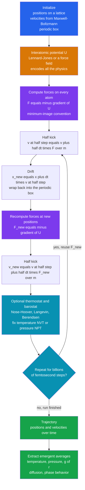

# 🧬 Molecular Dynamics Simulation

> [!abstract] TL;DR
> **Molecular dynamics (MD)** is a *computational microscope*: it takes the forces between atoms — encoded in an **interatomic potential** like the **Lennard-Jones** pair potential or a biomolecular force field — and integrates **Newton's equations of motion** for every atom, one **femtosecond** at a time, producing a **trajectory** that resolves atomic motion in space and time. The standard engine is the **symplectic velocity-Verlet integrator**, which conserves energy over *billions* of steps. The payoff is profound: **temperature, pressure, phase transitions, diffusion, viscosity, and liquid structure all EMERGE** from the raw atomic trajectories with *no thermodynamics assumed* — statistical mechanics happening in the machine. **Thermostats and barostats** clamp temperature and pressure to sample the ensemble you want; **periodic boundaries** turn a tiny box into bulk matter. The perennial constraint is the **timescale gap** — femtosecond steps must reach microseconds to milliseconds — attacked by enhanced sampling, coarse-graining, GPUs, and machine-learning potentials that now approach quantum accuracy at classical cost. MD is a pillar of materials science, chemistry, and biophysics.

## Intuition

**Analogy:** Imagine you could shrink down and stand inside a single droplet of water, watching every individual atom at once. Each one is tugged by its neighbors, jostling and colliding **billions of times a second**, never still. Molecular dynamics is *exactly that movie*, played by a computer. You hand the machine two things — the **forces between atoms** (how strongly they attract when close, how fiercely they repel when squeezed together) and **Newton's laws** (force equals mass times acceleration) — and it plays the atomic film forward one **femtosecond** at a time, tracking where every atom goes next.

Here is the beautiful part. You never tell the computer what "temperature" is, or "pressure," or that water freezes at zero Celsius. You only tell it about *individual atoms and the forces between them*. Yet from this microscopic dance, the everyday properties of matter **emerge on their own**: the temperature falls out of how fast the atoms jiggle, the pressure from how hard they hammer the walls, and if you cool them enough they spontaneously **lock into a crystal** — a phase transition nobody put in by hand. MD is a genuine bridge from the quantum-sized world of atoms to the tangible properties of the stuff we live in.

---

## How It Works

### Core mechanics

**1. The state and the law.** The full microscopic state of $N$ atoms is their positions $\{\mathbf{r}_i\}$ and velocities $\{\mathbf{v}_i\}$. Their motion obeys **Newton's second law** ([[Newtons_Laws_and_Kinematics]]), one vector equation per atom:

$$
m_i \ddot{\mathbf{r}}_i = \mathbf{F}_i = -\nabla_i U(\mathbf{r}_1, \dots, \mathbf{r}_N).
$$

Everything MD does is *numerically integrate these coupled ODEs*. There is no randomness in classical MD (contrast the sibling *The_Metropolis_Algorithm_and_MCMC*, which throws dice); MD is **deterministic** — the entire future follows from the initial conditions and the forces.

**2. The physics lives in the potential.** The single most important input is the **interatomic potential** (or **force field**) $U$: a function that returns the system's potential energy given all atom positions, from which forces are the **negative gradient**. This is where all the chemistry and physics enter, and it spans a spectrum of accuracy versus cost:
- **Pair potentials** — the energy is a sum over pairs. The canonical example is the **Lennard-Jones (LJ)** potential, $U(r) = 4\varepsilon\big[(\sigma/r)^{12} - (\sigma/r)^{6}\big]$. The $r^{-6}$ term is the attractive **van der Waals** tail; the steep $r^{-12}$ term is a cheap stand-in for **hard-core Pauli repulsion**. LJ captures noble gases (argon) and generic fluids astonishingly well and is the "hydrogen atom" of MD.
- **Many-body / metallic potentials** — the **embedded-atom method (EAM)** makes an atom's energy depend on the local electron density from all its neighbors, essential for metals where pair potentials fail.
- **Biomolecular force fields** — **AMBER, CHARMM, OPLS, GROMOS** add bonded terms (springs for bonds and angles, torsion terms for dihedrals) plus non-bonded LJ and **electrostatic (Coulomb)** terms, parameterized against quantum calculations and experiment. These drive protein and DNA simulation (see the Biophysics note [[Computational_Biophysics_and_Molecular_Dynamics]]).
- **Machine-learning interatomic potentials (MLIPs)** — neural-network or Gaussian-process models trained on quantum data, delivering *near-DFT accuracy at classical cost* — the fastest-moving frontier (the not-yet-written sibling *Machine_Learning_in_Computational_Physics* goes deeper).

**3. The core loop.** MD is a tight loop repeated billions of times:
1. **Compute forces** on every atom from the potential, $\mathbf{F}_i = -\nabla_i U$.
2. **Step positions and velocities** forward by a tiny timestep $\Delta t$ using a numerical integrator.
3. **Repeat** — accumulating a **trajectory** $\{\mathbf{r}_i(t), \mathbf{v}_i(t)\}$ that *is* the answer.

**4. Why velocity-Verlet, and why femtoseconds.** The integrator of choice is **velocity-Verlet**, a second-order, time-reversible, *symplectic* method (its "kick-drift-kick" form):

$$
\mathbf{v}_{i}^{t+\frac{\Delta t}{2}} = \mathbf{v}_i^{t} + \tfrac{\Delta t}{2}\tfrac{\mathbf{F}_i^t}{m_i}, \quad
\mathbf{r}_i^{t+\Delta t} = \mathbf{r}_i^t + \Delta t\,\mathbf{v}_i^{t+\frac{\Delta t}{2}}, \quad
\mathbf{v}_i^{t+\Delta t} = \mathbf{v}_i^{t+\frac{\Delta t}{2}} + \tfrac{\Delta t}{2}\tfrac{\mathbf{F}_i^{t+\Delta t}}{m_i}.
$$

Because it is symplectic, its energy error stays **bounded and oscillating** rather than drifting — the reason a simulated liquid neither spuriously heats nor freezes over billions of steps (the full story is in [[Symplectic_Integrators_and_Hamiltonian_Dynamics]]). The timestep is set by the **fastest motion in the system**: a bond vibration completes in roughly 10 femtoseconds, so $\Delta t \approx 1\text{–}2\ \text{fs}$ is needed to resolve it. This tiny step is the origin of MD's central curse — the **timescale gap**.

**5. Ensembles, thermostats, and barostats.** A pure Newtonian run conserves total energy and volume: it samples the **microcanonical (NVE)** ensemble (constant $N$, $V$, $E$). But experiments usually fix *temperature* or *pressure*, not energy. **Thermostats** — **Nosé-Hoover** (a deterministic extended-system method that rigorously samples the canonical distribution), **Langevin** (random kicks plus friction), and **Berendsen** (simple velocity rescaling) — hold constant temperature, giving the **canonical (NVT)** ensemble. **Barostats** additionally let the box volume fluctuate to hold constant pressure, giving the **isothermal-isobaric (NPT)** ensemble. This is where MD reconnects to [[Classical_Statistical_Mechanics]]: the thermostat is what makes the trajectory a valid sample of a thermodynamic ensemble.

**6. Periodic boundary conditions.** A simulable box holds thousands to millions of atoms — utterly tiny. To model **bulk** matter and banish spurious surfaces, the box is **tiled periodically** in all directions: an atom leaving the right face re-enters on the left, and each atom interacts with the *nearest image* of every other (the **minimum-image convention**). Short-range forces are cheaply cut off, but **long-range electrostatics** cannot be — they are summed with **Ewald / Particle-Mesh Ewald (PME)** methods that split the sum into a fast real-space part and a reciprocal-space part.

**7. Emergent thermodynamics — the whole point.** Nowhere is thermodynamics inserted. Yet from the trajectory you extract, as simple averages:
- **Temperature** from the average kinetic energy via **equipartition**: $\langle \tfrac{1}{2}m v^2\rangle = \tfrac{1}{2}k_B T$ per degree of freedom.
- **Pressure** from the **virial** theorem (kinetic term plus the average of $\mathbf{r}\cdot\mathbf{F}$).
- **Structure** from the **radial distribution function** $g(r)$ — the probability of finding an atom a distance $r$ from another, whose peaks are the signature of liquid, gas, or crystalline order.
- **Transport coefficients** — **diffusion** from the slope of the mean-squared displacement (Einstein relation), and **viscosity / thermal conductivity** from **Green-Kubo** integrals of correlation functions.
- **Phase transitions** — melting, freezing, and nucleation appear directly as the atoms reorganize.

### Flow / architecture



---

## Key Concepts

### Secondary (intuition first)
- **MD is an atomic movie.** Give the computer the forces between atoms and Newton's laws, and it plays the film forward one femtosecond at a time. That is the entire idea.
- **You don't put in thermodynamics — it comes out.** Temperature is just how fast the atoms jiggle; pressure is how hard they hit the walls; freezing is the atoms deciding, on their own, to line up in a crystal.
- **The potential is the physics.** Change the rule for how atoms attract and repel, and you change what you are simulating — argon gas, a metal, or a protein.
- **Tiny steps, huge patience.** Atoms vibrate so fast that each simulated step is a millionth of a billionth of a second, so reaching even a microsecond of real time takes a billion steps. This is MD's great frustration.

### Undergraduate (mechanics of the method)
- **Lennard-Jones potential.** $U(r) = 4\varepsilon[(\sigma/r)^{12} - (\sigma/r)^{6}]$: an attractive van der Waals $r^{-6}$ tail plus a steep repulsive $r^{-12}$ wall. Forces are $-dU/dr$ along the interatomic vector. **Reduced units** ($\varepsilon = \sigma = m = k_B = 1$) make LJ simulations universal.
- **Velocity-Verlet.** The kick-drift-kick update above: second-order, time-reversible, symplectic, needing only *one* force evaluation per step (the expensive part). Contrast the non-symplectic accuracy champions in the sibling *Runge_Kutta_and_Adaptive_Methods*, which drift energy over long conservative runs.
- **Equipartition thermometer.** In $d$ dimensions with $N$ atoms and fixed center of mass, $T = \tfrac{2\,\text{KE}}{(dN - d)\,k_B}$. Temperature is *defined by* the kinetic energy — no thermometer needed.
- **Periodic boundaries and minimum image.** Wrap positions modulo the box length; each pair interacts through its nearest periodic image; cut off short-range forces at $r_c < L/2$.
- **NVE vs NVT vs NPT.** Pure Newtonian MD is NVE (energy-conserving). A thermostat gives NVT (constant $T$); adding a barostat gives NPT (constant $P$) — matching lab conditions.

### Graduate (system-level judgment)
- **Why symplectic matters for MD.** Backward error analysis shows velocity-Verlet exactly conserves a *shadow Hamiltonian* $O(\Delta t^2)$-close to the true one, so total energy oscillates within a bounded band forever. A non-symplectic solver of higher formal order would slowly leak energy — fatal over $10^9$ steps. Timestep is bounded above by stability (roughly the fastest vibrational period over ten).
- **Neighbor lists and $O(N)$ scaling.** Naive force evaluation is $O(N^2)$; **cell lists** and **Verlet neighbor lists** exploit the short cutoff to make short-range MD scale as $O(N)$. Long-range electrostatics use **PME** at $O(N\log N)$. This algorithmic care is what enables million- to billion-atom runs (see the not-yet-written sibling *High_Performance_and_Parallel_Computing*).
- **Ergodicity and the timescale gap.** MD assumes the trajectory is *ergodic* — that time averages equal ensemble averages — but rare events (protein folding, nucleation, chemical reactions) live behind free-energy barriers the femtosecond dynamics may never cross in reachable time. **Enhanced sampling** — **metadynamics**, **replica exchange (parallel tempering)**, **umbrella sampling** — biases or parallelizes the dynamics to force barrier crossings, while **coarse-graining** lumps atoms into beads to stretch the accessible time and length scales.
- **Thermostat correctness.** Berendsen rescaling relaxes temperature but does *not* sample the true canonical ensemble (it suppresses fluctuations — the "flying ice cube" artifact); **Nosé-Hoover** and **Langevin** thermostats do sample it rigorously. Choosing the wrong thermostat corrupts fluctuation-derived quantities like heat capacity.
- **Ab-initio MD (AIMD).** Instead of a fixed force field, compute forces on the fly from **quantum mechanics** — typically **Density Functional Theory** (the not-yet-written siblings *Numerical_Quantum_Mechanics* and *Density_Functional_Theory_and_Electronic_Structure*), as in **Car-Parrinello** and **Born-Oppenheimer** MD. This captures bond breaking and formation at the cost of far smaller systems and shorter times — a trade-off MLIPs are now dissolving.

---

## Python Demo

```python
# Molecular dynamics of a 2D LENNARD-JONES FLUID from scratch: numpy + matplotlib.
# Reduced units: epsilon = sigma = mass = k_B = 1.
#
# We (a) run pure NEWTONIAN (NVE) velocity-Verlet and show ENERGY CONSERVATION --
#     total energy stays FLAT while kinetic and potential energy trade back and forth;
# (b) show EMERGENT THERMODYNAMICS with NO thermodynamics put in by hand:
#     - TEMPERATURE from the average kinetic energy via EQUIPARTITION,
#     - the RADIAL DISTRIBUTION FUNCTION g(r) revealing LIQUID structure,
#     - the MAXWELL-BOLTZMANN speed distribution emerging from Newton's laws alone.
import numpy as np
import matplotlib.pyplot as plt

rng = np.random.default_rng(7)

# ------------------------- system setup -------------------------
N       = 64                     # 8x8 atoms
rho     = 0.80                   # number density  -> dense LIQUID state point
T_set   = 1.0                    # target temperature (reduced units)
L       = np.sqrt(N / rho)       # square box side (periodic)
rc      = 2.5                    # LJ cutoff  (rc < L/2 so minimum image is valid)
dt      = 0.005                  # timestep (reduced units) -- safe for velocity-Verlet
u_shift = 4.0 * (rc**-12 - rc**-6)   # shift potential to zero at cutoff (continuity)

# place atoms on a square lattice, then give Maxwell-Boltzmann velocities
side = int(np.sqrt(N))
grid = (np.arange(side) + 0.5) * (L / side)
pos  = np.array([[x, y] for x in grid for y in grid], dtype=float)
vel  = rng.normal(0.0, np.sqrt(T_set), size=(N, 2))
vel -= vel.mean(axis=0)          # remove center-of-mass drift (fix COM momentum)

def forces_energy(pos):
    """Vectorized LJ forces and total potential energy, minimum-image periodic."""
    disp = pos[:, None, :] - pos[None, :, :]          # (N,N,2) pair displacements
    disp -= L * np.round(disp / L)                    # minimum-image convention
    r2 = np.einsum('ijk,ijk->ij', disp, disp)         # (N,N) squared distances
    np.fill_diagonal(r2, np.inf)                      # ignore self-interaction
    mask   = r2 < rc * rc
    inv_r2 = np.where(mask, 1.0 / r2, 0.0)
    inv_r6  = inv_r2 ** 3
    inv_r12 = inv_r6 ** 2
    # force coefficient c_ij = 24*(2/r^14 - 1/r^8); zero outside cutoff
    c = 24.0 * (2.0 * inv_r12 - inv_r6) * inv_r2
    F = np.einsum('ij,ijk->ik', c, disp)              # sum_j c_ij * disp_ij -> (N,2)
    pair_u = np.where(mask, 4.0 * (inv_r12 - inv_r6) - u_shift, 0.0)
    PE = 0.5 * np.sum(pair_u)                          # each pair counted once
    return F, PE

def temperature(vel):
    # equipartition in 2D with fixed COM: dof = 2N - 2
    return np.sum(vel * vel) / (2 * N - 2)

def vv_step(pos, vel, F):
    """One velocity-Verlet (kick-drift-kick) step; returns new pos, vel, F, PE."""
    vel = vel + 0.5 * dt * F                           # half kick
    pos = (pos + dt * vel) % L                          # drift + wrap into box
    F, PE = forces_energy(pos)                          # new forces
    vel = vel + 0.5 * dt * F                            # half kick
    return pos, vel, F, PE

# ------------------------- (0) equilibrate with a simple thermostat -------------------------
F, PE = forces_energy(pos)
for step in range(3000):                               # crude velocity rescaling toward T_set
    pos, vel, F, PE = vv_step(pos, vel, F)
    if step % 25 == 0:
        vel *= np.sqrt(T_set / temperature(vel))       # Berendsen-style rescale (equilibration only)

# ------------------------- (a) production: PURE NVE, measure energy conservation -------------------------
n_prod  = 4000
E_tot, E_kin, E_pot, T_hist = [], [], [], []
nbins, rmax = 120, rc
rdf_hist = np.zeros(nbins)
vel_samples = []
n_frames = 0
for step in range(n_prod):
    pos, vel, F, PE = vv_step(pos, vel, F)             # NO thermostat now -> constant energy
    KE = 0.5 * np.sum(vel * vel)
    E_kin.append(KE); E_pot.append(PE); E_tot.append(KE + PE)
    T_hist.append(temperature(vel))
    if step % 10 == 0:                                  # accumulate g(r) and speeds
        disp = pos[:, None, :] - pos[None, :, :]
        disp -= L * np.round(disp / L)
        r = np.sqrt(np.einsum('ijk,ijk->ij', disp, disp))
        iu = np.triu_indices(N, k=1)
        rr = r[iu]; rr = rr[rr < rmax]
        rdf_hist += np.histogram(rr, bins=nbins, range=(0, rmax))[0]
        vel_samples.append(np.sqrt(np.sum(vel * vel, axis=1)))  # per-atom speeds
        n_frames += 1

E_tot = np.array(E_tot); E_kin = np.array(E_kin); E_pot = np.array(E_pot)
t = np.arange(n_prod) * dt
T_mean = np.mean(T_hist)
drift = (E_tot.max() - E_tot.min()) / abs(E_tot.mean())

# normalize g(r): 2D ideal-gas reference = 0.5*N*rho*annulus_area per frame
edges   = np.linspace(0, rmax, nbins + 1)
centers = 0.5 * (edges[:-1] + edges[1:])
annulus = np.pi * (edges[1:]**2 - edges[:-1]**2)
g_r = rdf_hist / (0.5 * N * rho * annulus * n_frames)

print(f"box L = {L:.3f}   density = {rho}   cutoff = {rc}")
print(f"measured temperature  T = {T_mean:.3f}   (target was {T_set})")
print(f"total energy: mean = {E_tot.mean():.3f},  peak-to-peak drift = {drift:.2e} (relative)")
print(f"--> energy is CONSERVED to ~{drift:.0e}; temperature EMERGED from the kinetics")

# ------------------------- plots -------------------------
fig, ax = plt.subplots(2, 2, figsize=(14, 10))

# (1) energy conservation: total flat, KE <-> PE exchange
ax[0, 0].plot(t, E_tot, color="#111827", lw=1.6, label="total energy (conserved)")
ax[0, 0].plot(t, E_kin, color="#dc2626", lw=0.8, alpha=0.8, label="kinetic energy")
ax[0, 0].plot(t, E_pot, color="#2563eb", lw=0.8, alpha=0.8, label="potential energy")
ax[0, 0].set_title("(a) NVE run: total energy FLAT, KE and PE trade off")
ax[0, 0].set_xlabel("time (reduced units)"); ax[0, 0].set_ylabel("energy")
ax[0, 0].legend(fontsize=8); ax[0, 0].grid(alpha=0.3)

# (2) particle configuration in the periodic box
ax[0, 1].scatter(pos[:, 0], pos[:, 1], s=120, color="#0891b2", edgecolor="k", zorder=3)
ax[0, 1].set_xlim(0, L); ax[0, 1].set_ylim(0, L); ax[0, 1].set_aspect("equal")
ax[0, 1].set_title(f"(b) Atomic configuration  (N={N}, dense liquid)")
ax[0, 1].set_xlabel("x"); ax[0, 1].set_ylabel("y"); ax[0, 1].grid(alpha=0.3)

# (3) radial distribution function g(r): liquid structure
ax[1, 0].plot(centers, g_r, color="#7c3aed", lw=1.8)
ax[1, 0].axhline(1.0, color="k", ls="--", lw=1, label="ideal gas (no structure)")
ax[1, 0].set_title("(b) Radial distribution g(r): EMERGENT liquid order")
ax[1, 0].set_xlabel("r (in units of sigma)"); ax[1, 0].set_ylabel("g(r)")
ax[1, 0].legend(fontsize=8); ax[1, 0].grid(alpha=0.3)

# (4) speed distribution vs 2D Maxwell-Boltzmann (Rayleigh) at the measured T
speeds = np.concatenate(vel_samples)
v_axis = np.linspace(0, speeds.max(), 200)
mb_2d  = (v_axis / T_mean) * np.exp(-v_axis**2 / (2 * T_mean))   # 2D MB speed pdf
ax[1, 1].hist(speeds, bins=40, density=True, color="#f59e0b", alpha=0.6,
              label="simulated speeds")
ax[1, 1].plot(v_axis, mb_2d, color="#dc2626", lw=2.2,
              label=f"Maxwell-Boltzmann (T={T_mean:.2f})")
ax[1, 1].set_title("(b) Speed distribution EMERGES as Maxwell-Boltzmann")
ax[1, 1].set_xlabel("speed |v|"); ax[1, 1].set_ylabel("probability density")
ax[1, 1].legend(fontsize=8); ax[1, 1].grid(alpha=0.3)

plt.tight_layout(); plt.show()
```

Running it prints a **relative energy drift of order $10^{-3}$ or smaller** over 4000 pure-Newtonian steps — the total energy is a flat line while the kinetic and potential curves visibly *anticorrelate*, trading energy back and forth as atoms speed up in the potential valleys and slow climbing the repulsive walls. That flatness is the symplectic velocity-Verlet integrator earning its keep. The three emergent-thermodynamics panels are the real lesson: the **temperature** measured from the average kinetic energy sits right near the target even though "temperature" appears *nowhere* in the force law; the **radial distribution function $g(r)$** shows a tall first peak near $r \approx 1.1\sigma$ (the preferred neighbor shell) and a second, smaller bump — the unmistakable signature of *liquid* structure, neither the featureless $g(r)=1$ of a gas nor the sharp spikes of a crystal; and the **speed histogram** falls exactly onto the Maxwell-Boltzmann curve, a thermal distribution that Newton's deterministic equations conjured out of nothing but atoms pushing on atoms.

---

## Real-World Applications

- **Materials science.** MD predicts mechanical response (elastic moduli, yield, fracture), the motion of **defects and dislocations** ([[Defects_and_Dislocations_in_Crystals]]), melting and **crystal growth / solidification** ([[Nucleation_Growth_and_Solidification]]), thermal transport ([[Diffusion_in_Solids_and_Ficks_Laws]]), and radiation damage in reactor materials. Codes like **LAMMPS** run these at million- to billion-atom scale.
- **Chemistry.** Solvation structure, reaction pathways (via ab-initio or reactive potentials like ReaxFF), nucleation, and phase equilibria — the atomistic complement to [[Chemical_Kinetics]] and [[Chemical_Thermodynamics]]. Intermolecular forces set the whole behavior ([[Intermolecular_Forces_and_the_Aqueous_Environment]]).
- **Biophysics and drug discovery.** Protein folding and conformational dynamics, ligand binding and binding-free-energy calculations, membrane and ion-channel behavior — driven by **AMBER, CHARMM, GROMACS, NAMD** and the specialized **Anton** supercomputer. This is the domain of the sibling Biophysics note [[Computational_Biophysics_and_Molecular_Dynamics]] (and connects to [[Protein_Structure_and_Function]] and [[Statistical_Mechanics_of_Biomolecules]]); the present note is the general-physics MD deep-dive beneath it.
- **Nanofluidics and soft matter.** Flow of liquids through carbon nanotubes and nanopores, wetting, self-assembly, and colloidal dynamics, where continuum fluid mechanics breaks down and only atomistic detail suffices.
- **Shock, plasma, and extreme conditions.** MD models shock waves, spallation, and warm dense matter in inertial-confinement-fusion and planetary-interior studies.
- **A Nobel-honored pillar.** The **2013 Nobel Prize in Chemistry** (Karplus, Levitt, Warshel) recognized **multiscale modeling** — the QM/MM machinery that lets MD treat huge biomolecular systems with a quantum-accurate reactive core embedded in a classical environment.

---

## Common Pitfalls

- **Timestep too large.** If $\Delta t$ exceeds roughly a tenth of the fastest vibrational period, velocity-Verlet becomes unstable — energy blows up and atoms fly apart. Diagnose by watching total energy: a *trend* or explosion means shrink $\Delta t$ (or constrain the fastest bonds with SHAKE/RATTLE to allow a larger step).
- **Using a non-symplectic integrator for long runs.** A high-order Runge-Kutta scheme is more accurate per step but *drifts energy secularly*, silently heating or cooling the system over millions of steps. Structure preservation, not per-step accuracy, is what matters here (see [[Symplectic_Integrators_and_Hamiltonian_Dynamics]]).
- **Cutoff larger than half the box.** If $r_c \ge L/2$, an atom can interact with *two* images of the same neighbor, violating the minimum-image convention and corrupting forces. Always keep $r_c < L/2$, and remember an unshifted potential produces a force discontinuity at the cutoff that leaks energy — shift the potential (as the demo does).
- **Wrong or naive thermostat.** Berendsen rescaling equilibrates temperature but does *not* sample the true canonical ensemble; it suppresses fluctuations (the "flying ice cube" artifact where kinetic energy piles into center-of-mass motion). Use **Nosé-Hoover** or **Langevin** for production runs where fluctuations matter.
- **Mistaking a short trajectory for equilibrium.** Reporting averages before the system has relaxed (or before rare barriers are crossed) gives confidently wrong numbers — the **ergodicity / timescale trap**. Check convergence, discard equilibration, and reach for **enhanced sampling** when barriers are high.
- **Neglecting long-range electrostatics.** Truncating Coulomb interactions like a short-range LJ force produces gross artifacts in charged and polar systems. Use **Ewald / PME**, not a plain cutoff.
- **Trusting a bad force field.** The simulation is only as good as $U$. A potential validated for one property (say, density) may fail for another (say, surface tension or transport). Garbage potential in, garbage physics out.

---

## Related Concepts

- [[Symplectic_Integrators_and_Hamiltonian_Dynamics]] — velocity-Verlet, the energy-conserving heart of MD, is the flagship symplectic integrator; this note explains *why* it beats higher-order solvers over billions of steps.
- [[Newtons_Laws_and_Kinematics]] — $\mathbf{F}=m\mathbf{a}$ is the single equation MD integrates for every atom.
- [[Classical_Statistical_Mechanics]] — the ensembles (NVE, NVT, NPT) MD samples, and the bridge from microscopic trajectories to macroscopic thermodynamics.
- [[Kinetic_Theory_of_Gases]] — equipartition, the Maxwell-Boltzmann distribution, and pressure-from-collisions, all of which *emerge* in the demo.
- [[Entropy_and_Second_Law]] — free energies and entropies MD estimates via enhanced-sampling and thermodynamic-integration methods.
- [[Phase_Transitions_and_Critical_Phenomena]] — melting, freezing, and condensation seen directly as atoms reorganize in an MD box.
- [[Quantum_Statistical_Mechanics]] — where classical MD ends and path-integral / ab-initio methods begin.
- [[Computational_Biophysics_and_Molecular_Dynamics]] — the Biophysics sibling: MD applied to proteins, DNA, and membranes with AMBER/CHARMM force fields (this note is its general-physics foundation).
- [[Intermolecular_Forces_and_the_Aqueous_Environment]] — the van der Waals, hydrogen-bond, and electrostatic forces that force fields encode.
- [[Statistical_Mechanics_of_Biomolecules]] — the ensemble theory behind biomolecular MD and free-energy calculations.
- [[Chemical_Thermodynamics]] / [[Chemical_Kinetics]] — macroscopic thermodynamics and rates that atomistic MD can compute from first principles.
- [[States_of_Matter_and_Gas_Laws]] — the gas/liquid/solid phases whose boundaries MD maps in the density-temperature plane.
- [[Defects_and_Dislocations_in_Crystals]] / [[Diffusion_in_Solids_and_Ficks_Laws]] / [[Nucleation_Growth_and_Solidification]] — materials phenomena MD resolves atom-by-atom.
- [[Computational_Physics_Overview]] — situates MD within the broader simulation landscape of the vault.
- [[The_Metropolis_Algorithm_and_MCMC]] — the *stochastic* sibling: Monte Carlo samples configurations by chance, while MD samples them by deterministic dynamics; the two are complementary routes to the same ensemble averages.

*Not-yet-written Computational Physics siblings this note connects to:* **Numerical_Quantum_Mechanics** and **Density_Functional_Theory_and_Electronic_Structure** (the quantum engines behind ab-initio MD), **Eigenvalue_Problems_in_Physics** (normal-mode / vibrational analysis that sets the MD timestep), **Machine_Learning_in_Computational_Physics** (ML interatomic potentials approaching quantum accuracy at classical cost), and **High_Performance_and_Parallel_Computing** (neighbor lists, domain decomposition, and GPUs that make million-atom MD possible).

---

## Review Questions

**Secondary:**
1. In one or two sentences, explain how a molecular dynamics simulation can produce "temperature" and "pressure" even though you only ever tell the computer about individual atoms and the forces between them.
2. Why does each simulated step have to be so incredibly short (a femtosecond), and what practical problem does that create when you want to simulate a whole microsecond?

**Undergraduate:**
3. Write the three sub-steps of the velocity-Verlet ("kick-drift-kick") update and explain why MD prefers it over a more accurate Runge-Kutta method for a run of a billion steps.
4. Sketch the Lennard-Jones potential and identify which term gives attraction and which gives repulsion. Why must you *shift* the potential when you apply a cutoff, and why must the cutoff be smaller than half the box length?
5. Given $N$ atoms in 2D with a fixed center of mass, derive the relationship between the average kinetic energy and the temperature from equipartition. How would the demo's temperature estimate change if you forgot to subtract the two center-of-mass degrees of freedom?

**Graduate:**
6. A colleague uses a Berendsen thermostat and reports a heat capacity that seems too small. Explain what a Berendsen thermostat does to the energy *fluctuations*, why that biases the heat capacity, and which thermostats would fix it.
7. Your protein refuses to fold within reachable MD time even though the folded state is thermodynamically favored. Diagnose this in terms of ergodicity and the timescale gap, then describe two distinct strategies (one enhanced-sampling, one coarse-graining) to overcome it and the assumptions each makes.
8. Contrast classical force-field MD, ab-initio MD, and machine-learning-interatomic-potential MD along the axes of accuracy, computational cost, transferability, and the ability to describe bond breaking. Under what circumstances would you choose each?

---

## Sources

- Frenkel, D., & Smit, B. — *Understanding Molecular Simulation: From Algorithms to Applications*, 2nd ed. (Academic Press, 2002).
- Allen, M. P., & Tildesley, D. J. — *Computer Simulation of Liquids*, 2nd ed. (Oxford University Press, 2017).
- Rapaport, D. C. — *The Art of Molecular Dynamics Simulation*, 2nd ed. (Cambridge University Press, 2004).
- Tuckerman, M. E. — *Statistical Mechanics: Theory and Molecular Simulation*, 2nd ed. (Oxford University Press, 2023).
- Karplus, M., & McCammon, J. A. — "Molecular dynamics simulations of biomolecules," *Nature Structural Biology* 9, 646–652 (2002).
- Behler, J. — "Perspective: Machine learning potentials for atomistic simulations," *Journal of Chemical Physics* 145, 170901 (2016).

---

#computational-physics #molecular-dynamics #lennard-jones #velocity-verlet #statistical-mechanics
