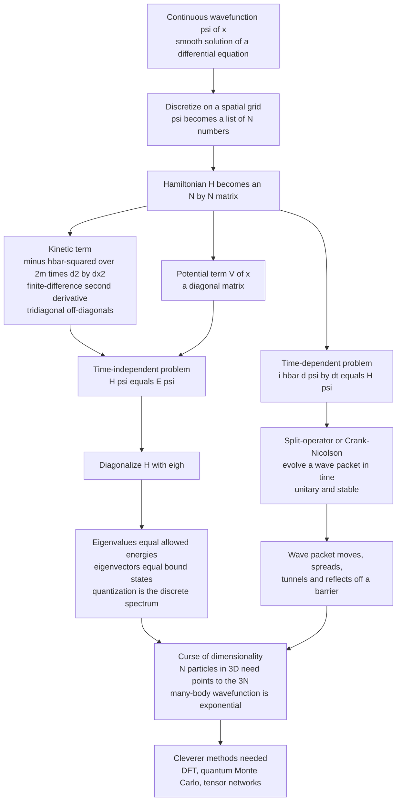

# ⚛️ Numerical Quantum Mechanics

> [!abstract] TL;DR
> The **Schrödinger equation** is exactly solvable for only a handful of textbook cases — the hydrogen atom, the harmonic oscillator, a particle in a box — while *every* real molecule, quantum dot, or custom potential lies beyond pen and paper. **Numerical quantum mechanics** cracks these by a single decisive move: **discretize the wavefunction `ψ(x)` on a spatial grid**, whereupon the Hamiltonian operator `H` becomes a **matrix** — the kinetic term `−ℏ²/2m ∂²` turns into the tridiagonal **finite-difference second-derivative** matrix, and the potential `V(x)` into a **diagonal** matrix. The time-independent problem `Hψ = Eψ` is then a **matrix eigenvalue problem**: **diagonalize `H`** and its eigenvalues *are* the allowed energies, its eigenvectors *are* the bound-state wavefunctions. **Quantization stops being mysterious — it is simply which eigenvalues the matrix has.** For dynamics, the time-dependent equation `iℏ ∂ψ/∂t = Hψ` is marched by **unitary** schemes — the **split-operator** method (alternating a kinetic step in Fourier space with a potential step in real space) or **Crank-Nicolson** — evolving wave packets that move, spread, tunnel, and scatter. This is the computational backbone of **quantum chemistry** and **condensed-matter physics**; its one hard wall is the **curse of dimensionality** — a grid for `N` particles in 3-D needs `points^(3N)` values, so the many-body wavefunction is exponentially large and forces the cleverer methods (DFT, quantum Monte Carlo, tensor networks) that fill the rest of this section.

---

## Intuition

**Analogy:** Imagine trying to find the natural tones of a strangely shaped drum. You *could* try to solve the vibration by hand, but only perfectly round or rectangular drums yield clean formulas — any real, dented, irregular drum defeats the algebra. So instead you lay a fine mesh over the drumhead, track the height at each mesh point as a big list of numbers, and write down how each point pushes on its neighbors. That web of local rules is a **matrix**, and the drum's allowed tones are exactly that matrix's **eigenvalues** — a computer finds them in a heartbeat. Quantum mechanics is the same story with the wavefunction playing the role of the drumhead: the fearsome differential equation becomes a matrix, and the mysterious *quantized* energy levels become nothing more exotic than the numbers that matrix is allowed to have.

Technically, the smooth wavefunction `ψ(x)` — an element of an infinite-dimensional Hilbert space — is replaced by its values on a finite grid `ψ(x_0), ψ(x_1), …, ψ(x_{N−1})`, a vector in an `N`-dimensional space. The Hamiltonian, an operator that would act on the whole continuous function, collapses to an `N × N` matrix that acts on that vector. Solving `Hψ = Eψ` — an eigenvalue equation for an *operator* — becomes solving it for a *matrix*, and the discrete spectrum of allowed energies **emerges** as the eigenvalue list, no clever guessing of quantum numbers required.

---

## How It Works

### Core Mechanics

1. **Why numerical at all.** The time-independent Schrödinger equation `Ĥψ = Eψ`, with `Ĥ = −(ℏ²/2m)∂²/∂x² + V(x)`, has closed-form solutions for essentially three toys: the **infinite square well** (`E_n ∝ n²`), the **quantum harmonic oscillator** (`E_n = (n+½)ℏω`), and the **hydrogen atom** (`E_n ∝ −1/n²`). Add a second electron, a realistic molecular potential, a double well, an external field, or ask about *time evolution*, and no analytic solution exists. Real quantum chemistry and condensed-matter physics therefore live or die by **numerical** solution of the Schrödinger equation. (The physics-vault note *[[Schrodinger_Equation]]* derives these analytic special cases; this note is what you do when they run out.)

2. **The key reduction — discretize `ψ` on a grid.** Choose a spatial interval `[a, b]` and a grid of `N` points spaced `dx` apart. The wavefunction becomes the vector `ψ_i = ψ(x_i)`. This is the single idea that turns calculus into linear algebra.

3. **The kinetic term becomes a tridiagonal matrix.** The second derivative is approximated by the **central finite-difference stencil**
   $$\frac{\partial^2 \psi}{\partial x^2}\Big|_{x_i} \approx \frac{\psi_{i+1} - 2\psi_i + \psi_{i-1}}{dx^2}.$$
   So `−(ℏ²/2m)∂²` maps to a matrix with `+ℏ²/(m\,dx²)` on the diagonal and `−ℏ²/(2m\,dx²)` on the two off-diagonals — a **tridiagonal** matrix. (This is exactly the second-derivative stencil from *[[Numerical_Integration_and_Differentiation]]*.)

4. **The potential becomes a diagonal matrix.** `V(x)` acts by simple multiplication `V(x_i)ψ_i`, which is a **diagonal** matrix `diag(V(x_0), …, V(x_{N−1}))`. Adding the two gives the discrete Hamiltonian `H = T + V`, an `N × N` (real, symmetric) matrix.

5. **`Hψ = Eψ` is now a matrix eigenvalue problem — diagonalize it.** Feed `H` to a symmetric eigensolver (`numpy.linalg.eigh`, LAPACK `dsyev`/`dstev` for tridiagonal). Out come `N` **eigenvalues** — the *allowed energies* — and `N` **eigenvectors** — the *bound-state wavefunctions*. The lowest eigenvalue is the ground state; the rest are excited states in order. **Quantization is literally the discrete spectrum of the matrix.** This is the "particle-in-a-matrix" or **finite-difference / matrix-Numerov** method: build `H`, call `eigh`, read off the levels. It reproduces `E_n = (n+½)ℏω` for the oscillator and the `n²` ladder for the box to many digits — the standard validation. (The linear algebra behind `eigh` lives in *[[Numerical_Linear_Algebra]]* and *[[Eigenvalues_and_Eigenvectors]]*; the general framing of physics-as-eigenproblem is the not-yet-written sibling *Eigenvalue_Problems_in_Physics*.)

6. **The shooting alternative.** Instead of building the whole matrix, you can treat the ODE as a **boundary-value problem**: guess an energy `E`, integrate the second-order ODE outward from one boundary (with **Numerov's method**, which exploits the special form of the Schrödinger ODE for `O(dx⁴)` accuracy), and check whether the wavefunction satisfies the far boundary condition. Adjust `E` (root-find on the boundary residual) until it does — you have "shot" for the eigenvalue. Shooting is memory-light and natural in 1-D; grid diagonalization gives *all* levels at once and generalizes more cleanly to higher dimensions. (The full boundary-value-and-shooting machinery is the not-yet-written sibling *Boundary_Value_Problems_and_Shooting*.)

7. **The time-dependent Schrödinger equation.** To watch quantum dynamics you solve `iℏ ∂ψ/∂t = Ĥψ`. The formal solution `ψ(t) = e^{−iĤt/ℏ}ψ(0)` is **unitary** (it conserves probability `∫|ψ|² = 1`), and good integrators must preserve that.
   - **Split-operator (spectral) method.** Since `Ĥ = T̂ + V̂` but `T̂` and `V̂` do not commute, split the short-time propagator symmetrically: `e^{−iĤ dt/ℏ} ≈ e^{−iV̂ dt/2ℏ}\,e^{−iT̂ dt/ℏ}\,e^{−iV̂ dt/2ℏ}` (Strang splitting, error `O(dt³)` per step). The **potential** step is a diagonal phase multiply in *real* space; the **kinetic** step is a diagonal phase multiply in *momentum* space, reached by an **FFT** — because `T̂ = ℏ²k²/2m` is diagonal in the Fourier basis. Alternate real ↔ momentum space via FFT: fast, unitary, and spectrally accurate. (This is the FFT/spectral idea of the not-yet-written sibling *Spectral_Methods_and_the_FFT*.)
   - **Crank-Nicolson.** An **implicit**, unconditionally stable, exactly-unitary scheme `(I + iĤ dt/2ℏ)ψ^{n+1} = (I − iĤ dt/2ℏ)ψ^n`; each step solves a tridiagonal linear system. It is the go-to when a hard-walled or non-periodic domain makes FFTs awkward.
   With either, a **Gaussian wave packet** can be launched at a barrier and filmed as it **moves, spreads** (dispersion), and **partially tunnels through / partially reflects off** the barrier — the quantum scattering picture made visible.

8. **The curse of dimensionality — the wall.** A grid of `M` points per axis for **one** particle in 3-D already needs `M³` values. For `N` particles the wavefunction `ψ(x_1, …, x_N)` lives in `3N` dimensions and the grid needs `M^{3N}` numbers. With a modest `M = 100`, three particles already demand `10^{18}` values — the many-body wavefunction is **exponentially large**. Brute-force grids are therefore viable only for **one or two particles** (or reduced coordinates). This exponential wall is *the* central difficulty of quantum simulation and the reason the field invented cleverer methods — **density functional theory**, **quantum Monte Carlo**, and **tensor networks** — that never store the full wavefunction. (The many-body physics is *[[Many_Body_Quantum_Systems]]*; the workarounds are the not-yet-written siblings *Density_Functional_Theory_and_Electronic_Structure* and *The_Variational_and_Diffusion_Monte_Carlo*.)

9. **Basis-set methods — the grid's rival.** Instead of grid points, expand `ψ = Σ_j c_j φ_j(x)` in a chosen **basis** — plane waves, Gaussians, or atomic orbitals. Projecting `Ĥψ = Eψ` onto the basis turns the PDE into a **generalized matrix eigenvalue problem** `Hc = E\,Sc` in the coefficients `c` (with overlap matrix `S`). A well-chosen basis captures the physics with far fewer unknowns than a fine grid — this is the approach of **quantum chemistry** (Hartree-Fock, configuration interaction, coupled cluster). **Grids** are simple, systematically improvable, and great for arbitrary potentials and dynamics; **basis sets** are compact and dominate electronic-structure practice. Both end at the same place: *diagonalize a matrix*.

### Flow / Architecture



---

## Key Concepts

### Secondary Level

- **Only a few quantum problems can be solved with a formula** — the atom of hydrogen, a bouncing spring (harmonic oscillator), a ball trapped in a box. Everything real is too complicated for pen and paper.
- **The computer's trick:** chop space into a grid of points and write the wavefunction as a list of numbers. The equation then becomes a big table of numbers — a **matrix**.
- **The allowed energies are the matrix's special numbers (eigenvalues).** The computer finds them instantly, so the "quantized" energy levels appear automatically instead of being guessed.
- **To watch a quantum particle move,** you nudge the list of numbers forward in tiny time steps and can literally see a wave packet slide along, spread out, and partly leak through a wall (tunneling).

### Undergraduate Level

- **Discretization:** `ψ(x) → ψ_i` on a grid; `Ĥ → H` an `N × N` matrix. Kinetic energy is the tridiagonal second-derivative stencil (`+ℏ²/m\,dx²` diagonal, `−ℏ²/2m\,dx²` off-diagonal); potential is `diag(V(x_i))`.
- **Time-independent = eigenproblem:** solve `Hψ = Eψ` with `numpy.linalg.eigh`. Ascending eigenvalues are the energy levels; eigenvectors (normalized so `Σ|ψ_i|²dx = 1`) are the stationary states. Validate against `E_n = (n+½)ℏω` (oscillator) and `E_n = n²π²ℏ²/2mL²` (box).
- **Boundary conditions & grid choice:** the box edges act like infinite walls (Dirichlet `ψ = 0`); the grid must be **wide enough** that bound states have decayed at the edges and **fine enough** (`dx` small) to resolve oscillations, or eigenvalues drift.
- **Shooting method:** integrate the ODE with **Numerov** and root-find on `E` so the far boundary condition is met — an alternative that finds one level at a time.
- **Time-dependent = unitary propagation:** `iℏ∂_tψ = Ĥψ`, evolved by split-operator (FFT-based) or Crank-Nicolson; both conserve `∫|ψ|²`. Wave packets show group-velocity motion, dispersive spreading, and barrier tunneling/reflection.

### Graduate Level

- **Operator-splitting order:** Strang (symmetric) splitting `e^{−iVdt/2}e^{−iTdt}e^{−iVdt/2}` is `O(dt³)` locally, `O(dt²)` globally, and *exactly unitary* because each factor is a unitary phase; the commutator `[T̂, V̂] ≠ 0` is the source of the splitting error, controllable via higher-order (Yoshida/Suzuki) compositions.
- **Spectral vs finite-difference kinetic energy:** representing `T̂` via FFT (`k²/2` multiply) is a **spectral** (pseudo-spectral) derivative with exponential convergence for smooth `ψ`, versus the algebraic `O(dx²)` of the 3-point stencil; the **matrix Numerov** correction restores `O(dx⁴)` for the eigenvalue problem cheaply.
- **Generalized eigenproblem in a basis:** `Hc = E\,Sc` with non-orthogonal basis → overlap matrix `S`; solved by Löwdin orthogonalization / Cholesky of `S`. This is the linear-algebra heart of Hartree-Fock and configuration interaction — variational upper bounds on the true energy.
- **Absorbing boundaries:** for scattering, a complex absorbing potential (CAP) or split-operator mask prevents unphysical wrap-around/reflection of outgoing packets on a finite grid; essential for computing transmission coefficients cleanly.
- **The exponential wall, quantitatively:** the many-body Hilbert space grows as `d^N` (local dimension `d`, `N` particles); exact diagonalization tops out near `N ≈ 20` spins. This scaling motivates **DFT** (map to a non-interacting problem via the density), **quantum Monte Carlo** (stochastic sampling of the `3N`-dimensional integral, dodging the wall but meeting the fermion **sign problem**), and **tensor networks / DMRG** (compress low-entanglement states into `poly(N)` parameters).

---

## Python Demo

```python
# Numerical solution of the SCHRODINGER equation, two ways -- numpy + matplotlib.
# Units: hbar = m = 1.
#
#   (A) TIME-INDEPENDENT: build the 1D Hamiltonian on a grid
#       (kinetic = finite-difference second-derivative matrix; potential = diagonal),
#       then DIAGONALIZE (np.linalg.eigh) to get energy EIGENVALUES + wavefunctions.
#       Potential = harmonic oscillator -> recover E_n = (n + 1/2) * omega.
#       Plot the potential with the energy levels and the eigenstates.
#
#   (B) TIME-DEPENDENT: evolve a Gaussian WAVE PACKET with the SPLIT-OPERATOR
#       method (kinetic step in Fourier space via FFT, potential step in real space)
#       and watch it MOVE, SPREAD, and partially TUNNEL through / REFLECT off a barrier.
import numpy as np
import matplotlib.pyplot as plt

hbar, m = 1.0, 1.0

# ===========================================================================
# (A) TIME-INDEPENDENT  ->  matrix eigenvalue problem
# ===========================================================================
def hamiltonian(x, V):
    """Return the finite-difference Hamiltonian matrix H = T + diag(V)."""
    N  = len(x)
    dx = x[1] - x[0]
    diag = hbar**2 / (m * dx**2) * np.ones(N) + V          # kinetic diag + potential
    off  = -hbar**2 / (2.0 * m * dx**2) * np.ones(N - 1)   # kinetic off-diagonals
    return np.diag(diag) + np.diag(off, 1) + np.diag(off, -1)

N  = 1200
x  = np.linspace(-10.0, 10.0, N)
dx = x[1] - x[0]

omega = 1.0
V_ho  = 0.5 * m * omega**2 * x**2                          # harmonic oscillator
H     = hamiltonian(x, V_ho)

E, psi = np.linalg.eigh(H)          # eigenvalues ascending, columns are eigenvectors
psi   /= np.sqrt(dx)                # normalize so sum |psi|^2 dx = 1

E_analytic = (np.arange(6) + 0.5) * hbar * omega
print("Harmonic oscillator: numerical vs analytic E_n = (n+1/2)*omega")
for n in range(6):
    print(f"  n={n}:  numeric {E[n]:.5f}   analytic {E_analytic[n]:.5f}"
          f"   error {abs(E[n]-E_analytic[n]):.2e}")

# ---- also validate the PARTICLE IN A BOX (infinite well) E_n ~ n^2 ----------
Lbox = 1.0
xb   = np.linspace(0.0, Lbox, 400)
Vbox = np.zeros(len(xb))            # zero inside; walls enforced by psi=0 at edges
Ebox, _ = np.linalg.eigh(hamiltonian(xb, Vbox))
box_analytic = (np.arange(1, 5) * np.pi)**2 * hbar**2 / (2 * m * Lbox**2)
print("\nParticle in a box: numerical vs analytic E_n = n^2 pi^2 / (2 m L^2)")
for n in range(4):
    print(f"  n={n+1}:  numeric {Ebox[n]:.4f}   analytic {box_analytic[n]:.4f}")

# ===========================================================================
# (B) TIME-DEPENDENT  ->  split-operator wave-packet propagation
# ===========================================================================
L   = 60.0
Nt  = 2048
xt  = np.linspace(-L, L, Nt, endpoint=False)
dxt = xt[1] - xt[0]
k   = 2.0 * np.pi * np.fft.fftfreq(Nt, d=dxt)     # momentum-space grid

# Rectangular barrier centered at the origin
V0   = 15.0
Vbar = np.where(np.abs(xt) < 0.5, V0, 0.0)

# Gaussian wave packet: mean momentum k0 -> energy E0 = k0^2/2 (just below V0)
x0, sigma, k0 = -25.0, 4.0, 5.0
psi0 = np.exp(-(xt - x0)**2 / (2 * sigma**2)) * np.exp(1j * k0 * xt)
psi0 /= np.sqrt(np.sum(np.abs(psi0)**2) * dxt)
E0 = k0**2 / 2.0
print(f"\nWave packet energy E0 = {E0:.2f}   barrier height V0 = {V0:.1f}"
      f"   (E0 < V0 -> tunneling regime)")

dt      = 0.005
nsteps  = 2400
Vphase  = np.exp(-1j * Vbar * dt / (2 * hbar))            # half potential step
Kphase  = np.exp(-1j * (hbar * k**2 / (2 * m)) * dt)      # full kinetic step (Fourier)

psi_t   = psi0.astype(complex)
snaps   = {0: np.abs(psi_t)**2}
snap_at = {700: 3.5, 1000: 5.0, 1400: 7.0, 2399: 12.0}   # step -> physical time
spacetime = []                                            # |psi|^2 heatmap record

for n in range(1, nsteps):
    psi_t = Vphase * psi_t                                # half potential (real space)
    psi_t = np.fft.ifft(Kphase * np.fft.fft(psi_t))      # full kinetic  (momentum space)
    psi_t = Vphase * psi_t                                # half potential (real space)
    if n in snap_at:
        snaps[n] = np.abs(psi_t)**2
    if n % 16 == 0:
        spacetime.append(np.abs(psi_t)**2)

spacetime = np.array(spacetime)
norm = np.sum(np.abs(psi_t)**2) * dxt                     # unitarity check
T = np.sum(np.abs(psi_t[xt > 0.5])**2) * dxt             # transmitted probability
R = np.sum(np.abs(psi_t[xt < -0.5])**2) * dxt            # reflected probability
print(f"final norm = {norm:.5f} (should stay 1)   "
      f"transmission T = {T:.3f}   reflection R = {R:.3f}")

# ===========================================================================
# Plots
# ===========================================================================
fig = plt.figure(figsize=(16, 9))

# (1) Harmonic potential with energy levels + eigenstates stacked at their E_n
ax1 = fig.add_subplot(2, 3, 1)
ax1.plot(x, V_ho, "k", lw=1.5, label="V(x) = 0.5 x^2")
scale = 1.3
for n in range(5):
    ax1.axhline(E[n], color="gray", ls=":", lw=0.7)
    ax1.plot(x, E[n] + scale * psi[:, n], lw=1.6)
ax1.set_xlim(-6, 6); ax1.set_ylim(-0.3, 6)
ax1.set_title("(A) Oscillator: eigenstates on the potential")
ax1.set_xlabel("x"); ax1.set_ylabel("energy  /  psi (offset)"); ax1.legend(fontsize=8)

# (2) Probability densities |psi_n|^2 stacked at their energy levels
ax2 = fig.add_subplot(2, 3, 2)
ax2.plot(x, V_ho, "k", lw=1.2)
for n in range(5):
    ax2.axhline(E[n], color="gray", ls=":", lw=0.7)
    ax2.fill_between(x, E[n], E[n] + 2.2 * np.abs(psi[:, n])**2, alpha=0.6)
ax2.set_xlim(-6, 6); ax2.set_ylim(-0.3, 6)
ax2.set_title("(A) Probability densities |psi_n|^2")
ax2.set_xlabel("x"); ax2.set_ylabel("energy  /  |psi|^2 (offset)")

# (3) Numerical vs analytic quantized levels
ax3 = fig.add_subplot(2, 3, 3)
ns = np.arange(6)
ax3.plot(ns, E_analytic, "k--", lw=1.5, label="analytic (n + 1/2) omega")
ax3.plot(ns, E[:6], "o", ms=9, mfc="none", mec="#dc2626", mew=2,
         label="numeric eigenvalues")
ax3.set_title("(A) Quantization recovered exactly")
ax3.set_xlabel("quantum number n"); ax3.set_ylabel("energy E_n")
ax3.legend(fontsize=8); ax3.grid(alpha=0.3)

# (4) Wave-packet snapshots: motion + spreading + hitting the barrier
ax4 = fig.add_subplot(2, 3, 4)
ax4.plot(xt, Vbar / V0 * 0.15, "k", lw=1.5, label="barrier")
ax4.plot(xt, snaps[0], lw=1.4, label="t = 0.0")
for step, t in snap_at.items():
    ax4.plot(xt, snaps[step], lw=1.2, label=f"t = {t:.1f}")
ax4.set_xlim(-50, 50); ax4.set_title("(B) Wave packet: move, spread, split")
ax4.set_xlabel("x"); ax4.set_ylabel("|psi|^2"); ax4.legend(fontsize=7)

# (5) Final state: reflected (left) + transmitted (right) about the barrier
ax5 = fig.add_subplot(2, 3, 5)
ax5.plot(xt, snaps[2399], color="#2563eb", lw=1.4)
ax5.axvline(0, color="k", lw=1.0)
ax5.fill_between(xt, 0, snaps[2399], where=(xt < -0.5), alpha=0.4, color="#dc2626",
                 label=f"reflected R = {R:.2f}")
ax5.fill_between(xt, 0, snaps[2399], where=(xt > 0.5), alpha=0.4, color="#16a34a",
                 label=f"transmitted T = {T:.2f}")
ax5.set_xlim(-50, 50); ax5.set_title("(B) Tunneling: reflection + transmission")
ax5.set_xlabel("x"); ax5.set_ylabel("|psi|^2"); ax5.legend(fontsize=8)

# (6) Space-time |psi|^2: the packet's world line splitting at the barrier
ax6 = fig.add_subplot(2, 3, 6)
ax6.imshow(spacetime, origin="lower", aspect="auto", cmap="magma",
           extent=[xt[0], xt[-1], 0, nsteps * dt])
ax6.axvline(0, color="cyan", lw=0.8, alpha=0.7)
ax6.set_title("(B) Space-time evolution of |psi|^2")
ax6.set_xlabel("x"); ax6.set_ylabel("time t"); ax6.set_xlim(-50, 50)

plt.tight_layout()
plt.show()
```

Running it prints the harmonic-oscillator eigenvalues matching `(n+½)ω` to five decimals — `0.50000, 1.50000, 2.50000, …` — and the particle-in-a-box levels tracking the `n²` ladder: **quantization emerges straight out of `eigh`, nothing was assumed about quantum numbers.** The **top row** is the textbook figure — the parabolic well with horizontal energy levels and the eigenstates (and their probability densities) drawn at their own energies — plus the numeric-versus-analytic level plot landing exactly on the dashed line. The **bottom row** tells the dynamical story: the Gaussian packet slides in from the left, visibly **broadens** (dispersion) as it travels, then **splits** at the barrier into a reflected lobe and a transmitted lobe; the final-state panel quantifies the split (`R` and `T` summing to ~1), and the space-time heatmap shows the incoming world-line forking into the reflected and tunneled branches. The printed `final norm ≈ 1.000` confirms the split-operator step stayed **unitary**. Raise `V0` and the transmitted lobe shrinks; thin the barrier and tunneling surges — the exponential sensitivity that underlies the scanning tunneling microscope.

---

## Real-World Applications

> **Example:** A **scanning tunneling microscope (STM)** images individual atoms by measuring the current of electrons **tunneling** across the vacuum gap between a sharp tip and a surface. The tunneling probability depends *exponentially* on the gap width — exactly the barrier-penetration effect the wave-packet demo shows — so a sub-ångström change in height swings the current by orders of magnitude, giving atomic resolution. Designing tips, interpreting images, and modeling the barrier all rest on numerically solving the Schrödinger equation for the tip-vacuum-sample potential.

- **Quantum chemistry** — molecular energies, geometries, and spectra come from solving the electronic Schrödinger equation in a basis of atomic orbitals (Hartree-Fock, configuration interaction, coupled cluster, and DFT). This is the multi-billion-dollar backbone of computational drug discovery and materials design (Gaussian, ORCA, Q-Chem, VASP). See *[[Quantum_Chemistry_and_Atomic_Orbitals]]*.
- **Semiconductor and nanostructure design** — quantum wells, quantum dots, and heterostructures are engineered by solving the (often effective-mass) Schrödinger equation for confined electrons; the discrete levels set emission wavelengths of quantum-dot displays and LEDs. See *[[Nanoscale_Physics_and_Quantum_Confinement]]* and *[[Semiconductors_and_Devices]]*.
- **Electronic band structure of solids** — the periodic-potential Schrödinger problem, solved on a `k`-space grid or plane-wave basis, yields the bands that classify metals, insulators, and semiconductors. See *[[Crystal_Structure_and_Band_Theory]]* and *[[Electronic_Band_Structure]]*.
- **Scattering, tunneling, and reaction dynamics** — chemical reaction rates, alpha decay, tunneling diodes, and STM currents are computed from time-dependent wave-packet propagation and transmission coefficients.
- **Cold atoms and quantum optics** — Bose-Einstein condensates obey the (nonlinear) Gross-Pitaevskii Schrödinger equation, routinely integrated by the split-operator method; optical-lattice and atom-interferometry experiments are designed this way.
- **Foundations of quantum simulation** — classical grid/basis solvers are both the workhorse *and* the benchmark that **quantum computers** aim to beat for the exponentially hard many-body cases. See *[[Quantum_Simulation_and_VQE]]*.

---

## Common Pitfalls

- **Grid too small or too coarse** — if the box does not extend far enough, bound states are squeezed and their energies come out too high (artificial confinement); if `dx` is too large, the finite-difference second derivative is inaccurate and levels drift. Always check convergence by widening the domain and refining `dx`.
- **Forgetting to normalize per `dx`** — `eigh` returns eigenvectors with `Σψ_i² = 1`, but physical normalization is `Σψ_i²\,dx = 1`. Skip the `1/√dx` factor and every expectation value, density, and overlap is off by a factor of `dx`.
- **Boundary conditions baked in silently** — the finite-difference matrix implicitly imposes `ψ = 0` just outside the grid (hard walls). That is correct for bound states that have decayed, but wrong if a state still has amplitude at the edge — spurious "particle-in-a-box" levels appear on top of the real spectrum.
- **Non-unitary time stepping** — a naive **forward-Euler** step `ψ^{n+1} = ψ^n − iĤ dt ψ^n/ℏ` is *unconditionally unstable* for the Schrödinger equation (its eigenvalues have magnitude > 1) and `|ψ|²` blows up. You must use a unitary scheme (split-operator or Crank-Nicolson); check that the total norm stays 1.
- **Wrap-around in split-operator scattering** — the FFT assumes periodic boundaries, so an outgoing packet re-enters from the far side and contaminates transmission/reflection numbers. Use a large enough box, stop before wrap-around, or add an absorbing (complex) potential at the edges.
- **`dt` too large for the highest momenta** — the kinetic phase `e^{−ik²dt/2}` aliases if `dt` is too big relative to the fastest-oscillating grid mode; the packet develops spurious ripples. Resolve both the shortest wavelength (`dx`) and the fastest phase (`dt`).
- **Assuming grids scale up** — a method that is elegant for one particle in 1-D is *hopeless* for the interacting many-body problem: `points^(3N)` explodes. Reaching for a full-grid solver on a 10-electron molecule is the classic beginner mistake — that regime belongs to DFT, QMC, or tensor networks.

---

## Related Concepts

- [[Schrodinger_Equation]] — the physics-vault treatment of the wave equation, its analytic special cases (box, oscillator, hydrogen), and tunneling, which this note solves numerically when the analytics run out.
- [[Quantum_Harmonic_Oscillator]] — the `E_n = (n+½)ℏω` ladder that the grid-diagonalization demo reproduces to five digits as its validation.
- [[Wave_Particle_Duality_and_Uncertainty]] — the wavefunction and momentum-space picture underlying both eigenstates and the FFT kinetic step.
- [[Perturbation_Theory]] — the analytic route to *approximate* corrections that numerical diagonalization computes *exactly* for the discretized Hamiltonian.
- [[Many_Body_Quantum_Systems]] — the exponentially large wavefunction that the curse of dimensionality makes intractable for direct grids.
- [[Eigenvalues_and_Eigenvectors]] — the linear-algebra core: quantized energies are eigenvalues, stationary states are eigenvectors of the Hamiltonian matrix.
- [[Numerical_Linear_Algebra]] — the symmetric/tridiagonal eigensolvers (`eigh`, LAPACK) and sparse linear solves behind diagonalization and Crank-Nicolson.
- [[Numerical_Integration_and_Differentiation]] — the finite-difference second-derivative stencil that discretizes the kinetic operator.
- [[Hilbert_Spaces]] — the infinite-dimensional function space whose finite-grid truncation makes the Hamiltonian a finite matrix.
- [[Spectral_Theory]] — the operator-theoretic reason a self-adjoint Hamiltonian has a real spectrum of allowed energies.
- [[Introduction_to_PDEs]] — the Schrödinger equation as a (complex, parabolic-like) PDE and its boundary/initial-value structure.
- [[Fourier_Analysis]] — the Fourier basis in which the kinetic operator is diagonal, powering the split-operator FFT step.
- [[Partial_Differential_Equations]] — the physics-vault companion on PDE types and solution methods, including the time-dependent Schrödinger equation.
- [[Quantum_Chemistry_and_Atomic_Orbitals]] — basis-set electronic-structure theory (Hartree-Fock, orbitals) that this note's matrix-eigenvalue framing underlies.
- [[Electronic_Band_Structure]] — the periodic-potential Schrödinger problem solved on a `k`-grid or plane-wave basis.
- [[Crystal_Structure_and_Band_Theory]] — Bloch states and bands, the solid-state application of numerical Schrödinger solvers.
- [[Semiconductors_and_Devices]] — quantum wells and confinement whose levels are computed exactly this way.
- [[Nanoscale_Physics_and_Quantum_Confinement]] — quantum dots/wells as engineered particles-in-a-box solved numerically.
- [[Quantum_Simulation_and_VQE]] — the quantum-computing approach aimed at the many-body cases where classical grids hit the exponential wall.
- [[Quantum_Statistical_Mechanics]] — thermal ensembles built from the very energy eigenstates this method computes.
- [[Computational_Physics_Overview]] — the map of this vault in which numerical quantum mechanics opens the Many-Body and Quantum Simulation section.

Within this Computational Physics vault, this note opens the *Many-Body and Quantum Simulation* section and leads into the not-yet-written siblings *Boundary_Value_Problems_and_Shooting* (Numerov integration and shooting for eigenvalues), *Eigenvalue_Problems_in_Physics* (the general physics-as-eigenproblem framing behind grid diagonalization), *Spectral_Methods_and_the_FFT* (the FFT/pseudo-spectral machinery of the split-operator step), *Density_Functional_Theory_and_Electronic_Structure* (the density-based escape from the exponential wall), and *The_Variational_and_Diffusion_Monte_Carlo* (the stochastic escape, and the fermion sign problem).

---

## Review Questions

1. **(Secondary/Undergraduate)** Explain in plain words why replacing the smooth wavefunction with a list of values on a grid turns "finding the allowed energy levels" into "finding a matrix's eigenvalues." Why does this make quantization feel less mysterious?
2. **(Undergraduate)** You diagonalize the finite-difference Hamiltonian for a harmonic oscillator on a grid from `−4` to `+4` and the higher eigenvalues come out noticeably *above* `(n+½)ℏω`. Give two distinct reasons this can happen and the change you would make for each.
3. **(Undergraduate)** In the split-operator method, why is the kinetic step performed in Fourier (momentum) space and the potential step in real space? What role does the FFT play, and why is the scheme unitary?
4. **(Graduate)** Contrast grid diagonalization, the shooting/Numerov method, and basis-set expansion for finding bound states: what does each cost, what does each give you (one level vs all levels), and when would you prefer each? Where does the generalized eigenproblem `Hc = E\,Sc` come from?
5. **(Graduate)** Estimate the memory to store the wavefunction of 6 electrons in 3-D on a `50`-point-per-axis grid, and use the number to explain why direct grid methods fail for real molecules. Name the three families of methods that get around this and state, in one line each, the trick each one uses.

---

## Sources

- Giordano, N. J. & Nakanishi, H., *Computational Physics*, 2nd ed. (Pearson, 2006), Ch. 10 — matrix and shooting solutions of the Schrödinger equation.
- Newman, M. E. J., *Computational Physics* (2013), Ch. 6 & 9 — eigenvalue problems and the finite-difference/relaxation solution of the Schrödinger equation in Python.
- Thijssen, J. M., *Computational Physics*, 2nd ed. (Cambridge, 2007), Ch. 2–5 — variational and basis-set methods, Hartree-Fock, and DFT for electronic structure.
- Feit, M. D., Fleck, J. A. & Steiger, A., "Solution of the Schrödinger Equation by a Spectral Method", *Journal of Computational Physics* 47 (1982), 412–433 — the split-operator FFT propagation method.
- Tannor, D. J., *Introduction to Quantum Mechanics: A Time-Dependent Perspective* (University Science Books, 2007), Ch. 11 — wave-packet dynamics and split-operator/FFT propagation.

---

#computational-physics #quantum-mechanics #schrodinger-equation #eigenvalue-problem #wave-packet
