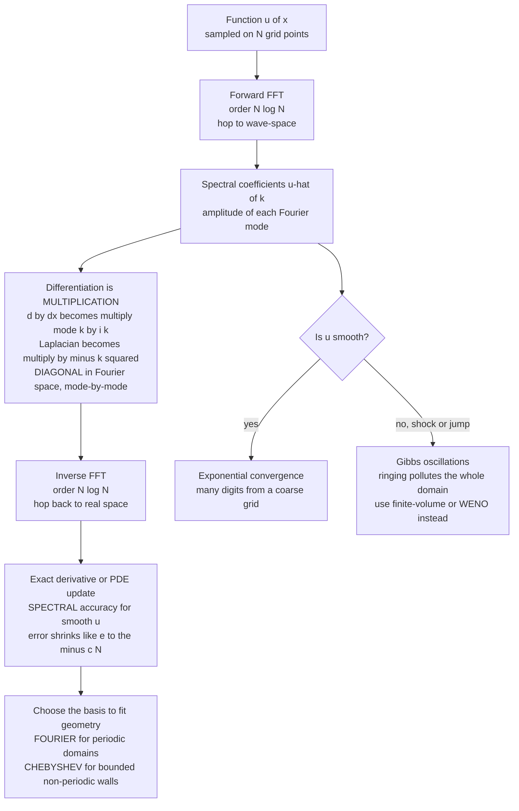

# 🌐 Spectral Methods and the FFT

> [!abstract] TL;DR
> **Spectral methods** solve PDEs and take derivatives by representing a field as a sum over **global basis functions** that span the *whole* domain — **Fourier modes** for periodic geometries, **Chebyshev polynomials** for bounded ones — rather than as local stencils on neighboring points like finite differences. The payoff is one elegant idea: in the Fourier basis **differentiation becomes multiplication** — the derivative of a mode `e^(ikx)` is just `ik·e^(ikx)`, so `∂/∂x → multiply mode k by ik` and `∂²/∂x² → multiply by −k²`, which makes the **Laplacian diagonal** and lets you solve a PDE **mode-by-mode**. Hopping to spectral space and back is made cheap by the **Fast Fourier Transform (FFT)**, which computes the discrete Fourier transform in `O(N log N)` instead of `O(N²)` — one of the most consequential algorithms ever written. For **smooth** functions the reward is **spectral (exponential) accuracy**: the error shrinks *faster than any power* of the grid spacing (`~e^(−cN)`), so a coarse grid delivers many-digit precision. The catch is **smoothness** — discontinuities and shocks trigger **Gibbs oscillations** that wreck accuracy, so spectral methods rule smooth flows and waves but cede shocks to finite-volume/WENO. They are the **gold standard** for direct numerical simulation of turbulence, for **split-operator** quantum wave-packet dynamics, and for **split-step** nonlinear optics — while the FFT itself reaches far beyond PDEs into signal processing, fast convolution, and data compression.

---

## Intuition

**Analogy:** A finite-difference derivative is like guessing a hill's steepness by squinting at the two fenceposts nearest your feet — a **local, low-order** estimate from a handful of neighbors. A spectral method does something audacious instead: it listens to your entire landscape as a **chord of pure tones**, decomposes it into perfect sine waves spanning the whole domain, and differentiates each tone *exactly* — because the slope of a sine wave is another sine wave with a known, exact amplitude. Every point in the domain votes on the answer at once, not just the two next door. For a **smooth** landscape the result is staggering: the error doesn't just shrink like `dx²`, it shrinks *faster than any power* of the grid spacing — **exponential "spectral accuracy"** — so you extract fifteen correct digits from a shockingly coarse grid.

The reason this stays practical is the **Fast Fourier Transform**. Decomposing a function into its sine-wave chord and reassembling it afterward would naively cost `O(N²)` work, but the FFT does it in `O(N log N)` — so cheap that "hop into wave-space, do the easy thing, hop back" becomes the *inner loop* of some of the most accurate simulations in science. Differentiation, the hard operation in real space, becomes plain **multiplication** in wave-space; the whole art of spectral methods is choosing to work wherever the operator you need is simplest.

---

## How It Works

### Core Mechanics

1. **Global basis vs local stencil.** A finite-difference or finite-element method is **local and low-order**: it approximates a derivative at a point from a few neighbors, giving algebraic accuracy `O(h^p)` for some fixed small `p`. A **spectral method** expands the solution in **global basis functions** `φ_n(x)` that each span the entire domain, `u(x) ≈ Σ_n a_n φ_n(x)`, and works with the coefficients `a_n`. Because every basis function feels the whole field, a handful of well-chosen modes can capture a smooth function to extraordinary precision. The trade is that the resulting operators are typically **dense** (global coupling) rather than sparse (local coupling) — which is exactly why the FFT is what makes the method affordable.

2. **The key trick: differentiation becomes multiplication.** In the Fourier basis, the building blocks are `e^(ikx)`, and the derivative of a mode is trivial:
   $$\frac{d}{dx}e^{ikx} = ik\,e^{ikx}, \qquad \frac{d^2}{dx^2}e^{ikx} = -k^2\,e^{ikx}.$$
   So if `û(k)` are the Fourier coefficients of `u`, then the coefficients of `∂u/∂x` are simply `ik·û(k)`, and those of `∂²u/∂x²` are `−k²·û(k)`. **Calculus in real space turns into arithmetic in wave-space.** The Laplacian `∇²` — the workhorse operator of diffusion, wave, Poisson, and Schrödinger problems — becomes a **diagonal** operator (multiply mode `k` by `−|k|²`). A PDE that couples every grid point in real space **decouples into independent modes** in Fourier space, and you solve it **mode-by-mode**.

3. **The FFT is the enabling engine.** The discrete Fourier transform maps `N` samples to `N` coefficients. Done directly it is a dense matrix–vector product costing `O(N²)`. The **Cooley–Tukey FFT** (1965 — with roots back to Gauss) exploits the recursive factorization of the DFT to compute it in **`O(N log N)`**. That single speedup is what makes spectral methods viable: transforming to spectral space, multiplying by `ik` or `−k²`, and transforming back costs `O(N log N)` per derivative — competitive with sparse finite differences, but *vastly* more accurate per point. The same FFT that powers spectral PDE solvers underlies the whole of digital signal processing (see *[[DFT_and_FFT]]*, *[[Fourier_Transform]]*).

4. **Spectral accuracy — the exponential payoff.** For a function that is **smooth and periodic** (infinitely differentiable), its Fourier coefficients decay *faster than any power* of `k`: `|û(k)| → 0` faster than `k^(−m)` for every `m`. Truncating at `N` modes therefore leaves an error that shrinks **exponentially**, `error ~ e^(−cN)` — the hallmark **spectral / exponential convergence**. Concretely, *doubling* the grid can add *many* correct digits at once, where a second-order finite-difference scheme would merely quarter its error. This is why spectral methods deliver double-precision (`~10^-15`) accuracy from grids an order of magnitude coarser than finite differences would need.

5. **The smoothness requirement and Gibbs oscillations.** The magic is conditional. If the solution has a **discontinuity, kink, or shock**, its Fourier coefficients decay only as `~1/k`, and the truncated series **rings** — the **Gibbs phenomenon**: persistent `~9%` overshoots near the jump and spurious oscillations spreading across the whole domain (because the basis is global, a local defect pollutes everywhere). Convergence collapses from exponential to first-order. This is the central trade-off: spectral methods **excel for smooth flows and waves** but **struggle with shocks**, where conservative **finite-volume / WENO** schemes win. Practitioners either restrict to smooth regimes, add spectral **filtering / vanishing viscosity**, or switch bases near discontinuities.

6. **Fourier vs Chebyshev — matching the basis to the geometry.** **Fourier** modes assume **periodicity**; use them on periodic or effectively-infinite domains. On a **bounded, non-periodic** domain, forcing a Fourier basis creates an artificial jump at the ends that re-triggers Gibbs. The fix is **Chebyshev** (or Legendre) polynomials, whose natural **collocation points cluster near the boundaries** — the cosine-spaced Chebyshev–Gauss–Lobatto nodes. That clustering is precisely what defeats **Runge's phenomenon**, the wild edge oscillation that ruins high-degree polynomial interpolation on *equispaced* nodes (see *[[Interpolation_and_Data_Fitting]]*). Beautifully, a Chebyshev transform can itself be computed with the FFT via a cosine change of variables, so Chebyshev methods inherit `O(N log N)` speed. Rule of thumb: **Fourier for periodic, Chebyshev for walls.**

7. **Pseudo-spectral (collocation) methods and de-aliasing.** Pure spectral (Galerkin) methods handle **nonlinear** terms awkwardly, because a product like `u·∂u/∂x` is a **convolution** in Fourier space. The practical **pseudo-spectral / collocation** approach instead evaluates **linear derivatives in spectral space** (multiply by `ik`) but computes **nonlinear products in real space**, FFT-ing back and forth each step. The hazard is **aliasing**: multiplying two fields with modes up to `k_max` generates modes up to `2k_max` that the grid cannot represent, and they **fold back** as spurious low-frequency energy that can destabilize the run. The standard cure is **de-aliasing by the 2/3 rule** — zero out the top third of the modes before transforming — so the aliased products land in the discarded band. This FFT-based pseudo-spectral loop is the workhorse of turbulence and fluid **DNS**.

8. **Split-step / operator-splitting methods.** A marquee application solves evolution equations whose operator is a sum of a part that is **diagonal in Fourier space** (kinetic / Laplacian) and a part that is **diagonal in real space** (potential / nonlinearity). **Operator splitting** alternates between them, doing each in the space where it is trivial: the **split-operator method** for the time-dependent **Schrödinger equation** (kinetic phase `e^(−ik²Δt/2)` in Fourier space, potential phase `e^(−iVΔt)` in real space), and the **split-step Fourier method** for nonlinear waves (**NLS**, **KdV**). Strang splitting is second-order, the transforms are FFT-fast, and — crucially for quantum dynamics — the scheme is **unitary** (it conserves probability / norm exactly). This connects directly to the sibling *Numerical_Quantum_Mechanics*.

### Flow / Architecture



---

## Key Concepts

### Secondary Level

- **Break a shape into pure waves.** Any smooth wiggle can be written as a sum of simple sine waves. Spectral methods do exactly that, then work with the waves instead of the raw values.
- **Slopes of sine waves are easy.** The slope of a sine wave is another sine wave you already know — so taking a derivative in wave-space is just multiplication, no messy neighbor-differencing.
- **Smooth = amazingly accurate.** For a smooth curve, a few dozen waves can match it to fifteen decimal places. That is far more accurate per grid point than the "look at your neighbors" finite-difference method.
- **Sharp jumps break it.** If the curve has a sudden cliff, the waves **ring** around it (like an echo that will not settle) and the accuracy is lost. Spectral methods love smooth things and dislike cliffs.
- **The FFT makes it fast.** A clever algorithm called the FFT lets a computer switch between "raw values" and "waves" almost instantly, which is why the whole approach is usable.

### Undergraduate Level

- **Global basis expansion:** `u(x) ≈ Σ a_n φ_n(x)` with `φ_n` spanning the whole domain (Fourier `e^(ikx)`, or Chebyshev `T_n`), versus finite differences' local stencils. Global information buys accuracy; global coupling costs dense operators (rescued by the FFT).
- **Differentiation = multiplication:** `∂/∂x ↔ ×ik`, `∂²/∂x² ↔ ×(−k²)`. The Laplacian is **diagonal** in Fourier space, so linear constant-coefficient PDEs decouple mode-by-mode. The heat equation's `û(k,t)=û(k,0)e^(−αk²t)` is the exact mode solution (cf. *[[The_Heat_and_Diffusion_Equation]]*).
- **FFT complexity:** `O(N log N)` vs `O(N²)` for the naive DFT — the Cooley–Tukey factorization; the practical enabler.
- **Spectral accuracy:** smooth periodic ⇒ Fourier coefficients decay super-algebraically ⇒ truncation error `~e^(−cN)`. Compare finite differences' fixed `O(h^p)`.
- **Gibbs phenomenon:** a discontinuity forces `|û(k)|~1/k`, giving persistent `~9%` overshoot and domain-wide ringing; exponential convergence degrades to first order.
- **Basis choice:** Fourier for **periodic**; Chebyshev/Legendre for **bounded/non-periodic**, with boundary-clustered nodes that defeat Runge's phenomenon of equispaced polynomial interpolation.

### Graduate Level

- **Pseudo-spectral collocation & aliasing.** Nonlinear products are convolutions in spectral space; evaluate them in physical space instead (transform pair each step). Multiplying two band-limited fields generates modes beyond `k_max` that **alias** back as `k_alias = k − N`. **De-alias with the 2/3 rule** (Orszag): retain only the lowest `2N/3` modes so quadratic-nonlinearity aliases fall in the truncated band. Essential for stable turbulence DNS.
- **Operator splitting & unitarity.** For `i∂ψ/∂t = (T̂ + V̂)ψ` with `T̂` diagonal in Fourier space and `V̂` diagonal in real space, **Strang splitting** `e^{-iV̂Δt/2}e^{-iT̂Δt}e^{-iV̂Δt/2}` is second-order in `Δt`, symplectic, and **exactly unitary** (norm-preserving), because each factor is an exponential of a Hermitian operator. Higher-order (Yoshida) compositions push accuracy without sacrificing unitarity.
- **Spectral differentiation matrices.** In collocation form, the derivative is a **dense** matrix `D` acting on nodal values; for Chebyshev nodes `D` has entries with the classic `c_i/c_j` structure, and `D²` gives the second derivative for boundary-value problems. Fourier differentiation can be applied as a matrix or, more cheaply, via the FFT.
- **Resolution & the `2π/N`-per-wavelength gain.** Spectral methods approach the information-theoretic limit of **two points per wavelength** (Nyquist), versus the `~10–20` points-per-wavelength rule of low-order finite differences — a decisive advantage for wave propagation with **near-zero numerical dispersion** (contrast the grid-dispersion of leapfrog in *[[The_Wave_Equation_and_Hyperbolic_PDEs]]*).
- **Spherical harmonics for the sphere.** Global weather/climate models use a **spectral transform** in spherical-harmonic space, where the Laplace–Beltrami operator is diagonal, combined with fast Legendre transforms — the historical backbone of ECMWF-class forecasting.
- **Time-stepping stiffness.** In Fourier space the linear operator's eigenvalues span `0` to `~−k_max²` (or `~−k_max⁴` for KdV), so explicit time-stepping is stiff; **integrating-factor (ETD/exponential) methods** solve the linear part exactly per mode and only step the nonlinearity, restoring large stable steps.

---

## Python Demo

```python
# SPECTRAL METHODS via the FFT  --  numpy + matplotlib only.
#
# (a) SPECTRAL DIFFERENTIATION vs FINITE DIFFERENCE:
#     differentiate a smooth periodic function with the FFT (transform,
#     multiply mode k by i*k, inverse-transform) and compare the max error
#     to a 2nd-order central finite difference. The spectral error PLUNGES to
#     machine precision (~1e-13) while finite differences plateau at O(h^2)
#     -- a hands-on demonstration of "spectral accuracy" for smooth functions.
#
# (b) SPECTRAL PDE SOLVING -- the time-dependent Schrodinger equation by the
#     SPLIT-OPERATOR (split-step Fourier) method:
#         i d(psi)/dt = -1/2 d^2(psi)/dx^2 + V(x) psi     (hbar = m = 1)
#     The kinetic (Laplacian) part is DIAGONAL in Fourier space -- each mode
#     just picks up a phase exp(-i k^2 dt/2) -- while the potential is diagonal
#     in real space. A Gaussian wave packet sloshes in a harmonic well; the
#     method is fast AND unitary (probability/norm conserved to ~1e-14).

import numpy as np
import matplotlib.pyplot as plt

# =========================================================================
# (a) SPECTRAL DIFFERENTIATION vs FINITE DIFFERENCE
# =========================================================================
def spectral_deriv(u, L):
    """First derivative of a periodic sampled function via the FFT."""
    N  = u.size
    k  = 2 * np.pi * np.fft.fftfreq(N, d=L / N)   # angular wavenumbers
    ik = 1j * k
    ik[N // 2] = 0.0                              # zero Nyquist -> real 1st deriv
    return np.real(np.fft.ifft(ik * np.fft.fft(u)))

def fd_deriv(u, dx):
    """2nd-order central finite difference on a periodic grid."""
    return (np.roll(u, -1) - np.roll(u, 1)) / (2 * dx)

L  = 2 * np.pi
Ns = np.array([8, 12, 16, 24, 32, 48, 64, 96, 128])
err_spec, err_fd = [], []
for N in Ns:
    x  = L * np.arange(N) / N                     # periodic grid (endpoint excluded)
    dx = L / N
    u        = np.exp(np.sin(x))                  # smooth, periodic test function
    du_exact = np.cos(x) * np.exp(np.sin(x))      # analytic derivative
    err_spec.append(np.max(np.abs(spectral_deriv(u, L) - du_exact)))
    err_fd.append(np.max(np.abs(fd_deriv(u, dx)       - du_exact)))
err_spec, err_fd = np.array(err_spec), np.array(err_fd)

print("  N    spectral-error   finite-diff-error")
for N, es, ef in zip(Ns, err_spec, err_fd):
    print(f"{N:4d}     {es:.3e}       {ef:.3e}")

# =========================================================================
# (b) SPLIT-OPERATOR SCHRODINGER  --  Laplacian diagonal in Fourier space
# =========================================================================
Nx = 512
Lx = 20.0
x  = np.linspace(-Lx / 2, Lx / 2, Nx, endpoint=False)
dx = x[1] - x[0]
k  = 2 * np.pi * np.fft.fftfreq(Nx, d=dx)         # wavenumbers for the FFT

omega = 1.0
V = 0.5 * omega**2 * x**2                          # harmonic well

# initial state: ground-state-width Gaussian displaced to x0 -> a coherent state
x0, sigma = 4.0, 1.0 / np.sqrt(omega)
psi = (1.0 / (np.pi * sigma**2))**0.25 * np.exp(-(x - x0)**2 / (2 * sigma**2))
psi = psi.astype(complex)

dt     = 0.005
T      = 2 * np.pi / omega                         # one classical period
nsteps = int(round(T / dt))

expV_half = np.exp(-0.5j * V * dt)                 # half potential kick (real space)
expK      = np.exp(-0.5j * (k**2) * dt)            # full kinetic drift (Fourier space)

def norm(p):
    return np.sqrt(np.sum(np.abs(p)**2) * dx)

psi /= norm(psi)
snap_times = [0.0, T / 4, T / 2, 3 * T / 4]
snap_steps = [int(round(t / dt)) for t in snap_times]
snaps = {}
history = np.empty((nsteps + 1, Nx))
norms   = np.empty(nsteps + 1)

for n in range(nsteps + 1):
    history[n] = np.abs(psi)**2
    norms[n]   = norm(psi)
    if n in snap_steps:
        snaps[n] = np.abs(psi)**2
    # Strang split-step:  half-V  ->  full-K  ->  half-V
    psi = expV_half * psi
    psi = np.fft.ifft(expK * np.fft.fft(psi))
    psi = expV_half * psi

print(f"\nnorm drift over one period: {abs(norms.max() - norms.min()):.2e}  (unitary)")

# ==============================  plots  ==================================
fig, ax = plt.subplots(1, 3, figsize=(16, 5))

# (a) convergence: spectral vs finite difference
ax[0].loglog(Ns, np.maximum(err_spec, 1e-17), "o-", color="#2563eb",
             label="spectral (FFT)")
ax[0].loglog(Ns, err_fd, "s-", color="#d97706", label="finite difference")
ax[0].loglog(Ns, 20.0 / Ns**2, "k--", lw=1, label="reference slope  N^-2")
ax[0].set_xlabel("N  (grid points)"); ax[0].set_ylabel("max derivative error")
ax[0].set_title("(a) SPECTRAL ACCURACY\nspectral error hits machine precision")
ax[0].legend(fontsize=8); ax[0].grid(alpha=0.3, which="both")

# (b) wave-packet snapshots over one classical period
Vs = V / V.max() * snaps[snap_steps[0]].max()      # scaled potential for context
ax[1].plot(x, Vs, color="gray", lw=1, ls=":", label="harmonic well V(x)")
cols = ["#111111", "#2563eb", "#16a34a", "#dc2626"]
for n, c, t in zip(snap_steps, cols, snap_times):
    ax[1].plot(x, snaps[n], color=c, label=f"t = {t:.2f}")
ax[1].set_xlim(-8, 8)
ax[1].set_xlabel("x"); ax[1].set_ylabel("|psi|^2")
ax[1].set_title("(b) SPLIT-OPERATOR Schrodinger\npacket sloshes in the well")
ax[1].legend(fontsize=8)

# (b) space-time image: the packet oscillates back and forth
im = ax[2].imshow(history, aspect="auto", origin="lower", cmap="inferno",
                  extent=[x[0], x[-1], 0, T])
ax[2].set_xlim(-8, 8)
ax[2].set_xlabel("x"); ax[2].set_ylabel("time")
ax[2].set_title("(b) space-time |psi|^2\nunitary: norm conserved ~1e-14")
fig.colorbar(im, ax=ax[2], fraction=0.046)

plt.tight_layout(); plt.show()
```

Running it prints a convergence table and one norm-drift number. **Panel (a)** is the headline: the finite-difference error falls along a straight `N^(−2)` line (halving `h` quarters the error, forever), while the **spectral** error nosedives — dropping many orders of magnitude per grid doubling and slamming into the `~10^(−13)` machine-precision floor by `N ≈ 40`. That cliff *is* **spectral accuracy**: the smooth `e^(sin x)` is resolved to full double precision by a couple of dozen points. **Panel (b)** shows the split-operator solution — a Gaussian wave packet released off-center in a harmonic well slides down, through the center, and up the far side, a quantum **coherent state** oscillating like a classical particle. The kinetic step is a single `exp(−ik²Δt/2)` multiply in Fourier space (the Laplacian is diagonal there); the potential step is a single `exp(−iVΔt)` multiply in real space. **Panel (c)** is the space-time picture of `|ψ|²` tracing that sinusoidal sloshing, and the printed **norm drift of ~10^(−14)** confirms the method is **unitary** — probability is conserved to machine precision, exactly as quantum mechanics demands.

---

## Real-World Applications

> **Example:** **Direct numerical simulation (DNS) of homogeneous isotropic turbulence** is the gold-standard use of pseudo-spectral methods. Codes evolve the incompressible **Navier–Stokes** equations in a triply-periodic box entirely in Fourier space: the viscous Laplacian and the pressure-projection (a Poisson solve, `p̂ = −ik·(nonlinear term)/k²`) are **diagonal and trivial** there, while the nonlinear advection `u·∇u` is formed in physical space and **de-aliased by the 2/3 rule** before transforming back. The FFT is the entire cost of the simulation. Landmark runs — from Kaneda's `4096³` Earth-Simulator DNS onward — resolve every turbulent scale down to the Kolmogorov length with an accuracy per grid point that no finite-difference method can match, which is why spectral DNS defines the reference data for turbulence theory and subgrid-model calibration (see *[[Turbulence_and_Instabilities]]*).

- **Quantum wave-packet dynamics** — the **split-operator FFT** method propagates the time-dependent Schrödinger equation for molecular dynamics, photodissociation, tunneling, and strong-field / attosecond physics; it is fast, unitary, and the default for grid-based quantum dynamics (see *[[Schrodinger_Equation]]* and the sibling *Numerical_Quantum_Mechanics*).
- **Nonlinear fiber optics and photonics** — the **split-step Fourier method** solves the **nonlinear Schrödinger equation** governing pulse propagation in optical fibers: dispersion (a `−k²`-type operator) is applied in Fourier space, the Kerr nonlinearity in real space, alternating each `Δz`. It is the standard tool for soliton transmission and supercontinuum modeling.
- **Weather and climate models** — **global spectral models** (ECMWF's IFS, historically NCEP) represent fields in **spherical harmonics**, where the Laplacian is diagonal and horizontal derivatives are exact; the spectral-transform method dominated numerical weather prediction for decades.
- **Fast Poisson / Helmholtz solvers** — on periodic or separable domains, `∇²u = f` is solved in one shot by `û = −f̂/k²` — an **`O(N log N)`** direct solver used inside incompressible-flow projection steps, electrostatics, and image processing.
- **The FFT's broader reach** — far beyond PDEs, the FFT powers **fast convolution and correlation**, **spectral analysis** of signals, **polynomial and big-integer multiplication**, audio/image **compression** (the DCT in JPEG/MP3 is an FFT relative), and even convolution layers in some ML pipelines — a foundational computational primitive.

---

## Common Pitfalls

- **Applying Fourier methods to non-periodic data** — a function that does not wrap around cleanly has an implicit jump at the domain edge, which re-triggers **Gibbs ringing** across the whole solution. Use a **Chebyshev** basis (or a windowed / extended domain) for bounded, non-periodic problems; do not force periodicity where there is none.
- **Ignoring Gibbs on discontinuities/shocks** — spectral accuracy silently degrades to first-order the moment a shock forms, and the oscillations spread everywhere because the basis is global. For shock-dominated flows use **finite-volume/WENO**, or add spectral **filtering / spectral viscosity** to tame the ringing.
- **Forgetting to de-alias nonlinear terms** — computing `u²` or `u·∂u/∂x` in physical space folds high-mode energy back as spurious low modes; without the **2/3-rule** truncation this aliasing can accumulate and **blow up** a turbulence run. De-aliasing is not optional in pseudo-spectral codes.
- **Mishandling the Nyquist mode** — for an **even** `N`, the top wavenumber `k = N/2` is ambiguous in sign; leaving it in a **first**-derivative multiplier produces a spurious imaginary part or a sawtooth artifact. Zero the Nyquist mode for odd-order derivatives (as the demo does with `ik[N//2] = 0`).
- **Wavenumber bookkeeping errors** — mixing up FFT ordering (`fftfreq` returns positive frequencies then negatives), forgetting the `2π/L` scaling, or misaligning the grid with `endpoint=True` (which double-counts the periodic point) are the most common sources of a "spectral" derivative that is quietly wrong by a constant factor.
- **Explicit time-stepping stiffness** — because the linear operator's eigenvalues reach `~−k_max²` (or `~−k_max⁴` for KdV-type equations), naive explicit steps are throttled to tiny `Δt`. Use **integrating-factor / exponential time-differencing** methods that treat the (diagonal) linear part exactly.
- **Assuming spectral is always better** — for **non-smooth** solutions, **complex geometries**, or problems needing strict local conservation and shock capturing, low-order finite-volume/finite-element methods are more robust. Spectral accuracy is a reward for smoothness, not a free lunch.

---

## Related Concepts

- [[DFT_and_FFT]] — the discrete Fourier transform and the `O(N log N)` Cooley–Tukey algorithm that make every spectral method affordable.
- [[Fourier_Transform]] — the continuous transform and the `∂/∂x ↔ ik` differentiation property at the heart of the method.
- [[Fourier_Series]] — expansion of a periodic function in the global Fourier basis, the mathematical foundation of Fourier spectral methods.
- [[Sampling_Theorem]] — Nyquist sampling and aliasing, which set the two-points-per-wavelength resolution limit and the need for de-aliasing.
- [[Fourier_Analysis]] — the mathematics-vault treatment of Fourier series/transforms and mode decomposition.
- [[Fourier_Analysis_and_Integral_Transforms]] — the physics-methods view of Fourier and Green's-function techniques for PDEs.
- [[Introduction_to_PDEs]] — the elliptic/parabolic/hyperbolic classification and separation-of-variables that spectral methods discretize.
- [[Partial_Differential_Equations]] — the analytic PDE machinery whose numerical counterpart this note develops.
- [[The_Heat_and_Diffusion_Equation]] — the parabolic PDE whose exact Fourier-mode solution `û(k,t)=û(k,0)e^(−αk²t)` is spectral solving in its purest form.
- [[The_Wave_Equation_and_Hyperbolic_PDEs]] — the hyperbolic sibling; spectral methods give near-zero numerical dispersion but demand smoothness at shocks.
- [[The_Poisson_and_Laplace_Equation]] — the elliptic solve `û = −f̂/k²` that becomes an `O(N log N)` one-shot inversion in Fourier space.
- [[Interpolation_and_Data_Fitting]] — Runge's phenomenon and Chebyshev-node clustering, the reason non-periodic spectral methods use Chebyshev rather than equispaced polynomials.
- [[Numerical_Integration_and_Differentiation]] — the local finite-difference stencils whose polynomial accuracy spectral methods dramatically outperform for smooth data.
- [[Schrodinger_Equation]] — the quantum evolution equation solved by the unitary split-operator FFT method in the demo.
- [[Turbulence_and_Instabilities]] — homogeneous turbulence, whose gold-standard DNS is pseudo-spectral.
- [[Quantum_Fourier_Transform_and_Phase_Estimation]] — the quantum-computing analogue of the FFT, `O(log²N)` on a superposition, powering Shor's algorithm and phase estimation.

Within this Computational Physics vault, this note anchors the many-body and quantum-simulation section and connects to the not-yet-written siblings *Numerical_Quantum_Mechanics* (grid, split-operator, and imaginary-time methods for the Schrödinger equation that build directly on the split-step machinery here), *Finite_Difference_Methods* (the local, low-order stencils and von Neumann stability that spectral methods trade global accuracy against), and *The_Reach_and_Future_of_Computational_Physics* (where the FFT's role as a foundational primitive across simulation, signal processing, and machine learning is placed in the bigger picture).

---

## Review Questions

1. **(Secondary)** A finite-difference derivative looks only at a point's nearest neighbors, while a spectral method uses information from *every* point in the domain. For a *smooth* curve, why does the "listen to the whole thing as a chord of sine waves" strategy give so much more accuracy per grid point — and what kind of feature (a smooth hill vs a sudden cliff) would break it?
2. **(Undergraduate)** Explain, using `d/dx e^(ikx) = ik e^(ikx)`, why the Laplacian is *diagonal* in Fourier space and why that makes the heat equation solvable mode-by-mode as `û(k,t) = û(k,0) e^(−αk²t)`. Then explain what "spectral accuracy" means and how it differs from a finite-difference scheme's `O(h²)`.
3. **(Undergraduate)** You need to solve a smooth PDE on (a) a periodic ring, and (b) a finite rod with fixed ends. Which basis — Fourier or Chebyshev — do you choose for each, and what goes wrong if you pick the other? Tie your answer to the Gibbs phenomenon and to Runge's phenomenon.
4. **(Graduate)** In a pseudo-spectral turbulence code you evaluate the nonlinear term `u·∇u` in physical space. Explain the aliasing error this introduces, derive why the **2/3 rule** removes it for a quadratic nonlinearity, and describe one alternative de-aliasing strategy.
5. **(Graduate)** The split-operator method for the Schrödinger equation applies `e^(−iVΔt/2) e^(−iT̂Δt) e^(−iVΔt/2)`. Explain why each factor is applied in the space where its operator is diagonal, why the composite step is exactly *unitary* (norm-conserving), and what order of accuracy Strang splitting achieves. Contrast this with a naive explicit finite-difference time step, which is *not* unitary.

---

## Sources

- Trefethen, L. N., *Spectral Methods in MATLAB* (SIAM, 2000) — the definitive hands-on introduction to Fourier and Chebyshev spectral differentiation and spectral accuracy.
- Boyd, J. P., *Chebyshev and Fourier Spectral Methods*, 2nd ed. (Dover, 2001) — comprehensive treatment of basis choice, aliasing, de-aliasing, and pseudo-spectral methods.
- Canuto, C., Hussaini, M. Y., Quarteroni, A. & Zang, T. A., *Spectral Methods: Fundamentals in Single Domains* (Springer, 2006) — rigorous theory and application to fluid dynamics / DNS.
- Cooley, J. W. & Tukey, J. W., "An algorithm for the machine calculation of complex Fourier series", *Mathematics of Computation* 19 (1965), 297–301 — the FFT paper.
- Feit, M. D., Fleck, J. A. & Steiger, A., "Solution of the Schrödinger equation by a spectral method", *J. Comput. Phys.* 47 (1982), 412–433 — the split-operator FFT method for quantum dynamics.
- Orszag, S. A., "On the elimination of aliasing in finite-difference schemes by filtering high-wavenumber components", *J. Atmos. Sci.* 28 (1971), 1074 — the 2/3 de-aliasing rule.

---

#computational-physics #spectral-methods #FFT #spectral-accuracy #fourier
