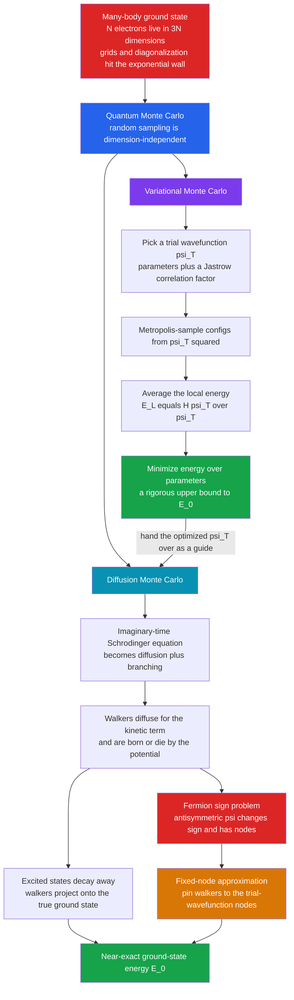

# ⚛️ The Variational and Diffusion Monte Carlo (Quantum Monte Carlo)

> [!abstract] TL;DR
> The wavefunction of even 10 electrons lives in a **30-dimensional space**, and it gets 3 dimensions worse per electron — grids and matrix diagonalization (the tools of the *Numerical_Quantum_Mechanics* sibling) hit an **exponential wall** past a handful of particles. **Quantum Monte Carlo (QMC)** escapes the same way classical Monte Carlo beats the curse of dimensionality: **random sampling doesn't care about dimension**. **Variational Monte Carlo (VMC)** picks a parametrized trial wavefunction, uses the Metropolis algorithm to sample $|\psi_T|^2$, and minimizes the average **local energy** — giving a rigorous **upper bound** to the ground-state energy (the variational principle). **Diffusion Monte Carlo (DMC)** goes further: it maps the **imaginary-time Schrödinger equation** onto a **diffusion-plus-branching random walk** whose surviving walkers **project out the near-exact ground state**. The one deep obstacle is the **fermion sign problem** — antisymmetric wavefunctions change sign, breaking the probability interpretation — tamed in practice by the **fixed-node approximation**. QMC delivers benchmark-quality energies for molecules, solids, and quantum matter, and calibrates cheaper methods like DFT.

## Intuition

**Analogy:** Imagine you must map where a swarm of gnats hovers around a lamp, but you are forbidden from ever gridding the room. Instead you release a cloud of glowing "walkers" and simply let them wander — and crucially, you make walkers **breed where life is easy** (near the lamp, low energy) and **die where life is hard** (far away, high energy). Wait a while and the walker cloud settles into *exactly* the shape of the swarm, no grid required. That is Quantum Monte Carlo. The many-electron wavefunction is far too vast to tabulate on any grid — but random walkers don't care how many dimensions the room has. **Variational** Monte Carlo throws walkers into a *guessed* cloud shaped like $|\psi_T|^2$ and measures its energy, tuning the guess to squeeze the energy as low as possible. **Diffusion** Monte Carlo does something more magical: it lets the walkers **diffuse under the Schrödinger equation itself**, and by breeding-and-dying they naturally migrate to the true lowest-energy state — the computer finds the quantum ground state through a kind of **survival of the fittest**.

The reason random sampling wins is dimension-independence. A grid with $M$ points per axis needs $M^{3N}$ cells for $N$ particles — hopeless at $N \gtrsim 6$. But a Monte Carlo estimate's error shrinks as $1/\sqrt{K}$ in the number of samples $K$ **regardless of dimension** (the sibling *Monte_Carlo_Integration* makes this precise). QMC turns the crushing $3N$-dimensional integral $\langle H \rangle$ into an average over sampled configurations, and the exponential wall dissolves into a polynomial cost.

---

## How It Works

### The exponential wall of the many-body problem

The state of $N$ interacting quantum particles is a single function $\Psi(\mathbf{r}_1, \mathbf{r}_2, \dots, \mathbf{r}_N)$ living in a **$3N$-dimensional configuration space**. Solving the [[Schrodinger_Equation]] on a grid, or diagonalizing the Hamiltonian matrix, costs $\sim M^{3N}$ — for 10 electrons on a coarse 10-point-per-axis grid that is $10^{30}$ numbers, more than any computer will ever hold. This is the **curse of dimensionality**, and it stops direct methods dead at a few particles (see the sibling *Numerical_Quantum_Mechanics* for the one- and two-particle grid methods that QMC replaces). Configuration-interaction and exact diagonalization delay the wall but never break it; the cost still grows exponentially.

### The variational principle: the foundation

QMC rests on one of the most useful theorems in quantum mechanics. For **any** normalizable trial wavefunction $\psi_T$, the energy expectation is a rigorous **upper bound** to the true ground-state energy $E_0$:

$$
E[\psi_T] = \frac{\langle \psi_T | \hat H | \psi_T \rangle}{\langle \psi_T | \psi_T \rangle} \; \ge \; E_0 .
$$

The proof is one line: expand $\psi_T = \sum_n c_n \phi_n$ in the exact eigenstates $\hat H \phi_n = E_n \phi_n$; then $E[\psi_T] = \sum_n |c_n|^2 E_n \big/ \sum_n |c_n|^2 \ge E_0$ because every $E_n \ge E_0$. Equality holds **only** when $\psi_T$ is the exact ground state. So minimizing $E[\psi_T]$ over the parameters of $\psi_T$ drives the trial state toward the ground state *from above* — you can never accidentally go below the answer, which makes the energy a clean, monotone quality metric. (This is the same variational idea behind [[Quantum_Simulation_and_VQE]] on quantum hardware, where a quantum computer prepares $\psi_T$ and a classical optimizer tunes it.)

### Variational Monte Carlo (VMC)

The obstacle is that $E[\psi_T]$ is a $3N$-dimensional integral. VMC evaluates it by **importance sampling**. Rewrite it as an average of the **local energy** $E_L(\mathbf{R}) \equiv \dfrac{\hat H \psi_T(\mathbf{R})}{\psi_T(\mathbf{R})}$ weighted by the probability density $\rho(\mathbf{R}) = |\psi_T(\mathbf{R})|^2 / \int |\psi_T|^2$:

$$
E[\psi_T] = \int \rho(\mathbf{R})\, E_L(\mathbf{R})\, d\mathbf{R} \;=\; \big\langle E_L \big\rangle_{\rho}.
$$

Now sample configurations $\mathbf{R}$ from $\rho = |\psi_T|^2$ with the **Metropolis algorithm** ([[The_Metropolis_Algorithm_and_MCMC]]) — only the *ratio* $|\psi_T(\mathbf{R}')|^2 / |\psi_T(\mathbf{R})|^2$ is needed, so the intractable normalization cancels — and average $E_L$ over the samples. The recipe:

1. Choose a trial form $\psi_T(\mathbf{R}; \boldsymbol\alpha)$ with variational parameters $\boldsymbol\alpha$ (often a Slater determinant times a **Jastrow factor** $e^{\sum_{i<j} u(r_{ij})}$ that explicitly builds in electron-electron correlation and the Kato cusp).
2. Run Metropolis to draw many configurations from $|\psi_T|^2$.
3. At each configuration compute $E_L = \hat H \psi_T / \psi_T$ and accumulate its mean and variance.
4. **Optimize** $\boldsymbol\alpha$ to minimize $\langle E_L \rangle$ (or its variance — a low variance signals a good $\psi_T$).

A beautiful diagnostic: when $\psi_T$ is *exactly* an eigenstate, $E_L$ is a **constant** everywhere, so its Monte Carlo variance is **zero**. The closer $\psi_T$ is to truth, the smaller the statistical error — the **zero-variance principle**. VMC's ceiling is set entirely by the *flexibility of the trial form*: it can never do better than the best $\psi_T$ you can write down.

### Diffusion Monte Carlo (DMC): projecting out the exact ground state

DMC removes that ceiling. The trick is **imaginary time**: substitute $t \to -i\tau$ in the time-dependent Schrödinger equation. The oscillating $e^{-iE_n t}$ becomes a **decaying** $e^{-E_n \tau}$, so any starting state $\Psi(0) = \sum_n c_n \phi_n$ evolves as

$$
\Psi(\tau) = \sum_n c_n\, e^{-(E_n - E_T)\tau}\, \phi_n \;\xrightarrow[\tau \to \infty]{}\; c_0\, e^{-(E_0 - E_T)\tau}\, \phi_0 .
$$

Every excited state decays *faster* than the ground state, so after long imaginary time **only $\phi_0$ survives** — the evolution **projects onto the ground state**. And the equation governing this,

$$
-\frac{\partial \Psi}{\partial \tau} = -\tfrac{1}{2}\nabla^2 \Psi + \big(V(\mathbf{R}) - E_T\big)\Psi,
$$

is precisely a **diffusion equation** (the $-\tfrac12\nabla^2$ kinetic term, connecting to [[The_Heat_and_Diffusion_Equation]]) **plus a branching source/sink term** (the $(V - E_T)\Psi$ potential term). So simulate it with an ensemble of **walkers** in configuration space:

- **Diffuse** each walker by a Gaussian random step — this *is* the kinetic energy, a random walk with diffusion constant $D = \tfrac12$.
- **Branch** each walker: it is replicated or killed with a rate set by $e^{-(V(\mathbf{R}) - E_T)\,\delta\tau}$. Walkers in **low-potential** regions **multiply**; walkers in **high-potential** regions **die**.
- **Control** the reference energy $E_T$ so the total population stays roughly constant; the value of $E_T$ that keeps the population steady *is* the ground-state energy $E_0$.

Left alone, pure DMC is noisy because branching wildly. **Importance sampling** fixes this: multiply in a **guiding wavefunction** (usually the optimized VMC $\psi_T$), so walkers are pushed by a drift velocity $\nabla \ln|\psi_T|$ toward high-amplitude regions and branch on the *smooth* local energy $E_L$ instead of the raw potential. This is why VMC and DMC are partners — VMC produces the guide that makes DMC efficient and accurate. With a good guide, DMC gives **near-exact ground-state energies**.

### The fermion sign problem

Here lies the one fundamental obstacle. DMC treats $\Psi$ as a *probability-like density of walkers* — but that only makes sense if $\Psi \ge 0$. **Bosons** have nodeless, positive ground states, so bosonic DMC is essentially exact. **Fermions** (electrons) obey the Pauli principle: their wavefunction must be **antisymmetric**, so it necessarily **changes sign** and has **nodes**. Representing a signed function with positive walker counts forces you to track cancelling $+$ and $-$ populations whose difference is swamped by exponentially growing noise — the **signal-to-noise ratio decays as $e^{-\Delta \tau}$**. This is the notorious **fermion sign problem**, and in full generality it is believed to be exponentially hard (formally NP-hard) — a deep barrier shared across quantum simulation, including the reason quantum computers are of interest for these problems.

The standard, remarkably effective workaround is the **fixed-node approximation**: **fix the nodal surface** of $\Psi$ to that of the trial wavefunction $\psi_T$, and run ordinary (positive) DMC independently inside each nodal pocket, forbidding walkers from crossing the nodes. This restores a well-defined probability distribution and gives a rigorous **variational upper bound** whose *only* error is the inexactness of the assumed nodes. Because ground-state nodes are often well approximated, fixed-node DMC typically recovers **90-99%+ of the correlation energy** and is the workhorse of practical electronic-structure QMC. Improving the nodes (backflow, better $\psi_T$, released-node methods) is an active frontier.

### Flow / Architecture



---

## Key Concepts

### Secondary
- The quantum "wavefunction" of many particles is a function of *all their positions at once*, so with many particles it has *far too many variables* to draw on any grid.
- Instead of a grid, scatter **random points** and average — random sampling works no matter how many variables there are.
- **Variational** version: guess a shape for the cloud, measure its energy, and adjust the guess to make the energy as *low* as possible. You can never dip below the true answer.
- **Diffusion** version: let random "walkers" wander and let them **multiply where energy is low and die where it is high**; the survivors settle into the true lowest-energy state.

### Undergraduate
- **Variational principle:** $E[\psi_T] = \langle \psi_T|\hat H|\psi_T\rangle / \langle \psi_T|\psi_T\rangle \ge E_0$ for any $\psi_T$; equality only at the exact ground state. Minimizing over parameters approaches $E_0$ from above.
- **Local energy** $E_L = \hat H \psi_T / \psi_T$; the energy is its average over $|\psi_T|^2$, and $\text{Var}(E_L) \to 0$ as $\psi_T \to$ eigenstate (**zero-variance principle**).
- **VMC** = Metropolis-sample $|\psi_T|^2$, average $E_L$, optimize parameters. Only $|\psi_T|^2$ *ratios* are needed, so normalization never appears.
- **Imaginary time** $t \to -i\tau$ turns Schrödinger's equation into a **diffusion + branching** equation; long-$\tau$ evolution kills excited states and leaves the ground state.
- **DMC** simulates walkers that diffuse (kinetic energy) and are born/die by the potential (branching); the population-controlling reference energy converges to $E_0$.
- **Jastrow factor** $e^{\sum u(r_{ij})}$ multiplies a Slater determinant to inject electron correlation the mean-field determinant misses.

### Graduate
- **Importance-sampled DMC:** evolve the mixed distribution $f = \psi_T \Phi$ rather than $\Phi$; a Fokker-Planck **drift-diffusion** term $\mathbf{v} = \nabla \ln|\psi_T|$ guides walkers and branching is driven by the smooth $E_L$, drastically reducing variance. The **mixed estimator** $E_0 = \langle E_L \rangle_f$ is exact for the energy; other observables need extrapolated or forward-walking estimators.
- **Time-step and population-control bias:** the short-time Green's-function approximation introduces $O(\delta\tau)$ (or $O(\delta\tau^2)$ with the accept/reject Green's-function correction) error; finite walker number biases $E_T$. Extrapolate $\delta\tau \to 0$ and check population-size dependence.
- **Fixed-node theorem:** fixed-node DMC yields the lowest energy consistent with the trial nodes and remains a *variational* upper bound to $E_0$; the residual **fixed-node error** is second order in the nodal displacement. Released-node and backflow methods attack it.
- **The sign problem** is the fermionic obstruction: antisymmetry forces sign changes, and the signal-to-noise of signed walkers decays exponentially in $\tau$ and system size — believed NP-hard in general, hence no universal polynomial cure.
- **The QMC family:** **Path-Integral Monte Carlo (PIMC)** samples Feynman paths for **finite-temperature** quantum systems (superfluid $^4$He, warm dense matter); **auxiliary-field QMC (AFQMC)** and **continuous-time / determinant QMC** target lattice models (Hubbard) and constrained-path formulations. All share the sampling philosophy and, for fermions, the sign problem.
- **Scaling and parallelism:** QMC scales roughly as $\mathcal{O}(N^3)$ in particle number with a large prefactor, and is **embarrassingly parallel** across independent walkers/chains — a near-ideal supercomputer workload and a gold-standard benchmark for electronic structure.

---

## Python Demo

```python
# Quantum Monte Carlo from scratch (numpy + matplotlib only).
#
#  (a) VARIATIONAL MONTE CARLO on the HYDROGEN ATOM (atomic units, H = -1/2 grad^2 - 1/r).
#      Trial wavefunction  psi_T(r) = exp(-alpha r).  Its LOCAL ENERGY is exactly
#           E_L(r) = -alpha^2/2 + (alpha - 1)/r .
#      We Metropolis-sample |psi_T|^2 = exp(-2 alpha r) in 3D, average E_L, and scan
#      alpha.  The variational principle says <E>(alpha) >= E_0 = -0.5 for ALL alpha,
#      with equality (and ZERO variance) at the exact alpha = 1.  Analytic curve:
#           <E>(alpha) = alpha^2 / 2 - alpha   (minimum -0.5 at alpha = 1).
#
#  (b) DIFFUSION MONTE CARLO on the 1D HARMONIC OSCILLATOR  V(x) = x^2 / 2
#      (units hbar = m = omega = 1, exact ground state E_0 = 0.5, psi_0 ~ exp(-x^2/2)).
#      Walkers DIFFUSE (kinetic energy) and BRANCH -- born/die by the potential --
#      so excited states decay and the walker cloud PROJECTS onto psi_0.  The
#      population-controlling reference energy E_T converges to 0.5.
import numpy as np
import matplotlib.pyplot as plt

rng = np.random.default_rng(0)

# =====================================================================
# (a) VARIATIONAL MONTE CARLO  --  hydrogen atom, trial psi_T = exp(-alpha r)
# =====================================================================
def vmc_hydrogen(alpha, n_steps=60_000, step=1.1, burn=3_000):
    """Metropolis-sample |psi_T|^2 = exp(-2 alpha r); average the local energy."""
    x = rng.normal(size=3)                       # a 3D position
    r = np.linalg.norm(x)
    Esum = E2sum = 0.0
    n = nacc = 0
    for i in range(n_steps):
        xp = x + rng.normal(0.0, step, size=3)
        rp = np.linalg.norm(xp)
        # accept with prob min(1, |psi'|^2/|psi|^2) = exp(-2 alpha (rp - r)); Z cancels
        if np.log(rng.random()) < -2.0 * alpha * (rp - r):
            x, r = xp, rp
            nacc += 1
        if i >= burn:
            E_L = -0.5 * alpha**2 + (alpha - 1.0) / r
            Esum += E_L
            E2sum += E_L * E_L
            n += 1
    mean = Esum / n
    var = max(E2sum / n - mean * mean, 0.0)      # variance of the local energy
    return mean, var, nacc / n_steps

alphas = np.linspace(0.5, 1.6, 12)
vmc_E, vmc_var = [], []
for a in alphas:
    m, v, acc = vmc_hydrogen(a)
    vmc_E.append(m); vmc_var.append(v)
vmc_E = np.array(vmc_E); vmc_var = np.array(vmc_var)
analytic_E = alphas**2 / 2.0 - alphas           # exact <E>(alpha)
a_best = alphas[np.argmin(vmc_E)]
print(f"(a) VMC hydrogen: best alpha ~ {a_best:.2f},  min <E> ~ {vmc_E.min():.4f}  (exact -0.5 at alpha=1)")

# =====================================================================
# (b) DIFFUSION MONTE CARLO  --  1D harmonic oscillator, V(x) = x^2 / 2
# =====================================================================
def dmc_sho(n_target=3_000, dt=0.05, n_gen=1_500, kappa=0.1, snap_gen=12):
    walkers = rng.uniform(-3.0, 3.0, size=n_target)   # start FLAT: watch it become a Gaussian
    E_T = 0.0
    E_hist, N_hist = [], []
    early = None
    for g in range(n_gen):
        walkers = walkers + np.sqrt(dt) * rng.normal(size=walkers.size)  # DIFFUSE (kinetic)
        V = 0.5 * walkers**2                                             # potential
        w = np.exp(-(V - E_T) * dt)                                      # BRANCHING weight
        m = np.floor(w + rng.random(walkers.size)).astype(int)          # birth/death count
        m = np.minimum(m, 3)                                            # cap runaway breeding
        walkers = np.repeat(walkers, m)                                 # replicate / kill
        if walkers.size == 0:                                           # safety reseed
            walkers = rng.normal(0.0, 1.0, size=n_target)
        N = walkers.size
        E_T = E_T - (kappa / dt) * np.log(N / n_target)                 # population control
        E_hist.append(E_T); N_hist.append(N)
        if g == snap_gen:
            early = walkers.copy()
    return np.array(E_hist), np.array(N_hist), early, walkers

E_hist, N_hist, early, final = dmc_sho()
E_dmc = E_hist[len(E_hist)//2:].mean()          # average E_T after equilibration
print(f"(b) DMC oscillator: E_0 estimate ~ {E_dmc:.4f}  (exact 0.5)")

# =====================================================================
# PLOTS
# =====================================================================
fig, ax = plt.subplots(2, 3, figsize=(16, 9))

# (1) VMC energy vs alpha -- the variational upper bound
ax[0, 0].plot(alphas, analytic_E, color="#dc2626", lw=2.0, label="analytic <E>(alpha)")
ax[0, 0].plot(alphas, vmc_E, "o", color="#2563eb", ms=7, label="VMC samples")
ax[0, 0].axhline(-0.5, color="k", ls="--", lw=1.2, label="exact E_0 = -0.5")
ax[0, 0].axvline(1.0, color="#16a34a", ls=":", lw=1.2)
ax[0, 0].set_title("(a) VMC hydrogen: energy is an upper bound to E_0")
ax[0, 0].set_xlabel("variational parameter alpha"); ax[0, 0].set_ylabel("energy (Hartree)")
ax[0, 0].legend(fontsize=8); ax[0, 0].grid(alpha=0.3)

# (2) VMC variance of the local energy -- zero-variance at the exact alpha
ax[0, 1].plot(alphas, vmc_var, "o-", color="#7c3aed")
ax[0, 1].axvline(1.0, color="#16a34a", ls=":", lw=1.2, label="alpha = 1 (exact)")
ax[0, 1].set_title("(a) Local-energy variance -> 0 at the exact state")
ax[0, 1].set_xlabel("variational parameter alpha"); ax[0, 1].set_ylabel("Var(E_L)")
ax[0, 1].legend(fontsize=8); ax[0, 1].grid(alpha=0.3)

# (3) DMC reference energy converging to 0.5
ax[0, 2].plot(E_hist, color="#0891b2", lw=0.8)
ax[0, 2].axhline(0.5, color="#dc2626", ls="--", lw=1.2, label="exact E_0 = 0.5")
ax[0, 2].axhline(E_dmc, color="#16a34a", ls=":", lw=1.2, label=f"DMC mean ~ {E_dmc:.3f}")
ax[0, 2].set_ylim(0.0, 1.2)
ax[0, 2].set_title("(b) DMC reference energy E_T converges to E_0")
ax[0, 2].set_xlabel("generation"); ax[0, 2].set_ylabel("E_T")
ax[0, 2].legend(fontsize=8); ax[0, 2].grid(alpha=0.3)

# (4) DMC walker population -- self-stabilizing around the target
ax[1, 0].plot(N_hist, color="#d97706", lw=0.8)
ax[1, 0].axhline(3000, color="k", ls="--", lw=1.0, label="target population")
ax[1, 0].set_title("(b) Walker population held steady by E_T feedback")
ax[1, 0].set_xlabel("generation"); ax[1, 0].set_ylabel("number of walkers")
ax[1, 0].legend(fontsize=8); ax[1, 0].grid(alpha=0.3)

# (5) Final walker distribution vs exact ground state psi_0(x)
xs = np.linspace(-4, 4, 400)
psi0 = np.exp(-xs**2 / 2.0) / np.sqrt(2.0 * np.pi)   # normalized ground-state density
ax[1, 1].hist(final, bins=60, density=True, color="#2563eb", alpha=0.55, label="DMC walkers (final)")
ax[1, 1].plot(xs, psi0, color="#dc2626", lw=2.2, label="exact psi_0(x)")
ax[1, 1].set_title("(b) Walker cloud matches the ground state")
ax[1, 1].set_xlabel("x"); ax[1, 1].set_ylabel("density")
ax[1, 1].legend(fontsize=8); ax[1, 1].grid(alpha=0.3)

# (6) Convergence: flat start -> Gaussian ground state
ax[1, 2].hist(early, bins=50, density=True, color="#9ca3af", alpha=0.6,
              label=f"early (gen 12)")
ax[1, 2].hist(final, bins=60, density=True, histtype="step", color="#2563eb", lw=2.0,
              label="final")
ax[1, 2].plot(xs, psi0, color="#dc2626", lw=2.0, label="exact psi_0(x)")
ax[1, 2].set_title("(b) Projection: flat cloud -> ground state")
ax[1, 2].set_xlabel("x"); ax[1, 2].set_ylabel("density")
ax[1, 2].legend(fontsize=8); ax[1, 2].grid(alpha=0.3)

plt.tight_layout(); plt.show()
```

Running it prints a VMC minimum energy near **-0.5 Hartree at $\alpha \approx 1.0$** and a DMC ground-state estimate near **0.5**. Panel (1) is the variational principle made visible: every VMC point sits **on or above** the dashed exact line $E_0 = -0.5$, dipping to touch it only at $\alpha = 1$ — you literally cannot get below the true ground state. Panel (2) shows the **zero-variance principle**: the local-energy variance collapses toward zero exactly where the trial form becomes exact, which is why a good $\psi_T$ gives both a low energy *and* tiny error bars. Panels (3)-(6) tell the DMC story: the reference energy $E_T$ settles onto **0.5**, the walker population self-stabilizes around its target through the feedback term, and a cloud of walkers launched **flat** (uniform on $[-3,3]$) is reshaped by diffusion-and-branching into the exact Gaussian ground state $\psi_0(x) \propto e^{-x^2/2}$ — the imaginary-time evolution has **projected out** every excited state and left only $\phi_0$.

---

## Real-World Applications

> **Example:** The **homogeneous electron gas** (jellium) was computed to benchmark accuracy by **Ceperley and Alder (1980)** using diffusion Monte Carlo. Those fixed-node DMC energies for the correlation energy of the electron gas at a range of densities became the **numerical data that the LDA and later correlation functionals of Density Functional Theory were fit to** — meaning essentially every DFT calculation run today rests on a QMC benchmark underneath (see the sibling *Density_Functional_Theory_and_Electronic_Structure*). QMC calibrating DFT is the canonical example of an expensive gold-standard method anchoring a cheap workhorse one.

- **Electronic structure of molecules and solids.** Fixed-node DMC delivers benchmark **correlation energies, cohesive/binding energies, and reaction barriers**, often rivaling coupled-cluster CCSD(T) while scaling as $\mathcal{O}(N^3)$ and running natively across thousands of cores. Codes: **QMCPACK**, **CASINO**, **CHAMP**, **TurboRVB**.
- **High-pressure hydrogen and warm dense matter.** QMC (DMC and PIMC) maps the **metallization and phase diagram of dense hydrogen** relevant to giant-planet interiors and inertial-confinement fusion — a regime where DFT functionals disagree and experiments are extreme.
- **Quantum liquids and solids.** **Path-Integral Monte Carlo** simulates **superfluid $^4$He**, the lambda transition, and momentum distributions directly from Feynman paths at finite temperature; the historic Ceperley-Alder **electron-gas** results underpin modern condensed-matter theory (touching [[Superconductivity]] and [[Crystal_Structure_and_Band_Theory]]).
- **Strongly correlated lattice models.** Auxiliary-field and determinant QMC attack the **Hubbard model** and quantum magnetism — where the fermion sign problem is at its most brutal and drives ongoing algorithmic research.
- **Cold atoms and nuclear physics.** QMC computes the **unitary Fermi gas** equation of state and, via Green's-function/auxiliary-field variants, **nuclear binding energies** from realistic interactions — cross-domain benchmarks for [[Many_Body_Quantum_Systems]].
- **Neural-network wavefunctions (the ML frontier).** **FermiNet** and **PauliNet** replace the hand-crafted Slater-Jastrow $\psi_T$ with a deep **neural network ansatz**, optimized by VMC, achieving state-of-the-art accuracy on small molecules with no basis set — the fast-moving intersection of QMC and machine learning (see the sibling *Machine_Learning_in_Computational_Physics* and [[Neural_Network_Basics]]).

---

## Common Pitfalls

- **Forgetting VMC's ceiling is the trial wavefunction.** VMC can *never* beat the best $\psi_T$ you can express; a Slater determinant with no Jastrow factor misses correlation entirely and plateaus far above $E_0$. Improve the ansatz (Jastrow, backflow, neural nets), don't just run longer.
- **Confusing VMC and DMC accuracy.** VMC gives a *variational bound* limited by $\psi_T$; DMC projects toward the *exact* answer (within the nodal error). Reporting a VMC number as "the ground-state energy" overstates it — always quote which method.
- **Ignoring the fermion sign problem.** For any real electronic system you are *implicitly* making the **fixed-node approximation**; the result depends on the trial nodes and is an upper bound, not an exact value. Never present fixed-node DMC as sign-problem-free "exact" fermionic QMC.
- **Uncontrolled DMC bias.** The finite **time step** $\delta\tau$ and finite **walker population** both bias the energy. Failing to extrapolate $\delta\tau \to 0$ and to check population-size dependence yields precise-looking but systematically wrong energies.
- **Autocorrelation and burn-in (inherited from MCMC).** VMC configurations are a Markov chain: successive samples are correlated and the initial transient must be discarded, or the error bars are wildly overconfident (see [[The_Metropolis_Algorithm_and_MCMC]]).
- **Population explosion or collapse.** Without population control the branching either blows up walker numbers (memory death) or kills them all. The reference-energy feedback must be tuned; a badly chosen initial $E_T$ can crash the run before it equilibrates.
- **Mismatched estimators for non-energy observables.** The DMC **mixed estimator** is exact only for the energy (which commutes with $\hat H$); densities, dipoles, and pair correlations need extrapolated or forward-walking estimators, and using the raw mixed estimator biases them.

---

## Related Concepts

- [[The_Metropolis_Algorithm_and_MCMC]] — the sampling engine of VMC; draws configurations from $|\psi_T|^2$ using only probability ratios, exactly as QMC needs.
- [[Monte_Carlo_Integration]] — the dimension-independent $1/\sqrt{K}$ error scaling that lets random sampling defeat the $3N$-dimensional integral.
- [[Schrodinger_Equation]] — QMC solves its ground state; DMC works with its imaginary-time (diffusion) form.
- [[Many_Body_Quantum_Systems]] — the exponential-wall problem QMC targets: interacting electrons, correlation energy, and antisymmetry.
- [[Quantum_Harmonic_Oscillator]] — the exactly solvable ground state ($E_0 = \tfrac12\hbar\omega$, Gaussian $\psi_0$) the DMC demo reproduces.
- [[Perturbation_Theory]] — the other standard approximate route to energies; the variational method is its complement, giving bounds rather than series.
- [[Quantum_Simulation_and_VQE]] — the quantum-hardware cousin of VMC: a quantum computer prepares $\psi_T$ and a classical optimizer minimizes its energy.
- [[Quantum_Chemistry_and_Atomic_Orbitals]] — the electronic-structure problem (orbitals, correlation) that molecular QMC solves to benchmark accuracy.
- [[Quantum_Statistical_Mechanics]] — finite-temperature quantum ensembles that path-integral Monte Carlo samples.
- [[Path_Integral_Formulation]] — the Feynman path picture underlying PIMC for finite-temperature quantum matter.
- [[The_Heat_and_Diffusion_Equation]] — the diffusion PDE that the imaginary-time Schrödinger equation becomes, justifying the walker random walk.
- [[Brownian_Motion]] — the mathematical random walk the DMC diffusion step realizes.
- [[Markov_Chains]] — the stationary-distribution machinery behind both the VMC sampler and the DMC walker ensemble.
- [[Multi_Electron_Atoms]] — helium and beyond, where explicit electron correlation (Jastrow factors) becomes essential.
- [[Neural_Network_Basics]] — the ansatz class behind FermiNet/PauliNet neural-network wavefunctions.
- [[Computational_Physics_Overview]] — the map of the vault this many-body method belongs to.

---

## Review Questions

1. **(Secondary/Undergraduate)** Why do grid-based methods for the Schrödinger equation fail for even a modest number of electrons, and in one sentence how does random sampling sidestep the problem?
2. **(Undergraduate)** State the variational principle. In the demo, why does every VMC energy lie *on or above* $-0.5$ Hartree, and what is special — for both the energy and its variance — about $\alpha = 1$?
3. **(Undergraduate)** Explain how the substitution $t \to -i\tau$ turns the Schrödinger equation into a diffusion-plus-branching equation, and why long imaginary-time evolution "projects out" the ground state.
4. **(Undergraduate/Graduate)** Contrast VMC and DMC: what fundamentally limits the accuracy of each, and why are they used together (what does VMC provide to DMC)?
5. **(Graduate)** What is the fermion sign problem, why does antisymmetry cause it, and how does the fixed-node approximation restore a valid simulation? Is fixed-node DMC an upper or lower bound to the true energy, and why?
6. **(Graduate)** Ceperley-Alder DMC energies were used to fit DFT correlation functionals. Explain the "benchmark calibrates workhorse" relationship, and why QMC is trusted as the reference despite the fermion sign problem.

---

## Sources

- Foulkes, W. M. C., Mitas, L., Needs, R. J., & Rajagopal, G., "Quantum Monte Carlo simulations of solids", *Reviews of Modern Physics* 73 (2001), 33-83.
- Ceperley, D. M., & Alder, B. J., "Ground State of the Electron Gas by a Stochastic Method", *Physical Review Letters* 45 (1980), 566-569.
- Kosztin, I., Faber, B., & Schulten, K., "Introduction to the Diffusion Monte Carlo method", *American Journal of Physics* 64 (1996), 633-644.
- Ceperley, D. M., "Path integrals in the theory of condensed helium", *Reviews of Modern Physics* 67 (1995), 279-355.
- Pfau, D., Spencer, J. S., Matthews, A. G. D. G., & Foulkes, W. M. C., "Ab initio solution of the many-electron Schrödinger equation with deep neural networks" (FermiNet), *Physical Review Research* 2 (2020), 033429.

---

#computational-physics #quantum-monte-carlo #variational-monte-carlo #diffusion-monte-carlo #ground-state
