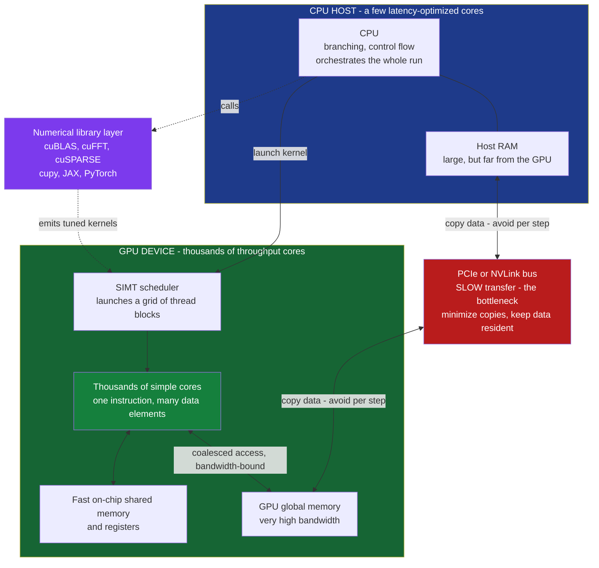

# 🖥️ GPU Computing and Numerical Libraries

> [!abstract] TL;DR
> A **graphics processing unit (GPU)** was built to color millions of pixels at once, and that same trick — **thousands of simple cores running the same instruction on different data (SIMT)** — turns out to be exactly what a physics simulation needs when it must apply the **same update to a million grid points, particles, or matrix entries**. For such **data-parallel** work a GPU delivers *vastly* more arithmetic throughput than a CPU, which is why the world's top supercomputers are GPU-based and why the *same* silicon now drives both video games, physics, and the AI revolution. The catch is the **memory bottleneck**: moving data across the **PCIe bus** between CPU and GPU is slow, and GPU kernels are usually **memory-bandwidth-bound**, not compute-bound — so naive ports disappoint. Crucially, **most physicists never write CUDA**: they stand on the shoulders of highly-optimized **libraries** — **BLAS/LAPACK, cuBLAS, FFTW/cuFFT, PETSc** — and **vectorized array frameworks** (**numpy, cupy, JAX, PyTorch**) that run whole-array operations on the GPU transparently. The foundational skill beneath all of it is **vectorization**: expressing computation as **array operations instead of explicit loops**, worth 10–100x on a CPU alone and the very principle GPUs scale to thousands of lanes. The convergence of GPU hardware, **mixed/reduced precision**, and ML tooling (**auto-differentiation**) is remaking computational physics into a **differentiable, accelerator-driven** science.

## Intuition

**Analogy:** A **CPU is a few brilliant professors.** Each one can solve *any* problem you put in front of it — follow a winding argument, branch on a hard case, remember a mountain of context — but there are only a handful of them. A **GPU is ten thousand diligent students.** No single student is clever; each can only do simple arithmetic. But they work **all at once**. Now hand both a task: *"apply this one update to a million grid points."* The professors, however brilliant, grind through them a few at a time. The army of students splits the million points among themselves and finishes in a single sweep — the professors are simply **obliterated by sheer numbers**.

That is the whole story of GPU computing in physics. A staggering fraction of simulation is exactly this shape: the **same operation repeated across millions of independent elements** — force on each particle, the new temperature at each grid cell, each entry of a matrix product. The graphics chip, engineered to shade millions of pixels in parallel every frame of a video game, was accidentally the perfect engine for it. The same hardware that renders explosions in a game now integrates the equations of the cosmos — and trains the neural networks of the AI boom. What used to require a national supercomputer center now fits under a desk, provided you shape your problem to feed the army of students and respect the slow road between the professors and the students.

---

## How It Works

### Core mechanics

**1. Two philosophies of silicon: latency versus throughput.** A **CPU** spends most of its transistors on making a *single thread* fast: deep pipelines, aggressive **branch prediction**, **out-of-order execution**, and large **caches** to hide memory latency. It is a **latency-optimized** machine — finish *one* task as fast as possible, even a branchy, unpredictable one. A **GPU** makes the opposite bet. It strips out most of that cleverness and spends the transistors on **thousands of simple arithmetic cores** plus very **high-bandwidth memory** to feed them. It tolerates the latency of any one operation by having *so many* threads in flight that whenever one stalls on memory, another is ready to run. It is a **throughput-optimized** machine — do a *staggering total amount* of arithmetic per second, as long as the work is uniform and parallel. This is the fundamental architectural fork (the deep hardware story lives in [[GPU_Architecture_and_CUDA]] and [[SIMD_and_Vector_ISA]]).

**2. SIMT: single instruction, many threads.** GPU cores are grouped so that a batch of threads (NVIDIA calls a batch of 32 a **warp**) executes the *same instruction* in lockstep, each on its *own data element*. This is **SIMT — single-instruction, multiple-thread** — a cousin of CPU **SIMD** vector instructions but scaled to thousands of lanes and made easy to program. The price is that **branch divergence hurts**: if half a warp takes the `if` and half takes the `else`, the hardware runs *both* paths with lanes masked off, wasting throughput. GPUs love **uniform, branch-free arithmetic** on big arrays and are punished by irregular, pointer-chasing, branchy code — the very code CPUs excel at.

**3. Data parallelism — why physics fits.** A simulation is **data-parallel** when the same operation is applied independently to many elements. Enormous swaths of computational physics are exactly this, often **embarrassingly parallel**:
- **Grid / stencil updates** — every cell's new value depends only on its neighbors, so a million cells update at once (finite-difference PDEs, the heart of *Finite_Difference_Methods*, CFD, and weather models).
- **N-body forces** — the force on each of a million particles is an independent sum over the others (gravity in [[The_N_Body_Problem_and_Gravitational_Simulation]], interatomic forces in [[Molecular_Dynamics_Simulation]]).
- **Dense and sparse linear algebra** — every entry of a matrix product, every element of a vector operation, is independent (the workhorse of *Numerical_Linear_Algebra* and the FFT). These map *perfectly* onto a GPU's thousands of threads.

**4. The programming model — kernels, threads, blocks, grids.** In **CUDA** (NVIDIA's dominant framework) or its portable cousins (**OpenCL**, AMD's **HIP**, Khronos **SYCL**, directive-based **OpenACC/OpenMP-offload**), you write a **kernel**: a small function describing what *one* thread does to *one* element. You then launch it across a **grid of thread blocks**, and the hardware runs it on thousands of threads. The **CPU is the host** that orchestrates — it allocates device memory, copies data over, launches kernels, and copies results back; the **GPU is the device** that does the massively parallel arithmetic. Threads within a block can cooperate through fast **shared memory**; blocks are scheduled independently across the GPU's streaming multiprocessors.

**5. The memory bottleneck — the reality that dominates performance.** Two hard truths humble every newcomer:
- **CPU↔GPU transfer is slow.** The GPU has its *own* memory; data must be copied across the **PCIe bus** (or the faster **NVLink**) to reach it. That link is *far* slower than either processor's local memory, so the rule is **minimize transfers — keep data resident on the GPU** across many kernels and copy back only final results (the interconnect story is [[Bus_Architectures_PCIe]]).
- **Kernels are usually memory-bandwidth-bound, not compute-bound.** A GPU can do arithmetic faster than it can *fetch the operands*. Real-world performance is then set by how fast you can **feed the cores** — GPU memory **bandwidth** (see [[NUMA_and_Memory_Bandwidth]]), not the peak FLOP rating. This makes **coalesced access** (adjacent threads reading adjacent addresses so a warp's loads merge into one wide transaction) and **reusing fast on-chip shared memory / registers** ([[Cache_Hierarchy]]) the decisive optimizations. A naive port that copies data every step and reads memory chaotically can be *slower* than the CPU — the classic beginner disappointment.

**6. Stand on the shoulders of libraries.** The pragmatic secret is that **most physicists do not write CUDA at all.** They call **libraries** hand-tuned by experts to squeeze the hardware:
- **BLAS / LAPACK** — the decades-old standard for dense linear algebra (matrix multiply, solves, eigenvalues); GPU versions are **cuBLAS / cuSOLVER / rocBLAS**.
- **FFTW / cuFFT** — fast Fourier transforms on CPU and GPU (the engine of spectral methods, covered by the sibling *Spectral_Methods_and_the_FFT*).
- **cuSPARSE, PETSc, Trilinos** — sparse matrices and large-scale parallel solvers for PDEs.
- **High-level array frameworks** — **numpy** (CPU, BLAS-backed), and its GPU-accelerated relatives **cupy** (a near-drop-in numpy on CUDA), **JAX**, and **PyTorch**, which run **vectorized whole-array operations** on the GPU transparently — often the *entire* code change is `import cupy as np`.

**7. Vectorization — the foundational skill, even on a CPU.** Before any GPU, the first 10–100x is usually left on the table by writing explicit **Python loops** over elements. Expressing the computation as **array operations** — numpy broadcasting, one call over a whole array — pushes the loop down into optimized, **SIMD-vectorized** C/Fortran and eliminates per-element interpreter overhead. This *same principle* — do the same operation to a whole array at once — is what a GPU scales to thousands of lanes. Learn to vectorize on the CPU and the GPU mindset comes for free.

**8. Mixed / reduced precision.** A modern accelerator trend, born in AI and flowing into physics: use **float32** or even **float16 / bfloat16** (and dedicated **tensor cores**) where full **float64** double precision is not needed. Lower precision means smaller data (less bandwidth), more numbers per lane, and dramatically higher throughput — but at the cost of **numerical accuracy and range** (round-off, overflow), so it must be used with care and often mixed with higher-precision accumulation. This is a direct trade of **precision for speed**, and it links straight to the pitfalls of [[Floating_Point_and_Numerical_Error]].

**9. The AI–HPC convergence.** The profound shift: the *same* GPUs and frameworks (**JAX**, **PyTorch**, discussed in [[JAX_and_Flax]] and [[PyTorch_Fundamentals]]) power *both* deep learning and physics simulation. ML tooling is flowing into scientific computing — most importantly **automatic differentiation**, which enables **differentiable simulation** (backpropagating through a physics solver to fit parameters or design systems), the theme of the sibling *Machine_Learning_in_Computational_Physics*. The two worlds are fusing into one accelerator-driven, differentiable ecosystem.

### Flow / architecture



---

## Key Concepts

### Secondary (intuition first)
- **A CPU is a few geniuses; a GPU is an army of simple workers.** For one hard, winding problem you want the geniuses. For the *same* simple task repeated a million times, the army wins by sheer numbers.
- **Physics is full of "same thing, a million times."** Update every grid cell, compute the force on every particle, multiply every matrix entry — that is the shape a GPU devours.
- **Graphics chips became science chips.** The hardware built to paint pixels in a video game is the hardware now simulating galaxies and training AI. Same silicon, two revolutions.
- **The slow part is moving the data, not doing the math.** Getting numbers to the workers (and back) is the traffic jam; keep the data with the workers and let them chew on it.
- **You usually don't write GPU code — you call a library.** Someone already wrote the fast matrix-multiply and FFT. Your job is to phrase your physics in terms of those big array operations.

### Undergraduate (mechanics of the method)
- **Latency vs throughput.** CPU: minimize time for one thread (caches, branch prediction, out-of-order). GPU: maximize total arithmetic across thousands of threads, hiding latency with massive parallelism.
- **SIMT and warps.** Threads run in lockstep groups executing one instruction on many data elements; **branch divergence** serializes the two sides of an `if` and wastes lanes. Favor uniform, branch-free array math.
- **Kernel / thread / block / grid.** A **kernel** says what one thread does to one element; it launches over a **grid of blocks** of threads. The **host (CPU)** orchestrates; the **device (GPU)** computes.
- **Data parallelism and "embarrassingly parallel."** Independent per-element work (stencils, N-body forces, linear-algebra entries) maps one element to one thread with no coordination — the ideal GPU workload.
- **Memory hierarchy on a GPU.** Registers and **shared memory** are fast and small; **global memory** is large with high bandwidth but higher latency; **coalesced access** merges a warp's neighboring loads into one transaction.
- **Vectorization.** Replace explicit element loops with whole-array operations (numpy broadcasting), pushing work into SIMD-vectorized compiled code — the CPU rehearsal for GPU thinking.
- **The library stack.** BLAS/LAPACK and FFTW on CPU; cuBLAS/cuFFT/cuSPARSE and cupy/JAX/PyTorch on GPU; PETSc/Trilinos for large parallel PDE solves.

### Graduate (system-level judgment)
- **Arithmetic intensity and the roofline model.** Whether a kernel is **compute-bound** or **memory-bound** is set by its **arithmetic intensity** — FLOPs performed per byte moved from memory. The **roofline model** plots achievable performance versus intensity: below the ridge point you are bandwidth-limited (most stencils and vector ops), above it compute-limited (dense matmul, which reuses data heavily). This diagnosis dictates whether to optimize memory traffic or arithmetic.
- **Why naive ports disappoint.** A kernel that copies host↔device every timestep, reads memory non-coalesced, and diverges on branches can trail the CPU. Winning means **keeping data resident**, **coalescing**, **tiling into shared memory** to raise data reuse (intensity), and **fusing** operations to cut memory round-trips.
- **Occupancy vs. registers.** Running enough warps to hide latency (**occupancy**) competes with each thread's register and shared-memory footprint; the tuning sweet spot is problem-dependent, which is precisely why library authors hand-tune per architecture.
- **Mixed-precision numerics.** float32/float16 and tensor cores give large speedups but shrink the representable range and inflate round-off; robust use pairs low-precision multiply with higher-precision accumulation and validates that the *physics observable* (energy conservation, invariants) survives — see [[Floating_Point_and_Numerical_Error]].
- **Scaling beyond one GPU.** Large runs use **multi-GPU and multi-node** parallelism (domain decomposition, halo exchange, MPI + NCCL collectives), where **interconnect bandwidth** and communication–computation overlap dominate — the province of the sibling *High_Performance_and_Parallel_Computing*.
- **Differentiable, accelerator-native simulation.** Writing the whole solver in JAX/PyTorch makes it **auto-differentiable** and GPU-native at once, enabling gradient-based parameter fitting, inverse design, and hybrid ML–physics models — the AI–HPC fusion in practice.

---

## Python Demo

```python
# The power of DATA-PARALLELISM and LIBRARIES, using numpy as an accessible
# stand-in for GPU-style vectorization. Two lessons, both timed and plotted:
#
# (a) VECTORIZATION: an N-body force kernel written as an explicit Python
#     double LOOP vs a VECTORIZED numpy broadcasting version. We time both
#     across problem sizes and plot the (often 100x+) speedup -- the very
#     CPU/GPU SIMD principle of "do the same op to a whole array at once".
#
# (b) LIBRARY SPEEDUP: a matrix multiply written as a naive triple LOOP vs
#     numpy's BLAS-backed '@' operator. We time both across sizes and plot how
#     the library pulls ever further ahead as the problem grows.
#
# On a GPU (via cupy / JAX / PyTorch) the SAME array code runs on thousands of
# threads for a further large jump -- discussed in prose below.
import time
import numpy as np
import matplotlib.pyplot as plt

rng = np.random.default_rng(0)
soft2 = 1e-4          # gravitational softening so r -> 0 does not blow up

# =====================================================================
# (a) N-BODY FORCES: explicit Python loop vs vectorized numpy broadcasting
# =====================================================================
def nbody_loop(pos, mass):
    """Net force on each body via an explicit O(N^2) Python double loop."""
    N = pos.shape[0]
    F = np.zeros_like(pos)
    for i in range(N):
        fi = np.zeros(3)
        for j in range(N):
            if i == j:
                continue
            d = pos[j] - pos[i]                 # displacement i -> j
            r2 = d @ d + soft2
            inv_r3 = 1.0 / (r2 * np.sqrt(r2))   # 1 / |r|^3
            fi += mass[j] * d * inv_r3
        F[i] = mass[i] * fi
    return F

def nbody_vec(pos, mass):
    """Same physics, fully VECTORIZED with numpy broadcasting -- no Python loop."""
    d = pos[None, :, :] - pos[:, None, :]               # (N,N,3) all pairwise disps
    r2 = np.einsum('ijk,ijk->ij', d, d) + soft2         # (N,N) squared distances
    inv_r3 = r2 ** -1.5                                  # 1 / |r|^3
    np.fill_diagonal(inv_r3, 0.0)                        # no self-force
    F = np.einsum('j,ij,ijk->ik', mass, inv_r3, d)      # sum_j m_j * inv_r3 * d
    return F * mass[:, None]

def timed(fn, *args, repeats=3):
    """Return the best wall-clock time over a few repeats (min = least noise)."""
    best = np.inf
    for _ in range(repeats):
        t0 = time.perf_counter()
        fn(*args)
        best = min(best, time.perf_counter() - t0)
    return best

Ns = [64, 128, 256, 512]
t_loop, t_vec = [], []
for N in Ns:
    pos  = rng.standard_normal((N, 3))
    mass = rng.uniform(0.5, 2.0, size=N)
    t_loop.append(timed(nbody_loop, pos, mass, repeats=1))   # loop is slow: 1 run
    t_vec.append(timed(nbody_vec, pos, mass, repeats=3))
t_loop, t_vec = np.array(t_loop), np.array(t_vec)
speedup_nb = t_loop / t_vec

# sanity check: the two methods agree on the physics at the smallest size
pos0  = rng.standard_normal((64, 3)); mass0 = rng.uniform(0.5, 2.0, size=64)
err = np.max(np.abs(nbody_loop(pos0, mass0) - nbody_vec(pos0, mass0)))
print(f"[a] loop vs vectorized N-body agree to max abs error {err:.2e}")
print(f"[a] N-body vectorization speedup: {speedup_nb.min():.0f}x .. {speedup_nb.max():.0f}x")

# =====================================================================
# (b) MATRIX MULTIPLY: naive triple loop vs numpy's BLAS-backed '@'
# =====================================================================
def matmul_naive(A, B):
    """The textbook O(n^3) triple loop -- what NOT to do in Python."""
    n, m = A.shape
    _, p = B.shape
    C = np.zeros((n, p))
    for i in range(n):
        for j in range(p):
            s = 0.0
            for k in range(m):
                s += A[i, k] * B[k, j]
            C[i, j] = s
    return C

ns = [16, 32, 48, 64, 96, 128]
t_naive, t_blas = [], []
for n in ns:
    A = rng.standard_normal((n, n)); B = rng.standard_normal((n, n))
    t_naive.append(timed(matmul_naive, A, B, repeats=1))
    t_blas.append(timed(lambda A, B: A @ B, A, B, repeats=5))   # calls BLAS
t_naive, t_blas = np.array(t_naive), np.array(t_blas)
speedup_mm = t_naive / t_blas
print(f"[b] BLAS matmul speedup: {speedup_mm.min():.0f}x .. {speedup_mm.max():.0f}x "
      f"(grows with problem size)")

# =====================================================================
# Plots
# =====================================================================
fig, ax = plt.subplots(2, 2, figsize=(14, 10))

# (1) N-body timing: loop vs vectorized
ax[0, 0].loglog(Ns, t_loop, "o-", color="#dc2626", lw=2, label="explicit Python loop")
ax[0, 0].loglog(Ns, t_vec,  "s-", color="#16a34a", lw=2, label="vectorized numpy")
ax[0, 0].set_title("(a) N-body force kernel: loop vs vectorized")
ax[0, 0].set_xlabel("number of bodies N"); ax[0, 0].set_ylabel("time (s), log scale")
ax[0, 0].legend(); ax[0, 0].grid(alpha=0.3, which="both")

# (2) N-body speedup factor
ax[0, 1].semilogx(Ns, speedup_nb, "D-", color="#7c3aed", lw=2)
ax[0, 1].set_title("(a) Vectorization speedup (the SIMD principle)")
ax[0, 1].set_xlabel("number of bodies N"); ax[0, 1].set_ylabel("loop time / vectorized time")
ax[0, 1].grid(alpha=0.3, which="both")
for x, y in zip(Ns, speedup_nb):
    ax[0, 1].annotate(f"{y:.0f}x", (x, y), textcoords="offset points", xytext=(0, 8),
                      ha="center", fontsize=9)

# (3) matmul timing: naive triple loop vs BLAS
ax[1, 0].loglog(ns, t_naive, "o-", color="#dc2626", lw=2, label="naive triple loop")
ax[1, 0].loglog(ns, t_blas,  "s-", color="#16a34a", lw=2, label="numpy @ (BLAS)")
ax[1, 0].set_title("(b) Matrix multiply: naive vs optimized library")
ax[1, 0].set_xlabel("matrix size n (n x n)"); ax[1, 0].set_ylabel("time (s), log scale")
ax[1, 0].legend(); ax[1, 0].grid(alpha=0.3, which="both")

# (4) matmul speedup grows with size
ax[1, 1].semilogx(ns, speedup_mm, "D-", color="#0891b2", lw=2)
ax[1, 1].set_title("(b) BLAS speedup grows with problem size")
ax[1, 1].set_xlabel("matrix size n"); ax[1, 1].set_ylabel("naive time / BLAS time")
ax[1, 1].grid(alpha=0.3, which="both")
for x, y in zip(ns, speedup_mm):
    ax[1, 1].annotate(f"{y:.0f}x", (x, y), textcoords="offset points", xytext=(0, 8),
                      ha="center", fontsize=9)

plt.tight_layout(); plt.show()
```

Running it prints an N-body **vectorization speedup climbing into the hundreds** and a matrix-multiply **BLAS speedup that *grows* with problem size** into the thousands — with the two N-body methods agreeing to round-off, confirming the physics is identical and only the *execution strategy* changed. The lesson is the thesis of this note in miniature. In panel (a), the explicit double loop pays the Python interpreter's overhead *per pair* — millions of tiny, slow steps — while the vectorized version hands the *entire* pairwise computation to numpy's compiled, **SIMD-vectorized** inner loops in a single call; that is precisely the "same operation on a whole array at once" idea a GPU scales to thousands of lanes. In panel (b), the naive triple loop is not just slow but slow in a way that *worsens* with size, because the BLAS library exploits **cache blocking, SIMD, and multi-threading** to keep arithmetic intensity high — the CPU rehearsal of the GPU roofline. A GPU via **cupy** would run the *same* array code (`import cupy as np`) across thousands of threads with high memory bandwidth for another large jump — provided you keep the arrays **resident on the device** and avoid copying every step, exactly the memory-bottleneck rule from the diagram.

---

## Real-World Applications

- **Molecular dynamics.** **AMBER, GROMACS, LAMMPS, NAMD, and OpenMM** are all GPU-accelerated, turning force evaluation and neighbor-list updates over millions of atoms into data-parallel kernels — often a 10–100x jump over CPU, and the reason microsecond-scale biomolecular MD is now routine (the method itself is [[Molecular_Dynamics_Simulation]]).
- **Astrophysical and cosmological simulation.** N-body gravity and hydrodynamics (Barnes-Hut/tree and particle-mesh codes, SPH, adaptive mesh) on GPUs simulate galaxy formation and large-scale structure with billions of particles — the acceleration of [[The_N_Body_Problem_and_Gravitational_Simulation]].
- **Lattice QCD.** Quantum chromodynamics on a spacetime lattice is dominated by huge sparse linear solves; GPU clusters (via cuBLAS/cuSPARSE-style kernels) made first-principles hadron-mass and QCD-thermodynamics calculations feasible.
- **Computational fluid dynamics and weather/climate.** Stencil updates on enormous grids are the archetypal data-parallel workload; GPU CFD and next-generation climate models (ICON, E3SM, and JAX/differentiable dynamical cores) run finite-difference and spectral solvers at massive throughput (*Finite_Difference_Methods* and *Spectral_Methods_and_the_FFT*).
- **Quantum simulation and electronic structure.** GPU-accelerated dense/sparse linear algebra and FFTs power quantum many-body and DFT codes, where matrix diagonalization and Poisson solves dominate.
- **The supercomputer reality.** The world's leading machines — **Frontier**, **El Capitan**, **Aurora** — derive the overwhelming majority of their exascale performance from **GPUs (AMD Instinct, NVIDIA, Intel)**, not CPUs. GPUs did not merely speed up simulation; they **democratized** it, putting former supercomputer workloads onto a single desktop card.

---

## Common Pitfalls

- **Copying data every timestep.** The classic killer: allocating, uploading, and downloading arrays across **PCIe** inside the simulation loop. The transfer swamps the compute. **Keep data resident on the GPU** and copy back only what you must, only when you must ([[Bus_Architectures_PCIe]]).
- **Assuming the FLOP rating is the speed.** Most kernels are **memory-bandwidth-bound**, not compute-bound. Peak-FLOP marketing numbers are unreachable for low-arithmetic-intensity work; use the **roofline** to see whether you are limited by bandwidth ([[NUMA_and_Memory_Bandwidth]]) or by arithmetic before you optimize the wrong thing.
- **Non-coalesced / strided memory access.** When adjacent threads read scattered addresses, a warp's loads cannot merge and effective bandwidth collapses. Lay out data so neighboring threads touch neighboring memory (structure-of-arrays, not array-of-structures).
- **Branch divergence.** Heavy `if/else` inside a warp forces both paths to run serially with lanes masked. Restructure to uniform, branch-free arithmetic or sort work so a warp follows one path.
- **Leaving code as explicit Python loops.** The single most common performance mistake in scientific Python — writing element-by-element loops instead of **vectorized array operations**, forfeiting 10–100x on the CPU *before* a GPU even enters the picture. Vectorize first.
- **Blindly using float32/float16.** Reduced precision buys speed but can wreck a long-running simulation through accumulated round-off, loss of energy conservation, or overflow. Validate that the physics observable survives, and mix in higher-precision accumulation where it matters ([[Floating_Point_and_Numerical_Error]]).
- **Reinventing what a library already does.** Hand-writing a matrix multiply, FFT, or solver almost never beats **cuBLAS/cuFFT/LAPACK/PETSc**, which encode years of architecture-specific tuning. Reach for the library first; write custom kernels only for the genuinely novel inner loop.

---

## Related Concepts

- [[GPU_Architecture_and_CUDA]] — the hardware and CUDA programming model beneath this note: streaming multiprocessors, warps, the thread/block/grid hierarchy, and the memory hierarchy that govern GPU performance.
- [[SIMD_and_Vector_ISA]] — CPU vector instructions are the small-scale ancestor of GPU SIMT and the mechanism numpy/BLAS exploit; understand SIMD and vectorization stops being mysterious.
- [[NUMA_and_Memory_Bandwidth]] — why feeding the cores, not raw FLOPs, usually sets the ceiling; the bandwidth-bound reality behind the roofline model.
- [[Cache_Hierarchy]] — registers, shared memory, and caches as the fast tiers you must reuse to raise arithmetic intensity and avoid the slow global-memory / bandwidth wall.
- [[Bus_Architectures_PCIe]] — the CPU↔GPU interconnect whose slowness is the central "minimize transfers, keep data resident" rule.
- [[Multi_Core_Programming]] — the CPU-side parallelism (threads, work division) that GPUs push to thousands of lanes; the conceptual bridge from a few cores to many.
- [[Compute_Shaders_GPGPU]] — the graphics-pipeline route to the *same* general-purpose GPU compute, showing how rendering hardware became a scientific accelerator.
- [[Computational_Physics/01_Numerical_Foundations/Numerical_Linear_Algebra|Numerical Linear Algebra]] — the dense/sparse solves and matrix products that BLAS/LAPACK/cuBLAS accelerate, the most GPU-friendly kernel in physics.
- [[The_N_Body_Problem_and_Gravitational_Simulation]] — the data-parallel force-sum used in the demo and the flagship GPU astrophysics workload.
- [[Finite_Difference_Methods]] — stencil grid updates, the archetypal embarrassingly-parallel physics kernel GPUs devour.
- [[Molecular_Dynamics_Simulation]] — the force-field simulation whose GPU acceleration (AMBER, GROMACS, LAMMPS) made microsecond biomolecular MD routine.
- [[Floating_Point_and_Numerical_Error]] — the precision-vs-speed trade-off behind mixed/reduced-precision GPU computing and its accuracy risks.
- [[JAX_and_Flax]] — the auto-differentiating, GPU-native array framework at the heart of the AI–HPC convergence and differentiable simulation.
- [[PyTorch_Fundamentals]] — the other framework driving the fusion of ML and physics on shared GPU hardware and tensor operations.
- [[LLM_Inference_Optimization]] — a concrete case of the same mixed-precision, memory-bandwidth, and kernel-fusion concerns dominating modern accelerator workloads.
- [[Computational_Physics_Overview]] — situates GPU computing within the vault's broader simulation landscape.

*Not-yet-written Computational Physics siblings this note connects to:* **High_Performance_and_Parallel_Computing** (multi-GPU/multi-node scaling, MPI, domain decomposition, and the roofline model in depth), **Machine_Learning_in_Computational_Physics** (differentiable simulation, ML interatomic potentials, and physics-informed networks that ride this same hardware), and **Spectral_Methods_and_the_FFT** (the FFT-based solvers accelerated by FFTW/cuFFT).

---

## Review Questions

**Secondary:**
1. Using the "professors vs. students" analogy, explain in your own words why a GPU crushes a CPU on "update a million grid points" but a CPU may still win on a single, branchy, unpredictable task.
2. A friend rewrites a slow physics loop to run on a GPU and finds it is *slower* than before. Give one everyday reason (in terms of "moving data to the workers") why this can happen.

**Undergraduate:**
3. Define **data parallelism** and **SIMT**. Give two distinct computational-physics kernels that are naturally data-parallel and explain, for each, what "one thread, one element" means.
4. In the demo, the vectorized N-body version and the triple-loop matmul both call into optimized compiled code. Explain *why* vectorizing (or calling BLAS) is so much faster than the equivalent Python loop, referencing interpreter overhead and SIMD.
5. Contrast a **compute-bound** and a **memory-bandwidth-bound** kernel. Which is a simple element-wise vector add, and which is a large dense matrix multiply, and why? How does this change what you should optimize?

**Graduate:**
6. Sketch the **roofline model** and mark where a stencil PDE update and a dense matrix multiply fall. Using **arithmetic intensity**, explain why **tiling into shared memory** and **kernel fusion** can move a kernel toward the compute-bound regime.
7. You port a long-running symplectic MD or N-body integrator to **float32/tensor cores** for speed and observe slow energy drift that was absent in float64. Diagnose this in terms of round-off accumulation and range, and propose a mixed-precision strategy that recovers accuracy without giving up most of the speed.
8. Explain how writing a solver in **JAX or PyTorch** yields *both* GPU acceleration *and* automatic differentiation, and describe one physics problem (inverse design, parameter fitting, or a hybrid ML–physics model) that this **differentiable simulation** capability unlocks. What are the memory costs of reverse-mode autodiff through a long time-stepping loop?

---

## Sources

- Kirk, D. B., & Hwu, W. W. — *Programming Massively Parallel Processors: A Hands-on Approach*, 4th ed. (Morgan Kaufmann, 2022).
- Sanders, J., & Kandrot, E. — *CUDA by Example: An Introduction to General-Purpose GPU Programming* (Addison-Wesley, 2010).
- Williams, S., Waterman, A., & Patterson, D. — "Roofline: An Insightful Visual Performance Model for Multicore Architectures," *Communications of the ACM* 52(4), 65–76 (2009).
- Hennessy, J. L., & Patterson, D. A. — *Computer Architecture: A Quantitative Approach*, 6th ed., Ch. 4 (Data-Level Parallelism, Vector, SIMD, GPU) (Morgan Kaufmann, 2019).
- NVIDIA — *CUDA C++ Programming Guide* and cuBLAS / cuFFT documentation (developer.nvidia.com/cuda-toolkit).
- Harris, C. R., et al. — "Array programming with NumPy," *Nature* 585, 357–362 (2020).
- Bradbury, J., et al. — *JAX: Composable transformations of Python+NumPy programs* (2018), github.com/google/jax.

---

#computational-physics #GPU-computing #CUDA #vectorization #numerical-libraries
