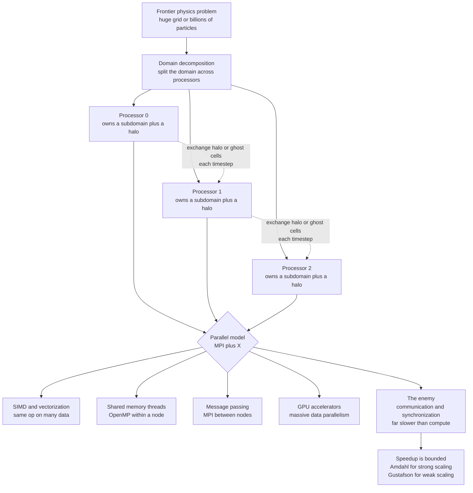

# ⚡ High-Performance and Parallel Computing

> [!abstract] TL;DR
> The frontier simulations of physics — cosmological structure, global climate, turbulence, lattice QCD, materials from first principles — demand *far* more arithmetic than any single processor can deliver, so they run on **supercomputers with millions of cores** now exceeding an **exaflop** ($10^{18}$ operations per second). Since single-core clock speeds stopped rising around 2005 (the end of **Dennard scaling**), performance comes **only from parallelism**, which makes parallel programming unavoidable. The dominant strategy for physics is **domain decomposition** — split the grid or particles across processors, each exchanging **halo (ghost) data** with its neighbors every step. The fundamental enemy is **communication and synchronization**, which are far slower than computation. **Amdahl's law** shows that a serial fraction $s$ caps speedup at $1/s$ (a 5% serial part limits you to $20\times$ no matter the core count) — the wall of *strong* scaling. **Gustafson's law** rescues supercomputing: as machines grow we solve *bigger* problems (*weak* scaling), whose serial fraction shrinks, so scaling to millions of cores really does pay off. Understanding the parallel models (MPI, OpenMP, SIMD, GPUs), scalability (strong vs weak), and the **memory hierarchy** is what turns physics simulation from desktop-scale into universe-scale.

## Intuition

**Analogy:** One worker digging a giant trench takes forever; put a hundred workers on it and — in the dream — they finish a hundred times faster. Reality is harsher. The moment the workers keep **bumping into each other**, **waiting to borrow the one shovel**, or hit a stretch of the trench that only **one person can dig at a time**, the hundred-fold dream evaporates. Worse, if they spend more time shouting coordinates back and forth than actually digging, adding *more* workers makes the job *slower*. A supercomputer is exactly this trench with millions of processors digging at a physics problem together.

The entire art of high-performance computing is **dividing the work so the processors rarely wait on each other**. Split the trench into sections that each worker can dig almost independently, and only occasionally pass a bucket of dirt across the boundary to a neighbor — that is *domain decomposition* with *halo exchange*. Keep the "shouting" (communication) tiny compared to the "digging" (computation), and a hundred processors approach a hundred-fold speedup. Let the shouting dominate, and the machine chokes. Every concept below — the parallel models, the scaling laws, the memory hierarchy — is a formalization of that single tension: **compute is cheap, talking is expensive.**

---

## How It Works

### Core Mechanics

**Why physics needs HPC — and why the free lunch ended.** A turbulent flow resolved on a $10{,}000^3$ grid holds $10^{12}$ cells, each updated thousands of times; a cosmological box tracks billions of particles for 13 billion simulated years. This is orders of magnitude beyond one processor. For decades the answer was simply to *wait for faster chips*: **Dennard scaling** let transistors shrink while clock frequency climbed. Around **2005 that stopped** — power density hit a wall, and single-core clock speeds plateaued near a few GHz. Moore's law kept delivering *more transistors*, but they now arrive as **more cores**, not faster ones. The consequence is stark: **performance now comes exclusively from parallelism.** Serial code no longer gets faster on its own, so parallel programming became mandatory for anyone chasing performance.

**The levels of parallelism.** Modern machines expose a hierarchy of ways to do many things at once, and real codes exploit several at once:

1. **Instruction-level parallelism (ILP) and SIMD/vectorization** — a single core overlaps independent instructions (pipelining, superscalar issue) and applies **one operation to many data elements** at once. This is what `numpy` and GPUs ride on: `a + b` on million-element arrays is one vector instruction stream, not a Python loop.
2. **Shared-memory multithreading (OpenMP)** — the cores of one node share the same memory, so threads split a loop and cooperate through that shared address space. Simple to add (a compiler pragma), but limited to a single node and haunted by race conditions.
3. **Distributed-memory message passing (MPI)** — the backbone of supercomputing. Separate **nodes** each own private memory and communicate by **explicitly sending messages**. Nothing is shared; the programmer decides exactly what data crosses the network and when. MPI is verbose but scales to *millions* of cores because it makes communication explicit and therefore optimizable.
4. **GPU / accelerator computing** — thousands of lightweight cores execute massive **data parallelism**, ideal for the regular arithmetic of grids and matrices. This is the subject of the sibling note *GPU_Computing_and_Numerical_Libraries*.

The production idiom is **"MPI + X"**: MPI *between* nodes, and OpenMP, SIMD, or GPU kernels *within* each node.

**Domain decomposition — the dominant physics strategy.** You parallelize a physics simulation by splitting the **physical domain**, not the algorithm. Carve the grid (or the particle set) into subdomains and hand one to each processor. Each processor updates its own chunk almost independently — *but* a finite-difference stencil at the edge of a subdomain needs values that live on the *neighbor's* processor. So each subdomain is padded with a ring of **halo (ghost) cells**, and every timestep the processors **exchange boundary data** with their neighbors before advancing. This is exactly how [[Finite_Difference_Methods]] PDE grids are parallelized, and how [[The_N_Body_Problem_and_Gravitational_Simulation]] and molecular dynamics distribute particles across processors. **Load balancing** — giving every processor equal work so none idles while others finish — is the constant companion concern, and it is hard when the physics is non-uniform (a galaxy that clusters, an adaptive mesh that refines).

**The enemy: communication and synchronization.** Here is the fundamental challenge. Processors must **communicate** (exchange halo data, sum global quantities) and **synchronize** (agree on a step boundary), and communication is **far slower than computation** — moving a number across the network can cost hundreds to thousands of times more than a floating-point operation. Two costs matter: **latency** (the fixed delay to start any message) and **bandwidth** (the rate once flowing). The single number that predicts whether a code will scale is the **compute-to-communication ratio**: how much arithmetic each processor does per byte it must exchange. The key engineering skills are **minimizing** communication (bigger subdomains, fewer global reductions) and **overlapping** it with computation (start the halo exchange, compute the interior while it flies, then finish the edges).

**Amdahl's law — the sobering ceiling.** If a fraction $s$ of the work is inherently **serial** (cannot be parallelized), then with $P$ processors the runtime is $s + (1-s)/P$ and the speedup is
$$S(P) = \frac{1}{s + \dfrac{1-s}{P}} \xrightarrow{P\to\infty} \frac{1}{s}.$$
No matter how many processors you throw at it, a **5% serial part caps speedup at $20\times$**; a 1% serial part caps it at $100\times$. This is the wall of **strong scaling** — fixing the problem size and adding cores. It is deeply pessimistic and, taken alone, would suggest supercomputing is futile.

**Gustafson's law — the optimistic counterpoint.** In practice nobody keeps the problem fixed. As machines grow, physicists solve **bigger** problems — finer grids, more particles, longer runs. Gustafson observed that if you keep the *work per processor* constant (**weak scaling**), the scaled speedup is
$$S(P) = s + (1-s)\,P,$$
which grows almost **linearly** with $P$. The reason is that larger problems have a **smaller serial fraction** — the parallel work grows with the grid while the fixed overhead does not. This is *how supercomputing actually delivers*: not by making one fixed problem $10^6\times$ faster, but by making a $10^6\times$ *larger* problem tractable in the same wall-clock time.

**Scalability, precisely.** Two questions, two answers: **strong scaling** asks "for a *fixed* problem, how does speedup grow with cores?" (bounded by Amdahl); **weak scaling** asks "for *fixed work per core*, does runtime stay flat as I add cores and grow the problem?" (the Gustafson regime). **Parallel efficiency** $= S(P)/P$ measures how close you are to the ideal; it inevitably decays. The **Universal Scalability Law** refines Amdahl by adding a *coordination/contention* term that grows with $P$, capturing why real speedup curves often **rise, peak, and then fall** — past some point, more processors spend so much time coordinating that throughput *drops* (see [[Scalability_Theory]]).

**The memory hierarchy and locality.** A crucial performance factor even on a *single* core: memory is a pyramid — tiny fast **caches** near the core, huge slow **main memory (DRAM)** far away, with a latency gap of ~100×. **Data locality** — touching data that is nearby and recently used — often matters **more than flop count**, because a cache-friendly algorithm avoids stalling on memory. Many physics kernels are **memory-bound**: their speed is set by **memory bandwidth**, not arithmetic, so the real bottleneck is feeding the cores, not the cores themselves. Structuring loops and data layout for the cache hierarchy (blocking, contiguous access) is frequently the highest-leverage optimization. See [[Cache_Hierarchy]] and [[NUMA_and_Memory_Bandwidth]].

**The software stack.** Nobody writes an exascale code from bare MPI calls. The ecosystem is layered: **MPI + OpenMP** ("MPI+X") for the parallelism; battle-tested numerical libraries — **BLAS/LAPACK** for dense linear algebra (see [[Numerical_Linear_Algebra]]), **PETSc** for large sparse solvers, **FFTW** for transforms; and **profilers** to find where the time actually goes. A dominant practical cost is *human*: writing, debugging, maintaining, and **porting** million-line scientific codes across successive generations of machines and accelerators.

**Fault tolerance and the exascale challenge.** At millions of components, some piece of hardware **fails during essentially every long run** — the mean time between failures can be *hours*. Codes survive by **checkpointing**: periodically dumping state to disk so a crashed run restarts from the last checkpoint rather than the beginning. And **power is now a first-class constraint** — an exascale machine draws tens of megawatts, so energy efficiency (operations per watt) shapes hardware and algorithms alike. These are the everyday realities of the largest simulations.

### Flow / Architecture



---

## Key Concepts

### Secondary
- One digger takes forever; a hundred diggers can finish a hundred times faster — **unless** they keep bumping into each other or waiting for tools.
- A supercomputer is millions of tiny processors working on one problem together; the trick is splitting the work so they rarely have to stop and talk.
- If even a small part of the job can only be done by one worker at a time, that part alone limits how much faster the whole crew can go.
- Computers stopped getting faster one-at-a-time around 2005, so today "faster" means "more processors working in parallel."

### Undergraduate
- **The end of the free lunch.** Dennard scaling ended ~2005; clock speed plateaued, so performance now comes from **parallelism** (more cores), not faster cores — parallel programming is mandatory.
- **Parallel models.** SIMD/vectorization (one op on many data, e.g. `numpy` — see [[SIMD_and_Vector_ISA]]), shared-memory threads (OpenMP — see [[Multi_Core_Programming]]), and distributed message passing (MPI across nodes) form the toolkit; production codes combine them as "MPI+X".
- **Domain decomposition.** Split the grid or particles across processors; each owns a subdomain plus **halo/ghost cells** and exchanges boundary data with neighbors every step. Load balancing keeps all processors equally busy.
- **Amdahl's law.** With serial fraction $s$, $S(P)=1/\!\left(s+(1-s)/P\right)$, capped at $1/s$; a 5% serial part limits speedup to $20\times$. This bounds **strong scaling**.
- **Gustafson's law.** Keeping work-per-core fixed (**weak scaling**), $S(P)=s+(1-s)P$ grows nearly linearly — bigger problems scale better because their serial fraction shrinks.

### Graduate
- **Compute-to-communication ratio.** Scalability is governed by arithmetic done per byte communicated; with latency $\alpha$ and inverse-bandwidth $\beta$, a message of $n$ bytes costs $\alpha + \beta n$, and hiding it requires **overlapping** communication with interior computation (non-blocking `MPI_Isend`/`MPI_Irecv`).
- **Surface-to-volume scaling.** For a 3-D stencil, a subdomain of side $L$ does $O(L^3)$ compute but exchanges $O(L^2)$ halo — so the communication fraction scales as $1/L$, and strong scaling degrades as subdomains shrink. This is the mechanism behind Amdahl's wall for grid codes.
- **Universal Scalability Law.** $S(P)=P/\!\left(1+\sigma(P-1)+\kappa P(P-1)\right)$ adds *contention* ($\sigma$) and *coherency/coordination* ($\kappa$) terms; the $\kappa$ term makes speedup **peak and then decline**, explaining retrograde scaling on real machines (see [[Scalability_Theory]]).
- **Memory-bound kernels and the roofline.** Many physics kernels are limited by **memory bandwidth**, not FLOPs; the roofline model bounds performance by $\min(\text{peak FLOP/s},\ \text{arithmetic intensity}\times\text{bandwidth})$, so improving **data locality** (cache blocking, contiguous layout — see [[Cache_Hierarchy]], [[Memory_Hierarchy_and_Caching]]) beats reducing flop count.
- **Exascale realities.** At $O(10^6)$ components the MTBF is hours, mandating **checkpoint/restart**; power (tens of MW) makes ops-per-watt a design axis; and portability across CPU/GPU vendors drives performance-portability frameworks. The interplay of consensus, failure, and coordination connects to distributed-systems theory (see [[Message_Passing_and_RPC_Semantics]]).

---

## Python Demo

```python
# The LAWS and PRACTICE of parallel speedup -- numpy + matplotlib (+ multiprocessing).
#   (a) AMDAHL'S LAW    -> a serial fraction s imposes a hard speedup ceiling of 1/s
#   (b) GUSTAFSON'S LAW -> weak scaling grows almost linearly with the core count
#   (c) parallel EFFICIENCY = speedup / P collapses as P grows (from Amdahl)
#   (d) MEASURED speedup of an embarrassingly-parallel Monte Carlo pi estimate across
#       worker processes, versus the ideal linear line -- overhead causes diminishing returns
import time
import numpy as np
import matplotlib.pyplot as plt
import multiprocessing as mp

# ---------------- (a) AMDAHL and (b) GUSTAFSON closed forms ----------------
P = np.unique(np.logspace(0, 4, 200).astype(int))      # 1 ... 10000 processors
serial_fracs = [0.0, 0.01, 0.05, 0.10, 0.25]

def amdahl(p, s):        # STRONG scaling: fixed total problem size
    return 1.0 / (s + (1.0 - s) / p)

def gustafson(p, s):     # WEAK scaling: fixed work PER processor
    return s + (1.0 - s) * p

# ---------------- (d) MEASURED multiprocessing speedup ---------------------
def mc_pi_chunk(args):
    """Independent Monte Carlo pi worker -> embarrassingly parallel, zero comms."""
    n, seed = args
    rng = np.random.default_rng(seed)
    x = rng.random(n)
    y = rng.random(n)
    return int(np.count_nonzero(x * x + y * y <= 1.0))

def measure_speedup(n_total, max_workers):
    """Split n_total darts across P worker processes; return wall time T(P)."""
    times = {}
    for p in range(1, max_workers + 1):
        per = n_total // p
        chunks = [(per, 1000 + k) for k in range(p)]    # distinct seeds per worker
        with mp.Pool(p) as pool:
            t0 = time.perf_counter()
            _hits = sum(pool.map(mc_pi_chunk, chunks))
            times[p] = time.perf_counter() - t0
    return times

if __name__ == "__main__":
    max_workers = min(8, (mp.cpu_count() or 2))
    try:
        n_total = 20_000_000
        times = measure_speedup(n_total, max_workers)
        Pm = np.arange(1, max_workers + 1)
        Tm = np.array([times[p] for p in Pm])
        measured = Tm[0] / Tm
        source = "measured"
    except Exception as exc:                             # sandbox with no multiprocessing
        # Universal-Scalability-Law flavor: T(p) = serial + parallel/p + overhead*(p-1)
        Pm = np.arange(1, max_workers + 1)
        s_mod, ov = 0.06, 0.010
        Tmodel = s_mod + (1 - s_mod) / Pm + ov * (Pm - 1)
        measured = Tmodel[0] / Tmodel
        source = "modeled"
        print(f"(multiprocessing unavailable -> {exc}; using overhead model)")

    # fit an EFFECTIVE serial fraction s to the measured curve via Amdahl
    grid = np.linspace(0.0, 0.5, 5001)
    s_fit = min(((np.sum((amdahl(Pm, s) - measured) ** 2), s) for s in grid))[1]

    print(f"Amdahl ceiling at s = 0.05 : {1 / 0.05:.0f}x  (P -> infinity)")
    print(f"(d) {source} speedup at P = {Pm[-1]} : {measured[-1]:.2f}x  (ideal {Pm[-1]}x)")
    print(f"(d) fitted effective serial fraction s = {s_fit:.3f}"
          f"  -> Amdahl ceiling {1 / max(s_fit, 1e-9):.1f}x")

    # ------------------------------ plots ---------------------------------
    fig, ax = plt.subplots(2, 2, figsize=(13, 10))

    for s in serial_fracs:                               # (a) Amdahl
        ax[0, 0].plot(P, amdahl(P, s), label=f"s = {s:.2f}")
        if s > 0:
            ax[0, 0].axhline(1 / s, ls=":", color="gray", alpha=0.4)
    ax[0, 0].set_xscale("log"); ax[0, 0].set_yscale("log")
    ax[0, 0].set_xlabel("processors P"); ax[0, 0].set_ylabel("speedup")
    ax[0, 0].set_title("(a) Amdahl: serial fraction caps speedup at 1/s")
    ax[0, 0].legend(); ax[0, 0].grid(True, which="both", alpha=0.3)

    for s in serial_fracs:                               # (b) Gustafson
        ax[0, 1].plot(P, gustafson(P, s), label=f"s = {s:.2f}")
    ax[0, 1].plot(P, P, "k--", alpha=0.5, label="ideal linear")
    ax[0, 1].set_xscale("log"); ax[0, 1].set_yscale("log")
    ax[0, 1].set_xlabel("processors P"); ax[0, 1].set_ylabel("scaled speedup")
    ax[0, 1].set_title("(b) Gustafson: weak scaling grows with P")
    ax[0, 1].legend(); ax[0, 1].grid(True, which="both", alpha=0.3)

    for s in serial_fracs:                               # (c) efficiency
        ax[1, 0].plot(P, amdahl(P, s) / P, label=f"s = {s:.2f}")
    ax[1, 0].set_xscale("log")
    ax[1, 0].set_xlabel("processors P"); ax[1, 0].set_ylabel("efficiency = speedup / P")
    ax[1, 0].set_title("(c) Parallel efficiency collapses as P grows")
    ax[1, 0].legend(); ax[1, 0].grid(True, which="both", alpha=0.3)

    ax[1, 1].plot(Pm, Pm, "k--", label="ideal linear speedup")   # (d) measured
    ax[1, 1].plot(Pm, measured, "o-", color="#be123c", label=f"{source} speedup")
    ax[1, 1].plot(Pm, amdahl(Pm, s_fit), "^--", color="#2563eb",
                  label=f"Amdahl fit s = {s_fit:.3f}")
    ax[1, 1].set_xlabel("worker processes P"); ax[1, 1].set_ylabel("speedup")
    ax[1, 1].set_title("(d) Measured vs ideal: overhead bites")
    ax[1, 1].legend(); ax[1, 1].grid(True, alpha=0.3)

    plt.tight_layout(); plt.show()
```

Panel (a) is the sobering one: every curve with a nonzero serial fraction flattens against its ceiling $1/s$ — the $s=0.05$ line never beats $20\times$ even at $10^4$ cores. Panel (b) shows Gustafson's escape hatch: hold the *work per core* fixed and scaled speedup climbs almost linearly, which is why million-core machines are worth building. Panel (c) makes the cost explicit — parallel **efficiency** decays toward zero, so past a point you are paying for cores that mostly idle. Panel (d) is the real world: the measured Monte Carlo speedup tracks the ideal line for the first few workers, then bends away as process-spawn and gather overhead accumulate, and an Amdahl fit recovers an *effective* serial fraction that never appeared in the (embarrassingly parallel) math — it is pure overhead masquerading as serial work.

---

## Real-World Applications

> **Example:** The **El Capitan** and **Frontier** supercomputers each exceed **one exaflop** ($10^{18}$ FLOP/s) using on the order of *millions* of CPU and GPU cores. A flagship code like a cosmological N-body/hydro simulation decomposes a multi-billion-particle universe across tens of thousands of MPI ranks, exchanges halo particles between neighboring subvolumes each step, offloads the gravity and hydro kernels to GPUs, and checkpoints periodically because a node *will* fail during a multi-week run. Every concept in this note is load-bearing in that single job.

- **Cosmology and astrophysics** — billion-to-trillion particle N-body and hydrodynamic simulations of structure formation, decomposed by spatial region (see [[The_N_Body_Problem_and_Gravitational_Simulation]]).
- **Climate and weather** — global circulation models tile the planet into subdomains across thousands of MPI ranks; halo exchange couples neighboring tiles every timestep; weak scaling buys finer resolution.
- **Turbulence and CFD** — direct numerical simulation of Navier-Stokes on enormous grids, the archetypal memory-bandwidth-bound, halo-exchanging stencil code.
- **Lattice QCD** — first-principles simulation of quark and gluon fields on a 4-D spacetime lattice, communication-heavy and one of the largest sustained HPC consumers, covered in the sibling *Lattice_QCD_and_Field_Theory_Simulation*.
- **Materials and quantum chemistry** — density-functional theory and many-body methods parallelize dense/sparse linear algebra via ScaLAPACK, PETSc, and FFTW across nodes.
- **AI for science** — training surrogate models and neural operators on HPC clusters blends HPC with machine learning, the subject of the sibling *Machine_Learning_in_Computational_Physics*; the broader trajectory is drawn in *The_Reach_and_Future_of_Computational_Physics*, while GPU kernels and numerical libraries are detailed in *GPU_Computing_and_Numerical_Libraries*.

---

## Common Pitfalls

- **Ignoring Amdahl until it bites.** Teams parallelize the obvious 90% and are shocked to top out at $10\times$ on 1000 cores — the un-parallelized 10% (I/O, setup, a global reduction) became the ceiling. Profile to find and shrink the serial fraction *first*.
- **Communication-dominated decomposition.** Splitting into too many tiny subdomains inverts the surface-to-volume ratio: each processor exchanges more halo than it computes, and adding cores slows the run. Keep subdomains large enough that compute dominates.
- **Blocking communication that never overlaps.** Using synchronous sends where the code stalls waiting on every message throws away the chance to compute the interior while the halo flies. Use non-blocking exchange and overlap.
- **Load imbalance.** One overloaded processor (a dense galaxy, a refined mesh patch) makes *every* other processor wait at the synchronization barrier. Equal *cells* is not equal *work*; balance the work, not the count.
- **Optimizing FLOPs on a memory-bound kernel.** Cutting arithmetic does nothing when the bottleneck is memory bandwidth; the win is **data locality** — cache blocking, contiguous access, respecting NUMA (see [[NUMA_and_Memory_Bandwidth]]).
- **False sharing and races in shared-memory code.** OpenMP threads writing near the same cache line silently serialize via cache-coherence traffic, and unguarded shared writes corrupt results — the classic hazards of [[Threads_and_Concurrency_Models]] and [[Process_Synchronization_and_Race_Conditions]].
- **No checkpointing on long runs.** At scale a hardware failure is not a tail risk but an expectation; a week-long run with no checkpoints is a week gambled on every component surviving.

---

## Related Concepts

- [[Computational_Physics_Overview]] — the parent discipline; HPC is the engine that scales its simulations from desktop to universe.
- [[The_N_Body_Problem_and_Gravitational_Simulation]] — the flagship parallel physics workload, decomposed by spatial region with halo particle exchange.
- [[Finite_Difference_Methods]] — grid PDE solvers whose stencils drive the halo/ghost-cell exchange at the heart of domain decomposition.
- [[Numerical_Linear_Algebra]] — the BLAS/LAPACK/ScaLAPACK kernels that sit underneath most HPC physics codes.
- [[Multi_Core_Programming]] — shared-memory (OpenMP-style) parallelism: threads cooperating through a common address space within a node.
- [[SIMD_and_Vector_ISA]] — the vectorization that gives `numpy` and GPUs their per-core data parallelism.
- [[GPU_Architecture_and_CUDA]] — the accelerator model behind massive data parallelism, the "X" in MPI+X.
- [[Superscalar_and_Out_of_Order_Execution]] — instruction-level parallelism, the finest-grained level in the parallelism hierarchy.
- [[Cache_Hierarchy]] — the caches whose locality determines single-core performance, often more than flop count.
- [[NUMA_and_Memory_Bandwidth]] — why memory-bound physics kernels are limited by bandwidth and node topology.
- [[Memory_Hierarchy_and_Caching]] — the OS view of the same fast-small vs slow-large memory pyramid.
- [[Threads_and_Concurrency_Models]] — the concurrency primitives and hazards underlying shared-memory parallelism.
- [[Process_Synchronization_and_Race_Conditions]] — the synchronization half of the "communication and synchronization" enemy.
- [[Scalability_Theory]] — the distributed-systems formalization of strong/weak scaling and the Universal Scalability Law.
- [[Message_Passing_and_RPC_Semantics]] — the message-passing model that MPI implements across supercomputer nodes.
- [[Time_Complexity_Classes]] — the asymptotic cost that parallelism reduces in *wall-clock* time but not in total *work*.

---

## Review Questions

1. **(Secondary)** A hundred workers dig a trench, but one 300-meter stretch is so narrow that only a single worker can dig it at a time. Explain in plain terms why that one stretch limits how much faster the whole crew can finish — and connect it to why one small serial part of a program caps its speedup.
2. **(Undergraduate)** A physics code is 95% parallelizable. Using Amdahl's law, what is the maximum speedup on infinitely many cores, and roughly how many cores get you halfway to that ceiling? Then explain, via Gustafson's law, why running this code on a million-core machine is still worthwhile in practice.
3. **(Graduate)** You decompose a 3-D finite-difference simulation into cubic subdomains of side $L$ across $P$ processors. Derive how the communication-to-computation ratio scales with $L$, explain why strong scaling degrades as you add processors to a *fixed* problem, and describe two concrete techniques (one algorithmic, one at the message level) to push the scaling limit further out.

---

## Sources

- Hager, G. & Wellein, G., *Introduction to High Performance Computing for Scientists and Engineers* (2010), CRC Press — parallel models, the roofline/memory-bound analysis, and scalability.
- Amdahl, G. M., "Validity of the single processor approach to achieving large scale computing capabilities", *AFIPS Conference Proceedings* 30 (1967), 483–485.
- Gustafson, J. L., "Reevaluating Amdahl's Law", *Communications of the ACM* 31(5) (1988), 532–533.
- Pacheco, P., *An Introduction to Parallel Programming*, 2nd ed. (2021), Morgan Kaufmann — MPI, OpenMP, and CUDA in practice.
- Dongarra, J. et al., "The International Exascale Software Project roadmap", *International Journal of High Performance Computing Applications* 25(1) (2011), 3–60 — the fault-tolerance and power realities of exascale.

---

#computational-physics #high-performance-computing #parallel-computing #amdahls-law #MPI
