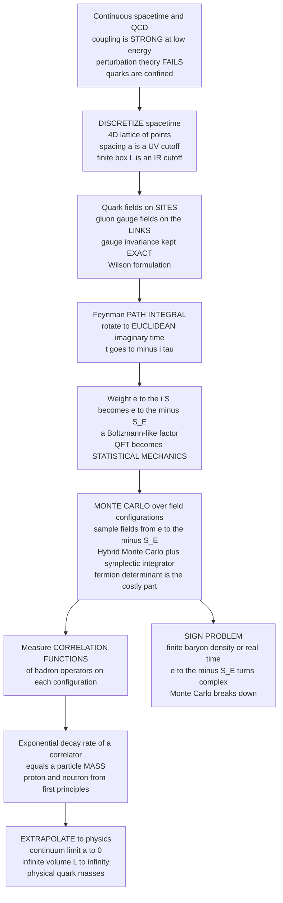

# ⚛️ Lattice QCD and Field Theory Simulation

> [!abstract] TL;DR
> The force that binds **quarks** into protons — the **strong force**, described by **Quantum Chromodynamics (QCD)** — is so powerful at low energies that its coupling is *large*, so you **cannot** use Feynman-diagram perturbation theory: the theory is **non-perturbative**. Yet the deepest facts about matter — that quarks are permanently **confined** (never seen free), and the very **masses of the proton and neutron** — live in exactly this regime. **Lattice QCD** is the *only known* way to compute them from first principles. The trick is audacious: chop **spacetime itself** into a 4-dimensional grid of points, put the quark fields on the **sites** and the gluon fields on the **links** between them, and recast Feynman's quantum **path integral** in **Euclidean (imaginary) time**, where the quantum weight `e^{iS}` becomes a Boltzmann-like factor `e^{-S_E}`. That single rotation turns quantum field theory into a **statistical-mechanics** problem — a gigantic Boltzmann average — which can be attacked with **Monte Carlo**, specifically **Hybrid (Hamiltonian) Monte Carlo** using a **symplectic integrator** to propose global field moves. Physical quantities come out of **correlation functions**: the **exponential decay rate of a two-point correlator is a particle's mass**. This machinery has computed the proton mass and the hadron spectrum from the fundamental theory — one of the great triumphs of computational physics, and among the **most demanding calculations in all of science**. Its frontier is the **sign problem**: at finite baryon density or in real time, `e^{-S_E}` turns complex and Monte Carlo collapses — a wall where new methods, including **quantum computing**, may eventually be needed.

---

## Intuition

**Analogy — putting the fabric of reality on graph paper.** Imagine you want to know the pitch of a drumhead, but you have no formula — the membrane is too complicated to solve with pen and paper. So you do something crude but powerful: you overlay a fine mesh of points on the drumhead, track only the height at each grid point, and let a computer shake the mesh millions of times to find how it naturally vibrates. Lattice QCD does the same thing to *spacetime itself*. The "drumhead" is the quantum vacuum filled with quark and gluon fields; the "mesh" is a four-dimensional grid of points spaced a tiny distance `a` apart; and the "shaking" is an enormous **Monte Carlo** simulation that generates random snapshots of the fields, weighted by how likely each snapshot is. From these snapshots you read off the "pitches" — which here are the **masses of particles** like the proton.

The reason physicists are forced into this brute-force grid is that the strong force is a bully you can never fully corner: pull two quarks apart and the binding energy *grows* until it snaps into new particles, so a single quark is never free — this is **confinement**. That same strength is exactly what makes the pencil-and-paper method (perturbation theory) useless, because there is no "small knob" to expand in. The lattice is the one honest workaround: don't approximate the equations, *discretize the universe* and simulate it. It is arguably the most computationally demanding first-principles calculation in science — literally putting the fundamental fabric of reality on a grid and computing, from scratch, the mass of the proton that makes up you.

---

## How It Works

### Core Mechanics

1. **The problem — QCD is non-perturbative at low energy.** [[Non_Abelian_Gauge_Theories|Quantum Chromodynamics]] is the theory of **quarks** and **gluons** interacting via the strong force, carrying a "colour" charge. Its defining feature is **asymptotic freedom**: the coupling is *weak* at very high energy (short distances) but grows *strong* at low energy (the everyday scale of protons and neutrons). At high energy you can draw [[Fundamental_Forces_and_Feynman_Diagrams|Feynman diagrams]] and expand in the small coupling — perturbation theory works. At low energy the coupling is of order one, the diagram expansion **diverges**, and perturbation theory is simply *invalid*. This is not a minor inconvenience: **confinement** (quarks are never observed in isolation) and the **hadron masses** (proton, neutron, pion) are *intrinsically* non-perturbative. There is no known way to get them analytically from QCD. Lattice QCD is the only first-principles route.

2. **Discretizing spacetime — the core idea.** Replace the continuum of spacetime with a finite **4-dimensional hypercubic lattice** of points separated by a **lattice spacing** `a`. **Quark fields** `ψ(x)` live on the **sites**; the **gluon (gauge) fields** are encoded as **"links"** `U_μ(x)` — group-valued variables sitting on the *edges* joining neighbouring sites, representing the parallel transport of colour from one site to the next. The lattice serves two roles at once: the spacing `a` is a **UV regulator** (no wavelength shorter than `a` exists, so the ultraviolet infinities of continuum QFT are automatically cut off — a concrete, physical version of [[Renormalization_and_RG|regularization]]), and the finite box size `L = N·a` is an **IR cutoff**. Crucially, **Wilson** (1974) showed how to write the discretization so that **gauge invariance is preserved *exactly*** on the lattice — not approximately — which is what makes the whole scheme trustworthy.

3. **The path integral as statistical mechanics — the computational bridge.** In the [[Path_Integral_Formulation|Feynman path-integral formulation]], a quantum average is a sum over *all* field configurations weighted by `e^{iS}`, where `S` is the action. That oscillating complex weight is a nightmare for numerics. The key move is to rotate to **Euclidean (imaginary) time**: substitute `t → -iτ`. Under this **Wick rotation** the oscillatory factor `e^{iS}` becomes a *real, positive* Boltzmann-like factor `e^{-S_E}`, where `S_E` is the **Euclidean action**. Now a quantum expectation value looks *identical* to a thermal average in [[Classical_Statistical_Mechanics|statistical mechanics]]:
   $$\langle \mathcal{O} \rangle = \frac{1}{Z}\int \mathcal{D}\phi\; \mathcal{O}(\phi)\, e^{-S_E[\phi]}, \qquad Z = \int \mathcal{D}\phi\; e^{-S_E[\phi]}.$$
   The path integral `Z` *is* a partition function; `S_E` plays the role of energy divided by temperature; a field configuration is a "microstate". **Quantum field theory has become a (very high-dimensional) statistical-mechanics simulation** — and *that* is precisely why Monte Carlo applies. This is the same conceptual leap that makes the [[The_Ising_Model_and_Statistical_Physics|Ising model]] the perfect training ground: a lattice field theory *is* a generalized Ising-type system with continuous variables.

4. **Monte Carlo over field configurations.** Because `e^{-S_E}` is a genuine (unnormalized) probability weight, we can **sample** field configurations from it with **Markov-chain Monte Carlo** — exactly the machinery of [[The_Metropolis_Algorithm_and_MCMC|the Metropolis algorithm and MCMC]], where only *ratios* of weights are needed so the intractable `Z` cancels. But QCD has a sharp twist: integrating out the fermionic (quark) fields leaves a **fermion determinant** `det(D)` in the weight, a hugely expensive *non-local* object that couples the whole lattice. Naive local updates are hopeless. The standard solution is **Hybrid Monte Carlo (HMC)** — also called **Hamiltonian Monte Carlo**: introduce fictitious momenta, evolve the entire field along a **molecular-dynamics trajectory** using a **symplectic integrator** (see [[Symplectic_Integrators_and_Hamiltonian_Dynamics|symplectic integrators and Hamiltonian dynamics]]), and accept or reject the *global* proposal with a Metropolis step. The symplectic (leapfrog) integrator is essential: its near-exact energy conservation keeps the acceptance rate high even for a global move across millions of variables. HMC, or its Rational-HMC variant for dynamical fermions, is the workhorse algorithm — and it is *extraordinarily* costly.

5. **Extracting physics — correlators give masses.** The output of the simulation is an ensemble of field configurations. On each, you measure **correlation functions** of operators that create and annihilate the particle of interest. The two-point correlator of a hadron operator `O` decays in Euclidean time as a sum of exponentials:
   $$C(\tau) = \langle O(\tau)\,O(0)\rangle \;\xrightarrow{\text{large }\tau}\; A\, e^{-M\tau},$$
   where `M` is the **mass of the lightest state** the operator couples to. In words: **the exponential decay rate of the correlator *is* the particle's mass** — the ground-state energy dominates at large imaginary time. Fitting this decay (or forming an *effective mass* from the ratio of neighbouring time slices) yields hadron masses, and related measurements give **decay constants, form factors, and matrix elements** — all from first principles. This is how the celebrated **ab-initio calculation of the proton mass** (and even the tiny proton–neutron mass splitting, which decides whether the free neutron is heavier than the proton) is done.

6. **The continuum and infinite-volume limits — the hard part.** A lattice result is *not yet* physics. It depends on three unphysical knobs that must be removed by careful **extrapolation**: (i) the **lattice spacing** `a` — real physics lives at `a → 0`, the **continuum limit**, approached along a line of the coupling dictated by asymptotic freedom; (ii) the finite **box size** `L` — must extrapolate to **infinite volume** so the particle isn't squeezed; and (iii) the **quark masses**, often simulated heavier than nature for cost reasons and then extrapolated (via chiral perturbation theory) to their **physical values**. Controlling these **systematic errors** — plus statistical error, discretization artifacts, and excited-state contamination — is what separates a headline from a *trustworthy* number. Modern results quote the proton mass to about 1 percent, with every one of these extrapolations under control.

7. **The sign problem — a fundamental wall.** The whole Monte Carlo edifice rests on `e^{-S_E}` being a *real, positive* weight. That fails in two important cases: at **finite baryon density** (e.g. the interior of neutron stars, or the early-universe quark–gluon plasma at nonzero chemical potential) and for **real-time dynamics** (transport, scattering in real time). There, `S_E` acquires an imaginary part, so the weight becomes **complex and oscillatory** — the notorious **sign problem**. Probabilities go negative, catastrophic cancellations wreck the statistics, and Monte Carlo *fails*. This is a deep, still-open problem (NP-hard in general), and it marks the boundary of what lattice can currently do — a frontier where **quantum computing** (see [[Quantum_Simulation_and_VQE|quantum simulation]]) may one day help by simulating the theory in *real* time on quantum hardware.

8. **Computational scale and broader reach.** Lattice QCD is among the **most demanding computations in science**, consuming a large share of the world's academic supercomputing and *driving hardware co-design* — from custom machines like **QCDOC** and **QPACE** to today's **GPU** clusters — a flagship application whose needs shape high-performance computing (the sibling High_Performance_and_Parallel_Computing note develops the parallelism, domain decomposition, and communication patterns this entails). The methods generalize far beyond QCD: **lattice field theory** studies the Higgs/electroweak sector, condensed-matter and statistical field theories, and — as pedagogical toy models — scalar `φ⁴` theory and gauge theories in lower dimensions. The general framework is simply *"put a field theory on a grid and simulate its Euclidean path integral"*, and the toy version of it is exactly what the Python demo below builds.

### Flow / Architecture



---

## Key Concepts

### Secondary Level

- **The strong force is unbreakable.** The force gluing quarks into a proton is so strong you can never pull a single quark out on its own — this is **confinement**. Because it is so strong, the usual "approximate with small corrections" method does not work.
- **Put spacetime on graph paper.** To make progress, physicists chop space *and* time into a grid of points and simulate the fields living on it, instead of solving impossible equations by hand.
- **Randomly shake the grid.** A computer generates millions of random snapshots of the fields, keeping likely ones more often — a **Monte Carlo** simulation. Averaging over the snapshots gives physical answers.
- **Reading off a mass.** How fast a certain signal fades across the grid tells you the **mass** of a particle. This is how the mass of the proton has been computed from scratch.
- **It is enormously expensive.** Lattice QCD is one of the biggest number-crunching jobs in all of science, running on the world's fastest supercomputers.

### Undergraduate Level

- **Non-perturbative regime.** QCD's running coupling grows at low energy, so the perturbative expansion in Feynman diagrams diverges; confinement and hadron masses require a fully non-perturbative method.
- **Lattice as a regulator.** The spacing `a` is a gauge-invariant UV cutoff (momenta bounded by `π/a`) and the box `L` an IR cutoff; the continuum theory is recovered as `a → 0`.
- **Wick rotation.** `t → -iτ` maps `e^{iS}` (oscillatory) to `e^{-S_E}` (real, positive), turning a QFT expectation value into a statistical-mechanics average over configurations — the reason Monte Carlo works.
- **Importance sampling.** Generate gauge configurations distributed as `e^{-S_E}` via MCMC; observables are simple averages over the ensemble, with statistical error `∝ 1/√N`.
- **Correlators and effective mass.** `C(τ) ∼ A e^{-Mτ}`; the plateau of the effective mass `m_eff(τ) = ln[C(τ)/C(τ+1)]` (or a cosh estimator with periodic boundaries) gives the ground-state mass.
- **The three limits.** A physical result requires extrapolating `a → 0` (continuum), `L → ∞` (infinite volume), and quark masses to their physical values.

### Graduate Level

- **Wilson gauge action and links.** Gauge fields are group elements `U_μ(x) = e^{i a g A_μ(x)}` on links; the action is built from **plaquettes** (smallest closed loops), `S_g = β Σ_□ [1 - (1/N_c)\,\mathrm{Re}\,\mathrm{Tr}\,U_□]`, exactly gauge-invariant. The **Wilson loop** area law is the order parameter for confinement (linear static quark potential).
- **Fermion determinant and its cost.** Integrating out quarks yields `det(D[U])`; **dynamical fermion** simulations must include it, done stochastically with **pseudofermions**. This dominates cost and forces **Rational HMC / RHMC** and multigrid or domain-decomposition solvers for the Dirac operator `D`.
- **Fermion doubling and its cures.** Naive discretization spawns `2^d = 16` spurious "doubler" quarks (Nielsen–Ninomiya theorem forbids a doubler-free, chiral, local, ultralocal action). Practical fermions — **Wilson**, **staggered/KS**, **domain-wall**, **overlap** — each trade off chiral symmetry, cost, and discretization error.
- **HMC in depth.** Molecular dynamics in fictitious momenta with a **leapfrog (symplectic, reversible, area-preserving) integrator**; the Metropolis accept/reject corrects the `O(dτ²)` integration error exactly, so the algorithm is unbiased regardless of step size — the deep link to [[Symplectic_Integrators_and_Hamiltonian_Dynamics|symplectic integration]].
- **Systematics and improvement.** Symanzik-improved actions reduce `O(a)`/`O(a²)` artifacts; critical slowing down (especially topological freezing) worsens as `a → 0`; finite-volume corrections are exponentially small in `m_π L` (rule of thumb `m_π L ≳ 4`).
- **The sign problem.** For `μ_B ≠ 0`, the measure becomes complex; reweighting, Taylor expansion, imaginary-`μ` analytic continuation, complex Langevin, Lefschetz thimbles, and tensor networks are partial workarounds — none general. Formally NP-hard; motivates real-time **quantum simulation** of gauge theories.

---

## Python Demo

Real QCD is far too heavy to run here, so we simulate the *conceptual essence* on the simplest possible lattice field theory: a **1-D lattice scalar field** with a `φ⁴` self-interaction. This toy is not a cartoon — it is *literally* the Euclidean path integral of a single anharmonic quantum oscillator, where the Euclidean-time direction plays the role of the lattice, `e^{-S_E}` is the sampling weight, and **the exponential decay rate of the two-point correlator `⟨φ(0)φ(τ)⟩` is a "mass"** — exactly mimicking how lattice QCD extracts hadron masses from correlators. We sample field configurations with **path-integral Metropolis Monte Carlo** (a checkerboard update, as in the Ising sibling), then measure the correlator and extract the mass from its plateau.

```python
# Lattice SCALAR FIELD THEORY in 1D via PATH-INTEGRAL Monte Carlo.
#   This is the Euclidean path integral of an (an)harmonic quantum oscillator:
#   the lattice = Euclidean time, e^{-S_E} = the sampling weight.
#
#   Local Euclidean action per time-slice t (lattice spacing a = 1, periodic):
#       S = sum_t [ 0.5*(phi[t+1]-phi[t])^2 + 0.5*m0^2*phi[t]^2 + lam*phi[t]^4 ]
#          |------ kinetic (hopping) -----|  |-- mass --|      |- quartic -|
#
#   We (a) Metropolis-sample field configurations from e^{-S_E},
#       (b) measure the connected correlator C(tau) = <phi_t phi_{t+tau}>,
#       (c) extract a "particle MASS" from its exponential/cosh decay --
#           the toy analogue of extracting a HADRON MASS in lattice QCD.
#   We compare a FREE theory (lam=0) to an INTERACTING one (lam>0): the
#   interaction SHIFTS the measured mass -- a mass computed from first
#   principles, just like the proton mass in real lattice QCD.
# Requires: numpy, matplotlib.

import numpy as np
import matplotlib.pyplot as plt

rng = np.random.default_rng(2026)

def run_scalar_field(N=200, m0=1.0, lam=0.0, step=1.3,
                     n_therm=3000, n_meas=12000, n_skip=4):
    """Checkerboard Metropolis on a 1D lattice scalar field (periodic BCs).
    Returns the averaged connected correlator C(tau), a sample field
    configuration, all sampled field values, and the acceptance rate."""
    phi = rng.normal(0.0, 0.5, size=N)
    even = (np.arange(N) % 2 == 0)
    masks = [even, ~even]
    corr = np.zeros(N)
    field_samples = []
    n_acc = n_try = n_corr = 0

    for sweep in range(n_therm + n_meas):
        for mask in masks:                       # update one colour at a time
            left, right = np.roll(phi, 1), np.roll(phi, -1)   # fixed neighbours
            old = phi
            new = phi + rng.normal(0.0, step, size=N)
            # local change in Euclidean action for flipping site t -> new
            dS = (0.5 * ((new - left)**2 + (right - new)**2
                         - (old - left)**2 - (right - old)**2)
                  + 0.5 * m0**2 * (new**2 - old**2)
                  + lam * (new**4 - old**4))
            accept = (np.log(rng.random(N)) < -dS) & mask
            phi = np.where(accept, new, phi)
            n_acc += np.count_nonzero(accept & mask)
            n_try += np.count_nonzero(mask)

        if sweep >= n_therm and (sweep - n_therm) % n_skip == 0:
            # connected 2-pt correlator via FFT (average over all t on this config)
            f = np.fft.rfft(phi)
            c = np.fft.irfft(f * np.conj(f), n=N) / N
            corr += c - phi.mean()**2
            field_samples.append(phi.copy())
            n_corr += 1

    return corr / n_corr, phi.copy(), np.concatenate(field_samples), n_acc / n_try

def effective_mass_cosh(C):
    """Cosh effective mass for periodic BCs:
       m_eff(tau) = arccosh( [C(tau-1)+C(tau+1)] / [2 C(tau)] )."""
    N = len(C)
    taus = np.arange(1, N // 2)
    ratio = (C[taus - 1] + C[taus + 1]) / (2.0 * C[taus])
    ratio = np.where(ratio > 1.0, ratio, np.nan)     # guard noisy tail
    return taus, np.arccosh(ratio)

# ---- run a FREE theory and an INTERACTING theory --------------------------
N = 200
C_free, cfg_free, phis_free, acc_free = run_scalar_field(N, m0=1.0, lam=0.0)
C_int,  cfg_int,  phis_int,  acc_int  = run_scalar_field(N, m0=1.0, lam=1.0)

tau_f, meff_f = effective_mass_cosh(C_free)
tau_i, meff_i = effective_mass_cosh(C_int)

# plateau = average m_eff over an intermediate-tau window (avoid short/noisy tau)
def plateau(taus, meff, lo=6, hi=20):
    win = (taus >= lo) & (taus <= hi)
    return np.nanmean(meff[win])

M_free, M_int = plateau(tau_f, meff_f), plateau(tau_i, meff_i)
# analytic free-field lattice mass for a cross-check: cosh(E) = 1 + m0^2/2
M_free_theory = np.arccosh(1.0 + 1.0**2 / 2.0)
print(f"acceptance: free={acc_free:.2f}  interacting={acc_int:.2f}")
print(f"extracted mass  free       = {M_free:.3f}   (theory {M_free_theory:.3f})")
print(f"extracted mass  interacting= {M_int:.3f}   (heavier: quartic stiffens the well)")

# --------------------------------- plots -----------------------------------
fig, ax = plt.subplots(2, 2, figsize=(14, 9))

# (1) a sampled Euclidean field configuration (one "path")
ax[0, 0].plot(cfg_free, color="#2563eb", lw=1.0)
ax[0, 0].axhline(0, color="k", lw=0.6, ls=":")
ax[0, 0].set_title("(1) One sampled field configuration phi(t)\n"
                   "a Euclidean-time 'path' drawn from e^{-S_E}")
ax[0, 0].set_xlabel("lattice site  t  (Euclidean time)")
ax[0, 0].set_ylabel("field  phi")

# (2) connected correlator C(tau): exponential/cosh decay (log scale)
half = N // 2
tt = np.arange(half)
ax[0, 1].semilogy(tt, np.abs(C_free[:half]), "o-", ms=3, color="#2563eb",
                  label="free  (lam=0)")
ax[0, 1].semilogy(tt, np.abs(C_int[:half]),  "s-", ms=3, color="#dc2626",
                  label="interacting (lam=1)")
ax[0, 1].set_title("(2) Two-point correlator C(tau)\n"
                   "straight line on log axis = exponential decay = a MASS")
ax[0, 1].set_xlabel("Euclidean time separation  tau")
ax[0, 1].set_ylabel("C(tau)  (log scale)")
ax[0, 1].legend(); ax[0, 1].grid(alpha=0.3, which="both")

# (3) effective mass plateau -> the extracted particle mass
ax[1, 0].plot(tau_f, meff_f, "o-", ms=3, color="#2563eb", label="free")
ax[1, 0].plot(tau_i, meff_i, "s-", ms=3, color="#dc2626", label="interacting")
ax[1, 0].axhline(M_free, color="#2563eb", ls="--",
                 label=f"free plateau M={M_free:.2f}")
ax[1, 0].axhline(M_int,  color="#dc2626", ls="--",
                 label=f"interacting plateau M={M_int:.2f}")
ax[1, 0].set_ylim(0, max(np.nanmax(meff_i[:25]) * 1.2, 1.5))
ax[1, 0].set_title("(3) Effective mass m_eff(tau)\n"
                   "the PLATEAU is the extracted 'hadron' mass")
ax[1, 0].set_xlabel("Euclidean time separation  tau")
ax[1, 0].set_ylabel("effective mass  m_eff")
ax[1, 0].legend(fontsize=8); ax[1, 0].grid(alpha=0.3)

# (4) distribution of field values = ground-state |psi_0(phi)|^2
ax[1, 1].hist(phis_free, bins=80, density=True, color="#2563eb", alpha=0.5,
              label="free: Gaussian |psi_0|^2")
ax[1, 1].hist(phis_int, bins=80, density=True, color="#dc2626", alpha=0.5,
              label="interacting: narrower")
xs = np.linspace(phis_free.min(), phis_free.max(), 300)
g = np.exp(-xs**2 / (2 * phis_free.var())) / np.sqrt(2 * np.pi * phis_free.var())
ax[1, 1].plot(xs, g, "k--", lw=1.5, label="Gaussian fit (free)")
ax[1, 1].set_title("(4) Sampled field amplitudes = |psi_0(phi)|^2\n"
                   "the quantum ground state, straight from the path integral")
ax[1, 1].set_xlabel("field value  phi"); ax[1, 1].set_ylabel("probability density")
ax[1, 1].legend(fontsize=8)

plt.tight_layout()
plt.show()
```

**What you see.** Panel (1) is a single Monte Carlo snapshot of the field along Euclidean time — a jagged "path", one microstate drawn from `e^{-S_E}`. Panel (2) plots the two-point correlator on a log axis: it falls as a near-straight line, the hallmark of **exponential decay** `C(τ) ∼ e^{-Mτ}` — the very signal from which masses are read. Panel (3) turns that decay into an **effective mass** that settles onto a **plateau**; the plateau height *is* the extracted "particle mass". The free theory lands near the analytic lattice value `arccosh(1 + m₀²/2) ≈ 0.96`, while the interacting (`φ⁴`) theory sits **higher** — the self-interaction has *shifted the mass*, a mass computed entirely from first principles, exactly the spirit of the ab-initio proton-mass calculation. Panel (4) is a bonus: the histogram of sampled field values reproduces the quantum **ground-state probability `|ψ₀(φ)|²`** (Gaussian for the free oscillator, non-Gaussian once `φ⁴` is switched on) — the ground-state wavefunction falling straight out of the path integral. **On the continuum limit:** the plateau value is a *lattice* mass in units of the spacing `a`; a physical result would require repeating at several smaller `a` and extrapolating `a → 0`, plus growing the box `N` toward infinite volume — the same two extrapolations that dominate real lattice QCD.

---

## Real-World Applications

- **The proton mass and the hadron spectrum.** The flagship result: computing the masses of the proton, neutron, pion, and dozens of other hadrons from QCD alone, agreeing with experiment at the percent level — a landmark validating the Standard Model's strong sector (see [[Standard_Model_Overview]]). Over 99 percent of a proton's mass comes not from the quarks' rest mass but from gluon field energy, a fact only lattice QCD can quantify.
- **The neutron–proton mass difference.** A lattice calculation (including QED and quark-mass effects) reproduced the tiny `≈ 1.3 MeV` splitting that makes the neutron heavier than the proton — the reason free neutrons decay and stable hydrogen exists. A striking case of computation deciding a fact of cosmological importance.
- **Precision Standard Model tests.** Lattice-computed **decay constants**, **form factors**, and **matrix elements** feed the determination of CKM matrix elements and the muon `g-2` hadronic contribution — where a lattice-vs-experiment tension has been a focus of the search for new physics.
- **Finite-temperature QCD and the early universe.** Lattice simulations map the **QCD phase transition** (the crossover from confined hadrons to a **quark–gluon plasma**), directly relevant to heavy-ion collisions (RHIC, LHC) and the microseconds-old universe — a field-theoretic cousin of the [[Phase_Transitions_and_Critical_Phenomena|phase transitions]] studied on the Ising lattice.
- **Beyond QCD.** The same lattice-path-integral framework probes candidate Higgs/electroweak dynamics, technicolor and composite-Higgs models, and — as **lattice statistical field theory** — condensed-matter systems, all through Euclidean Monte Carlo.
- **A driver of high-performance computing.** Lattice QCD's appetite has shaped supercomputing: purpose-built machines (QCDOC, QPACE, the QCDSP lineage that seeded IBM Blue Gene) and today's massively parallel GPU codes, making it a canonical HPC co-design story.

---

## Common Pitfalls

- **Trying to use perturbation theory at low energy.** The whole point is that the strong coupling is `O(1)` there — Feynman-diagram expansions diverge. Confinement and hadron masses are *definitionally* non-perturbative; only the full lattice path integral captures them.
- **Forgetting the Euclidean rotation.** In *real* (Minkowski) time the weight `e^{iS}` oscillates and Monte Carlo cannot importance-sample it. The `t → -iτ` Wick rotation to a real positive `e^{-S_E}` is what makes the whole method possible — and undoing it (real-time dynamics) reintroduces the sign problem.
- **Fermion doubling silently corrupting results.** A naive lattice Dirac operator secretly describes 16 quark species. Using an unimproved discretization without a doubler cure (Wilson/staggered/domain-wall/overlap) gives physically wrong spectra.
- **Fitting the correlator too early.** At small `τ`, excited states contaminate `C(τ)`; the mass only appears in the *plateau* at large `τ`, where the signal is also weakest (exponentially small over statistical noise). Balancing excited-state bias against noise is the central art of mass extraction.
- **Reporting a lattice number as a physical one.** A single-`a`, single-`L`, heavy-quark result is *not* a prediction. Omitting the continuum (`a → 0`), infinite-volume (`L → ∞`), or physical-quark-mass extrapolations produces confidently wrong values with underestimated error bars.
- **Ignoring autocorrelation and topological freezing.** Successive HMC configurations are correlated, and as `a → 0` the topological charge "freezes", inflating autocorrelation times catastrophically. Naive independent-sample error bars are wildly overoptimistic (the same lesson as in [[The_Metropolis_Algorithm_and_MCMC|MCMC]] critical slowing down).
- **Assuming Monte Carlo always works.** At finite baryon density or in real time the measure turns complex — the **sign problem** — and no amount of statistics rescues it. Recognizing where the lattice *cannot* go is as important as using it where it can.

---

## Related Concepts

- [[Path_Integral_Formulation]] — the Feynman path integral whose Euclidean (imaginary-time) version is the entire foundation of lattice field theory; lattice QCD is its non-perturbative numerical realization.
- [[Non_Abelian_Gauge_Theories]] — QCD itself; the SU(3) colour gauge theory of quarks and gluons that the lattice discretizes while preserving gauge invariance exactly.
- [[Standard_Model_Overview]] — lattice QCD supplies the non-perturbative strong-sector predictions (hadron masses, matrix elements) that test the Standard Model.
- [[Fundamental_Forces_and_Feynman_Diagrams]] — the perturbative diagram method that *fails* for the strong force at low energy, forcing the lattice approach.
- [[Renormalization_and_RG]] — the lattice spacing `a` is a concrete UV regulator; the continuum limit `a → 0` is taken along a renormalization-group trajectory set by asymptotic freedom.
- [[Spontaneous_Symmetry_Breaking]] — chiral symmetry breaking, central to light-hadron physics, is a non-perturbative phenomenon that lattice QCD studies directly.
- [[Classical_Statistical_Mechanics]] — supplies the Boltzmann weight and partition-function structure that the Euclidean path integral becomes, the bridge that lets Monte Carlo apply.
- [[The_Metropolis_Algorithm_and_MCMC]] — the Markov-chain sampling engine (ratios-only, `Z` cancels) underneath all lattice simulation; HMC is its gradient-informed descendant.
- [[Symplectic_Integrators_and_Hamiltonian_Dynamics]] — Hybrid Monte Carlo proposes global field moves by integrating Hamiltonian dynamics with a symplectic (leapfrog) integrator, the standard lattice-QCD algorithm.
- [[The_Ising_Model_and_Statistical_Physics]] — the archetypal lattice model; lattice field theory is its continuous-variable, gauge-invariant generalization, and both share Monte Carlo, correlators, and critical slowing down.
- [[Phase_Transitions_and_Critical_Phenomena]] — the continuum limit is a critical point, and finite-temperature QCD (confinement to quark-gluon plasma) is a genuine phase transition.
- [[Quantum_Simulation_and_VQE]] — real-time and finite-density QCD hit the sign problem, motivating quantum computers to simulate gauge theories directly.
- [[Computational_Physics_Overview]] — situates lattice field theory within the vault's landscape of numerical methods.

Within this Computational Physics vault, lattice QCD is the frontier where three earlier threads converge: the Monte Carlo sampling of The_Metropolis_Algorithm_and_MCMC and The_Ising_Model_and_Statistical_Physics, the Hamiltonian dynamics of Symplectic_Integrators_and_Hamiltonian_Dynamics (via HMC), and the quantum-path-integral ideas of The_Variational_and_Diffusion_Monte_Carlo — all pushed to the scale that demands the parallelism of the forthcoming High_Performance_and_Parallel_Computing note.

---

## Review Questions

1. **(Conceptual)** Explain *why* QCD requires a lattice, non-perturbative treatment at low energy when quantum electrodynamics can be handled with perturbative Feynman diagrams. In your answer, connect the behaviour of the running coupling (asymptotic freedom) to the failure of the diagram expansion and to confinement.
2. **(Scenario/Mechanism)** You have generated an ensemble of gauge configurations and measured a hadron two-point correlator `C(τ)`. Walk through, step by step, how you turn this into a *physical* particle mass — including the role of Euclidean time, why the mass appears only in the large-`τ` plateau, and which three extrapolations you must perform before the number counts as a prediction of QCD.
3. **(Trade-off/Frontier)** The entire Monte Carlo method hinges on `e^{-S_E}` being real and positive. Explain precisely where and why this breaks down (the sign problem), give one concrete physical situation where it blocks lattice QCD, and discuss why real-time quantum simulation is a candidate cure. Contrast this fundamental obstacle with the merely *practical* cost of the fermion determinant.

---

## Sources

- Wilson, K. G. (1974). "Confinement of Quarks." *Physical Review D*, 10(8), 2445–2459. — the founding paper of lattice gauge theory.
- Gattringer, C. & Lang, C. B. (2010). *Quantum Chromodynamics on the Lattice: An Introductory Presentation*. Springer (Lecture Notes in Physics 788). — the standard modern textbook.
- Creutz, M. (1983). *Quarks, Gluons and Lattices*. Cambridge University Press. — the classic pedagogical introduction to Monte Carlo lattice gauge theory.
- Dürr, S. et al. (BMW Collaboration) (2008). "Ab Initio Determination of Light Hadron Masses." *Science*, 322(5905), 1224–1227. — the landmark first-principles hadron spectrum.
- Borsányi, S. et al. (2015). "Ab initio calculation of the neutron-proton mass difference." *Science*, 347(6229), 1452–1455. — computing the proton–neutron splitting on the lattice.
- Duane, S., Kennedy, A. D., Pendleton, B. J. & Roweth, D. (1987). "Hybrid Monte Carlo." *Physics Letters B*, 195(2), 216–222. — the HMC algorithm that powers dynamical-fermion lattice QCD.

---

#computational-physics #lattice-QCD #quantum-field-theory #path-integral #monte-carlo
