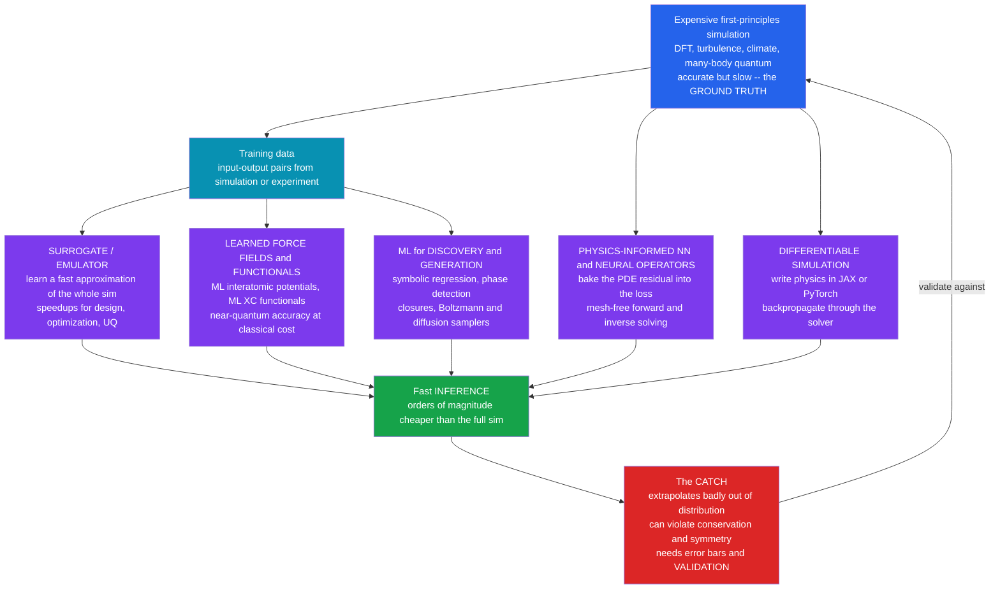

# 🤖 Machine Learning in Computational Physics

> [!abstract] TL;DR
> **Scientific machine learning (SciML)** fuses deep learning with first-principles simulation, and it is reshaping computational physics along four axes. **Surrogate models / emulators** train a neural network to *mimic* an expensive simulation's input-output map — a **DFT** calculation, a turbulence or climate run, a fluid solver — trading a large **upfront training cost** for **orders-of-magnitude faster inference**, the workhorse for design, optimization, and uncertainty quantification. **Machine-learning interatomic potentials** (**Behler-Parrinello, GAP, ANI, NequIP, MACE**) and **ML exchange-correlation functionals** learn the expensive quantum physics itself, delivering **near-quantum accuracy at classical molecular-dynamics cost** — arguably SciML's biggest success. **Physics-informed neural networks (PINNs)** bake the governing PDE *into the loss* by penalizing the equation's residual (using auto-differentiation for the derivatives), giving a mesh-free forward *and* **inverse** solver; **neural operators** (**Fourier Neural Operator, DeepONet**) go further and learn the *solution operator* of a whole family of PDEs. **Differentiable simulation** writes the physics in **JAX** or **PyTorch** so you can **backpropagate through the solver** for gradient-based control, parameter fitting, and end-to-end learning. The essential caveat: ML models **extrapolate unreliably out of distribution**, can **violate conservation laws and symmetries**, and lack error bars — so SciML **augments rather than replaces** first-principles simulation, which remains the **ground truth** against which every learned model must be *validated*.

## Intuition

**Analogy:** Traditional simulation is like solving a maze by carefully tracing every corridor from first principles — walk each passage, honour every wall, backtrack at every dead end. It is rigorous and it is *slow*. Machine learning is like a rat that has run a thousand similar mazes and now sprints to the exit on instinct — blindingly fast, but only trustworthy for mazes that resemble the ones it has seen, and prone to charging straight into a wall in a maze laid out differently. The exciting frontier of computational physics **fuses the two**: let a neural network *learn* the expensive part of a simulation from data, then run it thousands of times faster — while still **checking the answer against the real physics**.

The move is always the same: identify the step that is crushingly expensive — solving the electronic Schrödinger equation for the forces on every atom, resolving every turbulent eddy, integrating a climate model for a century — and *replace that step with a fast learned approximation trained on data the expensive method already produced*. You pay a steep one-time training bill, and in exchange every subsequent evaluation is nearly free. From **AlphaFold** predicting protein structures to neural emulators of climate and cosmology models, ML is becoming a genuine **new pillar of scientific computing** — sitting alongside, not on top of, the first-principles methods it learns from.

---

## How It Works

### Core Mechanics

**1. Why physics is desperate for shortcuts.** A vast swath of computational physics is bottlenecked by a few *ruinously expensive* kernels. **Density functional theory (DFT)** scales as roughly the cube of the electron count, capping *ab-initio* molecular dynamics at hundreds of atoms and picoseconds. **Direct numerical simulation of turbulence** must resolve every eddy down to the dissipation scale, exploding in cost with Reynolds number. **Climate and cosmology** models run for months on supercomputers for a single trajectory. The core observation of SciML is that these expensive methods generate *data* — input configurations paired with their computed outputs — and that a machine-learning model can **learn the input-output map from that data**, then reproduce it at a tiny fraction of the cost. You are **trading an upfront training cost for cheap inference**.

**2. Surrogate models and emulators — learn the whole map.** The most direct paradigm: treat the expensive simulation as a black-box function $y = f(x)$ from inputs $x$ (initial conditions, material parameters, boundary conditions) to outputs $y$ (a drag coefficient, a spectrum, a full field), and fit a fast approximation $\hat f_\theta \approx f$ from a dataset of runs. Once trained, $\hat f_\theta$ evaluates in milliseconds, enabling loops that were previously unthinkable: **design optimization** over thousands of candidate geometries, **uncertainty quantification** by Monte-Carlo sampling the input distribution (the sibling *[[Monte_Carlo_Integration]]* problem made tractable), and real-time **inverse design**. The danger is structural: a surrogate is only trustworthy *inside the region its training data covers*. Push the inputs beyond that region and it **extrapolates blindly**, often confidently and catastrophically wrong — the single most important caution in the whole field (the demo makes this failure visible).

**3. Learned force fields and functionals — learn the expensive physics.** Rather than emulate an entire simulation, learn the expensive *component* and plug it into the ordinary numerical machinery. The flagship success is the **machine-learning interatomic potential (MLIP)**: a neural network or Gaussian-process model that learns the **potential-energy surface** $E(\{\mathbf r_i\})$ from **quantum (DFT) reference data**, then supplies forces $-\nabla E$ to a standard velocity-Verlet integrator. **Behler-Parrinello** networks (2007) pioneered this with symmetry-function descriptors; **GAP** used Gaussian processes; modern **equivariant** architectures — **NequIP, MACE, Allegro** — build rotational symmetry directly into the network and reach DFT accuracy with astonishingly little data. The payoff is transformative: **near-quantum accuracy at classical-MD cost**, extending *[[Molecular_Dynamics_Simulation]]* to system sizes and timescales that *ab-initio* MD could never reach (the not-yet-written sibling *Density_Functional_Theory_and_Electronic_Structure* is the quantum engine that generates the training labels). The same idea drives **ML exchange-correlation functionals** that learn the one unknown term in DFT itself.

**4. Physics-informed neural networks — bake the equations into the loss.** Instead of learning from simulation *outputs*, PINNs learn from the *governing equations directly*. Represent the solution field as a neural network $u_\theta(x,t)$, then use **automatic differentiation** to compute its derivatives $\partial_t u_\theta,\ \nabla^2 u_\theta,\ \dots$ *exactly*, and train it to make the **PDE residual vanish** at a cloud of collocation points, together with the boundary and initial conditions:

$$
\mathcal L(\theta) = \underbrace{\big\lVert \mathcal N[u_\theta] \big\rVert^2_{\text{interior}}}_{\text{PDE residual}} + \underbrace{\big\lVert u_\theta - g \big\rVert^2_{\partial\Omega}}_{\text{boundary / initial}} .
$$

The result is a **mesh-free PDE solver** — no grid, no discretization stencil — that shines especially at **inverse problems**: hand it *sparse, noisy measurements* and let it *infer* an unknown parameter or hidden field by adding a data term to the same loss. The weakness is honest: PINNs struggle with **stiff, multiscale, or high-frequency** PDEs, the loss landscape is hard to optimize, and they are usually *slower* than a good classical solver for a single well-posed forward problem — their edge is inverse problems and irregular geometries.

**5. Neural operators — learn the solution operator.** A PINN solves *one* problem instance; a **neural operator** learns the *map from input functions to solution functions* for a *whole family*. The **Fourier Neural Operator (FNO)** parameterizes this operator in the frequency domain, so a single trained network maps *any* initial condition to the solved field; **DeepONet** learns operators via a branch-trunk decomposition. Once trained, a neural operator is a **fast PDE surrogate** that generalizes across instances — evaluate a new initial condition in one forward pass rather than re-running a solver.

**6. Differentiable simulation — backpropagate through the physics.** Write the *entire* simulation in an auto-differentiable framework (**JAX, PyTorch** — the *[[JAX_and_Flax]]* and *[[PyTorch_Fundamentals]]* tooling), and the whole solver becomes one big differentiable function. Now you can compute the **gradient of any output with respect to any input or parameter** by *[[Backpropagation]]* through the timesteps — enabling gradient-based **control**, **parameter fitting**, **inverse design**, and **end-to-end learning** where a neural network and a physics solver are trained *jointly*. Differentiable **physics engines**, differentiable **rendering**, and differentiable **molecular dynamics** all exploit this; it ties SciML directly to GPU and ML infrastructure (the not-yet-written sibling *GPU_Computing_and_Numerical_Libraries*).

**7. ML for discovery, generation, and inversion.** Beyond acceleration, ML is a *discovery* tool. **Symbolic regression** searches the space of equations to *rediscover* physical laws from data; **unsupervised learning** detects **phase transitions** and **order parameters** without labels; ML learns **collective variables** and **reduced/closure models** — notably **turbulence closures** that inject learned subgrid physics into coarse solvers. On the generative side, **Boltzmann generators** and **diffusion models** learn to *sample* equilibrium distributions directly (the direct descendant of *[[Stochastic_Differential_Equations_and_Langevin]]* dynamics and *[[Diffusion_Models]]*), and ML drives **inverse design** of materials and molecules.

**8. The caveats — where rigour re-enters.** SciML's power comes with sharp edges. A learned model can silently **violate conservation of energy, momentum, or charge** and **break symmetries** (rotation, translation, parity) that the true physics respects — motivating **physics-constrained architectures** (equivariant networks, Hamiltonian and Lagrangian neural networks, hard-constraint layers). It **extrapolates unreliably** the moment inputs leave the training distribution, it usually lacks **calibrated error bars and interpretability**, and it is **data-hungry**. The discipline is therefore: ML **augments** first-principles simulation, and **every learned prediction must be validated against the physics** it approximates. The ground truth is still the equations.

### Flow / Architecture



---

## Key Concepts

### Secondary (intuition first)
- **Learn the slow part, then sprint.** Many physics simulations are painfully slow. ML watches the slow method run, learns to imitate it, and then reproduces the answer thousands of times faster.
- **A surrogate is a stand-in.** Train a model to copy an expensive simulation, and you can run the *copy* millions of times for design and "what-if" studies that the original could never afford.
- **The rat only knows the mazes it has seen.** A learned model is trustworthy for inputs like its training data and *unreliable* beyond them — the extrapolation trap.
- **Physics as the teacher and the referee.** You can *teach* a network the governing equations (physics-informed learning) and you must always *check* its answers against real physics (validation). The equations remain the ground truth.

### Undergraduate (mechanics of the method)
- **Surrogate / emulator.** Fit $\hat f_\theta \approx f$ to input-output data from an expensive simulation; cheap inference powers optimization and uncertainty quantification. Fails outside the training range.
- **Machine-learning interatomic potential (MLIP).** Learn $E(\{\mathbf r_i\})$ from DFT data; supply forces $-\nabla E$ to standard MD. **Behler-Parrinello, GAP, ANI, NequIP, MACE** — near-DFT accuracy at classical cost. Equivariant models bake in rotational symmetry.
- **Physics-informed neural network (PINN).** Represent $u_\theta(x,t)$; use auto-diff for its derivatives; minimize the PDE **residual** plus boundary/initial terms. Mesh-free; strong at **inverse** problems (infer unknown parameters from sparse data).
- **Neural operator.** Learn the *solution operator* mapping input functions to solutions across a PDE family — **Fourier Neural Operator (FNO)**, **DeepONet**. A reusable, fast surrogate for a whole class of problems.
- **Differentiable simulation.** Write the solver in an auto-diff framework; backpropagate to get gradients of outputs with respect to parameters, enabling optimization *through* physics.
- **Training cost vs inference cost.** SciML shifts work: a large one-time training cost buys near-free evaluation forever after. Worthwhile only when you will call the model *many* times.

### Graduate (system-level judgment)
- **Inductive bias and physics-constrained architectures.** Encoding known structure sharpens data efficiency and enforces physical law: **equivariant** networks (E(3)-equivariant NequIP/MACE) guarantee rotational/translational symmetry; **Hamiltonian** and **Lagrangian** neural networks conserve energy by construction; **hard-constraint** and divergence-free layers enforce conservation exactly rather than as a soft penalty. Baking in symmetry beats hoping the network learns it.
- **Why PINNs are hard to train.** The composite loss mixes terms of wildly different scales; the PDE residual creates a **stiff, ill-conditioned** optimization landscape; **spectral bias** makes networks slow to learn high-frequency content; and multiscale or advection-dominated PDEs can defeat naive PINNs entirely. Remedies include loss re-weighting, curriculum/causal training, domain decomposition, and Fourier-feature embeddings — active research, not a solved problem.
- **Generalization and out-of-distribution failure.** A learned model interpolates within its data manifold and gives *no guarantee* outside it. Rigorous SciML pairs predictions with **uncertainty quantification** — deep ensembles, Bayesian/Gaussian-process surrogates, conformal prediction — and uses **active learning** to detect and label configurations where the model is unsure (essential for building trustworthy MLIPs that never encounter an unphysical geometry silently).
- **The accuracy-cost-transferability triangle.** Classical force fields: cheap, transferable, low accuracy. DFT / *ab-initio*: accurate, not transferable to large systems, ruinously expensive. MLIPs sit *inside* the triangle — DFT-like accuracy at classical cost — but their transferability is bounded by training coverage, so extrapolation to unseen chemistries or extreme conditions is the failure mode to guard against.
- **Differentiable everything and the adjoint connection.** Backpropagating through a solver is the **adjoint method** of PDE-constrained optimization computed automatically; it links SciML to classical optimal control and to *[[Gradient_Descent]]*-based parameter estimation. Memory cost of storing the forward trajectory (or checkpointing) is the practical constraint.
- **ML as discovery vs ML as acceleration.** Two distinct goals: *accelerate* a known computation (surrogates, MLIPs, neural operators) versus *discover* new structure (symbolic regression recovering governing equations, unsupervised order-parameter and phase detection, learned closures). The first is validated by speed-and-accuracy against ground truth; the second must survive the far harder test of *physical interpretability and generalization*.

---

## Python Demo

```python
# SCIENTIFIC MACHINE LEARNING in miniature -- numpy + matplotlib only.
#
# The "expensive physics": the EXACT period of a simple pendulum released from
# amplitude theta0.  Beyond the small-angle approximation the period grows and
# eventually DIVERGES as theta0 -> pi.  The exact period / small-angle period is
#     R(theta0) = (2/pi) * K( sin(theta0/2) )
# where K is the complete elliptic integral of the first kind -- which we compute
# by NUMERICAL QUADRATURE (our stand-in for an "expensive simulation").
#
# We demonstrate two core SciML ideas:
#  (a) SURROGATE / EMULATOR -- fit a fast polynomial model to data from the
#      "expensive" solver over a LIMITED training range, show it reproduces the
#      physics almost perfectly INSIDE that range and ~1e4x faster ... then show
#      the DANGER: it EXTRAPOLATES catastrophically OUTSIDE the training range.
#  (b) PHYSICS-INFORMED fit -- enforce known physics (the period is an EVEN
#      function of amplitude and R(0)=1 exactly) and show it generalizes far
#      better from sparse, noisy data than an unconstrained fit.
import numpy as np
import matplotlib.pyplot as plt
import time

rng = np.random.default_rng(0)

# ----------------------- the "expensive" physics solver -----------------------
def period_ratio(theta0, nquad=4000):
    """Exact pendulum period / small-angle period = (2/pi) K(sin(theta0/2)),
    K computed by midpoint quadrature on [0, pi/2].  Vectorized over theta0."""
    theta0 = np.atleast_1d(np.asarray(theta0, dtype=float))
    k2  = np.sin(theta0 / 2.0) ** 2                     # (M,)
    phi = (np.arange(nquad) + 0.5) * (np.pi / 2) / nquad
    dphi = (np.pi / 2) / nquad
    s2  = np.sin(phi) ** 2                              # (nquad,)
    integrand = 1.0 / np.sqrt(1.0 - np.outer(k2, s2))  # (M, nquad)
    K = integrand.sum(axis=1) * dphi
    return (2.0 / np.pi) * K

# ============================ (a) SURROGATE / EMULATOR ========================
train_max = 1.6                          # amplitude range the surrogate SEES (rad)
theta_train = np.linspace(0.0, train_max, 40)
R_train = period_ratio(theta_train)      # labels from the "expensive" solver

deg = 8
coef = np.polyfit(theta_train, R_train, deg)   # fast polynomial surrogate

theta_test = np.linspace(0.0, 3.0, 400)        # test range EXTENDS well beyond training
R_true = period_ratio(theta_test)              # ground truth
R_surr = np.polyval(coef, theta_test)          # surrogate prediction
abs_err = np.abs(R_surr - R_true)

# --- speed comparison: expensive solver vs cheap surrogate on a big batch ---
big = np.linspace(0.0, train_max, 20000)
t0 = time.perf_counter(); _ = period_ratio(big);        t_exp = time.perf_counter() - t0
t0 = time.perf_counter(); _ = np.polyval(coef, big);    t_sur = time.perf_counter() - t0
speedup = t_exp / max(t_sur, 1e-9)

in_rng  = theta_test <= train_max
out_rng = theta_test >  train_max
print("=== (a) surrogate / emulator ===")
print(f"max |error| INSIDE training range  [0, {train_max}] : {abs_err[in_rng].max():.2e}")
print(f"max |error| OUTSIDE (extrapolation) [>{train_max}]   : {abs_err[out_rng].max():.2e}")
print(f"surrogate is ~{speedup:,.0f}x faster than the expensive solver")

# ======================= (b) PHYSICS-INFORMED vs PLAIN FIT ====================
# sparse, noisy measurements over a SMALL amplitude window
theta_obs = np.linspace(0.15, 1.2, 9)
R_obs = period_ratio(theta_obs) + rng.normal(0, 0.004, size=theta_obs.size)

# PLAIN: unconstrained degree-4 polynomial (all powers, free intercept)
Vp = np.vander(theta_obs, 5, increasing=True)          # [1, t, t^2, t^3, t^4]
c_plain, *_ = np.linalg.lstsq(Vp, R_obs, rcond=None)

# PHYSICS-INFORMED: bake in symmetry (even function) + exact small-angle value.
#   R(theta) = 1 + a*theta^2 + b*theta^4    (R(0)=1 hard-coded, odd powers banned)
Vpi = np.stack([theta_obs**2, theta_obs**4], axis=1)
c_pi, *_ = np.linalg.lstsq(Vpi, R_obs - 1.0, rcond=None)
a_fit = c_pi[0]

theta_g = np.linspace(0.0, 2.2, 400)                   # test range beyond the data
R_g_true  = period_ratio(theta_g)
R_g_plain = np.polyval(c_plain[::-1], theta_g)
R_g_pi    = 1.0 + c_pi[0]*theta_g**2 + c_pi[1]*theta_g**4

gen_plain = np.sqrt(np.mean((R_g_plain - R_g_true)**2))
gen_pi    = np.sqrt(np.mean((R_g_pi    - R_g_true)**2))
print("\n=== (b) physics-informed vs plain fit ===")
print(f"leading coeff a: fit = {a_fit:.4f}   physical value 1/16 = {1/16:.4f}")
print(f"generalization RMSE  plain = {gen_plain:.3e}   physics-informed = {gen_pi:.3e}")
print(f"--> physics-informed fit generalizes ~{gen_plain/gen_pi:.0f}x better")

# ================================== plots ====================================
fig, ax = plt.subplots(2, 2, figsize=(14, 10))

# (a) surrogate vs true physics, with training region shaded
ax[0, 0].axvspan(0, train_max, color="#dbeafe", label="training range")
ax[0, 0].plot(theta_test, R_true, color="#111827", lw=2.2, label="true physics R(theta0)")
ax[0, 0].plot(theta_test, R_surr, color="#dc2626", lw=1.8, ls="--", label="surrogate (poly deg 8)")
ax[0, 0].scatter(theta_train, R_train, s=14, color="#2563eb", zorder=5, label="training data")
ax[0, 0].axvline(train_max, color="#7c3aed", lw=1, ls=":")
ax[0, 0].set_ylim(0.9, 3.0)
ax[0, 0].set_title("(a) Surrogate emulates physics -- then EXTRAPOLATES badly")
ax[0, 0].set_xlabel("amplitude theta0 (rad)"); ax[0, 0].set_ylabel("period ratio T / T_small")
ax[0, 0].legend(fontsize=8); ax[0, 0].grid(alpha=0.3)

# (b) absolute error explodes outside the training range
ax[0, 1].axvspan(0, train_max, color="#dbeafe")
ax[0, 1].semilogy(theta_test, abs_err + 1e-16, color="#dc2626", lw=1.8)
ax[0, 1].axvline(train_max, color="#7c3aed", lw=1, ls=":", label="edge of training data")
ax[0, 1].set_title("(a) Surrogate error: tiny inside, explosive outside")
ax[0, 1].set_xlabel("amplitude theta0 (rad)"); ax[0, 1].set_ylabel("|surrogate - true|")
ax[0, 1].legend(fontsize=8); ax[0, 1].grid(alpha=0.3, which="both")

# (c) physics-informed vs plain fit from sparse noisy data
ax[1, 0].plot(theta_g, R_g_true,  color="#111827", lw=2.2, label="true physics")
ax[1, 0].plot(theta_g, R_g_plain, color="#dc2626", lw=1.8, ls="--", label="plain fit (unconstrained)")
ax[1, 0].plot(theta_g, R_g_pi,    color="#16a34a", lw=1.8, label="physics-informed fit")
ax[1, 0].scatter(theta_obs, R_obs, s=30, color="#2563eb", zorder=5, label="sparse noisy data")
ax[1, 0].set_ylim(0.95, 1.9)
ax[1, 0].set_title("(b) Physics-informed fit generalizes; plain fit drifts")
ax[1, 0].set_xlabel("amplitude theta0 (rad)"); ax[1, 0].set_ylabel("period ratio")
ax[1, 0].legend(fontsize=8); ax[1, 0].grid(alpha=0.3)

# (d) generalization error bar chart
ax[1, 1].bar(["plain\n(unconstrained)", "physics-informed\n(symmetry + R(0)=1)"],
             [gen_plain, gen_pi], color=["#dc2626", "#16a34a"])
ax[1, 1].set_yscale("log")
ax[1, 1].set_title("(b) Generalization RMSE beyond the data")
ax[1, 1].set_ylabel("RMSE vs true physics (log)")
ax[1, 1].grid(alpha=0.3, axis="y")

plt.tight_layout(); plt.show()
```

Running it drives home the two lessons. In panel **(a)** the degree-8 **surrogate** lies *exactly on top of* the true period curve throughout the shaded training window $[0, 1.6]$ rad — the maximum error there is around $10^{-4}$ — and it is roughly **four orders of magnitude faster** than re-running the quadrature "solver." But the instant the amplitude leaves the training range the red dashed surrogate **peels away and dives**, while the true period keeps climbing toward its divergence at $\theta_0 = \pi$; panel **(b)** shows the absolute error, microscopic inside the box, **exploding by orders of magnitude** the moment we extrapolate. That is the emulator's cardinal sin made visible. Panels **(c)** and **(d)** contrast two fits to the *same* eight sparse, noisy points: the unconstrained polynomial (**plain**) matches the data but **wanders** as soon as it leaves them, whereas the **physics-informed** model — which *knows* the period is an even function and equals exactly $1$ at zero amplitude — tracks the true curve well past the data and even **recovers the textbook expansion coefficient** $a \approx 1/16 = 0.0625$. Encoding real physics buys generalization that data alone cannot.

---

## Real-World Applications

> **Example:** **Machine-learning interatomic potentials in materials and chemistry.** Modern MLIPs — **NequIP, MACE, Allegro**, and universal foundation potentials like **M3GNet / CHGNet** trained on the **Materials Project** database — learn the potential-energy surface from millions of DFT calculations and then drive *[[Molecular_Dynamics_Simulation]]* at DFT accuracy but classical cost. This lets researchers simulate phase transitions, catalysis, and battery materials at length and timescales that *ab-initio* MD (see the not-yet-written sibling *Density_Functional_Theory_and_Electronic_Structure*) can never reach, and it powers **autonomous materials discovery** pipelines. It is arguably SciML's most mature, production-grade success.

- **Protein structure and biomolecular prediction.** **AlphaFold 2/3** (a 2024 Nobel-Prize-recognized advance) predicts three-dimensional *[[Protein_Structure_and_Folding]]* from sequence, effectively a learned surrogate for the folding physics that once demanded enormous simulation; it has reshaped structural biology and drug discovery.
- **Weather and climate emulation.** Neural weather models — **GraphCast, Pangu-Weather, FourCastNet** (an **FNO**-based operator) — emulate numerical weather prediction, producing forecasts in seconds that rival or beat multi-hour physics runs, and neural **climate emulators** accelerate century-scale projections and uncertainty ensembles.
- **Turbulence and CFD closures.** ML **subgrid / closure models** inject learned Reynolds-stress and subgrid physics into coarse fluid solvers, and neural operators serve as fast surrogates for expensive computational-fluid-dynamics loops in aerospace and combustion design.
- **Inverse problems and design.** PINNs and differentiable simulators infer hidden fields and material parameters from sparse sensor data, and drive **inverse design** of photonic devices, metamaterials, and molecules — optimizing *through* the physics via *[[Backpropagation]]*.
- **Cosmology and high-energy physics.** Emulators of expensive N-body and hydrodynamic cosmological simulations enable rapid parameter inference from survey data, and ML surrogates speed detector simulation and event reconstruction at the LHC.
- **Generative sampling of equilibrium.** **Boltzmann generators** and diffusion-model samplers learn to draw equilibrium configurations directly, sidestepping slow MCMC/MD sampling — a direct application of the *[[Stochastic_Differential_Equations_and_Langevin]]* and *[[Diffusion_Models]]* machinery to statistical physics.

---

## Common Pitfalls

- **Trusting a surrogate outside its training distribution.** The defining failure (panels a-b above). A model interpolates within its data and extrapolates *blindly* beyond it, often with high confidence. Always bound predictions to the covered region, monitor for out-of-distribution inputs, and attach uncertainty estimates.
- **No uncertainty quantification.** A bare point prediction with no error bar is scientifically dangerous. Use deep ensembles, Bayesian/Gaussian-process surrogates, or conformal methods so the model can *say when it does not know* — and pair with **active learning** to label those cases.
- **Ignoring physical constraints.** A network that silently violates energy/momentum/charge conservation or breaks rotational symmetry produces *unphysical* results that look plausible. Prefer **physics-constrained architectures** (equivariant, Hamiltonian/Lagrangian, divergence-free) over hoping the network infers the law from data.
- **Expecting PINNs to beat classical solvers at forward problems.** For a single well-posed PDE on a regular domain, a mature finite-difference/finite-element solver (*[[Finite_Difference_Methods]]*, *[[The_Finite_Element_Method]]*) is usually faster and more reliable. PINNs earn their keep on **inverse problems**, irregular geometries, and high-dimensional PDEs — not as a drop-in replacement.
- **Data leakage and validating in-distribution only.** Testing a surrogate only on data resembling its training set hides the extrapolation cliff. Hold out genuinely *distinct* regimes, and ultimately **validate against the first-principles ground truth**, never against the training labels alone.
- **Underestimating the training-data cost.** SciML trades inference cost for a large upfront cost in generating labels (thousands of DFT runs, expensive simulations). If you will only evaluate the model a handful of times, the surrogate never pays for itself — the economics only work in many-query loops.
- **Treating discovery results as truth without interpretation.** A symbolic-regression "law" or an unsupervised "order parameter" is a *hypothesis*, not a result, until it is checked for physical meaning and out-of-sample generalization. Correlation in latent space is not a conservation law.

---

## Related Concepts

- [[Molecular_Dynamics_Simulation]] — the arena where ML interatomic potentials deliver near-quantum accuracy at classical cost; this note is the SciML frontier atop it.
- [[Numerical_Quantum_Mechanics]] — the quantum solvers whose expensive output (energies, forces) becomes the training data for MLIPs and ML functionals.
- [[Stochastic_Differential_Equations_and_Langevin]] — the SDE machinery behind Langevin samplers, Boltzmann generators, and score-based generative models used to sample physical distributions.
- [[Neural_Network_Basics]] — the function approximators at the heart of every SciML method: surrogates, PINNs, neural operators, and MLIPs.
- [[Backpropagation]] — automatic differentiation is what supplies exact PDE derivatives in PINNs and enables backpropagation *through* differentiable simulators.
- [[Introduction_to_PDEs]] — the governing equations that PINNs embed in their loss and that neural operators learn to solve across families.
- [[Gradient_Descent]] — the optimizer that trains every SciML model and, via the adjoint view, powers gradient-based design through differentiable physics.
- [[Diffusion_Models]] — generative samplers of equilibrium configurations; the modern descendant of Langevin dynamics applied to physics.
- [[JAX_and_Flax]] / [[PyTorch_Fundamentals]] — the auto-differentiable frameworks that make differentiable simulation and SciML practical on GPUs.
- [[Linear_Regression]] / [[Regularization]] / [[Regression_and_Correlation]] — the statistical-fitting foundation beneath surrogate models and the bias-variance intuition behind extrapolation failure.
- [[Interpolation_and_Data_Fitting]] — the classical numerical roots of surrogate modeling; ML surrogates are high-dimensional, nonlinear generalizations.
- [[Monte_Carlo_Integration]] — the uncertainty-quantification and sampling loops that fast surrogates make tractable.
- [[The_Finite_Element_Method]] / [[Finite_Difference_Methods]] — the classical PDE solvers PINNs and neural operators compete with and learn from.
- [[Protein_Structure_and_Folding]] — AlphaFold as a learned surrogate for folding physics; the poster child of ML-for-science.
- [[Computational_Biophysics_and_Molecular_Dynamics]] — biomolecular MD, a major consumer of ML potentials and enhanced-sampling generative methods.
- [[Computational_Physics_Overview]] — situates SciML within the broader simulation landscape of the vault.

*Not-yet-written Computational Physics siblings this note connects to:* **GPU_Computing_and_Numerical_Libraries** (the hardware and tooling that make training and differentiable simulation feasible), **Density_Functional_Theory_and_Electronic_Structure** (the quantum engine that generates MLIP training labels and the target of ML functionals), and **The_Reach_and_Future_of_Computational_Physics** (where SciML sits among the field's grand challenges).

---

## Review Questions

**Secondary:**
1. In your own words, what is a "surrogate model," and why can running the surrogate be thousands of times faster than the original simulation? What did you have to pay to get that speed?
2. Using the maze-and-rat analogy, explain why a machine-learning model that reproduces a physics simulation beautifully can still give a badly wrong answer, and what makes those wrong answers dangerous.

**Undergraduate:**
3. Explain how a physics-informed neural network differs from an ordinary surrogate: where does the "physics" enter, and what role does automatic differentiation play? For which kind of problem (forward vs inverse) do PINNs have the clearest advantage, and why?
4. A machine-learning interatomic potential is said to give "near-quantum accuracy at classical cost." What is the expensive quantity it learns, where does its training data come from, and what plugs the learned model into a standard molecular-dynamics run?
5. In the demo, the physics-informed fit uses only even powers of the amplitude and fixes the value at zero. State the two physical facts these choices encode, and explain why encoding them lets the model generalize better than an unconstrained polynomial fit to the same data.

**Graduate:**
6. You must accelerate a design-optimization loop that currently calls an expensive CFD solver ten thousand times. Argue when a neural surrogate pays for itself, how you would guard against out-of-distribution extrapolation, and what uncertainty-quantification strategy you would attach to the surrogate's predictions.
7. Contrast three ways to enforce a conservation law or symmetry in a learned model: a soft penalty in the loss, an equivariant/constrained architecture, and post-hoc projection. Discuss the trade-offs in exactness, data efficiency, and optimization difficulty, using energy conservation or rotational symmetry as your running example.
8. Differentiable simulation lets you backpropagate through a physics solver. Explain the connection to the adjoint method of PDE-constrained optimization, identify the dominant computational cost of doing this over many timesteps, and describe one technique to control that cost. When would you prefer a differentiable solver over training a black-box surrogate?

---

## Sources

- Karniadakis, G. E., Kevrekidis, I. G., Lu, L., Perdikaris, P., Wang, S., & Yang, L. — "Physics-informed machine learning," *Nature Reviews Physics* 3, 422-440 (2021).
- Raissi, M., Perdikaris, P., & Karniadakis, G. E. — "Physics-informed neural networks: A deep learning framework for solving forward and inverse problems involving nonlinear PDEs," *Journal of Computational Physics* 378, 686-707 (2019).
- Behler, J., & Parrinello, M. — "Generalized neural-network representation of high-dimensional potential-energy surfaces," *Physical Review Letters* 98, 146401 (2007).
- Batzner, S., et al. — "E(3)-equivariant graph neural networks for data-efficient and accurate interatomic potentials" (NequIP), *Nature Communications* 13, 2453 (2022).
- Li, Z., et al. — "Fourier Neural Operator for Parametric Partial Differential Equations," *ICLR* (2021).
- Jumper, J., et al. — "Highly accurate protein structure prediction with AlphaFold," *Nature* 596, 583-589 (2021).

---

#computational-physics #scientific-machine-learning #physics-informed-neural-networks #surrogate-models #ML-potentials
