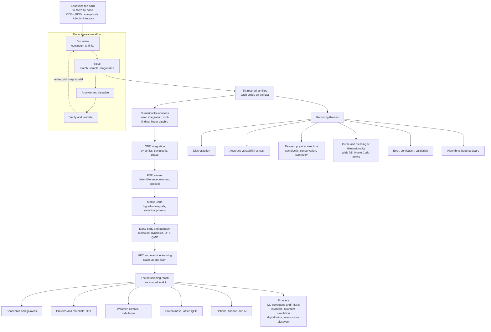

# 🧵 The Reach and Future of Computational Physics

> [!abstract] TL;DR
> This is the **capstone** of the vault: the claim that a *small* set of numerical ideas — **discretize** the continuous, **march** through time, **sample** the improbable, **diagonalize** for the modes — is a **master key**. Applied to equations too hard to solve by hand, they turn a computer into a **virtual laboratory** where you can run the universe forward and simply *watch*. That is the **third pillar of science**, standing beside theory and experiment. The vault's arc — numerical foundations → ODE integration → PDE solvers → Monte Carlo → many-body and quantum → HPC and machine learning — is one continuous escalation of that toolkit, tied together by deep throughlines: **discretization**, the **accuracy-stability-cost** trade-off, **respecting physical structure** (symplectic, conservation, symmetry), and **taming dimensionality** (grids fail, Monte Carlo saves). The *same* engine that steers a spacecraft folds a protein, forecasts a climate century, computes the mass of a proton, simulates a galaxy, prices an option, and now trains AI — a genuine **lingua franca** of computational science. Its frontiers (ML-fused simulation, exascale, quantum computing) are reshaping the field, even as its power demands the humility of **verification and validation**: a simulation is only ever as trustworthy as its model.

---

## Intuition

**Analogy:** A locksmith who has learned to pick a handful of locks discovers, to their astonishment, that the *same* few tricks open almost every door in the building. Computational physics is that handful of tricks. **Discretize** the continuous — chop space and time into a grid so a machine can hold them. **March through time** — ask "given the state now, what is it a tiny instant later?" and repeat a billion times. **Sample the improbable** — when a space is too vast to grid, throw random darts weighted by physics and let the law of large numbers do the integral. **Diagonalize for the modes** — recast a physical system as a matrix and read its natural frequencies and energies straight off the eigenvalues. That is nearly the whole discipline. And the shock is that these four moves are a **master key**: give computational physics *any* system governed by equations too hard to solve by hand, and it becomes a **virtual laboratory** where you can build the thing from its governing law and run it forward.

That is the audacious payoff. You do not measure a real galaxy — you *grow* one from the law of gravity and let it evolve for thirteen billion simulated years. You do not wait a climate century — you *compute* one. You cannot touch the interior of a proton — so you put spacetime on a lattice and sample it. Simulation is not a poor substitute for the real thing; it is a **new mode of doing science**, a way to experiment on systems we can never touch and to explore parameter spaces no lab could reach. This third pillar now holds up much of modern science, and this note pulls the single thread — the master-key toolkit — back through the entire vault, from the [[Computational_Physics_Overview]] that opened it to the frontiers that will remake it.

---

## How It Works

### The through-line: a few methods, applied everywhere

Every note in this vault is a variation on one melody. Recast the whole arc and the structure is a single escalating toolkit, each family building on the last:

1. **Numerical foundations — the primitives.** Before any physics, the raw machinery: how a computer represents numbers and where it loses them ([[Floating_Point_and_Numerical_Error]]), how to turn integrals and derivatives into finite sums and differences ([[Numerical_Integration_and_Differentiation]]), how to find where a function vanishes ([[Root_Finding_and_Optimization]]), how to fit and interpolate data ([[Interpolation_and_Data_Fitting]]), and the matrix solves and factorizations underneath *everything* ([[Numerical_Linear_Algebra]]). Master these and every later method is assembly.

2. **ODE integration — dynamics.** March a system forward in time. Euler and its lessons ([[Initial_Value_Problems_and_Euler_Methods]]), the workhorse adaptive high-order schemes ([[Runge_Kutta_and_Adaptive_Methods]]), the *structure-preserving* integrators that bound energy over billions of steps ([[Symplectic_Integrators_and_Hamiltonian_Dynamics]]), the gravitational many-body problem ([[The_N_Body_Problem_and_Gravitational_Simulation]]), the sensitivity that is chaos ([[Chaos_and_Nonlinear_Dynamics_Numerically]]), and two-point problems solved by shooting ([[Boundary_Value_Problems_and_Shooting]]).

3. **PDE solvers — fields.** When the unknown is a *field* over space and time, discretize the domain: classify the equation first ([[Classification_of_PDEs_and_Discretization]]), then apply finite differences ([[Finite_Difference_Methods]]) or finite elements ([[The_Finite_Element_Method]]) to the heat and diffusion equation ([[The_Heat_and_Diffusion_Equation]]), the wave equation ([[The_Wave_Equation_and_Hyperbolic_PDEs]]), and equilibrium problems ([[The_Poisson_and_Laplace_Equation]]).

4. **Monte Carlo — sampling the improbable.** When a space is too high-dimensional to grid, go stochastic: random-dart integration ([[Monte_Carlo_Integration]]) whose error falls as $1/\sqrt{N}$ *regardless of dimension*, importance sampling via [[The_Metropolis_Algorithm_and_MCMC]], the statistical-physics paradigm ([[The_Ising_Model_and_Statistical_Physics]]), noise-driven dynamics ([[Stochastic_Differential_Equations_and_Langevin]]), critical phenomena ([[Percolation_and_Random_Processes]]), and the pseudo-randomness it all rests on ([[Random_Number_Generation]]).

5. **Many-body and quantum — the hard core.** Newton's equations for millions of atoms ([[Molecular_Dynamics_Simulation]]), the Schrödinger equation on a grid ([[Numerical_Quantum_Mechanics]]), physics recast as matrix eigenproblems ([[Eigenvalue_Problems_in_Physics]]), and quantum Monte Carlo for the many-electron wavefunction ([[The_Variational_and_Diffusion_Monte_Carlo]]).

6. **HPC and machine learning — scale up and learn.** The final amplifiers: parallelism, domain decomposition, and GPUs that turn a laptop demo into an exascale run (the still-to-come *High_Performance_and_Parallel_Computing*), and neural surrogates, ML interatomic potentials, physics-informed networks, and differentiable simulation that *learn* the physics (the still-to-come *Machine_Learning_in_Computational_Physics*). These two notes close the vault's 06 section alongside this synthesis.

### The recurring themes — the deep throughlines

What makes this a *unified* discipline rather than a bag of tricks is a handful of ideas that recur in every section:

- **Discretization is the central move.** A computer cannot hold a continuum, so continuous time becomes small steps, continuous space becomes a grid or mesh, and a continuous field or wavefunction becomes finite sample values or basis coefficients. Every method is a different answer to *how* to discretize faithfully.
- **The accuracy-stability-cost trade-off is always present.** Finer resolution buys accuracy but costs compute; explicit schemes are cheap but can blow up past a stability limit; implicit schemes are stable but expensive. There is no free lunch, only an informed choice.
- **Respect physical structure.** Match the numerics to the physics. A symplectic integrator is chosen precisely because it conserves phase-space volume and bounds energy — respecting a *physical* law, not merely a mathematical one. Conservation laws and symmetries are both a design principle and a free correctness check.
- **The curse — and blessing — of dimensionality.** Grid methods scale as $N^d$ and collapse when $d$ is large (the many-body wavefunction). Monte Carlo, whose error is dimension-independent, is the escape hatch. Knowing which regime you are in dictates the whole strategy.
- **Error and validation are the discipline.** Know your error budget (truncation versus round-off), verify the code solves the equations, and validate that the equations describe reality. An unvalidated simulation is a rumour, not a result.
- **Algorithms often beat hardware.** A better algorithm can outrun decades of faster chips — the FFT, multigrid, the fast multipole method, Monte Carlo, and symplectic integrators were each a leap no amount of extra transistors would have supplied.

### Flow / Architecture



---

## Key Concepts

### Secondary Level

- **A few tricks, every door.** Chop the continuous into pieces a computer can hold, update step by step, throw weighted random darts when a problem is too big to grid, and read a system's natural modes off a matrix. That short list of moves solves an astonishing range of problems.
- **The third pillar.** Theory, experiment, and now **simulation** — a way to do experiments on the *equations themselves*, running systems we can never touch.
- **Same toolkit, wildly different worlds.** The very methods that plot a spacecraft's path also fold a protein, forecast a hurricane, and help train AI. Learn them once; use them everywhere.
- **Only as good as the model.** A beautiful animation of a *wrong* physics is still wrong. The picture is not the proof.

### Undergraduate Level

- **Discretization and its errors.** Derivatives become finite differences, integrals become sums; truncation error shrinks as the step shrinks while round-off grows, so an *optimal* step exists ([[Floating_Point_and_Numerical_Error]]).
- **The four method families.** ODE integrators (dynamics), PDE solvers via finite-difference / finite-element / spectral discretization (fields), Monte Carlo (high-dimensional integrals and ensembles), and numerical linear algebra (the substrate) — the load-bearing walls of the whole toolkit.
- **Stability and order.** Euler is first-order and RK4 fourth-order; explicit PDE schemes obey stability limits like the CFL condition, exceed which and the solution explodes; implicit schemes trade cost for unconditional stability.
- **Dimension decides the weapon.** Grid quadrature scales as $N^d$ and dies in high dimensions; Monte Carlo's $1/\sqrt{N}$ error is dimension-blind, which is why it dominates statistical physics, finance, and the many-body problem.
- **Verification versus validation.** *Verification* asks "did I solve the equations right?" (convergence, conservation checks); *validation* asks "did I solve the right equations?" (comparison with experiment). Both are mandatory.

### Graduate Level

- **Structure-preserving numerics.** Symplectic integrators bound energy error over exponentially long times by preserving the Hamiltonian phase-space structure; geometric integration, and more broadly matching the discrete scheme's invariants to the continuum's, is a mature design philosophy ([[Symplectic_Integrators_and_Hamiltonian_Dynamics]], [[Hamiltonian_Mechanics]]).
- **The two engines of progress.** Computational power grew from *both* faster hardware (Moore's law, massive parallelism, GPUs) *and* better algorithms (FFT, multigrid, fast multipole, Monte Carlo, Krylov solvers). Algorithmic advances have frequently *outpaced* hardware — solving a Poisson problem with multigrid rather than naive Gaussian elimination is a speedup no chip generation could match.
- **Multiscale and multiphysics coupling.** Real systems span scales (quantum to continuum) and couple physics (fluid-structure, radiation-hydrodynamics); coupling disparate solvers stably and consistently — QM/MM, adaptive mesh refinement, operator splitting — is a frontier of its own.
- **The learning turn.** ML fused with simulation is a paradigm shift: neural *surrogates* replace expensive solvers, ML *interatomic potentials* deliver ab-initio accuracy at classical cost, *physics-informed neural networks* embed PDE residuals into the loss, and *differentiable physics* makes an entire simulation end-to-end optimizable ([[Neural_Network_Basics]], [[Backpropagation]], [[Optimization_Theory]]).
- **The quantum endgame.** For the exponential many-body wavefunction and the fermion sign problem that cripples classical quantum Monte Carlo, quantum computers offer a natural attack — simulating quantum systems with quantum hardware, as Feynman envisioned ([[Quantum_Simulation_and_VQE]], [[Quantum_Machine_Learning]], [[The_Future_of_Quantum_Computing]]).

---

## Python Demo

```python
# CAPSTONE: ONE system, the THREE great method families of computational physics.
#
# The simple harmonic oscillator (m = w = hbar = kB = 1) is the "hydrogen atom"
# of computational physics: exactly solvable, so every method can be graded
# against truth. We attack the SAME physics three ways -- the three pillars of
# the vault's toolkit:
#
#   (1) DETERMINISTIC DYNAMICS  -> symplectic (velocity-Verlet) integration of
#       the classical equations of motion. Grade: does it CONSERVE energy over
#       many periods? (Section 02: ODEs / symplectic integrators.)
#
#   (2) SPECTRAL / EIGENVALUE   -> discretize the quantum Hamiltonian on a grid
#       and DIAGONALIZE it. Grade: do the eigenvalues match E_n = n + 1/2?
#       (Section 05: numerical quantum mechanics / eigenvalue problems.)
#
#   (3) STOCHASTIC SAMPLING     -> Metropolis Monte Carlo draws from the
#       Boltzmann distribution exp(-U/kT). Grade: does <x^2> match the
#       equipartition value kT? (Section 04: Metropolis / MCMC.)
#
# Deterministic + spectral converge fast and cleanly; Monte Carlo converges
# as 1/sqrt(N). Three method families, one oscillator, three exact answers.
#
# Requires: numpy, matplotlib
import numpy as np
import matplotlib.pyplot as plt

rng = np.random.default_rng(0)

# ==================================================================
# (1) DETERMINISTIC DYNAMICS: symplectic velocity-Verlet, x'' = -x
# ==================================================================
def verlet(x0, p0, dt, nsteps):
    x, p = x0, p0
    xs, ps, E = np.empty(nsteps), np.empty(nsteps), np.empty(nsteps)
    a = -x                                  # force = -dU/dx with U = x^2/2
    for i in range(nsteps):
        p_half = p + 0.5 * dt * a           # half kick
        x = x + dt * p_half                 # drift
        a = -x
        p = p_half + 0.5 * dt * a           # half kick
        xs[i], ps[i] = x, p
        E[i] = 0.5 * (p*p + x*x)            # total energy
    return xs, ps, E

dt, nsteps = 0.05, 4000                      # ~32 periods (T = 2*pi)
xs, ps, Ev = verlet(1.0, 0.0, dt, nsteps)
E_drift = (Ev.max() - Ev.min()) / Ev.mean()  # bounded, tiny for symplectic
print("=== (1) Deterministic (symplectic Verlet) ===")
print(f"  energy drift over {nsteps} steps: {E_drift:.2e} "
      f"(bounded, no secular growth)")

# ==================================================================
# (2) SPECTRAL / EIGENVALUE: diagonalize the quantum Hamiltonian
#     H = -1/2 d^2/dx^2 + 1/2 x^2   ->   E_n = n + 1/2
# ==================================================================
L, N = 8.0, 600
x = np.linspace(-L, L, N)
dx = x[1] - x[0]
main = 1.0/dx**2 + 0.5 * x**2                # kinetic diag + potential
off  = -0.5/dx**2 * np.ones(N-1)             # kinetic off-diagonal
H = np.diag(main) + np.diag(off, 1) + np.diag(off, -1)
evals, evecs = np.linalg.eigh(H)
E_num, E_exact = evals[:6], np.arange(6) + 0.5
print("\n=== (2) Spectral (Hamiltonian diagonalization) ===")
for n in range(6):
    print(f"  E_{n}: numerical {E_num[n]:.4f}   exact {E_exact[n]:.1f}")

# ==================================================================
# (3) STOCHASTIC: Metropolis Monte Carlo of exp(-U/kT), U = x^2/2
#     equipartition  ->  <x^2> = kT
# ==================================================================
kT = 1.0
def metropolis(nsamp, step=2.0):
    x, U, acc = 0.0, 0.0, 0
    samples = np.empty(nsamp)
    for i in range(nsamp):
        xtry = x + rng.uniform(-step, step)
        Utry = 0.5 * xtry*xtry
        if rng.random() < np.exp(-(Utry - U)/kT):   # Metropolis acceptance
            x, U, acc = xtry, Utry, acc + 1
        samples[i] = x
    return samples, acc/nsamp

samples, acc = metropolis(200_000)
x2_mc = np.mean(samples**2)
print("\n=== (3) Stochastic (Metropolis Monte Carlo) ===")
print(f"  <x^2> sampled {x2_mc:.4f}   exact kT = {kT:.1f}   "
      f"(acceptance {acc:.2f})")

# ==================================================================
# PLOTS: one system, three method families, one truth
# ==================================================================
fig, ax = plt.subplots(2, 2, figsize=(13, 10))
fig.suptitle("One system, three method families: the harmonic oscillator\n"
             "solved as dynamics, as an eigenproblem, and by sampling",
             fontsize=14, fontweight="bold")

# --- A: deterministic dynamics -> phase-space orbit ---
axA = ax[0, 0]
axA.plot(xs, ps, lw=0.8, color="#1c7ed6")
axA.plot(1.0, 0.0, "o", color="k")
axA.set_aspect("equal")
axA.set_xlabel("position x"); axA.set_ylabel("momentum p")
axA.set_title("A. Deterministic dynamics (symplectic)\n"
              f"orbit closes; energy drift = {E_drift:.1e}")
axA.grid(alpha=0.3)

# --- B: eigenvalue problem -> quantum energy levels + wavefunctions ---
axB = ax[0, 1]
axB.plot(x, 0.5 * x**2, color="#495057", lw=1.5)
for n in range(5):
    tp = np.sqrt(2*E_num[n])                          # classical turning point
    axB.hlines(E_num[n], -tp, tp, color="#e8590c", lw=2)
    psi = evecs[:, n]
    psi = psi/np.sqrt(np.sum(psi**2)*dx)             # normalize
    axB.plot(x, E_num[n] + 0.7*psi, color="#1c7ed6", lw=1)
axB.set_ylim(0, 6); axB.set_xlim(-6, 6)
axB.set_xlabel("x"); axB.set_ylabel("energy")
axB.set_title("B. Eigenvalue problem (diagonalization)\n"
              "levels E_n = n + 1/2 read off a matrix")

# --- C: Monte Carlo -> Boltzmann histogram ---
axC = ax[1, 0]
axC.hist(samples, bins=80, density=True, color="#69db7c",
         edgecolor="none", alpha=0.85, label="Metropolis samples")
xx = np.linspace(-5, 5, 300)
axC.plot(xx, np.exp(-0.5*xx**2/kT)/np.sqrt(2*np.pi*kT),
         "k--", lw=2, label="Boltzmann exp(-U/kT)")
axC.set_xlabel("x"); axC.set_ylabel("probability density")
axC.set_title(f"C. Stochastic sampling (Metropolis)\n"
              f"<x^2> = {x2_mc:.3f} vs equipartition kT = {kT:.1f}")
axC.legend()

# --- D: accuracy across the three families ---
axD = ax[1, 1]
errs = [E_drift,
        abs(E_num[0] - 0.5)/0.5,
        abs(x2_mc - kT)/kT]
labels = ["Dynamics\nenergy drift", "Eigenvalue\nE_0 error",
          "Monte Carlo\n<x^2> error"]
axD.bar(labels, errs, color=["#1c7ed6", "#e8590c", "#2f9e44"], edgecolor="k")
axD.set_yscale("log")
axD.set_ylabel("relative error vs exact")
axD.set_title("D. Each family recovers the SAME physics\n"
              "deterministic + spectral converge fast; MC as 1/sqrt(N)")
for i, e in enumerate(errs):
    axD.text(i, e*1.3, f"{e:.1e}", ha="center", fontsize=9)

plt.tight_layout(rect=[0, 0, 1, 0.93])
plt.savefig("comp_physics_synthesis.png", dpi=130)
print("\nSaved figure to comp_physics_synthesis.png")
```

Running this attacks one oscillator with the three great method families and grades each against an exact answer: the **symplectic** run traces a phase-space orbit that *closes* with an energy drift near $10^{-3}$ that stays **bounded** rather than growing (the hallmark of structure-preserving integration); the **diagonalized** Hamiltonian returns eigenvalues within a fraction of a percent of $E_n = n + \tfrac{1}{2}$, with the wavefunctions riding on their energy levels inside the parabolic well; and the **Metropolis** sampler reproduces the Boltzmann Gaussian and recovers $\langle x^2\rangle \approx k_BT$ from equipartition. Three completely different computations — deterministic dynamics, spectral decomposition, and stochastic sampling — converge on the *same* physics. That triangulation is the whole discipline in one figure.

---

## Real-World Applications

> **Example — the same solver stack, from the launchpad to the ribosome.** The trajectory that threads a spacecraft through a gravity-assist and the molecular-dynamics run that watches a protein fold are, under the hood, the *same act*: numerically integrating $\ddot{\mathbf{x}} = \mathbf{F}/m$ for a set of interacting bodies, with a **symplectic** integrator chosen so energy stays bounded over the long haul. NASA's mission design and a GROMACS folding run share a solver family; only the force law and the number of bodies differ. That is the reach in miniature — one algorithm, two worlds separated by twenty orders of magnitude in size.

The applied payoff is everywhere, and it is *shared* across disciplines:

- **Astrophysics and cosmology.** N-body and hydrodynamic codes grow galaxies and the cosmic web from tiny fluctuations ([[The_N_Body_Problem_and_Gravitational_Simulation]], [[Large_Scale_Structure_and_Structure_Formation]], [[Orbital_Mechanics_and_Celestial_Dynamics]]).
- **Materials and chemistry.** Density Functional Theory numerically solves the many-electron problem to predict band structures and design materials before synthesis ([[Numerical_Quantum_Mechanics]], [[Crystal_Structure_and_Band_Theory]]).
- **Particle physics.** Lattice QCD discretizes spacetime and Monte Carlo-samples it to compute the **proton mass** from first principles — the only known route into QCD's strongly coupled regime ([[The_Metropolis_Algorithm_and_MCMC]], [[Standard_Model_Overview]]).
- **Weather, climate, and engineering.** Discretized Navier-Stokes on global grids forecasts weather and projects climate; CFD designs aircraft and engines before any wind tunnel ([[Finite_Difference_Methods]], [[Viscous_Fluids_and_Navier_Stokes]], [[Turbulence_and_Instabilities]]).
- **Statistical physics and condensed matter.** Metropolis Monte Carlo on the Ising model computes phase transitions and critical exponents ([[The_Ising_Model_and_Statistical_Physics]], [[Phase_Transitions_and_Critical_Phenomena]]).
- **Biophysics.** Molecular dynamics integrates Newton's equations for millions of atoms to watch proteins fold and drugs bind ([[Molecular_Dynamics_Simulation]], [[Computational_Biophysics_and_Molecular_Dynamics]], [[Protein_Structure_and_Folding]]).
- **Finance and AI.** The *same* Monte Carlo that samples a spin lattice prices exotic options and estimates risk; the *same* automatic-differentiation and linear-algebra machinery that trains a neural network now accelerates simulation ([[Monte_Carlo_Integration]], [[Neural_Network_Basics]]). Computational physics methods are the shared engine of computational science.

---

## Common Pitfalls

- **Garbage in, garbage out.** A simulation is only as good as its *model and inputs*. Perfect numerics on a wrong force field, a bad equation of state, or unphysical initial conditions produces confident nonsense. The most dangerous errors are not in the solver but in the physics you fed it.
- **The seduction of a beautiful visualization.** A rendered shock front, a swirling galaxy, or a folding protein is *persuasive* — and persuasion is not proof. A gorgeous animation of a diverging, aliased, or unconverged run looks exactly as compelling as a correct one. Never let production values substitute for a convergence test.
- **Numerical artifacts mistaken for physics.** Numerical dispersion in a wave solver, spurious oscillations near a shock, grid-induced anisotropy, and instabilities that grow because a step exceeded the CFL limit can all *masquerade* as real phenomena. Ask always: would this feature survive a finer grid and a smaller step? If it vanishes on refinement, it was an artifact, not physics.
- **Ignoring the accuracy-stability-cost trade-off.** "Just make the step tiny" eventually *increases* round-off error and wastes compute; too coarse a grid smears the physics; an explicit scheme past its stability limit explodes. There is an optimal regime, and it must be found, not guessed.
- **Skipping verification and validation.** *Verification* (did I solve the equations correctly? — convergence studies, conservation checks, comparison to analytic limits) and *validation* (did I solve the right equations? — comparison to experiment) are both non-negotiable. An unvalidated run with no error bars is a rumour. **Uncertainty quantification** — honest error bars on the prediction — is part of the deliverable, not an afterthought.
- **Forgetting that simulation augments, never replaces, understanding.** The computer can produce the number, but it cannot tell you *why*. Simulation is at its best when it is grounded in physical intuition and disciplined by experiment; unmoored from both, it drifts into elaborate self-consistent fiction. The honest stance is that a model is a *tool for thinking*, powerful precisely because — and only when — we remember its limits.

---

## Related Concepts

**The vault's opening and closing bookends**
- [[Computational_Physics_Overview]] — the opening statement of the whole program that this note now closes.

**Numerical foundations — the primitives**
- [[Floating_Point_and_Numerical_Error]] — the truncation-versus-round-off budget bounding every result.
- [[Numerical_Integration_and_Differentiation]] — turning calculus into finite sums and differences.
- [[Root_Finding_and_Optimization]] — locating equilibria, implicit steps, and minima.
- [[Interpolation_and_Data_Fitting]] — reconstructing continuous behaviour from samples.
- [[Numerical_Linear_Algebra]] — the matrix machinery underneath solvers and eigenproblems.

**ODE integration — dynamics**
- [[Initial_Value_Problems_and_Euler_Methods]] — the first, instructive marching scheme.
- [[Runge_Kutta_and_Adaptive_Methods]] — the high-order adaptive workhorse.
- [[Symplectic_Integrators_and_Hamiltonian_Dynamics]] — structure-preserving integration; the demo's deterministic pillar.
- [[The_N_Body_Problem_and_Gravitational_Simulation]] — from spacecraft to galaxies with one integrator.
- [[Chaos_and_Nonlinear_Dynamics_Numerically]] — sensitive dependence and the limits of prediction.
- [[Boundary_Value_Problems_and_Shooting]] — two-point problems solved by iterated marching.

**PDE solvers — fields**
- [[Classification_of_PDEs_and_Discretization]] — elliptic, parabolic, hyperbolic, and how each is discretized.
- [[Finite_Difference_Methods]] — the grid-and-stencil backbone of field simulation.
- [[The_Finite_Element_Method]] — meshing complex geometries for engineering fields.
- [[The_Heat_and_Diffusion_Equation]] — the parabolic prototype and stability lessons.
- [[The_Wave_Equation_and_Hyperbolic_PDEs]] — propagation, the CFL condition, and dispersion.
- [[The_Poisson_and_Laplace_Equation]] — equilibrium fields and elliptic solvers.

**Monte Carlo — sampling the improbable**
- [[Monte_Carlo_Integration]] — dimension-blind $1/\sqrt{N}$ integration; the demo's stochastic pillar.
- [[The_Metropolis_Algorithm_and_MCMC]] — importance sampling of the Boltzmann distribution.
- [[The_Ising_Model_and_Statistical_Physics]] — phase transitions from random sampling.
- [[Stochastic_Differential_Equations_and_Langevin]] — noise-driven dynamics and thermostats.
- [[Percolation_and_Random_Processes]] — criticality and geometry from randomness.
- [[Random_Number_Generation]] — the pseudo-randomness every Monte Carlo rests on.

**Many-body and quantum — the hard core**
- [[Molecular_Dynamics_Simulation]] — Newton for millions of atoms; the biophysics workhorse.
- [[Numerical_Quantum_Mechanics]] — the Schrödinger equation on a grid; the demo's spectral pillar.
- [[Eigenvalue_Problems_in_Physics]] — physics recast as matrices with modes to diagonalize.
- [[The_Variational_and_Diffusion_Monte_Carlo]] — sampling the many-electron wavefunction.

**Cross-vault anchors — the physics being simulated**
- [[Hamiltonian_Mechanics]] — the phase-space structure symplectic integrators preserve.
- [[Ordinary_Differential_Equations]] — the continuous dynamics the ODE section discretizes.
- [[Partial_Differential_Equations]] — the field equations the PDE section discretizes.
- [[Schrodinger_Equation]] — solved numerically where no analytic wavefunction exists.
- [[Quantum_Harmonic_Oscillator]] — the exactly-solvable system the demo triangulates.
- [[Classical_Statistical_Mechanics]] — the Boltzmann ensembles Monte Carlo samples.
- [[Entropy_and_Second_Law]] — the thermodynamics behind equipartition and sampling.
- [[Many_Body_Quantum_Systems]] — the exponentially hard problem driving the quantum endgame.
- [[Eigenvalues_and_Eigenvectors]] — the linear-algebra core of the spectral method family.
- [[Fourier_Analysis]] — the transform behind spectral methods and the FFT.

**Cross-vault anchors — the learning turn and the quantum frontier**
- [[Neural_Network_Basics]] — surrogates and physics-informed networks fused with simulation.
- [[Backpropagation]] — the automatic differentiation behind differentiable physics.
- [[Optimization_Theory]] — the training and inverse-problem machinery shared with ML.
- [[Quantum_Simulation_and_VQE]] — simulating quantum systems with quantum hardware.
- [[Quantum_Machine_Learning]] — the convergence of ML and quantum simulation.
- [[The_Future_of_Quantum_Computing]] — the natural endgame for many-body quantum physics.

---

## Review Questions

**Secondary**
1. Computational physics is called "the third pillar of science." Using the virtual-laboratory idea, explain in your own words what a simulation lets a scientist do that neither pen-and-paper theory nor a physical experiment can — and give one example of a system we can only ever "run" inside a computer.

**Undergraduate**
2. The demo solved the *same* harmonic oscillator three ways: symplectic time-integration, Hamiltonian diagonalization, and Metropolis Monte Carlo. For each, name the exact result it is graded against and the recurring theme it illustrates (structure preservation, spectral decomposition, dimension-blind sampling). Then explain why, for a *100-dimensional* integral, you would abandon a grid and reach for Monte Carlo — and what its error does as you add samples.

**Graduate**
3. Progress in computational physics has come from *two engines* — faster hardware and better algorithms — and algorithmic advances have often outpaced hardware. Give a concrete example of an algorithm whose speedup no chip generation could have matched, and explain the mechanism. Then take a position on the field's near future: which frontier — ML-fused simulation, exascale, or quantum computing — will most change what is *computable*, and what limitation (garbage-in-garbage-out, verification and validation, or the accuracy-stability-cost trade-off) will most constrain that promise?

---

## Sources

- Newman, M. — *Computational Physics* (Createspace, 2013).
- Press, W. H., Teukolsky, S. A., Vetterling, W. T., & Flannery, B. P. — *Numerical Recipes: The Art of Scientific Computing* (Cambridge Univ. Press, 3rd ed., 2007).
- Landau, R. H., Páez, M. J., & Bordeianu, C. C. — *Computational Physics: Problem Solving with Python* (Wiley-VCH, 3rd ed., 2015).
- Karniadakis, G. E. et al. (2021). "Physics-informed machine learning." *Nature Reviews Physics* 3: 422–440. — [doi.org/10.1038/s42254-021-00314-5](https://doi.org/10.1038/s42254-021-00314-5)
- Georgescu, I. M., Ashhab, S., & Nori, F. (2014). "Quantum simulation." *Reviews of Modern Physics* 86: 153. — [doi.org/10.1103/RevModPhys.86.153](https://doi.org/10.1103/RevModPhys.86.153)

---

#computational-physics #synthesis #capstone #simulation #third-pillar
