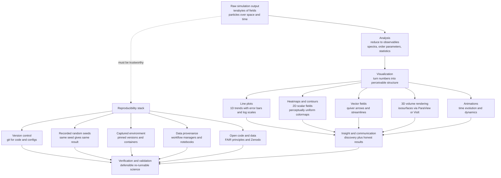

# 🔬 Visualization and Reproducibility in Physics

> [!abstract] TL;DR
> A simulation is worthless until you can **understand** its output and **trust** it — and that "last mile" is two neglected skills that complete the computational-physics workflow. **Visualization** is the *microscope*: a supercomputer run of an exploding star or a turbulent jet dumps a terabyte of raw numbers that mean nothing as a spreadsheet, but rendered as a movie of swirling, collapsing fire a physicist instantly *sees* the shockwave. The toolkit runs from **line plots** (1D trends, with honest error bars and log scales) through **heatmaps and contour plots** (2D scalar fields), **quiver and streamline** plots (vector fields), **3D volume rendering and isosurfaces** (ParaView, VisIt, VTK, Mayavi), particle rendering, and **animations** (usually the clearest way to show dynamics). A crucial, under-appreciated choice hides inside every field plot: the **colormap**. The traditional **rainbow / "jet"** map is *perceptually non-uniform* — it invents false boundaries, hides real gradients, collapses to nonsense in grayscale, and fails colorblind readers — so honest visualization uses **perceptually uniform** maps (**viridis**, **cividis**) and the right *sequential* or *diverging* type. The companion skill is **reproducibility**: computational science is in a **reproducibility crisis** where many published results cannot be re-run because the code is lost, versions unspecified, randomness unseeded, or data unavailable. The fix is a practical stack — **version control** (git), **recorded random seeds**, a **captured environment** (pinned dependencies, conda/pip, **containers** like Docker/Singularity), documented **data provenance** and workflow (Jupyter, workflow managers), automated tests, and **open** sharing of code and data (**FAIR** principles, Zenodo). Even then, **numerical reproducibility** is subtle: floating-point results can differ across compilers, hardware, and non-deterministic parallel reduction order, so bitwise repeatability is genuinely hard (see *[[Floating_Point_and_Numerical_Error]]*). Wrapping all of this is the rigor of **verification** ("solving the equations right" — convergence tests, method of manufactured solutions) versus **validation** ("solving the right equations" — matching experiment), plus **uncertainty quantification** (error bars on simulations). In an era of million-line codes, these are not afterthoughts; they decide whether a simulation yields real, defensible knowledge.

---

## Intuition

**Analogy — the microscope and the lab notebook.** A supercomputer simulation of an exploding star produces a terabyte of raw floating-point numbers: densities, velocities, and temperatures at a billion grid cells across ten thousand timesteps. Open that as a spreadsheet and it is utterly meaningless — no human eye can find the physics in a column of `1.4832e7`. Now turn it into a **movie of swirling, collapsing, rebounding fire**, and suddenly a physicist *sees* the shockwave tear outward, stall, and revive. Nothing was added to the data; the visualization simply mapped it onto the one instrument the brain is astonishingly good at — the eye. Visualization is the **microscope** of computational physics: the device that turns imperceptible numbers into perceivable structure, the moment where discovery actually happens.

But a microscope has a darker companion skill, and it is the **lab notebook**. A bench scientist who reports a spectacular measurement no one else can reproduce — not even their future self, six months later, with the same reagents — has produced *nothing*, scientifically. The computational version is worse, because the "reagents" are invisible: a hidden random seed, an unlisted library version, a manual click in a GUI, a data file that lived only on a laptop that has since died. A stunning simulated result that cannot be **re-run** is exactly as worthless as an irreproducible experiment. So the two halves of this note are the two halves of trustworthy computational science: the microscope that lets you *see* the answer, and the notebook discipline that lets anyone — including future-you — *get the same answer again*. Making science actually repeatable is as important as making it fast.

---

## How It Works

### Why visualization matters

Simulations produce **vast, high-dimensional data**: scalar and vector fields defined over three spatial dimensions *and* time, particle distributions with millions of members, high-dimensional parameter scans. This data is incomprehensible as raw numbers not because there is too little information but because there is far too much for the symbolic, one-number-at-a-time channel of conscious reasoning. Vision, by contrast, is a massively parallel pattern detector — it finds edges, motion, symmetry, and coherent structure preattentively. Visualization is the transform that routes simulation output into that channel, and it serves two distinct goals:

1. **Discovery.** Spotting the physics you did not know was there — a shock front, a vortex shedding, a phase transition sharpening, an instability growing. The famous moment where a researcher animates a run and *sees* the effect is not a nicety; it is often the only practical way to notice emergent structure in a field no equation predicted in closed form.
2. **Communication.** Persuading a reader, a referee, or a collaborator that the result is real. A figure is an *argument*, and like any argument it can be honest or misleading.

### The visualization toolkit — matching technique to the physics

- **Line plots** for 1D relationships: a dispersion curve, an energy-versus-time trace, a radial profile. Honesty here means proper **error bars** (never hide the uncertainty), **log scales** when the data spans orders of magnitude, and axes that start where the physics does, not where the drama is maximized.
- **Heatmaps / pseudocolor** (`imshow`, `pcolormesh`) and **contour plots** for **2D scalar fields** — a temperature distribution, a pressure map, a wavefunction amplitude. The heatmap shows the whole field at a glance; contours pick out level sets and are excellent for reading off gradients and critical points.
- **Vector-field plots** — **quiver** (a grid of arrows) for a coarse view of direction and magnitude, and **streamlines** (`streamplot`) for the *topology* of a flow: where fluid circulates, where field lines converge, where separatrices lie.
- **3D volume rendering and isosurfaces** for **3D fields**, where a single 2D slice throws away most of the structure. Production tools here are **ParaView**, **VisIt**, the underlying **VTK** library, and **Mayavi** — they ray-march through a 3D density to make a translucent cloud, or extract an isosurface (marching cubes) to show a level set as a solid shape. This is where computational physics borrows directly from computer graphics.
- **Particle rendering** for N-body and molecular data — billions of points splatted with density-dependent opacity to reveal the cosmic web or a folding protein.
- **Animations** for **time evolution** — very often the single clearest way to convey dynamics, because motion *is* the physics. A dozen still frames rarely communicate a traveling wave or a growing instability the way one short movie does.

The craft is **choosing the technique that reveals the physics** and no more. The same shock either leaps out or vanishes depending on whether you plotted density, its gradient, or its logarithm, and on whether you animated it or froze it.

### The colormap problem — an honesty issue disguised as a color choice

The choice of **colormap** dramatically changes what a reader *perceives*, and the traditional **rainbow / "jet"** map is a genuine scientific hazard:

- It is **perceptually non-uniform**: equal steps in the data map to *unequal* perceived changes in color. The eye sees sharp transitions where jet crosses cyan and yellow, inventing **false boundaries** that are not in the data, while it flattens the greens into a mushy band that **hides real gradients**.
- It **fails in grayscale** — print the figure in black and white and the ordering scrambles, because jet's luminance is non-monotonic (it goes light-dark-light).
- It **fails colorblind readers**, who cannot separate its red and green ends.

The fix is **perceptually uniform** colormaps — **viridis** (the modern default), **cividis** (optimized for colorblind viewers), magma, inferno — whose *perceived* brightness increases monotonically and evenly with the data. Beyond uniformity, match the *type* to the data: a **sequential** map (dark-to-light) for data with a natural zero or one-directional magnitude, and a **diverging** map (two hues meeting at a neutral midpoint) for data with a meaningful center like anomalies about zero. Honest visualization is not decoration; picking viridis over jet can be the difference between a reader seeing the true structure and seeing an artifact you accidentally painted in.

### Avoiding misleading visualization

Beyond colormaps, the same figure can inform or deceive: **truncated or nonlinear axes** that exaggerate a trivial effect, **dual y-axes** that manufacture a spurious correlation, **chartjunk** that buries signal in decoration, **overplotting** that hides density in an opaque blob, and — most insidious — **hiding uncertainty** by drawing a smooth mean with no error band. Visualization is an argument, and the ethics of it are the ethics of honest data presentation: the figure must let the reader see what the data actually supports, including how *un*certain it is.

### The reproducibility crisis

A major concern across computational science is that **many published computational results cannot be reproduced**. The failure modes are mundane and pervasive: the code was never released or has been lost; library and compiler versions were unspecified; randomness was unseeded so every run differs; the pipeline included manual, unrecorded steps ("then I edited the file by hand"); the input data is unavailable. Reproducibility is foundational to the scientific method — a result no one can regenerate is a claim, not knowledge — yet it is routinely neglected under publication pressure. A useful distinction: **reproducible** means *same code and data → same result* (a re-run), while **replicable** means an *independent* group re-derives the finding with their own code and data. The first is a minimum hygiene standard; the second is the deeper scientific goal.

### Reproducibility practices — turning a result into a re-runnable artifact

- **Version control** (**git**) for code, configuration, and analysis scripts, so every figure traces to an exact commit (see *[[Computational_Physics_Overview]]* for where this sits in the pipeline).
- **Fixing and recording random seeds**, so a stochastic simulation reruns *exactly* — the reproducibility payoff of the deterministic PRNG explained in *[[Random_Number_Generation]]*. Recording is as important as fixing: an unlogged seed is no seed at all.
- **Capturing the computational environment** — pinned dependency versions (`requirements.txt`, `environment.yml`), and for full isolation **containers** (**Docker**, or **Singularity/Apptainer** on HPC where user namespaces matter) that freeze the entire OS-plus-library stack into a single re-runnable image.
- **Documenting data provenance and workflow** — where each dataset came from and every transformation it passed through, captured by **workflow managers** (Snakemake, Nextflow) or **literate computing** (Jupyter notebooks that interleave code, results, and prose).
- **Automated testing** — regression tests that fail loudly when a "harmless" refactor changes a physical result.
- **Open sharing** of code and data under **FAIR** principles (Findable, Accessible, Interoperable, Reusable), archived with a citable DOI on repositories like **Zenodo** or **figshare**.

### Numerical reproducibility subtleties

Even with all of the above, **bitwise** reproducibility is genuinely hard, because floating-point results can differ across **compilers**, **hardware** (x86 vs ARM vs GPU), **optimization levels** (fused multiply-add, reordered operations), and especially **parallelization**: summing a billion numbers across thousands of cores gives a **non-deterministic reduction order**, and because floating-point addition is not associative, the last few bits of the total vary from run to run. The skill is distinguishing *acceptable numerical variation* (differences at the level of round-off, physically meaningless) from a *bug* (differences that grow or change the science). This is doubly dangerous in chaotic systems (see *[[Chaos_and_Nonlinear_Dynamics_Numerically]]*), where a last-bit difference is exponentially amplified until two "identical" runs diverge completely — reproducible in *distribution* but never trajectory-by-trajectory. The whole subject sits on the finite-precision foundation of *[[Floating_Point_and_Numerical_Error]]*.

### Verification and Validation, and uncertainty

The rigor framework that makes simulation *trustworthy* rests on two questions that sound alike but are opposite:

- **Verification — "are we solving the equations right?"** Is the *code* a correct solver of the chosen mathematical model? Established by **convergence tests** (refine the grid/step and confirm the answer approaches a limit at the predicted order — see *[[Finite_Difference_Methods]]*), the **method of manufactured solutions** (invent an exact analytic solution, plug it in to derive the source term it requires, and check the code recovers it), and **benchmarks** against known cases.
- **Validation — "are we solving the right equations?"** Does the model match *reality*? Established by comparing outputs against **experiment** and observation. A code can be perfectly verified and completely wrong about the world if the underlying physics model is inadequate.

Layered on top is **uncertainty quantification (UQ)**: putting honest **error bars on a simulation**, separating *numerical* uncertainty (discretization, round-off) from *parametric* uncertainty (imprecisely known inputs, propagated by sampling or sensitivity analysis). A simulation reported as a single number with no uncertainty is making a claim it cannot support.

### The culture shift

Underneath the tools is a movement: **open science** — open-source scientific software, open data, preregistration of analysis plans, and reproducible-research norms enforced by journals and funders — is steadily transforming computational physics from a craft of private codes into a communal, auditable enterprise. It is a **community responsibility**: the value of the whole field's output depends on individuals choosing to make their work re-runnable.

### Flow / Architecture



---

## Key Concepts

### Secondary Level

- **Visualization is a microscope.** Raw simulation numbers are invisible to the mind; a picture or movie lets the eye — a brilliant pattern detector — find the shockwave, vortex, or wave.
- **The right picture reveals, the wrong one hides.** The same data can show its structure or bury it depending on the plot type and, crucially, the *colors* you choose.
- **Rainbow colors lie.** The classic rainbow ("jet") map invents fake edges and hides smooth changes; use **viridis** instead, whose brightness rises evenly.
- **Reproducibility = getting the same answer twice.** If you (or anyone) cannot re-run your simulation and get the same result, the result cannot be trusted — like an experiment no one can repeat.
- **Write down the seed.** A "random" simulation with a *recorded* seed gives identical results every time, which is how you rerun and check it.

### Undergraduate Level

- **Technique-to-data matching.** Line plot (1D), heatmap/contour (2D scalar field), quiver/streamplot (vector field), volume render/isosurface (3D field), animation (time). Choose to expose the physics.
- **Perceptual uniformity.** A good colormap maps equal data steps to equal *perceived* brightness steps; jet does not, so it creates false contours and fails in grayscale and for colorblind readers. Sequential vs diverging maps for one-sided vs centered data.
- **Honest axes and uncertainty.** Truncated axes, dual y-axes, and missing error bars mislead; a figure is an argument that must reflect what the data actually supports.
- **The reproducibility stack.** Version control (git), recorded seeds, pinned environments (conda/pip), containers (Docker), documented data provenance, and open sharing (FAIR, Zenodo).
- **Reproducible vs replicable.** Same code+data→same result (reproducible) versus an independent redo (replicable) — different bars, both needed.

### Graduate Level

- **Numerical (non)reproducibility.** Non-associative floating-point plus non-deterministic parallel reduction order, FMA, and compiler optimization make bitwise reproducibility hard; distinguish round-off-level variation from bugs, and note chaotic amplification of last-bit differences.
- **Verification vs validation.** Verification ("equations solved right") via convergence studies, the **method of manufactured solutions**, and benchmarks; validation ("right equations") via comparison to experiment. Code correctness and model adequacy are independent failure modes.
- **Uncertainty quantification.** Separating and propagating numerical vs parametric uncertainty (grid convergence indices, sensitivity analysis, Monte Carlo forward propagation, polynomial chaos) to attach defensible error bars to a simulation.
- **Provenance and workflow automation.** Content-addressed data, workflow managers (Snakemake/Nextflow), and container digests turn a result into a fully specified, re-executable artifact with a citable DOI.
- **Perceptual and colorblind-safe design at scale.** Choosing perceptually uniform, colorblind-safe maps, and even *isoluminant* maps when shape (not magnitude) is the message, to avoid the eye reading luminance artifacts as physics.

---

## Python Demo

```python
# Visualization done RIGHT, plus a reproducibility touch, in one runnable script.
#
# PART A -- MULTI-TECHNIQUE VISUALIZATION of a single physics dataset:
#   We build a 2D scalar field phi(x,y) -- think an electrostatic potential from
#   a few "charges" -- and its gradient VECTOR field E = -grad(phi). We then show
#   the SAME data four honest ways plus one DISHONEST way:
#     (1) a LINE PLOT of a 1D slice, with error bars from a noisy "measurement";
#     (2) a HEATMAP with the perceptually-uniform VIRIDIS colormap  (GOOD);
#     (3) the SAME heatmap with the rainbow JET colormap            (MISLEADING);
#     (4) a CONTOUR plot of the field;
#     (5) a STREAMPLOT of the vector field, revealing flow topology.
#   Panels (2) vs (3) demonstrate how the wrong colormap invents false edges and
#   hides gradients that viridis shows faithfully.
#
# PART B -- REPRODUCIBILITY: we fix and PRINT a random SEED, show that two SEEDED
#   runs are bit-for-bit identical while two UNSEEDED runs differ, and print
#   environment/version info -- the minimal record that makes a run re-runnable.
#
# Requires: numpy, matplotlib (standard library: sys, platform).

import sys
import platform
import numpy as np
import matplotlib
import matplotlib.pyplot as plt

# ----------------------------------------------------------------------
# PART A: build one physics dataset and visualize it multiple ways
# ----------------------------------------------------------------------
x = np.linspace(-3.0, 3.0, 240)
y = np.linspace(-3.0, 3.0, 240)
X, Y = np.meshgrid(x, y)                      # default 'xy' indexing

def blob(cx, cy, s):
    """A smooth Gaussian bump centered at (cx, cy) with width s."""
    return np.exp(-((X - cx) ** 2 + (Y - cy) ** 2) / (2.0 * s ** 2))

# Scalar field: a positive and a negative "charge" plus a small third bump.
phi = blob(-1.0, 0.2, 0.8) - 0.9 * blob(1.2, 0.4, 0.6) + 0.4 * blob(0.3, -1.6, 0.5)

# Vector field E = -grad(phi). np.gradient returns d/d(axis0=y), d/d(axis1=x).
dphi_dy, dphi_dx = np.gradient(phi, y, x)
Ex, Ey = -dphi_dx, -dphi_dy
Emag = np.hypot(Ex, Ey)

# A noisy 1D "measurement" of the mid-line slice, with error bars.
mid = phi.shape[0] // 2
slice_true = phi[mid, :]
rng_meas = np.random.default_rng(2026)        # seeded so the figure is reproducible
sigma = 0.05
slice_noisy = slice_true + rng_meas.normal(0.0, sigma, size=slice_true.shape)
sample = slice(0, None, 12)                   # thin out for readable error bars

# ------------------------------ Plots ---------------------------------
fig, axes = plt.subplots(2, 3, figsize=(16, 9))
extent = [x[0], x[-1], y[0], y[-1]]

# (1) LINE PLOT: 1D slice with honest error bars
ax = axes[0, 0]
ax.plot(x, slice_true, 'k-', lw=2, label='true field slice')
ax.errorbar(x[sample], slice_noisy[sample], yerr=sigma, fmt='o', ms=4,
            color='steelblue', ecolor='gray', capsize=3, label='noisy measurement')
ax.set_title('(1) Line plot: 1D slice with error bars')
ax.set_xlabel('x'); ax.set_ylabel('phi(x, y=0)'); ax.legend(fontsize=8)

# (2) HEATMAP with VIRIDIS (perceptually uniform -> honest)
ax = axes[0, 1]
im = ax.imshow(phi, extent=extent, origin='lower', cmap='viridis', aspect='auto')
ax.set_title('(2) Heatmap: VIRIDIS (perceptually uniform)')
ax.set_xlabel('x'); ax.set_ylabel('y')
fig.colorbar(im, ax=ax, fraction=0.046)

# (3) HEATMAP with JET (rainbow -> false edges, hidden gradients)
ax = axes[0, 2]
im = ax.imshow(phi, extent=extent, origin='lower', cmap='jet', aspect='auto')
ax.set_title('(3) Same data, JET: false bands MISLEAD')
ax.set_xlabel('x'); ax.set_ylabel('y')
fig.colorbar(im, ax=ax, fraction=0.046)

# (4) CONTOUR plot of the scalar field
ax = axes[1, 0]
cf = ax.contourf(X, Y, phi, levels=14, cmap='viridis')
cs = ax.contour(X, Y, phi, levels=14, colors='k', linewidths=0.4)
ax.set_title('(4) Contour plot: level sets and gradients')
ax.set_xlabel('x'); ax.set_ylabel('y')
fig.colorbar(cf, ax=ax, fraction=0.046)

# (5) STREAMPLOT of the vector field E = -grad(phi), colored by magnitude
ax = axes[1, 1]
strm = ax.streamplot(x, y, Ex, Ey, color=Emag, cmap='viridis', density=1.2,
                     linewidth=1.0)
ax.set_title('(5) Streamplot: vector-field topology')
ax.set_xlabel('x'); ax.set_ylabel('y')
ax.set_xlim(x[0], x[-1]); ax.set_ylim(y[0], y[-1])
fig.colorbar(strm.lines, ax=ax, fraction=0.046)

# ----------------------------------------------------------------------
# PART B: reproducibility demonstration (shown as text in the 6th panel
# and printed to stdout)
# ----------------------------------------------------------------------
def sim_random_walk(seed=None, n=500):
    """A tiny 'stochastic simulation': a 1D random walk endpoint array."""
    rng = np.random.default_rng(seed)
    return np.cumsum(rng.standard_normal(n))

SEED = 20260801
w_seed_1 = sim_random_walk(SEED)
w_seed_2 = sim_random_walk(SEED)             # SAME seed -> must be identical
w_free_1 = sim_random_walk(None)             # entropy-seeded -> differs
w_free_2 = sim_random_walk(None)

seeded_identical = np.array_equal(w_seed_1, w_seed_2)
unseeded_identical = np.array_equal(w_free_1, w_free_2)

print("=== Reproducibility record ===")
print(f"Fixed random seed          : {SEED}")
print(f"Two SEEDED runs identical  : {seeded_identical}   (reproducible)")
print(f"Two UNSEEDED runs identical: {unseeded_identical}  (NOT reproducible)")
print("--- Environment (pin these for a re-runnable artifact) ---")
print(f"Python     : {sys.version.split()[0]}")
print(f"NumPy      : {np.__version__}")
print(f"Matplotlib : {matplotlib.__version__}")
print(f"Platform   : {platform.platform()}")

# (6) Visualize reproducibility: two seeded walks overlap exactly; unseeded differ
ax = axes[1, 2]
ax.plot(w_seed_1, color='crimson', lw=2.5, label='seeded run 1')
ax.plot(w_seed_2, color='black', lw=1.0, ls='--', label='seeded run 2 (identical)')
ax.plot(w_free_1, color='seagreen', lw=1.0, alpha=0.8, label='unseeded run A')
ax.plot(w_free_2, color='orange', lw=1.0, alpha=0.8, label='unseeded run B (differs)')
ax.set_title(f'(6) Seed = {SEED}: seeded runs match, unseeded do not')
ax.set_xlabel('step'); ax.set_ylabel('position'); ax.legend(fontsize=7)

plt.tight_layout()
plt.show()
```

Running this prints the reproducibility record — `Two SEEDED runs identical : True` versus `Two UNSEEDED runs identical: False` — alongside the exact Python, NumPy, and Matplotlib versions and platform string that a collaborator would need to reproduce the figure. Panels (2) and (3) are the punchline of Part A: **the same field**, rendered with viridis and with jet. Viridis shows a single smooth ramp so the gradient reads faithfully; jet slices that same smooth ramp into apparent cyan/yellow **bands** that look like real contour lines but are pure artifacts of the colormap, while flattening the true gradient in its green midsection. Panel (6) makes reproducibility visible: the two seeded random walks lie exactly on top of each other (the dashed black line traces the solid red perfectly), while the two unseeded walks wander off on their own — the difference between a re-runnable result and an unrepeatable one, in a single plot.

---

## Real-World Applications

- **Astrophysics visualization.** Supernova and galaxy-formation groups render terabyte outputs from codes like FLASH and Enzo with **VisIt** and **ParaView**, using volume rendering and time-lapse animation to *see* shock revival, turbulence, and cosmic-web filaments that no scalar diagnostic captures — the literal microscope of the analogy.
- **Climate and weather.** Ensemble climate models are communicated through carefully chosen **perceptually uniform, colorblind-safe** colormaps (the community explicitly abandoned rainbow maps for temperature and anomaly fields), with **diverging** maps centered at zero for anomalies — an honesty standard now enforced by journals.
- **The reproducibility crisis, measured.** Landmark surveys (Nature's 2016 reproducibility survey; the *ML Reproducibility Challenge*) documented how often computational results resist re-running, driving journals (e.g. *AAS*, *IEEE*) to require code and data availability and reproducibility badges.
- **Containerized, archived pipelines.** LIGO/Virgo gravitational-wave analyses and lattice-QCD collaborations ship **Docker/Singularity** images plus **git**-tracked pipelines and **Zenodo**-archived data so that a published detection or mass spectrum can be regenerated years later, on different hardware, from a citable DOI.
- **Verification & validation in engineering physics.** Aerospace and nuclear CFD codes are certified through formal **V&V** (ASME V&V 20), using the **method of manufactured solutions** and grid-convergence studies before any result feeds a safety case — the rigor that turns a pretty simulation into a defensible one.
- **Notebooks as literate results.** Fields from condensed matter to cosmology publish **Jupyter** notebooks (often via Binder) that reproduce every figure in a paper from raw data, making the analysis itself the shared artifact.

---

## Common Pitfalls

- **Reaching for jet (or any rainbow map).** It is still many tools' historical default and it *actively lies* — false boundaries, hidden gradients, grayscale failure, colorblind failure. Default to **viridis**, use **cividis** for maximum colorblind safety, and pick a **diverging** map only for genuinely centered data.
- **Hiding uncertainty.** Plotting a smooth mean curve with no error bars or confidence band presents a claim the data may not support. Always show the spread; a simulation result without an uncertainty is incomplete.
- **Misleading axes and overplotting.** Truncated y-axes exaggerate trivial effects, dual axes fabricate correlations, and dumping millions of points into an opaque blob hides the very density that is the message. Match the encoding to what the data honestly supports.
- **Unrecorded (or absent) seeds.** An unseeded stochastic run cannot be reproduced; a *seeded but unlogged* run is just as bad because no one can recover the seed. Fix it, print it, and commit it.
- **"Works on my machine."** Relying on whatever library versions happen to be installed means the result evaporates when the environment changes. Pin dependencies and, for anything serious, ship a **container** with a recorded digest.
- **Expecting bitwise reproducibility from parallel code.** Non-associative floating-point plus non-deterministic reduction order means multi-core/GPU sums vary in the last bits (see *[[Floating_Point_and_Numerical_Error]]*). Judge reproducibility at the round-off tolerance, not bit-for-bit — and in chaotic systems (*[[Chaos_and_Nonlinear_Dynamics_Numerically]]*), only in distribution.
- **Confusing verification with validation.** A code can pass every convergence test (verified) and still model the wrong physics (invalid), or match one experiment (validated) while harboring a bug that cancels for that case. Both are required, and they are independent.
- **Manual, unscripted steps.** Every hand-edit, GUI click, or "then I deleted the outliers" that is not captured in code breaks provenance. If it is not in the script or the workflow, it did not reproducibly happen.

---

## Related Concepts

- [[Computational_Physics_Overview]] — this note completes the workflow's final stages (analysis, visualization, validation) that the overview lays out; it is the "last mile" of the third pillar of science.
- [[Floating_Point_and_Numerical_Error]] — the finite-precision and non-associativity facts that make bitwise numerical reproducibility genuinely hard across compilers, hardware, and parallel reductions.
- [[Random_Number_Generation]] — the deterministic PRNG whose *recorded seed* is what makes a stochastic simulation exactly re-runnable; reproducibility is the flip side of pseudorandomness.
- [[Chaos_and_Nonlinear_Dynamics_Numerically]] — where last-bit floating-point differences are exponentially amplified, so chaotic runs are reproducible only in distribution, never trajectory-by-trajectory.
- [[Finite_Difference_Methods]] — the convergence and grid-refinement studies at the heart of *verification* ("solving the equations right").
- [[Data_Analytics/02_Python_for_Analytics/Data_Visualization_Python|Data Visualization with Python]] — the general matplotlib/Seaborn/Plotly toolkit and colormap choices, applied here to physical fields.
- [[AI-ML/00_Foundations/CS_Fundamentals/Data_Visualization|Data Visualization]] — visualization principles from the ML side, including the same perceptual-uniformity and honesty concerns.
- [[AI-ML/06_MLOps/Experiment_Tracking/Experiment_Tracking_Overview|Experiment Tracking]] — the ML-ops analog of reproducible research: logging seeds, configs, environments, and artifacts so a run can be re-created.
- [[DevOps/13_Git_and_GitHub/Git_Fundamentals|Git Fundamentals]] — version control, the backbone of code-and-config reproducibility that ties every figure to an exact commit.
- [[DevOps/03_Containers_Docker/Docker_Architecture_and_Internals|Docker Architecture and Internals]] — containers that freeze the whole computational environment into a re-runnable image (Singularity/Apptainer on HPC).
- [[Mathematics/06_Probability_and_Statistics/Statistical_Inference|Statistical Inference]] — the error-bar and hypothesis-testing machinery underlying uncertainty quantification on simulation outputs.
- [[Computer_Graphics/06_Animation_and_Simulation/Cloth_and_Fluid_Simulation|Cloth and Fluid Simulation]] — the graphics side of rendering simulated fields, sharing the volume-rendering and isosurface techniques used to visualize 3D physics.

Within this Computational Physics vault, this note is a **capstone of the frontiers section**: it presumes the simulations produced by every earlier section and asks how to *see* and *trust* them. It sits beside the not-yet-written siblings *High_Performance_and_Parallel_Computing* (which introduces the very parallel reductions that break bitwise reproducibility), *Machine_Learning_in_Computational_Physics* (whose models inherit the same seeding, colormap, and provenance disciplines), and the closing outlook *The_Reach_and_Future_of_Computational_Physics*, where open, reproducible, well-visualized science is the norm the field is moving toward.

---

## Review Questions

**Secondary:**
1. A simulation of an exploding star produces a terabyte of numbers. Why is that output "meaningless" as a spreadsheet but revealing as a movie? Explain, in the analogy's terms, what visualization is *for*.
2. What does it mean for a result to be "reproducible," and why is a stunning simulation that nobody can re-run considered worthless in science?

**Undergraduate:**
3. You have a smooth 2D scalar field. Explain concretely how the rainbow "jet" colormap can make a reader perceive sharp boundaries and miss real gradients, and why **viridis** does not. Name two additional ways jet fails (grayscale, colorblind readers).
4. List the components of a reproducibility "stack" and say what each one protects against. Which single component makes a *stochastic* simulation exactly re-runnable, and what must you do besides just setting it?
5. Distinguish **verification** from **validation** with one sentence each, and give a concrete test used for each.

**Graduate:**
6. Your Monte Carlo code gives bit-for-bit identical results on one core but different results (in the last few digits) on 1024 cores, and different again on a GPU. Explain why, using floating-point associativity and reduction order, and describe how you would decide whether this is an acceptable numerical artifact or a genuine bug.
7. A colleague reports a chaotic-system simulation whose trajectory "cannot be reproduced" on a different machine, and concludes their code is broken. Critique this conclusion: in what sense *should* the result still be reproducible, and what quantities would you compare instead of the raw trajectory?
8. Design a reproducibility and V&V plan for a publishable CFD result. Address version control, environment capture, seeds, data provenance, the method of manufactured solutions, grid-convergence-based uncertainty quantification, and how you would package the whole thing as a citable, re-runnable artifact.

---

## Sources

- Rougier, N. P., Droettboom, M., & Bourne, P. E. (2014). "Ten Simple Rules for Better Figures." *PLOS Computational Biology*, 10(9), e1003833.
- Crameri, F., Shephard, G. E., & Heron, P. J. (2020). "The misuse of colour in science communication." *Nature Communications*, 11, 5444. — the definitive case against rainbow/jet colormaps.
- Sandve, G. K., Nekrutenko, A., Taylor, J., & Hovig, E. (2013). "Ten Simple Rules for Reproducible Computational Research." *PLOS Computational Biology*, 9(10), e1003285.
- Wilkinson, M. D., et al. (2016). "The FAIR Guiding Principles for scientific data management and stewardship." *Scientific Data*, 3, 160018.
- Oberkampf, W. L., & Roy, C. J. (2010). *Verification and Validation in Scientific Computing*. Cambridge University Press. — the standard reference on V&V and uncertainty quantification.
- Tufte, E. R. (2001). *The Visual Display of Quantitative Information* (2nd ed.). Graphics Press. — the foundational text on honest data visualization.

---

#computational-physics #scientific-visualization #reproducibility #colormaps #open-science
