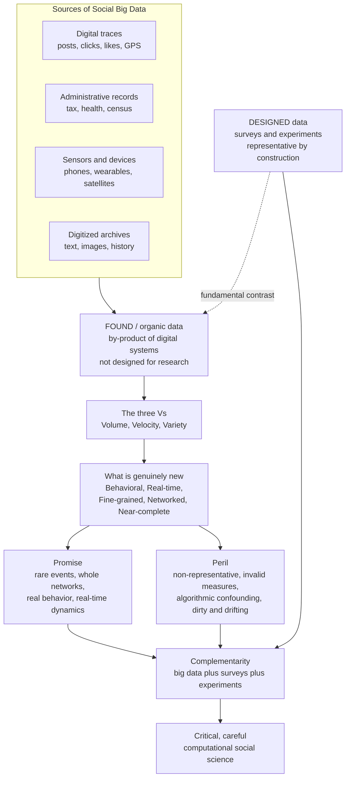

> [!abstract] TL;DR
> Big data — massive, high-velocity, varied records of actual human behavior from digital platforms, sensors, transactions, and administrative systems — transforms social science by capturing real actions at unprecedented scale, granularity, and reach, enabling study of whole networks, rare events, and real-time dynamics impossible with small surveys. But most of it is "found"/organic data, a by-product of digital systems that is non-representative, of uncertain measurement validity, and algorithmically confounded. The hard lesson is the **big data paradox**: enormous sample size buys seductive *precision* but does not cure *bias*, so a large non-random sample can be more confidently wrong than a tiny random one. Big data is therefore best used to **complement**, not replace, surveys and experiments.

---

## Intuition

**Analogy:** Imagine trying to understand a city's traffic by phoning a few thousand residents and asking, "How was your commute this morning?" You get careful, representative answers — but they are sparse, self-reported, and remembered through a fog. Now imagine instead having the GPS trace of *every* car, *every* second, for a whole year. That leap — from small, sampled, self-reported **surveys** to massive, continuous, behavioral **big data** — is what is reshaping social science.

But there is a catch that a street lamp teaches us. A drunk searches for his lost keys under the lamppost, not because he dropped them there, but "because that's where the light is." Big data shines a brilliant but **narrow** light: it is enormous exactly where digital traces exist and pitch-dark everywhere else — the people not on the platform, the actions never logged, the meanings never captured. Mistaking *the illuminated* for *the important* is the field's central temptation. This note is the foundation for the rest of the vault (see the companion **Computational_Social_Science_Overview**); it teaches you to love the light while never forgetting the dark.

---

## How It Works

### From designed data to found data

Traditional quantitative social science runs on **designed data**: surveys and experiments deliberately constructed to answer a specific question. A survey is representative *by construction* — you draw a random probability sample so that 1,500 people can stand in for 300 million. An experiment is causal *by construction* — you randomize treatment so that comparison groups are exchangeable. The data exist because a researcher created them for a purpose.

Big data is mostly **found** (organic) data: a *by-product* of digital systems that were built to run a business or a platform, not to answer a research question. Your clickstream exists so a company can serve ads; your phone's location log exists so the network can route calls. When a social scientist repurposes this "exhaust," they inherit data that was never designed to be representative, never designed to measure their construct, and never designed to be clean. The opportunity is scale and realism; the trap is that all the guarantees that made survey inference trustworthy are gone.

### The "V"s — and what is genuinely new

The industry framing of big data is the three **V**s: **Volume** (sheer size), **Velocity** (arriving continuously in real time), and **Variety** (text, images, geolocation, networks, not tidy rows). These matter, but for *social science* the deeper novelties are more specific:

1. **Behavioral** — it records what people actually *did*, not what they *say* they did. This sidesteps recall error, social-desirability bias, and the gap between attitude and action.
2. **Longitudinal / real-time** — continuous traces over time let you watch dynamics unfold rather than reconstruct them from a single snapshot.
3. **Fine-grained** — resolution down to the individual and even the sub-individual (each keystroke, each second, each meter).
4. **Networked** — relational data on who is tied to whom, enabling study of whole social structures rather than isolated respondents.
5. **Near-complete** — sometimes you observe an entire population or platform, not a sample.

### Salganik's honest inventory

Matthew Salganik's *Bit by Bit* names ten recurring traits of big data — five that are good news and five that are the fine print:

- **Good:** *big* (statistical power for rare cases and small subgroups), *always-on* (real-time and longitudinal), *nonreactive* (people are not aware they are being measured, reducing observer effects).
- **The fine print:** *incomplete* (missing the variables and people you most need), *inaccessible* (owned by companies), *non-representative* (not a probability sample of any population), *drifting* (the system and behavior change under you), *algorithmically confounded* (the platform's own algorithms shape the behavior you observe), *dirty* (spam, bots, junk), and *sensitive* (privacy-laden).

The mature stance is to hold both lists at once. (These traits are unpacked further in the companion notes **Digital_Traces_and_Found_Data** and **Measurement_and_Validity_in_Digital_Data**.)

### The central statistical lesson: precision is not accuracy

Here is the trap that catches the unwary. With a huge `n`, your estimate becomes extremely **precise** — its standard error shrinks toward zero like `1/sqrt(n)`, and the confidence interval collapses to a razor-thin line. But **precision is not accuracy**. If the data are systematically *biased* — if some group is over-represented — then more data simply makes you *more confidently wrong*. Bias does not average out with sample size; only variance does. Xiao-Li Meng formalized this as the **big data paradox**: a large non-random sample can be *less* accurate than a small random one, because its tiny variance sits atop an uncorrected bias. Quantity is no substitute for quality.

### Flow / Architecture



---

## Key Concepts

### Secondary (plain language)
- **Big data** is information collected automatically about what huge numbers of people actually *do* — every post, tap, and trip — rather than answers they give on a questionnaire.
- **Found vs designed:** a survey is data someone *made on purpose* to be fair; big data is *leftover* data from apps and systems that were built for other reasons.
- **The lamppost problem:** big data only "sees" people and actions that leave a digital trace, so it can be huge and still miss most of the story.
- **More is not always better:** if the crowd you are watching is not a fair mix of everyone, adding millions more of the same crowd does not make your answer more true.

### Undergraduate (some rigor)
- **The three Vs** (Volume, Velocity, Variety) plus the social-science novelties: behavioral, longitudinal, fine-grained, networked, near-complete.
- **Non-representativeness and selection:** platform users skew by age, geography, wealth, and tech access (the **digital divide**); "the population of Twitter is not the population." People *select into* the data, and weighting can only partly repair unknown selection.
- **Construct validity:** a digital trace is a **proxy**. Does a "like" measure approval? Does check-in frequency measure sociability? The link between the observable signal and the social construct is often unvalidated.
- **The big data paradox (informal):** `error ≈ (data quality) × (problem difficulty) × sqrt(population size)`. Because the quality term does not shrink with sample size, a biased big sample carries a fixed, non-vanishing error that a random sample would not.

### Graduate (advanced)
- **Meng's decomposition:** the estimation error of a sample mean factors into a *data-quality* term (the data-defect correlation `ρ` between being in the sample and the value measured), a *data-quantity* term (a function of the sampling fraction), and a *problem-difficulty* term (the population standard deviation). Only the quantity term benefits from more data; a non-zero `ρ` yields error that grows with population size — the paradox.
- **Algorithmic confounding:** because a platform's ranking, recommendation, and moderation algorithms shape which behaviors occur and are recorded, an observed regularity may reflect the *algorithm* as much as the *person* — a moving, endogenous confounder (see **Measurement_and_Validity_in_Digital_Data**).
- **Drift and non-stationarity:** measures degrade as platforms, interfaces, and user bases change (the Google Flu Trends failure is the canonical case).
- **Enriched and amplified designs:** Salganik's strategies to fuse found and designed data — *amplified asking* (train a model on a small survey linked to big data, then predict survey responses for the whole trace population) and *enriched asking* (embed surveys inside behavioral data) — plus calibration and multilevel regression with poststratification (MRP). These make big data a lever for, not a substitute for, principled inference.
- **The data divide:** the political economy in which the most valuable social data is corporate-owned and increasingly API-locked (post-Cambridge-Analytica), threatening reproducibility and concentrating the capacity to know society (see **Ethics_and_Privacy_in_Computational_Social_Science**).

---

## Python Demo

```python
# The promise and the peril of big data, in two pictures.
#   (a) SCALE  -> precision: the standard error shrinks like 1/sqrt(n).
#   (b) PARADOX -> a HUGE but BIASED sample is precise-but-wrong,
#                  while a SMALL RANDOM sample is noisy-but-right.
# Lesson: n cures variance, but it does NOT cure bias.
import numpy as np
import matplotlib.pyplot as plt

rng = np.random.default_rng(7)

TRUE = 0.40  # true population support rate for some policy

# ---------- (a) precision: standard error vs sample size ----------
ns = np.array([10, 30, 100, 300, 1000, 3000, 10_000, 30_000,
               100_000, 300_000, 1_000_000])
se = np.sqrt(TRUE * (1 - TRUE) / ns)          # SE of a proportion ~ 1/sqrt(n)

# ---------- (b) the big-data paradox ----------
reps = 3000

# Small RANDOM probability sample: UNBIASED but noisy.
SMALL_N = 400
small_means = rng.binomial(SMALL_N, TRUE, size=reps) / SMALL_N

# HUGE but BIASED "found" sample: over-represents a high-support group,
# so a fixed bias is baked in and never averages away.
BIG_N = 1_000_000
BIAS = 0.12
biased_p = TRUE + BIAS
se_big = np.sqrt(biased_p * (1 - biased_p) / BIG_N)   # tiny, because n is huge
big_means = rng.normal(biased_p, se_big, size=reps)   # sampling dist of the mean

def rmse(est, truth):
    return np.sqrt(np.mean((est - truth) ** 2))

print(f"Small RANDOM  n={SMALL_N:>9,}: mean={small_means.mean():.3f}  "
      f"SE={small_means.std():.3f}  RMSE={rmse(small_means, TRUE):.3f}")
print(f"Big   BIASED  n={BIG_N:>9,}: mean={big_means.mean():.3f}  "
      f"SE={big_means.std():.4f}  RMSE={rmse(big_means, TRUE):.3f}")
# The big biased sample has ~50x smaller SE but ~30x larger RMSE:
# confidently, precisely WRONG.

# ---------- plot ----------
fig, (ax1, ax2) = plt.subplots(1, 2, figsize=(13, 5))

ax1.loglog(ns, se, "o-", color="#2563eb")
ax1.set_xlabel("sample size n")
ax1.set_ylabel("standard error of the estimate")
ax1.set_title("The seductive precision of big data\nSE shrinks as 1/sqrt(n)")
ax1.grid(True, which="both", alpha=0.3)

ax2.hist(small_means, bins=40, alpha=0.6, color="#059669",
         label=f"small RANDOM  n={SMALL_N}")
ax2.hist(big_means, bins=40, alpha=0.6, color="#dc2626",
         label=f"big BIASED  n={BIG_N:,}")
ax2.axvline(TRUE, color="black", ls="--", lw=2, label=f"truth = {TRUE}")
ax2.set_xlabel("estimated support rate")
ax2.set_ylabel("frequency across repeated samples")
ax2.set_title("The big-data paradox\nprecise-but-wrong vs noisy-but-right")
ax2.legend()

plt.tight_layout()
plt.show()
```

**What you see.** Panel (a): the standard error falls in a straight line on log-log axes — a million observations pin the estimate down to a razor's width. Panel (b): the small random sample forms a wide green cloud *centered on the truth*; the huge biased sample forms a needle-thin red spike *centered on the wrong answer*. The red spike is exquisitely precise and completely misleading. That gap — tiny variance, large error — is the big data paradox made visible.

---

## Real-World Applications

- **Nowcasting the economy:** satellite **nightlights** and card-transaction streams estimate GDP, poverty, and economic activity at fine spatial scale and in near real time, reaching places official statistics miss.
- **Human mobility and epidemiology:** anonymized phone / GPS traces map migration, disaster response, and disease spread (widely used in COVID-19 mobility analyses); this is the "digital epidemiology" that also produced the cautionary **Google Flu Trends** failure.
- **Public opinion and sentiment:** social-media text is mined for attention, sentiment, and emerging issues — powerful but acutely non-representative, because the posting population is not the population.
- **Social networks and diffusion:** platform friendship and interaction graphs let researchers study whole networks and how behaviors, information, and contagion spread (connects to **Social_Networks_and_Social_Ties** and **Network_Science_Fundamentals**).
- **Election and health estimates gone wrong:** the 2016/2020 US election polling misses and, more sharply, the **Delphi-Facebook / Census Household Pulse vaccine-uptake surveys**, which — despite hundreds of thousands of respondents — overestimated US vaccine uptake by up to 17 points. Enormous samples, confidently off-target: the paradox in production.

---

## Common Pitfalls

- **Mistaking precision for accuracy.** A confidence interval that is tight because `n` is huge says nothing about whether the estimate is *right*. Always ask about the sampling mechanism before celebrating the standard error.
- **"The platform is the population."** Generalizing from Twitter/X, Reddit, or app users to society at large. Selection into the platform is driven by age, wealth, geography, and tech access — the digital divide — and is usually unknown and un-adjustable.
- **Unvalidated proxies.** Treating a "like," a check-in, or a search query as if it directly measures a construct (approval, sociability, intent) without validating the mapping. Digital signals are proxies of uncertain construct validity.
- **Ignoring algorithmic confounding.** Reading a behavioral regularity as human when it is partly produced by the platform's ranking or recommendation algorithm — you may be measuring the algorithm.
- **Drift and non-stationarity.** Assuming a measure trained on last year's platform still holds after interface changes, user-base shifts, or gaming (the Google Flu Trends collapse).
- **Dirty-data blindness.** Bots, spam, duplicate accounts, and coordinated inauthentic activity masquerading as organic behavior.
- **Reproducibility on shifting sand.** Building findings on a corporate API that can be revoked or repriced overnight, leaving results unverifiable — a structural risk of the data divide.

---

## Related Concepts

- [[Sociological_Research_Methods]] — the designed-data tradition (surveys, experiments, ethnography) that big data complements rather than replaces.
- [[Digital_Society_and_Online_Communities]] — the social settings that generate most digital-trace data, and the selection into them.
- [[Social_Networks_and_Social_Ties]] — relational structures that big data can now observe at whole-network scale.
- [[Sociology_of_Knowledge_and_Science]] — how the tools and institutions of measurement shape what counts as social knowledge (the data divide, corporate control).
- [[Statistical_Inference]] — the sampling and estimation logic the big data paradox exploits and violates.
- [[Regression_and_Correlation]] — the workhorse models applied to found data, and where confounding bites.
- [[Bayesian_Statistics]] — the framework behind calibration, poststratification, and amplified-asking designs.
- [[Probability_Theory]] — sampling variance, the law of large numbers, and why it governs variance but not bias.
- [[Data_Quality_and_Validation]] — the engineering counterpart: dirty, incomplete, drifting data pipelines.
- [[Statistics_for_Analytics]] — practical estimation, standard errors, and confidence intervals.
- [[Data_Cleaning_and_EDA]] — the hands-on work of taming dirty found data before analysis.
- [[Network_Science_Fundamentals]] — formal tools for the networked dimension of big data.
- [[Agent_Based_Modeling]] — the generative, mechanism-first complement to observational big data.
- [[Economic_and_Social_Complexity]] — the systems view in which big data reveals emergent social dynamics.

**Planned companion notes (this vault):** Computational_Social_Science_Overview, Digital_Traces_and_Found_Data, Measurement_and_Validity_in_Digital_Data, Ethics_and_Privacy_in_Computational_Social_Science, Prediction_and_Machine_Learning_in_Social_Science, Causal_Inference_from_Observational_and_Digital_Data.

---

## Review Questions

**Secondary.** Explain, using the traffic example (phone survey vs GPS traces) and the lamppost image, the difference between *found* data and *designed* data. Give one strength and one weakness of each.

**Undergraduate.** A researcher analyzes 5 million geotagged tweets and reports that support for a policy is 62% "with a margin of error of ±0.1%." Why is the tiny margin of error misleading? Name two mechanisms (from selection and measurement) that could make this precise number badly wrong, and explain why collecting 50 million tweets instead would not fix them.

**Graduate.** Using Meng's decomposition of estimation error into data quality, data quantity, and problem difficulty, explain formally why a large non-random sample can be *less* accurate than a small random one. Then propose a concrete design that combines a small probability survey with a large digital-trace dataset (e.g., amplified asking or MRP) to recover a trustworthy population estimate, and state precisely what assumption your fix relies on.

---

## Sources

- Salganik, M. J. (2018). *Bit by Bit: Social Research in the Digital Age*. Princeton University Press.
- Lazer, D., Pentland, A., Adamic, L., et al. (2009). "Computational Social Science." *Science*, 323(5915), 721–723.
- Meng, X.-L. (2018). "Statistical Paradises and Paradoxes in Big Data (I): Law of Large Populations, Big Data Paradox, and the 2016 US Presidential Election." *Annals of Applied Statistics*, 12(2), 685–726.
- Bradley, V. C., Kuriwaki, S., Isakov, M., et al. (2021). "Unrepresentative Big Surveys Significantly Overestimated US Vaccine Uptake." *Nature*, 600, 695–700.
- Lazer, D., Kennedy, R., King, G., & Vespignani, A. (2014). "The Parable of Google Flu: Traps in Big Data Analysis." *Science*, 343(6176), 1203–1205.
- boyd, d., & Crawford, K. (2012). "Critical Questions for Big Data." *Information, Communication & Society*, 15(5), 662–679.

---

#computational-social-science #big-data #digital-traces #sampling-bias #measurement
